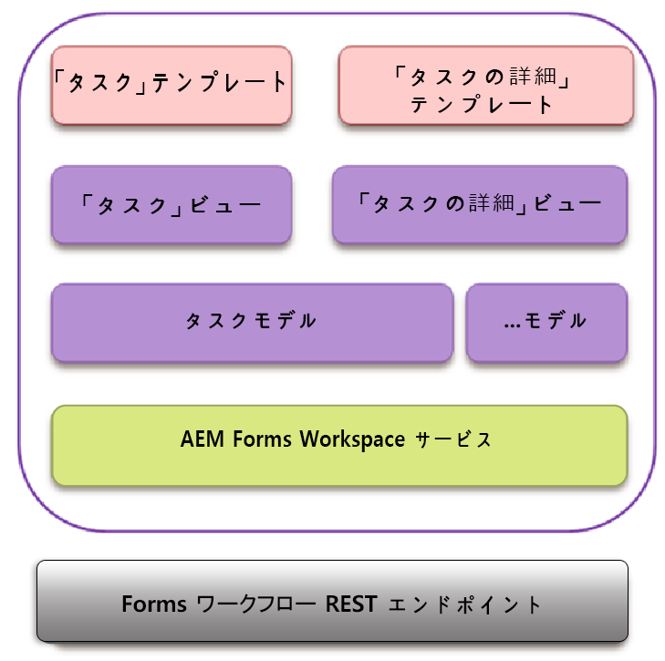

# Backbone インタラクション{#backbone-interaction}

Backbone は、Web アプリケーションで MVC アーキテクチャの作成および追随に役立つライブラリです。Backbone の基本概念は、ユーザーのインターフェイスをモデルによって裏付けられたロジックビューに編成し、モデルを変更する場合はページを作り直すことなく、個々に更新できるようにすることです。For more information about Backbone, see [https://backbonejs.org](https://backbonejs.org/).

いくつかの主要な概念を次に示します。

**Backboneモデル** ：データと、このデータに関連するほとんどのロジックを含みます。

**Backbone表示** ：対応するモデルの状態を表すために使用します。 Backbone ビューは実際にはコントローラと同じように動作します。ユーザーがクリックするなどのユーザーインターフェイスイベントやモデルイベント（データが変更されたなど）をリッスンし、ユーザーインターフェイスを適宜変更します。

**HTMLテンプレート** ：モデルによって入力されたプレースホルダを持つラッパーテンプレート。

**AEM Forms Workspaceには** 、複数の個々のコンポーネントが含まれます。 各コンポーネントは、

* 単一の論理ユーザーインターフェイス要素を表します。
* 同じコンポーネントのコレクションにすることができます。
* Backbone モデル、Backbone ビュー、および HTML テンプレートで構成されています。
* サービスへの参照が含まれています。
* 必要なユーティリティへの参照が含まれています。

コンポーネントが初期化された場合、次のオブジェクトが作成されます。

* コンポーネントに Backbone モデルの新しいインスタンスが作成されます。モデルにサービスが挿入されます。
* Backbone ビューの新しいインスタンスが作成されます。
* 対応するモデルのインスタンス、HTML テンプレート、およびユーティリティがビューに挿入されます。

Backbone ビューには、対応するハンドラとのユーザーインターフェイスインタラクションによって発生する様々なイベントをマップするイベントマップがあります。このマッピングは、コンポーネントが初期化された場合に開始されます。

ビューが初期化された場合、ビューは対応するモデルを呼び出してサーバーからデータを取得します。ビューによって要求されたすべてのデータが使用可能になると、ビューはデータを HTML テンプレートによって指定された形式にレンダリングします。複数の表示が通信のために同じモデルを共有できます。

例：

1. ユーザーはタスクリストでタスクテンプレートをクリックします。
1. タスクビューはクリックをリッスンし、タスクモデルでレンダリング関数を呼び出します。
1. タスクモデルは、その後、AEM Formsサーバーとのすべての通信に共通のポイントであるサービスを呼び出します。
1. サービスクラスは、ajaxを使用してレンダリングメソッドのAEM Forms RESTエンドポイントを呼び出します。
1. この Ajax 呼び出しの成功コールバックはタスクモデルに定義されています。
1. タスクモデルはバックボーンイベントをレンダリング呼び出しが完了した通知として発生させます。
1. 別のビューであるタスクの詳細ビューは、タスクモデルからこのイベントをリッスンします。
1. タスクの詳細ビューはその後、タスクの詳細テンプレートを変更してレンダリングされたタスク（フォーム、詳細、添付ファイル、メモなど）をユーザーに表示します。
