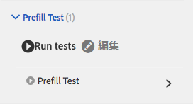

# アダプティブフォームのテスト自動化{#automate-testing-of-adaptive-forms}

## 概要 {#overview}

アダプティブフォームは、顧客とのやり取りを行う上で欠かすことができないものです。新しい修正パックの展開中やフォーム内のルールの変更中など、アダプティブフォームで行った変更をすべてテストすることが重要です。 しかしながら、アダプティブフォームの機能テストおよびすべてのフィールドの機能テストは面倒な作業です。

Calvin を使用すれば Web ブラウザーでアダプティブフォームの自動テストを実行できます。Calvin utilizes [Hobbes](/help/sites-developing/hobbes.md)&#39;s user interface for running the tests and provides the following tools:

* テスト作成用の JavaScript API。
* テスト実行用のユーザーインターフェイス。

Calvin を使用して、CRXDE でテストケースを作成して Web ブラウザーで直接 UI テストを実行し、アダプティブフォームの以下の点について十分にテストすることができます。

<table>
 <tbody>
  <tr>
   <td><strong>テストするアダプティブフォームの機能</strong></td>
   <td><strong>説明</strong></td>
  </tr>
  <tr>
   <td>アダプティブフォームの事前入力機能</td>
   <td>
    <ul>
     <li>フォームはデータモデルのタイプに基づいて予想通りに事前入力されているか。</li>
     <li>フォームオブジェクトのデフォルト値は予想通りに事前入力されているか。</li>
    </ul> </td>
  </tr>
  <tr>
   <td>アダプティブフォームの送信機能</td>
   <td>
    <ul>
     <li>送信時に適切なデータが生成されているか。</li>
     <li>フォームは送信時にサーバー上で再検証されているか。</li>
     <li>フォームに対して設定された送信アクションは実行されているか。</li>
    </ul> </td>
  </tr>
  <tr>
   <td><p>式のルール</p> <p> </p> </td>
   <td>
    <ul>
     <li>関連する UI 操作を実行した後、フォームオブジェクトに関連付けられている式（フィールドを閉じた後のスクリプトの計算、表示、実行など）は実行されているか。<br /> </li>
    </ul> </td>
  </tr>
  <tr>
   <td>検証</td>
   <td>
    <ul>
     <li>操作を実行した後にフィールド検証は予想通りに実行されているか。</li>
    </ul> </td>
  </tr>
  <tr>
   <td><p>遅延読み込み</p> <p> </p> </td>
   <td>
    <ul>
     <li>タブ（またはパネルのナビゲーション項目）をクリックすると、HTML は遅延読み込みの設定ごとにサーバーから取得されているか。</li>
    </ul></td>
  </tr>
  <tr>
   <td><p>UI インタラクション</p> </td>
   <td>
    <ul>
     <li><a href="https://helpx.adobe.com/jp/aem-forms/6-3/calvin-sdk-javascript-api/calvin.html#toc2__anchor" target="_blank">アダプティブフォームオブジェクトでの UI インタラクションのテスト</a></li>
    </ul> </td>
  </tr>
 </tbody>
</table>

### 前提条件 {#prerequisites}

この記事を読んでテストケースを作成する前に、次の内容を理解しておく必要があります。

* Creating test suites and executing test cases using [Hobbes](https://docs.adobe.com/docs/en/aem/6-3/develop/components/hobbes.html)
* [Hobbes JavaScript API](https://docs.adobe.com/docs/en/aem/6-2/develop/ref/test-api/index.html)
* [Calvin JavaScript API](https://helpx.adobe.com/jp/aem-forms/6-3/calvin-sdk-javascript-api/calvin.html)

## 例： Hobbes をテスト用フレームワークとして使用してアダプティブフォームのテストスイートを作成する {#example-create-a-test-suite-for-an-adaptive-form-using-hobbes-as-testing-framework}

次の例では、複数のアダプティブフォームのテスト用にテストスイートを作成する手順を説明しています。テストする必要のある各フォームに対して個別のテストケースを作成します。以下の手順と同じ手順に従って、手順 11 の JavaScript コードを変更し、独自のテストスイートを作成してアダプティブフォームをテストすることができます。

1. Go to CRXDE Lite in your web browser: `https://'[server]:[port]'/crx/de`.
1. /etc/clientlibs サブフォルダーを右クリックして、**作成**／**ノードを作成**&#x200B;をクリックします。名前（ここでは afTestRegistration）を入力し、ノードのタイプを cq:ClientLibraryFolder と指定して「**OK**」をクリックします。

   clientlibs フォルダーには、使用するアプリケーション（JS および Init）の登録機能が含まれています。clientlibs フォルダーには、フォームに固有の Hobbes のすべてのテストスイートオブジェクトを登録することをお勧めします。

1. 次のプロパティ値を、新しく作成したノード（ここでは afTestRegistration）で指定し、「**すべて保存**」をクリックしますこれらのプロパティにより、Hobbes でフォルダーをテストとして認識できます。このクライアントライブラリを他のクライアントライブラリの依存関係として再利用するには、granite.testing.calvin.testsという名前を付けます。

<table>
 <tbody>
  <tr>
   <td>プロパティ</td>
   <td>型</td>
   <td>値</td>
  </tr>
  <tr>
   <td><p>categories</p> </td>
   <td><p>String[]</p> </td>
   <td><p>granite.testing.hobbes.tests, granite.testing.calvin.tests</p> </td>
  </tr>
  <tr>
   <td><p>dependencies</p> </td>
   <td><p>String[]</p> </td>
   <td><p>granite.testing.hobbes.testrunner、granite.testing.calvin、apps.testframework.all</p> </td>
  </tr>
 </tbody>
</table>

>[!NOTE]
>
>granite.testing.calvin.af clientlib には、すべてのアダプティブフォーム API が含まれます。これらの API は、Calvin の名前空間の一部です。


1. Right-click the test node (here **afTestRegistration)** and then click **Create** > **Create File**. ファイル名にjs.txtと入力して、「**OK**」をクリックします。
1. js.txtファイルに、次のテキストを追加します。

   ```javascript
   #base=.
   js.txt
   ```

1. 「**すべて保存**」をクリックして、js.txt ファイルを閉じます。
1. Right-click the test node (here **afTestRegistration)** and click **Create** > **Create File**. ファイル名に「init.js」と入力して、「**OK**」をクリックします。
1. Copy the following code to the init.js file and click **Save All**:

   ```javascript
   (function(window, hobs) {
       'use strict';
       window.testsuites = window.testsuites || {};
     // Registering the test form suite to the sytem
     // If there are other forms, all registration should be done here
       window.testsuites.testForm = new hobs.TestSuite("Adaptive Form - Demo Test", {
           path: '/etc/clientlibs/afTestRegistration/init.js',
           register: true
       });
    // window.testsuites.testForm1 = new hobs.TestSuite("testForm1");
   }(window, window.hobs));
   ```

   上記のコードを使用すると、**Adaptive Form - Demo Test** という名前のテストスイートが作成されます。別の名前でテストスイートを作成するには、それに応じて名前を変更します。

1. **作成**／**ノードを作成**&#x200B;をクリックし、テストを行う各フォームの clientlib フォルダーの下にノードを作成します。この例では、**testForm** という名前のノードを使用して、**testForm** という名前のアダプティブフォームをテストします。次のプロパティを指定して「**OK**」をクリックします。

   * 名前：testForm（使用するフォーム名）
   * タイプ：cq:ClientLibraryFolder

1. 新たに追加作成されたノード（ここでは「testForm」）に対して、次のプロパティを追加し、アダプティブフォームをテストします。

   | **プロパティ** | **タイプ** | **値** |
   |---|---|---|
   | categories | String[] | granite.testing.hobbes.tests、granite.testing.hobbes.tests.testForm |
   | dependencies | String[] | granite.testing.calvin.tests |

   >[!NOTE]
   >
   >この例では、管理を改善するために、クライアントlib granite.testing.calvin.testsへの依存関係を使用しています。 また、必要に応じてクライアントライブラリカテゴリ「granite.testing.hobbes.tests.testForm」を追加して、このクライアントライブラリを再使用しています。

   

1. テストフォーム用に作成したフォルダー（ここでは testForm）を右クリックし、**作成**／**ファイルを作成**&#x200B;を選択します。ファイルに scriptingTest.js と名前を付けて、次のコードをファイルに追加して「**すべて保存**」をクリックします。

   次のコードを使用して別のアダプティブフォームをテストするには、**navigateTo**（行 11、36、62）および個々のテストケースで、フォームのパスと名前を変更します。For more information on APIs for testing different aspects of forms and form objects, see [Calvin APIs](https://helpx.adobe.com/jp/aem-forms/6-3/calvin-sdk-javascript-api/calvin.html).

   ```javascript
   (function(window, hobs) {
       'use strict';
   
    var ts = new hobs.TestSuite("Script Test", {
           path: '/etc/clientlibs/testForm/scriptingTest.js',
     register: false
    })
   
       .addTestCase(new hobs.TestCase("Checking execution of calculate script")
           // navigate to the testForm which is to be tested
           .navigateTo("/content/forms/af/testForm.html?wcmmode=disabled")
           // check if adaptive form is loaded
           .asserts.isTrue(function () {
               return calvin.isFormLoaded()
           })
           .execSyncFct(function () {
               // create a spy before checking for the expression
               calvin.spyOnExpression("panel1.textbox1");
               // setValue would trigger enter, set the value and exit from the field
               calvin.setValueInDOM("panel1.textbox", "5");
           })
           // if the calculate expression was setting "textbox1" value to "5", let's also check that
           .asserts.isTrue(function () {
               return calvin.isExpressionExecuted("panel1.textbox1", "Calculate");
           })
           .execSyncFct(function () {
               calvin.destroySpyOnExpression("panel1.textbox1");
           })
           .asserts.isTrue(function () {
               return calvin.model("panel1.textbox1").value == "5"
           })
       )
   
       .addTestCase(new hobs.TestCase("Calculate script Test")
           // navigate to the testForm which is to be tested
           .navigateTo("/content/forms/af/cal/demoform.html?wcmmode=disabled&dataRef=crx:///content/forms/af/cal/prefill.xml")
           // check if adaptive form is loaded
           .asserts.isTrue(function () {
               return calvin.isFormLoaded()
           })
   
           .execSyncFct(function () {
               // create a spy before checking for the expression
               calvin.spyOnExpression("panel2.panel1488218690733.downPayment");
               // setValue would trigger enter, set the value and exit from the field
               calvin.setValueInDOM("panel2.panel1488218690733.priceProperty", "1000000");
           })
           .asserts.isTrue(function () {
               return calvin.isExpressionExecuted("panel2.panel1488218690733.downPayment", "Calculate");
           })
           .execSyncFct(function () {
               calvin.destroySpyOnExpression("panel2.panel1488218690733.downPayment");
           })
           .asserts.isTrue(function () {
               // if the calculate expression was setting "downPayment" value to "10000", let's also check that
      return calvin.model("panel2.panel1488218690733.downPayment").value == 10000
           })
       )
   
       .addTestCase(new hobs.TestCase("Checking execution of Value commit script")
           // navigate to the testForm which is to be tested
           .navigateTo("/content/forms/af/cal/demoform.html?wcmmode=disabled&dataRef=crx:///content/forms/af/cal/prefill.xml")
           // check if adaptive form is loaded
           .asserts.isTrue(function () {
               return calvin.isFormLoaded()
           })
   
           .execSyncFct(function () {
               // create a spy before checking for the expression
               calvin.spyOnExpression("panel2.panel1488218690733.priceProperty");
               // setValue would trigger enter, set the value and exit from the field
               calvin.setValueInDOM("panel2.panel1488218690733.priceProperty", "100");
           })
           .asserts.isTrue(function () {
               return calvin.isExpressionExecuted("panel2.panel1488218690733.priceProperty", "Value Commit");
           })
           .execSyncFct(function () {
               calvin.destroySpyOnExpression("panel2.panel1488218690733.priceProperty");
           })
           .asserts.isTrue(function () {
            // if the value commit expression was setting "textbox1488215618594" value to "0", let's also check that
               return calvin.model("panel2.panel1488218690733.textbox1488215618594").value == 0
           })
       );
   
    // register the test suite with testForm
     window.testsuites.testForm.add(ts);
   
    }(window, window.hobs));
   ```

   テストケースが作成されます。Hobbes経由でアダプティブフォームをテストする場合は、テストケースの実行に進みます。 For steps for running the test cases, see [Executing Tests in Testing Your UI Using Automated Tests](/help/sites-developing/hobbes.md).

また、添付ファイル SampleTestPackage.zip に含まれるパッケージをインストールすれば、「例： Hobbes をテスト用フレームワークとして使用してアダプティブフォームのテストスイートを作成する」で説明した手順の結果と同じ結果を得ることができます。

[ファイルを入手](assets/sampletestpackage.zip)

## 自動テストを使用した UI 文字列のテスト {#testing-your-ui-using-automated-tests}

### 1 つのテストスイートの実行 {#running-a-single-test-suite}

テストスイートは個別に実行できます。1 つのテストスイートを実行すると、テストケースとそのアクションの実行に応じてページが変化し、テストの完了後に結果が表示されます。アイコンによって結果が示されます。

チェックマークアイコンは、成功したテストを示します。 

An &quot;X&quot; icon indicates a failed test: 

1 つのテストスイートを実行するには：

1. テストパネルで、実行するテストケースの名前をクリックまたはタップして、アクションの詳細を展開します。

   

1. 「テストを実行」ボタンをクリックまたはタップします。 

   

1. テストが実行されると、プレースホルダーはページコンテンツに置き換えられます。

   

1. 説明をタップまたはクリックして結果パネルを開いて、テストケースの結果を確認します。結果パネルでテストケースの名前をタップまたはクリックすると、すべての詳細が表示されます。

   

AEM アダプティブフォームのテスト手順は、AEM UI のテスト手順と同じです。アダプティブフォームのテストについて詳しくは、「[UI のテスト](https://helpx.adobe.com//experience-manager/6-3/help/sites-developing/hobbes.html)」で以下のセクションを参照してください。

* テストスイートの表示
* 複数のテストの実行

## 用語集 {#glossary}

<table>
 <tbody>
  <tr>
   <td><strong>用語</strong></td>
   <td><strong>説明</strong></td>
  </tr>
  <tr>
   <td><p>テストスイート</p> </td>
   <td><p>テストスイートは関連するテストケースのコレクションです。</p> </td>
  </tr>
  <tr>
   <td><p>テストケース</p> </td>
   <td><p>テストケースは、ユーザーが UI を使用して実行するタスクを表します。テストスイートにテストケースを追加して、ユーザーが実行するアクティビティをテストします。</p> </td>
  </tr>
  <tr>
   <td><p>アクション</p> </td>
   <td><p>アクションとは、UI でジェスチャ（ボタンのクリックや入力ボックスへの値の入力など）を実行するメソッドです。</p> <p>hobs.actions.Asserts、hobs.actions.Core、hobs.utils.af クラスのメソッドが、テストで使用できるアクションです。すべてのアクションは同期的に実行されます。</p> </td>
  </tr>
  <tr>
   <td><p>オーサー環境とパブリッシュ環境</p> </td>
   <td><p>一般的に、フォームはオーサー環境またはパブリッシュ環境のいずれかでテストできます。パブリッシュ環境の場合、デフォルトではテストを実行するためにアクセスは制限されています。これは、テスト実行者に関連するすべてのクライアントライブラリが、JCR 構造のライブラリにあるためです。</p> </td>
  </tr>
 </tbody>
</table>

