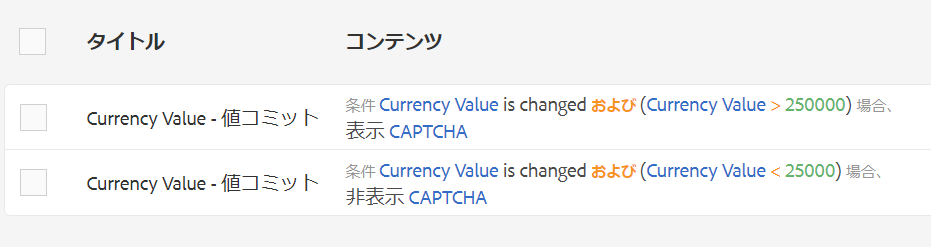
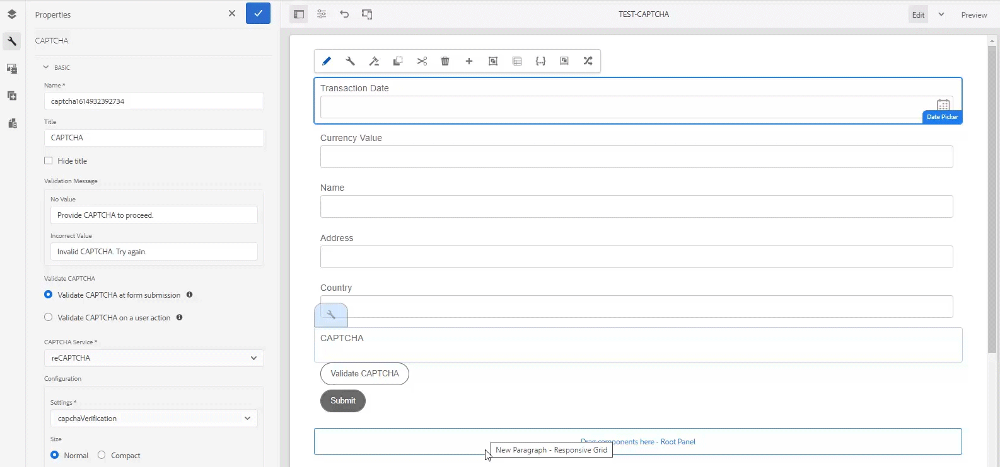

# アダプティブフォームの CAPTCHA の使用{#using-captcha-in-adaptive-forms}

CAPTCHA（Completely Automated Public Turing test to tell Computers and Humans Apart）は、オンライントランザクションにおいて人間と自動プログラムやボットとを区別するために一般的に使用されるプログラムです。テストを行ってユーザーの反応を評価し、サイトを使用しているのが人間かボットかを判断します。これにより、テストに失敗した場合ユーザーは続行できないため、ボットによるスパムの投稿や悪意のある目的を防止し、オンライントランザクションを安全に保ちます。

AEM によるアダプティブフォームの CAPTCHA のサポートGoogleのreCAPTCHAサービスを使用して、CAPTCHAを実装できます。

>[!NOTE]
>
>* AEM Forms は reCaptcha v2 のみをサポートします。その他のバージョンはサポートされません。
>* アダプティブフォームの CAPTCHA は、AEM Forms アプリケーションのオフラインモードではサポートされていません。

>


## Google が提供する reCAPTCHA サービスの設定  {#google-recaptcha}

フォームの作成者は、Google による reCAPTCHA サービスを使用してアダプティブフォームに CAPTCHA を実装することができます。これにより、サイトを保護する高度な CAPTCHA 機能が提供されます。reCAPTCHA の仕組みについて詳しくは、「[Google reCAPTCHA](https://developers.google.com/recaptcha/)」を参照してください。


AEM Forms で reCAPTCHAを実装するには：

1. Google から [reCAPTCHA API キーペア](https://www.google.com/recaptcha/admin)を取得します。これにはサイトキーと秘密鍵が含まれます。
1. クラウドサービス用の設定コンテナを作成します。

   1. **[!UICONTROL ツール/一般/設定ブラウザー]**&#x200B;に移動します。
      * 詳しくは、[設定ブラウザー](/help/sites-administering/configurations.md)のドキュメントを参照してください。
   1. 以下の手順を実行して、global フォルダーをクラウド設定用に有効にします。クラウドサービス設定用に別のフォルダーを作成する場合は、この手順をスキップしてください。

      1. 設定ブラウザーで、「**[!UICONTROL global]**」フォルダーを選択して「**[!UICONTROL プロパティ]**」をタップします。

      1. 設定プロパティダイアログで、「**[!UICONTROL クラウド設定]**」を有効にします。
      1. 「**[!UICONTROL 保存して閉じる]**」をタップして設定内容を保存し、ダイアログを閉じます。
   1. 設定ブラウザーで「**[!UICONTROL 作成]**」をタップします。
   1. 設定を作成ダイアログでフォルダーのタイトルを指定し、「**[!UICONTROL クラウド設定]**」を有効にします。
   1. 「**[!UICONTROL 作成]**」をタップして、クラウドサービス設定用に有効なフォルダーを作成します。


1. reCAPTCHA のクラウドサービスを設定します。

   1. AEMオーサーインスタンスで、 > **Cloud Services**&#x200B;に移動します。
   1. 「**[!UICONTROL reCAPTCHA]**」をタップします。設定ページが表示されます。上記の手順で作成した設定コンテナを選択し、「**[!UICONTROL 作成]**」をタップします。
   1. reCAPTCHAサービスの名前、サイトキー、秘密キーを指定し、「**[!UICONTROL 作成]**」をタップして、クラウドサービスの設定を作成します。
   1. コンポーネントを編集ダイアログで、サイトおよび手順 1 で取得した秘密鍵を指定します。「**設定を保存**」をタップし、「**OK**」をタップして設定を完了します。

   reCAPTCHA サービスを設定すると、アダプティブフォームで使用できるようになります。詳しくは、「[アダプティブフォームの CAPTCHA の使用](#using-captcha)」を参照してください。

## アダプティブフォームで CAPTCHA を使用する  {#using-captcha}

アダプティブフォームで CAPTCHA を使用するには：

1. アダプティブフォームを編集モードで開きます。

   >[!NOTE]
   >
   >アダプティブフォームの作成時に選択した設定コンテナに、reCAPTCHA クラウドサービスが含まれていることを確認してください。アダプティブフォームのプロパティを編集して、そのアダプティブフォームに関連付けられている設定コンテナを変更することもできます。

1. コンポーネントブラウザーから&#x200B;**Captcha** コンポーネントを、アダプティブフォームにドラッグアンドドロップしますす。

   >[!NOTE]
   >
   >アダプティブフォームにおける複数の Captcha コンポーネントの使用はサポートされていません。また、遅延読み込みとしてマークされているパネルやフラグメント内のパネルで CAPTCHA を使用することはお勧めしません。

   >[!NOTE]
   >
   >Captcha は、約 1 分間で期限切れになります。そのため、アダプティブフォームに「送信」ボタンを配置する直前に Captcha コンポーネントを配置することをお勧めします。

1. 追加したCaptchaコンポーネントを選択し、をタップしてプロパティを編集します。
1. CAPTCHA ウィジェットのタイトルを指定します。デフォルト値は&#x200B;**Captcha**&#x200B;です。 タイトルを表示しない場合は、「**タイトルを非表示にする**」を選択します。
1. **Captcha service**&#x200B;ドロップダウンから、**reCaptcha**&#x200B;を選択し、Google](#google-recaptcha)による[ReCAPTCHAサービスの説明に従ってreCAPTCHAサービスを設定した場合に、このサービスを有効にします。 「設定」ドロップダウンから設定を選択します。また、reCAPTCHA ウィジェットのサイズを「**標準**」または「**コンパクト**」から選択します。

   >[!NOTE]
   >
   >デフォルトの AEM CAPTCHA サービスは非推奨であるため、「Captcha サービス」ドロップダウンで「**[!UICONTROL デフォルト]**」を選択しないでください。

1. 各プロパティを保存します。

アダプティブフォーム上で reCAPTCHA サービスが有効になります。フォームをプレビューして、CAPTCHA が機能していることを確認できます。

### ルール{#show-hide-captcha}に基づいてCAPTCHAコンポーネントを表示/非表示

アダプティブフォームのコンポーネントに適用するルールに基づいて、CAPTCHAコンポーネントの表示/非表示を切り替えることができます。 コンポーネントをタップし、「」を選択し、「**[!UICONTROL 作成]**」をタップしてルールを作成します。 ルールの作成について詳しくは、「[ルールエディター](rule-editor.md)」を参照してください。

例えば、CAPTCHAコンポーネントは、フォームの通貨の値フィールドの値が25000を超える場合にのみ、アダプティブフォームに表示する必要があります。

フォームの「**[!UICONTROL 通貨値]**」フィールドをタップし、次のルールを作成します。



### CAPTCHA を検証 {#validate-captcha}

アダプティブフォーム内のCAPTCHAは、フォームを送信するとき、またはユーザーの操作や条件に基づいてCAPTCHA検証を行うときに検証できます。

#### フォーム送信時のCAPTCHAの検証{#validation-form-submission}

アダプティブフォームの送信時にCAPTCHAを自動的に検証するには：

1. CAPTCHAコンポーネントをタップし、を選択して、コンポーネントのプロパティを表示します。
1. 「**[!UICONTROL CAPTCHAを検証]**」セクションで、「**[!UICONTROL フォーム送信時にCAPTCHAを検証]**」を選択します。
1. 「」をタップして、コンポーネントのプロパティを保存します。

#### ユーザーの操作と条件に対するCAPTCHAの検証{#validate-captcha-user-action}

条件とユーザー操作に基づいてCAPTCHAを検証するには：

1. CAPTCHAコンポーネントをタップし、を選択して、コンポーネントのプロパティを表示します。
1. 「**[!UICONTROL CAPTCHAを検証]**」セクションで、「**[!UICONTROL ユーザーアクション]**&#x200B;でCAPTCHAを検証します」を選択します。
1. 「」をタップして、コンポーネントのプロパティを保存します。

[!DNL Experience Manager Forms] は、事前定義済みの条件を使用してCAPTCHAを検証する `ValidateCAPTCHA` APIを提供します。このAPIは、カスタム送信アクションを使用するか、アダプティブフォームのコンポーネントにルールを定義することで呼び出すことができます。

次の例は、事前定義された条件を使用してCAPTCHAを検証する`ValidateCAPTCHA` APIの例です。

```javascript
if (slingRequest.getParameter("numericbox1614079614831").length() >= 5) {
    	GuideCaptchaValidatorProvider apiProvider = sling.getService(GuideCaptchaValidatorProvider.class);
        String formPath = slingRequest.getResource().getPath();
        String captchaData = slingRequest.getParameter(GuideConstants.GUIDE_CAPTCHA_DATA);
        if (!apiProvider.validateCAPTCHA(formPath, captchaData).isCaptchaValid()){
            response.setStatus(400);
            return;
        }
    }
```

この例は、フォームの入力時にユーザーが指定した数値ボックスの桁数が5より大きい場合にのみ、`ValidateCAPTCHA` APIがフォームのCAPTCHAを検証することを示しています。

**オプション1:ValidateCAPTCHA APIを使用して、カスタム送信アクションを使用してCAPTCHAを検証する [!DNL Experience Manager Forms]**

`ValidateCAPTCHA` APIを使用してカスタム送信アクションを使用してCAPTCHAを検証するには、次の手順を実行します。

1. カス追加タム送信アクションへの`ValidateCAPTCHA` APIを含むスクリプト。 カスタム送信アクションについて詳しくは、[アダプティブForms用のカスタム送信アクションの作成](custom-submit-action-form.md)を参照してください。
1. アダプティブフォームの&#x200B;**[!UICONTROL 送信]**&#x200B;プロパティの&#x200B;**[!UICONTROL 送信アクション]**&#x200B;ドロップダウンリストから、カスタム送信アクションの名前を選択します。
1. 「**[!UICONTROL 送信]**」をタップします。 CAPTCHAは、カスタム送信アクションの`ValidateCAPTCHA` APIで定義された条件に基づいて検証されます。

**オプション2:フォームを送信する前に、 [!DNL Experience Manager Forms] ValidateCAPTCHA APIを使用してユーザーアクションに対するCAPTCHAの検証を行う**

また、アダプティブフォーム内のコンポーネントにルールを適用することで、`ValidateCAPTCHA` APIを呼び出すこともできます。

例えば、アダプティブフォームに「**[!UICONTROL CAPTCHAを検証]**」ボタンを追加し、ボタンをクリックするとサービスを呼び出すルールを作成します。

次の図は、「**[!UICONTROL Validate CAPTCHA]**」ボタンをクリックしてサービスを呼び出す方法を示しています。



`ValidateCAPTCHA` APIを含むカスタムサーブレットをルールエディターを使用して呼び出し、検証結果に基づいてアダプティブフォームの送信ボタンを有効または無効にすることができます。

同様に、ルールエディターを使用して、アダプティブフォーム内のCAPTCHAを検証するカスタムメソッドを含めることができます。

### 追加カスタムCAPTCHAサービス{#add-custom-captcha-service}

[!DNL Experience Manager Forms] は、CAPTCHAサービスとしてreCAPTCHAを提供します。ただし、**[!UICONTROL CAPTCHA Service]**&#x200B;ドロップダウンリストに表示するカスタムサービスを追加できます。

以下は、アダプティブフォームにCAPTCHAサービスを追加するためのインターフェイスの実装例です。

```javascript
package com.adobe.aemds.guide.service;

import org.osgi.annotation.versioning.ConsumerType;

/**
 * An interface to provide captcha validation at server side in Adaptive Form
 * This interface can be used to provide custom implementation for different captcha services.
 */
@ConsumerType
public interface GuideCaptchaValidator {
    /**
     * This method should define the actual validation logic of the captcha
     * @param captchaPropertyNodePath path to the node with CAPTCHA configurations inside form container
     * @param userResponseToken  The user response token provided by the CAPTCHA from client-side
     *
     * @return  {@link GuideCaptchaValidationResult} validation result of the captcha
     */
     GuideCaptchaValidationResult validateCaptcha(String captchaPropertyNodePath, String userResponseToken);

    /**
     * Returns the name of the captcha validator. This should be unique among the different implementations
     * @return  name of the captcha validator
     */
     String getCaptchaValidatorName();
}
```

`captchaPropertyNodePath` は、Slingリポジトリ内のCAPTCHAコンポーネントのリソースパスを参照します。CAPTCHAコンポーネントに固有の詳細を含めるには、このプロパティを使用します。 例えば、`captchaPropertyNodePath`には、CAPTCHAコンポーネントで設定されたreCAPTCHAクラウド設定に関する情報が含まれます。 クラウド設定情報は、reCAPTCHAサービスを実装するための&#x200B;**[!UICONTROL サイトキー]**&#x200B;と&#x200B;**[!UICONTROL 秘密キー]**&#x200B;の設定を提供します。

`userResponseToken` は、フォーム `g_recaptcha_response` 内のCAPTCHAを解決した後に生成されるを指します。
