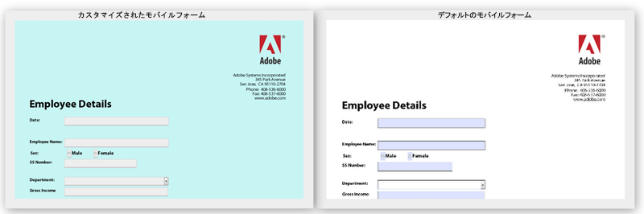

# HTML5 フォームのデフォルトスタイルの変更{#changing-default-styles-of-html-forms}

HTML5 フォームは HTML5 機能の使用によりレンダリングされ、レンダリングされるフォームのスタイル設定は CSS の使用によって実行されます。HTML5 フォームのデフォルトの外観は、その PDF レンダリングに似ています。開発者はカスタム CSS を使用して、HTML5 フォームのデフォルトの外観を変更できます。

This article provides step-by-step information to change style of an HTML5 form and [Introduction to Styles](/help/forms/using/css-styles.md) article contains detailed information about various styling aspects of HTML5 forms. この記事に記載されている手順を実行する前に、「スタイルの概要」の記事を必ずお読みください。

次の 2 つの画像はデフォルトのスタイルとカスタマイズされたスタイルの違いを示しています。

## フォームのスタイル設定 {#style-your-forms}

1. **カスタムスタイルを追加するプロファイルの選択**

   Access the CRX DE interface at the URL: **https://&lt;server>:&lt;port>/crx/de** and create a profile or choose an existing profile. To know how to create a profile, see [Creating a new Profile](/help/forms/using/custom-profile.md)

1. **HTML5 フォームのスタイル設定用の CSS スタイルシートの作成**

   プロファイルレンダラーを作成したフォルダーに移動し、CSS スタイルシートファイルを作成します。次の手順に従います。

   1. Right click the folder and select **create** > **create File** from the menu

   1. 「ファイルを作成」ダイアログで、スタイルシートの名前を入力します。拡張子 .css を必ず使用してください (例： stylesheet.css)。
   1. ナビゲーションペインで、作成したCSSファイルを開きます。
   1. スタイル設定するコンポーネントの CSS クラスを定義し、それらのクラスにスタイルを追加します。
   HTML5 フォームにある特定のコンポーネントに対してどの CSS クラスを作成するかについて詳しくは、「[スタイルの概要](/help/forms/using/css-styles.md)」を参照してください。

1. **Profile Renderer にスタイルシートを追加する**

   CRX DE でプロファイルレンダラーページ（jsp ファイル）を開き、CSS ファイルを XFA クライアントライブラリのすぐ下にあるページに含めます。次の手順を実行して、CSS ファイルをプロファイルに含めます。

   1. レンダラーページで次の行を検索します。

      &lt;cq:includeClientLib categories=&quot;xfaforms.profile&quot; />

   1. 次の行を上記の行の下に挿入して、スタイルシートを含めます。

      &lt;link href=&quot;/path/to/stylesheet&quot; rel=&quot;stylesheet&quot; type=&quot;text/css&quot;/>

   1.  ファイルを保存します。
