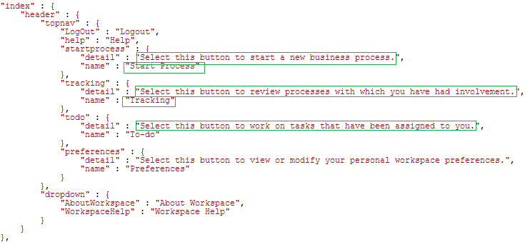

# AEM Forms Workspace ユーザーインターフェイスのロケールの変更{#changing-the-locale-of-aem-forms-workspace-user-interface}

AEM Formsワークスペースでは、英語、フランス語、ドイツ語、日本語のサポートがすぐに利用できます。 また、AEM Formsワークスペースユーザーインターフェイスを他の言語にローカライズする機能も提供します。

AEM Formsワークスペースユーザーインターフェイスを任意の言語にローカライズするには：

* AEM Forms Workspace のテキストをローカライズします。
* 折りたたまれているカテゴリ、キュー、およびプロセスをローカライズする。
* 日付選択をローカライズする。

Before performing above steps, ensure that you follow the steps listed at [Generic steps for AEM Forms workspace customization](../../forms/using/generic-steps-html-workspace-customization.md).

>[!NOTE]
>
>AEM Forms Workspace のログイン画面の言語を変更するには、「[新しいログイン画面の作成](../../forms/using/creating-new-login-screen.md)」を参照してください。

## テキストのローカライズ {#localizing-text}

Perform the following steps to add support for a language *New* and the browser locale code *nw*.

1. CRXDE Lite にログインします。The default URL of CRXDE Lite is `https://'[server]:[port]'/lc/crx/de/index.jsp`.
1. Navigate to the location `apps/ws/locales` and create a new folder `nw.`
1. その場所 `translation.json`から場所にファイル `/apps/ws/locales/en-US` をコピーし `/apps/ws/locales/nw` ます。
1. Navigate to `/apps/ws/locales/nw` and open `translation.json` for editing. translation.json ファイルにロケール固有の変更を行います。

   次の例では、AEM Forms Workspace の英語およびフランス語のロケールの translation.json ファイルを示します。

    

## 折りたたまれているカテゴリ、キュー、およびプロセスのローカライズ {#localizing-collapsed-categories-queues-and-processes}

AEM Formsワークスペースは、カテゴリ、キューおよびプロセスのヘッダーを表示するために画像を使用します。 これらのヘッダをローカライズするには、開発パッケージが必要です。For detailed information about creating development package, see [Building AEM Forms workspace code.](introduction-customizing-html-workspace.md#building-html-workspace-code)

次の手順では、新しくローカライズされた画像ファイルは&#x200B;*Categories_nw.png*、*Queue_nw.png*、および *Processes_nw.png* であると想定しています。画像の推奨される幅は19pxです。

>[!NOTE]
>
>お使いのブラウザのブラウザ言語ロケールコードを検索するには、次のようにします。開く `https://'[server]:[port]'/lc/libs/ws/Locale.html`.


次の手順を実行して画像をローカライズします。

1. WebDAV クライアントを使用して、画像ファイルを */apps/ws/images* フォルダーに配置します。
1. */apps/ws/css* に移動します。*newStyle.css* を開いて編集し、次のエントリを追加します。

   ```css
   #categoryListBar .content.nw {
        background: #3e3e3e url(../images/Categories_nw.png) no-repeat 10px 10px;
    }
   
   #filterListBar .content.nw {
       background: #3e3e3e url(../images/Queues_nw.png) no-repeat 10px 10px;
   }
   
   #processNameListBar .content.nw {
       background: #3e3e3e url(../images/Processes_nw.png) no-repeat 10px 10px;
   }
   ```

1. Perform all the semantic changes listed in the [Workspace Customization](../../forms/using/introduction-customizing-html-workspace.md) article.
1. */js/runtime/utility* フォルダーに移動し、*usersession.js* ファイルを開いて編集します。
1. 元のコードブロックに一覧表示されているコードを探して、if ステートメントに条件 *lang !== &#39;nw&#39;* to the if statement:

   ```javascript
   // Orignal code
   setLocale = function () {
           var lang = $.trim(i18n.lng());
           if (lang === null || lang === '' || (lang !== 'fr-FR' && lang !== 'de-DE' && lang !== 'ja-JP')) {
               window.lcWorkspace.locale = 'en-US';
           } else {
               window.lcWorkspace.locale = lang;
           }
       }
   ```

   ```javascript
   //new code
    setLocale = function () {
           var lang = $.trim(i18n.lng());
           if (lang === null || lang === '' || (lang !== 'fr-FR' && lang !== 'de-DE' && lang !== 'ja-JP' && lang !== 'nw')) {
               window.lcWorkspace.locale = 'en-US';
           } else {
               window.lcWorkspace.locale = lang;
           }
       }
   ```

## 日付選択のローカライズ {#localizing-date-picker}

*日付選択* API をローカライズするには、開発パッケージが必要です。For detailed information about creating development package, see [Building AEM Forms workspace code](introduction-customizing-html-workspace.md#building-html-workspace-code).

1. [jQuery UI パッケージ](https://jqueryui.com/download/all/)をダウンロードして抽出し、*&lt;抽出された jquery UI パッケージ>*\jquery-ui-1.10.2.zip\jquery-ui-1.10.2\ui\i18n に移動します。
1. ロケールコード nw の jquery.ui.datepicker-nw.js ファイルを apps/ws/js/libs/jqueryui にコピーして、ファイルにロケール固有の変更を行います。
1. Navigate to `apps/ws/js` and open the `jquery.ui.datepicker-nw.js` file for editing.
1. main.jsファイルで、ファイルのエイリアスを作成 `jquery.ui.datepicker-nw.js.` するコードは次のとおりです。 `jquery.ui.datepicker-nw.js` ファイルのエイリアスを作成します。

   ```javascript
   jqueryuidatepickernw : pathprefix + 'libs/jqueryui/jquery.ui.datepicker-nw'
   ```

1. Use alias `jqueryuidatepickernw` to include the `jquery.ui.datepicker-nw.js` file in all the files that use datepicker. 日付選択は次のファイルで使用されます。

   * `js/runtime/views/outofoffice.js`
   * `js/runtime/views/searchtemplatedetails.js`

   以下のサンプルコードは、jquery.ui.datepicker-nw.js のエントリを追加する方法を示します。

   ```json
   //Original Code
   define([
       'jquery',
       'underscore',
       'backbone',
       'jqueryui',
       'jqueryuidatepickerja',
       'jqueryuidatepickerde',
       'jqueryuidatepickerfr',
       'slimscroll',
       'usersearchview',
       'logmanagerutil',
       'loggerutil'
   ], function ($, _, Backbone, jQueryUI, jQueryUIDatePickerJA, jQueryUIDatePickerDE, jQueryUIDatePickerFR, slimScroll, UserSearch, LogManager, Logger) {
   ```

   ```json
   // Code with Date Picker alias for new language
   define([
       'jquery',
       'underscore',
       'backbone',
       'jqueryui',
       'jqueryuidatepickerja',
       'jqueryuidatepickerde',
       'jqueryuidatepickerfr',
       'jqueryuidatepickernw', // Date Picker alias
       'slimscroll',
       'usersearchview',
       'logmanagerutil',
       'loggerutil'
   ], function ($, _, Backbone, jQueryUI, jQueryUIDatePickerJA, jQueryUIDatePickerDE, jQueryUIDatePickerFR, jQueryUIDatePickerNW, slimScroll, UserSearch, LogManager, Logger) {
   ```

1. 日付選択 API を使用するすべてのファイルで、デフォルトの日付選択 API の設定を変更します。日付選択 API は次のファイルで使用されます。

   * apps\ws\js\runtime\views\searchtemplatedetails.js
   * apps\ws\js\runtime\views\outofoffice.js

   次のコードを変更して新しいロケールを追加します。

   ```javascript
   if (locale === 'ja-JP') {
      $.datepicker.setDefaults($.datepicker.regional.ja);
   } else if (locale === 'de-DE') {
      $.datepicker.setDefaults($.datepicker.regional.de);
   } else if (locale === 'fr-FR') {
      $.datepicker.setDefaults($.datepicker.regional.fr);
   } else {
      $.datepicker.setDefaults($.datepicker.regional['']);
   }
   ```

   ```javascript
   if (locale === 'ja-JP') {
       $.datepicker.setDefaults($.datepicker.regional.ja);
   } else if (locale === 'de-DE') {
       $.datepicker.setDefaults($.datepicker.regional.de);
   } else if (locale === 'fr-FR') {
       $.datepicker.setDefaults($.datepicker.regional.fr);
   } else if (locale === 'nw') {
       $.datepicker.setDefaults($.datepicker.regional.nw);
   } else {
       $.datepicker.setDefaults($.datepicker.regional['']);
   }
   ```
