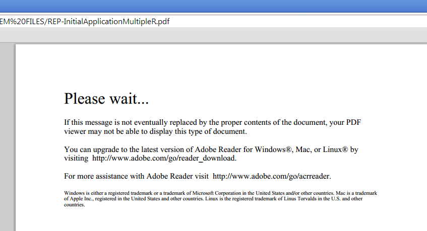

# Designer での Page Zero コンテンツの変更 {#changing-page-zero-content-in-designer}

Page Zero content is displayed by default when a non-Adobe PDF viewer, such as the default PDF viewer in [!DNL Chrome] or [!DNL Firefox], cannot read the content of the PDF/XFA form. デフォルトの Page Zero メッセージは、次のとおりです。

[!DNL AEM Forms] バージョンのDesignerでは、Page Zeroに表示されるメッセージを変更できます。 Page Zero メッセージを変更するには、次の手順を実行します。

1. Ensure that you have the [!DNL AEM Forms] version of Designer installed. Designer の「バージョン情報」画面で、バージョンを確認することができます。

1. Page Zero コンテンツを変更するフォームを開きます。

1. Click **[!UICONTROL File]** > **[!UICONTROL Form Properties]**.

1. In the [!UICONTROL Form Properties] dialog, click  (Plus icon) to add a custom property.

1. プロパティの名前として **_pagezerocontent** を指定します。
1. 新しい Page Zero メッセージを、リッチテキスト形式で値として追加します。次に例を示します。

   `<body xmlns="https://www.w3.org/1999/xhtml" xmlns:xfa="https://www.xfa.org/schema/xfa-data/1.0/">
 </code>

You are seeing this message maybe because you are using a non Adobe PDF Viewer or an Old version of Adobe Reader. You can upgrade to the latest version of Adobe Reader for Windows, Mac, or Linux by visiting  </code>https://www.adobe.com/go/reader_download.

 </code>

For more assistance with Adobe Reader visit  </code>https://www.adobe.com/go/acrreader.
</body>`

1. フォームを PDF として保存します。

1. PDF フォームをブラウザーで表示して、メッセージが更新されたことを確認します。上述の例は、次のように表示されます。

   

>[!NOTE]
>
>フォームを再度開いたときに、作成したカスタムプロパティがフォームプロパティダイアログに正しく表示されない場合があります。その場合でも、動作には問題ありません。フォームには、更新後の Page Zero メッセージが表示されます。
