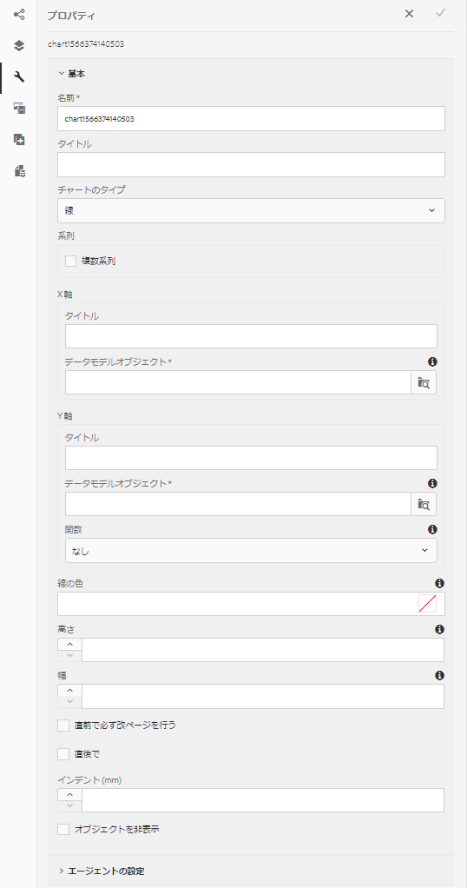
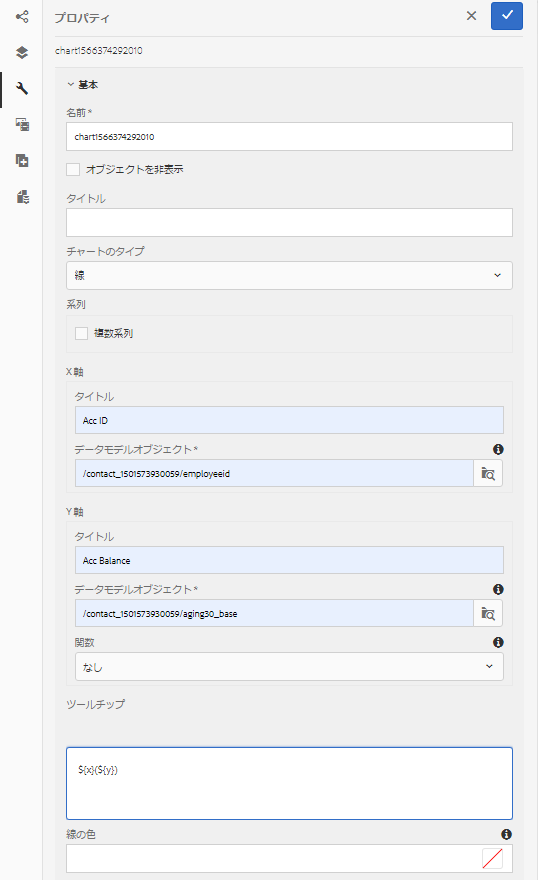
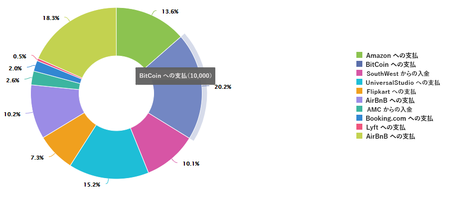

# インタラクティブ通信内でグラフを使用する{#using-charts-in-interactive-communications}

表やグラフはデータを視覚的に表現します。インタラクティブ通信で大量の情報を分かりやすい視覚的な形式で表現することにより、複雑なデータを視覚的に理解して分析することができます。

インタラクティブ通信を作成する際にグラフを追加することにより、インタラクティブ通信のフォームデータモデルから取得した 2 次元のデータを視覚的に表現することができます。グラフコンポーネントを使用すると、次のタイプのグラフを追加および設定できます。円グラフ、列グラフ、ドーナツグラフ、棒グラフ、線グラフ、線グラフ、ポイントグラフ、ポイントグラフ、領域グラフ、四半円グラフなどがあります。

## Add and configure chart in an Interactive Communication {#add-and-configure-chart-in-an-interactive-communication}

次の手順を実行して、Interactive Communicationでグラフを追加および設定します。

1. インタラク **ティブ通信** (Interactive Communication)のサイドキックから「コンポーネント」をタップします。
1. グラフコンポーネントを **次の** 1つのコンポーネントにドラッグ&amp;ドロップします。

   * 印刷チャネル:ターゲット領域または画像フィールド
   * Webチャネル:パネルまたはターゲット領域

1. Interactive Communicationエディタでグラフコンポーネントをタップし、コンポーネ **[!UICONTROL ントツー]** ルバ configure_icon)を選択します。

   左ペインに[グラフのプロパティ]が表示されます。

   

   印刷チャネルの線グラフの基本プロパティ

   

   Web チャネルの線グラフの基本プロパティ

1. グラフのプロパ [ティを](../../forms/using/chart-component-interactive-communications.md#configure-chart-properties) 、チャネルタイプに基づいて設定
1. (Print channel only) In the **[!UICONTROL Agent Settings]**, specify if it is mandatory for the agent to use this chart. If i **[!UICONTROL t Is Mandatory For the Agent To Use This Chart]** option is not selected, the agent can tap the eye icon for the chart in the **[!UICONTROL Content]** tab of Agent UI to show or hide the chart.

   

1. Tap  to save the chart properties.

   「 **[!UICONTROL プレビュー]** 」をタップして、グラフに関連付けられた外観とデータを表示します。 「編集」 **[!UICONTROL をタップし]** 、グラフのプロパティを再設定します。

## グラフのプロパティの設定 {#configure-chart-properties}

印刷およびWebチャネルのグラフを作成する際に、次のプロパティを設定します。

<table>
 <tbody>
  <tr>
   <td>フィールド</td>
   <td>説明</td>
   <td>チャネルタイプ</td>
  </tr>
  <tr>
   <td>名前</td>
   <td>グラフ要素の識別子。 このフィールドで指定したグラフの名前は、グラフに表示されません。 他のコンポーネント、スクリプトおよびSOM要素から要素を参照する場合に使用されます。式</td>
   <td>印刷出力と Web 出力</td>
  </tr>
  <tr>
   <td>グラフのタイプ</td>
   <td>生成するグラフのタイプ。 円グラフ、列グラフ、ドーナツグラフ、棒グラフ、線グラフ、線とポイントグラフ、ポイントグラフ、領域グラフのオプションを使用できます。</td>
   <td>印刷出力と Web 出力</td>
  </tr>
  <tr>
   <td>シリーズ/複数シリーズ</td>
   <td>X軸とY軸にプロットされたフォームデータモデルのコレクション項目に対して複数のシリーズを追加する場合に選択します。</td>
   <td>印刷出力と Web 出力</td>
  </tr>
  <tr>
   <td>シリーズ/データモデルオブジェクト</td>
   <td>グラフに複数の系列を追加するフォームデータモデルのコレクション項目の名前です。<br /> X軸とY軸にプロットされるプロパティの親フォームデータモデルオブジェクトプロパティを選択し、意味のある系列を作成します。 連結するデータモデルオブジェクトは、数値、文字列、または日付型である必要があります。</td>
   <td>印刷出力と Web 出力</td>
  </tr>
  <tr>
   <td>積み上げを表示</td>
   <td>各系列の値を互いの上に積み上げるように選択します。</td>
   <td>印刷出力と Web 出力</td>
  </tr>
  <tr>
   <td>X 軸／タイトル</td>
   <td>X軸のタイトル。</td>
   <td>印刷出力と Web 出力</td>
  </tr>
  <tr>
   <td>X軸/データモデルオブジェクト</td>
   <td><p>X軸にプロットするフォームデータモデルのコレクション項目の名前。</p> <p>グラフのX軸とY軸にプロットする、同じ親データモデルオブジェクトの2つのコレクション/配列タイプのプロパティを選択します。 連結するデータモデルオブジェクトは、数値、文字列、または日付型である必要があります。</p> </td>
   <td>印刷出力と Web 出力</td>
  </tr>
  <tr>
   <td>Y 軸／タイトル</td>
   <td>Y軸のタイトル。 </td>
   <td>印刷出力と Web 出力</td>
  </tr>
  <tr>
   <td>Y軸/データモデルオブジェクト</td>
   <td><p>Y軸にプロットするフォームデータモデルの収集項目。 印刷チャネルでは、Y軸のデータモデルオブジェクトは数値型である必要があります。</p> <p>グラフのX軸とY軸にプロットする、同じ親データモデルオブジェクトの2つのコレクション/配列タイプのプロパティを選択します。 </p> </td>
   <td>印刷出力と Web 出力</td>
  </tr>
  <tr>
   <td>Y 軸／関数</td>
   <td>y軸の値の計算に使用する統計/カスタム関数。</td>
   <td>印刷出力と Web 出力</td>
  </tr>
  <tr>
   <td>オブジェクトを非表示</td>
   <td>最終出力でグラフを非表示にする場合に選択します。</td>
   <td>印刷出力と Web 出力</td>
  </tr>
  <tr>
   <td>タイトル</td>
   <td>グラフのタイトル。 </td>
   <td>印刷出力</td>
  </tr>
  <tr>
   <td>高さ</td>
   <td>グラフの高さ（ピクセル単位）。</td>
   <td>印刷出力</td>
  </tr>
  <tr>
   <td>幅</td>
   <td>グラフの幅（ピクセル単位）。Web チャネルのグラフの幅については、スタイルレイヤーを使用するかテーマを適用して調整することができます。</td>
   <td>印刷出力</td>
  </tr>
  <tr>
   <td>前の必須改ページ</td>
   <td>新しいページの先頭にグラフが表示されるようにグラフの前に改ページを追加する場合は、このプロパティを選択します。 </td>
   <td>印刷出力</td>
  </tr>
  <tr>
   <td>後に必須の改ページ</td>
   <td>新しいページの先頭にグラフのコンテンツが表示されるようにグラフの後ろに改ページを追加する場合は、このプロパティを選択します。 </td>
   <td>印刷出力</td>
  </tr>
  <tr>
   <td>インデント</td>
   <td>ページの左からのグラフのインデント。 </td>
   <td>印刷出力</td>
  </tr>
  <tr>
   <td>ツールヒント</td>
   <td><p>Webチャネルのグラフ内のデータポイントにマウスオーバー時にツールチップが表示される形式。 デフォルト値は${x}(${y})です。 グラフの種類に応じて、グラフ内のポイント、棒またはスライスにマウスを置くと、変数${x}と${y}がX軸とY軸の対応する値に動的に置き換えられ、ツールチップに表示されます。</p> <p>To disable tool tip, leave the <span class="uicontrol">Tooltip</code> field blank. このオプションは線グラフと領域グラフには適用できません。For example, see <a href="#chartoutputprintweb">Example 1: Chart output in print and web</a>.</code></p> </td>
   <td>Web</td>
  </tr>
  <tr>
   <td>グラフ固有の設定</td>
   <td><p>共通の設定に加えて、次のようなグラフ固有の設定を使用できます。</p>
    <ul>
     <li><strong>凡例を表示：有効 </strong>な場合は、円グラフまたはドーナツグラフの凡例を表示します。</li>
     <li><strong>凡例の位置：グラ </strong>フを基準にした凡例の位置を指定します。 使用できるオプションは、右端、左端、上、下です。右側の凡例は、印刷チャネルで使用することをお勧めします。</li>
     <li><strong>内側の半径</strong>:ドーナツグラフで使用でき、グラフ内の内側の円の半径（ピクセル単位）を指定できます。</li>
     <li><strong>線の色</strong>:折れ線グラフ、折れ線グラフ、ポイントグラフ、面グラフで、グラフ内の線の色を指定できます。</li>
     <li><strong>点の色</strong>:点グラフ、線グラフ、点グラフで使用でき、グラフ内の点の色を指定できます。<br /> </li>
     <li><strong>領域の色</strong>:面グラフで使用でき、グラフ内の線の下の領域の色を指定できます。</li>
     <li><strong>基準点/連結の種類：四半 </strong>円点グラフで<strong> 、参 </strong>照点の連結タイプを指定できます。 参照点の値を定義するには、スタティックテキストまたはデータモデルオブジェクトプロパティを使用します。</li>
     <li><strong>基準点/X軸：[バインデ </strong>ィングタイプ]ドロップダウンリストから <span class="uicontrol"></code> [静的]を選択して参照点のX軸の値を指定した場合は、四半円点グラフで使用できます。</code></li>
     <li><strong>基準点/Y軸：[バインデ </strong>ィングタイプ]ドロップダウンリストで <span class="uicontrol"></code> [静的]を選択し、基準点のY軸の値を指定した場合、四半円点グラフで使用できます。</code></li>
     <li><strong>基準点/シリーズのデータモデルオブジェクト：[連結タ </strong>イプ]ドロップダウンオプションで[データモ <span class="uicontrol">デルオブジェクト</code> ]を選択した場合は、複数のシリーズ象限グラフで使用できます。リスト 基準点の系列を特定するためのフォームデータモデルオブジェクトのプロパティを定義してください. </code></li>
     <li><strong>基準点/系列のデータモデルオブジェクト値：[連結タ </strong>イプ]ドロップダウンオプションで[データモ <span class="uicontrol">デルオブジェクト</code> ]を選択した場合は、複数のシリーズ象限グラフで使用できます。リスト 系列のフォームデータモデルオブジェクトプロパティと、このフィールドで定義された値を使用して、参照ポイントの系列を識別します。</code></li>
     <li><strong>基準点/基準点のデータモデルオブジェクト：[バインデ </strong>ィングタイプ]ドロップダウンオプションから[ <span class="uicontrol">データモデルオブジェクト</code> ]を選択した場合は、四半円グラフでリストできます。 X軸とY軸にプロットされるプロパティの兄弟であるフォームデータモデルのオブジェクトプロパティを定義します。 さらに、複数のシリーズの場合は、シリーズに対して定義されたデータモデルオブジェクトプロパティの子エンティティであるデータモデルオブジェクトプロパティを定義します。</code></li>
     <li><strong>基準点/基準点のデータモデルオブジェクト値：[バインデ </strong>ィングタイプ]ドロップダウンオプションから[ <span class="uicontrol">データモデルオブジェクト</code> ]を選択した場合は、四半円グラフでリストできます。 グラフの基準点を識別するには、参照点とこのフィールドで定義された値のフォームデータモデルオブジェクトプロパティを使用します。<br /> 四半 <strong>円点ラベル/左上：</strong> 左上の象限の名前を指定する場合に、象限グラフで使用できます。</code></li>
     <li><strong>象限ラベル/右上：</strong> 右上の象限の名前を指定する場合に、象限グラフで使用できます。</li>
     <li><strong>象限ラベル/右下：右下 </strong>の四半円点の名前を指定する場合に、四半円点グラフで使用できます。</li>
     <li><strong>象限ラベル/左下：左下 </strong>の四半円点の名前を指定する場合に、四半円点グラフで使用できます。</li>
    </ul> </td>
   <td>印刷出力と Web 出力</td>
  </tr>
 </tbody>
</table>

## グラフでの関数の使用 {#use-functions-in-chart}

統計関数を使用するようにグラフを設定し、ソースデータの値を計算して、グラフにプロットできます。グラフ内で関数を適用すると、フォームデータモデルでは直接指定できないデータを描画することができます。


While the Chart component come with some in-built functions, you can write [custom functions](#customfunctionsweb) and make them available for use in the chart configuration in the web channel.

デフォルトでは、以下の関数をグラフコンポーネントに使用できます。

**平均（平均）** ：一方の軸にある特定の値のX軸またはY軸の値の平均を返します。

**[合計** ]一方の軸にある特定の値のX軸またはY軸のすべての値の合計を返します。

**[最大** ]一方の軸にある特定の値のX軸またはY軸の最大値を返します。

**[頻度** ]一方の軸にある特定の値のX軸またはY軸の値の数を返します。

**[範囲** ]一方の軸にある特定の値のX軸またはY軸の値の最大値と最小値の差を返します。

**[中央** ]一方の軸にある特定の値のX軸またはY軸の上半分と下半分を分ける値を返します。

**[最小** ]一方の軸にある特定の値のX軸またはY軸の最小値を返します。

**[モード** ]一方の軸にある特定の値のX軸またはY軸で最も多く出現する値を返します。

詳しくは、例2を参照し [てください。折れ線グラフでの合計関数と頻度関数の適用](#applicationsumfrequency)。

### Custom functions in web channel {#customfunctionsweb}

グラフでデフォルトの関数を使用するだけでなく、JavaScript™ でカスタム関数を作成し、Web チャネル用のグラフコンポーネントの関数リストにその関数を追加することもできます。

関数は入力された配列または値、カテゴリ名を使用して、値を返します。次に例を示します。

```
Multiply(valueArray, category) {
 var val = 1;
 _.each(valueArray, function(value) {
 val = val * value;
 });
 return val;
}
```

カスタム関数を作成したら、以下を実行してグラフの設定で使用できるようにします。

1. 該当するインタラクティブ通信に関連付けられているクライアントライブラリにカスタム関数を追加します。For more information, see [Configuring the Submit action](/help/forms/using/configuring-submit-actions.md) and [Using Client-Side Libraries](/help/sites-developing/clientlibs.md).

1. To display the custom function in Function drop-down, in CRXDe Lite, create an `nt:unstructured` node in the apps folder with the following properties:

   * Add property `guideComponentType` with value as `fd/af/reducer`. (mandatory)

   * Add property `value` to a fully qualified name of the custom JavaScript™ function. （必須）の値をカスタム関数の名前（乗算など）に設定します。
   * Add property `jcr:description` with the value you want to display as the name of the custom function that appears in the Function drop-down. 例えば、**Multiply** と表示されます。

   * Add property `qtip` with value that will be short description of the custom function. 「**関数**」ドロップダウンリスト内の関数名にポインターを置くと、ここで指定した説明がツールヒントとして表示されます。

1. 「**すべて保存**」をクリックして設定を保存します。

これで関数をグラフで使用できるようになります。

## 例 1：印刷チャネルと Web チャネルのグラフ出力 {#chartoutputprintweb}

「基本」タブでは、グラフの種類、データを含むソースフォームデータモデルのプロパティ、グラフのX軸とY軸にプロットするラベル、およびオプションでグラフにプロットする値を計算する統計関数を定義します。

基本的なプロパティで必要な最小限の情報について、Interactive Communicationを使用して生成されたカード文の助けを借りて、詳しく説明します。 具体的な例として、取引明細に記載されている様々な支払額を描画するグラフを生成する場合を考えてみます。この例では、インタラクティブ通信の印刷出力と Web 出力で、異なるタイプのグラフを使用します。

### 印刷用の列グラフ {#columnchartprint}

これを行うには、次のプロパティを指定します。

* **[!UICONTROL 名前]** — グラフの名前を指定します。
* **[!UICONTROL グラフのタイプ]** — ドロ **ップダウン** ・リストから「列」を選択します。
* **[!UICONTROL タイトル]** - X軸の支出タイプとY軸の取引金額を指定します。
* **[!UICONTROL データ・モデル・オブジェクト]** - X軸（支出タイプ）とY軸（取引金額）のデータ連結を作成するデータ・モデル・オブジェクト・プロパティを選択します。


対話型通信の印刷チャネルの列グラフ

### Web用ドーナツグラフ {#donutchartweb}

これを行うには、次のプロパティを指定します。

* **[!UICONTROL 名前]** — グラフの名前を指定します。
* **[!UICONTROL グラフのタイプ]** — ドロ **[!UICONTROL ップダウン]** ・リストから「ドーナツ」を選択します。
* **[!UICONTROL データ・モデル・オブジェクト]** - X軸（支出タイプ）とY軸（取引金額）のデータ連結を作成するデータ・モデル・オブジェクト・プロパティを選択します。
* **[!UICONTROL 内側の半径]** - 「内側の半径」の値を150に指定し、グラフ内の内側の円の半径（ピクセル単位）を指定します。
* **[!UICONTROL ツールチップ]** - ${x}(${y})のデフォルトの形式を使用して、ツールチップを表示します。 ツールチップは次のように表示されます。経費タイプ（取引金額）。 例：ビットコインの借方(10000)。



対話型通信のWebチャネルのドーナツグラフ

## 例 2: 線グラフ内で Sum 関数と Frequency 関数を適用する {#applicationsumfrequency}

グラフ内で関数を適用すると、フォームデータモデルでは直接指定できないデータを描画することができます。この例では、クレジットカード明細の例を使用して、合計と頻度の関数をグラフに適用する方法を理解します。


2つの「Debit for AirBnB」トランザクションを含む関数のない折れ線グラフ

### Sum 関数 {#sum-function}

Sum 関数を適用することにより、同じデータプロパティの複数のインスタンスの値を合計し、グラフ上で 1 つの項目として表示することができます。例えば、次のグラフでは、Sum関数をY軸に適用して、AirBnBトランザクションの2つのDebitの金額（2050と1050）を合計し、1つのトランザクション(3100)のみを表示します。

同じデータプロパティで複数のインスタンスが存在する場合は、Sum 関数を適用して合計値を表示すると、グラフが見やすくなります。


### Frequency 関数 {#frequency-function}

一方の軸にある特定の値のY軸の値の数を返します。 Y軸に周波数関数（トランザクション金額）を適用すると、AirBnBトランザクションのデビットが2回発生し、残りのトランザクションのタイプが1回発生したことがグラフに表示されます。


## 例3:Webの複数シリーズの象限グラフ {#example-multi-series-quadrant-chart-in-web}

グラフには、特定の日付範囲で実行されたトランザクションの金額が表示されます。 四半円グラフでは、グラフ領域を4つのラベル付きセクションに分割できます。 文字は、X軸とY軸に静的な基準点を使用します。 複数シリーズ機能を使用して、銀行の名前に基づいてデータを分類します。

これを行うには、次のプロパティを指定します。

* **名前：** グラフの名前を指定します。
* **グラフの種類：** ドロッ **プダウン** ・リストから[Quadrant]を選択します。

* 「複数シリーズ」チ **ェックボックスを** 選択します。
* **Data Model Object**:シリーズのデータモデルオブジェクトプロパティを指定します。 銀行名のデータ・モデル・オブジェクト・プロパティは、X軸とY軸でプロットされたデータ・モデル・オブジェクト・プロパティの親です。
* **データモデルオブジェクト：** X軸（取引日）とY軸（取引金額）のデータ連結を作成するには、データモデルオブジェクトプロパティを選択します。
* 「基準点」 **セクションで** 、「連結の種類」 **として「静的** 」を選択します。

* X軸とY軸の基準点の値を指定します。
* 左上、右上、右下、左下の象限の象限ラベルを指定します。
* [凡例を表示 **]チェックボックスを** 、銀行名の色コードを表示します。


