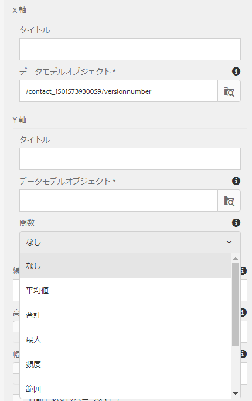

# インタラクティブ通信内でグラフを使用する{#using-charts-in-interactive-communications}

表やグラフはデータを視覚的に表現します。インタラクティブ通信で大量の情報を分かりやすい視覚的な形式で表現することにより、複雑なデータを視覚的に理解して分析することができます。

インタラクティブ通信を作成する際にグラフを追加することにより、インタラクティブ通信のフォームデータモデルから取得した 2 次元のデータを視覚的に表現することができます。グラフコンポーネントを使用すると、次のタイプのグラフを追加および設定できます。円グラフ、列グラフ、ドーナツグラフ、棒グラフ、線グラフ、線と点グラフ、点グラフ、面グラフ、四分円グラフです。

## インタラクティブ通信でグラフを追加および設定 {#add-and-configure-chart-in-an-interactive-communication}

インタラクティブ通信にグラフを追加して設定するには、次の手順を実行します。

1. インタラクティブ通信のサイドキックから&#x200B;**コンポーネント**&#x200B;をタップしてください。
1. **グラフ**&#x200B;コンポーネントを次のいずれかのコンポーネントにドラッグ＆ドロップします。

   * 印刷チャネル：ターゲット領域または 画像フィールド
   * Web チャネル：パネルまたはターゲット領域

1. インタラクティブ通信エディターでグラフコンポーネントをタップし、コンポーネントツールバーから&#x200B;**[!UICONTROL 設定（]** ）を選択します。

   グラフのプロパティが左側のペインに表示されます。

   

   印刷チャネルの線グラフの基本プロパティ

   

   Web チャネルの線グラフの基本プロパティ

1. チャネルタイプに基づいて [グラフのプロパティ](../../forms/using/chart-component-interactive-communications.md#configure-chart-properties) を設定します。
1. （印刷チャネルの場合のみ）**[!UICONTROL エージェント設定]**&#x200B;で、このグラフをエージェントで使用することが必須かどうかを指定します。**[!UICONTROL このグラフの使用がエージェントにとって必須です]**&#x200B;オプションを選択していない場合、エージェント UI の&#x200B;**[!UICONTROL コンテンツ]**&#x200B;タブにあるグラフの目のアイコンをタップして、グラフを表示または非表示にできます。

   

1.  をタップして、グラフのプロパティを保存します。

   **[!UICONTROL プレビュー]**&#x200B;をタップして、グラフに関連付けられた外観とデータを表示します。**[!UICONTROL 編集]**&#x200B;をタップして、グラフのプロパティを再設定します。

## グラフのプロパティを設定 {#configure-chart-properties}

印刷チャネルと web チャネルのグラフを作成する際に、次のプロパティを設定します。

<table>
 <tbody>
  <tr>
   <td>フィールド</td>
   <td>説明</td>
   <td>チャネルタイプ</td>
  </tr>
  <tr>
   <td>名前</td>
   <td>グラフ要素の識別子。このフィールドで指定されたグラフの名前は、グラフには表示されません。 他のコンポーネント、スクリプト、SOM 式の要素を参照する際に使用されます。</td>
   <td>印刷出力と Web 出力</td>
  </tr>
  <tr>
   <td>グラフのタイプ</td>
   <td>生成するグラフのタイプ。使用可能なオプションには、円グラフ、列グラフ、ドーナツグラフ、棒グラフ、線グラフ、線とポイントグラフ、ポイントグラフ、領域グラフがあります。</td>
   <td>印刷出力と Web 出力</td>
  </tr>
  <tr>
   <td>シリーズ／複数シリーズ</td>
   <td>X 軸と Y 軸にプロットされたフォームデータモデルコレクション項目の複数のシリーズを追加する場合に選択します。</td>
   <td>印刷出力と Web 出力</td>
  </tr>
  <tr>
   <td>シリーズ／データモデルオブジェクト</td>
   <td>グラフに複数のシリーズを追加するためのフォームデータモデルコレクション項目の名前。<br /> X 軸とY 軸にプロットされたプロパティの親フォームデータモデルオブジェクトプロパティを選択して、意味のあるシリーズを形成します。連結するデータモデルオブジェクトは、数値タイプ、文字列タイプまたは日付タイプである必要があります。</td>
   <td>印刷出力と Web 出力</td>
  </tr>
  <tr>
   <td>積み上げを表示</td>
   <td>各系列の値を互いの上に積み上げるように選択します。</td>
   <td>印刷出力と Web 出力</td>
  </tr>
  <tr>
   <td>X 軸／タイトル</td>
   <td>X 軸のタイトル。</td>
   <td>印刷出力と Web 出力</td>
  </tr>
  <tr>
   <td>X 軸／データモデルオブジェクト</td>
   <td><p>X 軸にプロットされるフォームデータモデルのコレクションアイテムの名前。</p> <p>同じ親データモデルオブジェクトの 2 つのコレクションタイププロパティまたは配列タイププロパティを選択します。これらのプロパティはグラフの X 軸と Y 軸に描画されるため、相互に関連するプロパティを選択してください。連結するデータモデルオブジェクトは、数値タイプ、文字列タイプ、または日付タイプである必要があります。</p> </td>
   <td>印刷出力と Web 出力</td>
  </tr>
  <tr>
   <td>Y 軸／タイトル</td>
   <td>Y 軸のタイトル。 </td>
   <td>印刷出力と Web 出力</td>
  </tr>
  <tr>
   <td>Y 軸／データモデルオブジェクト</td>
   <td><p>Y 軸にプロットされるフォームデータモデルのコレクションアイテムの名前。印刷チャネルでは、Y 軸のデータモデルオブジェクトは数値タイプである必要があります。</p> <p>同じ親データモデルオブジェクトの 2 つのコレクションタイププロパティまたは配列タイププロパティを選択します。これらのプロパティはグラフの X 軸と Y 軸に描画されるため、相互に関連するプロパティを選択してください。    </p> </td>
   <td>印刷出力と Web 出力</td>
  </tr>
  <tr>
   <td>Y 軸／関数</td>
   <td>Y 軸の値の計算に使用する統計関数またはカスタム関数。</td>
   <td>印刷出力と Web 出力</td>
  </tr>
  <tr>
   <td>オブジェクトを非表示</td>
   <td>選択すると、最終的な出力でグラフが非表示になります。</td>
   <td>印刷出力と Web 出力</td>
  </tr>
  <tr>
   <td>タイトル</td>
   <td>グラフのタイトル。 </td>
   <td>印刷出力</td>
  </tr>
  <tr>
   <td>高さ</td>
   <td>グラフの高さ（ピクセル単位）。</td>
   <td>印刷出力</td>
  </tr>
  <tr>
   <td>幅</td>
   <td>グラフの幅（ピクセル単位）。Web チャネルのグラフの幅については、スタイルレイヤーを使用するかテーマを適用して調整することができます。</td>
   <td>印刷出力</td>
  </tr>
  <tr>
   <td>前に必須の改ページ</td>
   <td>新しいページの先頭にグラフが表示されるようにグラフの前に改ページを追加する場合は、このプロパティを選択します。 </td>
   <td>印刷出力</td>
  </tr>
  <tr>
   <td>後に必須の改ページ</td>
   <td>新しいページの先頭にグラフのコンテンツが表示されるようにグラフの後ろに改ページを追加する場合は、このプロパティを選択します。 </td>
   <td>印刷出力</td>
  </tr>
  <tr>
   <td>インデント</td>
   <td>ページの左側からのグラフのインデント。 </td>
   <td>印刷出力</td>
  </tr>
  <tr>
   <td>ツールヒント</td>
   <td><p>Web チャネルのグラフのデータポイントにマウスを置いたときに表示されるツールヒントの形式。デフォルト値は ${x}(${y}) です。グラフのタイプに応じて、グラフ内のポイント、棒、またはスライスにマウスを置くと、${x} 変数と ${y} 変数が X 軸と Y 軸の対応する値で動的に置き換えられ、ツールヒントに表示されます。</p> <p>ツールヒントを無効にするには、<span class="uicontrol">ツールヒント</code>フィールドを空白にします。このオプションは線グラフと領域グラフには適用できません。詳しくは、<a href="#chartoutputprintweb">例 1：印刷と web のグラフ出力</a>を参照してください。</code></p> </td>
   <td>Web</td>
  </tr>
  <tr>
   <td>グラフ固有の設定</td>
   <td><p>共通の設定に加えて、次のようなグラフ固有の設定を使用できます。</p>
    <ul>
     <li><strong>凡例を表示：</strong>有効にすると、円グラフまたはドーナツグラフの凡例を表示します。</li>
     <li><strong>凡例の位置：</strong>グラフに対する凡例の位置を指定します。使用できるオプションは、右端、左端、上、下です。印刷チャネルの右側の凡例を使用することをお勧めします。</li>
     <li><strong>内半径</strong>：ドーナツグラフで使用できます。グラフの内側の円の半径をピクセル単位で指定できます。</li>
     <li><strong>線の色</strong>：線グラフ、線と点のグラフ、面グラフで使用できます。グラフの線の色を指定できます。</li>
     <li><strong>点の色</strong>：点グラフや、折れ線と点のグラフで使用できます。グラフの点（マーカー）の色を指定できます。<br /> </li>
     <li><strong>領域の色</strong>：面グラフで使用できます。グラフの線の下にある領域の色を指定できます。</li>
     <li><strong>基準点／連結タイプ：</strong>四象限グラフで使用できます。<strong> </strong>基準点の連結タイプを指定できます。基準点の値を定義するには、静的なテキストまたはデータモデルオブジェクトのプロパティを使用します。</li>
     <li><strong>基準点／X 軸： </strong>四象限グラフで使用できます。「連結タイプ」ドロップダウンリストで「<span class="uicontrol">静的</code>」を選択すると、基準点の X 軸の値を指定できます。</code></li>
     <li><strong>基準点／Y 軸： </strong>四象限グラフで使用できます。「連結タイプ」ドロップダウンリストで「<span class="uicontrol">静的</code>」を選択すると、基準点の Y 軸の値を指定できます。</code></li>
     <li><strong>基準点／系列のデータモデルオブジェクト： </strong>複数の系列の四象限グラフで使用できます。「連結タイプ」ドロップダウンリストで「<span class="uicontrol">データモデルオブジェクト</code>」を選択します。基準点の系列を特定するためのフォームデータモデルオブジェクトのプロパティを定義してください. </code></li>
     <li><strong>基準点／系列のデータモデルオブジェクトの値： </strong>複数の系列の四象限グラフで使用できます。「連結タイプ」ドロップダウンリストで「 <span class="uicontrol">データモデルオブジェクト</code>」を選択します。系列用のフォームデータモデルオブジェクトのプロパティと、このフィールド内で定義した値を使用して、基準点の系列を特定します。</code></li>
     <li><strong>基準点／基準点のデータモデルオブジェクト：</strong>四象限グラフで使用できます。「連結タイプ」ドロップダウンリストで「<span class="uicontrol">データモデルオブジェクト</code>」を選択します。X 軸と Y 軸にプロットされたプロパティと兄弟関係にある、フォームデータモデルオブジェクトのプロパティを定義します。また、複数系列の場合は、それらの系列に対して定義されたデータモデルオブジェクトのプロパティの子エンティティである、データモデルオブジェクトのプロパティを定義します。</code></li>
     <li><strong>基準点／基準点のデータモデルオブジェクトの値：</strong>四象限グラフで使用できます。「連結タイプ」ドロップダウンリストで「 <span class="uicontrol">データモデルオブジェクト</code>」を選択します。グラフの基準点を特定するには、基準点のフォームデータモデルオブジェクトのプロパティと、そのフィールドで定義した値を使用します。<br /> <strong>四象限ラベル／左上：</strong>四象限グラフで使用できます。左上の四象限の名前を指定できます。</code></li>
     <li><strong>四象限ラベル／右上：</strong>四象限グラフで使用できます。右上の四象限の名前を指定できます。</li>
     <li><strong>四象限ラベル／右下：</strong>四象限グラフで使用できます。右下の四象限の名前を指定できます。</li>
     <li><strong>四象限ラベル／左下：</strong>四象限グラフで使用できます。左下の四象限の名前を指定できます。</li>
    </ul> </td>
   <td>印刷出力と Web 出力</td>
  </tr>
 </tbody>
</table>

## グラフでの関数の使用 {#use-functions-in-chart}

統計関数を使用するようにグラフを設定し、ソースデータの値を計算して、グラフにプロットできます。グラフ内で関数を適用すると、フォームデータモデルでは直接指定できないデータを描画することができます。



グラフコンポーネントにはいくつかの関数が組み込まれていますが、[カスタム関数](#customfunctionsweb)を作成して、web チャネルのグラフ設定で使用することもできます。

デフォルトでは、以下の関数をグラフコンポーネントに使用できます。

**平均**：X 軸または Y 軸の値を指定したとき、もう一方の軸にある値の平均値を返します。

**合計**：X 軸または Y 軸の値を指定したとき、もう一方の軸にあるすべての値の合計を返します。

**最大**：X 軸または Y 軸の値を指定したとき、もう一方の軸にある値の最大値を返します。

**頻度**：X 軸または Y 軸の値を指定したとき、もう一方の軸にある値の個数を返します。

**範囲**：X 軸または Y 軸の値を指定したとき、もう一方の軸にある値の最大値と最小値の差異を返します。

**中央値**：X 軸または Y 軸の値を指定したとき、もう一方の軸にある値を上位の値都会の値の中央になる値を返します。

**最小**：X 軸または Y 軸の値を指定したとき、もう一方の軸にある値の最小値を返します。

**モード**：X 軸または Y 軸の値を指定したとき、もう一方の軸にある値の中で最も多く出現する値を返します。

詳しくは、[例 2：折れ線グラフでの合計関数と頻度関数の適用](#applicationsumfrequency)を参照してください。

### Web チャネルのカスタム関数 {#customfunctionsweb}

グラフでデフォルトの関数を使用するだけでなく、JavaScript™ でカスタム関数を作成し、Web チャネル用のグラフコンポーネントの関数リストにその関数を追加することもできます。

関数は入力された配列または値、カテゴリ名を使用して、値を返します。次に例を示します。

```javascript
Multiply(valueArray, category) {
 var val = 1;
 _.each(valueArray, function(value) {
 val = val * value;
 });
 return val;
}
```

カスタム関数を作成したら、以下を実行してグラフの設定で使用できるようにします。

1. 該当するインタラクティブ通信に関連付けられているクライアントライブラリにカスタム関数を追加します。詳しくは、[送信アクションの設定](/help/forms/using/configuring-submit-actions.md)と[クライアントサイドのライブラリの使用](/help/sites-developing/clientlibs.md)を参照してください。

1. CRXDe Lite の関数ドロップダウンにカスタム関数を表示するには、以下のプロパティを指定して、apps フォルダー内に `nt:unstructured` ノードを作成します。

   * `guideComponentType` プロパティを追加し、値として `fd/af/reducer` を指定します。(mandatory)

   * `value` プロパティを追加し、カスタムの JavaScript™ 関数の完全修飾名を指定します。（必須）このプロパティの値を、カスタム関数の名前に設定します（Multiply など）。
   * `jcr:description` プロパティを追加し、カスタム関数の名前として表示される値を指定します。この名前が、関数ドロップダウンに表示されます。例えば、**Multiply** と表示されます。

   * `qtip` プロパティを追加し、値としてカスタム関数の簡単な説明を指定します。「**関数**」ドロップダウンリスト内の関数名にポインターを置くと、ここで指定した説明がツールヒントとして表示されます。

1. 「**すべて保存**」をクリックして設定を保存します。

これで関数をグラフで使用できるようになります。

## 例 1：印刷チャネルと Web チャネルのグラフ出力 {#chartoutputprintweb}

「基本」タブで、グラフのタイプ、データを格納するソースフォームデータモデルのプロパティ、グラフの X 軸と Y 軸上に描画されるラベルを指定します。必要に応じて、グラフ上に表示される値を計算するための統計関数を指定することもできます。

ここでは、インタラクティブ通信を使用して生成されたクレジットカードの取引明細を例として、基本的なプロパティに関して最低限知っておくべき情報について説明します。具体的な例として、取引明細に記載されている様々な支払額を描画するグラフを生成する場合を考えてみます。この例では、インタラクティブ通信の印刷出力と Web 出力で、異なるタイプのグラフを使用します。

### 印刷用の列グラフ {#columnchartprint}

これを行うには、次のプロパティを指定します。

* **[!UICONTROL 名前]** - グラフの名前を指定します。
* **[!UICONTROL グラフのタイプ]** - ドロップダウンリストから「**列**」を選択します。
* **[!UICONTROL タイトル]** - X 軸に「取引タイプ」を、Y 軸に「取引額」を指定します。
* **[!UICONTROL データモデルオブジェクト]** - データモデルオブジェクトのプロパティを選択して、X 軸（支出タイプ）と Y 軸（取引額）のデータ連結を作成します。


インタラクティブ通信の印刷チャネルの列グラフ

### Web 用ドーナツグラフ {#donutchartweb}

これを行うには、次のプロパティを指定します。

* **[!UICONTROL 名前]** - グラフの名前を指定します。
* **[!UICONTROL グラフのタイプ]** - ドロップダウンリストから「**[!UICONTROL ドーナツ]**」を選択します。
* **[!UICONTROL データモデルオブジェクト]** - データモデルオブジェクトのプロパティを選択して、X 軸（支出タイプ）と Y 軸（取引額）のデータ連結を作成します。
* **[!UICONTROL 内半径]** - 内半径の値を 150 に指定して、グラフ内の内側の円の半径（ピクセル単位）を指定します。
* **[!UICONTROL ツールヒント]** - デフォルトの ${x}(${y}) 形式を使用してツールヒントを表示します。ツールヒントは、「支出タイプ（取引額）」として表示されます。例：ビットコインへの支払い（10000）


インタラクティブ通信の web チャネルのドーナツグラフ

## 例 2: 線グラフ内で Sum 関数と Frequency 関数を適用する {#applicationsumfrequency}

グラフ内で関数を適用すると、フォームデータモデルでは直接指定できないデータを描画することができます。ここでは、クレジットカードの取引明細を例として、Sum 関数と Frequency 関数をグラフに適用する方法について説明します。


「AirBnB への支払い」の取引が 2 つあり関数を持たない折れ線グラフ

### Sum 関数 {#sum-function}

Sum 関数を適用することにより、同じデータプロパティの複数のインスタンスの値を合計し、グラフ上で 1 つの項目として表示することができます。例えば以下のグラフでは、Y 軸に Sum 関数が適用され、2 つの「AirBnB への支払い」取引の金額が合計されて（それぞれの金額は 2050 と 1050）、1 つの取引としてグラフに表示されています（合計金額は 3100）。

同じデータプロパティで複数のインスタンスが存在する場合は、Sum 関数を適用して合計値を表示すると、グラフが見やすくなります。


### Frequency 関数 {#frequency-function}

Frequency 関数は、X 軸の指定の値に対する発生数を Y 軸に返します。Frequency 関数を Y 軸（取引額）に適用すると、「AirBnB への支払い」の取引が 2 件あり、残りのタイプの取引は 1 件あることがグラフに表示されます。


## 例 3：Web における多系列の四象限グラフ {#example-multi-series-quadrant-chart-in-web}

グラフには、特定の日付範囲で実行された取引額が示されています。四象限グラフには、グラフ領域を 4 つのラベル付きセクションに分割する機能があります。グラフの X 軸と Y 軸に、静的な基準点を使用します。多系列機能を使用すると、銀行名に基づいてデータを分離できます。

これを行うには、次のプロパティを指定します。

* **名前：** グラフの名前を指定します。
* **グラフタイプ：** ドロップダウンリストから **四象限**&#x200B;を選択します。

* 「**多系列**」チェックボックスを選択します。
* **データモデルオブジェクト**：系列のデータモデルオブジェクトのプロパティを指定します。銀行名のデータモデルオブジェクトプロパティは、X 軸と Y 軸にプロットされたデータモデルオブジェクトプロパティの親です。
* **データモデルオブジェクト：**&#x200B;データモデルオブジェクトのプロパティを選択して、X 軸（取引日）と Y 軸（取引額）のデータ連結を作成します。
* 「**基準点**」セクションで、連結タイプとして「**静的**」を選択します。

* X 軸と Y 軸の基準点の値を指定します。
* 左上、右上、右下、左下の四象限の各ラベルを指定します。
* 「**凡例を表示**」チェックボックスをオンにして、銀行名のカラーコードを表示します。


