# インタラクティブ通信とレターのインライン条件と繰り返し構造{#inline-condition-and-repeat-in-interactive-communications-and-letters}

## インライン条件 {#inline-conditions}

AEM Forms では、テキストモジュール内でインライン条件を使用して、フォームデータモデル（インタラクティブ通信の場合）またはデータディクショナリ（レターの場合）に関連付けられたコンテキストやデータに依存するテキストを自動的にレンダリングすることができます。インライン条件には、true または false の条件評価に応じて特定のコンテンツが表示されます。

フォームデータモデル、データディクショナリ、またはエンドユーザーによって指定されたデータの値に基づき、インライン条件によって計算処理が実行されます。インライン条件を使用することにより、コンテキストに応じて変化するカスタマイズされたインタラクティブ通信とレターを短時間で作成し、人為的なエラーを減らすことができます。

詳しくは、次を参照してください。

* [インタラクティブ通信の作成](../../forms/using/create-interactive-communication.md)
* [Correspondence Management の概要](/help/forms/using/cm-overview.md)
* [インタラクティブ通信内のテキスト](../../forms/using/texts-interactive-communications.md)

### 例：ルールを使用してインタラクティブ通信内のインラインテキストに条件を設定する {#example-using-rules-to-conditionalize-inline-text-in-interactive-communication}

インタラクティブ通信内の文、段落、文字列に条件を設定するには、適切なテキストドキュメントフラグメントでルールを作成します。以下のリンクに記載されている例では、ルールを使用して、インタラクティブ通信を米国で受信するユーザーだけにフリーダイヤルの番号を表示しています。

For more information, see Create rule in text in [Texts in Interactive Communications](../../forms/using/texts-interactive-communications.md).

Interactive Communicationにテキストフラグメントを含め、Agent UIを使用してInteractive Communicationを準備すると、受信者の（フォームデータモデル）データが評価され、テキストは米国の受信者にのみ表示されます。

### 例：レターでインライン条件を使用して、適切な呼称をレンダリングする場合  {#example-using-inline-condition-in-a-letter-to-render-the-appropriate-address}

レターにインライン条件を挿入するには、適切なテキストモジュールにインライン条件を挿入します。次の例では、2 つの条件を使用して、DD 要素 Gender に基づいて適切な呼称（Sir または Ma&#39;am）を評価し、それをレターに表示しています。他の条件も、同様の手順で作成できます。

>[!NOTE]
>
>既存のアセットに古い（6.2 SP1 CFP 4 より前の）条件式や繰り返し式が含まれている場合は、アセットに古い構文の条件や繰り返しが表示されます。ただし、古い条件や繰り返しも正常に機能します。新しい条件/繰り返し式と古い条件/繰り返し式は互いに互換性があり、古い条件/繰り返し条件と新しい条件/繰り返しがネストされて混在します。

1. In the relevant text module, select the part of text that you want to conditionalize and tap **Condition**.

   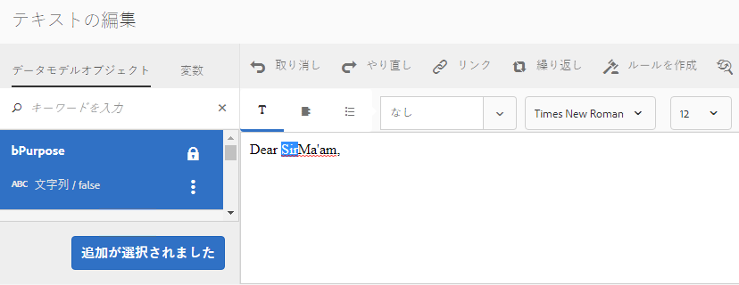

   条件ダイアログボックスが開き、空の条件が表示されます。

   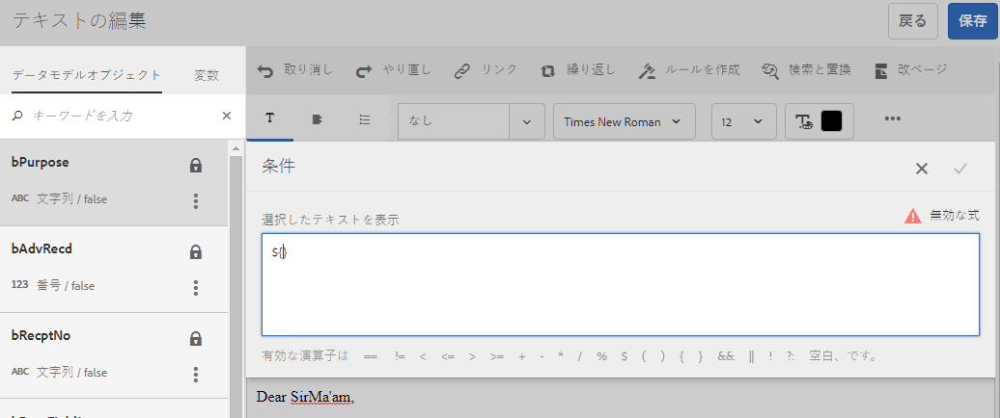

   >[!NOTE]
   >
   >空の条件式や無効な条件式は保存できません。There has to be a valid conditional expression inside `${}` to save the expression.

1. 次の手順を実行して、選択および条件付けしたテキストがレターに表示されるかどうかを評価するための条件を作成し、チェックマークをタップして式を保存します。

   DD 要素をダブルタップして条件に挿入します。ダイアログボックスで適切な演算子を挿入し、以下の条件を作成します。

   ```javascript
   ${DD_creditcard_Gender=="Male"}
   ```

   式の作成について詳しくは、[式ビルダー](../../forms/using/expression-builder.md)の「**式ビルダーによる式およびリモート関数の作成**」を参照してください。式に指定する値は、データディクショナリ内の要素でサポートされている必要があります。詳しくは、「[データディクショナリ](../../forms/using/data-dictionary.md)」を参照してください。

   条件を挿入すると、条件の左側にあるハンドルの上にマウスを移動したときに条件が表示されます。ハンドルをタップすると、条件のポップアップメニューが表示され、条件を編集または削除できます。

   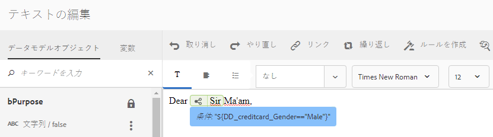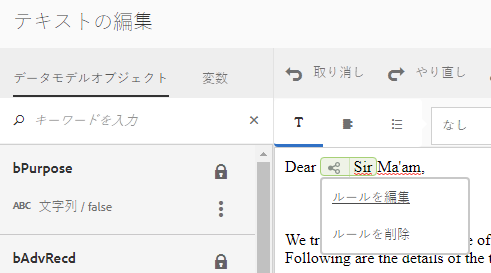

1. テキスト「`Ma'am`」を選択して、同様の条件を挿入します。

   ```javascript
   ${DD_creditcard_Gender == "Female"}
   ```

1. 関連するレターをプレビューして、インライン条件に従ってテキストがレンダリングされていることを確認します。次のファイルを使用して DD 要素 Gender の値を入力できます。

   * サンプルデータを含むレターのプレビュー中に関連するデータディクショナリに基づいて作成されたサンプル XML データファイル。
   * 関連するデータディクショナリに添付されている XML データファイル。

   詳しくは、「[データディクショナリ](../../forms/using/data-dictionary.md)」を参照してください。

   

## 繰り返し {#repeat}

インタラクティブ通信とレターには、動的な情報を含めることができます。例えば、クレジットカードの取引明細書は、レターが生成されるたびに変化します。繰り返しを使用して、テキストドキュメントフラグメント内の動的な情報の形式を設定し、構造を設定できます。

また、繰り返し構造内でルールや条件を指定して、インタラクティブ通信またはレター内でレンダリングされる情報やエントリに条件を設定することもできます。

### 例：インタラクティブ通信内で繰り返し構造を使用して、クレジットカードの取引情報リストの書式設定、構造化、表示を行う {#example-using-repeat-in-an-interactive-communication-to-format-structure-and-display-a-list-of-credit-card-transactions}

以下の例は、繰り返し構造を使用して、インタラクティブ通信内のクレジットカード取引情報を構造化してレンダリングする手順を示しています。

1. フォームデータモデルベースのテキストドキュメントフラグメント内に、関連するフォームデータモデルオブジェクトと、ラベルに必要な組み込みテキストを挿入します（以下の図を参照）。

   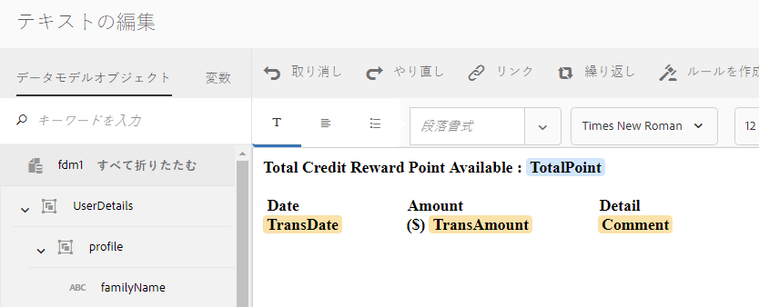

   >[!NOTE]
   >
   >繰り返し可能なコンテンツには、「コレクション」タイプのプロパティを 1 つ以上含める必要があります。

1. 繰り返し構造を適用するコンテンツを選択します。

   

1. 「繰り返し」をタップします。

   繰り返しダイアログが表示されます。

   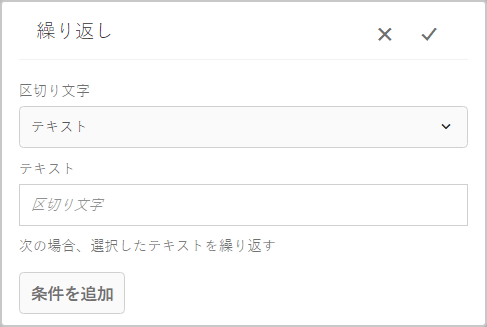

1. 必要に応じて、区切り文字として「改行」を選択し、「条件を追加」をタップしてルールを作成します。区切り文字としてテキストを使用し、区切り文字として使用するテキスト文字を指定することもできます。

   規則作成ダイアログが表示されます。

1. 2018 年 2 月 28 日以降に発生した取引情報を表示し、2018 年 3 月中に発生した取引情報だけをインタラクティブ通信に含めるためのルールを作成します。

   >[!NOTE]
   >
   >この例では、2018 年 3 月 31 日に、エージェントによって取引明細情報が作成されます。これとは別のルールを作成し、2018 年 4 月 1 日よりも前に発生した取引情報をインタラクティブ通信に含めて、2018 年 3 月より後に発生した取引情報を除外することもできます。

   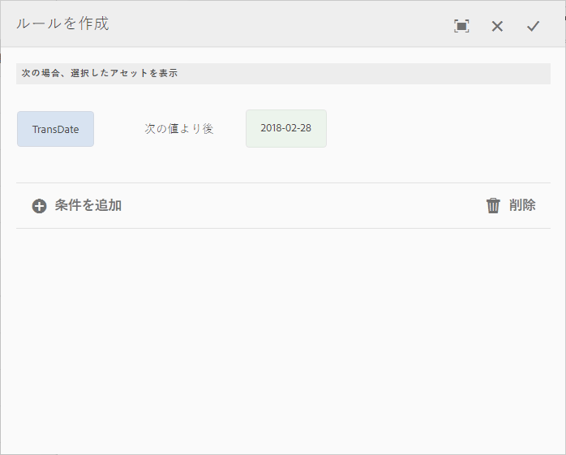

1. 条件またはルールを保存して、繰り返し構造を保存します。条件が設定された繰り返し構造が、選択したコンテンツに適用されます。

   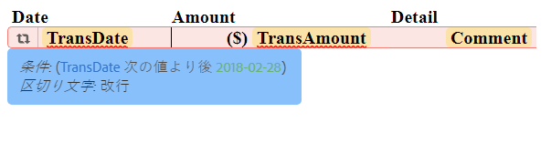

   テキストドキュメントフラグメントにマウスをポイントすると、コンテンツに適用された繰り返し構造内で使用されている条件と区切り文字が表示されます。

1. テキストドキュメントフラグメントを保存し、関連するインタラクティブ通信のプレビューを表示します。フォームデータモデル内のデータに応じて、プレビューに適用した繰り返しによって、要素内の次のようなトランザクションの詳細がレンダリングされます。

   

### 例：レターで繰り返しを使用して、クレジットカード取引情報のリストの書式設定、構造化および表示を行う場合 {#example-using-repeat-in-a-letter-to-format-structure-and-display-a-list-of-credit-card-transactions}

次の例は、繰り返しを使用して、レター内のクレジットカード取引情報を構造化してレンダリングする手順を示しています。同じような手順を使用して、別のシナリオでも繰り返しを使用できます。

1. 繰り返されるデータや動的なデータをレンダリングする DD 要素を含む（作成中または編集中の）テキストモジュールを開き、DD 要素の周囲に必要なテキストを埋め込みます。例えば、クレジットカードでの取引の明細を作成するため、テキストモジュールに以下の DD 要素が含まれています。

   ```javascript
   {^DD_creditcard_TransactionDate^} {^DD_creditcard_TransactionAmount^}
   {^DD_creditcard_TransactionType^}
   ```

   これらの DD 要素は、以下の情報を使用して、クレジットカードで行われた取引のリストをレンダリングします。

   取引日、取引額および取引タイプ（デビットまたはクレジット）

1. 次のように DD 要素の内部にテキストを埋め込んで、明細を読みやすくします。

   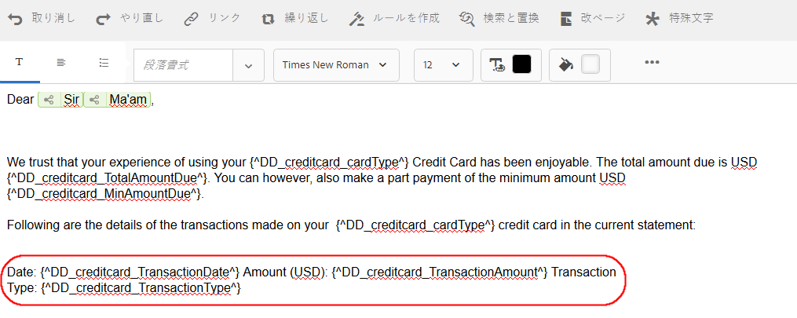

   ```javascript
   Date: {^DD_creditcard_TransactionDate^} Amount (USD): {^DD_creditcard_TransactionAmount^} Transaction Type: {^DD_creditcard_TransactionType^}
   ```

   ただし、適切に書式設定された明細をレンダリングする処理はまだ完成していません。ここまでの作業結果に基づいてレターをレンダリングすると、次のように表示されます。

   

   DD 要素と共に静的テキストを繰り返すには、この後の手順に従って繰り返しを適用する必要があります。

1. 以下に示すように、繰り返す静的テキストを DD 要素と共に選択します。

   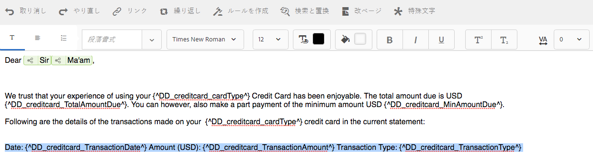

1. 「**繰り返し**」をタップします。繰り返しダイアログに、空のインライン条件が表示されます。

   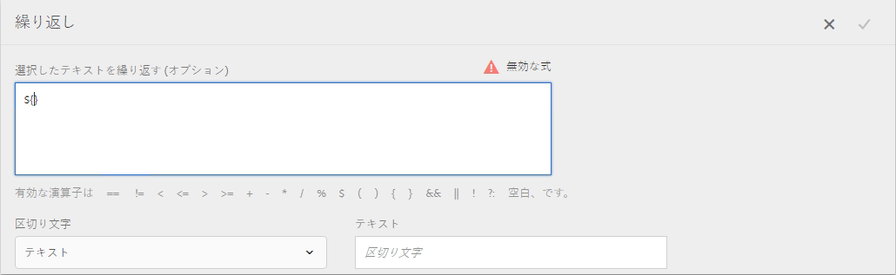

1. 必要に応じて、取引を選択的にレンダリングする（例えば、50 セントを超える取引額をレンダリングする）ための条件を挿入します。

   ```javascript
   ${DD_creditcard_TransactionAmount > 0.5}
   ```

   Otherwise, if you do not need to render the information (here transactions) selectively, keep the condition empty by deleting the following in the dialog: `${}`. 繰り返し式が保存されるのは、繰り返し式ウィンドウが空になっている（繰り返し式が不要で ${} がない）場合、または繰り返し式ウィンドウに有効な繰り返し条件が含まれている場合です。

1. 動的テキストを書式設定するための区切り文字を選択し、チェックマークをタップして保存します。

   * **改行**：出力されるレターの各取引エントリの後に改行を挿入します。
   * **テキスト**：出力されるレターの各取引エントリの後に指定したテキスト文字を挿入します。

   条件を挿入すると、繰り返しを設定したテキストが赤色でハイライト表示され、その左側にハンドルが表示されます。繰り返しの左側にあるハンドルの上にマウスを移動すると、繰り返し構成体が表示されます。

   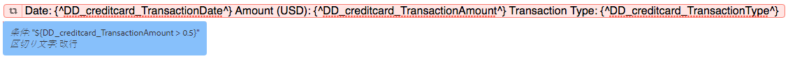

   ハンドルをタップすると、繰り返しのポップアップメニューが表示され、繰り返し構成体を編集または削除できます。

   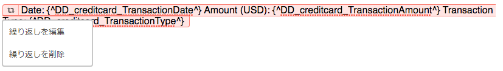

1. 関連するレターをプレビューして、繰り返しに従ってテキストがレンダリングされていることを確認します。次のファイルを使用して DD 要素の値を入力できます。

   * サンプルデータを含むレターのプレビュー中に関連するデータディクショナリに基づいて作成されたサンプル XML データファイル。
   * 関連するデータディクショナリに添付されている XML データファイル。

   詳しくは、「[データディクショナリ](https://helpx.adobe.com/aem-forms/6-2/data-dictionary.html)」を参照してください。

   

   取引の明細とともに静的テキストが繰り返されています。静止テキストの繰り返しは、この手順でテキストに適用する繰り返しによって容易になります。 条件「${DD_creditcard_TransactionAmount > 0.5}」があるので、0.5 米ドルを下回る取引はレターにレンダリングされません。

   >[!NOTE]
   >
   >条件や繰り返しを挿入できるのは、関連するテキストモジュールを作成または編集している間だけです。レターのプレビュー中は、テキストモジュールを編集できますが、条件や繰り返しを挿入することはできません。

## インライン条件と繰り返しの使用 - 使用事例  {#using-inline-condition-and-repeat-some-use-cases}

### 条件内部の繰り返し {#repeat-within-condition}

場合によっては、条件の内部で繰り返しを使用する必要があります。Correspondence Management では、インライン条件構成体の内部で繰り返しを使用できます。

条件（緑色の部分）の内部にある繰り返し（赤色の部分）の例を次に示します。

繰り返しによってクレジットカード取引がレンダリングされますが、条件「${DD_creditcard_nooftransactions > 0}」があるので、繰り返し構成体がレンダリングされるのは取引が少なくとも 1 回行われた場合のみです。

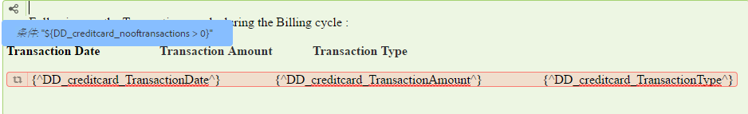

同様に、必要に応じて以下の操作が可能です。

* 条件の内部に 1 つ以上の条件を作成する
* 繰り返しの内部に 1 つ以上の条件を作成する
* 条件または繰り返しの内部に条件と繰り返しの組み合わせを作成する

### 空のインライン条件 {#empty-inline-condition}

場合によっては、空のインライン条件を挿入し、後でテキストと DD 要素を埋め込む必要があります。Correspondence Management では、この操作が可能です。

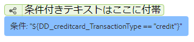

ただし、可能な場合は、最初に意図した書式設定（箇条書きなど）でテキストモジュールにテキストと DD 要素を挿入し、後でインライン条件を適用することをお勧めします。
