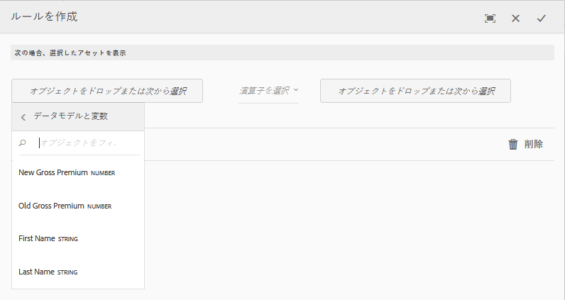

# インタラクティブ通信内の条件{#conditions-in-interactive-communications}

インタラクティブ通信で使用する条件フラグメントの作成方法と編集方法について説明します。インタラクティブ通信の作成では 4 種類のドキュメントフラグメントが使用されますが、条件フラグメントはそのうちの 1 つです。他の 3 つは、テキストフラグメント、リストフラグメント、レイアウトフラグメントです。

## 概要 {#overview}

条件とは、インタラクティブ通信に含めることができるドキュメントフラグメントです。他のドキュメントフラグメントには、[テキスト](../../forms/using/texts-interactive-communications.md)フラグメント、リストフラグメント、レイアウトフラグメントがあります。条件により、指定されたデータとルールに基づいて、インタラクティブ通信に含める 1 つ以上のコンテキスト依存アセットを定義することができます。

例えば、次のような問題です。

* 顧客のクレジットカードの種類に基づいて、クレジットカードの年会費とクレジットカードの画像をクレジットカード明細書に表示します。
* 顧客が居住している国の税制に基づいて、保険料支払期日の通知に税額の計算結果を表示します。

条件内のアセットは、適用されるルールと、そのルールに渡される値に基づいてレンダリングされます。条件内のルールを使用して、以下に示すデータのタイプの値を確認することができます。

* 関連するフォームデータモデルのプロパティ
* 条件内で作成した変数
* 文字列
* 数値
* 数式
* 日付

## 条件を作成 {#createcondition}

1. 「**[!UICONTROL フォーム]**／**[!UICONTROL ドキュメントフラグメント]**」を選択します。
1. 「**[!UICONTROL 作成]**／**[!UICONTROL 条件]**」を選択します。
1. 次の情報を指定します。

   * **[!UICONTROL タイトル]**：（オプション）条件のタイトルを入力します。タイトルは一意である必要はなく、特殊文字や英語以外の文字を含めることもできます。タイトルが指定されている場合、サムネイルやプロパティなどでは、タイトルによって条件が参照されます。
   * **[!UICONTROL 名前]**：フォルダー内の条件に対し一意の名前を入力します。どのような状態であっても、1 つのフォルダー内に、同じ名前を持つ 2 つのドキュメントフラグメント（テキスト、条件、リスト）を保管することはできません。「名前」フィールドに入力できるのは、英語の文字、数字、ハイフンのみです。「名前」フィールドは、「タイトル」フィールドに基づいて自動的に入力されます。「タイトル」フィールドに入力した特殊文字、スペース、および英数字以外の文字はハイフンに置き換えられます。「タイトル」フィールドの値は「名前」に自動的にコピーされますが、値を編集することもできます。

   * **[!UICONTROL 説明]**：ドキュメントフラグメントの説明を入力します。
   * **[!UICONTROL フォームデータモデル]**：（オプション）「フォームデータモデル」ラジオボタンを選択し、フォームデータモデルに基づいて条件を作成します。「フォームデータモデル」ラジオボタンを選択すると、**[!UICONTROL フォームデータモデル]**&#x200B;フィールドが表示されます。フォームデータモデルを参照して選択します。インタラクティブ通信の条件を作成する際は、インタラクティブ通信で使用するのと同じデータモデルを使用する必要があります。フォームデータモデルについて詳しくは、[データ統合](../../forms/using/data-integration.md)を参照してください。

   * **[!UICONTROL タグ]**：（オプション）カスタムタグを作成するには、テキストフィールドに値を入力して Enter キーを押します。この条件を保存すると、新しく追加されたタグも作成されます。

1. 「**[!UICONTROL 次へ]**」を選択します。

   条件の作成ページが表示されます。

   

1. 「**[!UICONTROL アセットを追加]**」を選択します。

   アセットの選択ページが表示されます。このページには、条件内に追加できるテキスト、リスト、条件、画像が表示されます。

   >[!NOTE]
   >
   >新規に作成したアセットと FDM ベースのアセット（作成する条件と同じ FDM を使用して作成されたアセット）のみが、アセットの選択ページに表示されます。

1. 条件に含めるアセットを選択するには、該当するアセット、「**[!UICONTROL 完了]**」の順に選択します。

   条件の作成ページが表示され、追加したアセットが一覧表示されます。

   

   以下のオプションを使用して、条件内のアセットを管理することができます。

   

   **[A] 変更を拒否。** 条件内のアセットとルールに対する変更を拒否する場合は、このアイコンを選択します。
   **[B] 変更に同意。** 条件内のアセットとルールに対する変更を受け入れる場合は、このアイコンを選択します。
   **[C] アセットを複製。** 適用対象のルール（存在する場合）と共に条件内のアセットのコピーを作成する場合は、このアイコンを選択します。その後、複製されたアセットで、ルールとアセットを編集できます。アセットの複製は、特定のコンテキストに基づいて代替アセットを表示する類似のルールを作成する場合に便利です。
   **[D] プレビューを表示。** 条件の作成と編集ページでアセットのプレビューを表示する場合は、このアイコンを選択します。
   **「サーバー」の並べ替え。** 条件内でアセットを並べ替えるには、このアイコンを押したまま、アセットをドラッグ＆ドロップします。

   条件の実行時の動作を指定するには、次のオプションを選択します。

   * **複数の結果評価を無効化／複数の結果評価を有効化**：このオプションを有効にする（「複数の結果評価を有効化」と表示される）と、すべての条件が評価され、結果としてすべての true ルールの概要が表示されます。「複数の結果評価を無効化」オプションを選択すると、True と判断された最初のルールだけが評価され、そのルールが条件の出力になります。

   * **改ページ**：条件内のアセットごとに改ページする場合は、このオプション（）を選択します。このオプションを選択せずに（）、条件が次のページにオーバーフローする場合は、条件内のアセットごとに改ページすることなく条件全体が次のページに移動します。

1. 「**[!UICONTROL ルールを作成]**」を選択して、必要に応じて、アセットの表示と非表示を切り替えるルールを追加します。ルールでの変数の使用について詳しくは、[変数の作成](#variables)を参照してください。詳しくは、[条件にルールを追加する](#ruleeditor)を参照してください。

   作成されたルールが、条件作成画面の「ルール」列に表示されます。

   

   >[!NOTE]
   >
   >既にルールが設定されている条件（または繰り返しが適用されている条件）にアセットを挿入することができます。

1. 「**[!UICONTROL 保存]**」を選択します。

   条件が作成されます。これで、この条件を構築ブロックとして使用し、インタラクティブ通信を作成できます。

   >[!NOTE]
   >
   >新しい条件や編集した条件を保存するには、条件に追加された各アセットに対して少なくとも 1 つのルールが必要です。

## 条件を編集 {#edit-a-condition}

条件は、次の手順で編集できます。ポップアップメニューで「フラグメントを編集」を選択して、インタラクティブ通信内で条件を編集することもできます。

1. 「**[!UICONTROL フォーム]**／**[!UICONTROL ドキュメントフラグメント]**」を選択します。
1. 目的の条件に移動して、その条件を選択します。
1. 「**[!UICONTROL 編集]**」を選択します。
1. 条件内で、必要な変更を行います。条件内で変更できる情報については、[条件の作成](#createcondition)を参照してください。
1. 「**[!UICONTROL 保存]**」を選択し、「**[!UICONTROL 閉じる]**」を選択します。

## 条件内でルールを作成 {#ruleeditor}

条件でルールエディターを使用して、**プリセット条件**&#x200B;に基づいてアセットの表示と非表示を切り替えるルールを作成できます。これらの条件は、次に基づいて構築できます。

* 文字列
* 数値
* 数式
* 日付
* 関連するフォームデータモデルのプロパティ
* 作成済みの任意の[変数](#variables)

### 条件内でルールを作成 {#create-rule-in-condition}

1. 条件の作成または編集を行う際に、関連するアセットのルールエディターアイコン  を選択します。

   ルール作成ダイアログが表示されます。文字列、数値、数式、日付のほかに、以下のデータをルールエディターで使用して、ルールのステートメントを作成することができます。

   * 関連するフォームデータモデルのプロパティ
   * 作成済みの任意の[変数](#variables)

   

   評価するオプションを選択します。

   >[!NOTE]
   >
   >Collection プロパティを使用して、アセットを表示するためのルールを作成することはできません。

1. 「次の値と等しい」、「次の値を含む」、「次の値で始まる」など、ルールを評価するための適切な演算子を選択します。
1. 評価式、文字列、データモデルプロパティ、変数、または日付を挿入します。

   

   ポリシータイプが「標準」の場合にアセットを表示するためのルール

   * ルールの作成時または編集時にサイズ変更アイコン（）を選択すると、ルールの作成／ルールの編集ダイアログを拡張することができます。ダイアログを拡張して全画面表示にすると、ルールを構成する[変数](#variables)を作成できるようになります。サイズ変更アイコンをもう一度選択すると、通常のルールの作成ダイアログに戻ります。

   * 1 つのルールで複数の条件を作成することもできます。

1. 「**[!UICONTROL 完了]**」を選択します。

   これで、ルールがアセットに適用されます。

## 条件内での変数の作成と使用 {#variables}

条件内でルールの作成や編集を行う際に、サイズ変更アイコン（）を選択して、ルールの作成またはルールの編集ダイアログを拡張することができます。ダイアログを拡張して全画面表示にすると、以下の操作を実行できるようになります。

* ルール内で変数を作成して使用する
* フォームデータモデルのプロパティと変数をルール内にドラッグ＆ドロップする

サイズ変更アイコンをもう一度選択すると、ルールの作成またはルールの編集ダイアログに戻ります。

### 変数を作成 {#create-variables}

1. 条件内でルールの作成や編集を行う際に、サイズ変更アイコン（）を選択して、ルールの作成またはルールの編集ダイアログを拡張することができます。

   拡張されたダイアログが全画面モードで表示されます。

   

1. 左側のパネルで、「**[!UICONTROL 変数]**」を選択します。

   変数ペインが表示されます。

   

1. 「**[!UICONTROL 作成]**」を選択します。

   変数を作成ウィンドウが表示されます。

1. 以下の情報を入力して「**[!UICONTROL 作成]**」を選択します。

   * **[!UICONTROL 名前]**：変数の名前です。
   * **[!UICONTROL 説明]**：必要に応じて、変数に関する説明を入力します。
   * **[!UICONTROL タイプ]**：変数のタイプ（文字列、数値、ブール演算子、日付）を選択します。
   * **[!UICONTROL 特定の値のみ許可]**：文字列タイプまたは数値タイプの変数の場合、このオプションを選択すると、エージェント UI のプレースホルダーの特定の値セットから、エージェントによって値が選択されます。この値セットを指定するには、このオプションを選択し、**[!UICONTROL 値]**&#x200B;フィールドで、目的の値をコンマで区切って指定します。

1. 「**[!UICONTROL 作成]**」を選択します。

   変数が作成され、変数ウィンドウに表示されます。

1. ルール内に変数を挿入するには、ルール内の任意のオプションのプレースホルダーにその変数をドラッグ＆ドロップします。
1. ルールが正しく設定されていることを確認して「**[!UICONTROL 完了]**」を選択します。

   必要に応じて、条件内でさらに変更を行い、その変更内容を保存します。
