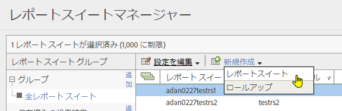
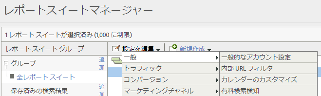
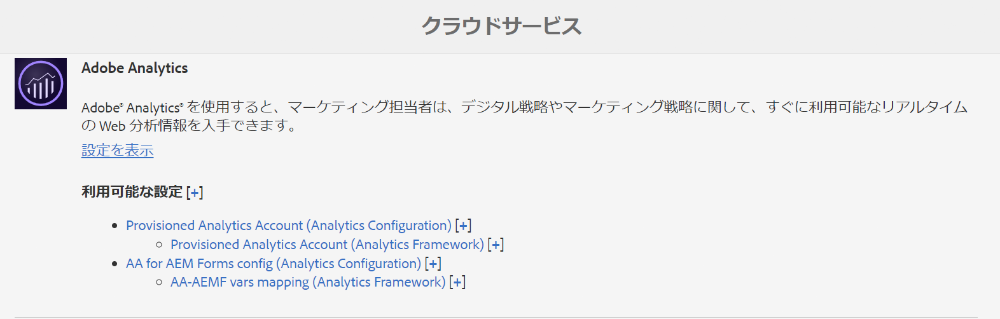
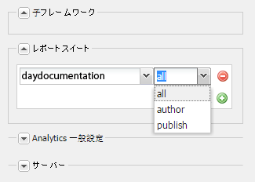
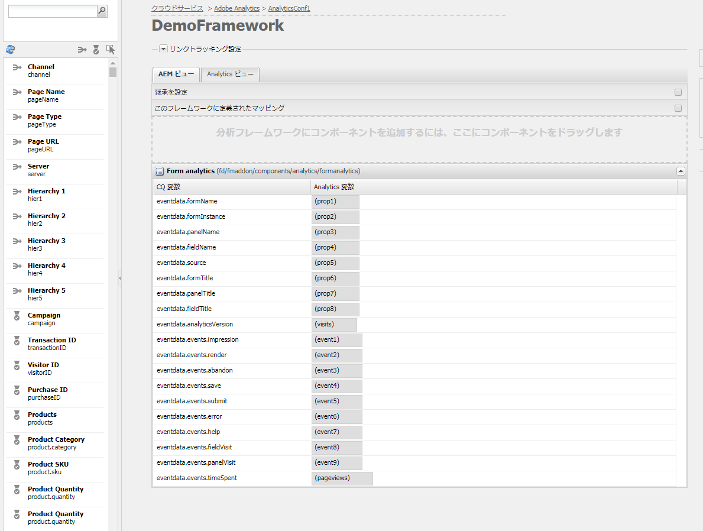
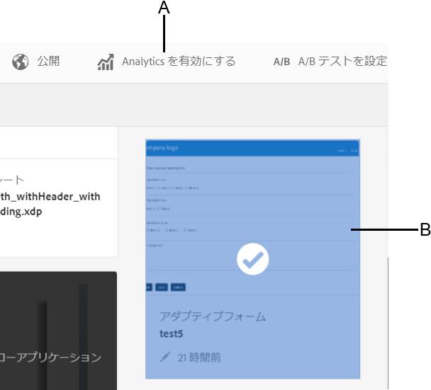

# Analytics とレポートの設定{#configuring-analytics-and-reports}

AEM Forms は、Adobe Analytics と統合されているため、発行済みのフォームとドキュメントのパフォーマンス指標を取得および追跡できます。これらの指標分析の意図は、フォームやドキュメントをさらに有効利用するために必要な変更に関して十分な情報に基づいた決定を行えるよう支援することです。

>[!NOTE]
>
>AEM Forms のアドオンパッケージの一部として、AEM Forms の分析の機能を使用できます。アドオンパッケージのインストールについて詳しくは、「[AEM Forms のインストールと設定](../../forms/using/installing-configuring-aem-forms-osgi.md)」を参照してください。
>
>アドオンパッケージの他に、Adobe Analytics のアカウントと AEM インスタンスでの管理者権限が必要になります。解決方法について詳しくは、「[Adobe Analytics](https://www.adobe.com/solutions/digital-analytics.html)」を参照してください。

## 概要 {#overview}

Adobe Analyticsを使用すると、アダプティブフォーム、HTML5フォーム、およびインタラクティブな通信を使用する際に、ユーザーが直面するインタラクションパターンや問題を見つけることができます。 Adobe Analyticsは、初期設定で、次のパラメーターに関する情報を追跡し、保存します。

* **平均記入時間**：フォームの記入にかかった平均時間。
* **レンディション**：フォームが開かれた回数。
* **ドラフト**：ドラフト状態でフォームが保存される回数。
* **送信**：フォームが送信された回数。
* **中止**：ユーザーがフォームを完了せずに終了した回数。

Adobe Analytics をカスタマイズして、追加のパラメーターを追加または削除できます。上記の情報と共に、レポートには HTML5 およびアダプティブフォームのすべてのパネルに関する次の情報が含まれています。

* **時間**：パネルおよびパネルのフィールドで費やした時間。
* **エラー**：パネルおよびパネルのフィールドで発生したエラーの回数。
* **ヘルプ**:ユーザーがパネルおよびパネルのフィールドのヘルプを開いた回数。

## レポートスイートの作成 {#creating-report-suite}

分析データは、レポートスイートと呼ばれる顧客固有のリポジトリに保存されます。レポートスイートを作成して Adobe Analytics を使用するには、有効な Adobe Marketing Cloud のアカウントが必要です。次の手順を実行する前に、有効な Adobe Marketing Cloud アカウントを保有していることを確認してください。

次の手順を実行して、レポートスイートを作成します。

1. Log in at [https://sc.omniture.com/login/](https://sc.omniture.com/login/)
1. In the Marketing Cloud, select **Admin** > **Admin Console** > **Report Suites**.
1. Report Suite Manager で、**新規作成**／**レポートスイート**&#x200B;を選択します。

   

   新しいレポートスイートの作成

1. 最初のドロップダウンリストを「**テンプレートから作成する**」に設定して、「**コマース**」を選択します。
1. **レポートスイート ID** フィールドを検索し、新規レポートスイート ID を追加します。例えば、JJEsquire とします。レポートスイート ID は、レポートスイート ID フィールドの下に表示されます。ID には自動でプレフィックスが追加されます。多くの場合、会社名が使用されます。
1. 新しい&#x200B;**サイトのタイトル**&#x200B;を追加します。例えば、JJEsquire Getting Started Suite とします。このタイトルは、Analytics UI 内で使用されます。コード内でレポートスイート ID を使用します。
1. ドロップダウンから「**タイムゾーン**」を選択します。このレポートスイートに含められるすべてのデータは、定義済みのタイムゾーンに基づいて記録されます。
1. **ベース URL** フィールドと&#x200B;**デフォルトページ**&#x200B;フィールドは空にしておきます。これらの2つの値は、Adobe Marketing Cloudインターフェイスからのみ使用され、Webサイトにリンクされます。
1. **Go Live 日**&#x200B;は today にしておきます。この Go Live 日で、レポートスイートがアクティベートされる日が決定されます。
1. **日別予想ページビュー数**&#x200B;フィールドに、100 を入力します。このフィールドを使用して、Web サイトの予想される日別のページビュー数を見積もります。この概算から Adobe は、収集していくデータを処理するために必要な適切な量のハードウェアを整備することができます。
1. ドロップダウンリストから「**ベース通貨**」を選択します。このレポートスイートに含められるすべての通貨データは、この通貨形式に変換されて保存されます。
1. 「**レポートスイートの作成**」をクリックします。レポートスイートが正常に作成されたことを通知するメッセージ付きのページ更新が表示されます。
1. 新規作成されたレポートスイートを選択します。**設定を編集**／**一般**／**一般的なアカウント設定**&#x200B;の順に移動します。

   

   一般的なアカウント設定

1. In General Account Settings screen, enable **Geography Reporting**, and click **Save.**
1. **設定を編集**／**トラフィック**／**トラフィック変数**&#x200B;の順に移動します。
1. レポートスイートで、次のトラフィック変数を設定し、有効化します。

   * **formName**：アダプティブフォームの識別子。
   * **formInstance**：アダプティブフォームインスタンスの識別子。この変数のパスレポートを有効にします。
   * **fieldName**:アダプティブフォームフィールドの識別子。 この変数のパスレポートを有効にします。
   * **panelName**:アダプティブフォームパネルの識別子。 この変数のパスレポートを有効にします。
   * **formTitle**：フォームのタイトル。
   * **fieldTitle**：フォームフィールドのタイトル。
   * **panelTitle**：フォームパネルのタイトル。
   * **analyticsVersion**：フォーム分析のバージョン。

1. Navigate to **Edit Settings** > **Conversion** > **Success Events**. 次の成功イベントを定義し、

   | 成功イベント | タイプ |
   |---|---|
   | abandon | カウンター |
   | render | カウンター |
   | panelVisit | カウンター |
   | fieldVisit | カウンター |
   | save | カウンター |
   | エラー | カウンター |
   | help | カウンター |
   | submit | カウンター |
   | timeSpent | 数値 |

   >[!NOTE]
   >
   >An event number and prop number used to configure AEM Forms analytics must be different from event number and prop number used in [AEM analytics](/help/sites-administering/adobeanalytics.md) configuration.

1. Adobe Marketing Cloud アカウントからログアウトします。

## クラウドサービス設定の作成 {#creating-cloud-service-configuration}

クラウドサービス設定は、Adobe Analytics アカウントに関する情報です。この設定で Adobe Experience Manager（AEM）を有効化し、Adobe Analytics に接続します。使用する各 Analytics アカウントに対してそれぞれ個別の設定を作成します。

1. AEM オーサーインスタンスに管理者としてログインします。
1. In the top-left corner, click **Adobe Experience Manager** > **Tools**  > **Deployment** > **Cloud Services**.
1. 「**Adobe Analytics**」アイコンを見つけます。Click **Show Configurations** and then proceed to click **[+]** to add new configuration.

   If you are a first-time user, click **Configure now**.

1. 新しい設定にタイトルを追加します（名前フィールドへの記入はオプションです）。例えば、My analytics configuration などとします。「**作成**」をクリックします。

1. 設定ページで編集パネルが開いたら、次のフィールドに記入します。

   * **会社名**：Adobe Analytics で表示させる会社名。
   * **ユーザー名**：Adobe Analytics のログインに使用する名前。
   * **パスワード**:上記のアカウントのAdobe Analyticsパスワード。
   * **データセンター**:Adobe Analyticsアカウントのデータセンター。

1. 「**Analytics に接続**」をクリックします。正常に接続されたことを通知するメッセージと共にダイアログが表示されます。「**OK**」をクリックします。

## クラウドサービスのフレームワークの作成 {#creating-cloud-service-framework}

Adobe Analytics フレームワークは、Adobe Analytics 変数と AEM 変数の間の一連のマッピングです。フレームワークを使用して、フォームから Adobe Analytics レポートにデータを入力する方法を設定します。フレームワークは、Adobe Analytics の設定に関連付けられています。設定ごとに複数のフレームワークを作成できます。

1. AEM クラウドサービスコンソールで、Adobe Analytics の下にある「**設定を表示**」をクリックします。
1. Click the **[+]** link next to next to your Analytics configuration.

   

   Adobe Analytics 設定

1. フレームワークの&#x200B;**タイトル**&#x200B;と&#x200B;**名前**&#x200B;を入力し、**Adobe Analytics** フレームワークを選択して「**作成**」をクリックします。フレームワークが編集用に開きます。
1. 横にあるポッドの「レポートスイート」セクションで、「**項目を追加**」をクリックし、ドロップダウンリストを使用してフレームワークとやり取りを行うレポートスイート ID（例えば、JJEsquire）を選択します。
1. レポートスイート ID の横で、レポートスイートに情報を送信するサーバーインスタンスを選択します。

   

1. Drag a **Form Analytics component** from the **other** category from SideKick onto the framework.
1. コンポーネントで定義された変数を使用して Analytics 変数をマッピングするには、AEM Content Finder からトラッキングコンポーネントのフィールド上に変数をドラッグします。

   

1. サイドキックの&#x200B;**ページタブ**&#x200B;で「**フレームワークをアクティベート**」をクリックし、フレームワークをアクティベートします。

## AEM Forms Analytics Configuration サービスの設定 {#configuring-aem-forms-analytics-configuration-service}

1. On author instance, open AEM Web Console Configuration manager at `https://<server>:<port>;/system/console/configMgr`.
1. AEM Forms Analytics Configurationを検索して開きます。

   

   AEM Forms Analytics Configuration サービス

1. Specify appropriate values for the following fields and click **Save**.

   * **SiteCatalyst フレームワーク**：「追跡用にフレームワークを設定」セクションで定義したフレームワークまたは設定を選択します。
   * **フィールド時間追跡ベースライン**：フィールド訪問を追跡する必要のある時間を秒単位で指定します。デフォルト値は 0 です。0（ゼロ）よりも大きな値を指定すると、2 つの独立した追跡イベントが Adobe Analytics サーバーに送信されます。最初のイベントは、完了フィールドの追跡を停止するように Analytics サーバーに指示を出します。指定された時間が経過すると、2 番目のイベントが送信されます。2 番目のイベントは、訪問フィールドの追跡を開始するように Analytics サーバーに指示を出します。このように 2 つの独立したイベントを使用することにより、特定のフィールドの処理にかかった時間を正確に測定することができます。値として 0（ゼロ）を指定すると、1 つの追跡イベントが Adobe Analytics サーバーに送信されます。

   * **分析レポート同期 cron 形式**：Adobe Analytics からレポートを取得するための cron 形式を指定します。デフォルト値は 0 0 2 ? * *.

   * **レポート取得タイムアウト：** Analytics レポートの応答でサーバーを待機する時間を秒単位で指定します。デフォルト値は 120 秒です。
   >[!NOTE]
   >
   >レポートの取得操作がタイムアウトになるまで、最大10秒かかります。その後、指定した秒数が経過します。

1. パブリッシュインスタンスで手順 1 から 3 を繰り返し、Analytics を設定します。

これで、フォーム用に Analytics を有効化して、分析レポートを生成できるようになりました。

## フォームまたはドキュメント用に Analytics を有効化する {#enabling-analytics-for-a-form-or-document}

1. Log in to AEM portal at `https://[hostname]:'port'`.
1. **フォーム／フォームとドキュメント**&#x200B;をクリックしてフォームまたはドキュメントを選択し、「**Analytics を有効にする**」をクリックします。Analytics が有効になります。

   

   フォーム用に Analytics を有効化する

   **A.** 「解析を有効にする」ボ **タンB。** 選択したフォーム

   For detailed information on viewing forms analytics reports, see [Viewing and understanding AEM Forms analytics reports](../../forms/using/view-understand-aem-forms-analytics-reports.md)

