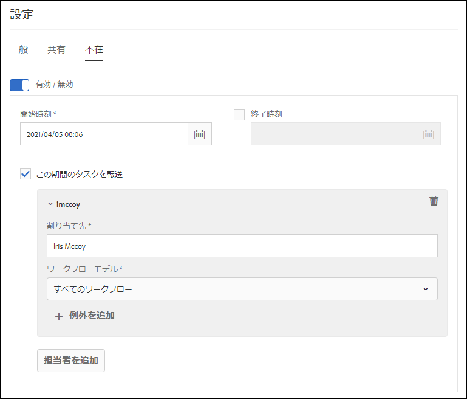

# 不在設定の設定 {#configure-out-of-office-settings}

不在にする予定がある場合は、その期間に割り当てられた品目に対して何が起こるかを指定できます。

不在設定が実施される開始日と時刻および終了日と時刻を指定するオプションがあります。サーバーとは異なるタイムゾーンにいる場合、使用されるタイムゾーンはクライアントのタイムゾーンです。

すべてのアイテムを送信するデフォルトのユーザーを設定できます。 また、特定のプロセスの項目を別のユーザーに送信したり、戻るまで受信トレイに残したりする場合の例外を指定することもできます。 指定したユーザーも不在の場合は、指定したユーザーにアイテムが送信されます。 不在のユーザーにアイテムを割り当てられない場合、アイテムは受信トレイに残ります。

品目の委任は、ワークフローモデルに基づいて分類できます。 例えば、ワークフローAに関連する品目をユーザーAに割り当て、ワークフローBに関連する品目をユーザーBに割り当てることができます。

>[!NOTE]
>
> * [不在]設定を有効にすると、設定を有効にする前に、受信トレイで使用可能なすべての項目が受信トレイに残ります。 設定を有効にした後に受け取った項目のみが委任されます。
> * [不在]の設定をオフにした場合、委任されたアイテムは自動的に再び割り当てられません。 要求機能を使用して、アイテムを割り当てることができます。
> * ユーザAがユーザBに項目を委任し、ユーザBがさらにユーザCに項目を委任すると、項目はユーザCにのみ割り当てられ、ユーザBには割り当てられません。
> * 割り当てにループがある場合、タスクは元のユーザーに残ります。 例えば、ユーザAがユーザBに項目を委任する場合、ユーザCはユーザCに、ユーザCはユーザDに、ユーザDはユーザBに委任する場合、ループが作成されます。 この場合、アイテムは元のユーザーに残ります。 上記の例では、ユーザAはオリジナルユーザです。

## アカウントの不在設定を有効にする {#enable-out-of-office}

アカウントの不在設定を有効にし、別のユーザーにインボックスアイテムを委任するには、次の手順を実行します。

1. AEM インスタンスにログインします。「受信トレイ  表示 ****」をタップします。 受信トレイリストが表示されます。
1. 「作成」ボタンの横にある  表示セレクタ  表示セレクター **[!UICONTROL アイコンをタップし、「設定」を]******&#x200B;タップします。 設定ダイアログが表示されます。
1. 設定ダイアログ **[!UICONTROL で「不在]** 」タブを開きます。
1. 「有効にする **[!UICONTROL /無効にする]** 」ボタンをタップして、不在設定を有効にします。
1. 設定の **[!UICONTROL 開始時]** 間と **[!UICONTROL 終了時間]** (End Time)を指定します。 項目は指定された期間にのみ委任されます。 End Timeフィールド **[!UICONTROL を空のままにして]** 、無限の期間のアイテムを委任します。
1. [次の期間中 **[!UICONTROL にアイテムを転送する]チェックボックスを]** 選択します。 このオプションを選択せずに担当者を指定しない場合、品目はどのユーザーにも転送されません。 ただし、お客様は不在で設定が有効になっていますが、アイテムは受信トレイに残ります。
1. 「担当者」 **[!UICONTROL 追加をタップしま]**&#x200B;す。 「担当者」フィールドで、 **[!UICONTROL 項目を委]** 任するユーザーを指定します。 指定したユー **[!UICONTROL ザーに委任する]** 「ワークフローモデル」を指定します。 複数のワークフローモデルを選択できます。

   さらに、ワークフローモデルに関係なく、すべてのワークフローを特定のリストに割り当てるには、「ワークフローモデル」ドロップダウンオプションから **** 「すべてのユーザー」を選択します。  

   一部を除くすべてのワークフローモデルに対して特定のリストに項目を割り当てるには、「ワークフローモデル」ドロップダウンから「すべての **[!UICONTROL 」を選択し、「]** + Exceptions ****」をタップして、除外するワークフローモデルを指定します。
    

   手順を繰り返して、さらに担当者を追加します。  

   >[!NOTE]
   >
   >担当者の順序は重要です。 不在設定を有効にしたユーザーにアイテムが割り当てられると、そのアイテムは、指定された担当者のリストに対して、担当者が追加された順序で評価されます。 品目が条件に一致する場合、その品目は担当者に割り当てられ、次の担当者はチェックされません。

1. 「**[!UICONTROL 保存]**」をタップします。この設定は、指定した開始の日時に有効です。 不在中にログインしても、設定を変更するまでは不在と見なされます。

現在は、不在期間中に自分に割り当てられた項目が、指定された担当者に自動的に割り当てられます。

>[!NOTE]
>
>(フォーム中心のタスク項目のみ)ワークフローの「ワークフローを割り当て **」ステップの「不在」設定を使用して** 、担当者が委任することを許可する **** 」オプションを有効にします。 上記のオプションが有効になっている項目のみが他のユーザーに委任されます。

## 制限事項 {#limitations}

* グループへの項目の割り当てはサポートされていません。
* プロジェクトタスクの不在を有効にする機能は、現在サポートされていません。
