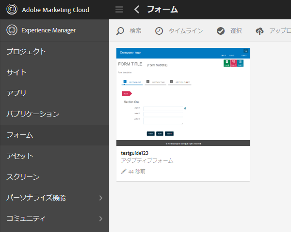

# 同期スケジューラの設定 {#configuring-the-synchronization-scheduler}

デフォルトでは、同期スケジューラーは 3 分毎に実行して、LiveCycle Workbench 11 を経由してリポジトリ内で変更および更新されたすべてのアセットを同期します。同期プロセスが完了すると、フォームおよびリソースを含むアプリケーションを AEM Forms ユーザーインターフェイスで表示することができます。

## 同期スケジューラーの間隔の変更 {#change-interval-of-the-synchronization-scheduler}

次の手順を実行して、同期スケジューラーの間隔を変更します。

1. AEM Configuration Manager にログインします。Configuration ManagerのURLは、 `https://'[server]:[port]'/lc/system/console/configMgr`

1. **FormsManagerConfiguration** バンドルを探して開きます。 

1. 「**同期スケジューラー頻度**」オプションに対して新しい値を指定します。

   頻度の単位は分です。例えば、スケジューラーを 60 分毎に実行するように設定するには、60 と指定します。

## アセットの同期 {#synchronizing-assets}

「**リポジトリからアセットを同期**」オプションを使用すると、アセットを手動で同期できます。次の手順を実行して、アセットを手動で同期します。

1. AEM Forms にログインします。The default URL is `https://'[server]:[port]'/lc/aem/forms/`.

   

   **図：***AEM Formsユーザーインターフェイス*

1. ツールバ  アイコンをクリックします。 最後に設定したパスにアセットが存在しない場合は、下の図に示すダイアログボックスが表示されます。「**開始**」をクリックして同期を開始します。

   

   **図：** 同期ダイ *アログボックス*

## 同期エラーのトラブルシューティング {#troubleshooting-synchronization-error}

ワークフローデザイナー（LiveCycle Workbench）で新しいアプリケーションを作成できます。

If the newly created application and a folder at /content/dam/formsanddocuments has identical name, an error &quot;*An asset with the same name as this application already exists at root level.*」がログに記録される。

競合を解決するには、アプリケーションの名前を変更し、アセットを手動で同期します。

**図：** アセット *同期の競合ダイアログボックス*
