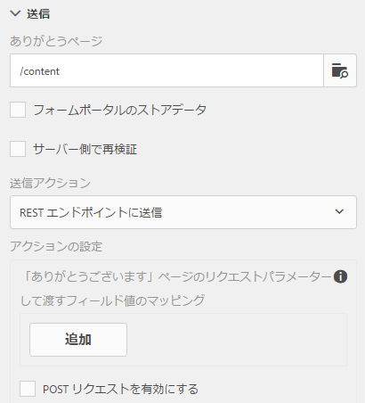

# リダイレクトページの設定{#configuring-redirect-page}

 Adobeでは、最新の拡張可能なデータキャプチャを使用することをお勧めします [コアコンポーネント](https://experienceleague.adobe.com/docs/experience-manager-core-components/using/adaptive-forms/introduction.html?lang=ja) 対象 [新しいアダプティブFormsの作成](/help/forms/using/create-an-adaptive-form-core-components.md) または [AEM SitesページへのアダプティブFormsの追加](/help/forms/using/create-or-add-an-adaptive-form-to-aem-sites-page.md). これらのコンポーネントは、アダプティブFormsの作成における大幅な進歩を表し、印象的なユーザーエクスペリエンスを実現します。 この記事では、基盤コンポーネントを使用してアダプティブFormsを作成する古い方法について説明します。 

| バージョン | 記事リンク |
| -------- | ---------------------------- |
| AEM as a Cloud Service | [ここをクリックしてください](https://experienceleague.adobe.com/docs/experience-manager-cloud-service/content/forms/adaptive-forms-authoring/authoring-adaptive-forms-foundation-components/configure-submit-actions-and-metadata-submission/configuring-redirect-page.html) |
| AEM 6.5 | この記事 |

フォーム作成者は、フォーム送信後にユーザーがリダイレクトされるページを各フォームに設定することができます。

1. 編集モードで、コンポーネントを選択し、／**アダプティブフォームコンテナ**&#x200B;をクリックしてから、  をクリックします。

1. サイドバーで、「**送信**」をクリックします。

1. 送信セクションの「ありがとうございました」ページで、リダイレクトページの URL を指定します。
1. オプションとして、「送信アクション」で、「REST エンドポイントへの送信」の送信アクションについて、リダイレクトページに渡されるパラメーターを設定することができます。

リダイレクトページ設定

フォーム作成者は、次のパラメーターを使用して「ありがとうございました」ページに渡すことができます。 使用可能なすべての送信アクションに対して、`status` と `owner` のパラメーターが渡されます。これら 2 つのパラメーターの他に、追加のパラメーターが次の送信アクションに渡されます。

* **コンテンツを格納アクション**（非推奨）：送信されたデータが格納されるリポジトリのノードのパス `contentPath` が渡されます。

* **PDF の保存アクション**（非推奨）：送信されたデータと、リポジトリで PDF ファイルを保存しているノードのパス `contentPath` が渡されます。

* **フォームワークフローへの送信**：フォームワークフローから返される出力パラメーターが渡されます。

* **REST エンドポイントへの送信**：フィールド内にパラメーターマッピングのため追加されたパラメータが渡されます。`status` および `owner` パラメーターは、この送信アクションでは渡されません。詳しくは、[送信アクション「REST エンドポイントへの送信」の設定](../../forms/using/configuring-submit-actions.md)を参照してください。 
