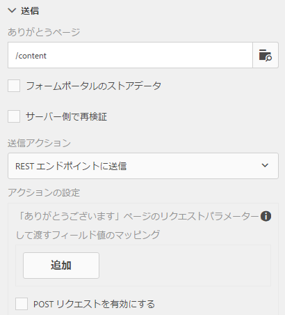
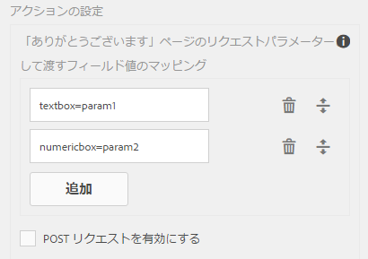
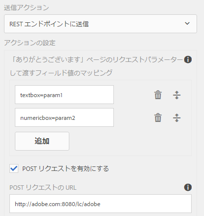
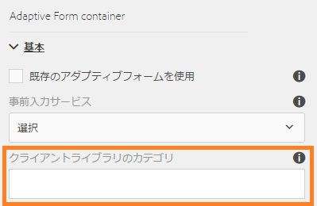

# 送信アクションの設定{#configuring-the-submit-action}

## 送信アクションの概要 {#introduction-to-submit-actions}

送信アクションは、ユーザーがアダプティブフォームの「送信」ボタンをクリックしたときにトリガーされます。アダプティブフォームの送信アクションを設定することができます。アダプティブフォームには、追加設定なしで使用できる送信アクションがあります。デフォルトの送信アクションをコピーし、拡張することにより、独自の送信アクションを作成することができます。ただし、要件に基づき、送信されたフォームのデータを処理するための独自の送信アクションを書いて登録することができます。送信アクションでは、 [同期または非同期の送信を使用できます](../../forms/using/asynchronous-submissions-adaptive-forms.md)。

サイドバーにある「アダプティブフォームコンテナ」プロパティの「**送信**」セクションで、送信アクションを設定できます。

送信アクションの設定

アダプティブフォームで使用可能なデフォルトの送信アクションは次のとおりです。

* REST エンドポイントへの送信
* 電子メールを送信
* 電子メールで PDF を送信
* Forms ワークフローを起動
* フォームデータモデルを使用して送信
* フォームポータル送信アクション
* AEM ワークフローを起動

>[!NOTE]
>
>電子メールで PDF を送信アクションは、XFA テンプレートをフォームモデルとして使用しているアダプティブフォームにのみ使用することができます。

>[!NOTE]
>
>[AEM_Installation_Directory]\crx-quickstart\temp\datamanager\ASM folder
>が存在するかを確認します。ディレクトリは、添付ファイルを一時的に保存するために必要になります。ディレクトリが存在しない場合は作成します。

>[!CAUTION]
>
>If you [prefill](../../forms/using/prepopulate-adaptive-form-fields.md) a form template, form data model, or schema based adaptive form with XML or JSON data complaint to a schema (XML schema, JSON schema, form template, or form data model) that is data does not contain &lt;afData>, &lt;afBoundData>, and &lt;/afUnboundData> tags, then the data of unbounded fields (Unbounded fields are adaptive form fields without [bindref](../../forms/using/prepopulate-adaptive-form-fields.md) property) of the adaptive form is lost.

アダプティブフォームがユースケースを実現するように、カスタム送信アクションを作成できます。For more information, see [Writing custom Submit action for adaptive forms](../../forms/using/custom-submit-action-form.md).

## REST エンドポイントへの送信 {#submit-to-rest-endpoint}

**REST エンドポイントへの送信** オプションでは、フォームに記入されたデータが、HTTP GET リクエストの一環として設定済みの確認ページに渡されます。フィールド名をリクエストに追加することができます。リクエストのフォーマットは次のとおりです。

`{fieldName}={request parameter name}`

以下の画像に示されているとおり、`param1` および `param2` が、**textbox** フィールドおよび&#x200B;**numericbox** フィールドからコピーされた値を持つパラメーターとして次のアクションに向けて渡されます。

**POST リクエストを有効にする**&#x200B;ことで、リクエストを POST するURL を入力することもできます。フォームをホストする AEM サーバーにデータを送信するには、AEM サーバーのルートパスに対応する相対パスを使用します。例えば、/content/forms/af/SampleForm.html のようにします。他のサーバーにデータを送信するには、絶対パスを使用します。

REST エンドポイントへの送信の設定

>[!NOTE]
フィールドを REST URL 内のパラメーターとして渡すためには、すべてのフィールドが異なる要素名を持っている必要があります。これは、異なるパネルに置かれているフィールドにも適用されます。

### リソースまたは外部の REST エンドポイントへの送信されたデータの POST{#post-submitted-data-to-a-resource-or-external-rest-end-point-nbsp}

**REST エンドポイントへの送信**&#x200B;アクションを利用して、送信されたデータを REST URL に POST することができます。URLには、内部（フォームがレンダリングされるサーバー）または外部サーバーを使用できます。

内部サーバーにデータを POST 送信するには、リソースのパスを指定します。データは、リソースのパスに POST されます。例：/content/restEndPoint。このような POST リクエストには、送信リクエストの認証情報が使用されます。

内部サーバーにデータを POST 送信するには、URL を指定します。URLの形式はhttps://host:port/path_to_rest_end_pointです。 POST リクエストを匿名で処理するようにパスを設定してください。

上の例で、ユーザーが `textbox` に入力した情報は、パラメーター `param1` を使用して取得します。Syntax to post data captured using `param1` is:

`String data=request.getParameter("param1");`

Similarly, paramenters that you use for posting XML data and attachments are `dataXml` and `attachments`.

例えば、この 2 つのパラメーターをスクリプト中で使用して、REST エンドポイントに送信されたデータを解析できます。データを保存および解析するための構文は、次のとおりです。

`String data=request.getParameter("dataXml");`
`String att=request.getParameter("attachments");`

この例では、`data` が XML データを格納し、`att` が添付ファイルデータを格納します。

## 電子メールを送信 {#send-email}

The **Send Email** submit action sends an email to one or more recipients on successful submission of the form. 生成される電子メールには、事前に定義された形式のフォームデータを含めることができます。

>[!NOTE]
フォームデータを電子メールに含めるには、異なるパネルに配置されているフォームフィールドを含め、すべてのフォームフィールドが異なる要素名を持っている必要があります。

## 電子メールで PDF を送信 {#send-pdf-via-email}

「**電子メールで PDF を送信**」送信アクションでは、フォームの送信が完了すると同時に、1 人または複数の受信者にフォームデータを含む PDF が添付された電子メールが送信されます。

>[!NOTE]
この送信アクションは、レコードテンプレートのドキュメントを持つXFAベースのアダプティブフォームおよびXSDベースのアダプティブフォームで使用できます。

## Forms ワークフローを起動 {#invoke-a-forms-workflow}

「**フォームワークフローへの送信**」送信オプションでは、データ XML および添付ファイル（存在する場合に）が既存の Adobe LiveCycle プロセスまたは JEE での AEM Forms プロセスに送信されます。

送信アクション「フォームワークフローへの送信」の設定方法について詳しくは、「[フォームワークフローを利用したフォームデータの送信および処理](../../forms/using/submit-form-data-livecycle-process.md)」参照してください。

## フォームデータモデルを使用して送信 {#submit-using-form-data-model}

The **Submit using Form Data Model** submit action writes submitted adaptive form data for the specified data model object in a form data model to its data source. 送信アクションの設定時に、データソースに書き戻す送信済みデータを持つデータモデルオブジェクトを選択できます。

さらに、添付されたフォームをフォームデータモデルやレコードのドキュメント（DOR）を使用してデータソースに送信できます。

フォームデータモデルについて詳しくは、「[AEM Forms のデータ統合機能](../../forms/using/data-integration.md)」を参照してください。

## フォームポータル送信アクション {#forms-portal-submit-action}

The **Forms Portal Submit Action** option makes form data available through an AEM Forms portal.

フォームポータルと送信アクションについて詳しくは、「[ドラフトと送信コンポーネント](../../forms/using/draft-submission-component.md)」を参照してください。

## AEM ワークフローを起動 {#invoke-an-aem-workflow}

「**AEM ワークフローを起動**」送信アクションは、アダプティブフォームと AEM ワークフローを関連付けます。フォームが送信されると、関連するワークフローは処理ノードで自動的に起動します。さらに、ワークフローのペイロードの場所に、データファイル、添付ファイル、レコードのドキュメントを配置します（該当の場合）。

「**AEM ワークフローを起動**」送信アクションを使用する前に、[AEM DS の設定を行います](../../forms/using/configuring-the-processing-server-url-.md)。For information about creating an AEM Workflow, see [Form-centric workflows on OSGi](../../forms/using/aem-forms-workflow.md).

## アダプティブフォームにおけるサーバー側の再検証 {#server-side-revalidation-in-adaptive-form}

通常、どのオンラインデータキャプチャシステムでも、開発者はいくつかのビジネスルールを適用するために、クライアント側にJavaScript検証を配置します。 しかし、最新のブラウザでは、エンドユーザーが Web Browser DevTools Console などのさまざまな手法を使ってこれらの検証を回避し、手動で送信を行える方法が存在します。このような手法は、アダプティブフォームにも有効です。フォーム開発者は、多様な検証ロジックを作成することができますが、エンドユーザーは、これらの検証ロジックを回避し、無効なデータをサーバーに送信することができます。無効なデータは、フォーム製作者が適用したビジネスルールを破ることになります。

サーバー側の再検証機能は、アダプティブフォームの製作者がアダプティブフォームのデザイン中に指定した検証を、サーバー上でも実行するための機能です。これは、フォームの検証で表されるデータ送信の漏洩やビジネスルール違反の可能性を阻止します。

### サーバー側で検証されるもの{#what-to-validate-on-server-br}

アダプティブフォームの追加設定なし（OOTB）のフィールド検証で、サーバーで再実行されるものは次のとおりです。

* 必須
* 検証パターン形式文字列
* 検証式

### サーバー側検証の有効化 {#enabling-server-side-validation-br}

Use the **Revalidate on server** under Adaptive Form Container in the sidebar to enable or disable server-side validation for the current form.

サーバー側検証の有効化

エンドユーザーがこれらの検証を回避してフォームを送信した場合、サーバーが再度検証を行います。サーバー側での検証が失敗した場合、送信処理が中止されます。エンドユーザーには、元のフォームが再度表示されます。取得されたデータおよび送信されたデータは、エラーとしてユーザーに表示されます。

### 検証式でのカスタム関数のサポート {#supporting-custom-functions-in-validation-expressions-br}

**複雑な検証ルール**&#x200B;の場合、正確な検証スクリプトはカスタム関数の中に存在し、作成者はこれらのカスタム関数をフィールド検証式から呼び出すことがあります。To make this custom function library known and available while performing server-side validations, the form author can configure the name of AEM client library under the **Basic** tab of Adaptive Form Container properties as shown below.

検証式でのカスタム関数のサポート

作成者は、アダプティブフォームごとにカスタムJavaScriptライブラリを設定できます。 ライブラリには、jQuery および underscore.js に依存する再利用可能な関数のみを保存してください。

## 送信アクションに対するエラー処理 {#error-handling-on-submit-action}

AEM セキュリティおよび堅牢化ガイドラインの一部として、404.jsp や 500.jsp などのカスタムエラーページを設定してください。これらのハンドラーは、フォーム送信時に 404 または 500 エラーが表示されるときに呼び出されます。また、これらのハンドラーは、発行ノードでこれらのエラーコードがトリガーされるときにも呼び出されます。

For more information, see [Customizing Pages shown by the Error Handler](/help/sites-developing/customizing-errorhandler-pages.md).
