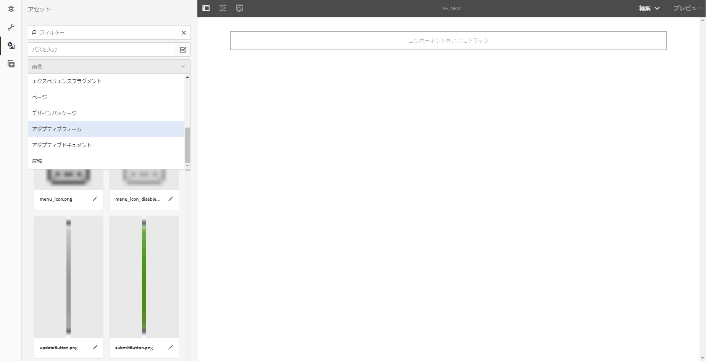
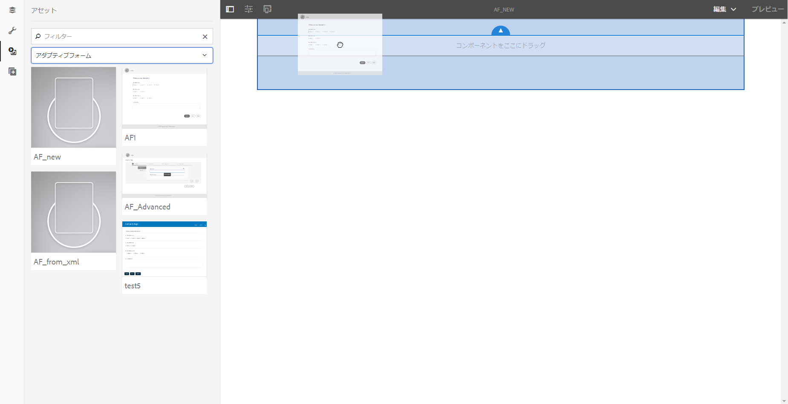

# アダプティブフォームのセットを使用したアダプティブフォームの作成{#create-an-adaptive-form-using-a-set-of-adaptive-forms}

## 概要 {#overview}

銀行口座の開設の申し込みなどでは、ユーザーは複数のフォームを記入します。ユーザーにフォーム一式の記入を依頼するのではなく、フォームをまとめて、大きなフォーム（親フォーム）を作成することができます。大きなフォームにアダプティブフォームを追加すると、パネル（子フォーム）として追加されます。子フォームのセットを追加して親フォームを作成します。ユーザーの入力に基づいて、パネルを表示または非表示にすることができます。親フォームのボタン、例えば送信やリセットなどは、子フォームのボタンを上書きします。親フォームのアダプティブフォームを追加するには、アダプティブフォームを（アダプティブフォームのフラグメントのように）アセットブラウザからドラッグアンドドロップします

使用できる機能は、次のとおりです。

* 独立オーサリング
* 適切なフォームの表示／非表示
* 遅延読み込み

独立オーサリングや遅延読み込みといった機能により、個々のコンポーネントを使用した親フォーム作成のパフォーマンスが向上しました。

>[!NOTE]
>
>子フォームや親フォームなど、XFA ベースのアダプティブフォームまたはフラグメントを使用することはできません。

## 機能の仕組み {#behind-the-scenes}

親フォームに XSD ベースのアダプティブフォームを追加することができます。親フォームの構造は、[アダプティブフォーム](../../forms/using/prepopulate-adaptive-form-fields.md)と同じです。アダプティブフォームを子フォームとして追加すると、親フォームのパネルとして追加されます。バインドされた子フォームのデータは、親フォームの XML スキーマの `afBoundData` セクションの `data` ルートに保存されます。

例えば、顧客が申込フォームを記入したとします。フォームの最初の 2 つのフィールドは、名前と ID です。この XML は次のようになります。

```xml
<afData>
    <afUnboundData>
        <data />
    </afUnboundData>
    <afBoundData>
        <data xmlns:xfa="https://www.xfa.org/schema/xfa-data/1.0/">
            <applicantName>Sarah Rose</applicantName>
            <applicantId>1234</applicantId>
        </data>
    </afBoundData>
</afData>
```

申込フォームに別のフォームを追加して、顧客に職場の住所の記入を要求します。子フォームのスキーマのルートは `officeAddress` です。`bindref`、`/application/officeAddress` または `/officeAddress` を適用します。`bindref` がない場合、子フォームが `officeAddress` サブツリーとして追加されます。以下のフォームの XML を参照してください。

```xml
<afData>
    <afUnboundData>
        <data />
    </afUnboundData>
    <afBoundData>
        <data xmlns:xfa="https://www.xfa.org/schema/xfa-data/1.0/">
            <applicantName>Sarah Rose</applicantName>
            <applicantId>1234</applicantId>
            <officeAddress>
                <addressLine>1, Geometrixx City</addressLine>
                <zip>11111</zip>
            </officeAddress>
        </data>
    </afBoundData>
</afData>
```

顧客が住所を入力できる別のフォームを挿入する場合は、`bindref` `/application/houseAddress or /houseAddress.`を適用すると、XML は次のようになります。

```xml
<afData>
    <afUnboundData>
        <data />
    </afUnboundData>
    <afBoundData>
        <data xmlns:xfa="https://www.xfa.org/schema/xfa-data/1.0/">
            <applicantName>Sarah Rose</applicantName>
            <applicantId>1234</applicantId>
            <officeAddress>
                <addressLine>1, Geometrixx City</addressLine>
                <zip>11111</zip>
            </officeAddress>
            <houseAddress>
                <addressLine>2, Geometrixx City</addressLine>
                <zip>11111</zip>
            </houseAddress>
        </data>
    </afBoundData>
</afData>
```

スキーマのルートと同じサブルート名にするには、（この例では`Address` ）、インデックス付きの bindref を使用します。

例えば、bindref `/application/address[1]` または `/address[1]` および `/application/address[2]` または `/address[2]` を適用します。このフォームの XML は、以下のようになります。

```xml
<afData>
    <afUnboundData>
        <data />
    </afUnboundData>
    <afBoundData>
        <data xmlns:xfa="https://www.xfa.org/schema/xfa-data/1.0/">
            <applicantName>Sarah Rose</applicantName>
            <applicantId>1234</applicantId>
            <address>
                <addressLine>1, Geometrixx City</addressLine>
                <zip>11111</zip>
            </address>
            <address>
                <addressLine>2, Geometrixx City</addressLine>
                <zip>11111</zip>
            </address>
        </data>
    </afBoundData>
</afData>
```

`bindRef` プロパティを使用して、フォームまたはフラグメントのデフォルトサブツリーを変更することができます。`bindRef` プロパティにより、XML スキーマのツリー構造における位置を示すパスを指定できます。

バインドされていない子フォームのデータは、親フォームの XML スキーマの `afUnboundData` セクションの `data` ルートに保存されます。

アダプティブフォームを子フォームとして、複数回追加できます。`bindRef` が正しく修正されて、アダプティブフォームの各使用済みインスタンスが、データルート上で異なるサブルートを指定するようにします。

>[!NOTE]
>
>異なるフォームまたはフラグメントが同じサブルートにマッピングされる場合、データは上書きされます。

## アセットブラウザーを使用して、子フォームとしてアダプティブフォームを追加する {#adding-an-adaptive-form-as-a-child-form-using-asset-browser}

アセットブラウザーを使用して、子フォームとしてアダプティブフォームを追加するステップを実行します。

1. 親フォームを編集モードで開きます。
1. サイドバーで、**アセット**／をクリックします。アセットの下で、**アダプティブフォーム** をドロップダウンリストから選択します。
   [ ](assets/asset-1.png)

1. 子フォームとして追加するアダプティブフォームをドラッグ＆ドロップします。
   [ ](assets/drag-drop-1.png)ドロップしたアダプティブフォームは、子フォームとして追加されます。
