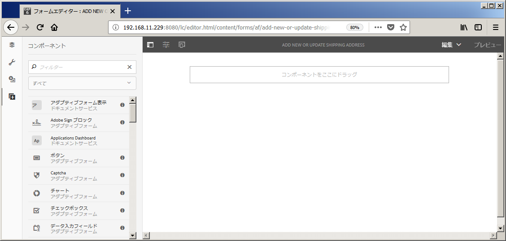
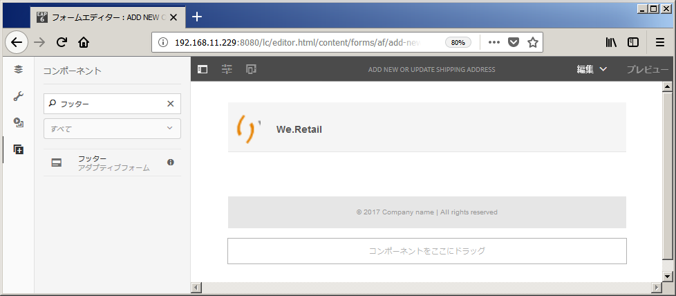

# チュートリアル：アダプティブフォームの作成 {#do-not-publish-tutorial-create-an-adaptive-form}

これは、「[最初のアダプティブフォームを作成する](/help/forms/using/create-your-first-adaptive-form.md)」シリーズを構成するチュートリアルです。チュートリアル内のユースケースを理解して実際に操作できるように、このシリーズのチュートリアルを最初から順に学習することをお勧めします。

## このチュートリアルについて {#about-the-tutorial}

アダプティブフォームは、動的でレスポンシブな次世代型のフォームです。アダプティブフォームを使用して、エクスペリエンスをカスタマイズすることができます。You can also integrate adaptive forms with [!DNL Adobe Analytics] for usage statistics and [!DNL Adobe Campaign] for campaign management. For more information about adaptive forms capabilities, see [Introduction to authoring adaptive forms](/help/forms/using/introduction-forms-authoring.md).

正しい手順を踏めば、フォームの作成と管理を簡単に行うことができます。このチュートリアルでは、以下の操作を行う方法について説明します。

* [顧客が配送先住所を追加するためのアダプティブフォームを作成する](/help/forms/using/create-adaptive-form.md#step-create-the-adaptive-form)

* [顧客の情報を表示して保存するためのアダプティブフォームフィールドのレイアウトを設定する](/help/forms/using/create-adaptive-form.md#step-add-header-and-footer)

* [フォームコンテンツが記載された電子メールを送信するためのアクションを作成する](/help/forms/using/create-adaptive-form.md#step-add-components-to-capture-and-display-information)
* [アダプティブフォームのプレビューと送信を行う](/help/forms/using/create-adaptive-form.md)

このチュートリアルの最後に、以下のようなフォームにアクセスするためのリンクがあります。\

## 手順 1：アダプティブフォームを作成する {#step-create-the-adaptive-form}

1. AEM オーサーインスタンスにログインし、**[!UICONTROL Adobe Experience Manager]**／**[!UICONTROL フォーム]**／**[!UICONTROL フォームとドキュメント]**&#x200B;に移動します。The default URL is [http://localhost:4502/aem/forms.html/content/dam/formsanddocuments](http://localhost:4502/aem/forms.html/content/dam/formsanddocuments).
1. 「**[!UICONTROL 作成]**」をタップして、「**[!UICONTROL アダプティブフォーム]**」を選択します。テンプレートを選択するためのオプションが表示されます。**[!UICONTROL 空白]**&#x200B;テンプレートをタップして選択し、「**[!UICONTROL 次へ]**」をタップします。

1. 「**[!UICONTROL プロパティの追加]**」オプションが表示されます。「**[!UICONTROL タイトル]**」フィールドと「**[!UICONTROL 名前]**」フィールドは入力必須です。

   * **タイトル：** 「 `Add new or update shipping address` タイトル **** 」フィールドで指定します。 「タイトル」フィールドに入力した値が、フォームの表示名になります。The title helps you identify the form in the AEM [!DNL Forms] user interface.
   * **名前：** 「 `shipping-address-add-update-form` 名前 **** 」フィールドにを指定します。 「名前」フィールドに入力した値が、フォームの名前になります。指定された名前のノードがリポジトリに作成されます。タイトルを入力し始めると、名前フィールドの値が自動的に生成されます。候補として入力された値は変更可能です。「ドキュメント名」フィールドには、英数字、ハイフン、アンダースコアのみを使用することができます。無効な入力はすべてハイフンに置き換えられます。

1. 「**[!UICONTROL 作成]**」をタップします。アダプティブフォームが作成され、フォームを編集用に開くためのダイアログが表示されます。Tap **[!UICONTROL Open]** to open the newly created form in a new tab. フォームが編集モードで表示されます。新しく作成されたフォームを必要に応じてカスタマイズするためのサイドバーも表示されます。

   アダプティブフォームのオーサリングインターフェースと使用可能なコンポーネントについて詳しくは、「[アダプティブフォームの作成について](/help/forms/using/creating-adaptive-form.md)」を参照してください。

   

## 手順 2：ヘッダーとフッターを追加する {#step-add-header-and-footer}

AEM [!DNL Forms] provides many components to display information on an adaptive form. ヘッダーコンポーネントとフッターコンポーネントを使用すると、フォームの全体的な外観を統一することができます。ヘッダーには通常、会社のロゴ、フォームのタイトル、フォームの概要を指定します。フッターには通常、著作権に関する情報と他のページへのリンクを指定します。

1. ト  / 。 コンポーネントブラウザーが表示されます。Drag the **[!UICONTROL Header]** component from component browser to the adaptive form.
1. 「**[!UICONTROL ロゴ]**」をタップします。ツールバーが表示されます。ツールバーの  をタップし、「 **We.Retail**」と入力して、 aem_6_3_forms_saveをタップします。

1. 「画像」をタップします。ツールバーが表示されます。「 」をタップします。 画面の左側にプロパティブラウザーが表示されます。「**[!UICONTROL 参照]**」をタップして、ロゴ画像をアップロードします。「 」をタップします。 画像がヘッダーに表示されます。

   上記の「Get file」をタップすると、このチュートリアルで使用するロゴをダウンロードすることができます。

   [ファイルを入手](assets/logo.png)

1. **[!UICONTROL Footer]** コンポーネントをtreeexpandallからアダプティブフォームにドラッグし  ます。 この段階では、フォームは次のようになります。

   

## 手順 3：情報を取得して表示するためのコンポーネントを追加する {#step-add-components-to-capture-and-display-information}

コンポーネントは、アダプティブフォームを構成するための構築ブロックです。AEM [!DNL Forms] provides many components to capture and display information in an adaptive form. You can drag the components from  to a form. To learn about available components and corresponding functionality, see [Introduction to authoring adaptive forms](/help/forms/using/introduction-forms-authoring.md).

1. Drag the **[!UICONTROL Numeric Box component]** to the adaptive form. フッターコンポーネントの前にドロップします。Open properties of the component, change **[!UICONTROL Title]** of the component to **`Customer ID`**, change **[!UICONTROL Element Name]** to **`customer_ID`**, enable the **[!UICONTROL Required Field]** option, enable the **[!UICONTROL Use HTML5 Number Input Type]** option, and tap .
1. 3 つのテキストボックスコンポーネントをアダプティブフォームにドラッグし、フッターコンポーネントの前にドロップします。これらのテキストボックスについて、以下のプロパティを設定します。：

   <table> 
    <tbody> 
     <tr> 
      <td><b>Property</b></td> 
      <td><b>テキストボックス 1 </b></td> 
      <td><b>テキストボックス 2 </b></td> 
      <td><b>テキストボックス 3</b></td> 
     </tr> 
     <tr> 
      <td>タイトル</td> 
      <td>名前  </td> 
      <td>発送先住所</td> 
      <td>都道府県</td> 
     </tr> 
     <tr> 
      <td>要素名</td> 
      <td>customer_Name  </td> 
      <td>customer_Shipping_Address</td> 
      <td>customer_State</td> 
     </tr> 
     <tr> 
      <td>必須フィールド</td> 
      <td>Enabled</td> 
      <td>Enabled</td> 
      <td>Enabled</td> 
     </tr> 
     <tr> 
      <td>複数行を許可  </td> 
      <td>無効</td> 
      <td>Enabled</td> 
      <td>無効</td> 
     </tr> 
    </tbody> 
   </table>

1. **[!UICONTROL 数値ボックス]**&#x200B;コンポーネントをフッターコンポーネントの前にドラッグします。Open properties of the component, set values listed in the below table, Tap .

   | プロパティ | 値 |
   |---|---|
   | タイトル | 郵便番号 |
   | 要素名 | customer_ZIPCode |
   | 最大桁数 | 6 |
   | 必須フィールド | Enabled |
   | 表示パターンタイプ | パターンなし |

1. **[!UICONTROL 電子メール]**&#x200B;コンポーネントをフッターコンポーネントの前にドラッグします。Open properties of the component, set values listed in the below table, and tap .

   | プロパティ | 値 |
   |---|---|
   | タイトル | 電子メール |
   | 要素名 | customer_Email |
   | 必須フィールド | Enabled |

1. **[!UICONTROL 添付ファイル]**&#x200B;コンポーネントをフッターコンポーネントの前にドラッグします。Open properties of the component, set values listed in the below table, and tap .

   <table> 
    <tbody> 
     <tr> 
      <td><b>プロパティ</b></td> 
      <td><b>値</b></td> 
     </tr> 
     <tr> 
      <td>タイトル</td> 
      <td>Government approved address proof  </td> 
     </tr> 
     <tr> 
      <td>要素名</td> 
      <td>customer_Address_Proof</td> 
     </tr> 
     <tr> 
      <td>必須フィールド</td> 
      <td>Enabled</td> 
     </tr> 
    </tbody> 
   </table>

1. **[!UICONTROL 送信ボタン]**&#x200B;コンポーネントをアダプティブフォームにドラッグし、フッターコンポーネントの前にドロップします。コンポーネントのプロパティを開き、「要素名」を「 `address_addition_update_submit`」に変更し、「 」をタップします。 これでフォームのレイアウトが設定され、フォームが以下のように表示されます。

   

## 手順 4：アダプティブフォームの送信アクションを設定する {#step-configure-submit-action-for-the-adaptive-form}

アダプティブフォームの「送信」ボタンをタップすると、送信アクションがトリガーされます。送信アクションを使用して、フォームデータをローカルリポジトリに保存したり、フォームデータを REST エンドポイントに送信したり、フォームデータを電子メールとして送信したりすることができます。アダプティブフォームには、そのほかにも、すぐに使用できる送信アクションがいくつか用意されています。詳しくは、「[送信アクションの設定](/help/forms/using/configuring-submit-actions.md)」を参照してください。

次の手順を使用して、フォームの電子メール送信アクションとデモの送信アクションを設定できます。

1. 電子メールサーバーを設定します。詳しくは、「[電子メール通知の設定](/help/sites-administering/notification.md)」を参照してください。

1. Tap **[!UICONTROL Form Container]** in the Content browser and tap . プロパティブラウザが左側に開きます。
1. **[!UICONTROL 送信]**／**[!UICONTROL 送信アクション]**&#x200B;に移動します。「**[!UICONTROL 電子メールを送信]**」を選択します。次の値を指定し、「 」をタップします。

   | プロパティ | 値 |
   |--- |--- |
   | 送信元 | `donotreply@weretail.com` |
   | To | `${customer_Email}` |
   | 件名 | Acknowledgement: You have added shipping address on We.Retail website. |
   | 電子メールテンプレート | こんにちは `${customer_Name}`。アカウントの配送先住所として次の住所が追加されます。  `${customer_Name}`, `${customer_Shipping_Address}`, `${customer_State}`, `${customer_ZIPCode}`  Grazts, We.Retail |
   | 添付ファイルを含める | Enabled |

   これでフォームが作成されました。フォームのプレビューを表示して機能をテストすることができます。If you have used the name mentioned the tutorial and accessing the form on the machine running AEM [!DNL Forms] server, then the form is available at [http://localhost:4502/editor.html/content/forms/af/shipping-address-add-update-form.html](http://localhost:4502/editor.html/content/forms/af/shipping-address-add-update-form.html).

## 手順 5：アダプティブフォームのプレビューを表示して、アダプティブフォームを送信する {#step-preview-and-submit-the-adaptive-form}

**[!UICONTROL プレビューオプション]**&#x200B;を使用して、フォームの外観と動作を確認することができます。プレビューモードでフォームを送信し、フォームに適用された検証機能を確認することもできます。例えば、必須フィールドに値が入力されていな場合は、エラーメッセージが表示されます。

アダプティブフォームには、各種のデバイスでフォームの操作性をエミュレートするためのオプションも用意されています。例えば、iPhone、iPad、デスクトップパソコンなどのデバイスについて、エミュレーションを行うことができます。You can use both **[!UICONTROL Preview]** and **[!UICONTROL Emulator]**  options in conjunction with each other to preview a form for devices of different screen sizes.

1. フォームエディター右側の「**[!UICONTROL プレビュー]**」オプションをタップします。プレビューモードでフォームが開きます。 このチュートリアルに記載されている値を使用してフォームを作成した場合、フォームのプレビュー URL は [http://localhost:4502/content/dam/formsanddocuments/shipping-address-add-update-form/jcr:content?wcmmode=disabled](http://localhost:4502/content/dam/formsanddocuments/shipping-address-addition-updation-form/jcr:content?wcmmode=disabled) になります。
1. Use  to view how the form looks on various devices.
1. フォームのフィールドに値を入力して「**[!UICONTROL 送信]**」をタップします。フォームが送信され、デフォルトの「**ありがとうございます**」ページにリダイレクトされます。カスタムの「ありがとうございます」ページを指定することもできます。詳しくは、「[リダイレクトページの設定](/help/forms/using/configuring-redirect-page.md)」を参照してください。

これで、住所を追加するためのアダプティブフォームの準備が完了しました。If you have used the name mentioned in the tutorial and accessing the form on the machine running AEM Forms server, then the form is available at [http://localhost:4502/editor.html/content/forms/af/shipping-address-add-update-form.html](http://localhost:4502/editor.html/content/forms/af/shipping-address-add-update-form.html).
