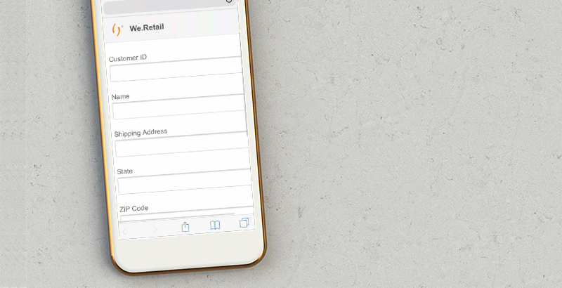

# チュートリアル：アダプティブフォームの作成 {#do-not-publish-tutorial-create-an-adaptive-form}

これは、[最初のアダプティブフォームを作成する](/help/forms/using/create-your-first-adaptive-form.md)シリーズを構成するチュートリアルです。チュートリアルの使用例全体を理解、実行、デモするために、シリーズを時系列に沿って実施することをお勧めします。

## チュートリアルについて {#about-the-tutorial}

アダプティブフォームは、動的でレスポンシブな次世代型のフォームです。アダプティブフォームを使用して、エクスペリエンスをカスタマイズできます. また、アダプティブフォームを [!DNL Adobe Analytics] に統合して使用状況の統計を分析したり、[!DNL Adobe Campaign] に統合してキャンペーン管理を行うこともできます。アダプティブフォームの機能について詳しくは、「[アダプティブフォーム作成の概要](/help/forms/using/introduction-forms-authoring.md)」を参照してください。

正しい手順を踏めば、フォームの作成と管理を簡単に行うことができます。このチュートリアルでは、以下の操作を行う方法について説明します。

* [顧客が配送先住所を追加するためのアダプティブフォームを作成する](/help/forms/using/create-adaptive-form.md#step-create-the-adaptive-form)

* [顧客の情報を表示して保存するためのアダプティブフォームフィールドのレイアウトを設定する](/help/forms/using/create-adaptive-form.md#step-add-header-and-footer)

* [フォームコンテンツが記載されたメールを送信するためのアクションを作成する](/help/forms/using/create-adaptive-form.md#step-add-components-to-capture-and-display-information)
* [アダプティブフォームのプレビューと送信を行う](/help/forms/using/create-adaptive-form.md)

このチュートリアルの最後に、以下のようなフォームにアクセスするためのリンクがあります。\

## 手順 1：アダプティブフォームを作成する {#step-create-the-adaptive-form}

1. AEM オーサーインスタンスにログインし、**[!UICONTROL Adobe Experience Manager]**／**[!UICONTROL フォーム]**／**[!UICONTROL フォームとドキュメント]**&#x200B;に移動します。デフォルトの URL は、[http://localhost:4502/aem/forms.html/content/dam/formsanddocuments](http://localhost:4502/aem/forms.html/content/dam/formsanddocuments) です。
1. 「**[!UICONTROL 作成]**」をタップして、「**[!UICONTROL アダプティブフォーム]**」を選択します。テンプレートを選択するためのオプションが表示されます。**[!UICONTROL 空白]**&#x200B;テンプレートをタップして選択し、「**[!UICONTROL 次へ]**」をタップします。

1. 「**[!UICONTROL プロパティを追加]**」オプションが表示されます。「**[!UICONTROL タイトル]**」フィールドと「**[!UICONTROL 名前]**」フィールドは入力必須です。

   * **タイトル：** `Add new or update shipping address` を「**[!UICONTROL タイトル]**」フィールドに指定します。「タイトル」フィールドに入力した値が、フォームの表示名になります。タイトルを指定すると、AEM [!DNL Forms] ユーザーインターフェイス内のフォームを特定しやすくなります。
   * **名前：**`shipping-address-add-update-form` を「**[!UICONTROL 名前]**」フィールドに指定します。「名前」フィールドで、フォームの名前を指定します。 指定された名前のノードがリポジトリーに作成されます。タイトルを入力し始めると、名前フィールドの値が自動的に生成されます。候補として入力された値は変更可能です。「ドキュメント名」フィールドには、英数字、ハイフン、アンダースコアのみを使用できます。無効な入力は、すべてハイフンに置き換えられます。

1. 「**[!UICONTROL 作成]**」をタップします。アダプティブフォームが作成され、フォームを編集用に開くためのダイアログが表示されます。「**[!UICONTROL 開く]**」をタップし、新しく作成されたフォームを新しいタブで開きます。フォームが編集用に開きます。 新しく作成されたフォームを必要に応じてカスタマイズするためのサイドバーも表示されます。

   アダプティブフォームのオーサリングインターフェイスと使用可能なコンポーネントについて詳しくは、 [アダプティブフォームのオーサリングの概要](/help/forms/using/creating-adaptive-form.md).

   

## 手順 2：ヘッダーとフッターを追加する {#step-add-header-and-footer}

AEM [!DNL Forms] には、アダプティブフォーム上で情報を表示するための様々なコンポーネントが用意されています。ヘッダーおよびフッターコンポーネントを使用すると、フォームの外観を一貫させることができます。 ヘッダーには通常、会社のロゴ、フォームのタイトル、概要が含まれます。 フッターには通常、著作権に関する情報と他のページへのリンクを指定します。

1. ／ をタップします。コンポーネントブラウザーが表示されます。コンポーネントブラウザーから&#x200B;**[!UICONTROL ヘッダー]**&#x200B;コンポーネントをアダプティブフォームにドラッグ＆ドロップします。
1. タップ **[!UICONTROL ロゴ]**. ツールバーが表示されます。 ツールバーの  で **We.Retail** をタップし、 をタップします。

1. 「画像」をタップします。 ツールバーが表示されます。  をタップします。画面の左側にプロパティブラウザーが表示されます。「**[!UICONTROL 参照]**」をタップして、ロゴ画像をアップロードします。 をタップします。画像がヘッダーに表示されます。

   ファイルがない場合は、「ファイルを取得」をタップして、この記事で使用するロゴをダウンロードできます。

[ファイルを入手](assets/logo.png)

1.  から&#x200B;**[!UICONTROL フッター]**&#x200B;コンポーネントをアダプティブフォームにドラッグします。この時点で、フォームは以下のように表示されます。 

   

## 手順 3：情報を取得して表示するためのコンポーネントを追加する {#step-add-components-to-capture-and-display-information}

コンポーネントは、アダプティブフォームを構成するための構築ブロックです。AEM [!DNL Forms] には、情報を取得しアダプティブフォームで表示するための様々なコンポーネントが用意されています。 からフォームにコンポーネントをドラッグすることができます。使用可能なコンポーネントと対応する機能については、[アダプティブフォームのオーサリングの概要](/help/forms/using/introduction-forms-authoring.md)を参照してください。

1. **[!UICONTROL 数値ボックスコンポーネント]**&#x200B;をアダプティブフォームにドラッグします。フッターコンポーネントの前にドロップします。コンポーネントのプロパティを表示し、コンポーネントの&#x200B;**[!UICONTROL タイトル]**&#x200B;を **`Customer ID`**、**[!UICONTROL 要素名]**&#x200B;を **`customer_ID`** にそれぞれ変更し、「**[!UICONTROL 必須フィールド]**」オプションと「**[!UICONTROL HTML5 の数値入力タイプを使用]**」オプションを有効にして「」をタップします。
1. 3 つのテキストボックスコンポーネントをアダプティブフォームにドラッグします。 フッターコンポーネントの前に配置します。 これらのテキストボックスに対して、次のプロパティを設定します。：

   <table> 
    <tbody> 
     <tr> 
      <td><b>プロパティ</b></td> 
      <td><b>テキストボックス 1 </b></td> 
      <td><b>テキストボックス 2 </b></td> 
      <td><b>テキストボックス 3</b></td> 
     </tr> 
     <tr> 
      <td>タイトル</td> 
      <td>名前  </td> 
      <td>発送先住所</td> 
      <td>状態</td> 
     </tr> 
     <tr> 
      <td>要素名</td> 
      <td>customer_Name  </td> 
      <td>customer_Shipping_Address</td> 
      <td>customer_State</td> 
     </tr> 
     <tr> 
      <td>必須フィールド</td> 
      <td>Enabled</td> 
      <td>Enabled</td> 
      <td>Enabled</td> 
     </tr> 
     <tr> 
      <td>複数行を許可  </td> 
      <td>無効</td> 
      <td>Enabled</td> 
      <td>無効</td> 
     </tr> 
    </tbody> 
   </table>

1. **[!UICONTROL 数値ボックス]**&#x200B;コンポーネントをフッターコンポーネントの前にドラッグします。コンポーネントのプロパティを開き、以下のテーブルに示す値を設定して「」をタップします。

   | プロパティ | 値 |
   |---|---|
   | タイトル | ZIP Code |
   | 要素名 | customer_ZIPCode |
   | 最大桁数 | 6 |
   | 必須フィールド | Enabled |
   | 表示パターンの種類 | パターンなし |

1. **[!UICONTROL メール]**&#x200B;コンポーネントをフッターコンポーネントの前にドラッグします。コンポーネントのプロパティを開き、以下のテーブルに示す値を設定して「」をタップします。

   | プロパティ | 値 |
   |---|---|
   | タイトル | メール |
   | 要素名 | customer_Email |
   | 必須フィールド | Enabled |

1. ドラッグ&amp;ドロップ **[!UICONTROL 添付ファイル]** フッターコンポーネントの前のコンポーネント。 コンポーネントのプロパティを開き、以下のテーブルに示す値を設定して「」をタップします。

   <table> 
    <tbody> 
     <tr> 
      <td><b>プロパティ</b></td> 
      <td><b>値</b></td> 
     </tr> 
     <tr> 
      <td>タイトル</td> 
      <td>政府が承認した住所の配達確認  </td> 
     </tr> 
     <tr> 
      <td>要素名</td> 
      <td>customer_Address_Proof</td> 
     </tr> 
     <tr> 
      <td>必須フィールド</td> 
      <td>Enabled</td> 
     </tr> 
    </tbody> 
   </table>

1. ドラッグして **[!UICONTROL 送信ボタン]** コンポーネントをアダプティブフォームに追加します。 フッターコンポーネントの前にドロップします。コンポーネントのプロパティを開き、「要素名」を `address_addition_update_submit` に変更して「」をタップします。これでフォームのレイアウトが設定され、フォームが以下のように表示されます。

   

## 手順 4：アダプティブフォームの送信アクションを設定する {#step-configure-submit-action-for-the-adaptive-form}

アダプティブフォーム上の「送信」ボタンをタップすると、送信アクションがトリガーされます。 送信アクションを使用して、フォームデータをローカルリポジトリに保存したり、フォームデータを REST エンドポイントに送信したり、フォームデータを電子メールとして送信したりできます。 アダプティブフォームには、そのまますぐに使用できる送信アクションがいくつか用意されています。 詳しくは、 [送信アクションの設定](/help/forms/using/configuring-submit-actions.md).

以下の手順により、フォームのメール送信アクションとデモ送信アクションを設定することができます。 

1. メールサーバーを設定します。詳しくは、「[メール通知の設定](/help/sites-administering/notification.md)」を参照してください。

1. コンテンツブラウザーで「**[!UICONTROL フォームコンテナ]**」をタップしてから「」をタップします。画面左側にプロパティブラウザーが表示されます。 
1. **[!UICONTROL 送信]**／**[!UICONTROL 送信アクション]**&#x200B;に移動します。「**[!UICONTROL メールを送信]**」を選択します。次の値を指定し、「」をタップします。

   | プロパティ | 値 |
   |--- |--- |
   | 送信元 | `donotreply@weretail.com` |
   | To | `${customer_Email}` |
   | 件名 | 確認応答： We.Retail の Web サイトに配送先住所を追加しました。 |
   | メールテンプレート | こんにちは。`${customer_Name}`様のアカウントに次のアドレスが追加されました： `${customer_Name}`, `${customer_Shipping_Address}`, `${customer_State}`, `${customer_ZIPCode}`  今後ともよろしくお願いいたします。We.Retail |
   | 添付ファイルを含める | Enabled |

   これでフォームが作成されました。これで、フォームをプレビューして、機能をテストすることができます。 このチュートリアルに記載されている名前を指定し、AEM [!DNL Forms] サーバーで稼働するマシン上に作成されたフォームにアクセスする場合は、対応するフォームが [http://localhost:4502/editor.html/content/forms/af/shipping-address-add-update-form.html](http://localhost:4502/editor.html/content/forms/af/shipping-address-add-update-form.html) に用意されています。

## 手順 5：アダプティブフォームのプレビューを表示して、アダプティブフォームを送信する {#step-preview-and-submit-the-adaptive-form}

**[!UICONTROL プレビューオプション]**&#x200B;を使用して、フォームの外観と動作を確認することができます。プレビューモードでフォームを送信したり、フォームに適用されている検証機能を確認したりできます。 例えば、必須フィールドを空のままにした場合にエラーが表示される場合などです。

アダプティブフォームには、様々なデバイス向けにフォームのエクスペリエンスをエミュレートするオプションも用意されています。 例えば、iPhone、iPad、デスクトップパソコンなどのデバイスについて、エミュレーションを行うことができます。「**[!UICONTROL プレビュー]**」と「**[!UICONTROL エミュレーター]** 」の両オプションをそれぞれ組み合わせることにより、画面サイズの異なるデバイスのフォームをプレビュー表示することができます。

1. フォームエディター右側の「**[!UICONTROL プレビュー]**」オプションをタップします。フォームがプレビューモードで表示されます。このチュートリアルに記載されている値を使用してフォームを作成した場合、フォームのプレビュー URL は [http://localhost:4502/content/dam/formsanddocuments/shipping-address-add-update-form/jcr:content?wcmmode=disabled](http://localhost:4502/content/dam/formsanddocuments/shipping-address-addition-updation-form/jcr:content?wcmmode=disabled) になります。
1. 「」を使用して、各種のデバイスでフォームがどのように表示されるかを確認します。
1. フォームのフィールドに入力してをタップします。 **[!UICONTROL 送信]**. フォームが送信され、デフォルトにリダイレクトされます **ありがとうございます** ページに貼り付けます。 また、カスタムの「ありがとうございます」ページを指定することもできます。 詳しくは、「[リダイレクトページの設定](/help/forms/using/configuring-redirect-page.md)」を参照してください。

これで、住所を追加するためのアダプティブフォームの準備が完了しました。このチュートリアルに記載されている名前を指定し、AEM Forms サーバーで稼働するマシン上に作成されたフォームにアクセスする場合は、対応するフォームが [http://localhost:4502/editor.html/content/forms/af/shipping-address-add-update-form.html](http://localhost:4502/editor.html/content/forms/af/shipping-address-add-update-form.html) に用意されています。
