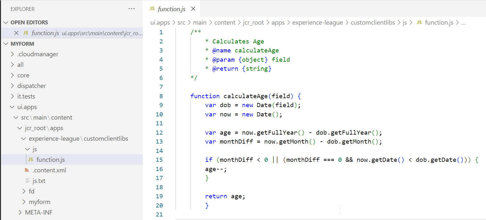

# アダプティブ Forms コアコンポーネントのカスタム関数

この記事では、次のような最新の機能を備えた、最新のアダプティブフォームのコアコンポーネントを使用してカスタム関数を作成する方法について説明します。

* カスタム関数のキャッシュ機能
* グローバル スコープ オブジェクトとフィールド オブジェクトは、カスタム関数をサポートしています。
* let 関数や arrow 関数などの最新の JavaScript 機能のサポート（ES10 のサポート）

必ずを設定してください [最新のフォームバージョン](https://github.com/adobe/aem-core-forms-components/tree/release/650) AEM Forms コアコンポーネント環境で、カスタム関数の最新の機能を使用する。 </span>


| バージョン | 記事リンク |
| -------- | ---------------------------- |
| AEM 6.5 | この記事 |
| AEM as a Cloud Service | [ここをクリックしてください](https://experienceleague.adobe.com/ja/docs/experience-manager-cloud-service/content/forms/adaptive-forms-authoring/authoring-adaptive-forms-core-components/create-an-adaptive-form-on-forms-cs/create-and-use-custom-functions) |

## はじめに

AEM Forms 6.5 には、ルールエディターを使用して複雑なビジネスルールを定義できる JavaScript 関数が含まれています。 AEM Formsは様々な標準のカスタム関数を提供していますが、多くの場合、複数のフォームで使用するために独自のカスタム関数を定義する必要があります。 これらのカスタム関数は、入力されたデータを特定の要件に合わせて操作および処理できるようにすることで、フォームの機能を強化します。 さらに、定義済みの条件に基づいてフォームの動作を動的に変更できます。

### カスタム関数の使用 {#uses-of-custom-function}

アダプティブなForms コアコンポーネントでカスタム関数を使用する場合の利点は次のとおりです。


* **データの管理**：カスタム関数は、フォームフィールドに入力されたデータを管理および処理します。
* **データの処理**：カスタム関数は、フォームフィールドに入力されたデータの処理に役立ちます。
* **データの検証**：カスタム関数を使用すると、フォームの入力に対してカスタムチェックを実行し、指定したエラーメッセージを提供できます。
* **動的動作**：カスタム関数を使用すると、特定の条件に基づいてフォームの動的な動作を制御できます。 例えば、フィールドの表示/非表示、フィールド値の変更、フォームロジックの調整を動的に行うことができます。
* **統合**：カスタム関数を使用して外部の API やサービスと統合できます。 外部ソースからのデータの取得、外部 Rest エンドポイントへのデータの送信、外部イベントに基づくカスタムアクションの実行に役立ちます。

カスタム関数は基本的に、JavaScript ファイルに追加されるクライアントライブラリです。 カスタム関数を作成すると、ルールエディターで使用できるようになり、アダプティブフォーム内のユーザーが選択できるようになります。 カスタム関数は、ルールエディターの JavaScript アノテーションによって識別されます。

### カスタム関数でサポートされる JavaScript 注釈 {#js-annotations}

**JavaScript 注釈は、JavaScript コードのメタデータを提供します**. これには、特定の記号で始まるコメントが含まれます。例： `/**` および `@`. 注釈は、コード内の関数、変数、その他の要素に関する重要な情報を提供します。 アダプティブフォームは、カスタム関数に対して次の JavaScript 注釈をサポートしています。

#### 名前

この **名前** は、アダプティブフォームのルールエディターでカスタム関数を識別するために使用されます。 カスタム関数の名前には、次の構文を使用します。

* `@name [functionName] <Function Name>`
* `@function [functionName] <Function Name>`
* `@func [functionName] <Function Name>`

>[!NOTE]
>`[functionName]` は、関数の名前です。 スペースは使用できません。
>`<Function Name>` は、アダプティブFormsのルールエディターにある関数の表示名です。
>関数名が関数自体の名前と同じ場合は、を省略できます `[functionName]` 構文から変更します。

#### パラメーター

この **パラメーター** は、カスタム関数で使用される引数のリストです。 1 つの関数は、複数のパラメーターをサポートできます。 次の構文を使用して、カスタム関数でパラメーターを定義します。

* `@param {type} name <Parameter Description>`
* `@argument` `{type} name <Parameter Description>`
* `@arg` `{type}` `name <Parameter Description>`

  `{type}` は、パラメータータイプを表します。 使用できるパラメーターのタイプは次のとおりです。

   * string：単一の文字列値を表します。
   * 数値：1 つの数値を表します。
   * ブール値：単一のブール値（true または false）を表します。
   * string[]：文字列値の配列を表します。
   * 数値[]：数値の配列を表します。
   * ブール型[]：ブール値の配列を表します。
   * 日付：単一の日付値を表します。
   * 日付[]：日付値の配列を表します。
   * 配列：様々なタイプの値を含む汎用の配列を表します。
   * オブジェクト：値を直接渡す代わりに、カスタム関数に渡されるフォームオブジェクトを表します。
   * scope: globals オブジェクトを表します。このオブジェクトには、フォームインスタンス、ターゲットフィールドインスタンス、カスタム関数内でフォームの変更を実行するためのメソッドなどの読み取り専用変数が含まれています。 これは JavaScript 注釈の最後のパラメーターとして宣言され、アダプティブフォームのルールエディターには表示されません。 scope パラメーターは、フォームまたはコンポーネントのオブジェクトにアクセスして、フォームの処理に必要なルールまたはイベントをトリガーします。 Globals オブジェクトの詳細と使用方法については、を参照してください。 [ここをクリック](/help/forms/using/create-and-use-custom-functions-core-components.md#field-and-global-scope-objects-in-custom-functions-support-field-and-global-objects)

パラメータータイプはです **大文字と小文字を区別しない** パラメーター名にはおよびスペースは使用できません。

`<Parameter Description>` パラメーターの目的に関する詳細が含まれます。 複数の単語を含めることができます。

<!--

**Optional Parameters**
By default, all parameters are mandatory. You can define a parameter as optional by either adding `=` after the parameter type or enclosing the parameter name in `[]`. Parameters defined as optional in JavaScript annotations are displayed as optional in the rule editor.
To define a variable as an optional parameter, you can use the any of the following syntaxes:
  
* `@param {type=} Input1`

In the above line of code, `Input1` is an optional parameter without any default value. To declare optional parameter with default value:

`@param {string=<value>} input1`
        
`input1` as an optional parameter with the default value set to `value`. 

* `@param {type} [Input1]`

In the above line of code, `Input1` is an optional parameter without any default value. To declare optional parameter with default value:

`@param {array} [input1=<value>]`

    `input1` is an optional parameter of array type with the default value set to `value`. 
    Ensure that the parameter type is enclosed in curly brackets {} and the parameter name is enclosed in square brackets []. 

Consider the following code snippet, where input2 is defined as an optional parameter:

```javascript

        /**
         * optional parameter function
         * @name OptionalParameterFunction
         * @param {string} input1 
         * @param {string=} input2 
         * @return {string}
        */
        function OptionalParameterFunction(input1, input2) {
        let result = "Result: ";
        result += input1;
        if (input2 !== null) {
            result += " " + input2;
        }
        return result;
        }
```

The following illustration displays using the `OptionalParameterFunction` csutom function in the rule editor:


You can save the rule without specifying a value for required parameters, but the rule is not executed and displays a warning message as:


When user leaves the optional parameter empty, then the "Undefined" value is passed to the custom function for the optional parameter.

To learn more about how to define optional parameters in JSDocs, [click here](https://jsdoc.app/tags-param).

-->

#### 戻り値タイプ

戻り値のタイプは、実行後にカスタム関数が返す値のタイプを指定します。 次の構文を使用して、カスタム関数で戻り値のタイプを定義します。

* `@return {type}`
* `@returns {type}`
  `{type}` は、関数の戻り値のタイプを表します。 使用できる戻り値のタイプは次のとおりです。
* string：単一の文字列値を表します。
* 数値：1 つの数値を表します。
* ブール値：単一のブール値（true または false）を表します。
* string[]：文字列値の配列を表します。
* 数値[]：数値の配列を表します。
* ブール型[]：ブール値の配列を表します。
* 日付：単一の日付値を表します。
* 日付[]：日付値の配列を表します。
* 配列：様々なタイプの値を含む汎用の配列を表します。
* object：値を直接表すのではなく、フォームオブジェクトを表します。

戻り値のタイプでは、大文字と小文字が区別されません。

#### 非公開

プライベートとして宣言されたカスタム関数は、アダプティブフォームのルールエディターのカスタム関数のリストには表示されません。 デフォルトでは、カスタム関数はパブリックです。 カスタム関数をプライベートとして宣言する構文を以下に示します。 `@private`.

<!--
#### Member

  Syntax: `@memberof namespace`
  Attaches a namespace to the function.
-->

<!--

#### This

   Syntax: `@this currentComponent`

   Use @this to refer to the Adaptive Form component on which the rule is written. 
  
   The following example is based on the field value. In the following example, the rule hides a field in the form. The `this` portion of `this.value` refers to underlying Adaptive Form component, on which the rule is written.

   ```
      /**
      * @function myTestFunction
      * @this currentComponent
      * @param {scope} scope in which code inside function will be executed.
      */
      myTestFunction = function (scope) {
         if(this.value == "O"){
               scope.age.visible = true;
         } else {
            scope.age.visible = false;
         }
      }

   ```

    >[!NOTE]
    >
    >Comments before custom function are used for summary. Summary can extend to multiple lines until a tag is encountered. Limit the size to a single for a concise description in the rule builder.

-->

<!--

## Function declaration supported types {#function-declaration-supported-types}

**Function Statement**

```javascript
function area(len) {
    return len*len;
}
```

This function is included without `jsdoc` comments.

**Function Expression**

```javascript
var area;
//Some codes later
/** */
area = function(len) {
    return len*len;
};
```

**Function Expression and Statement**

```javascript
var b={};
/** */
b.area = function(len) {
    return len*len;
}
```

**Function Declaration as Variable**

```javascript
/** */
var x1,
    area = function(len) {
        return len*len;
    },
    x2 =5, x3 =true;
```

Limitation: custom function picks only the first function declaration from the variable list, if together. You can use function expression for every function declared.

**Function Declaration as Object**

```javascript
var c = {
    b : {
        /** */
        area : function(len) {
            return len*len;
        }
    }
};
```
-->

## カスタム関数の作成時のガイドライン {#considerations}

ルールエディターにカスタム関数を一覧表示するには、次のいずれかの形式を使用できます。

### Jsdoc コメント付きまたは付きでない Function ステートメント

カスタム関数を作成する際に、jsdoc コメントを含めることも、含めないこともできます。

```javascript
    function functionName(parameters) 
        {
            // code to be executed
        }
```

ユーザーがカスタム関数に JavaScript 注釈を追加しない場合は、ルールエディターの関数名で表示されます。 ただし、カスタム関数を読みやすくするために、JavaScript 注釈を含めることをお勧めします。


### 必須の JavaScript 注釈またはコメントを含む矢印関数

矢印関数の構文を使用して、カスタム関数を作成できます。

```javascript
    /**
    * test function
    * @name testFunction 
    * @param {string} a parameter description
    * @param {string=} b parameter description
    * @return {string}
    */
    testFunction = (a, b) => {
    return a + b;
    };
    /** */
    testFunction1=(a) => (return a)
    /** */
    testFunction2 = a => a + 100;
    
```

ユーザーがカスタム関数に JavaScript 注釈を追加しない場合、カスタム関数はアダプティブフォームのルールエディターに表示されません。

### 必須の JavaScript 注釈またはコメントを含む関数式

アダプティブフォームのルールエディターにカスタム関数をリストするには、次の形式でカスタム関数を作成します。

```javascript
    /**
    * test function
    * @name testFunction 
    * @param {string} input1 parameter description
    * @param {string=} input2 parameter description
    * @return {string}
    */
    testFunction = function(input1,input2)
        {
            // code to be executed
        }
```

ユーザーがカスタム関数に JavaScript 注釈を追加しない場合、カスタム関数はアダプティブフォームのルールエディターに表示されません。

### カスタム関数を作成するための前提条件

アダプティブFormsへのカスタム機能の追加を開始する前に、お使いのマシンに次のソフトウェアがインストールされていることを確認してください。

* **プレーンテキストエディター（IDE）**：任意のプレーンテキストエディターを使用できますが、Microsoft Visual Studio Code などの統合開発環境（IDE）は、編集を容易にする高度な機能を提供します。

* **Git:** このバージョン管理システムは、コード変更を管理するために必要である。 インストールされていない場合は、https://git-scm.comからダウンロードします。


## カスタム関数の作成 {#create-custom-function}

カスタム関数の作成手順は次のとおりです。
1. [AEM プロジェクトアーキタイプを使用してクライアントサイドライブラリを作成し、カスタム関数を追加します。](#create-client-library-archetype)
または
   [CRXDE によるカスタム関数の作成](#create-add-custom-function)
1. [アダプティブフォームへのクライアントライブラリの追加](#add-client-library)
1. [アダプティブフォームでのカスタム関数の使用](#use-custom-functions)


### AEM プロジェクトアーキタイプを使用したクライアントライブラリの作成{#create-client-library-archetype}

作成したプロジェクトにクライアントライブラリを追加することで、カスタム関数を追加できます [AEM プロジェクトアーキタイプの使用](https://experienceleague.adobe.com/en/docs/experience-manager-core-components/using/developing/archetype/using#getting-started).
既存のプロジェクトがある場合 <!--and have already the project structure as shown in the image below,--> 直接追加できます [カスタム関数](#create-add-custom-function) ローカルプロジェクトに追加します。

<!---->

アーキタイププロジェクトを作成するか既存のプロジェクトを使用したら、クライアントライブラリを作成します。 クライアントライブラリを作成するには、次の手順を実行します。

**クライアントライブラリフォルダーの追加**

に新しいクライアントライブラリフォルダーを追加するには [AEM プロジェクトディレクトリ]は、次の手順に従います。

1. を開きます [AEM プロジェクトディレクトリ] エディターで。

   

1. を見つける `ui.apps`.
1. 新規フォルダーを追加します。 例えば、というフォルダーを追加します。 `experience-league`.
1. に移動します。 `/experience-league/` フォルダーを作成して、 `ClientLibraryFolder`. 例えば、という名前のクライアントライブラリフォルダーを作成します `customclientlibs`.

   場所： `[AEM project directory]/ui.apps/src/main/content/jcr_root/apps/`

**クライアントライブラリフォルダーへのファイルとフォルダーの追加**

追加したクライアントライブラリフォルダーに次の内容を追加します。

* `.content.xml` ファイル
* `js.txt` ファイル
* `js` フォルダー

`Location is: [AEMaaCS project directory]/ui.apps/src/main/content/jcr_root/apps/experience-league/customclientlibs/`

1. が含まれる `.content.xml` 次のコード行を追加します。

   ```javascript
   <?xml version="1.0" encoding="UTF-8"?>
   <jcr:root xmlns:cq="http://www.day.com/jcr/cq/1.0" xmlns:jcr="http://www.jcp.org/jcr/1.0"
   jcr:primaryType="cq:ClientLibraryFolder"
   categories="[customfunctionscategory]"/>
   ```

   >[!NOTE]
   >
   > には任意の名前を付けることができます `client library folder` および `categories` プロパティ。

1. が含まれる `js.txt` 次のコード行を追加します。

   ```javascript
         #base=js
       function.js
   ```

1. が含まれる `js` フォルダーに、javascript ファイルをとして追加します `function.js` これには、カスタム関数が含まれます。

   ```javascript
   /**
       * Calculates Age
       * @name calculateAge
       * @param {object} field
       * @return {string} 
   */
   
   function calculateAge(field) {
   var dob = new Date(field);
   var now = new Date();
   
   var age = now.getFullYear() - dob.getFullYear();
   var monthDiff = now.getMonth() - dob.getMonth();
   
   if (monthDiff < 0 || (monthDiff === 0 && now.getDate() < dob.getDate())) {
   age--;
   }
   
   return age;
   }
   ```

1. ファイルを保存します。



**新しいフォルダーを filter.xml に含める**:

1. [AEMaaCS プロジェクトディレクトリ]内の `/ui.apps/src/main/content/META-INF/vault/filter.xml` ファイルに移動します。

1. ファイルを開き、最後に次の行を追加します。

   `<filter root="/apps/experience-league" />`
1. ファイルを保存します。

   

1. 次の手順に従って、新しく作成したクライアントライブラリフォルダーをAEM環境にビルドします。 [「作成方法」セクション](https://github.com/adobe/aem-project-archetype/tree/develop/src/main/archetype#how-to-build).

## CRXDE を通じたカスタム関数の作成とデプロイ{#create-add-custom-function}

最新のAEM FormsおよびForms アドオンを使用している場合は、CRXDE を通じてカスタム関数を作成し、カスタム関数の最新のアップデートを使用できます。 それには、次の手順を実行します。

<!---->


1. `http://server:port/crx/de/index.jsp#` にログインします。
1. `/apps` フォルダーの下にフォルダーを作成します。例えば、`experience-league` という名前のフォルダーを作成します。
1. 変更を保存します。
1. 作成したフォルダーに移動し、タイプ `cq:ClientLibraryFolder` のノードを `clientlibs` として作成します。
1. 新しく作成した `clientlibs` フォルダーに移動し、`allowProxy` プロパティと `categories` プロパティを追加します。

   

   >[!NOTE]
   >
   > `customfunctionsdemo` の代わりに任意の名前を指定できます。

1. 変更を保存します。

1. `clientlibs` フォルダーの下に `js` というフォルダーを作成します。
1. という JavaScript ファイルを作成します。 `functions.js` の下 `js` フォルダー。
1. `clientlibs` フォルダーの下に `js.txt` というファイルを作成します。
1. 変更を保存します。
作成したフォルダー構造は次のようになります。

   
1. `functions.js` ファイルをダブルクリックして、エディターを開きます。ファイルは、カスタム関数のコードを含みます。
JavaScript ファイルに次のコードを追加して、生年月日（YYYY-MM-DD）に基づいて年齢を計算しましょう。

   ```javascript
       /**
            * Calculates Age
            * @name calculateAge 
            * @return {string} 
       */
   
       function calculateAge(dateOfBirthString) {
       var dob = new Date(dateOfBirthString);
       var now = new Date();
   
       var age = now.getFullYear() - dob.getFullYear();
       var monthDiff = now.getMonth() - dob.getMonth();
   
       if (monthDiff < 0 || (monthDiff === 0 && now.getDate() < dob.getDate())) {
       age--;
       }
   
       return age;
       }
   ```

1. `function.js` を保存します。
1. `js.txt` に移動し、次のコードを追加します。

   ```javascript
       #base=js
       functions.js
   ```

1. `js.txt` ファイルを保存します。

次を参照してください。 [カスタム関数](/help/forms/using/assets/customfunction.zip) フォルダー。 このフォルダーをダウンロードしてAEM インスタンスにインストールします。

これで、クライアントライブラリを追加して、アダプティブフォームでカスタム関数を使用できるようになりました。

## アダプティブフォームへのクライアントライブラリの追加{#add-client-library}

クライアントライブラリをAEM Forms環境にデプロイしたら、アダプティブフォームでその機能を使用します。 アダプティブフォームにクライアントライブラリを追加するには、次の手順に従います

1. フォームを編集モードで開きます。 フォームを編集モードで開くには、フォームを選択し、以下を選択します。 **[!UICONTROL 編集]**.
1. コンテンツブラウザーを開き、アダプティブフォームの&#x200B;**[!UICONTROL ガイドコンテナ]**&#x200B;コンポーネントを選択します。
1. ガイドコンテナのプロパティアイコンをクリックします。 アダプティブフォームコンテナダイアログボックスが開きます。
1. を開きます **[!UICONTROL 基本]** タブをクリックして、の名前を選択 **[!UICONTROL クライアントライブラリカテゴリ]** ドロップダウンリストから（この場合は、 `customfunctionscategory`）に設定します。

   

1. 「**[!UICONTROL 完了]**」をクリックします。

これで、ルールエディターでカスタム関数を使用するルールを作成できます。


次に、 [AEM Forms 6.5 のルールエディターの呼び出しサービス](/help/forms/using/rule-editor-core-components.md#invoke-form-data-model-service-invoke)

## アダプティブフォームでのカスタム関数の使用 {#use-custom-functions}

アダプティブフォームでは、以下を使用できます [ルールエディター内のカスタム関数](/help/forms/using/rule-editor-core-components.md).
次のコードを JavaScript ファイル（`Function.js` ファイル）を選択し、生年月日（YYYY-MM-DD）に基づいて年齢を計算します。 カスタム関数を次のように作成 `calculateAge()` 生年月日を入力として、年齢を返します。

```javascript
    /**
        * Calculates Age
        * @name calculateAge
        * @param {object} field
        * @return {string} 
    */

    function calculateAge(field) {
    var dob = new Date(field);
    var now = new Date();

    var age = now.getFullYear() - dob.getFullYear();
    var monthDiff = now.getMonth() - dob.getMonth();

    if (monthDiff < 0 || (monthDiff === 0 && now.getDate() < dob.getDate())) {
    age--;
    }

    return age;
    }
```

上記の例では、ユーザーが誕生日を（YYYY-MM-DD）形式で入力した場合、カスタム関数は次のようになります `calculateAge` を呼び出し、年齢を返します。


フォームをプレビューして、ルールエディターを介してカスタム関数がどのように実装されているかを確認します。


>[!NOTE]
>
> 次を参照してください。 [カスタム関数](/help/forms/using/assets/customfunctions.zip) フォルダー。 次を使用して、このフォルダーをダウンロードし、AEM インスタンスにインストールします [パッケージマネージャー](https://experienceleague.adobe.com/en/docs/experience-manager-65/content/sites/administering/contentmanagement/package-manager).

### カスタム関数での非同期関数のサポート {#support-of-async-functions}

非同期カスタム関数がルールエディターリストに表示されない。 ただし、同期関数式を使用して作成されたカスタム関数内で、非同期関数を呼び出すことができます。


>[!NOTE]
>
> カスタム関数で非同期関数を呼び出す利点は、非同期関数を使用すると、複数のタスクを同時に実行でき、カスタム関数内で各関数の結果を使用できる点です。

カスタム関数を使用して非同期関数を呼び出す方法については、以下のコードを参照してください。

```javascript
    
    async function asyncFunction() {
    const response = await fetch('https://petstore.swagger.io/v2/store/inventory');
    const data = await response.json();
    return data;
    }

    /**
    * callAsyncFunction
    * @name callAsyncFunction callAsyncFunction
    */
    function callAsyncFunction() {
    asyncFunction()
        .then(responseData => {
        console.log('Response data:', responseData);
        })
        .catch(error => {
         console.error('Error:', error);
    });
}
```

上記の例では、asyncFunction 関数は `asynchronous function`. 非同期操作を実行するには、 `GET` リクエスト先 `https://petstore.swagger.io/v2/store/inventory`. 次を使用して応答を待ちます `await`は、次を使用して応答本文を JSON として解析します `response.json()`データを返します。 この `callAsyncFunction` 関数は、を呼び出す同期カスタム関数です `asyncFunction` 関数を実行し、応答データをコンソールに表示します。 ただし、 `callAsyncFunction` 関数は同期で、非同期の asyncFunction 関数を呼び出し、その結果を `then` および `catch` ステートメント。

動作を確認するには、ボタンを追加し、ボタンクリック時に非同期関数を呼び出すボタンのルールを作成します。


ユーザーがをクリックしたときの動作を示すには、以下のコンソールウィンドウの図を参照してください `Fetch` ボタン、カスタム関数 `callAsyncFunction` を呼び出し、非同期関数を呼び出す `asyncFunction`. コンソールウィンドウをInspectして、ボタンがクリックされたときの応答を確認します。


カスタム関数の機能について説明します。

## カスタム関数の様々な機能

カスタム関数を使用すると、パーソナライズされた機能をフォームに追加できます。 これらの関数は、特定フィールドの操作、グローバルフィールドの使用、キャッシュなど、様々な機能をサポートします。 この柔軟性により、組織の要件に応じてフォームをカスタマイズできます。

### カスタム関数のフィールド オブジェクトとグローバル スコープ オブジェクト {#support-field-and-global-objects}

フィールドオブジェクトとは、テキストフィールド、チェックボックスなど、フォーム内の個々のコンポーネントまたは要素を指します。 Globals オブジェクトには、フォームインスタンス、ターゲットフィールドインスタンス、カスタム関数内でフォームの変更を実行するメソッドなどの読み取り専用変数が含まれています。

>[!NOTE]
>
> この `param {scope} globals` が最後のパラメーターである必要があり、アダプティブフォームのルールエディターに表示されません。

<!-- Let us look at the following code snippet:

```JavaScript
   
    /**
    * updateDateTime
    * @name updateDateTime
    * @param {object} field
    * @param {scope} globals
    */
    function updateDateTime(field, globals) {
    // Accessing the Date object from the global scope
    var currentDate = new Date();
    // Formatting the date and time
    var formattedDateTime = currentDate.toLocaleString();
    // Updating the field value with the formatted date and time using setProperty.
    globals.functions.setProperty(field, {value: formattedDateTime});
    }
```

In the above code snippet, a custom function named `updateDateTime` takes parameters such as a field object and a global object. The field represents the textbox object where the formatted date and time value is displayed within the form. -->

カスタム関数でフィールドおよびグローバルオブジェクトを使用する方法を、 `Contact Us` 異なるユースケースを使用したフォーム


#### **ユースケース**：を使用したパネルの表示 `SetProperty` ルール

の説明に従って、カスタム関数に次のコードを追加します。 [create-custom-function](#create-custom-function) セクションで、フォームフィールドをに設定します `Required`.

```javascript
    
    /**
    * enablePanel
    * @name enablePanel
    * @param {object} field1
    * @param {object} field2
    * @param {scope} globals 
    */

    function enablePanel(field1,field2, globals)
    {
       if(globals.functions.validate(field1).length === 0)
       {
       globals.functions.setProperty(field2, {visible: true});
       }
    }
```

>[!NOTE]
>
> * にある使用可能なプロパティを使用して、フィールドのプロパティを設定できます。 `[form-path]/jcr:content/guideContainer.model.json`.
> * を使用してフォームに加えた変更 `setProperty` globals オブジェクトのメソッドは、本質的に非同期であり、カスタム関数の実行中には反映されません。

この例では、 `personaldetails` パネルは、ボタンをクリックすると発生します。 パネルでエラーが検出されなかった場合、別のパネルでは、 `feedback` ボタンをクリックするとパネルが表示されます。

のルールを作成しましょう `Next` ボタン。検証します。 `personaldetails` パネル化し、 `feedback`  ユーザーがクリックすると表示されるパネル `Next` ボタン。


次の図を参照して、各コンポーネントの配置場所を確認してください `personaldetails` パネルは、 `Next` ボタン。 内のすべてのフィールドに適用する場合 `personaldetails` が検証され、 `feedback` パネルが表示されます。


のフィールドにエラーがある場合 `personaldetails` パネルの場合、 `Next` ボタン、および `feedback` パネルは非表示のままになります。


#### **ユースケース**：フィールドを検証します。

の説明に従って、カスタム関数に次のコードを追加します。 [create-custom-function](#create-custom-function) セクションに移動し、フィールドを検証します。

```javascript
    /**
    * validateField
    * @name validateField
    * @param {object} field
    * @param {scope} globals
    */
    function validateField(field,globals)
    {
    
        globals.functions.validate(field);
    
    }   
```

>[!NOTE]
>
> で引数が渡されない場合、 `validate()` 関数を使用すると、フォームを検証します。

この例では、カスタムの検証パターンが `contact` フィールド。 ユーザーは、で始まる電話番号を入力する必要があります `10` 続いて `8` 数字。 ユーザーがから始まらない電話番号を入力した場合 `10` 含まれる数が多い、または含まれない `8` 数字、ボタンをクリックすると検証エラーメッセージが表示されます。


次に、のルールを作成します `Next` を検証するボタン `contact` ボタンクリックのフィールド。


次の図を参照して、ユーザーがで始まらない電話番号を入力した場合を示してください `10`すると、エラーメッセージがフィールドレベルに表示されます。


ユーザーが有効な電話番号と、そのすべてのフィールドをに入力した場合 `personaldetails` パネルが検証され、 `feedback` パネルが画面に表示されます。


#### **ユースケース**: パネルをリセット

の説明に従って、カスタム関数に次のコードを追加します。 [create-custom-function](#create-custom-function) セクションで、パネルをリセットします。

```javascript
    /**
    * resetField
    * @name  resetField
    * @param {string} input1
    * @param {object} field
    * @param {scope} globals 
    */
    function  resetField(field,globals)
    {
    
        globals.functions.reset(field);
    
    }
```

>[!NOTE]
>
> で引数が渡されない場合、 `reset()` 関数を使用すると、フォームを検証します。

この例では、 `personaldetails` をクリックするとパネルがリセットされる `Clear` ボタン。 次に、のルールを作成します `Clear` ボタンをクリックしたときにパネルをリセットするボタン。


ユーザーがをクリックした場合に表示される方法については、次の図を参照してください `clear` ボタン、 `personaldetails` パネルのリセット：


#### **ユースケース**：フィールドレベルでカスタムメッセージを表示し、フィールドを無効としてマークします

を使用できます `markFieldAsInvalid()` フィールドを無効として定義し、フィールドレベルでカスタムエラーメッセージを設定する関数。 この `fieldIdentifier` 値は `fieldId`、または `field qualifiedName`、または `field dataRef`. という名前のオブジェクトの値 `option` 次になることができます `{useId: true}`, `{useQualifiedName: true}`、または `{useDataRef: true}`.
フィールドを無効としてマークし、カスタムメッセージを設定するために使用される構文は次のとおりです。

* `globals.functions.markFieldAsInvalid(field.$id,"[custom message]",{useId: true});`
* `globals.functions.markFieldAsInvalid(field.$qualifiedName, "[custom message]", {useQualifiedName: true});`
* `globals.functions.markFieldAsInvalid(field.$dataRef, "[custom message]", {useDataRef: true});`

の説明に従って、カスタム関数に次のコードを追加します。 [create-custom-function](#create-custom-function) フィールドレベルでカスタムメッセージを有効にする場合は、「」をクリックします。

```javascript
    /**
    * customMessage
    * @name customMessage
    * @param {object} field
    * @param {scope} globals 
    */
    function customMessage(field, globals) {
    const minLength = 15;
    const comments = field.$value.trim();
    if (comments.length < minLength) {
        globals.functions.markFieldAsInvalid(field.$id, "Comments must be at least 15 characters long.", { useId: true });
    }
}
```

この例では、ユーザーがコメント テキストボックスに 15 文字未満で入力すると、カスタムメッセージがフィールドレベルに表示されます。

次に、のルールを作成します `comments` フィールド :


で負のフィードバックを入力したことを表示するには、以下のデモを参照してください。 `comments` フィールドトリガー フィールドレベルでのカスタムメッセージの表示を設定します。


ユーザーがコメントテキストボックスに 15 文字を超える文字を入力すると、フィールドが検証され、フォームが送信されます。


#### **ユースケース**：変更されたデータのサーバーへの送信

次のコード行：
`globals.functions.submitForm(globals.functions.exportData(), false);` を使用して、操作後にフォームデータを送信します。
* 最初の引数は、送信するデータです。
* 2 番目の引数は、送信前にフォームを検証するかどうかを表します。 このプロパティは `optional` およびをに設定しました `true` デフォルトでは。
* 3 番目の引数は `contentType` 送信の（デフォルト値を使用する場合もオプション） `multipart/form-data`. その他の値は以下のとおりです。 `application/json` および `application/x-www-form-urlencoded`.

の説明に従って、カスタム関数に次のコードを追加します。 [create-custom-function](#create-custom-function) セクションで、サーバーで操作されたデータを送信するには：

```javascript
    /**
    * submitData
    * @name submitData
    * @param {object} field
    * @param {scope} globals 
    */
    function submitData(globals)
    {
    
    var data = globals.functions.exportData();
    if(!data.comments) {
    data.comments = 'NA';
    }
    console.log('After update:{}',data);
    globals.functions.submitForm(data, false);
    }
```

この例では、ユーザーがを離れた場合、 `comments` テキストボックスが空、 `NA` は、フォームの送信時にサーバーに送信されます。

次に、のルールを作成します `Submit` データを送信するボタン：


の図を参照してください `console window` 以下に、ユーザーがを離れたかどうかを示します `comments` テキストボックスが空の場合、値は `NA` 次のサーバーで送信される：


また、コンソールウィンドウを調べて、サーバーに送信されたデータを表示することもできます。


<!--

#### **Use Case**: Display form submission and failure messages for custom submit action 

Add the following line of code as explained in the [create-custom-function ](#create-custom-function) section, to customize the submission or failure message for form submissions and display the form submission messages in a modal box:

```javascript
/**
 * Handles the success response after a form submission.
 *
 * @param {scope} globals - This object contains a read-only form instance, target field instance, triggered event, and methods for performing form modifications within custom functions.
 * @returns {void}
 */
function customSubmitSuccessHandler(globals) {
    var event = globals.event;
    var submitSuccessResponse = event.payload.body;
    var form = globals.form;

    if (submitSuccessResponse) {
        if (submitSuccessResponse.redirectUrl) {
            window.location.href = encodeURI(submitSuccessResponse.redirectUrl);
        } else if (submitSuccessResponse.thankYouMessage) {
            showModal("success", submitSuccessResponse.thankYouMessage);
        }
    }
}

/**
 * Handles the error response after a form submission.
 *
 * @param {string} customSubmitErrorMessage - The custom error message.
 * @param {scope} globals - This object contains a read-only form instance, target field instance, triggered event, and methods for performing form modifications within custom functions.
 * @returns {void}
 */
function customSubmitErrorHandler(customSubmitErrorMessage, globals) {
    showModal("error", customSubmitErrorMessage);
}
function showModal(type, message) {
    // Remove any existing modals
    var existingModal = document.getElementById("modal");
    if (existingModal) {
        existingModal.remove();
    }

    // Create the modal dialog
    var modal = document.createElement("div");
    modal.setAttribute("id", "modal");
    modal.setAttribute("class", "modal");

    // Create the modal content
    var modalContent = document.createElement("div");
    modalContent.setAttribute("class", "modal-content");

    // Create the modal header
    var modalHeader = document.createElement("div");
    modalHeader.setAttribute("class", "modal-header");
    modalHeader.innerHTML = "<h2>" + (type === "success" ? "Thank You" : "Error") + "</h2>";

    // Create the modal body
    var modalBody = document.createElement("div");
    modalBody.setAttribute("class", "modal-body");
    modalBody.innerHTML = "<p class='" + type + "-message'>" + message + "</p>";

    // Create the modal footer
    var modalFooter = document.createElement("div");
    modalFooter.setAttribute("class", "modal-footer");

    // Create the close button
    var closeButton = document.createElement("button");
    closeButton.setAttribute("class", "close-button");
    closeButton.innerHTML = "Close";
    closeButton.onclick = function() {
        modal.remove();
    };

    // Append the elements to the modal content
    modalFooter.appendChild(closeButton);
    modalContent.appendChild(modalHeader);
    modalContent.appendChild(modalBody);
    modalContent.appendChild(modalFooter);

    // Append the modal content to the modal
    modal.appendChild(modalContent);

    // Append the modal to the document body
    document.body.appendChild(modal);
}
```

In this example, when the user uses the `customSubmitSuccessHandler` and `customSubmitErrorHandler` custom functions, the success and failure messages are displayed in a modal. The JavaScript function `showModal(type, message)` is used to dynamically create and display a modal dialog box on a screen.

Now, create a rule for successful form submission:


Refer to the illustration below to demonstrate that when the form is submitted successfully, the success message is displayed in a modal:


 
Similarly, let us create a rule for failed form submissions:


Refer to the illustration below to demonstrate that when the form submission fails, the error message is displayed in a modal:


To display form submission success and failure in a default manner, the `Default submit Form Success Handler` and `Default submit Form Error Handler` functions are available out of the box.

In case, the custom submit action fails to perform as expected in existing AEM projects or forms, refer to the [troubleshooting](#troubleshooting) section.

-->

## カスタム関数のキャッシュサポート

アダプティブFormsは、カスタム関数のキャッシュを実装して、ルールエディターでカスタム関数のリストを取得する際の応答時間を短縮します。 メッセージ： `Fetched following custom functions list from cache` 次に表示： `error.log` ファイル。


カスタム関数が変更されると、キャッシュが無効化され、解析されます。

## トラブルシューティング {#troubleshooting}

* ユーザーは、以下を確実にする必要があります [コアコンポーネントと仕様のバージョンが最新バージョンに設定されています](https://github.com/adobe/aem-core-forms-components/tree/release/650). ただし、既存のAEM プロジェクトおよびフォームの場合は、さらに次の手順に従う必要があります。

   * AEM プロジェクトの場合、のインスタンスをすべて置き換える必要があります `submitForm('custom:submitSuccess', 'custom:submitError')` （を使用） `submitForm()` プロジェクトをデプロイします。

   * 既存のフォームで、カスタム送信ハンドラーが正しく機能しない場合は、を開いて保存する必要があります。 `submitForm` に関するルール **Submit** ルールエディターを使用してボタンをクリックします。 既存のルールを置き換えます。 `submitForm('custom:submitSuccess', 'custom:submitError')` （を使用） `submitForm()` フォームで。


* カスタム関数のコードを含んだ JavaScript ファイルにエラーがある場合、カスタム関数はアダプティブフォームのルールエディターに表示されません。 カスタム関数のリストを確認するには、に移動します。 `error.log` エラーのファイル。 エラーが発生すると、カスタム関数のリストは空で表示されます。

  

  エラーがない場合、カスタム関数が取得され、に表示されます。 `error.log` ファイル。 メッセージ： `Fetched following custom functions list` 次に表示： `error.log` ファイル：

  

## 考慮事項

* この `parameter type` および `return type` サポートしない `None`.

* カスタム関数リストでサポートされていない関数は次のとおりです。
   * ジェネレーター関数
   * 非同期/待機関数
   * メソッドの定義
   * クラスメソッド
   * デフォルトのパラメーター
   * REST パラメーター
