# 通信を作成{#create-correspondence}

## 通信を作成ユーザーインターフェイスで通信を作成する {#create-correspondence-in-the-create-correspondence-user-interface}

After a [letter template is created in Correspondence Management](../../forms/using/create-letter.md), the end user/agent/claim adjustor can open the letter in the Create Correspondence user interface and create a correspondence by entering data, setting up content, and managing attachments. 最終的に、要求処理担当者またはエージェントはプレビューモードでコンテンツを管理し、レターを送信します。

### 通信のプレビュー {#preview-a-correspondence}

プレビューするレターを次の手順で選択します。

1. On the Letters page, tap **Select**.
1. 必要なレターをタップして選択します。

   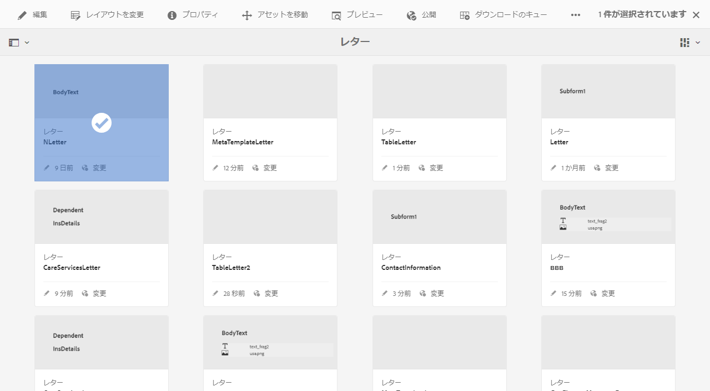

   レターを選択

1. For a Data Dictionary based letter, select **Preview** > **Preview**. データディクショナリベース以外のレターでは、「**プレビュー**」を選択します。レターの上にマウスカーソルを置き（選択しないで）、レターのプレビューアイコンをタップすることでレターをプレビューできます。

   >[!NOTE]
   >
   >データディクショナリがレターと関連付けされていない場合、レターのプレビューが開きます。レターがデータディクショナリベースの場合、Correspondence Managementでは、プレビューメニューに「プレビュー」と「カスタム」のオプションが表示され、2つのオプションのいずれかを選択できます。 テストデータをデータディクショナリに関連付けることもできます。When the [Data Dictionary has associated test data](../../forms/using/data-dictionary.md#p-working-with-test-data-p), then on selecting the preview option, the normal preview opens with the test data populated.

1. 通信をプレビュー中にレンダリングするには、管理者か、次のいずれかのグループの一部である必要があります。

   * forms-users（オーサーインスタンスをプレビューする場合）
   * cm-agent-users（発行インスタンスをレンディションする場合）
   必要なアクセス権を持っていない場合は、管理者に適切なアクセス権を要求します。For more information on creating and adding users to groups, see [Adding Users or Groups to a Group](/help/sites-administering/security.md). 適切な権限を持たない通信をレンダリングしようとすると、404エラーページが表示されます。

1. If you&#39;ve selected **Preview** > **Custom**, a dialog opens. In the dialog, select a data file, corresponding to the data dictionary, to preview the letter with and then select **Preview**. 特定のレターのデータディクショナリに基づいてデータファイルが作成されます。For more information on the data file, see [Data Dictionary](../../forms/using/data-dictionary.md#p-working-with-test-data-p).

   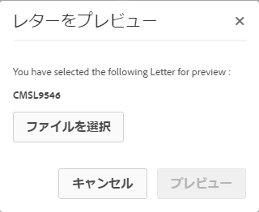

1. デフォルトでは、使用中の「データ」タブでレターの HTML プレビュー（モバイルフォームプレビュー）が開きます。

   For more information on mobile forms and the features they support, see [Feature differentiation between Mobile Forms and PDF Forms](https://helpx.adobe.com/livecycle/help/mobile-forms/feature-differentiation-mobile-forms-pdf.html).

   3 つのタブ（データ、コンテンツ、および添付ファイル）があります。データ要素（プレースホルダー変数およびレイアウトフィールド）がない場合、表示される「コンテンツ」タブで直接レターは開きます。「添付ファイル」タブは、添付ファイルが存在するか、ライブラリアクセスが有効な場合にのみ使用できます。

   >[!NOTE]

   >For more information on switching between HTML or PDF rendition mode of letter preview, see [Change rendition mode of letter](#changerenditionmode). For more information on PDF support in Correspondence Management and AEM, see [Discontinuation of NPAPI browser plug-ins and its impact](https://helpx.adobe.com/aem-forms/kb/discontinuation-of-npapi-plugins-impact-on-aem-forms.html) and [PDF Forms to HTML5 Forms](https://helpx.adobe.com/aem-forms/kb/pdf-forms-to-html5-forms.html).

### データを入力 {#enterdata}

「データ」タブで、使用可能なレイアウトフィールドとプレースホルダーを入力します。

1. 必要に応じて、フィールドにデータとコンテンツの変数を入力します。Fill up all the mandatory fields marked with an asterisk (*) to enable the **Submit** button.

   「データ」タブで HTML レタープレビューのデータフィールド値をタップして、対応するデータフィールドをハイライト表示します。

   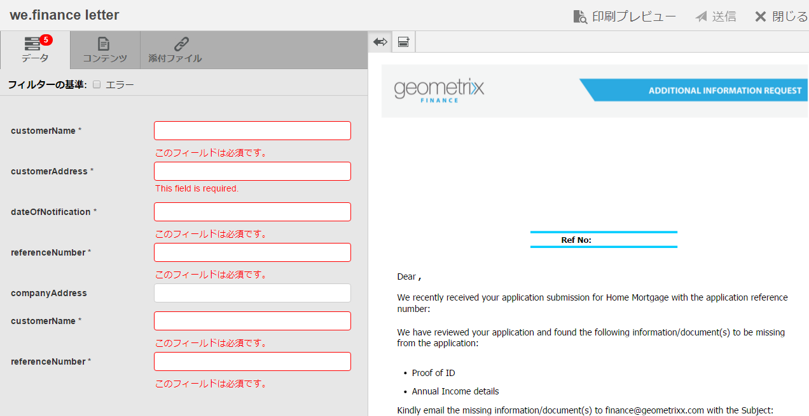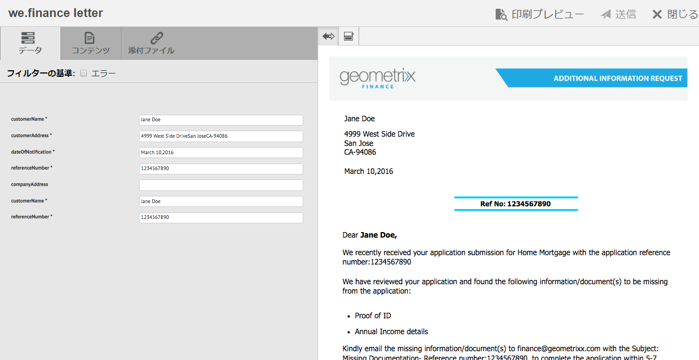

### コンテンツを管理 {#managecontent}

「コンテンツ」タブで、ドキュメントのフラグメントやレター内のコンテンツ変数などのコンテンツを管理します。

1. 「**コンテンツ**」を選択します。Correspondence Managementにレターの「コンテンツ」タブが表示されます。

   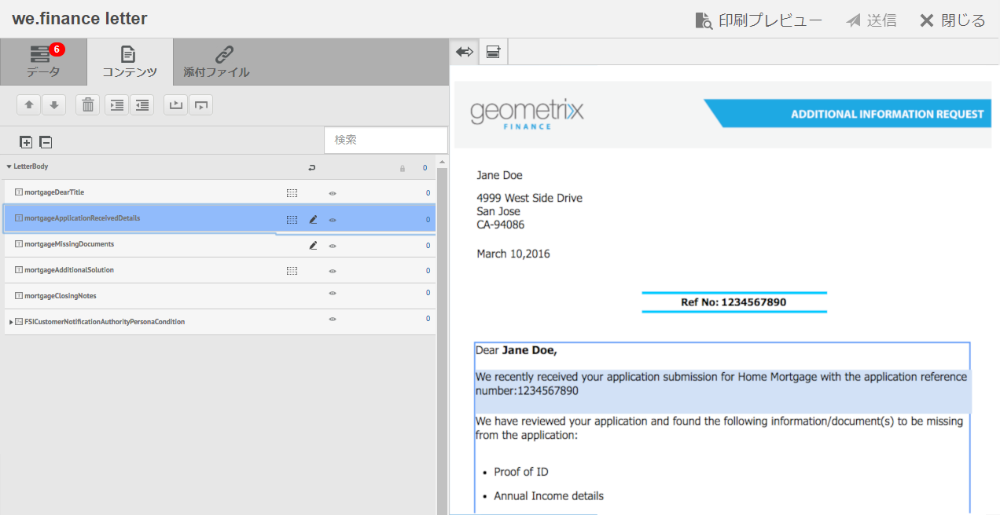

1. 「コンテンツ」タブで、コンテンツモジュールを必要に応じて編集します。コンテンツ階層の関連するコンテンツモジュールにフォーカスするには、レタープレビューで関連する行または段落をタップするか、コンテンツ階層で直接コンテンツモジュールをタップします。

   例えば、下の図で「We have reviewed...」を選択すると、「コンテンツ」タブで対応するコンテンツモジュールが選択されます。

   

   In the Content or Data tab, by tapping Highlight Selected Modules ( ) on upper left of the HTML letter preview, you can disable or enable functionality to go to the content/data module when the relevant text, paragraph, or data field is selected in the letter preview.

   For more information on the actions available for various modules in the Create Correspondence user interface, see [Actions and info available in the Create Correspondence user interface](../../forms/using/create-letter.md#main-pars-header-9).

1. コンテンツモジュールを配置するには、「検索」フィールドを使用します。コンテンツモジュールの名前やタイトルの一部または全部を入力して、通信を検索します。
1. Tap the Display icon ( ) in front of a list, text, condition, or target area to show or hide it in the letter.
1. To edit an inline or editable text module, tap the relevant **Edit** icon ( ) or double-click the relevant text module in the letter preview.

   テキストを編集および書式設定するためのテキストエディターが表示されます。

   ブラウザーのデフォルトのスペルチェッカーにより、テキストエディターのスペルチェックが行われます。スペルチェックや文法チェックを管理するにはブラウザーのスペルチェッカーの設定を編集するか、スペルチェックや文法チェックのためのブラウザーのプラグインまたはアドオンをインストールします。

   また、テキストエディターの様々なキーボードショートカットを使用して、テキストの管理、編集、書式設定を行うこともできます。 For more information on [Text Editor](/help/forms/using/keyboard-shortcuts.md#correspondence-management) keyboard shortcuts in Correspondence Management Keyboard Shortcuts.

   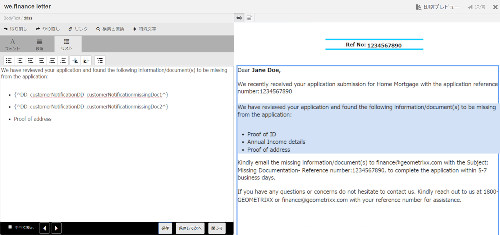

   別のアプリケーションから複数の段落のテキストを再利用することもできます。MS Word や HTML ページ、または別のアプリケーションからテキストを直接コピーして貼り付けることができます。

   編集可能なテキストモジュールでは、1 つ以上のテキスト段落をコピーして貼り付けることができます。たとえば、次のような居住証明書の箇条書きリストを含む MS Word 文書があるとします。

   

   編集可能なテキストモジュールでは、MS Word 文書からテキストを直接コピーして貼り付けることができます。箇条書きリスト、フォント、テキストの色などの書式は、テキストモジュールでも保持されます。

   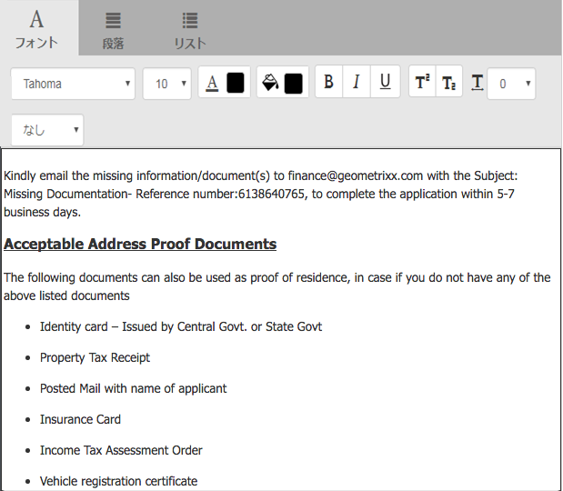

   >[!NOTE]
   >
   >ただし、貼り付けられたテキストの書式設定にはいくつかの[制約](https://helpx.adobe.com/aem-forms/kb/cm-copy-paste-text-limitations.html)があります。

   Tab キーを使用してレターのテキストや数値をインデントできます。例えば、Tab キーを使用してリスト内の複数のテキスト列を表形式に整列させることができます。

   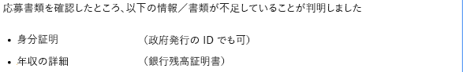

   例：Tab キーを使用して複数のテキスト列を表形式に整列させる

   >[!NOTE]
   >
   >For more information on setting up tab spacing for your text modules and letters, see [More information on using tab spacing for arranging text](https://helpx.adobe.com/aem-forms/kb/cm-tab-spacing-limitations.html).

1. 必要に応じて、通信に特殊文字を挿入します。例えば、特殊文字パレットを使用して、以下の特殊文字を挿入することができます。

   * 通貨記号（€、¥、£など）
   * 数学記号（∑、√、∂、^など）
   * やなどの句読‟記号
   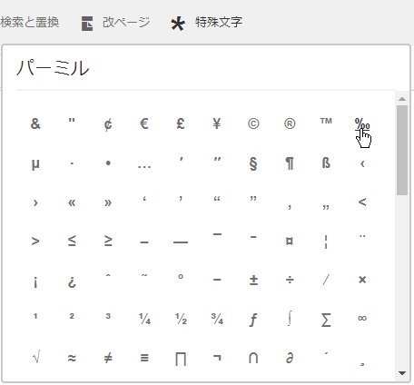

   Correspondence Managementhas では、210 種類の特殊文字に初期状態から対応しています。The admin can [add support for more/custom special characters by customization](../../forms/using/custom-special-characters.md).

1. 編集可能なインラインモジュールのテキストの一部をハイライト表示または強調するには、テキストを選択して「ハイライト表示の色」をタップします。

   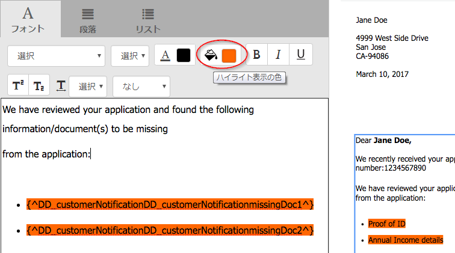

   You can either directly tap a basic color `**[A]**` present in the Basic Colors palette or tap **Select** after using the slider `**[B]**` to choose the appropriate shade of the color.

   Optionally, you can also go to the Advanced tab to select the appropriate Hue, Lightness, and Saturation `**[C]**` to create the precise color and then tap Select `**[D]**` to apply the color to highlight the text.

   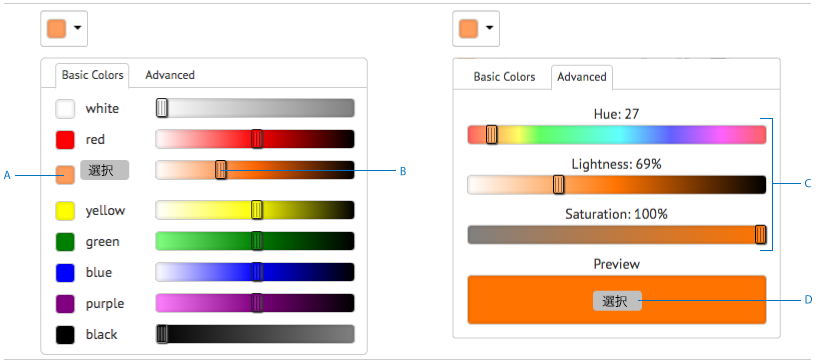

1. Make the appropriate content and format changes and tap **Save**. Tap ( ) to move between editable text modules, or tap **Save and Next** to save the changes and move to the next editable text module.
1. また、各ブランチごとに未入力の変数も表示されます。未入力の変数が無くなると、未入力の変数は 0 として表示されます。未入力の変数がある場合は、ブランチをタップして展開し、未入力の変数を探します。コンテンツツールバーを使用して、コンテンツの削除、コンテンツのインデントの増減、コンテンツの前後に改ページの挿入を行います。

   データモジュールがリストや条件の一部に含まれていても、データモジュールの前後に改ページを挿入できます。

1. Tap Open/Close Content Variable ( ) to open the content variables and fill them appropriately.
1. 未入力変数に正しく入力すると、未入力変数のカウントが 0 に設定されます。

   通信を作成ユーザーインターフェイスでは、少なくとも 1 つの変数を含むモジュールの階層の各レベルに、未入力変数カウントが表示されます。モジュールに未入力変数が含まれている場合は、変数、モジュール、ターゲット領域、およびレターテンプレートレベルでカウントが表示されます。

   未入力変数カウントには次のものが含まれます。

   * 未保護のデータディクショナリとプレースホルダー変数のみ。変数カウントには、レイアウトまたは保護データディクショナリ変数は含まれません。
   * 必須フィールド。
   * 必須かつユーザーにバインドされている場合はレイアウトフィールド。
   * 一意の変数インスタンスのみ。モジュール、ターゲット領域、またはレターテンプレートに、同じ変数の 2 つ以上のインスタンスが含まれている場合、カウントは 1 と表示されます。ただし、各インスタンスに対してカウントは 1 と表示されます。
   未入力変数のカウントには、未選択のモジュールは含まれません。モジュールがレターテンプレートには含まれているがレターには含まれていない場合は、このモジュール内の未入力変数のカウントは表示されません。

   ターゲット領域、モジュール、および変数の場合、カウントは、レターテンプレート内の各オブジェクトの右に表示されます。ただし、完全なテンプレートの場合、通信を作成ステータスバーにカウントが表示されます。

   レターテンプレート内のモジュールは、未入力変数カウントを以下のように表示します。

   * **テキスト** ：テキストモジュールに含まれる一意の未入力プレースホルダー変数とデータディクショナリ要素の合計を表示します。
   * **条件** ：条件に含まれる一意の未入力条件変数と、結果のモジュールに含まれる変数の合計を表示します。
   * **リスト** ：モジュールに割り当てられたモジュールに含まれるすべての一意の未入力変数の合計をリストします。
   * **ターゲット領域** ：モジュール領域に割り当てられたモジュールに含まれるすべての一意の未入力変数の合計をターゲットします。
   デフォルト値を持つ変数について次のことに留意してください。

   * A Boolean variable field defaults to *false*. ただし、この変数は未入力として解釈されます。This implies that the variable count includes all Boolean variable fields with value *false*.

   * A numeric variable field defaults to *0 (zero)*. ただし、この変数は未入力として解釈されます。This implies that the variable count includes all numeric variable fields with value *0 (zero)*.

#### 「通信を作成」の「コンテンツ」タブで使用できるアクションと情報{#actions-and-info-available-in-the-create-correspondence-content-tab}

**ターゲット領域**

* 空白行を挿入： 空白行を挿入します。
* インラインテキストを挿入： インラインテキストを挿入します。
* 順序ロック（情報）： コンテンツの順序が変更できないことを示します。
* 未入力値（情報）： ターゲット領域の未入力変数の個数を示します。

**モジュール**

* 選択（目のアイコン）： レターにモジュールを含めたり除外したりします。
* 箇条書きをスキップ（リストモジュールとその子モジュールに適用可能）： 特定のモジュール内の箇条書きをスキップします。
* 直前に改ページ（ターゲット領域の子モジュールに適用可能）： モジュールの前に改ページを挿入します。
* 後で改ページ(モジュール領域の子ターゲットに適用):モジュールの前に改ページを挿入します。
* 未入力値（情報）： ターゲット領域の未入力変数の個数を示します。
* 編集（テキストモジュールのみ）： テキストモジュールを編集するためにリッチテキストエディターを開きます。
* データパネル（テキストと条件モジュール）： モジュールのすべての変数を開きます。

**リストモジュール**

* 空白行を挿入： 空白行を挿入します。
* コンテンツライブラリ： コンテンツライブラリを開き、リストにモジュールを追加します。
* リスト設定(ネストされたリストのみ):
* 順序ロック（情報）： リスト項目の順序が変更できないことを示します。

### 添付ファイルの管理 {#manage-attachments}

1. Select **Attachments**. Correspondence Managementに、レターテンプレートの作成時に設定された、使用可能な添付ファイルが表示されます。
1. ビューアイコンをタップすることで、レターの添付ファイルを送信しないように選択できます。また、添付ファイルの × 印をタップすると、添付ファイルをレターから削除できます。指定された添付ファイルがレターテンプレートの作成時に必須として設定されたものに対しては、ビューアイコンと削除アイコンは表示されません。
1. Tap the Library Access ( ) icon to access Content Library to insert DAM assets as attachments.

   >[!NOTE]
   >
   >ライブラリアクセスアイコンは、レターの作成時にライブラリアクセスを有効にした場合にのみ使用できます。

1. 通信の作成時に添付ファイルの順序がロックされなかった場合、添付ファイルを選択し、上向きおよび下向き矢印をタップすることで、添付ファイルの順番を変更できます。

   詳しくは、「[添付ファイルの配信](#attachmentdelivery)」を参照してください。

### プレビューでコンテンツを管理しレターを送信 {#manage-content-in-preview-and-submit-the-letter}

レイアウトやコンテンツに関する変更を行って、レターの表示を意図に合ったものにするとともに、様々なポストプロセスに送信することができます。

1. To highlight all the editable content in the letter, tap **Highlight Editable Sections**.

   レターの編集可能コンテンツがグレーの背景でハイライト表示されます。

   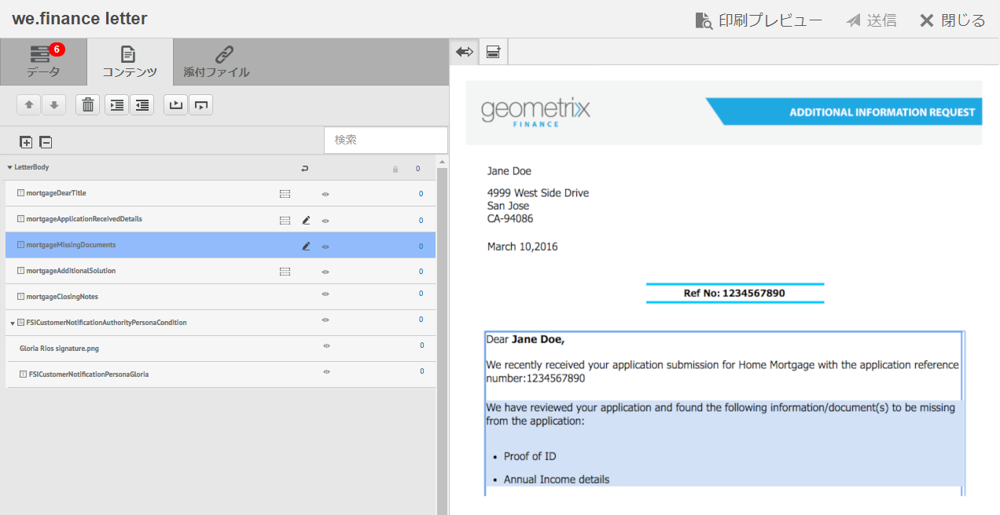

1. 「コンテンツ」タブで、コンテンツモジュールを必要に応じて編集します。コンテンツ階層の関連するコンテンツモジュールにフォーカスするには、レタープレビューで関連する行または段落をタップするか、コンテンツ階層で直接コンテンツモジュールをタップします。

   例えば、下の図で「To allow us to access...」を選択すると、「コンテンツ」タブで対応するコンテンツモジュールが選択されます。

   By tapping Highlight Selected Modules in Content ( ), you can disable or enable functionality to highlight the content module in Content tab when the relevant text, paragraph, or data field is tapped in the letter preview.

   For more information on the actions available for various modules in the Create Correspondence user interface, see [Actions and info available in the Create Correspondence user interface](../../forms/using/create-letter.md#main-pars-header-9).

1. To add a page break to the letter, tap where you want to insert a page break and select Page Break Before or Page Break After ( ).

   レターに、改ページのプレースホルダーが明示的に挿入されます。明示的な改ページによりレターがどの程度影響を受けるか表示するには、統合された PDF プレビューを確認します。

   >[!NOTE]
   >
   >モバイルフォームは改ページをサポートしていないため、ヘッダーとフッターが表示されるのは一度のみになります。ただし、モバイルフォームのプレビューで、レイアウトのヘッダーとフッターを（ページごとに）表示するよう明示的に設定することができます。レター内に空白のページが存在する場合、モバイルフォームのプレビューには表示されません。

   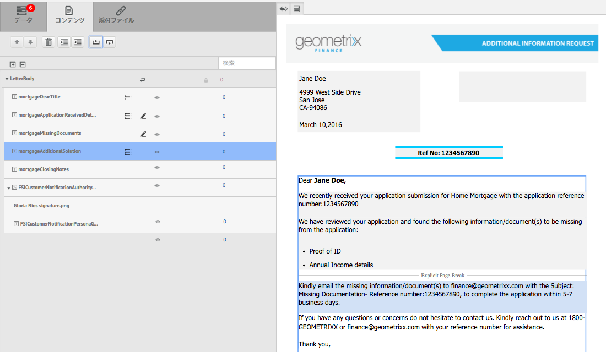

1. レターをドラフトとして保存して後で作業を続けるには、「ドラフトとして保存」をタップします。このオプションを使用するには、レターが[発行済み](../../forms/using/publishing-unpublishing-forms.md#publishanasset)になっている必要があります。詳しくは、「[ドラフトの保存とレターインスタンスの送信](#savingdrafts)」の「ドラフトインスタンス」を参照してください。

   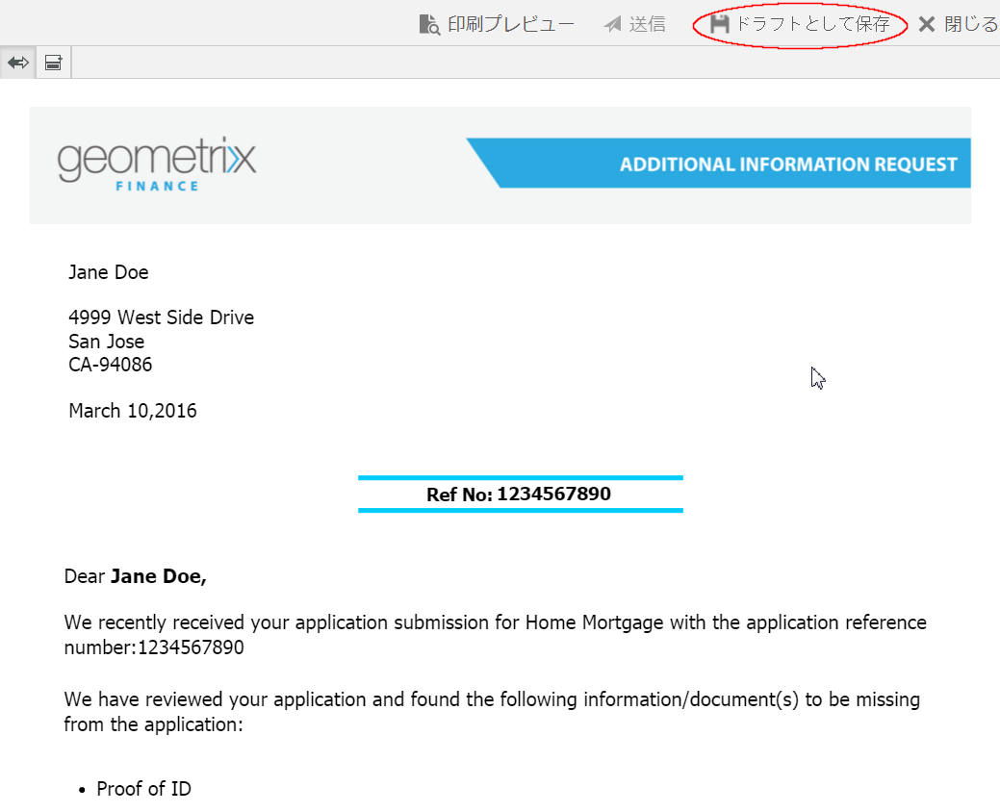

   ドラフトレター名ダイアログにレターインスタンス ID が表示されます。この ID はオプションで編集することができます。レター ID をメモした後、「**完了**」をタップします。後でこの ID を使用して、[ドラフトレターを再読み込み](../../forms/using/submit-letter-topostprocess.md#main-pars-header-1)できます。

1. To preview the letter as a flattened PDF with the exact layout and page breaks as it will be submitted, tap ( ) Preview.

   レターは、統合された PDF として表示されます。統合された PDF は、レターのフォント、改ページ、レイアウトなど、送信されるレターの状態を正確に表示します。

   >[!NOTE]
   >
   >Mozilla Firefox と HTML レンディションを使用する場合、統合された PDF をプレビューするには、Acrobat のプラグインではなく、必ずネイティブのブラウザプラグインを使用してください。ネイティブのブラウザプラグインを選択するには、Mozilla Firefox の設定に移動し、「ファイルの種類（Content Type）」の「PDF文書」から「Firefox でプレビュー表示」を選択してください。

1. If you find the flattened PDF preview to be satisfactory, tap **Submit** to submit the letter. Or to make changes to the letter, tap **Exit Preview** to go back to the Create Correspondence UI preview of the letter to make changes in the letter. 「送信」をタップすると、発行インスタンスでレターインスタンスの管理設定が有効になっている場合、送信レターインスタンスが生成されます。

   詳しくは、「ドラフトの保存とレターインスタンスの送信」の「ドラフトインスタンス」を参照してください。

   レターをドラフトとして保存して、後でレターの変更を行うこともできます。

   必要な変更を行った後、HTML5 プレビューからレターを送信するか、「プレビュー」を再度タップして統合された PDF 出力をレビューできます。

   For information on differences between HTML5 forms and PDF forms, see [Feature differentiation between HTML5 forms and PDF forms](../../forms/using/feature-differentiation-html5-forms-pdf-forms.md).

## ドラフトの保存とレターインスタンスの送信 {#savingdrafts}

通信を作成ユーザーインターフェイスでレターがレンダリングされると、レターを表示中に保存できます。

保存できるレターインスタンスには 2 つのタイプ（ドラフトインスタンスと送信インスタンス）があります。

* **ドラフトインスタンス**：ドラフトインスタンスは、プレビュー中のレターの現在の状態をキャプチャします。ドラフトインスタンスを保存するには、レターおよびレターが参照するすべてのアセットが発行済み状態になっている必要があります。レターの発行について詳しくは、「[アセットの発行](../../forms/using/publishing-unpublishing-forms.md#publishanasset)」を参照してください。レターはドラフトとして保存する前に発行する必要があります。レターを発行すると、その時点でレターのバージョン、これに依存するアセット、および日付が作成されます。レターの発行バージョンを自身または他のユーザーが編集することはできません。このため、発行バージョンは予期しない相違が発生することなく復元できます。後でこのインスタンスに戻り、最後の時点から続けることができます。

* **送信インスタンス**： 送信インスタンスは、送信されたときのレターの状態をキャプチャします。送信インスタンスは、通信を作成ユーザーインターフェイスでユーザーが入力したデータと共に後処理された後のレターインスタンスのPDF状態を保存します。

これらのインスタンスは、レターが発行インスタンスで表示されているときにのみ保存できます。デフォルトでは、インスタンスでの保存は無効になっています。レターインスタンスの保存を有効にするには、次の手順を実行します。

1. AEMで、次のURLを使用して、ご使用のサーバーのAdobe Experience Manager Web Console Configurationを開きます。https://&lt;サーバー>:&lt;ポート>/&lt;コンテキストパス>/system/console/configMgr
1. Locate **[!UICONTROL Correspondence Management Configurations]** and click it.
1. Check **[!UICONTROL Manage Letter Instances on Publish]** configuration and then click **[!UICONTROL Save]**.

レターインスタンスの保存が有効にされると、レターインスタンスの保存場所を選択するためのオプションが表示されます。レターインスタンスを保存するための 2 つのオプション（ローカル保存とリモート保存）があります。

### ローカル保存 {#local-save}

レターインスタンスは発行インスタンス上に保存され、作成者インスタンス上で逆複製されます。

### リモート保存 {#remote-save}

このオプションは、発行インスタンスでユーザーデータを保存することが心配な人のためのもので、一般には企業ファイアウォールの外側に保存することになるからです。リモート保存が有効になっていると、レターインスタンスは発行インスタンスでは保存されず、LiveCycle Client SDK の設定で指定された処理作成者でリモートに保存されます。

#### リモート保存を有効にする {#enable-remote-save}

1. In AEM, open Adobe Experience Manager Web Console Configuration for your server using the following URL: `https://<server>:<port>/<contextpath>/system/console/configMgr`
1. Search for **[!UICONTROL Correspondence Management Configurations]** and click it.
1. Locate the **[!UICONTROL Remote Save]** configuration, check it, and the click **[!UICONTROL Save]**.

#### 処理作成者設定を指定する {#specify-processing-author-settings}

1. In AEM, open Adobe Experience Manager Web Console Configuration for your server using the following URL: `https://<server>:<port>/<contextpath>/system/console/configMgr`

   

1. このページで、Adobe LiveCycle Client SDK Configuration を探し、それをクリックして展開します。

1. In the Processing Server URL, enter the name of your LiveCycle server, provide the login information, and then click **Save**.

   

1. 必要に応じて、サーバーにアクセスするためのユーザー名とパスワードを設定します。

#### 添付ファイルの配信 {#attachmentdelivery}

* レターの添付ファイルはレターの送信後に PDF として後処理されます。
* サーバー側の API を使用してレターがインタラクティブまたは非インタラクティブ PDF としてレンダリングされるとき、レンダリングされる PDF には、添付ファイルが PDF 添付ファイルとして含まれます。
* レターテンプレートに関連付けられた後処理が、通信を作成ユーザーインターフェイスを使用して、通信を送信または通信を完了の操作の一部として読み込まれた場合、添付ファイルは AttachmentDocs パラメーター内の List&lt;com.adobe.idp.Document> として渡されます。
* 追加設定不要な配信メカニズム（電子メールや印刷など）は、生成された通信の PDF とともに添付ファイルも配信します。

## レタープレビューのレンディションモード：モバイルフォームプレビューと PDF プレビュー {#rendition-modes-of-letter-preview-mobile-forms-preview-and-pdf-preview}

AEM Forms Correspondence Management は、「通信を作成」UI でレターを HTML で表示します。ただし、Correspondence Management では、HTML プレビューの代わりに PDF プレビューに戻すことをサポートしています。For more information on switching between HTML and PDF mode of preview, see [Change rendition mode of letter](#changerenditionmode).

HTML および PDF プレビューの利点と使用できる機能は以下のとおりです。

**モバイルフォームと HTML プレビューの利点**

* **データフィールドの値をタップして対応するデータフィールドをハイライト表示**：通信を作成ユーザーインターフェイスで、レターのデータフィールド値をタップして、「データ」タブの対応するデータフィールドをハイライト表示します。詳しくは、「[データを入力](#enterdata)」を参照してください。

* **ブラウザーのサポート**：ブラウザーでは、次第に NPAPI がサポートされなくなってきているため、レターの PDF プレビューにも影響が生じています。レターの HTML またはモバイルフォームプレビューは、この影響を受けません。
* **レター内の編集可能コンテンツをハイライト表示**：通信を作成ユーザーインターフェイスで、レター内でグレー表示されているすべての編集可能コンテンツをハイライト表示するには、「編集可能なセクションをハイライト」をタップします。詳しくは、「[コンテンツの管理](#managecontent)」を参照してください。

`<li>` `<li>Benefits of HTML preview  <ul>   <li>Right to left</li>   <li>NPAPI</li>   <li>Highlight Editable Content</li>  </ul> </li>` `<li>Benefits of PDF preview  <ul>   <li>Page Break</li>   <li>Final Preview</li>  </ul> </li>`
`<li>` `<li>Benefits of HTML preview  <ul>   <li>Right to left</li>   <li>NPAPI</li>   <li>Highlight Editable Content</li>  </ul> </li>` `<li>Benefits of PDF preview  <ul>   <li>Page Break</li>   <li>Final Preview</li>  </ul> </li>`  **PDF プレビューの利点**

* **改ページ**:PDFプレビューでは、レターの改ページが出力に与える影響を正確に表示できます。
* **最終プレビュー**： PDF プレビューでは、レターが出力に表示されるため、レターの書式や表示をそのまま確認できます。

For information on scripting support in PDF forms, see [Scripting Support](https://help.adobe.com/en_US/livecycle/11.0/ScriptingSupport/index.html).

For more information on scripting support in HTML5 forms, see [Scripting support for HTML5 forms](/help/forms/using/scripting-support.md).

### レターのレンディションモードの変更 {#changerenditionmode}

デフォルトでは、「通信を作成」UI は HTML フォームまたはモバイルフォームを使用してレタープレビューをレンダリングします。モバイルフォームのプレビューは、ブラウザのネイティブプラグインを使用し、追加のプラグインを必要としないため、どのブラウザでレンダリングしても問題はありません。レターモードをPDFにプレビューできます。 ただし、ブラウザの制約により、レターのインタラクティブな PDF プレビューの異なる機能で問題が発生する可能性があります。

For more information on browser compatibility with letter preview, see [Discontinuation of NPAPI browser plug-ins and its impact](https://helpx.adobe.com/aem-forms/kb/discontinuation-of-npapi-plugins-impact-on-aem-forms.html).

レターのプレビューモードを変更するには、次の手順を完了してください。

1. Go to `https://[system]:'port'/system/console/configMgr` and, if necessary, log in as Admin.
1. **[!UICONTROL Correspondence Management Configurations]** /Rendition Type **[!UICONTROL （レンディションの種類）に移動し、「]** HTMLレンディション **（デフォルト）」または「****** PDFレンディション」を選択します。
1. 「**[!UICONTROL 保存]**」をクリックします。

