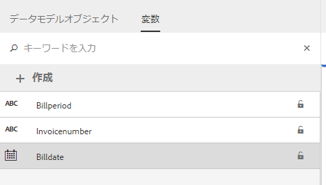

# チュートリアル：ドキュメントフラグメントの作成{#tutorial-create-document-fragments}

This tutorial is a step in the [Create your first Interactive Communication](/help/forms/using/create-your-first-interactive-communication.md) series. チュートリアル内のユースケースを理解して実際に操作できるように、このシリーズのチュートリアルを最初から順に学習することをお勧めします。

ドキュメントフラグメントとは再利用可能な通信のコンポーネントを指し、インタラクティブ通信の作成に使用されます。ドキュメントフラグメントは、次のいずれかの種類になります。

* テキスト — テキストアセットは、1つ以上の段落で構成されるコンテンツの一部です。 段落は静的または動的にすることができます。
* リスト-リストは、テキスト、ドキュメント、条件、画像を含むリストフラグメントのグループです。
* 条件 — 条件を使用すると、フォームデータモデルから受信したデータに基づいて、インタラクティブ通信に含めるコンテンツを定義できます。

This tutorial walks you through the steps to create multiple text document fragments based on the anatomy provided in [Plan the Interactive Communication](/help/forms/using/planning-interactive-communications.md) section. このチュートリアルを完了すると、次の操作を実行できるようになります。

* ドキュメントフラグメントの作成
* 変数の作成
* ルールを作成して適用

このチュートリアルで作成されたドキュメントフラグメントのリストは次のとおりです。

* [請求明細](../../forms/using/create-document-fragments.md#step-create-bill-details-text-document-fragment)
* [顧客情報](../../forms/using/create-document-fragments.md#step-create-customer-details-text-document-fragment)
* [請求内容](../../forms/using/create-document-fragments.md#step-create-bill-summary-text-document-fragment)
* [請求概要](../../forms/using/create-document-fragments.md#step-create-summary-of-charges-text-document-fragment)

各ドキュメントフラグメントには、スタティックテキスト、フォームデータモデルから受信したデータ、エージェント UI を使用して入力したデータが含まれます。All these fields have been depicted in the [Plan the Interactive Communication](/help/forms/using/planning-interactive-communications.md) section.

このチュートリアルでドキュメントフラグメントを作成する際、エージェント UI を使用してデータを受信するフィールドの変数が作成されます。

Use **FDM_Create_First_IC**, as described in the [Create form data model](../../forms/using/create-form-data-model0.md) section, as the form data model to create document fragments in this tutorial.

## 手順 1：請求明細テキストドキュメントフラグメントの作成 {#step-create-bill-details-text-document-fragment}

請求明細ドキュメントフラグメントには次のフィールドが含まれています。

| フィールド | データソース |
|---|---|
| 請求書番号 | エージェント UI |
| 請求期間 | エージェント UI |
| 請求日 | エージェント UI |
| 計画 | フォームデータモデル |

エージェント UI をデータソースとしてフィールドの変数やスタティックテキストを作成して、ドキュメントフラグメント内でフォームデータモデル要素を使用するには、次の手順を実行します。

1. 「**[!UICONTROL フォーム]**／**[!UICONTROL ドキュメントフラグメント]**」を選択します。

1. Select **Create** > **Text**.
1. 次の情報を指定します。

   1. 「**タイトル**」フィールドに、**bill_details_first_ic** を名前としてと入力します。「**名前**」フィールドにタイトルが自動入力されます。

   1. 「**データモデル**」セクションから、「**フォームデータモデル**」を選択します。

   1. **FDM_Create_First_IC** をフォームデータモデルとして選択し、「**選択**」をタップします。

   1. 「**次へ**」をタップします。

1. 左側のペインで、「**変数**」タブを選択して「**作成**」をタップします。
1. 「**変数の作成**」セクションで、次の手順を実行します。

   1. 変数の名前として、**Invoicenumber** を入力します。
   1. **文字列**&#x200B;をタイプとして選択します。
   1. 「**作成**」をタップします。
   

   手順 4 と 5 を繰り返し、次の変数を作成します。

   * Billperiod：文字列タイプ
   * BillDate：日付タイプ
   

1. 右側のペインを使用して、次のフィールドのスタティックテキストを作成します。

   * 請求書番号
   * 請求期間
   * 請求日
   * 計画
   

1. 「**請求書番号**」フィールドの隣にカーソルを置き、左側のペインで、「**変数**」タブの&#x200B;**InvoiceNumber** 変数をダブルクリックします。
1. Place the cursor next to the **Bill Period** field and double-click the **Billperiod** variable.
1. Place the cursor next to the **Bill Date** field and double-click the **Bill Date** variable.
1. 左側のペインで、「**データモデルオブジェクト**」タブを選択します。
1. Place the cursor next to the **Your Plan** field and double-click the **customer** > **customerplan** property.

   

1. 「**保存**」をクリックして、請求明細のテキストドキュメントフラグメントを作成します。

## 手順 2：顧客情報テキストドキュメントフラグメントの作成 {#step-create-customer-details-text-document-fragment}

顧客情報ドキュメントフラグメントには次のフィールドが含まれています。

| フィールド | データソース |
|---|---|
| 顧客名 | フォームデータモデル |
| アドレス | フォームデータモデル |
| 供給場所 | エージェント UI |
| 都道府県コード | エージェント UI |
| 携帯電話番号 | フォームデータモデル |
| 代替電話番号 | フォームデータモデル |
| 関係番号 | フォームデータモデル |
| 接続数 | エージェント UI |

エージェント UI をデータソースとしてフィールドの変数やスタティックテキストを作成して、ドキュメントフラグメント内でフォームデータモデル要素を使用するには、次の手順を実行します。

1. 「**[!UICONTROL フォーム]**／**[!UICONTROL ドキュメントフラグメント]**」を選択します。
1. Select **Create** > **Text**.
1. 次の情報を指定します。

   1. Enter **customer_details_first_ic** as the name in the **Title** field. 「**名前**」フィールドにタイトルが自動入力されます。

   1. 「**データモデル**」セクションから、「**フォームデータモデル**」を選択します。

   1. **FDM_Create_First_IC** をフォームデータモデルとして選択し、「**選択**」をタップします。

   1. 「**次へ**」をタップします。

1. 左側のペインで、「**変数**」タブを選択して「**作成**」をタップします。
1. 「**変数の作成**」セクションで、次の手順を実行します。

   1. Enter **Placesupply** as the name of the variable.
   1. **文字列**&#x200B;をタイプとして選択します。
   1. 「**作成**」をタップします。
   手順 4 と 5 を繰り返し、次の変数を作成します。

   * Statecode：番号の種類
   * Numberconnections：番号の種類

1. Select the **Data Model Objects** tab, place the cursor in the right pane, and double-click the **customer** > **name** property.
1. Press Enter to move the cursor to the next line and double-click the **customer** > **address** property.
1. 右側のペインを使用して、次のフィールドのスタティックテキストを作成します。

   * 携帯電話番号
   * 代替電話番号
   * 供給場所
   * 関係番号
   * 都道府県コード
   * 接続数
   

1. Place the cursor next to the **Mobile Number** field and double-click the **customer** > **mobilenum** property.
1. Place the cursor next to the **Alternate Contact Number** field and double-click the** customer** > **alternatemobilenumber** property.
1. Place the cursor next to the **Relationship Number** field and double-click the **customer** > **relationshipnumber** property.
1. Select the **Variables** tab, place the cursor next to the **Place of Supply** field and double-click the **Placesupply** variable.
1. Place the cursor next to the **State Code** field and double-click the **Statecode** variable.
1. Place the cursor next to the **Number of Connections** field and double-click the **Numberconnections** variable.

   

1. Click **Save** to create the Customer Details text document fragment.

## 手順 3：請求内容テキストドキュメントフラグメントの作成 {#step-create-bill-summary-text-document-fragment}

請求書要約ドキュメントフラグメントには、次のフィールドが含まれます。

| フィールド | データソース |
|---|---|
| 繰越請求額 | エージェント UI |
| 支払い | エージェント UI |
| 調整 | エージェント UI |
| 現在の請求期間の料金 | フォームデータモデル |
| 請求額 | エージェント UI |
| 期限 | エージェント UI |

エージェント UI をデータソースとしてフィールドの変数やスタティックテキストを作成して、ドキュメントフラグメント内でフォームデータモデル要素を使用するには、次の手順を実行します。

1. 「**[!UICONTROL フォーム]**／**[!UICONTROL ドキュメントフラグメント]**」を選択します。
1. Select **Create** > **Text**.
1. 次の情報を指定します。

   1. Enter **bill_summary_first_ic** as the name in the **Title** field. 「**名前**」フィールドにタイトルが自動入力されます。

   1. 「**データモデル**」セクションから、「**フォームデータモデル**」を選択します。

   1. **FDM_Create_First_IC** をフォームデータモデルとして選択し、「**選択**」をタップします。

   1. 「**次へ**」をタップします。

1. 左側のペインで、「**変数**」タブを選択して「**作成**」をタップします。
1. 「**変数の作成**」セクションで、次の手順を実行します。

   1. Enter **Previousbalance** as the name of the variable.
   1. Select **Number** as type.
   1. 「**作成**」をタップします。
   手順 4 と 5 を繰り返し、次の変数を作成します。

   * Payments：番号の種類
   * Adjustments：番号の種類
   * Amountdue：番号の種類
   * Duedate：日付タイプ

1. 右側のペインを使用して、次のフィールドのスタティックテキストを作成します。

   * 繰越請求額
   * 支払い
   * 調整
   * 現在の請求期間の料金
   * 請求額
   * 期限
   * 支払期日経過後の遅延延滞金は、20 ドル
   

1. Place the cursor next to the **Previous Balance** field and double-click the **Previousbalance** variable.
1. Place the cursor next to the **Payments** field and double-click the **Payments** variable.
1. Place the cursor next to the **Adjustments** field and double-click the **Adjustments** variable.
1. Place the cursor next to the **Amount Due** field and double-click the **Amountdue** variable.
1. Place the cursor next to the **Due Date** field and double-click the **Duedate** variable.
1. Select the **Data Model Objects** tab, place the cursor next to the **Charges current bill period** field in the right pane, and double-click the **bills** > **usagecharges** property.

   

1. Click **Save** to create the Customer Details text document fragment.

## 手順 4：請求概要テキストドキュメントフラグメントの作成 {#step-create-summary-of-charges-text-document-fragment}

課金の概要ドキュメントフラグメントには、次のフィールドが含まれます。

| フィールド | データソース |
|---|---|
| 通話料金 | フォームデータモデル |
| 会議通話料金 | フォームデータモデル |
| SMS 料金 | フォームデータモデル |
| 携帯インターネット料金 | フォームデータモデル |
| 国内ローミング料金 | フォームデータモデル |
| 国際ローミング料金 | フォームデータモデル |
| 付加価値サービス料金 | フォームデータモデル |
| 合計請求金額 | フォームデータモデル |
| 合計支払金額 | フォームデータモデル |

スタティックテキストを作成してドキュメントフラグメント内でフォームデータモデル要素を使用するには、次の手順を実行します。

1. 「**[!UICONTROL フォーム]**／**[!UICONTROL ドキュメントフラグメント]**」を選択します。
1. Select **Create** > **Text**.
1. 次の情報を指定します。

   1. Enter **summary_charges_first_ic** as the name in the **Title** field. 「名前」フィールドにタイトルが自動入力されます。

   1. 「**データモデル**」セクションから、「**フォームデータモデル**」を選択します。

   1. **FDM_Create_First_IC** をフォームデータモデルとして選択し、「**選択**」をタップします。

   1. 「**次へ**」をタップします。

1. 右側のペインを使用して、次のフィールドのスタティックテキストを作成します。

   * 通話料金
   * 会議通話料金
   * SMS 料金
   * 携帯インターネット料金
   * 国内ローミング料金
   * 国際ローミング料金
   * 付加価値サービス料金
   * 合計請求金額
   * 合計支払金額
   

1. 「**データモデルオブジェクト**」タブを選択します。
1. Place the cursor next to the **Call Charges** field and double-click the **bills** > **callcharges** property.
1. Place the cursor next to the **Conference Call Charges** field and double-click the **bills** > **confcallcharges** property.
1. Place the cursor next to the **SMS Charges** field and double-click the **bills** > **smscharges** property.
1. Place the cursor next to the **Mobile Internet Charges** field and double-click the **bills** > **internetcharges** property.
1. Place the cursor next to the **National Roaming Charges** field and double-click the **bills** > **roamingnational** property.
1. Place the cursor next to the **International Roaming Charges** field and double-click the **bills** > **roamingintnl** property.
1. Place the cursor next to the **Value Added Services Charges** field and double-click the **bills** > **vas** property.
1. Place the cursor next to the **Total Charges** field and double-click the **bills** > **usagecharges** property.
1. Place the cursor next to the **TOTAL PAYABLE** field and double-click the **bills** > **usagecharges** property.

   

1. Select the text in the **Value Added Services Charges** row and tap **Create Rule** to create a condition based on which the row is displayed in the Interactive Communication:
1. **ルールの作成**&#x200B;ポップアップウィンドウで、次の手順を実行します。

   1. **データモデルと変数**&#x200B;を選択して、**bills**／**callcharges**&#x200B;を選択します。

   1. 演算子として&#x200B;**未満**&#x200B;を選択します。
   1. 「**番号**」を選択し、**60** の値を入力します。
   この条件に基づいて、付加価値サービス料金の列は、通話料金フィールドの値が 60 未満の場合にのみ表示されます。

   

1. Click **Save** to create the Summary of charges text document fragment.
