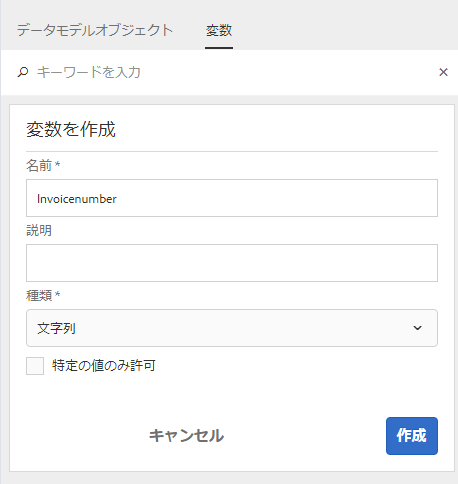
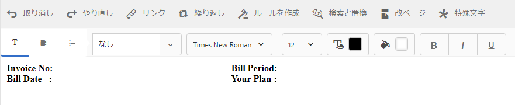

# チュートリアル：ドキュメントフラグメントの作成{#tutorial-create-document-fragments}

このチュートリアルは、[最初のインタラクティブ通信](/help/forms/using/create-your-first-interactive-communication.md)シリーズの手順です。 チュートリアル内のユースケースを理解して実際に操作できるように、このシリーズのチュートリアルを最初から順に学習することをお勧めします。

ドキュメントフラグメントとは再利用可能な通信のコンポーネントを指し、インタラクティブ通信の作成に使用されます。ドキュメントフラグメントは、次のいずれかの種類になります。

* テキスト — テキストアセットは、1つ以上の段落で構成されるコンテンツです。 段落は静的または動的にすることができます。
* リスト — リストは、テキスト、リスト、条件、画像を含む、ドキュメントフラグメントのグループです。
* 条件 — 条件を使用すると、フォームデータモデルから受信したデータに基づいて、インタラクティブ通信に含めるコンテンツを定義できます。

このチュートリアルでは、[インタラクティブ通信の計画](/help/forms/using/planning-interactive-communications.md)の節で説明した構造に基づいて、複数のテキストドキュメントフラグメントを作成する手順を説明します。 このチュートリアルを完了すると、次の操作を実行できるようになります。

* ドキュメントフラグメントの作成
* 変数の作成
* ルールを作成して適用

このチュートリアルで作成されたドキュメントフラグメントのリストは次のとおりです。

* [請求明細](../../forms/using/create-document-fragments.md#step-create-bill-details-text-document-fragment)
* [顧客情報](../../forms/using/create-document-fragments.md#step-create-customer-details-text-document-fragment)
* [請求内容](../../forms/using/create-document-fragments.md#step-create-bill-summary-text-document-fragment)
* [請求概要](../../forms/using/create-document-fragments.md#step-create-summary-of-charges-text-document-fragment)

各ドキュメントフラグメントには、スタティックテキスト、フォームデータモデルから受信したデータ、エージェント UI を使用して入力したデータが含まれます。これらのフィールドはすべて、[インタラクティブ通信の計画](/help/forms/using/planning-interactive-communications.md)の節に記載されています。

このチュートリアルでドキュメントフラグメントを作成する際、エージェント UI を使用してデータを受信するフィールドの変数が作成されます。

[フォームデータモデルの作成](../../forms/using/create-form-data-model0.md)の節で説明されているように、このチュートリアルでドキュメントフラグメントを作成するフォームデータモデルとして、**FDM_Create_First_IC**&#x200B;を使用します。

## 手順 1：請求明細テキストドキュメントフラグメントの作成 {#step-create-bill-details-text-document-fragment}

請求明細ドキュメントフラグメントには次のフィールドが含まれています。

| フィールド | データソース |
|---|---|
| 請求書番号 | エージェント UI |
| 請求期間 | エージェント UI |
| 請求日 | エージェント UI |
| 計画 | フォームデータモデル |

エージェント UI をデータソースとしてフィールドの変数やスタティックテキストを作成して、ドキュメントフラグメント内でフォームデータモデル要素を使用するには、次の手順を実行します。

1. 「**[!UICONTROL フォーム]**／**[!UICONTROL ドキュメントフラグメント]**」を選択します。

1. **作成** > **テキスト**&#x200B;を選択します。
1. 次の情報を指定します。

   1. 「**タイトル**」フィールドに、**bill_details_first_ic** を名前としてと入力します。「**名前**」フィールドにタイトルが自動入力されます。

   1. 「**データモデル**」セクションから、「**フォームデータモデル**」を選択します。

   1. **FDM_Create_First_IC** をフォームデータモデルとして選択し、「**選択**」をタップします。

   1. 「**次へ**」をタップします。

1. 左側のペインで、「**変数**」タブを選択して「**作成**」をタップします。
1. 「**変数の作成**」セクションで、次の手順を実行します。

   1. 変数の名前として、**Invoicenumber** を入力します。
   1. **文字列**&#x200B;をタイプとして選択します。
   1. 「**作成**」をタップします。

   

   手順 4 と 5 を繰り返し、次の変数を作成します。

   * Billperiod：文字列タイプ
   * BillDate：日付タイプ

   

1. 右側のペインを使用して、次のフィールドのスタティックテキストを作成します。

   * 請求書番号
   * 請求期間
   * 請求日
   * 計画

   

1. 「**請求書番号**」フィールドの隣にカーソルを置き、左側のペインで、「**変数**」タブの&#x200B;**InvoiceNumber** 変数をダブルクリックします。
1. 「**請求期間**」フィールドの隣にカーソルを置き、**Billperiod**&#x200B;変数をダブルクリックします。
1. **請求日**&#x200B;フィールドの隣にカーソルを置き、**請求日**&#x200B;変数をダブルクリックします。
1. 左側のペインで、「**データモデルオブジェクト**」タブを選択します。
1. 「**プラン**」フィールドの隣にカーソルを置き、**customer** / **customerplan**&#x200B;プロパティをダブルクリックします。

   

1. 「**保存**」をクリックして、請求明細のテキストドキュメントフラグメントを作成します。

## 手順 2：顧客情報テキストドキュメントフラグメントの作成 {#step-create-customer-details-text-document-fragment}

顧客情報ドキュメントフラグメントには次のフィールドが含まれています。

| フィールド | データソース |
|---|---|
| 顧客名 | フォームデータモデル |
| アドレス | フォームデータモデル |
| 供給場所 | エージェント UI |
| 都道府県コード | エージェント UI |
| 携帯電話番号 | フォームデータモデル |
| 代替電話番号 | フォームデータモデル |
| 関係番号 | フォームデータモデル |
| 接続数 | エージェント UI |

エージェント UI をデータソースとしてフィールドの変数やスタティックテキストを作成して、ドキュメントフラグメント内でフォームデータモデル要素を使用するには、次の手順を実行します。

1. 「**[!UICONTROL フォーム]**／**[!UICONTROL ドキュメントフラグメント]**」を選択します。
1. **作成** > **テキスト**&#x200B;を選択します。
1. 次の情報を指定します。

   1. 「**タイトル**」フィールドに、**customer_details_first_ic**&#x200B;を名前として入力します。 「**名前**」フィールドにタイトルが自動入力されます。

   1. 「**データモデル**」セクションから、「**フォームデータモデル**」を選択します。

   1. **FDM_Create_First_IC** をフォームデータモデルとして選択し、「**選択**」をタップします。

   1. 「**次へ**」をタップします。

1. 左側のペインで、「**変数**」タブを選択して「**作成**」をタップします。
1. 「**変数の作成**」セクションで、次の手順を実行します。

   1. 変数の名前として&#x200B;**Placesupply**&#x200B;と入力します。
   1. **文字列**&#x200B;をタイプとして選択します。
   1. 「**作成**」をタップします。

   手順 4 と 5 を繰り返し、次の変数を作成します。

   * Statecode：番号の種類
   * Numberconnections：番号の種類

1. 「**データモデルオブジェクト**」タブを選択し、右側のウィンドウにカーソルを置いて、**customer** / **name**&#x200B;プロパティをダブルクリックします。
1. Enterキーを押してカーソルを次の行に移動し、**customer** > **address**&#x200B;プロパティをダブルクリックします。
1. 右側のペインを使用して、次のフィールドのスタティックテキストを作成します。

   * 携帯電話番号
   * 代替電話番号
   * 供給場所
   * 関係番号
   * 都道府県コード
   * 接続数

   

1. 「**モバイル番号**」フィールドの隣にカーソルを置き、**customer** / **mobilenum**&#x200B;プロパティをダブルクリックします。
1. 「**代替連絡先番号**」フィールドの隣にカーソルを置き、** customer**/ **alternatemobilenumber**&#x200B;プロパティをダブルクリックします。
1. 「**関係番号**」フィールドの隣にカーソルを置き、**customer** / **relationshipnumber**&#x200B;プロパティをダブルクリックします。
1. 「**変数**」タブを選択し、「**供給場所**」フィールドの隣にカーソルを置き、**Placesupply**&#x200B;変数をダブルクリックします。
1. **State Code**&#x200B;フィールドの隣にカーソルを置き、**Statecode**&#x200B;変数をダブルクリックします。
1. 「**接続数**」フィールドの隣にカーソルを置き、**Numberconnections**&#x200B;変数をダブルクリックします。

   

1. 「**保存**」をクリックして、顧客の詳細テキストドキュメントフラグメントを作成します。

## 手順 3：請求内容テキストドキュメントフラグメントの作成 {#step-create-bill-summary-text-document-fragment}

請求概要ドキュメントフラグメントには、次のフィールドが含まれます。

| フィールド | データソース |
|---|---|
| 繰越請求額 | エージェント UI |
| 支払い | エージェント UI |
| 調整 | エージェント UI |
| 現在の請求期間の料金 | フォームデータモデル |
| 請求額 | エージェント UI |
| 期限 | エージェント UI |

エージェント UI をデータソースとしてフィールドの変数やスタティックテキストを作成して、ドキュメントフラグメント内でフォームデータモデル要素を使用するには、次の手順を実行します。

1. 「**[!UICONTROL フォーム]**／**[!UICONTROL ドキュメントフラグメント]**」を選択します。
1. **作成** > **テキスト**&#x200B;を選択します。
1. 次の情報を指定します。

   1. 「**タイトル**」フィールドに、**bill_summary_first_ic**&#x200B;を名前としてと入力します。 「**名前**」フィールドにタイトルが自動入力されます。

   1. 「**データモデル**」セクションから、「**フォームデータモデル**」を選択します。

   1. **FDM_Create_First_IC** をフォームデータモデルとして選択し、「**選択**」をタップします。

   1. 「**次へ**」をタップします。

1. 左側のペインで、「**変数**」タブを選択して「**作成**」をタップします。
1. 「**変数の作成**」セクションで、次の手順を実行します。

   1. 変数の名前として&#x200B;**Previousbalance**&#x200B;を入力します。
   1. タイプとして&#x200B;**数値**&#x200B;を選択します。
   1. 「**作成**」をタップします。

   手順 4 と 5 を繰り返し、次の変数を作成します。

   * Payments：番号の種類
   * Adjustments：番号の種類
   * Amountdue：番号の種類
   * Duedate：日付タイプ

1. 右側のペインを使用して、次のフィールドのスタティックテキストを作成します。

   * 繰越請求額
   * 支払い
   * 調整
   * 現在の請求期間の料金
   * 請求額
   * 期限
   * 支払期日経過後の遅延延滞金は、20 ドル

   

1. 「**前のバランス**」フィールドの隣にカーソルを置き、**前のバランス**&#x200B;変数をダブルクリックします。
1. 「**支払**」フィールドの隣にカーソルを置き、**支払**&#x200B;変数をダブルクリックします。
1. **Adjustments**&#x200B;フィールドの隣にカーソルを置き、**Adjustments**&#x200B;変数をダブルクリックします。
1. **Amount Due**&#x200B;フィールドの隣にカーソルを置き、**Amountdue**&#x200B;変数をダブルクリックします。
1. 「**期限**」フィールドの隣にカーソルを置き、**Duedate**&#x200B;変数をダブルクリックします。
1. 「**データモデルオブジェクト**」タブを選択し、右側のウィンドウで「**現在の請求期間**&#x200B;を請求」フィールドの隣にカーソルを置き、**bills** / **usagecharges**&#x200B;プロパティをダブルクリックします。

   

1. 「**保存**」をクリックして、顧客の詳細テキストドキュメントフラグメントを作成します。

## 手順 4：請求概要テキストドキュメントフラグメントの作成 {#step-create-summary-of-charges-text-document-fragment}

請求概要ドキュメントフラグメントには、次のフィールドが含まれます。

| フィールド | データソース |
|---|---|
| 通話料金 | フォームデータモデル |
| 会議通話料金 | フォームデータモデル |
| SMS 料金 | フォームデータモデル |
| 携帯インターネット料金 | フォームデータモデル |
| 国内ローミング料金 | フォームデータモデル |
| 国際ローミング料金 | フォームデータモデル |
| 付加価値サービス料金 | フォームデータモデル |
| 合計請求金額 | フォームデータモデル |
| 合計支払金額 | フォームデータモデル |

スタティックテキストを作成してドキュメントフラグメント内でフォームデータモデル要素を使用するには、次の手順を実行します。

1. 「**[!UICONTROL フォーム]**／**[!UICONTROL ドキュメントフラグメント]**」を選択します。
1. **作成** > **テキスト**&#x200B;を選択します。
1. 次の情報を指定します。

   1. **「タイトル**」フィールドに、**summary_charges_first_ic**&#x200B;を名前として入力します。 「名前」フィールドにタイトルが自動入力されます。

   1. 「**データモデル**」セクションから、「**フォームデータモデル**」を選択します。

   1. **FDM_Create_First_IC** をフォームデータモデルとして選択し、「**選択**」をタップします。

   1. 「**次へ**」をタップします。

1. 右側のペインを使用して、次のフィールドのスタティックテキストを作成します。

   * 通話料金
   * 会議通話料金
   * SMS 料金
   * 携帯インターネット料金
   * 国内ローミング料金
   * 国際ローミング料金
   * 付加価値サービス料金
   * 合計請求金額
   * 合計支払金額

   

1. 「**データモデルオブジェクト**」タブを選択します。
1. **通話料**&#x200B;フィールドの隣にカーソルを置き、**bills** / **callcharges**&#x200B;プロパティをダブルクリックします。
1. **会議通話料金**&#x200B;フィールドの隣にカーソルを置き、**bills** / **confcallcharges**&#x200B;プロパティをダブルクリックします。
1. **SMS料金**&#x200B;フィールドの隣にカーソルを置き、**bills** / **smscharges**&#x200B;プロパティをダブルクリックします。
1. 「**モバイルインターネット料金**」フィールドの隣にカーソルを置き、**bills** / **internetcharges**&#x200B;プロパティをダブルクリックします。
1. **National Roaming Charges**&#x200B;フィールドの隣にカーソルを置き、**bills** > **roamingnational**&#x200B;プロパティをダブルクリックします。
1. 「**国際ローミング料金**」フィールドの隣にカーソルを置き、**bills** / **roamingintnl**&#x200B;プロパティをダブルクリックします。
1. 「**付加価値サービス料**」フィールドの隣にカーソルを置き、**bills** / **vas**&#x200B;プロパティをダブルクリックします。
1. **Total Charges**&#x200B;フィールドの隣にカーソルを置き、**bills** / **usagecharges**&#x200B;プロパティをダブルクリックします。
1. **TOTAL PAYABLE**&#x200B;フィールドの隣にカーソルを置き、**bills** / **usagecharges**&#x200B;プロパティをダブルクリックします。

   

1. 「**付加価値サービス料**」行のテキストを選択し、「**ルールを作成**」をタップして、インタラクティブ通信に表示される行に基づいて条件を作成します。
1. **ルールの作成**&#x200B;ポップアップウィンドウで、次の手順を実行します。

   1. **データモデルと変数**&#x200B;を選択して、**bills**／**callcharges**&#x200B;を選択します。

   1. 演算子として&#x200B;**未満**&#x200B;を選択します。
   1. 「**番号**」を選択し、**60** の値を入力します。

   この条件に基づいて、付加価値サービス料金の列は、通話料金フィールドの値が 60 未満の場合にのみ表示されます。

   

1. **保存**&#x200B;をクリックして、請求概要テキストドキュメントフラグメントを作成します。
