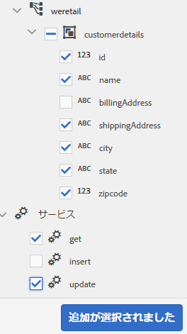

# チュートリアル：フォームデータモデルの作成 {#tutorial-create-form-data-model}

これは、「[最初のアダプティブフォームを作成する](../../forms/using/create-your-first-adaptive-form.md)」シリーズを構成するチュートリアルです。チュートリアル内のユースケースを理解して実際に操作できるように、このシリーズのチュートリアルを最初から順に学習することをお勧めします。

## このチュートリアルについて {#about-the-tutorial}

AEM [!DNL Forms] data integration module allows you to create a form data model from disparate backend data sources such as AEM user profile, RESTful web services, SOAP-based web services, OData services, and relational databases. フォームデータモデル内でデータモデルオブジェクトとサービスを設定し、そのフォームデータモデルをアダプティブフォームに関連付けることができます。アダプティブフォームのフィールドは、データモデルオブジェクトのプロパティに連結されます。フォームデータモデル内のサービスを使用して、アダプティブフォームに事前にデータを取り込み、送信されたフォームデータをデータモデルオブジェクトに書き込むことができます。

フォームデータの統合機能とフォームデータモデルについて詳しくは、「[AEM Forms のデータ統合機能](../../forms/using/data-integration.md)」を参照してください。

このチュートリアルでは、フォームデータモデルの準備、作成、設定を行い、そのフォームデータモデルをアダプティブフォームに関連付けるための手順について、順を追って説明します。このチュートリアルを完了すると、次の操作を実行できるようになります。

* [MySQL データベースをデータソースとして設定する](#config-database)
* [MySQLデータベースを使用したフォームデータモデルの作成](#create-fdm)
* [フォームデータモデルを設定する](#config-fdm)
* [フォームデータモデルのテストを行う](#test-fdm)

フォームデータモデルは、以下のように表示されます。

**A.** Configured data sources **B.** Data source services **C.** Available services **D.****** Data model objects E. Configured services

## 前提条件 {#prerequisites}

作業を開始する前に、以下の条件が満たされているかどうかを確認してください。

* [!DNL MySQL]「[最初のアダプティブフォームを作成する](../../forms/using/create-your-first-adaptive-form.md)」の「前提条件」セクションの記載に従って、 データベースにサンプルデータが取り込まれていること
* OSGi bundle for [!DNL MySQL] JDBC driver as explained in [Bundling the JDBC Database Driver](/help/sites-developing/jdbc.md#bundling-the-jdbc-database-driver)
* Adaptive form as explained in the first tutorial [Create an adaptive form](/help/forms/using/create-adaptive-form.md)

## 手順 1：MySQL データベースをデータソースとして設定する {#config-database}

各種のデータソースを設定して、フォームデータモデルを作成することができます。このチュートリアルでは、サンプルデータが取り込まれた MySQL データベースの設定を行います。サポートされている他のデータソースとその設定方法については、「[AEM Forms のデータ統合機能](../../forms/using/data-integration.md)」を参照してください。

Do the following to configure your [!DNL MySQL] database:

1. Install JDBC driver for [!DNL MySQL] database as an OSGi bundle:

   1. Log in to AEM [!DNL Forms] Author Instance as an administrator and go to AEM web console bundles. The default URL is [https://localhost:4502/system/console/bundles](https://localhost:4502/system/console/bundles).

   1. Tap **[!UICONTROL Install/Update]**. 「[!UICONTROL Upload / Install Bundles]」ダイアログが表示されます。

   1. 「**[!UICONTROL Choose File]**」をタップし、 JDBC ドライバーの OSGi バンドルを探して選択します。[!DNL MySQL]Select **[!UICONTROL Start Bundle]** and **[!UICONTROL Refresh Packages]**, and tap **[!UICONTROL Install or Update]**. Ensure that the [!DNL Oracle Corporation's] JDBC Driver for [!DNL MySQL] is active. このドライバーは、既にインストールされています。

1. Configure [!DNL MySQL] database as a data source:

   1. Go to AEM web console at [https://localhost:4502/system/console/configMgr](https://localhost:4502/system/console/configMgr).
   1. 「**Apache Sling Connection Pooled DataSource**」という設定を探し、その設定をタップして編集モードで開きます。
   1. 設定ダイアログで、以下の詳細情報を指定します。

      * **Datasource name**：任意のデータソース名を指定します。For example, specify **WeRetailMySQL**.
      * **DataSource service property name**：データソース名を保管するサービスプロパティの名前を指定します。この名前は、データソースインスタンスを OSGi サービスとして登録する際に指定されます。例えば、「**datasource.name**」などを指定します。
      * **JDBC driver class**：JDBC ドライバーの Java クラス名を指定します。For [!DNL MySQL] database, specify **com.mysql.jdbc.Driver**.
      * **JDBC connection URI**：データベースの接続 URL を指定します。ポート3306およびスキーマWeretailで実行される [!DNL MySQL] データベースの場合、URLは次のとおりです。 `jdbc:mysql://'server':3306/weretail?autoReconnect=true&useUnicode=true&characterEncoding=utf-8`
      * **Username**：データベースのユーザー名を指定します。データベースとの接続を確立するには、JDBC ドライバーを有効にする必要があります。
      * **Password**：データベースのパスワードを指定します。データベースとの接続を確立するには、JDBC ドライバーを有効にする必要があります。
      * **借用時のテスト：** [借用時に **[!UICONTROL テスト]** ]オプションを有効にします。
      * **リターン時のテスト：** 「リターン時に **[!UICONTROL テスト]** 」オプションを有効にします。
      * **Validation Query**：プールからの接続状態を確認するための SQL SELECT クエリを指定します。このクエリでは、1 行以上の行が返される必要があります。例えば、「**select * from customerdetails**」などを指定します。
      * **Transaction Isolation**：このオプションの値を「**READ_COMMITTED**」に設定します。

         Leave other properties with default [values](https://tomcat.apache.org/tomcat-7.0-doc/jdbc-pool.html) and tap **[!UICONTROL Save]**.

         以下のような設定が作成されます。

         

## 手順 2：フォームデータモデルを作成する {#create-fdm}

AEM [!DNL Forms] provides an intuitive user interface to [create a form data model](data-integration.md) from configured data sources. 1 つのフォームデータモデル内で複数のデータソースを使用することができます。For our use case, we will use the configured [!DNL MySQL] data source.

フォームデータモデルを作成するには、以下の手順を実行します。

1. AEM オーサーインスタンスで、**[!UICONTROL フォーム]**／**[!UICONTROL データ統合]**&#x200B;に移動します。
1. **[!UICONTROL 作成]**／**[!UICONTROL フォームデータモデル]**&#x200B;の順にタップします。
1. フォームデータモデル作成ダイアログで、フォームデータモデルの&#x200B;**名前**&#x200B;を指定します。例えば、「**customer-shipping-billing-details**」などを指定します。「**[!UICONTROL 次へ]**」をタップします。
1. データソース選択画面に、すべての設定済みデータソースが一覧表示されます。Select **WeRetailMySQL** data source and tap **[!UICONTROL Create]**.

   

The **customer-shipping-billing-details** form data model is created.

## 手順 3：フォームデータモデルを設定する {#config-fdm}

フォームデータモデルを設定するには、以下の操作を行う必要があります。

* データモデルのオブジェクトおよびサービスの追加
* データモデルオブジェクト用の読み取りサービスと書き込みサービスを設定する

フォームデータモデルを設定するには、以下の手順を実行します。

1. On AEM author instance, navigate to **[!UICONTROL Forms]** > **[!UICONTROL Data Integrations]**. The default URL is [https://localhost:4502/aem/forms.html/content/dam/formsanddocuments-fdm](https://localhost:4502/aem/forms.html/content/dam/formsanddocuments-fdm).
1. The **customer-shipping-billing-details** form data model you created earlier is listed here. このフォームデータモデルを編集モードで開きます。

   前の手順で選択した **WeRetailMySQL** というデータソースが、フォームデータモデル内に設定されています。

   

1. データソースツリーで WeRailMySQL データソースを展開します。Select the following data model objects and services from **weretail** > **customerdetails** schema to form data model:

   * **データモデルオブジェクト**:

      * id
      * name
      * shippingAddress
      * 市区町村
      * state
      * zipcode
   * **Services:**

      * get
      * 更新

   「**選択項目を追加**」をタップして、選択したデータモデルオブジェクトとサービスをフォームデータモデルに追加します。

   

   >[!NOTE]
   >
   >JDBCデータソースのデフォルトのget、update、insertサービスは、フォームデータモデルと共に、すぐに使用できます。

1. 以下の手順により、データモデルオブジェクトの読み取りサービスと書き込みサービスを設定します。

   1. 「**customerdetails**」データモデルオブジェクトを選択して「**[!UICONTROL プロパティの編集]**」をタップします。
   1. 「読み取りサービス」ドロップダウンで「**[!UICONTROL get]**」を選択します。The **id** argument, which is the primary key in the customerdetails data model object is added automatically. 「  」をタップし、次のように引数を設定します。

      

   1. 同様に、書き込みサービスとして「**[!UICONTROL update]**」を選択します。**customerdetails** オブジェクトが引数として自動的に追加されます。この引数を以下のように設定します。

      

      **id** 引数を追加して以下のように設定します。

      

   1. 「**[!UICONTROL 完了]**」をタップして、データモデルオブジェクトのプロパティを保存します。Then, tap **[!UICONTROL Save]** to save the form data model.

      **[!UICONTROL get]** サービスと **[!UICONTROL update]** サービスが、データモデルオブジェクトのデフォルトのサービスとして追加されます。

      

1. 「**[!UICONTROL サービス]**」タブに移動し、**[!UICONTROL get]** サービスと **[!UICONTROL update]** サービスを設定します。

   1. Select the **[!UICONTROL get]** service and tap **[!UICONTROL Edit Properties]**. プロパティダイアログが開きます。
   1. プロパティを編集ダイアログで、以下のプロパティを指定します。

      * **タイトル**：サービスのタイトルを指定します。例えば、「Retrieve Shipping Address」などを指定します。
      * **説明**：サービスの詳細な機能を示す説明を入力します。次に例を示します。

         This service retrieves shipping address and other customer details from [!DNL MySQL] database

      * **出力モデルオブジェクト**：顧客データを保管するスキーマを選択します。次に例を示します。

         customerdetailスキーマ

      * **配列を返す**：「**配列を返す**」オプションを無効にします。
      * **引数**：**ID** という引数を選択します。

      「**[!UICONTROL 完了]**」をタップします。これで、顧客の詳細情報を MySQL データベースから取得するサービスが設定されました。

      

   1. **[!UICONTROL update]** サービスを選択し、「プロパティの **[!UICONTROL 編集]**」をタップします。 プロパティダイアログが開きます。

   1. Specify the following in the [!UICONTROL Edit Properties] dialog:

      * **タイトル**：サービスのタイトルを指定します。例えば、「Update Shipping Address」などを指定します。
      * **説明**：サービスの詳細な機能を示す説明を入力します。次に例を示します。

         このサービスは、MySQLデータベースの配送先住所と関連フィールドを更新します

      * **入力モデルオブジェクト**：顧客データを保管するスキーマを選択します。次に例を示します。

         customerdetailスキーマ

      * **出力タイプ**：「**ブール演算式**」を選択します。

      * **引数**：**ID** という引数と **customerdetails** という引数を選択します。
      「**[!UICONTROL 完了]**」をタップします。これで、 データベース内の顧客の詳細情報を更新する **[!UICONTROL update]** サービスが設定されました。[!DNL MySQL]

      

これで、フォームデータモデル内のデータモデルオブジェクトとサービスが設定されました。次に、フォームデータモデルのテストを実行します。

## 手順 4：フォームデータモデルのテストを実行する {#test-fdm}

データモデルのオブジェクトおよびサービスをテストして、フォームデータモデルが正しく設定されていることを確認できます。

テストを実行するには、以下の手順を実行します。

1. 「**[!UICONTROL モデル]**」タブに移動し、**customerdetails** データモデルオブジェクトを選択して「**[!UICONTROL モデルオブジェクトをテスト]**」をタップします。
1. 「[!UICONTROL モデル / サービスのテスト]」ウィンドウの「**[!UICONTROL モデル / サービスを選択]**」ドロップダウンで「**[!UICONTROL モデルオブジェクトを読み込み]**」を選択します。
1. In the **customerdetails** section, specify a value for the **id** argument that exists in the configured [!DNL MySQL] database and tap **[!UICONTROL Test]**.

   指定した id 引数に関連付けられている顧客の詳細情報がデータベースから取得され、以下のように「**[!UICONTROL 出力]**」セクションに表示されます。

   

1. 同様の手順で、書き込みモデルオブジェクトと書き込みサービスをテストします。

   以下の例では、データベース内で 7102715 という ID が設定されている住所情報が、update サービスによって正しく更新されています。

   

   この状態で、7102715 という ID に対して読み取りモデルサービスのテストをもう一度実行すると、以下のように、更新後の顧客情報が画面に表示されます。

   
