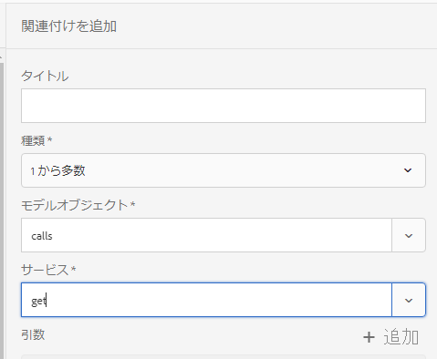

# チュートリアル：フォームデータモデルの作成{#tutorial-create-form-data-model}


このチュートリアルは、[最初の対話型通信を作成する](/help/forms/using/create-your-first-interactive-communication.md)シリーズのステップです。 チュートリアル内のユースケースを理解して実際に操作できるように、このシリーズのチュートリアルを最初から順に学習することをお勧めします。

## このチュートリアルについて  {#about-the-tutorial}

AEM Formsデータ統合モジュールを使用すると、AEMユーザープロファイル、RESTful Webサービス、SOAPベースのWebサービス、ODataサービス、およびリレーショナルデータベースなど、異なるバックエンドデータソースからフォームデータモデルを作成できます。 フォームデータモデル内でデータモデルオブジェクトとサービスを設定し、そのフォームデータモデルをアダプティブフォームに関連付けることができます。アダプティブフォームのフィールドは、データモデルオブジェクトのプロパティに連結されます。フォームデータモデル内のサービスを使用して、アダプティブフォームに事前にデータを取り込み、送信されたフォームデータをデータモデルオブジェクトに書き込むことができます。

フォームデータの統合機能とフォームデータモデルについて詳しくは、「[AEM Forms のデータ統合機能](https://helpx.adobe.com/experience-manager/6-3/forms/using/data-integration.html)」を参照してください。

このチュートリアルでは、フォームデータモデルの準備、作成、設定を行い、そのフォームデータモデルをインタラクティブ通信に関連付けるための手順について、順を追って説明します。このチュートリアルを完了すると、次の操作を実行できるようになります。

* [データベースの設定](../../forms/using/create-form-data-model0.md#step-set-up-the-database)
* [MySQL データベースをデータソースとして設定する](../../forms/using/create-form-data-model0.md#step-configure-mysql-database-as-data-source)
* [フォームデータモデルを作成する](../../forms/using/create-form-data-model0.md#step-create-form-data-model)
* [フォームデータモデルを設定する](../../forms/using/create-form-data-model0.md#step-configure-form-data-model)
* [フォームデータモデルのテストを行う](../../forms/using/create-form-data-model0.md#step-test-form-data-model-and-services)

フォームデータモデルは以下に類似しています。


**A.** 設定済みデータソース **B.** データソーススキーマC. **利用可能なサービス** Available Services. **Data modelオブジェクトE**  **** Configuredサービス

## 前提条件 {#prerequisites}

作業を開始する前に、以下の条件が満たされているかどうかを確認してください。

* 「[データベースを設定する](../../forms/using/create-form-data-model0.md#step-set-up-the-database)」セクションの記載に従って MySQL データベースにサンプルデータが取り込まれていること
* [JDBCデータベースドライバーのバンドル](https://helpx.adobe.com/experience-manager/6-3/help/sites-developing/jdbc.html#bundling-the-jdbc-database-driver)で説明されている、MySQL JDBCドライバー用のOSGiバンドル

## 手順 1：データベースの設定 {#step-set-up-the-database}

インタラクティブ通信の作成にはデータベースが不可欠です。このチュートリアルではデータベースを使用して、インタラクティブ通信のフォームデータモデルと永続性機能を表示します。顧客、請求書、および呼び出し表を含むデータベースを設定します。
以下の画像は、顧客テーブルのサンプルデータを示しています。


次のDDLステートメントを使用して、データベースに&#x200B;**customer**&#x200B;テーブルを作成します。

```sql
CREATE TABLE `customer` (
   `mobilenum` int(11) NOT NULL,
   `name` varchar(45) NOT NULL,
   `address` varchar(45) NOT NULL,
   `alternatemobilenumber` int(11) DEFAULT NULL,
   `relationshipnumber` int(11) DEFAULT NULL,
   `customerplan` varchar(45) DEFAULT NULL,
   PRIMARY KEY (`mobilenum`),
   UNIQUE KEY `mobilenum_UNIQUE` (`mobilenum`)
 ) ENGINE=InnoDB DEFAULT CHARSET=utf8
```

次のDDL文を使用して、データベースに&#x200B;**bills**&#x200B;テーブルを作成します。

```sql
CREATE TABLE `bills` (
   `billplan` varchar(45) NOT NULL,
   `latepayment` decimal(4,2) NOT NULL,
   `monthlycharges` decimal(4,2) NOT NULL,
   `billdate` date NOT NULL,
   `billperiod` varchar(45) NOT NULL,
   `prevbal` decimal(4,2) NOT NULL,
   `callcharges` decimal(4,2) NOT NULL,
   `confcallcharges` decimal(4,2) NOT NULL,
   `smscharges` decimal(4,2) NOT NULL,
   `internetcharges` decimal(4,2) NOT NULL,
   `roamingnational` decimal(4,2) NOT NULL,
   `roamingintnl` decimal(4,2) NOT NULL,
   `vas` decimal(4,2) NOT NULL,
   `discounts` decimal(4,2) NOT NULL,
   `tax` decimal(4,2) NOT NULL,
   PRIMARY KEY (`billplan`)
 ) ENGINE=InnoDB DEFAULT CHARSET=utf8
```

次のDDLステートメントを使用して、データベース内に&#x200B;**呼び出し**&#x200B;テーブルを作成します。

```sql
CREATE TABLE `calls` (
   `mobilenum` int(11) DEFAULT NULL,
   `calldate` date DEFAULT NULL,
   `calltime` varchar(45) DEFAULT NULL,
   `callnumber` int(11) DEFAULT NULL,
   `callduration` varchar(45) DEFAULT NULL,
   `callcharges` decimal(4,2) DEFAULT NULL,
   `calltype` varchar(45) DEFAULT NULL
 ) ENGINE=InnoDB DEFAULT CHARSET=utf8
```

**呼び出し**&#x200B;テーブルには、呼び出し日、呼び出し時間、呼び出し回数、呼び出し時間、呼び出し料金などの呼び出しの詳細が含まれます。 **customer**&#x200B;テーブルは、「モバイル番号(mobilenum)」フィールドを使用して呼び出しテーブルにリンクされています。 **customer**&#x200B;テーブルにリストされているモバイル番号ごとに、**calls**&#x200B;テーブルに複数のレコードがあります。 例えば、**calls**&#x200B;テーブルを参照して、&lt;a0/>1457892541 **モバイル番号の呼び出しの詳細を取得できます。**

**bills**&#x200B;テーブルには、請求日、請求期間、月額料金、通話料金などの請求書の詳細が含まれます。 **customer**&#x200B;テーブルは、請求書計画フィールドを使用して&#x200B;**bills**&#x200B;テーブルにリンクされます。 **customer**&#x200B;テーブルには、各顧客に関連付けられたプランがあります。 **bills**&#x200B;テーブルには、既存のすべてのプランの価格設定の詳細が含まれます。 例えば、**Sarah** のプランの詳細を顧客テーブルから取得し、この情報を使って請求テーブルから価格の詳細を取得することができます。********

## 手順 2：MySQL データベースをデータソースとして設定する {#step-configure-mysql-database-as-data-source}

各種のデータソースを設定して、フォームデータモデルを作成することができます。このチュートリアルでは、サンプルデータが取り込まれた MySQL データベースの設定を行います。サポートされている他のデータソースとその設定方法については、「[AEM Forms のデータ統合機能](https://helpx.adobe.com/experience-manager/6-3/forms/using/data-integration.html)」を参照してください。

MySQL データベースを設定するには、以下の手順を実行します。

1. MySQLデータベース用のJDBCドライバーをOSGiバンドルとしてインストールします。

   1. AEM Forms のオーサーインスタンスに管理者としてログインし、AEM Web コンソールバンドルに移動します。デフォルトのURLは[https://localhost:4502/system/console/bundles](https://localhost:4502/system/console/bundles)です。
   1. 「**インストール/更新**」をタップします。 「**Upload / Install Bundles**」ダイアログが表示されます。

   1. 「**Choose File**」をタップし、MySQL JDBC ドライバーの OSGi バンドルを探して選択します。「**開始バンドル**」と「**パッケージを更新**」を選択し、「**インストール**」または「**更新**」をタップします。 Oracle が提供する MySQL の JDBC ドライバーがアクティブになっていることを確認します。このドライバーは、既にインストールされています。

1. 以下の手順により、MySQL データベースをデータソースとして設定します。

   1. AEM Webコンソール([https://localhost:4502/system/console/configMgr](https://localhost:4502/system/console/configMgr))に移動します。
   1. 「**Apache Sling Connection Pooled DataSource**」という設定を探し、その設定をタップして編集モードで開きます。
   1. 設定ダイアログで、以下の詳細情報を指定します。

      * **Datasource name**：任意のデータソース名を指定します。例えば、**MySQL**&#x200B;を指定します。

      * **DataSource service property name**：データソース名を保管するサービスプロパティの名前を指定します。この名前は、データソースインスタンスを OSGi サービスとして登録する際に指定されます。例えば、「**datasource.name**」などを指定します。

      * **JDBC driver class**：JDBC ドライバーの Java クラス名を指定します。MySQLデータベースの場合は、**com.mysql.jdbc.Driver**&#x200B;を指定します。

      * **JDBC connection URI**：データベースの接続 URL を指定します。ポート3306およびスキーマtelecaで実行されるMySQLデータベースの場合、URLは次のようになります。`jdbc:mysql://'server':3306/teleca?autoReconnect=true&useUnicode=true&characterEncoding=utf-8`
      * **Username**：データベースのユーザー名を指定します。データベースとの接続を確立するには、JDBC ドライバーを有効にする必要があります。
      * **Password**：データベースのパスワードを指定します。データベースとの接続を確立するには、JDBC ドライバーを有効にする必要があります。
      * **借入時にテスト：借入時に** テストを **有効に** します。

      * **リターン時のテスト：リターン時の** テストの **** オプションを有効にします。

      * **Validation Query**：プールからの接続状態を確認するための SQL SELECT クエリを指定します。このクエリでは、1 行以上の行が返される必要があります。例えば、**customer**&#x200B;から*を選択します。

      * **Transaction Isolation**：このオプションの値を「**READ_COMMITTED**」に設定します。
   その他のプロパティはデフォルトの[値](https://tomcat.apache.org/tomcat-7.0-doc/jdbc-pool.html)のままにし、「**保存**」をタップします。

   以下のような設定が作成されます。

   

## 手順 3：フォームデータモデルを作成する {#step-create-form-data-model}

AEM Formsは、設定済みのデータソースからフォームデータモード](https://helpx.adobe.com/experience-manager/6-3/forms/using/data-integration.html#main-pars_header_1524967585)lを作成する、直観的なユーザーインターフェイスを提供します。 [1 つのフォームデータモデル内で複数のデータソースを使用することができます。本チュートリアルのユースケースでは、MySQL をデータソースとして使用します。

フォームデータモデルを作成するには、以下の手順を実行します。

1. AEM オーサーインスタンスで、**フォーム**／**データ統合**&#x200B;に移動します。
1. **作成**／**フォームデータモデル**&#x200B;の順にタップします。
1. フォームデータモデルを作成ウィザードで、フォームデータモデルの&#x200B;**名前**&#x200B;を指定します。 例えば、**FDM_Create_First_IC**&#x200B;のように指定します。 「**次へ**」をタップします。
1. データソース選択画面に、すべての設定済みデータソースが一覧表示されます。「**MySQL**&#x200B;データソース」を選択し、「**作成**」をタップします。

   

1. 「**完了**」をクリックします。**FDM_Create_First_IC**&#x200B;フォーム・データ・モデルが作成されます。

## 手順 4：フォームデータモデルを設定する {#step-configure-form-data-model}

フォームデータモデルの設定には以下が含まれます。

* [データモデルオブジェクトとサービスの追加](#add-data-model-objects-and-services)
* [データモデルオブジェクト用の計算済み子プロパティの作成](#create-computed-child-properties-for-data-model-object)
* [データモデルオブジェクト間の関連付けの追加](#add-associations-between-data-model-objects)
* [データモデルオブジェクトプロパティの編集](#edit-data-model-object-properties)
* [データモデルオブジェクト用サービスの設定](#configure-services)

### データモデルオブジェクトとサービスの追加 {#add-data-model-objects-and-services}

1. AEMオーサーインスタンスで、**Forms** > **データ統合**&#x200B;に移動します。 デフォルトのURLは[https://localhost:4502/aem/forms.html/content/dam/formsanddocuments-fdm](https://localhost:4502/aem/forms.html/content/dam/formsanddocuments-fdm)です。
1. 前に作成した&#x200B;**FDM_Create_First_IC**&#x200B;フォームデータモデルをここに示します。 これを選択し、「**編集**」をタップします。

   選択したデータソース&#x200B;**MySQL**&#x200B;が&#x200B;**データソース**&#x200B;ウィンドウに表示されます。

   

1. **MySQL** データソースツリーを展開します。**teleca**&#x200B;スキーマから次のデータモデルオブジェクトおよびサービスを選択します。

   * **データモデルオブジェクト**:

      * 請求
      * 通話
      * 顧客
   * **Services:**

      * get
      * 更新

   「**選択項目を追加**」をタップして、選択したデータモデルオブジェクトとサービスをフォームデータモデルに追加します。

   

   請求、通話および顧客のデータモデルオブジェクトは、「**モデル**」タブの右側のペインに表示されます。get サービスと update サービスは、「**サービス**」タブに表示されます。

   

### データモデルオブジェクト用の計算済み子プロパティの作成 {#create-computed-child-properties-for-data-model-object}

計算済みプロパティとは、ルールまたは式に基づいて値が計算されるプロパティのことです。ルールを使用して、計算済みプロパティの値を、リテラル文字列、数値、数式の計算結果、フォームデータモデル内の別のプロパティの値に設定することができます。

ユースケースに基づき、以下の数式を使って&#x200B;**請求**&#x200B;データモデルオブジェクトの **usagecharges** 計算済み子プロパティを作成します。

* 使用料金=通話料金+会議通話料金+ SMS料金+モバイルインターネット料金+ローミング国際通話料+ローミング国際通話料+ VAS （これらすべてのプロパティは請求書データモデルオブジェクトに存在します）
**usagecharges**&#x200B;子計算済みプロパティの詳細については、[対話型通信の計画](/help/forms/using/planning-interactive-communications.md)を参照してください。

請求データモデルオブジェクト用の計算済み子プロパティを作成するには、次の手順を実行します。

1. **bills**&#x200B;データモデルオブジェクトの上部にあるチェックボックスを選択して選択し、「**子プロパティを作成**」をタップします。
1. **子プロパティを作成**&#x200B;ペインで、

   1. 子プロパティの名前として **usagecharges** を入力します。
   1. 「**計算済み**」を有効にします。
   1. 種類として「**浮動小数点**」を選択し、「**完了**」をタップして子プロパティを&#x200B;**bills**&#x200B;データモデルオブジェクトに追加します。

   

1. 「**ルールを編集**」をタップして、ルールエディターを開きます。
1. 「**作成**」をタップします。「**値を設定**」ルールウィンドウが開きます。
1. オプション選択ドロップダウンで、「**数式**」を選択します。

   

1. 数学式で、**callcharges**&#x200B;および&#x200B;**confcallcharges**&#x200B;を最初と2番目のオブジェクトとしてそれぞれ選択します。 演算子として「**プラス**」を選択します。数式内の領域をタップして「**拡張式**」をタップし、**smscharges**、**internetcharges**、**roamingnational**、**roamingintnl**、および **vas** を数式のオブジェクトに追加します。

   次の画像はルールエディター内の数式を示しています。

   

1. 「**完了**」をタップします。ルールがルールエディターで作成されます。
1. **「**&#x200B;を閉じる」をタップして、ルールエディターウィンドウを閉じます。

### データモデルオブジェクト間の関連付けの追加 {#add-associations-between-data-model-objects}

データモデルオブジェクトが定義されたら、オブジェクト間の関連付けを作成できます。この関連付けは、1 対 1 の場合もあれば、1 対多の場合もあります。例えば、1 人の従業員に対して複数の扶養家族を関連付けることができます。これを、1 対多の関連付けといいます。関連するデータモデルオブジェクトを接続するライン上では、「1:n」として表示されます。それに対して、特定の従業員 ID で一意の従業員名が返される場合などは、1 対 1 の関連付けになります。

データソース内の関連するデータモデルオブジェクトをフォームデータモデルに追加すると、関連付けは保持され、矢印で結ばれた状態で表示されます。

ユースケースに基づき、データモデルオブジェクト間で以下の関連付けを作成します。

| 関連付け | データモデルオブジェクト |
|---|---|
| 1:n | customer:calls（月々の請求書で、1 人の顧客と複数の通話を関連付けられます） |
| 1:1 | customer:bills（特定の月の請求書で、1 つの請求を 1 人の顧客と関連付けます） |

データモデルオブジェクト間で関連性を作成するには、以下の手順を実行します。

1. **customer**&#x200B;データモデルオブジェクトの上部にあるチェックボックスを選択して選択し、「**追加関連付け**」をタップします。 **追加関連付け**&#x200B;プロパティウィンドウが開きます。
1. **関連付けを追加**&#x200B;ペインで、以下の操作を実行します。

   * 関連付けのタイトルを入力します。これはオプションのフィールドです。
   * 「**タイプ**」ドロップダウンリストから「**1 対多**」を選択します。

   * 「**モデルオブジェクト**」ドロップダウンリストから **calls** を選択します。

   * 「**サービス**」ドロップダウンリストから **get** を選択します。

   * **追加**&#x200B;をタップして、**customer**&#x200B;データモデルオブジェクトを&#x200B;**呼び出し**&#x200B;データモデルオブジェクトにプロパティを使用してリンクします。 ユースケースに基づいて、通話データモデルオブジェクトは顧客データモデルオブジェクトの携帯電話番号プロパティにリンクされている必要があります。「**追加引数**」ダイアログボックスが開きます。

   

1. **引数を追加**&#x200B;ダイアログボックスで、

   * 「**名前**」ドロップダウンリストから「**mobilenum**」を選択します。携帯電話プロパティは、顧客および通話データモデルオブジェクトで利用できる共通プロパティです。その結果、プロパティは顧客と通話データモデルオブジェクト間の関連付けを作成するために使用されます。顧客データモデルオブジェクトに用意された各携帯電話番号ごとに、通話テーブルに複数の記録を参照できます。

   * 引数の任意のタイトルと説明を指定する。
   * 「**連結先**」ドロップダウンリストから「**customer**」を選択します。

   * 「**連結値**」ドロップダウンリストから「**mobilenum**」を選択します。

   * 「**追加**」をタップします。

   

   mobilenum プロパティが&#x200B;**引数**&#x200B;セクションに表示されます。

   

1. 「**完了**」をタップして、顧客と呼び出しのデータモデルオブジェクトの間に1:nの関連付けを作成します。

   顧客および通話データモデルオブジェクト間で関連付けを作成したら、顧客と通話データモデルオブジェクト間で 1:1 の関連付けを作成します。

1. **customer**&#x200B;データモデルオブジェクトの上部にあるチェックボックスを選択して選択し、「**追加関連付け**」をタップします。 **追加関連付け**&#x200B;プロパティウィンドウが開きます。
1. **関連付けを追加**&#x200B;ペインで、以下の操作を実行します。

   * 関連付けのタイトルを入力します。これはオプションのフィールドです。
   * **タイプ**&#x200B;ドロップダウンリストから「**1対1**」を選択します。

   * **モデルオブジェクト**&#x200B;ドロップダウンリストから&#x200B;**請求書**&#x200B;を選択します。

   * 「**サービス**」ドロップダウンリストから **get** を選択します。billsテーブルの主キーである&#x200B;**billplan**&#x200B;プロパティは、既に&#x200B;**Arguments**セクションにあります。
請求および顧客データモデルオブジェクトは、それぞれbillplan（請求）および customerplan（顧客）プロパティを使ってリンクされています。これらのプロパティ間で連結を作成し、MySQL データベースに含まれるあらゆる顧客の計画の詳細を取得します。

   * 「**連結先**」ドロップダウンリストから「**customer**」を選択します。

   * 「**連結値**」ドロップダウンリストから「**customerplan**」を選択します。

   * 「**完了**」をタップして、billplanとcustomerplanのプロパティの間の連結を作成します。

   

   以下の画像は、データモデルオブジェクト間の関連付けと、関連付けの作成に使用されているプロパティを示します。

   

### データモデルオブジェクトプロパティの編集 {#edit-data-model-object-properties}

顧客とほかのデータモデルオブジェクト間で関連付けを作成後、顧客プロパティを編集し、データモデルオブジェクトから取得されたデータに基づいてプロパティを定義します。ユースケースに基づいて、携帯電話番号は顧客データモデルオブジェクトからデータを取得するためのプロパティとして使用されます。

1. **customer**&#x200B;データモデルオブジェクトの上部にあるチェックボックスを選択して選択し、「**プロパティを編集**」をタップします。 **プロパティを編集**&#x200B;ペインが開きます。
1. **顧客**&#x200B;を&#x200B;**トップレベルモデルオブジェクト**&#x200B;として指定します。
1. 「**読み取りサービス**」ドロップダウンで「**get**」を選択します。
1. **引数**&#x200B;セクションで、

   * 「**連結先**」ドロップダウンリストから「**属性を要求**」を選択します。

   * **mobilenum** を連結値として指定します。

1. **書き込み**&#x200B;サービスのドロップダウンリストから「**更新**」を選択します。
1. **引数**&#x200B;セクションで、

   * **mobilenum** プロパティとして、「**連結先**」ドロップダウンリストから「**顧客**」を選択します。

   * 「**連結値**」ドロップダウンリストから「**mobilenum**」を選択します。

1. 「**完了**」をタップして、プロパティを保存します。

   

1. **calls**&#x200B;データモデルオブジェクトの上部にあるチェックボックスを選択して選択し、「**プロパティを編集**」をタップします。 **プロパティを編集**&#x200B;ペインが開きます。
1. **トップレベルモデルオブジェクト**&#x200B;を、**通話**&#x200B;データモデルオブジェクトに対して無効にします。
1. 「**完了**」をタップします。

   手順 8～10 を繰り返し、**請求**&#x200B;データモデルオブジェクトのプロパティを設定します。

### サービスの設定  {#configure-services}

1. 「**サービス**」タブに移動します。
1. **get**&#x200B;サービスを選択し、「**プロパティを編集**」をタップします。 **プロパティを編集**&#x200B;ペインが開きます。
1. **プロパティを編集**&#x200B;ペインで、

   * 任意のタイトルと説明を入力します。
   * 「**出力モデルオブジェクト**」ドロップダウンリストから「**顧客**」を選択します。

   * 「**完了**」をタップして、プロパティを保存します。

   

1. **update**&#x200B;サービスを選択し、「**プロパティを編集**」をタップします。 **プロパティを編集**&#x200B;ペインが開きます。
1. **プロパティを編集**&#x200B;ペインで、

   * 任意のタイトルと説明を入力します。
   * 「**入力モデルオブジェクト**」ドロップダウンリストから「**customer**」を選択します。

   * 「**完了**」をタップします。
   * 「**保存**」をタップして、フォームデータモデルを保存します。

   

## 手順 5：フォームデータモデルとサービスのテストを実行する {#step-test-form-data-model-and-services}

データモデルのオブジェクトおよびサービスをテストして、フォームデータモデルが正しく設定されていることを確認できます。

テストを実行するには、以下の手順を実行します。

1. 「**モデル**」タブに移動し、**顧客**&#x200B;データモデルオブジェクトを選択して、**テストモデルオブジェクト**&#x200B;をタップします。
1. **フォームデータモデルをテスト**&#x200B;ウィンドウで、**モデル/サービスを選択**&#x200B;ドロップダウンリストから&#x200B;**モデルオブジェクトを読み取り**&#x200B;を選択します。
1. 「**入力**」セクションで、設定したMySQLデータベースに存在する&#x200B;**mobilenum**&#x200B;プロパティの値を指定し、「**テスト**」をタップします。

   指定したmobilenumプロパティに関連付けられた顧客の詳細が取得され、次に示すように「出力」セクションに表示されます。 ダイアログボックスを閉じます。

   

1. 「**サービス**」タブに移動します。
1. **get**&#x200B;サービスを選択し、「**Test Service.**」をタップします。
1. 「**入力**」セクションで、設定したMySQLデータベースに存在する&#x200B;**mobilenum**&#x200B;プロパティの値を指定し、「**テスト**」をタップします。

   指定したmobilenumプロパティに関連付けられた顧客の詳細が取得され、次に示すように「出力」セクションに表示されます。 ダイアログボックスを閉じます。

   

### サンプルデータの編集と保存 {#edit-and-save-sample-data}

フォームデータモデルエディターを使用して、計算済みプロパティを含むすべてのデータモデルオブジェクトプロパティのサンプルデータを、フォームデータモデル内で生成することができます。各プロパティで設定されたデータタイプに基づいて、一連のランダムな値がサンプルデータとして生成されます。このサンプルデータを編集して保存することもできます。サンプルデータを再生成した場合も、編集したサンプルデータは保存されたままになります。

サンプルデータを生成、編集して保存するには、以下の手順を実行します。

1. フォームデータモデルページで、「**サンプルデータを編集**」をタップします。 サンプルデータが生成され、サンプルデータ編集ウィンドウに表示されます。

   

1. 「**サンプルデータを編集**」ウィンドウでデータを編集して「**保存**」をタップします。ウィンドウを閉じます。


