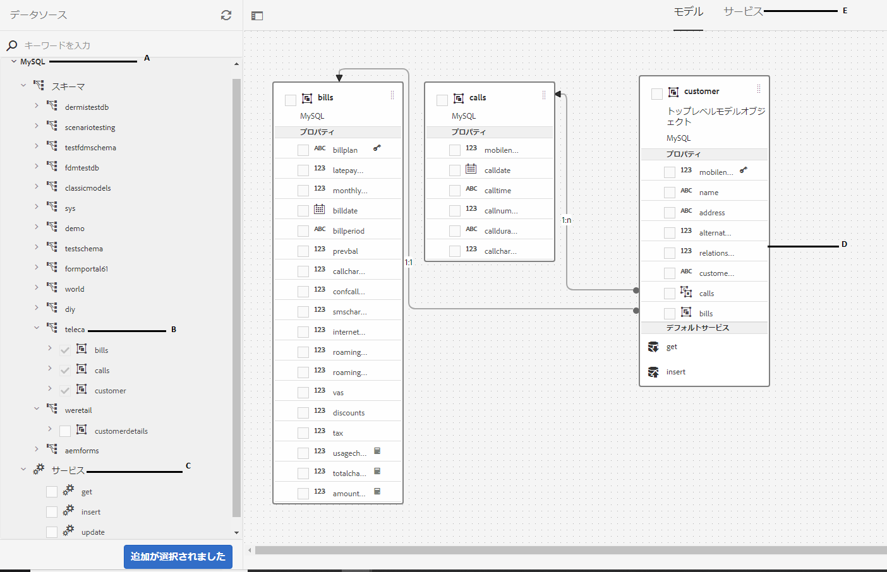

# チュートリアル：フォームデータモデルの作成 AEM Forms{#tutorial-create-form-data-model}


これは、「[最初のインタラクティブ通信の作成](/help/forms/using/create-your-first-interactive-communication.md)」シリーズを構成するチュートリアルです。チュートリアルの使用例を理解、実行、デモするために、時系列に従うことをお勧めします。

## チュートリアルについて {#about-the-tutorial}

AEM Forms のデータ統合モジュールにより、AEM ユーザープロファイル、RESTful Web サービス、SOAP ベースの Web サービス、OData サービス、リレーショナルデータベースなど、様々なバックエンドデータソースを使用してフォームデータモデルを作成することができます。フォームデータモデル内でデータモデルオブジェクトとサービスを設定し、アダプティブフォームに関連付けることができます。 アダプティブフォームのフィールドは、データモデルオブジェクトのプロパティに連結されます。 このサービスを使用すると、アダプティブフォームに事前に入力し、送信されたフォームデータをデータモデルオブジェクトに書き戻すことができます。

フォームデータの統合機能とフォームデータモデルについて詳しくは、「[AEM Forms のデータ統合機能](https://helpx.adobe.com/jp/experience-manager/6-3/forms/using/install-configure-pdf-generator.html)」を参照してください。

このチュートリアルでは、フォームデータモデルを準備、作成、設定、およびインタラクティブ通信に関連付ける手順について説明します。 このチュートリアルを完了すると、次の操作を実行できるようになります。

* [データベースの設定](../../forms/using/create-form-data-model0.md#step-set-up-the-database)
* [MySQL データベースをデータソースとして設定する](../../forms/using/create-form-data-model0.md#step-configure-mysql-database-as-data-source)
* [フォームデータモデルの作成](../../forms/using/create-form-data-model0.md#step-create-form-data-model)
* [フォームデータモデルを設定する](../../forms/using/create-form-data-model0.md#step-configure-form-data-model)
* [フォームデータモデルのテストを行う](../../forms/using/create-form-data-model0.md#step-test-form-data-model-and-services)

フォームデータモデルは以下に類似しています。



**A.** 設定済みのデータソース **B.** データソーススキーマ **C.** 利用可能なサービス **D.** データモデルオブジェクト **E.** 設定済みサービス

## 前提条件 {#prerequisites}

開始する前に、次の点を確認してください。

* MySQL データベースに、 [データベースの設定](../../forms/using/create-form-data-model0.md#step-set-up-the-database) 」セクションに入力します。
* [JDBC データベースドライバーのバンドル](https://helpx.adobe.com/jp/experience-manager/6-3/help/sites-developing/jdbc.html#bundling-the-jdbc-database-driver)の説明に従って、MySQL JDBC ドライバー用の OSGi バンドルが設定されていること

## 手順 1:データベースの設定 {#step-set-up-the-database}

インタラクティブ通信を作成するには、データベースが必要です。 このチュートリアルではデータベースを使用して、インタラクティブ通信のフォームデータモデルと永続性機能を表示します。顧客、請求および通話のテーブルを含むデータベースを設定します。以下の画像は、顧客テーブルのサンプルデータを示しています。


以下の DDL ステートメントを使用して、データベース内に **customer** というテーブルを作成します。

```sql
CREATE TABLE `customer` (
   `mobilenum` int(11) NOT NULL,
   `name` varchar(45) NOT NULL,
   `address` varchar(45) NOT NULL,
   `alternatemobilenumber` int(11) DEFAULT NULL,
   `relationshipnumber` int(11) DEFAULT NULL,
   `customerplan` varchar(45) DEFAULT NULL,
   PRIMARY KEY (`mobilenum`),
   UNIQUE KEY `mobilenum_UNIQUE` (`mobilenum`)
 ) ENGINE=InnoDB DEFAULT CHARSET=utf8
```

以下の DDL ステートメントを使用して、データベース内に **bills** というテーブルを作成します。

```sql
CREATE TABLE `bills` (
   `billplan` varchar(45) NOT NULL,
   `latepayment` decimal(4,2) NOT NULL,
   `monthlycharges` decimal(4,2) NOT NULL,
   `billdate` date NOT NULL,
   `billperiod` varchar(45) NOT NULL,
   `prevbal` decimal(4,2) NOT NULL,
   `callcharges` decimal(4,2) NOT NULL,
   `confcallcharges` decimal(4,2) NOT NULL,
   `smscharges` decimal(4,2) NOT NULL,
   `internetcharges` decimal(4,2) NOT NULL,
   `roamingnational` decimal(4,2) NOT NULL,
   `roamingintnl` decimal(4,2) NOT NULL,
   `vas` decimal(4,2) NOT NULL,
   `discounts` decimal(4,2) NOT NULL,
   `tax` decimal(4,2) NOT NULL,
   PRIMARY KEY (`billplan`)
 ) ENGINE=InnoDB DEFAULT CHARSET=utf8
```

以下の DDL ステートメントを使用して、データベース内に **calls** というテーブルを作成します。

```sql
CREATE TABLE `calls` (
   `mobilenum` int(11) DEFAULT NULL,
   `calldate` date DEFAULT NULL,
   `calltime` varchar(45) DEFAULT NULL,
   `callnumber` int(11) DEFAULT NULL,
   `callduration` varchar(45) DEFAULT NULL,
   `callcharges` decimal(4,2) DEFAULT NULL,
   `calltype` varchar(45) DEFAULT NULL
 ) ENGINE=InnoDB DEFAULT CHARSET=utf8
```

**通話** テーブルには、通話の日付、通話の時間、通話番号、通話時間、通話料金などの詳細が含まれます。**顧客** テーブルは携帯電話番号（mobilenum）フィールドにより通話テーブルとリンクしています。**顧客**&#x200B;テーブルにリストされた各携帯電話番号ごとに、**通話**&#x200B;テーブルに複数の記録があります。例えば、**1457892541** という携帯電話番号の通話の詳細を、**通話**&#x200B;テーブルを参照することで取得できます。

**請求**&#x200B;テーブルには請求日、請求期間、月額利用料、通話料金などの請求明細が含まれます。**顧客**&#x200B;テーブルは請求プランフィールドにより&#x200B;**請求**&#x200B;テーブルとリンクしています。**顧客**&#x200B;テーブルには、各顧客と関連付けられたプランがあります。**請求**&#x200B;テーブルには、既存のすべてのプランの価格の詳細が含まれます。例えば、**Sarah** のプランの詳細を顧客テーブルから取得し&#x200B;**、**&#x200B;この情報を使って請求テーブルから価格の詳細を取得することができます&#x200B;**。**

## 手順 2:MySQL データベースをデータソースとして設定する {#step-configure-mysql-database-as-data-source}

様々なタイプのデータソースを設定して、フォームデータモデルを作成できます。 このチュートリアルでは、サンプルデータが設定され、入力された MySQL データベースを設定します。 その他のサポート対象データソースとその設定方法について詳しくは、 [AEM Forms Data Integration](https://helpx.adobe.com/jp/experience-manager/6-3/forms/using/install-configure-pdf-generator.html).

MySQL データベースを設定するには、以下の手順を実行します。

1. 以下の手順により、MySQL データベース用の JDBC ドライバーを OSGi バンドルとしてインストールします。

   1. AEM Forms のオーサーインスタンスに管理者としてログインし、AEM Web コンソールバンドルに移動します。デフォルトの URL は、[https://localhost:4502/system/console/bundles](https://localhost:4502/system/console/bundles) です。
   1. **Install/Update** をタップします。「**Upload / Install Bundles**」ダイアログが表示されます。

   1. 「**Choose File**」をタップし、MySQL JDBC ドライバーの OSGi バンドルを探して選択します。**Start Bundle** と **Refresh Packages** を選択して **Install** または **Update** をタップします。Corporation の MySQL 用 JDBCOracleがアクティブであることを確認します。 ドライバーがインストールされます。

1. MySQL データベースをデータソースとして設定する：

   1. AEM Web コンソール（[https://localhost:4502/system/console/configMgr](https://localhost:4502/system/console/configMgr)）に移動します。
   1. 「**Apache Sling Connection Pooled DataSource**」という設定を探し、その設定をタップして編集モードで開きます。
   1. 設定ダイアログで、次の詳細を指定します。

      * **データソース名：** 任意の名前を指定できます。 例えば、 **MySQL** などを指定します。

      * **DataSource サービスのプロパティ名**:DataSource 名を含むサービスプロパティの名前を指定します。 データソースインスタンスを OSGi サービスとして登録する際に指定されます。 例： **datasource.name**.

      * **JDBC ドライバークラス**:JDBC ドライバーの Java クラス名を指定します。 MySQL データベースの場合は、**com.mysql.jdbc.Driver** と指定します。

      * **JDBC connection URI**：データベースの接続 URL を指定します。ポート 3306 とスキーマ teleca 上で稼働する MySQL データベースの場合、URL は `jdbc:mysql://'server':3306/teleca?autoReconnect=true&useUnicode=true&characterEncoding=utf-8` です。
      * **Username**：データベースのユーザー名を指定します。データベースとの接続を確立するには、JDBC ドライバーを有効にする必要があります。
      * **Password**：データベースのパスワードを指定します。データベースとの接続を確立するには、JDBC ドライバーを有効にする必要があります。
      * **Test on Borrow：** は **Test on Borrow** オプションを有効にします。

      * **Test on Return：** は **Test on Return** オプションを有効にします。

      * **検証クエリ：** プールからの接続を検証する SQL SELECT クエリを指定します。 クエリは、少なくとも 1 つの行を返す必要があります。 例：**select &#42; from customer**。

      * **Transaction Isolation**：このオプションの値を「**READ_COMMITTED**」に設定します。
   上記以外のプロパティはデフォルト[値](https://tomcat.apache.org/tomcat-7.0-doc/jdbc-pool.html)のままにして **Save** をタップします。

   以下のような設定が作成されます。

   

## 手順 3：フォームデータモデルを作成する {#step-create-form-data-model}

AEM Forms には、設定済みデータソースを使用して[フォームデータモデルを作成](https://helpx.adobe.com/jp/experience-manager/6-3/forms/using/data-integration.html#main-pars_header_1524967585)するための直感的なユーザーインターフェイスが用意されています。1 つのフォームデータモデル内で複数のデータソースを使用することができます。このチュートリアルの使用例では、MySQL をデータソースとして使用します。

フォームデータモデルを作成するには、以下の手順を実行します。

1. AEM オーサーインスタンスで、**フォーム**／**データ統合**&#x200B;に移動します。
1. **作成**／**フォームデータモデル**&#x200B;の順にタップします。
1. フォームデータモデル作成ウィザードで、フォームデータモデルの&#x200B;**名前**&#x200B;を指定します。例えば **FDM_Create_First_IC** などと指定します。「**次へ**」をタップします。
1. データソース選択画面に、すべての設定済みデータソースが一覧表示されます。**MySQL** データソースを選択して&#x200B;**作成**&#x200B;をタップします。

   

1. 「**完了**」をクリックします。**FDM_Create_First_IC** というフォームデータモデルが作成されます。

## 手順 4:フォームデータモデルを設定する {#step-configure-form-data-model}

フォームデータモデルの設定には、以下が含まれます。

* [データモデルオブジェクトとサービスの追加](#add-data-model-objects-and-services)
* [データモデルオブジェクト用の計算済み子プロパティの作成](#create-computed-child-properties-for-data-model-object)
* [データモデルオブジェクト間の関連付けの追加](#add-associations-between-data-model-objects)
* [データモデルオブジェクトプロパティの編集](#edit-data-model-object-properties)
* [データモデルオブジェクト用サービスの設定](#configure-services)

### データモデルオブジェクトとサービスの追加 {#add-data-model-objects-and-services}

1. AEM オーサーインスタンスで、**フォーム**／**データ統合**&#x200B;に移動します。デフォルトの URL は、[https://localhost:4502/aem/forms.html/content/dam/formsanddocuments-fdm](https://localhost:4502/aem/forms.html/content/dam/formsanddocuments-fdm) です。
1. 前の手順で作成した **FDM_Create_First_IC** というフォームデータモデルが表示されます。これを選択し、「**編集**」をタップします。

   選択されたデータソース **MySQL** が&#x200B;**データソース**&#x200B;ペインに表示されます。

   

1. **MySQL** データソースツリーを展開します。**teleca** スキーマで、以下のデータモデルオブジェクトとサービスを選択します。

   * **データモデルオブジェクト**:

      * 手形
      * 呼び出し
      * 顧客
   * **サービス:**

      * get
      * 更新

   タップ **選択項目を追加** 選択したデータモデルオブジェクトとサービスをフォームデータモデルに追加する場合。

   

   請求、通話および顧客データモデルのオブジェクトが、 **モデル** タブをクリックします。 get サービスと update サービスが **サービス** タブをクリックします。

   

### データモデルオブジェクトの計算済み子プロパティを作成する {#create-computed-child-properties-for-data-model-object}

計算済みプロパティは、ルールまたは式に基づいて値が計算されるプロパティです。 ルールを使用して、計算済みプロパティの値をリテラル文字列、数値、数式の結果、またはフォームデータモデル内の別のプロパティの値に設定できます。

ユースケースに基づいて、 **usagecharges** 内の子計算済みプロパティ **手形** 次の数式を使用したデータモデルオブジェクト：

* 利用料金 = 通話料金 + 会議通話料金 + SMS 料金 + 携帯インターネット料金 + 国内ローミング料金 + 国際ローミング料金 + VAS（これらのすべてのプロパティは bills データモデルオブジェクトに含まれます）**usagecharges** の計算済み子プロパティについて詳しくは、[インタラクティブ通信の計画](/help/forms/using/planning-interactive-communications.md)を参照してください。

請求データモデルオブジェクト用の計算済み子プロパティを作成するには、次の手順を実行します。

1. **請求**&#x200B;データモデルオブジェクト上部のチェックボックスを選択して、「**子プロパティを作成**」をタップします。
1. 内 **子プロパティを作成** ペイン：

   1. 入力 **usagecharges** を子プロパティの名前として使用します。
   1. 有効にする **計算済み**.
   1. タイプとして「**フロート**」を選択し、「**完了**」をタップし、子プロパティを&#x200B;**請求**&#x200B;データモデルオブジェクトに追加します。

   

1. 「**ルールを編集**」をタップしてルールエディターを開きます。
1. 「**作成**」をタップします。「**Set Value**」ルールウィンドウが開きます。
1. オプション選択ドロップダウンで、「**数式**」を選択します。

   

1. 数式の最初のオブジェクトとして「**callcharges**」を選択し、2 番目のオブジェクトとして「**confcallcharges**」を選択します。演算子として「**プラス**」を選択します。数式内でタップし、 **式を拡張** 追加する **smscharges**, **インターネット料金**, **国民の**, **roamingintnl**、および **輸管** オブジェクトを式に追加します。

   次の画像は、ルールエディターでの数式を示しています。

   

1. 「**完了**」をタップします。ルールエディター内でルールが作成されます。
1. 「**閉じる**」をタップして、ルールエディターウィンドウを閉じます。

### データモデルオブジェクト間に関連付けを追加する {#add-associations-between-data-model-objects}

データモデルオブジェクトを定義したら、それらのオブジェクト間に関連付けを作成できます。 関連付けは、1 対 1 または 1 対多にすることができます。 例えば、1 人の従業員に複数の扶養家族を関連付けることができます。 これを、1 対多の関連付けといいます。関連するデータモデルオブジェクトを接続するライン上では、「1:n」として表示されます。それに対して、特定の従業員 ID で一意の従業員名が返される場合などは、1 対 1 の関連付けになります。

データソース内の関連データモデルオブジェクトをフォームデータモデルに追加した場合、それらの関連付けは維持され、矢印の線で接続された状態で表示されます。

このユースケースに基づいて、データモデルオブジェクト間に次の関連付けを作成します。

| 関連団体 | データモデルオブジェクト |
|---|---|
| 1:n | customer:calls （1 ヶ月の請求で複数の呼び出しを 1 人の顧客に関連付けることができます） |
| 1:1 | 顧客：請求（特定の月の 1 つの請求が顧客に関連付けられます） |

データモデルオブジェクト間に関連付けを作成するには、次の手順を実行します。

1. **顧客**&#x200B;データモデルオブジェクト上部のチェックボックスを選択して「**関連付けを追加**」をタップします。**関連付けを追加**&#x200B;プロパティペインが表示されます。
1. 内 **関連付けを追加** ペイン：

   * 関連付けのタイトルを指定します。 これはオプションのフィールドです。
   * 選択 **1 対多** から **タイプ** 」ドロップダウンリストから選択できます。

   * 選択 **呼び出し** から **モデルオブジェクト** 」ドロップダウンリストから選択できます。

   * 「**サービス**」ドロップダウンリストから **get** を選択します。

   * 「**追加**」をタップして、プロパティを使用して&#x200B;**顧客**&#x200B;データモデルオブジェクトを&#x200B;**通話**&#x200B;データモデルオブジェクトにリンクします。ユースケースに基づいて、通話データモデルオブジェクトは顧客データモデルオブジェクトの携帯電話番号プロパティにリンクされている必要があります。**引数を追加**&#x200B;ダイアログボックスが開きます。

   

1. **引数を追加**&#x200B;ダイアログボックスで、

   * 「**名前**」ドロップダウンリストから「**mobilenum**」を選択します。携帯電話プロパティは、顧客および通話データモデルオブジェクトで利用できる共通プロパティです。その結果、プロパティは顧客と通話データモデルオブジェクト間の関連付けを作成するために使用されます。顧客データモデルオブジェクトに用意された各携帯電話番号ごとに、通話テーブルに複数の記録を参照できます。

   * 引数のタイトルと説明を任意で指定します。
   * 選択 **顧客** から **連結先** 」ドロップダウンリストから選択できます。

   * 「**連結値**」ドロップダウンリストから「**mobilenum**」を選択します。

   * 「**追加**」をタップします。

   

   mobilenum プロパティが&#x200B;**引数**&#x200B;セクションに表示されます。

   

1. 「**完了**」をタップすると、顧客と通話データモデルオブジェクト間で 1:n の関連付けが作成されます。

   顧客および通話データモデルオブジェクト間で関連付けを作成したら、顧客と通話データモデルオブジェクト間で 1:1 の関連付けを作成します。

1. **顧客**&#x200B;データモデルオブジェクト上部のチェックボックスを選択して「**関連付けを追加**」をタップします。**関連付けを追加**&#x200B;プロパティペインが表示されます。
1. 内 **関連付けを追加** ペイン：

   * 関連付けのタイトルを指定します。 これはオプションのフィールドです。
   * 「**タイプ**」ドロップダウンリストから「**1 対 1**」を選択します。

   * 「**モデルオブジェクト**」ドロップダウンリストから「**請求**」を選択します。

   * 「**サービス**」ドロップダウンリストから **get** を選択します。**billplan** プロパティは請求テーブルのプライマリキーであり、「**引数**」セクションにすでに用意されています。
請求および顧客データモデルオブジェクトは、それぞれbillplan（請求）および customerplan（顧客）プロパティを使ってリンクされています。これらのプロパティ間にバインディングを作成して、MySQL データベースで使用可能な顧客のプランの詳細を取得します。

   * 選択 **顧客** から **連結先** 」ドロップダウンリストから選択できます。

   * 選択 **customerplan** から **連結値** 」ドロップダウンリストから選択できます。

   * 「**完了**」をタップして billplan と customerplan プロパティの間で連結を作成します。

   

   以下の画像は、データモデルオブジェクト間の関連付けと、関連付けの作成に使用されているプロパティを示します。

   

### データモデルオブジェクトのプロパティを編集 {#edit-data-model-object-properties}

顧客と他のデータモデルオブジェクトとの間に関連付けを作成した後、顧客プロパティを編集し、データモデルオブジェクトから取得されるデータに基づいてプロパティを定義します。 ユースケースに基づいて、モバイル番号は顧客データモデルオブジェクトからデータを取得するプロパティとして使用されます。

1. **顧客**&#x200B;データモデルオブジェクト上部のチェックボックスを選択して「**プロパティを編集**」をタップします。**プロパティを編集**&#x200B;ペインが開きます。
1. 指定 **顧客** を **トップレベルモデルオブジェクト**.
1. 選択 **get** から **読み取りサービス** 」ドロップダウンリストから選択できます。
1. **引数**&#x200B;セクションで、

   * 選択 **要求属性** から **連結先** 」ドロップダウンリストから選択できます。

   * 指定 **mobilenum** を連結値として使用します。

1. 選択 **更新** から **書き込み** サービスドロップダウンリスト。
1. **引数**&#x200B;セクションで、

   * **mobilenum** プロパティとして、「**連結先**」ドロップダウンリストから「**顧客**」を選択します。

   * 「**連結値**」ドロップダウンリストから「**mobilenum**」を選択します。

1. 「**完了**」をタップして、プロパティを保存します。

   

1. **通話**&#x200B;データモデルオブジェクト上部のチェックボックスを選択して「**プロパティを編集**」をタップします。**プロパティを編集**&#x200B;ペインが開きます。
1. **トップレベルモデルオブジェクト**&#x200B;を、**通話**&#x200B;データモデルオブジェクトに対して無効にします。
1. 「**完了**」をタップします。

   手順 8 ～ 10 を繰り返して、のプロパティを設定します。 **手形** データモデルオブジェクト。

### サービスの設定 {#configure-services}

1. 「**サービス**」タブに移動します。
1. **get** サービスを選択して「**プロパティの編集**」をタップします。**プロパティを編集**&#x200B;ペインが開きます。
1. 内 **プロパティを編集** ペイン：

   * オプションのタイトルと説明を入力します。
   * 選択 **顧客** から **出力モデルオブジェクト** 」ドロップダウンリストから選択できます。

   * 「**完了**」をタップして、プロパティを保存します。

   

1. **update** サービスを選択して「**プロパティの編集**」をタップします。**プロパティを編集**&#x200B;ペインが開きます。
1. 内 **プロパティを編集** ペイン：

   * オプションのタイトルと説明を入力します。
   * 「**入力モデルオブジェクト**」ドロップダウンリストから「**顧客**」を選択します。

   * 「**完了**」をタップします。
   * 「**保存**」をタップして、フォームデータモデルを保存します。

   

## 手順 5：フォームデータモデルとサービスのテストを実行する {#step-test-form-data-model-and-services}

データモデルオブジェクトとサービスをテストすることにより、フォームデータモデルが正しく設定されているかどうかを確認することができます。

テストを実行するには、以下の手順を実行します。

1. **モデル**&#x200B;タブに移動し、**顧客**&#x200B;データモデルオブジェクトを選択して、**モデルオブジェクトをテスト**&#x200B;をタップします。
1. **テストフォームデータモデル**&#x200B;ウィンドウの&#x200B;**モデル / サービスを選択**&#x200B;ドロップダウンリストから&#x200B;**モデルオブジェクトを読み込み**&#x200B;を選択します。
1. **入力**&#x200B;セクションで、設定済み MySQL データベース内の **mobilenum** プロパティを指定して&#x200B;**テスト**&#x200B;をタップします。

   指定した mobilenum プロパティに関連付けられている顧客の詳細情報がデータベースから取得され、以下のように「出力」セクションに表示されます。ダイアログボックスを閉じます。

   

1. 「**サービス**」タブに移動します。
1. **get** サービスを選択して&#x200B;**サービスをテスト**&#x200B;をタップします。
1. **入力**&#x200B;セクションで、設定済み MySQL データベース内の **mobilenum** プロパティを指定して&#x200B;**テスト**&#x200B;をタップします。

   指定した mobilenum プロパティに関連付けられている顧客の詳細情報がデータベースから取得され、以下のように「出力」セクションに表示されます。ダイアログボックスを閉じます。

   

### サンプルデータを編集して保存する {#edit-and-save-sample-data}

フォームデータモデルエディターを使用すると、フォームデータモデル内の計算済みプロパティを含む、すべてのデータモデルオブジェクトプロパティのサンプルデータを生成できます。 これは、各プロパティに設定されたデータタイプに準拠するランダムな値のセットです。 また、データを編集および保存することもできます。これは、サンプルデータを再生成しても保持されます。

サンプルデータを生成、編集、保存するには、以下の手順を実行します。

1. フォームデータモデルページで&#x200B;**サンプルデータを編集**&#x200B;をタップします。サンプルデータが生成され、サンプルデータ編集ウィンドウに表示されます。

   

1. 「**サンプルデータを編集**」ウィンドウでデータを編集して「**保存**」をタップします。ウィンドウを閉じます。
