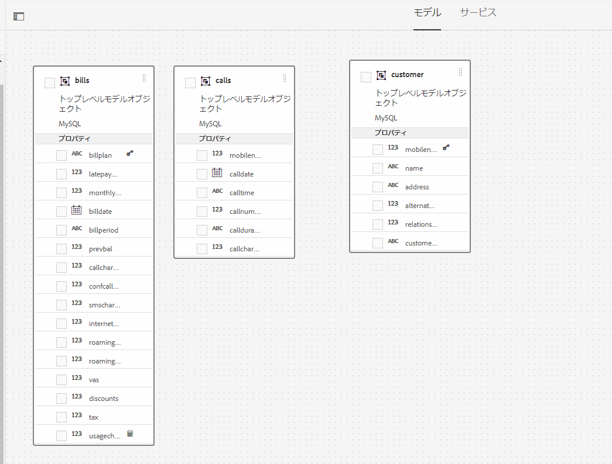
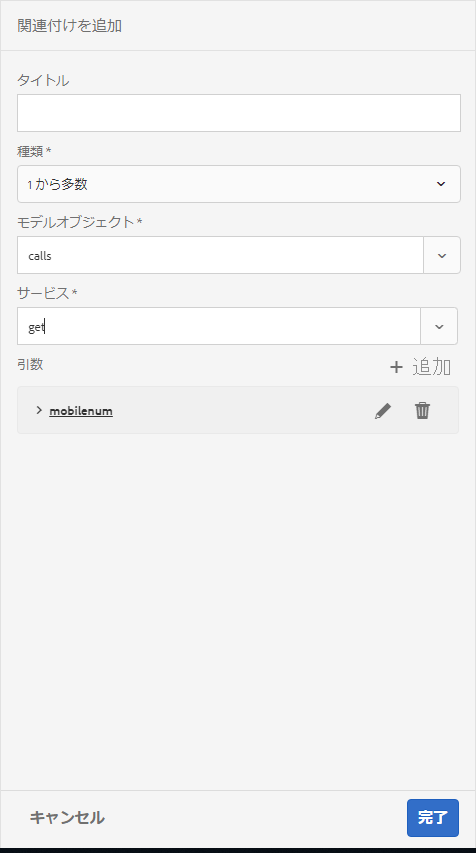

# チュートリアル：フォームデータモデルの作成{#tutorial-create-form-data-model}


This tutorial is a step in the [Create your first Interactive Communication](/help/forms/using/create-your-first-interactive-communication.md) series. チュートリアル内のユースケースを理解して実際に操作できるように、このシリーズのチュートリアルを最初から順に学習することをお勧めします。

## このチュートリアルについて {#about-the-tutorial}

AEM Formsデータ統合モジュールを使用すると、AEMユーザープロファイル、RESTful Webサービス、SOAPベースのWebサービス、ODataサービス、リレーショナルデータベースなど、異なるバックエンドデータソースからフォームデータモデルを作成できます。 フォームデータモデル内でデータモデルオブジェクトとサービスを設定し、そのフォームデータモデルをアダプティブフォームに関連付けることができます。アダプティブフォームのフィールドは、データモデルオブジェクトのプロパティに連結されます。フォームデータモデル内のサービスを使用して、アダプティブフォームに事前にデータを取り込み、送信されたフォームデータをデータモデルオブジェクトに書き込むことができます。

フォームデータの統合機能とフォームデータモデルについて詳しくは、「[AEM Forms のデータ統合機能](https://helpx.adobe.com/experience-manager/6-3/forms/using/data-integration.html)」を参照してください。

このチュートリアルでは、フォームデータモデルの準備、作成、設定を行い、そのフォームデータモデルをインタラクティブ通信に関連付けるための手順について、順を追って説明します。このチュートリアルを完了すると、次の操作を実行できるようになります。

* [データベースの設定](../../forms/using/create-form-data-model0.md#step-set-up-the-database)
* [MySQL データベースをデータソースとして設定する](../../forms/using/create-form-data-model0.md#step-configure-mysql-database-as-data-source)
* [フォームデータモデルの作成](../../forms/using/create-form-data-model0.md#step-create-form-data-model)
* [フォームデータモデルを設定する](../../forms/using/create-form-data-model0.md#step-configure-form-data-model)
* [フォームデータモデルのテストを行う](../../forms/using/create-form-data-model0.md#step-test-form-data-model-and-services)

フォームデータモデルは以下に類似しています。


**A.** 設定済みのデータソ **ースB。** データソースのスキーマ **C.** 利用可能なサー **ビスD.** データモデルのオブジェ **クトE.** 設定済みのサービス

## 前提条件 {#prerequisites}

作業を開始する前に、以下の条件が満たされているかどうかを確認してください。

* 「[データベースを設定する](../../forms/using/create-form-data-model0.md#step-set-up-the-database)」セクションの記載に従って MySQL データベースにサンプルデータが取り込まれていること
* OSGi bundle for MySQL JDBC driver as explained in [Bundling the JDBC Database Driver](https://helpx.adobe.com/experience-manager/6-3/help/sites-developing/jdbc.html#bundling-the-jdbc-database-driver)

## 手順 1：データベースの設定 {#step-set-up-the-database}

インタラクティブ通信の作成にはデータベースが不可欠です。このチュートリアルではデータベースを使用して、インタラクティブ通信のフォームデータモデルと永続性機能を表示します。顧客、請求書、および呼び出し表を含むデータベースを設定します。
以下の画像は、顧客テーブルのサンプルデータを示しています。


次のDDL文を使用して、データベースに顧客 **表を** 作成します。

```sql
CREATE TABLE `customer` (
   `mobilenum` int(11) NOT NULL,
   `name` varchar(45) NOT NULL,
   `address` varchar(45) NOT NULL,
   `alternatemobilenumber` int(11) DEFAULT NULL,
   `relationshipnumber` int(11) DEFAULT NULL,
   `customerplan` varchar(45) DEFAULT NULL,
   PRIMARY KEY (`mobilenum`),
   UNIQUE KEY `mobilenum_UNIQUE` (`mobilenum`)
 ) ENGINE=InnoDB DEFAULT CHARSET=utf8
```

次のDDL文を使用して、データベースに **bills** 表を作成します。

```sql
CREATE TABLE `bills` (
   `billplan` varchar(45) NOT NULL,
   `latepayment` decimal(4,2) NOT NULL,
   `monthlycharges` decimal(4,2) NOT NULL,
   `billdate` date NOT NULL,
   `billperiod` varchar(45) NOT NULL,
   `prevbal` decimal(4,2) NOT NULL,
   `callcharges` decimal(4,2) NOT NULL,
   `confcallcharges` decimal(4,2) NOT NULL,
   `smscharges` decimal(4,2) NOT NULL,
   `internetcharges` decimal(4,2) NOT NULL,
   `roamingnational` decimal(4,2) NOT NULL,
   `roamingintnl` decimal(4,2) NOT NULL,
   `vas` decimal(4,2) NOT NULL,
   `discounts` decimal(4,2) NOT NULL,
   `tax` decimal(4,2) NOT NULL,
   PRIMARY KEY (`billplan`)
 ) ENGINE=InnoDB DEFAULT CHARSET=utf8
```

次のDDL文を使用して、データベースに呼び出し **表を** 作成します。

```sql
CREATE TABLE `calls` (
   `mobilenum` int(11) DEFAULT NULL,
   `calldate` date DEFAULT NULL,
   `calltime` varchar(45) DEFAULT NULL,
   `callnumber` int(11) DEFAULT NULL,
   `callduration` varchar(45) DEFAULT NULL,
   `callcharges` decimal(4,2) DEFAULT NULL,
   `calltype` varchar(45) DEFAULT NULL
 ) ENGINE=InnoDB DEFAULT CHARSET=utf8
```

The **calls** table includes the call details such as call date, call time, call number, call duration, and call charges. The **customer** table is linked to the calls table using the Mobile Number (mobilenum) field. For each mobile number listed in the **customer** table, there are multiple records in the **calls** table. For example, you can retrieve the call details for the **1457892541** mobile number by referring to the **calls** table.

The **bills** table includes the bill details such as bill date, bill period, monthly charges, and call charges. The **customer** table is linked to the **bills** table using the Bill Plan field. There is a plan associated to each customer in the **customer** table. The **bills** table includes the pricing details for all the existing plans. 例えば、**Sarah** のプランの詳細を顧客テーブルから取得し、この情報を使って請求テーブルから価格の詳細を取得することができます。********

## 手順 2：MySQL データベースをデータソースとして設定する {#step-configure-mysql-database-as-data-source}

各種のデータソースを設定して、フォームデータモデルを作成することができます。このチュートリアルでは、サンプルデータが取り込まれた MySQL データベースの設定を行います。サポートされている他のデータソースとその設定方法については、「[AEM Forms のデータ統合機能](https://helpx.adobe.com/experience-manager/6-3/forms/using/data-integration.html)」を参照してください。

MySQL データベースを設定するには、以下の手順を実行します。

1. MySQLデータベース用のJDBCドライバーをOSGiバンドルとしてインストールします。

   1. AEM Forms のオーサーインスタンスに管理者としてログインし、AEM Web コンソールバンドルに移動します。The default URL is [https://localhost:4502/system/console/bundles](https://localhost:4502/system/console/bundles).
   1. Tap **Install/Update**. 「**Upload / Install Bundles**」ダイアログが表示されます。

   1. 「**Choose File**」をタップし、MySQL JDBC ドライバーの OSGi バンドルを探して選択します。Select **Start Bundle** and **Refresh Packages**, and tap **Install** or **Update**. Oracle が提供する MySQL の JDBC ドライバーがアクティブになっていることを確認します。このドライバーは、既にインストールされています。

1. 以下の手順により、MySQL データベースをデータソースとして設定します。

   1. Go to AEM web console at [https://localhost:4502/system/console/configMgr](https://localhost:4502/system/console/configMgr).
   1. 「**Apache Sling Connection Pooled DataSource**」という設定を探し、その設定をタップして編集モードで開きます。
   1. 設定ダイアログで、以下の詳細情報を指定します。

      * **Datasource name**：任意のデータソース名を指定します。For example, specify **MySQL**.

      * **DataSource service property name**：データソース名を保管するサービスプロパティの名前を指定します。この名前は、データソースインスタンスを OSGi サービスとして登録する際に指定されます。例えば、「**datasource.name**」などを指定します。

      * **JDBC driver class**：JDBC ドライバーの Java クラス名を指定します。For MySQL database, specify **com.mysql.jdbc.Driver**.

      * **JDBC connection URI**：データベースの接続 URL を指定します。For MySQL database running on port 3306 and schema teleca, the URL is: `jdbc:mysql://'server':3306/teleca?autoReconnect=true&useUnicode=true&characterEncoding=utf-8`
      * **Username**：データベースのユーザー名を指定します。データベースとの接続を確立するには、JDBC ドライバーを有効にする必要があります。
      * **Password**：データベースのパスワードを指定します。データベースとの接続を確立するには、JDBC ドライバーを有効にする必要があります。
      * **借用時のテスト：** [借用時にテ **スト]オプションを有効** にします。

      * **リターン時のテスト：** 「リターン時にテ **スト」オプションを有効** にします。

      * **Validation Query**：プールからの接続状態を確認するための SQL SELECT クエリを指定します。このクエリでは、1 行以上の行が返される必要があります。For example, **select * from customer**.

      * **Transaction Isolation**：このオプションの値を「**READ_COMMITTED**」に設定します。
   Leave other properties with default [values](https://tomcat.apache.org/tomcat-7.0-doc/jdbc-pool.html) and tap **Save**.

   以下のような設定が作成されます。

   

## 手順 3：フォームデータモデルを作成する {#step-create-form-data-model}

AEM Forms provide an intuitive user interface to [create a form data mode](https://helpx.adobe.com/experience-manager/6-3/forms/using/data-integration.html#main-pars_header_1524967585)l from configured data sources. 1 つのフォームデータモデル内で複数のデータソースを使用することができます。本チュートリアルのユースケースでは、MySQL をデータソースとして使用します。

フォームデータモデルを作成するには、以下の手順を実行します。

1. In AEM author instance, navigate to **Forms** > **Data Integrations**.
1. Tap **Create** > **Form Data Model**.
1. In the Create Form Data Model wizard, specify a **name** for the form data model. For example, **FDM_Create_First_IC**. 「**次へ**」をタップします。
1. データソース選択画面に、すべての設定済みデータソースが一覧表示されます。Select **MySQL** data source and tap **Create**.

   

1. 「**完了**」をクリックします。**FDM_Create_First_ICフォーム・データ・モデル** が作成されます。

## 手順 4：フォームデータモデルを設定する {#step-configure-form-data-model}

フォームデータモデルの設定には以下が含まれます。

* [データモデルオブジェクトとサービスの追加](#add-data-model-objects-and-services)
* [データモデルオブジェクト用の計算済み子プロパティの作成](#create-computed-child-properties-for-data-model-object)
* [データモデルオブジェクト間の関連付けの追加](#add-associations-between-data-model-objects)
* [データモデルオブジェクトプロパティの編集](#edit-data-model-object-properties)
* [データモデルオブジェクト用サービスの設定](#configure-services)

### データモデルオブジェクトとサービスの追加 {#add-data-model-objects-and-services}

1. On AEM author instance, navigate to **Forms** > **Data Integrations**. The default URL is [https://localhost:4502/aem/forms.html/content/dam/formsanddocuments-fdm](https://localhost:4502/aem/forms.html/content/dam/formsanddocuments-fdm).
1. The **FDM_Create_First_IC** form data model you created earlier is listed here. これを選択し、「**編集**」をタップします。

   The selected data source **MySQL** is displayed in the **Data Sources** pane.

   

1. **MySQL** データソースツリーを展開します。Select the following data model objects and services from **teleca** schema:

   * **データモデルオブジェクト**:

      * 請求
      * 通話
      * 顧客
   * **Services:**

      * get
      * 更新
   「**選択項目を追加**」をタップして、選択したデータモデルオブジェクトとサービスをフォームデータモデルに追加します。

   

   請求、通話および顧客のデータモデルオブジェクトは、「**モデル**」タブの右側のペインに表示されます。get サービスと update サービスは、「**サービス**」タブに表示されます。

   

### データモデルオブジェクト用の計算済み子プロパティの作成 {#create-computed-child-properties-for-data-model-object}

計算済みプロパティとは、ルールまたは式に基づいて値が計算されるプロパティのことです。ルールを使用して、計算済みプロパティの値を、リテラル文字列、数値、数式の計算結果、フォームデータモデル内の別のプロパティの値に設定することができます。

ユースケースに基づき、以下の数式を使って&#x200B;**請求**&#x200B;データモデルオブジェクトの **usagecharges** 計算済み子プロパティを作成します。

* usage charges = call charges + conference call charges + SMS charges + mobile internet charges + roaming national + roaming international + VAS (all these properties exist in the bills data model object)
For more information on the **usagecharges** child computed property, see [Plan the Interactive Communication](/help/forms/using/planning-interactive-communications.md).

請求データモデルオブジェクト用の計算済み子プロパティを作成するには、次の手順を実行します。

1. Select the check box at the top of the **bills** data model object to select it and tap **Create Child Property**.
1. **子プロパティを作成**&#x200B;ペインで、

   1. 子プロパティの名前として **usagecharges** を入力します。
   1. 「**計算済み**」を有効にします。
   1. Select **Float** as the type and tap **Done** to add the child property to the **bills** data model object.
   

1. Tap **Edit Rule** to open the Rule Editor.
1. 「**作成**」をタップします。The **Set Value** rule window opens.
1. オプション選択ドロップダウンで、「**数式**」を選択します。

   

1. In the mathematical expression, select **callcharges** and **confcallcharges** as first and second objects, respectively. 演算子として「**プラス**」を選択します。数式内の領域をタップして「**拡張式**」をタップし、**smscharges**、**internetcharges**、**roamingnational**、**roamingintnl**、および **vas** を数式のオブジェクトに追加します。

   次の画像はルールエディター内の数式を示しています。

   

1. 「**Done**」をタップします。ルールがルールエディターで作成されます。
1. Tap **Close** to close the Rule Editor window.

### データモデルオブジェクト間の関連付けの追加 {#add-associations-between-data-model-objects}

データモデルオブジェクトが定義されたら、オブジェクト間の関連付けを作成できます。この関連付けは、1 対 1 の場合もあれば、1 対多の場合もあります。例えば、1 人の従業員に対して複数の扶養家族を関連付けることができます。これを、1 対多の関連付けといいます。関連するデータモデルオブジェクトを接続するライン上では、「1:n」として表示されます。それに対して、特定の従業員 ID で一意の従業員名が返される場合などは、1 対 1 の関連付けになります。

データソース内の関連するデータモデルオブジェクトをフォームデータモデルに追加すると、その関連付けは保持され、矢印で結ばれた状態で表示されます。

ユースケースに基づき、データモデルオブジェクト間で以下の関連付けを作成します。

| 関連付け | データモデルオブジェクト |
|---|---|
| 1:n | customer:calls（月々の請求書で、1 人の顧客と複数の通話を関連付けられます） |
| 1:1 | customer:bills（特定の月の請求書で、1 つの請求を 1 人の顧客と関連付けます） |

データモデルオブジェクト間で関連性を作成するには、以下の手順を実行します。

1. Select the check box at the top of the **customer** data model object to select it and tap **Add Association**. The **Add Association** property pane opens.
1. **関連付けを追加**&#x200B;ペインで、以下の操作を実行します。

   * 関連付けのタイトルを入力します。これはオプションのフィールドです。
   * 「**タイプ**」ドロップダウンリストから「**1 対多**」を選択します。

   * 「**モデルオブジェクト**」ドロップダウンリストから **calls** を選択します。

   * 「**サービス**」ドロップダウンリストから **get** を選択します。

   * Tap **Add** to link the **customer** data model object to **calls** data model object using a property. ユースケースに基づいて、通話データモデルオブジェクトは顧客データモデルオブジェクトの携帯電話番号プロパティにリンクされている必要があります。The **Add Argument** dialog box opens.
   

1. **引数を追加**&#x200B;ダイアログボックスで、

   * 「**名前**」ドロップダウンリストから「**mobilenum**」を選択します。携帯電話プロパティは、顧客および通話データモデルオブジェクトで利用できる共通プロパティです。その結果、プロパティは顧客と通話データモデルオブジェクト間の関連付けを作成するために使用されます。顧客データモデルオブジェクトに用意された各携帯電話番号ごとに、通話テーブルに複数の記録を参照できます。

   * 引数の任意のタイトルと説明を指定する。
   * 「**連結先**」ドロップダウンリストから「**customer**」を選択します。

   * 「**連結値**」ドロップダウンリストから「**mobilenum**」を選択します。

   * 「**追加**」をタップします。
   

   mobilenum プロパティが&#x200B;**引数**&#x200B;セクションに表示されます。

   

1. Tap **Done** to create a 1:n association between customer and calls data model objects.

   顧客および通話データモデルオブジェクト間で関連付けを作成したら、顧客と通話データモデルオブジェクト間で 1:1 の関連付けを作成します。

1. Select the check box at the top of the **customer** data model object to select it and tap **Add Association**. The **Add Association** property pane opens.
1. **関連付けを追加**&#x200B;ペインで、以下の操作を実行します。

   * 関連付けのタイトルを入力します。これはオプションのフィールドです。
   * Select **One to One** from the **Type** drop-down list.

   * Select **bills** from the **Model Object** drop-down list.

   * 「**サービス**」ドロップダウンリストから **get** を選択します。The **billplan** property, which is the primary key for the bills table, is already available in the **Arguments** section.
請求および顧客データモデルオブジェクトは、それぞれbillplan（請求）および customerplan（顧客）プロパティを使ってリンクされています。これらのプロパティ間で連結を作成し、MySQL データベースに含まれるあらゆる顧客の計画の詳細を取得します。

   * 「**連結先**」ドロップダウンリストから「**customer**」を選択します。

   * 「**連結値**」ドロップダウンリストから「**customerplan**」を選択します。

   * Tap **Done** to create a binding between the billplan and customerplan properties.
   

   以下の画像は、データモデルオブジェクト間の関連付けと、関連付けの作成に使用されているプロパティを示します。

   

### データモデルオブジェクトプロパティの編集 {#edit-data-model-object-properties}

顧客とほかのデータモデルオブジェクト間で関連付けを作成後、顧客プロパティを編集し、データモデルオブジェクトから取得されたデータに基づいてプロパティを定義します。ユースケースに基づいて、携帯電話番号は顧客データモデルオブジェクトからデータを取得するためのプロパティとして使用されます。

1. Select the check box at the top of the **customer** data model object to select it and tap **Edit Properties**. **プロパティを編集**&#x200B;ペインが開きます。
1. **顧客**&#x200B;を&#x200B;**トップレベルモデルオブジェクト**&#x200B;として指定します。
1. 「**読み取りサービス**」ドロップダウンで「**get**」を選択します。
1. **引数**&#x200B;セクションで、

   * 「**連結先**」ドロップダウンリストから「**属性を要求**」を選択します。

   * **mobilenum** を連結値として指定します。

1. **書き込み**&#x200B;サービスのドロップダウンリストから「**更新**」を選択します。
1. **引数**&#x200B;セクションで、

   * **mobilenum** プロパティとして、「**連結先**」ドロップダウンリストから「**顧客**」を選択します。

   * 「**連結値**」ドロップダウンリストから「**mobilenum**」を選択します。

1. Tap **Done** to save the properties.

   

1. Select the check box at the top of the **calls** data model object to select it and tap **Edit Properties**. **プロパティを編集**&#x200B;ペインが開きます。
1. **トップレベルモデルオブジェクト**&#x200B;を、**通話**&#x200B;データモデルオブジェクトに対して無効にします。
1. 「**Done**」をタップします。

   手順 8～10 を繰り返し、**請求**&#x200B;データモデルオブジェクトのプロパティを設定します。

### サービスの設定 {#configure-services}

1. 「**サービス**」タブに移動します。
1. Select the **get** service and tap **Edit Properties**. **プロパティを編集**&#x200B;ペインが開きます。
1. **プロパティを編集**&#x200B;ペインで、

   * 任意のタイトルと説明を入力します。
   * 「**出力モデルオブジェクト**」ドロップダウンリストから「**顧客**」を選択します。

   * Tap **Done** to save the properties.
   

1. Select the **update** service and tap **Edit Properties**. **プロパティを編集**&#x200B;ペインが開きます。
1. **プロパティを編集**&#x200B;ペインで、

   * 任意のタイトルと説明を入力します。
   * Select **customer** from the **Input Model Object** drop-down list.

   * 「**Done**」をタップします。
   * 「**保存**」をタップして、フォームデータモデルを保存します。
   

## 手順 5：フォームデータモデルとサービスのテストを実行する {#step-test-form-data-model-and-services}

データモデルのオブジェクトおよびサービスをテストして、フォームデータモデルが正しく設定されていることを確認できます。

テストを実行するには、以下の手順を実行します。

1. Go to the **Model** tab, select the **customer** data model object, and tap **Test Model Object**.
1. In the **Test Form Data Model** window, select **Read model object** from the **Select Model/Service** drop-down list.
1. In the **Input** section, specify a value for the **mobilenum** property that exists in the configured MySQL database and tap **Test**.

   指定したmobilenumプロパティに関連付けられた顧客の詳細が取得され、次に示すように「出力」セクションに表示されます。 ダイアログボックスを閉じます。

   

1. 「**サービス**」タブに移動します。
1. Select the **get** service and tap **Test Service.**
1. In the **Input** section, specify a value for the **mobilenum** property that exists in the configured MySQL database and tap **Test**.

   指定したmobilenumプロパティに関連付けられた顧客の詳細が取得され、次に示すように「出力」セクションに表示されます。 ダイアログボックスを閉じます。

   

### サンプルデータの編集と保存 {#edit-and-save-sample-data}

フォームデータモデルエディターを使用して、計算済みプロパティを含むすべてのデータモデルオブジェクトプロパティのサンプルデータを、フォームデータモデル内で生成することができます。各プロパティで設定されたデータタイプに基づいて、一連のランダムな値がサンプルデータとして生成されます。このサンプルデータを編集して保存することもできます。サンプルデータを再生成した場合も、編集したサンプルデータは保存されたままになります。

サンプルデータを生成、編集して保存するには、以下の手順を実行します。

1. On the form data model page, tap **Edit Sample Data**. サンプルデータが生成され、サンプルデータ編集ウィンドウに表示されます。

   

1. 「**サンプルデータを編集**」ウィンドウでデータを編集して「**保存**」をタップします。ウィンドウを閉じます。


