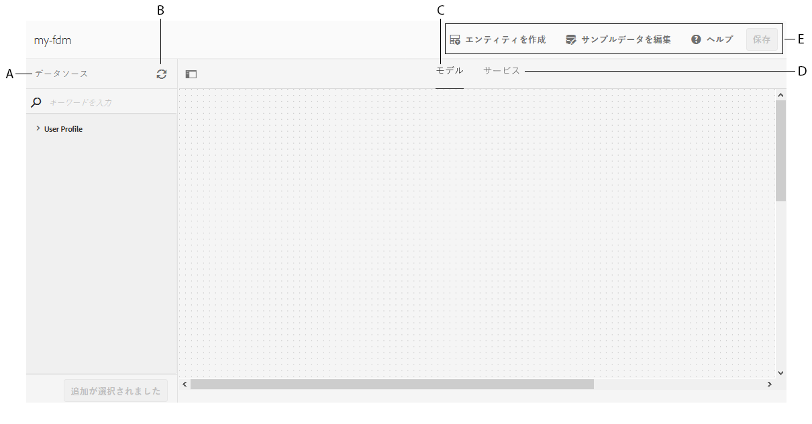
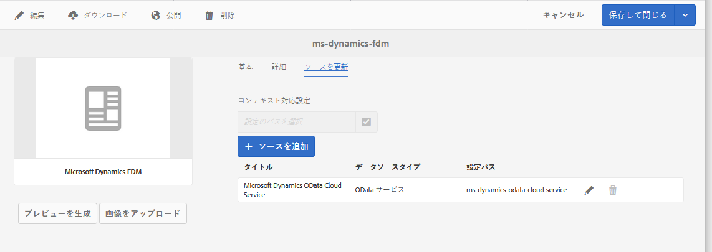

# フォームデータモデルを作成する{#create-form-data-model}

AEM Forms のデータ統合機能には、フォームデータモデルを作成して使用するための直感的なユーザーインターフェイスが付属しています。フォームデータモデルでは、データソースを使用してデータが交換されますが、データソースを使用せずにフォームデータモデルを作成することも、設定済みのデータソースを使用してフォームデータモデルを作成することもできます。フォームデータモデルを作成する方法には、以下の 2 つがあります。データソースが既に設定されているかどうかに応じて、いずれかの方法を選択してください。

* **事前に設定されたデータソースを使用する場合**:データソースを設定した場合は [、データソースの](../../forms/using/configure-data-sources.md)設定の説明に従って、フォームデータモデルの作成時にデータソースを選択できます。 この方法の場合、選択したデータソースのすべてのデータモデルオブジェクト、プロパティ、サービスを、フォームデータモデル内で使用することができます。

* **データソースが設定されていない場合**：フォームデータモデル用のデータソースが設定されていない場合であっても、データソースを使用することなくフォームデータモデルを作成することができます。フォームデータモデルを使用して、アダプティブフォームとインタラクティブ通信を作成し、サンプルデータを使用してテストを行うことができます。データソースが使用可能な状態になっている場合は、フォームデータモデルをそのデータソースに連結すると、関連するアダプティブフォームとインタラクティブ通信内でその連結内容が自動的に反映されます。

>[!NOTE]
>
>You must be a member of both **fdm-author** and **forms-user** groups to be able to create and work with form data model. これらのグループのメンバーになるには、AEM の管理者に依頼してください。

## フォームデータモデルを作成する {#data-sources}

Ensure that you have configured the data sources you intend to use in the form data model as described in [Configure data sources](../../forms/using/configure-data-sources.md). 設定済みのデータソースに基づいてフォームデータモデルを作成するには、次の手順を実行します。

1. AEM オーサーインスタンスで、**[!UICONTROL フォーム／データ統合]**&#x200B;に移動します。
1. **[!UICONTROL 作成／フォームデータモデル]**&#x200B;の順にタップします。
1. フォームデータモデルの作成ダイアログで、以下の操作を実行します。

   * フォームデータモデルの名前を指定します。
   * （**任意**）フォームデータモデルのタイトル、説明、タグを指定します。
   * （**任意、データソースが既に設定されている場合のみ**）「**[!UICONTROL データソース設定]**」の横にあるチェックマークアイコンをタップし、使用するデータソース用のクラウドサービスが存在する設定ノードを選択します。この操作により、選択した設定ノード内の有効なデータソースだけが、次のページに選択可能なデータソースとして表示されます。ただし、JDBC データベースと AEM ユーザープロファイルのデータソースは、デフォルトで表示されます。設定ノードを選択しなかった場合、すべての設定ノード内のデータソースが表示されます。

   「**[!UICONTROL 次へ]**」をタップします。

1. （**データソースが既に設定されている場合のみ**）「**[!UICONTROL データソースを選択]**」画面に、使用可能なデータソースが表示されます（有効なデータソースが存在する場合）。フォームデータモデルで使用するデータソースを選択します。
1. Tap **[!UICONTROL Create]** and on the confirmation dialog, tap **[!UICONTROL Open]** to open the form data model editor.

フォームデータモデルのエディターUIの様々なコンポーネントを確認します。

**A.データソース** ：フォームデータモデル内のデータソースをリストします。 データソースを展開して、データモデルのオブジェクトおよびサービスを表示します。

**B.データソース定義の更新** ：設定済みのデータソースからデータソース定義の変更を取得し、フォームデータモデルエディターの「データソース」タブで更新します。

**C.追加されたデータモデルオブジェクトが表示されるモデル** ・コンテンツ領域

**D.追加されたデータソース操作やサービスが表示される「Services** Content」領域

**E.フォームデータモデルを操作するためのツールバー** ・ツール。 選択したフォームデータモデルのオブジェクトに応じて、追加のオプションがツールバーに表示されます。

**F.追加選択したデータモデルのオブジェクトおよびサービスをフォームデータモデルに追加します。**

For more information about form data model editor and how you can work with it to edit and configure form data model, see [Work with form data model](../../forms/using/work-with-form-data-model.md).

## データソースの更新 {#update}

既存のフォームデータモデルにデータソースを追加するには（または、既存のフォームデータモデルのデータソースを更新するには）、以下の手順を実行します。

1. Go to **[!UICONTROL Forms > Data Integrations]**, select the form data model in which you want to add or update data sources, and tap **[!UICONTROL Properties]**.
1. フォームデータモデルのプロパティで、「**[!UICONTROL ソースを更新]**」タブに移動します。

   「ソースを更新」タブで、以下の操作を実行します。

   * 「**[!UICONTROL コンテキスト認識設定]**」フィールドで参照アイコンをタップし、追加するデータソースのクラウド設定が存在する設定ノードを選択します。ノードを選択しなかった場合、「`global`ソースを追加&#x200B;**[!UICONTROL 」をタップすると、]** ノード内のクラウド設定だけが表示されます。

   * 新しいデータソースを追加する場合は、「**[!UICONTROL ソースを追加]**」をタップし、フォームデータモデルに追加するデータソースを選択します。`global` ノード内で設定されているデータソースと、選択した設定ノード内で構成されているデータソースが、すべて表示されます。

   * 既存のデータソースを、同じタイプの別のデータソースで置き換える場合は、置き換え前のデータソースの「**[!UICONTROL 編集]**」アイコンをタップし、有効なデータソースのリストで、置き換え後のデータソースを選択します。
   * To delete an existing data source, tap the **[!UICONTROL Delete]** icon for the data source. データソース内のデータモデルオブジェクトがフォームデータモデルに追加されている場合、削除アイコンは無効です。

   

1. 「**[!UICONTROL 保存して閉じる]**」をタップして、変更内容を保存します。

>[!NOTE]
>
>フォームデータモデルに新しいデータソースを追加したら（または、フォームデータモデル内の既存のデータソースを更新したら）、更新後のフォームデータモデルが使用されるアダプティブフォームとインタラクティブ通信で、連結参照を適切に更新する必要があります。

## 次の手順 {#next-steps}

これで、データソースが追加されたフォームデータモデルが作成されました。この状態で、フォームデータモデルを編集してデータモデルオブジェクトとサービスの作成と設定を行ったり、データモデルオブジェクト間の関連付けを行ったり、プロパティを編集したり、カスタムのデータモデルオブジェクトとプロパティを追加したり、サンプルデータを生成したりすることができます。

For more information, see [Work with form data model](../../forms/using/work-with-form-data-model.md).
