# インタラクティブ通信の作成{#create-an-interactive-communication}

## 概要 {#overview}

インタラクティブ通信を使用すると、各種のインタラクティブな通信記録の作成と配信を、カスタマイズされた安全な方法で一元的に管理することができます。印刷出力を Web 用のマスターチャネルとして使用することにより、インタラクティブ通信の Web 出力を作成する手間を大幅に省くことができます。

### 前提条件 {#prerequisites}

インタラクティブ通信を作成するための前提条件を以下に示します。

* Set up a [Form Data Model](/help/forms/using/data-integration.md) containing test data or with an actual data source, such as an instance of Microsoft® Dynamics.
* Ensure that you have the [Document fragments](/help/forms/using/document-fragments.md).
* Ensure that you have [Templates for print and web channel](/help/forms/using/web-channel-print-channel.md).
* Web チャネルで必要な[テーマ](/help/forms/using/themes.md)が設定されていること。

## インタラクティブ通信の作成 {#createic}

1. AEM オーサーインスタンスにログインし、**[!UICONTROL Adobe Experience Manager]**／**[!UICONTROL フォーム]**／**[!UICONTROL フォームとドキュメント]**&#x200B;に移動します。
1. Tap **[!UICONTROL Create]** and select **[!UICONTROL Interactive Communication]**. [インタラクティブコミュニケーションの作成]ページが表示されます。

   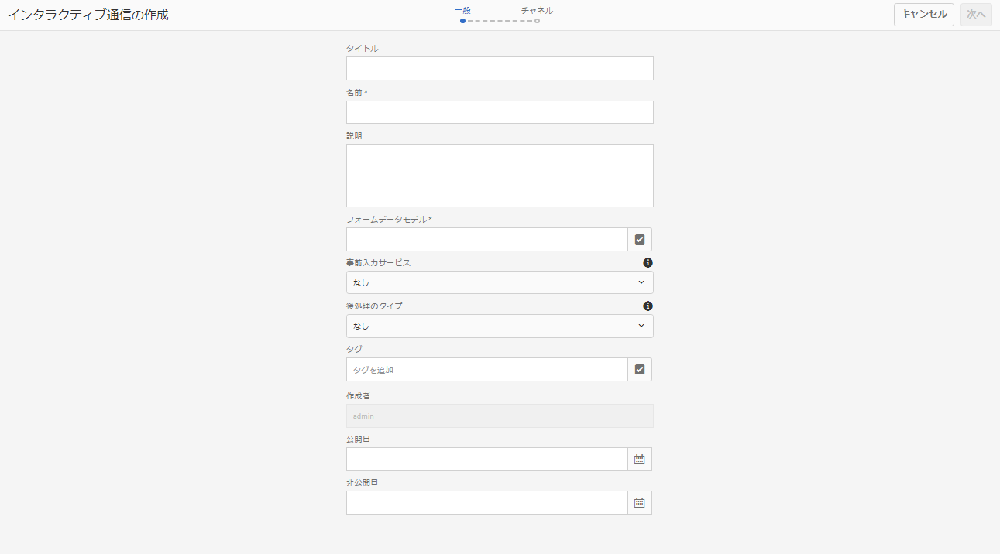

1. 以下の情報を入力します。：

   * **[!UICONTROL タイトル]**：インタラクティブ通信のタイトルを入力します。
   * **[!UICONTROL 名前]**:インタラクティブ通信の名前は、入力したタイトルから得られます。 必要に応じて編集します。
   * **[!UICONTROL 説明]**:対話型通信に関する説明を入力します。
   * **[!UICONTROL Form Data Model]**:フォームデータモデルを参照して選択します。 For more information on Form Data Model, see [AEM Forms Data Integration](/help/forms/using/data-integration.md).

   * **[!UICONTROL 事前入力サービス]**:データを取得し、インタラクティブ通信を事前入力する前に、事前入力サービスを選択します。
   * **[!UICONTROL 後処理のタイプ]**:Interactive Communicationが送信されたときにトリガーされるAEMまたはFormsワークフローを選択できます。 トリガーするワークフローのタイプを選択します。

   * **[!UICONTROL 後処理]**：トリガーするワークフローの名前を選択します。AEMワークフローを選択する場合は、「添付ファイルのパス」、「レイアウトのパス」、「PDFのパス」、「印刷データのパス」および「Webデータのパス」を指定します。
   * **[!UICONTROL タグ]**:インタラクティブ通信に適用するタグを選択します。 また、新しいタグ名またはカスタムタグ名を入力し、Enterキーを押して作成することもできます。
   * **[!UICONTROL 作成者]**：作成者名は、ログインしたユーザー名から自動的に取得されます。
   * **** 発行日：インタラクティブコミュニケーションを公開する日付を入力します。
   * **[!UICONTROL 非公開日]**:インタラクティブコミュニケーションの公開を取り消す日付を入力します。

1. 「**[!UICONTROL 次へ]**」をタップします。印刷とWebチャネルの詳細を指定する画面が表示されます。
1. 以下を入力します。

   * **[!UICONTROL 印刷]**:Interactive Communicationの印刷チャネルを生成する場合は、このオプションを選択します。
   * **[!UICONTROL 印刷テンプレート]**:XDPを参照し、印刷テンプレートとして選択します。
   * **[!UICONTROL Web]**:Interactive CommunicationのWebチャネルまたはレスポンシブ出力を生成する場合は、このオプションを選択します。
   * **[!UICONTROL Interactive Communication webテンプレート]**:Webテンプレートを参照して選択します。
   * **[!UICONTROL テーマ]** とテ **[!UICONTROL ーマの選択]**:テーマを参照して選択し、インタラクティブコミュニケーションのWebチャネルのスタイルを設定します。 詳しくは、「[AEM Forms のテーマ](/help/forms/using/themes.md)」を参照してください。

   * **[!UICONTROL Webチャネル用のマスターとして印刷を使用]**:このオプションは、印刷チャネルと同期するWebチャネルを作成する場合に選択します。 印刷チャネルを Web チャネルのマスターとして使用すると、Web チャネルに連結されたコンテンツとデータが印刷チャネルから取得され、「同期」をタップしたときに、印刷チャネルに対する変更内容が Web チャネルに反映されます。ただし、作成者は、Web チャネル内の特定のコンポーネントについて、必要に応じて継承設定を解除することができます。For more information, see [Synchronize Web channel with Print channel](../../forms/using/create-interactive-communication.md#synchronize).
「Webチャネル用の印刷マ **[!UICONTROL スターとして使用」オプションを選択すると]** 、次のモードのいずれかを選択してWebチャネルを生成できます。

      * **[!UICONTROL 自動レイアウト]**:このモードを選択すると、印刷チャネルからWebチャネル用のプレースホルダー、コンテンツ、データ連結が自動的に生成されます。
      * **[!UICONTROL手動で整理**:このモードを選択すると、「データソース」タブにあるマスターコンテンツを使用して、印刷チャネルの要素を手動で選択し、Webチャネルに追 **[!UICONTROL 加できます]** 。 詳しくは、「印刷チャネル要素を選 [択してWebチャネルコンテンツを作成する」を参照してくださ](#selectprintchannelelements)い。
   For more information on print channel and web channel, see [Print channel and web channel](/help/forms/using/web-channel-print-channel.md).

1. 「**[!UICONTROL 作成]**」をタップします。インタラクティブ通信が作成され、警告ボックスが表示されます。 Tap **[!UICONTROL Edit]** to start building the contents of the Interactive Communication as explained in [Add contents using Interactive Communication authoring user interface](#step2). Alternatively, you can tap **[!UICONTROL Done]** and choose to edit the Interactive Communication later.

## インタラクティブ通信にコンテンツを追加する {#step2}

インタラクティブコミュニケーションを作成した後は、インタラクティブコミュニケーションオーサリングインターフェイスを使用してそのコンテンツを作成できます。

For more information on the Interactive Communication authoring interface, see [Introduction to Interactive Communication authoring](/help/forms/using/introduction-interactive-communication-authoring.md).

1. The Interactive Communication authoring interface is launched when you Tap Edit as mentioned in [Create Interactive Communication](#createic). Alternatively, you can navigate to an existing Interactive Communication asset on AEM, select it, and tap **[!UICONTROL Edit]** to launch the Interactive Communication authoring interface.

   デフォルトでは、インタラクティブ通信がWebチャネルのみの場合を除き、インタラクティブ通信の印刷チャネルが表示されます。 インタラクティブ通信の印刷チャネルには、選択したXDP/印刷チャネルテンプレートで使用可能なターゲット領域が表示されます。 これらのターゲット領域とフィールドで、コンポーネントやアセットを追加することができます。

1. With the Print channel selected, select the **[!UICONTROL Components]** tab. 印刷チャネルでは、以下のコンポーネントを使用することができます。

   | **コンポーネント** | **機能** |
   |---|---|
   | グラフ | フォームデータモデルのコレクションから取得した2次元データを視覚的に表すために、Interactive Communicationで使用できるグラフを追加します。 For more information, see [Using charts in Interactive Communications](/help/forms/using/chart-component-interactive-communications.md). |
   | ドキュメントフラグメント | テキスト、リスト、条件などの再利用可能なコンポーネントをインタラクティブ通信に追加できます。 インタラクティブ通信に追加する再利用可能なコンポーネントは、フォームデータモデルベースのコンポーネントでも、フォームデータモデルを持たないコンポーネントでもかまいません。 |
   | 画像 | 画像を挿入できるようにします。。 |

   コンポーネントをインタラクティブ通信にドラッグ&amp;ドロップし、必要に応じて設定します。

   また、印刷チャネルとWebチャネルの両方に対してインタラクティブ通信を作成する際に、元に戻す操作とやり直し操作を使用することもできます。

   元に戻す操作を使用して最後に実行した操作を破棄し、やり直し操作を使用して、破棄した操作を再度組み込みます。 例えば、インタラクティブ通信に画像を挿入したり、データ連結を作成した場合、その画像を破棄する必要がある場合は、元に戻す操作を使用します。

   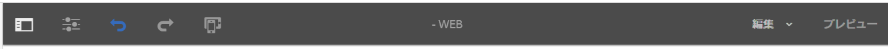

   元に戻すとやり直しのオプションは、オーサリングUIページのツールバーに表示されます。 「元に戻す」オプションは、アクションの実行後にのみ表示されます。 やり直しオプションは、取り消し操作の実行後にのみ、ページのツールバーに表示されます。 これらのアクションは、ページの更新時にリセットされます。

1. 印刷チャネルを選択した場合は、「**[!UICONTROL アセット]**」タブに移動して、必要なアセットだけを表示するためのフィルターを適用します。

   アセットブラウザーを使用して、アセットをインタラクティブコミュニケーションのターゲット領域に直接ドラッグ&amp;ドロップすることもできます。

   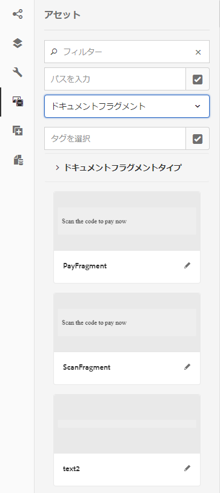

1. ドキュメントフラグメントをインタラクティブ通信にドラッグアンドドロップします。以下の表に、インタラクティブ通信の印刷チャネルで使用できるドキュメントフラグメントのタイプを示します。

<table>
 <tbody>
  <tr>
   <td><strong>ドキュメントフラグメントタイプ</strong></td>
   <td><strong>用途の例</strong></td>
  </tr>
  <tr>
   <td><a href="/help/forms/using/texts-interactive-communications.md" target="_blank">テキスト</a></td>
   <td>レターの住所、受信者の電子メール、本文を追加するテキスト </td>
  </tr>
  <tr>
   <td><a href="/help/forms/using/conditions-interactive-communications.md" target="_blank">条件</a></td>
   <td>Condition to add the appropriate header image to the communication based on the type of the policy: Standard or Premium.   </td>
  </tr>
  <tr>
   <td>リスト</td>
   <td>Group of document fragments, including text, conditions, other lists, and images.   </td>
  </tr>
 </tbody>
</table>

「アセット」タブを使用して新しいフラグメントをターゲット領域にドロップすることで、ターゲット領域とドキュメントフラグメントの間の連結を置き換えること **もできます** 。 フラグメントをドラッグするときのターゲット領域の青い色の網掛けは、ドキュメントフラグメントをターゲット領域にドロップできることを示します。

For more information on document fragments, see [Document Fragments](/help/forms/using/document-fragments.md).

オーサリングインターフェイスを使用すると、連結されていないフィールドと連結されているフィールド、およびインタラクティブ通信内の変数を区別できます。 インターフェイスでは、連結されていないフィールドと変数がオレンジ色の境界線で強調表示されます。

さらに、これらの要素の上にマウスを置くと、ツールチップにフィールド（連結なし）または変数（連結なし）のメッセージが表示されます。

ドキュメントフラグメントで使用される連結されていない変数が、オーサリングインターフェイスに表示されない場合があります。 これは、ドキュメントフラグメント内のインラインテキストルール、または条件フラグメントの場合に発生する可能性があります。 この場合、ツールチップは青でハイライト表示され、ドキュメントフラグメントの一部として表示されます。 ツールチップには、ドキュメントフラグメント内で使用される連結されていない変数の数が表示されます。

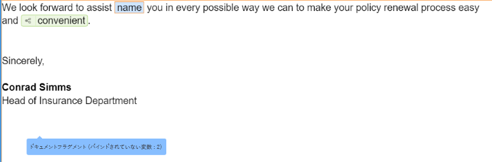

ドキュメントフラグメントをタップし  （設定）をタップし、Interactive Communicationのサイドキックから「 **[!UICONTROL Properties]** 」をタップします。 「変数 **[!UICONTROL とデータモデルオブジェクト]** 」セクションには、非表示の変数や、ドキュメントフラグメントで使用されるデータモデルオブジェクトなどの変数が表示されます。 各データモデ  または変数の横にある編集（編集）アイコンを使用して、プロパティを編集します。

1. To set up binding of variables, tap a variable and select  (Configure) and then set up the binding properties in the Properties panel in the sidebar.

   * **なし**：このプロパティを選択すると、エージェントによって変数の値が設定されます。
   * **テキストフラグメント**：このプロパティを選択すると、フィールド内でコンテンツがレンダリングされるテキストドキュメントフラグメントを参照して選択できるようになります。変数を含まない変数に連結できるのは、テキストドキュメントフラグメントのみです。
   * **Data Model Object**:フィールドに値が入力されるフォームデータモデルのプロパティを選択します。
   * **** デフォルト値：このフィールドを使用して、変数のデフォルト値を定義できます。 この値は、インタラクティブ通信またはエージェントUIをプレビューすると表示されます。
   * **** 表示パターン：変数の表示形式を定義することもできます。 変数に表示形式を適用するには、「タイプ」( **Type** )ドロップダウンリストからあらかじめ定義されたオプションを選択します。 「カス **タム** 」を選択して、リストに表示されない表示パターンを定義します。 詳しくは、データ表示パターン [を参照してください](../../forms/using/create-interactive-communication.md#datadisplaypatterns)。
   「変数」と「デ [ータモデルオブジェクト](../../forms/using/create-interactive-communication.md#hiddenvariables) 」に移動し、ドキュメントフラグメント内の非表示の変数の連結を設定します。

   また、データソース要素やテキストドキュメントフラグメントをドラッグ&amp;ドロップして、変数の連結を設定することもできます。  データソース要素のいずれかを使用して連結を作成するには、「データソース **** 」タブを選択し、要素を変数名にドラッグ&amp;ドロップします。 連結を正しく設定するには、データソース要素と変数の型が同じである必要があります。 データソース要素を既に連結されている変数にドラッグ&amp;ドロップすると、新しい要素によって前の要素が置き換えられ、変数で新しい連結が作成されます。 同様に、「アセット」タ **ブを選択し** 、テキストドキュメントフラグメントを変数名にドラッグ&amp;ドロップして、それらの間の連結を設定します。 テキストドキュメントフラグメントに変数を含めることはできません。

1. テーブルを追加するには、印刷チャネルを選択した状態で、レイアウトフラグメントだけを表示するためのフィルターを「**[!UICONTROL アセット]**」タブで適用します。次に、必要なレイアウトフラグメントをインタラクティブ通信にドラッグアンドドロップします。レイアウトフラグメントはXDPに基づいており、動的データが埋め込まれるInteractive Communicationでグラフィカルレイアウトや静的および動的テーブルを作成するために使用できます。

   例えば、新しいポリシーと古いポリシーで、保険料の総額、特別割引率（%）、緊急ロードサイドサービスを表示するためのレイアウトテーブルを作成することができます。

   For more information on layout fragments, see [Document Fragments](/help/forms/using/document-fragments.md).

1. 印刷チャネルを選択した状態で、画像を表示するためのフィルターを「**[!UICONTROL アセット]**」タブで適用します。必要な画像（会社のロゴなど）をInteractive Communicationにドラッグ&amp;ドロップします。

   また、インタラクティブ通信で以下の操作を行います。

   * [グラフの追加と設定](/help/forms/using/chart-component-interactive-communications.md)
   * [Web チャネルと印刷チャネルの同期](../../forms/using/create-interactive-communication.md#synchronize)

      * 自動同期
      * 継承のキャンセル
      * 継承を再度有効にする
      * 同期
   * [添付ファイルとライブラリへのアクセス](../../forms/using/create-interactive-communication.md#attachmentslibrary)
   * [XDP またはレイアウトフィールドのプロパティの設定](../../forms/using/create-interactive-communication.md#xdplayoutfieldproperties)
   * [コンポーネントへのルールの追加](../../forms/using/create-interactive-communication.md#rules)

1. Switch to **[!UICONTROL Web Channel]**. WebチャネルがInteractive Communicationエディターに表示されます。 初めて印刷チャネルからWebチャネルに切り替えると、自動同期が行われます。 For more information, see [Synchronizing web channel from the print channel](../../forms/using/create-interactive-communication.md#synchronize).

   この例では、Web チャネルのマスターとして印刷チャネルを使用しているため、印刷チャネルのプレースホルダー、コンテンツ、データ連結が Web チャネルに同期されます。ただし、Webチャネル内の特定のコンテンツを変更してカスタマイズすることはできます。 [印刷チャネルを使用して](../../forms/using/create-interactive-communication.md#main-pars-header-103384010) 、コンテンツをカスタマイズするために生成されたターゲット領域と変数の継承をキャンセルします。

   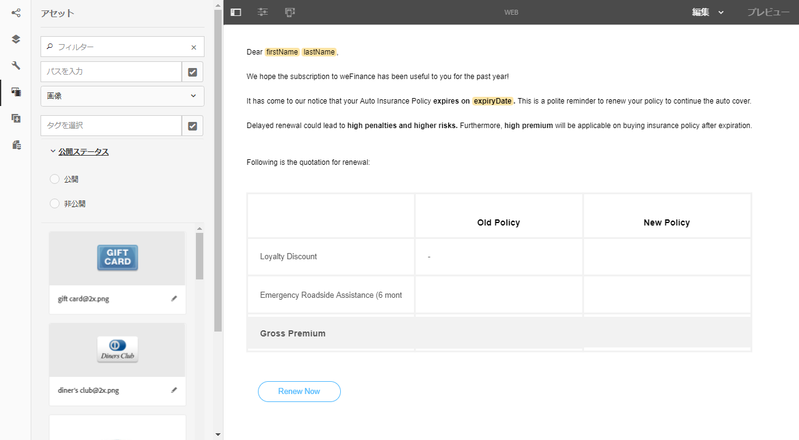

   ドキュメントフラグメントをタップし  （設定）をタップし、Interactive Communicationのサイドキックから「 **[!UICONTROL Properties]** 」をタップします。 「変数 **[!UICONTROL とデータモデルオブジェクト]** 」セクションには、非表示の変数や、ドキュメントフラグメントで使用されるデータモデルオブジェクトなどの変数が表示されます。 各データモデ  または変数の横にある編集（編集）アイコンを使用して、プロパティを編集します。 また、印刷チャネルを使用して [Webチャネルで自動生成されたドキュメントフラグメントの場合は、各データモデルオブジェクトと変数の横にある](../../forms/using/create-interactive-communication.md#main-pars-header-1213963149) （継承のキャンセル）アイコンを使用して継承をキャンセルし  、編集できます。

1. Web チャネルにコンポーネントを追加するには、Web チャネルを選択した状態で「**[!UICONTROL コンポーネント]**」をタップします。必要に応じて、Interactive CommunicationのWebチャネルにコンポーネントをドラッグ&amp;ドロップし、設定に進みます。

   | コンポーネント | 機能 |
   |---|---|
   | グラフ | フォームデータモデルのコレクションから取得した2次元データを視覚的に表すために、Interactive Communicationで使用できるグラフを追加します。 For more information, see [Using chart component](../../forms/using/chart-component-interactive-communications.md). |
   | ドキュメントフラグメント | 再利用可能なコンポーネント、テキスト、リストまたは条件をインタラクティブ通信に追加できます。 インタラクティブ通信に追加する再利用可能なコンポーネントは、フォームデータモデルベースのコンポーネントでも、フォームデータモデルなしのコンポーネントでもかまいません。 |
   | 画像 | 画像を挿入できるようにします。。 |
   | パネル | パネルをインタラクティブ [通信](../../forms/using/create-interactive-communication.md#add-panel-component-to-the-web-channel) (Interactive Communication)に追加できます。 |
   | テーブル | 行と列のデータを整理するためのテーブルを追加することができます。 |
   | ターゲット領域 | Web チャネル固有のコンポーネントを整理するためのターゲット領域を、その Web チャネルに挿入することができます。ターゲット領域は、Web チャネル固有のコンポーネントをグループ化するためのプレーンコンテナです。 |
   | テキスト | インタラクティブ通信の Web チャネルにリッチテキストを追加することができます。追加したテキストでフォームデータオブジェクトを使用して、動的なコンテンツを作成することもできます。 |
   | ボタン | インタラクティブ通信にボ [タン](../../forms/using/create-interactive-communication.md#add-button-component-to-the-web-channel) (Button)を追加できます。 ボタンコンポーネントを使用して、他のインタラクティブコミュニケーション、アダプティブフォーム、画像、ドキュメントフラグメントなどの他のアセット、または外部URLに移動できます。 |
   | 区切り文字 | インタラクティブ通信内に水平線を挿入できます。 このコンポーネントを使用して、通信内のセクションを区別します。 例えば、「区切り」コンポーネントを使用して、クレジットカード明細の「顧客の詳細」セクションと「クレジットカードの詳細」セクションを区別できます。 |

1. 必要に応じて、Web チャネルにアセットを挿入します。

   You can [preview your Interactive Communication](#previewic) to see what the print and web outputs of the Interactive Communication look like and continue making changes, as required.

## インタラクティブ通信のプレビュー表示 {#previewic}

You can use the **Preview option** to evaluate appearance of the Interactive Communication. Interactive CommunicationのWebチャネルには、様々なデバイスに対するInteractive Communicationのエクスペリエンスをエミュレートするオプションも用意されています。 例えば、iPhone、iPad、デスクトップパソコンなどのデバイスについて、エミュレーションを行うことができます。You can use both **Preview** and **Emulator**  options in conjunction with each other to preview the web outputs for devices of different screen sizes. プレビューのサンプルデータは、指定したフォームデータモデルから入力されます。

1. プレビュー表示する印刷チャネルまたは Web チャネルを選択して「プレビュー」をタップします。[Interactive Communication]が表示されます。

   >[!NOTE]
   >
   >プレビュー画面には、指定したフォームデータモデルのサンプルデータが表示されます。For more information on previewing the Interactive Communication with some other data or using the prefill service, see [Use form data model](/help/forms/using/using-form-data-model.md) and [Work with form data model](/help/forms/using/work-with-form-data-model.md).

1. For the web channel, use  to view how the Interactive Communication looks on various devices.

   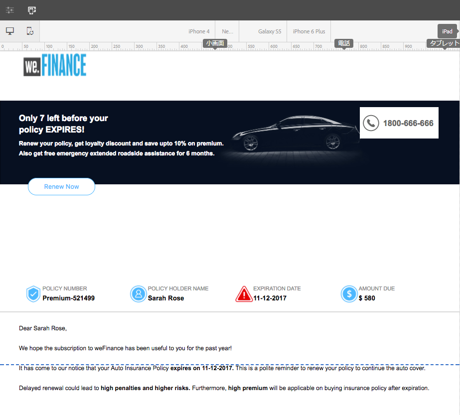

Further, you can [Prepare and send Interactive Communication using the Agent UI](/help/forms/using/prepare-send-interactive-communication.md).

## Configure properties in Interactive Communication  {#configure-properties-in-interactive-communication}

### 添付ファイルとライブラリへのアクセス {#attachmentslibrary}

印刷チャネルでは、添付ファイルとライブラリへのアクセスを設定して、インタラクティブ通信の添付ファイルをエージェント UI で管理することができます。

1. 印刷チャネルでドキュメントコンテナをハイライト表示して、「**プロパティ**」をタップします。

   

   サイドバーにプロパティパネルが表示されます。

   

1. 「**添付ファイル**」を展開し、以下のプロパティを指定します。

   * **[!UICONTROL ライブラリのアクセスを許可]**：エージェント UI でエージェントによるライブラリへのアクセスを許可する場合は、このプロパティを選択します。このプロパティを選択すると、インタラクティブ通信の準備を行う際に、エージェントを使用してライブラリ内のファイルを追加できるようになります。
   * **[!UICONTROL 添付ファイルの順番の変更を許可]**：インタラクティブ通信の添付ファイルの順序を変更できるようにするには、このプロパティを選択します。
   * **[!UICONTROL 許可される添付ファイルの最大数]**：インタラクティブ通信で許可される添付ファイルの最大数を指定します。
   * **[!UICONTROL 添付ファイル]**:「追加」 **[!UICONTROL をタップし]** 、添付するファイルを参照して選択し、次を指定します。

      * **[!UICONTROL デフォルトでドキュメントにこのファイルを添付する]**：ファイルの添付が必須でない場合のみ、このオプションを変更することができます。
      * **[!UICONTROL 必須]**：このオプションを選択すると、エージェント UI で添付ファイルを削除できなくなります。
   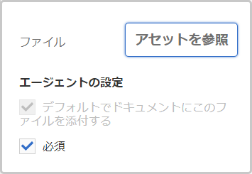

1. 「**[!UICONTROL Done]**」をタップします。

### XDP またはレイアウトフィールドのプロパティの設定 {#xdplayoutfieldproperties}

1. While editing the Print channel of an Interactive Communication, hover over a field, which is built in the Print channel template, and select  (Configure).

   サイドバーにプロパティダイアログが表示されます。

   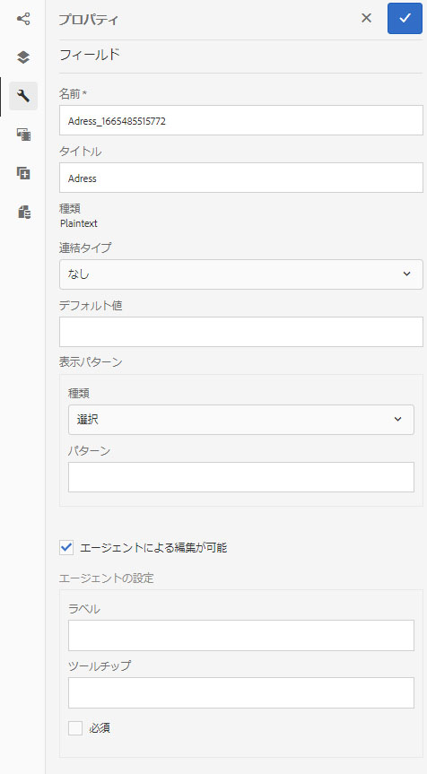

1. 以下のプロパティを指定します。

   * **[!UICONTROL 名前]**:JCRノード名。
   * **[!UICONTROL タイトル]**：タイトルを入力します。ここで入力したタイトルは、エージェント UI とドキュメントコンテナツリーに表示されます。
   * **[!UICONTROL 連結タイプ]**:フィールドに対して、次の連結タイプのいずれかを選択します。

      * なし：このプロパティを選択すると、エージェントによってプロパティの値が設定されます。
      * テキストフラグメント：このプロパティを選択すると、フィールド内でコンテンツがレンダリングされるテキストドキュメントフラグメントを参照して選択できるようになります。または、テキストドキュメントフラグメントをフィールド名にドラッグ&amp;ドロップして、フィールド間の連結を設定します。 テキストドキュメントフラグメントに変数を含めることはできません。
      * データモデルオブジェクト：フィールド内に値を取り込むデータモデルプロパティを選択します。または、「データソ **ース** 」タブを選択し、プロパティをフィールドにドラッグ&amp;ドロップします。
   * **[!UICONTROL デフォルト値]**：指定したデータモデルオブジェクトまたはテキストフラグメントでフィールドの値を設定しなかった場合、そのフィールドにデフォルト値が設定されます。データ連結タイプがnoneの場合、デフォルト値がフィールドに事前入力されます。
   * **[!UICONTROL 表示パターン]**:フィールドの表示形式を定義することもできます。 フィールドに表示形式を適用するには、「タイプ」ドロップ **ダウン** ・リストからあらかじめ定義されたオプションを選択します。 「カス **タム** 」を選択して、リストに表示されない表示パターンを定義します。 詳しくは、データ表示パターンを [参照してください。](../../forms/using/create-interactive-communication.md#datadisplaypatterns)

   * **[!UICONTROL エージェントによる編集が可能]**：エージェント UI のフィールド値をエージェントを使用して編集できるようにするには、このオプションを選択します。この設定は、「連結の種類」が「テキストフラグメント」の場合は適用されません。
   * **[!UICONTROL ラベル]**：フィールドと共にエージェント UI に表示されるテキスト文字列を指定します。この設定は、「連結の種類」が「テキストフラグメント」の場合は適用されません。
   * **[!UICONTROL ツールチップ]**:エージェントUIのエージェントにマウスを移動すると表示されるテキスト文字列を入力します。 この設定は、「連結の種類」が「テキストフラグメント」の場合は適用されません。
   * **[!UICONTROL 必須]**：フィールドを入力必須にするには、このオプションを選択します。この設定は、「連結の種類」が「テキストフラグメント」の場合は適用されません。
   * **[!UICONTROL 複数行]**：フィールドに複数行のテキストを入力できるようにするには、このオプションを選択します。この設定は、「連結の種類」が「テキストフラグメント」の場合は適用されません。

1. 「 。

### データ表示パターン {#datadisplaypatterns}

オーサリングインターフェイスを使用すると、印刷チャネルとWebチャネル用のインタラクティブ通信を作成する際に使用できるフィールド、変数、フォームデータモデル要素のデータ表示パターンを定義できます。

データ表示パターンを設定するには、要素をタップし、  （設定）を選択して、サイドバーのプロパティパネルで表示パターンを設 **[!UICONTROL 定します]** 。 「タイプ」( **[!UICONTROL Type]** )ドロップダウンリストから任意の定義済みオプションを選択し、選択したタイプに関連付けられたパターンを表示します。 「タイ **[!UICONTROL プ]****** 」ドロップダウンリストから「カスタム」を選択して、リストに表示されないパターンを定義します。 「パターン」フィールドで値を **[!UICONTROL 編集すると]** 、タイプが自動的に「カスタム」に変更 **[!UICONTROL されます]**。

表示パターンを適用するには、「パターン」フィールドに定義された文字数や数字の数が、フィールド、変数およびフォームデータモデル要素の値に定義された文字数や数字と一致するか、それを超える必要があります。 For more information, see [example](../../forms/using/create-interactive-communication.md#greaternumberofdigits).

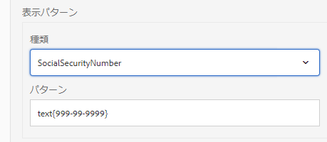

印刷チャネルからWebコンテンツを生成した後、フィールド、変数またはフォームデータモデル要素の表示パターンを再定義できます。 その結果、印刷チャネルとWebチャネルに対して異なる表示パターンが定義される場合があります。 印刷チャネルの要素の表示パターンを定義せず、印刷チャネルを使用してWebコンテンツを自動生成する場合、印刷チャネルの要素に対して定義されたデータ連結によって、「種類 **** 」ドロップダウンリストで使用できる表示パターンのオプションが定義されます。 要素に連結が定義されていない場合は、その要素のデータ型によって使用可能な表示パターンオプションが定義されます。 例えば、印刷チャネルの要素に対して数値型のデータ連結を作成する場合、「種類」ドロップダウンリストで使用できる表示パターンのオプションは、様々な形式の数値型です **** 。

プレビューモードに切 **り替えるか** 、エージェントUIを開いて、これらの要素に適用された表示パターンを表示します。

次の表に、変数のデータ表示パターンを設定した結果として表示される値の例を示します。

| タイプ | デフォルト値 | 表示パターン | 表示値 | 説明 |
|---|---|---|---|---|
| 社会保障番号 | 123456789 | テキスト{999-99-9999} | 123-45-6789 | デフォルト値フィールドの桁数は、「パターン」フィールドの桁数と一致します。 パターンに基づく値が正常に表示されます。 |
| 社会保障番号 | 1234567 | テキスト{999-99-9999} | 1-23-4567 | デフォルト値フィールドの桁数が、パターンフィールドの桁数より小さくなっています。 このパターンは7桁の数字に適用されます。 |
| 社会保障番号 | 1234567890 | テキスト{999-99-9999} | 1234567890 | デフォルト値フィールドの桁数が、パターンフィールドの桁数よりも大きくなっています。 その結果、表示値に変更はありません。 |

変数またはフォームデータモデル要素に対して表示パターンが指定されていない場合、デフォルトでは [グローバルドキュメントフラグメント](https://helpx.adobe.com//experience-manager/6-5/forms/using/interactive-communication-configuration-properties.html) 設定が使用されます。

数値データ型の変数に表示パターンを適用しない場合、印刷プレビューには、グローバルドキュメントフラグメント設定に従ってパターンが表示されます。 デフォルトのグローバルドキュメントフラグメント設定に変更を適用した場合、ロケールに対して定義されたデフォルトの区切り文字に従って、エージェントUIにパターンが表示されます。

同様に、フィールドの場合、表示パターンが指定されていない場合は、印刷テンプレート(XDP)の作成時に定義されたパターンがフィールドに適用されます。 印刷テンプレートの作成時にパターンがない場合は、XFA仕様に基づくデフォルトのパターンがフィールドに適用されます。

また、指定された表示パターンが正しくない場合や適用できない場合は、XFA仕様に基づくデフォルトのパターンがフィールド、変数またはフォームデータモデル要素に適用されます。

## インタラクティブ通信のコンポーネントにルールを適用する {#rules}

To conditionalize components or content in the interactive communcation, tap the component/piece of content and select  (Create Rule) to launch Rule Editor.

詳しくは、次を参照してください。

* [ルールエディター](/help/forms/using/rule-editor.md)
* [インタラクティブ通信オーサリング の概要](/help/forms/using/introduction-interactive-communication-authoring.md)

## テーブルの使用 {#tables}

### インタラクティブ通信の動的テーブル {#dynamic-tables-in-interactive-communication}

動的テーブルは、レイアウトフラグメントを使用してインタラクティブ通信に追加できます。 以下の手順では、クレジットカードの取引明細を例として、レイアウトフラグメントを使用して、インタラクティブ通信内に動的なテーブルを作成する方法について説明します。

1. テーブルを作成するために必要なレイアウトフラグメントが AEM で使用可能な状態になっていることを確認します。
1. インタラクティブコミュニケーションの印刷チャネルで、レイアウトフラグメント（複数列のテーブルを含む）をアセットブラウザーからターゲット領域にドラッグ&amp;ドロップします。

   

   インタラクティブ通信のレイアウト領域にテーブルが表示されます。

   

1. テーブル内のセルごとに、データ連結を指定します。繰り返し可能な行を作成するには、共通のコレクションプロパティに属する行にフォームデータモデルのプロパティを挿入します。

   1. Tap a cell in the table and select  (Configure).

      サイドバーにプロパティダイアログが表示されます。

      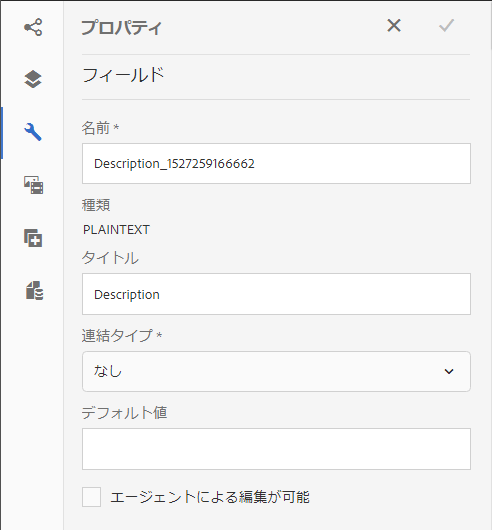

   1. 以下のプロパティを設定します。

      * **[!UICONTROL 名前]**:JCRノード名。
      * **[!UICONTROL タイトル]**:インタラクティブコミュニケーションエディターに表示するタイトルを入力します。
      * **[!UICONTROL 連結タイプ]**:フィールドに対して、次の連結タイプのいずれかを選択します。

         * **[!UICONTROL なし]**
         * **[!UICONTROL データモデルオブジェクト]**:フォームデータモデルのプロパティの値がフィールドに入力されます。 または、「データソ **ース** 」タブを選択し、プロパティをフィールドにドラッグ&amp;ドロップします。
      * **[!UICONTROL Data Model Object]**:フィールドに値が入力されるフォームデータモデルのプロパティ。
      * **[!UICONTROL デフォルト値]**:デフォルト値を使用すると、指定したデータモデルオブジェクトで値が指定されていない場合に、フィールドが空ではなくなります。 デフォルト値はフィールドに事前入力されます。

      * **[!UICONTROL エージェントによる編集が可能]**：エージェント UI のフィールド値をエージェントを使用して編集できるようにするには、このオプションを選択します。
   1. 「 。

1. インタラクティブ通信をプレビューして、データと共にレンダリングされたテーブルを確認します。

   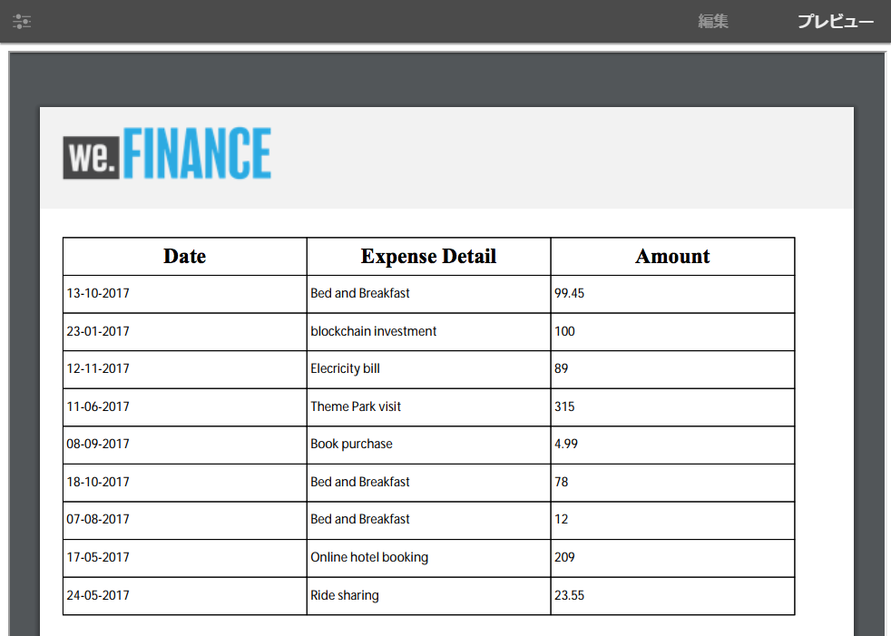

### Web チャネル専用テーブル {#webchanneltables}

Webテンプレートのルートパネルをタップし、 **+をタップし** て、インタラクティブ通信 **** に表コンポーネントを追加します。 インタラクティブ通信には、2行のテーブルが挿入されます。 表の最初の行は表のヘッダーを表します。

#### テーブルへの行と列の追加 {#addrowscolumnstable}

**列を追加または削除するには：**

1. テーブルヘッダー行のデフォルトのテキストボックスをタップして、コンポーネントツールバーを表示します。
1. 表の列を **追加する場合は****** 、「列を追加」を選択し、表の列を追加する場合は「列を削除」を選択します。

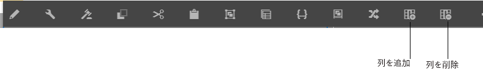

**行を追加または削除するには：**

1. 任意のテーブル行をタップして、コンポーネントツールバーを表示します。 また、インタラクティブコミュニケーションのサイドキックにあるコンテンツブラウザーを使用して、テーブル行を選択することもできます。
1. 「行の追 **加」または「行の** 削除 **** 」を選択すると、テーブル行がそれぞれ追加または削除されます。 表の行を並 **べ替えるには** 、ツールバー **** の「上へ移動」オプションと「下へ移動」オプションを使用します。

******** A.行 **Bを追加行の削除** C.**上に**&#x200B;移動下に移動

#### 表のセル内のテキストの追加または編集 {#addedittexttable}

1. テーブルのセルでデフォルトのテキストボックスを選択し、「  （編集）」をタップします。
1. 表のセルにテキストを入力し、をタップして  保存します。

#### 表のセルとデータモデルのオブジェクト要素間の連結を作成する {#createbindingtablecells}

1. テーブル行のデフォルトのテキストボックスを選択し、「  （編集）」をタップします。
1. 「データモデルオブジェクト」ドロップダウンリストをタップし、プロパティを選択します。
1. をタップして、テーブルセルとデータモデルオブジェクトプロパティの間の連結を保存し、作成します。

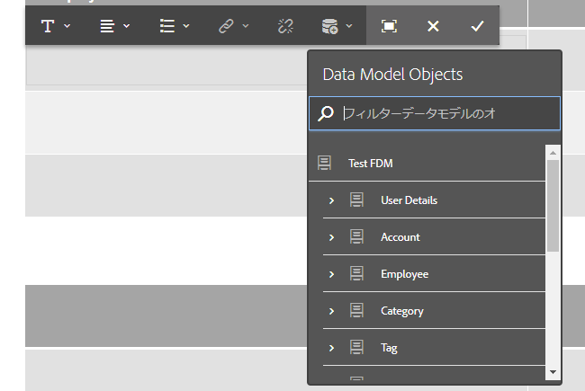

#### テーブルセル内のテキストへのハイパーリンクを作成する {#createhyperlinktable}

1. テーブルのセルでデフォルトのテキストボックスを選択し、「  （編集）」をタップします。
1. テーブルセル内のテキストを選択し、ハイパーリンクアイコンをタップします。
1. Specify the URL in the **Path** field.
1. Tap  to save the hyperlink properties.

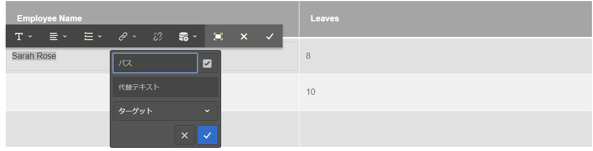

#### 動的テーブルの作成 {#createdynamictables}

Interactive Communicationでは、Webチャネル専用の動的テーブルを、型コレクションのデータモデルプロパティを使用して作成できます。 このようなテーブルは、コレクションプロパティの子プロパティを表します。 編集できるのは、テーブル内のセルの書式設定プロパティだけです。

1. Webチャネルに切り替え、データソースブラウザーの表示を選択します。
1. コレクションプロパティをサブフォームにドラッグアンドドロップします。サブフォーム内にテーブルが作成されます。
1. インタラクティブ通信の Web チャネル内のテーブルをプレビュー表示します。

#### 表の列の並べ替え {#sortcolumns}

インタラクティブコミュニケーションのテーブルの列に基づいてデータを並べ替えることができます。 列内の値は、昇順または降順で並べ替えることができます。

並べ替えは、次を含むテーブルの列に適用できます。

* 静的テキスト
* データモデルオブジェクトプロパティ
* 静的テキストとデータモデルオブジェクトプロパティの組み合わせ

並べ替えを有効にするには：

1. Select the table and tap  (Configure). また、インタラクティブ通信のサイドキックにある **コンテンツ** ブラウザーを使用して、テーブルを選択することもできます。
1. 「並べ替えを **有効にする」を選択します。**
1. Tap  to save the table properties. 列ヘッダー内の並べ替えアイコン（上向き矢印と下向き矢印）は、並べ替えが有効になっていることを表します。

   

1. 出力を表示するに **は** 、プレビューモードに切り替えます。 テーブルは、テーブルの最初の列に基づいて自動的に並べ替えられます。
1. 列見出しをクリックして、列に基づいて値を並べ替えます。

   上向き矢印の付いた列ヘッダーは、次の内容を表します。

   * テーブルは、その列に基づいて並べ替えられます。
   * 列の値は昇順で表示されます。
   

   同様に、下向き矢印の付いた列見出しは、列内の値が降順で表示されることを表します。

## Interactive Communicationプロパティの編集 {#edit-interactive-communication-properties}

インタラクティブコミュニケーションを作成した後、そのプロパティを後で編集できます。

プロパティペ **ージを使用して** 、次の操作を行います。

* タイトルや説明など、インタラクティブ通信の作成時に指定したフィールドの値を編集します。
* 既存のインタラクティブ通信用のWebチャネルを追加または削除します。
* インタラクティブコミュニケーションのプレビュー、ダウンロード、削除
* エージェント [UIを開きます](/help/forms/using/prepare-send-interactive-communication.md)。

プロパティページにア **クセスするに** :

1. AEM オーサーインスタンスにログインし、**Adobe Experience Manager**／**フォーム**／**フォームとドキュメント**&#x200B;に移動します。
1. 「インタラクティブ通信」を選択し、「プロパティ」を **タップしま**&#x200B;す。
1. 「一般」タブ **を選択し** 、「タイトル **」フィールドと「説** 明 **」フィールドを編集します** 。

### Webチャネルの追加または削除 {#add-or-delete-the-web-channel}

既存のインタラクティブ通信用にWebチャネルを追加するには、次の手順を実行します。

1. プロパティ **ページで** 、「チャネル」タブを **選択します** 。
1. 「 **Web** 」チェックボックスを選択し、Webチャネルのテンプレートを選択します。
1. Webチャネ **ルと印刷チャネルの間の同期を有効にするには** 、「Webチャネル用に印刷をマスターとして使用」を選択します。
1. Tap **Save &amp; Close** to save the changes.

   同様に、「チャネル」タブの「 **Web** 」チェックボックスを **タップすると** 、インタラクティブ通信からWebチャネルを削除できます。

## Webチャネルへのボタンコンポーネントの追加 {#add-button-component-to-the-web-channel}

インタラクティブ通信のWebチャネルにボタンをコンポーネントとして追加できます。 ルールエディターを使 [用して](../../forms/using/rule-editor.md) 、他のインタラクティブコミュニケーション、アダプティブフォーム、画像やドキュメントフラグメントなどの他のアセット、またはボタンのタップ時に外部URLに移動できるようにルールを定義します。

ボタンを追加し、それにルールを定義するには：

1. Webテンプレートのルートパネルをタップし、 **+をタップして** Button **** コンポーネントをインタラクティブ通信に追加します。
1. ボタンコンポーネントをタップし、を  タップして、ボタンのタップに関するルールを定義します。
1. 「 **When** 」セクションで、ボ **タンのドロップダウンリストの状態から「クリック済み** 」を選択します。
1. In the **Then** section:

   1. ドロップダウンリストからアクションを選択します。 例えば、アクションタ **イプとして** 「Navigate to」を選択します。

   1. インタラクティブコミュニケーション、アダプティブフォーム、アセット、またはWebページのURLを指定します。 例えば、別のインタラクティブ通信に移動するには、次の形式でURLを指定します。https://&lt;server-name>:&lt;port>/editor.html/content/forms/af/&lt;Interactive Communication name>/channels/&lt;channel name - print or web>.html
   1. 同じタブ、新しいタブまたは新しいウィンドウでアセットを開くオプションを指定します。
   1. Tap **Done** and then tap **Close** to save the rule.
   同様に、「サービスを呼び出し」や「フォームを送信」など、アクションタイプのドロップダウンリストから使用できる他のオプションを選択できます。 For more information, see [rule editor](../../forms/using/rule-editor.md).

1. インタラクティブコミュニケーションをプレビューし、ボタンをタップして、手順4(b)で指定したインタラクティブコミュニケーション、アダプティブフォーム、アセット、またはWebページを表示します。

## Webチャネルへのパネルコンポーネントの追加 {#add-panel-component-to-the-web-channel}

パネルコンポーネントは、他のコンポーネントをグループ化するためのプレースホルダーです。パネルコンポーネントにより、インタラクティブ通信内でのコンポーネントグループ（アコーディオンやタブなど）の配置方法が制御されます。パネルコンポーネントを使用して、エンドユーザーが繰り返し使用できるコンポーネントグループ（学歴を入力するための複数のエントリなど）を作成することもできます。

パネルコンポーネントをWebチャネルに追加するには、次の手順を実行します。

1. 次のオプション **を使用して** 、Webチャネルにパネルコンポーネントを挿入します。

   * コンポーネントをタップし、「 **+」をタッ** プして、パネルコンポーネ **ントを選択します** 。

   * コンポーネ **ント** ・ブラウザ・パネルから、パネル・コンポーネント **** をInteractive Communication上にドラッグ・アンド・ドロップします。

   * コンテンツブ **ラウザー** パネルで **「パネル** 」をタップし、「子パネル **を追加」をタップします**。 「子パネルを追 **加」オプションを選択すると** 、子パネルを追 **加ダイアログボックスが表示され** 、 パネルコンポーネントのタイトルと、オプションで説明と名前を入力します。

1. コンテンツブラウザーからパネル **をタップして** 、設定、ルールの編集、コピー、削除、コンポーネントの挿入など、パネルに対する追加の操作を実行します。

   また、パネルをコンテンツブラウザ内にドラッグ&amp;ドロップして **** 、右側のペインのインタラクティブコミュニケーションの構造の変更を反映させることもできます。

## Web チャネルと印刷チャネルの同期 {#synchronize}

インタラクティブ通信の作成時に[Webチャネルのマスタとして印刷]を選択すると、Webチャネルは印刷チャネルと同期して作成され、Webチャネルのコンテンツとデータ連結は印刷チャネルから派生し、[同期]をタップすると、印刷チャネルに変更が反映されます。

ただし、作成者は、Web チャネル内のコンポーネントについて、必要に応じて継承設定を解除することができます。

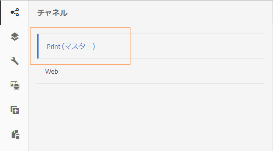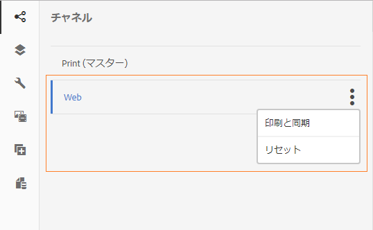

### 自動同期 {#autosync}

「Webチャネル用の印刷マ **[!UICONTROL スターとして使用」オプションを選択すると]** 、次のモードのいずれかを選択してWebチャネルを生成できます。

* **[!UICONTROL 自動レイアウト]**:このモードを選択すると、印刷チャネルからWebチャネル用のプレースホルダー、コンテンツ、データ連結が自動的に生成されます。
* **[!UICONTROL 手動で整理]**:このモードを選択すると、「データソース」タブにあるマスターコンテンツを使用して、印刷チャネルの要素を手動で選択し、Webチャネルに追加できます。 詳しくは、「印刷チャネル要素を選 [択してWebチャネルコンテンツを作成する」を参照してくださ](#selectprintchannelelements)い。

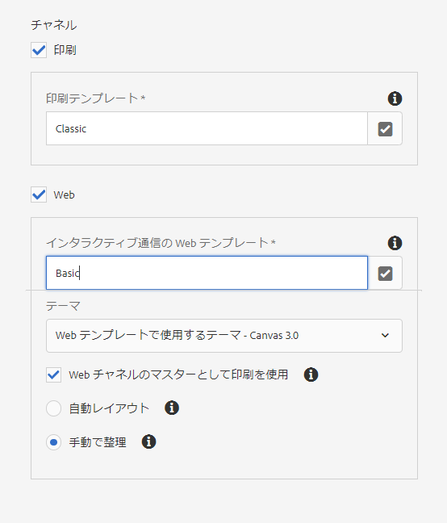

>[!NOTE]
>
>チャネルを同期すると、ドキュメントフラグメント、画像、条件、リスト、およびレイアウトフラグメントのみが印刷チャネルから Web チャネルに同期されます。このような要素を含むサブフォームまたは親ノードは同期されません。

### Webチャネルコンテンツを作成するには、印刷チャネル要素を選択します {#selectprintchannelelements}

インタラクティブ通信の作成時に「印刷」をマスターとして選択し、自動同期オプションを選択しない場合は、印刷チャネル要素をWebチャネルオーサリングインターフェイスにドラッグ&amp;ドロップすることもできます。

データソース **/マスタ** ーコンテンツに移動し **** 、印刷チャネル要素を表示します。 ターゲット領域、フィールドまたはテーブルをWebチャネルオーサリングインターフェイスにドラッグ&amp;ドロップします。 要素名の横の青い円のアイコンは、印刷チャネル要素が既にWebチャネルに含まれていることを示します。

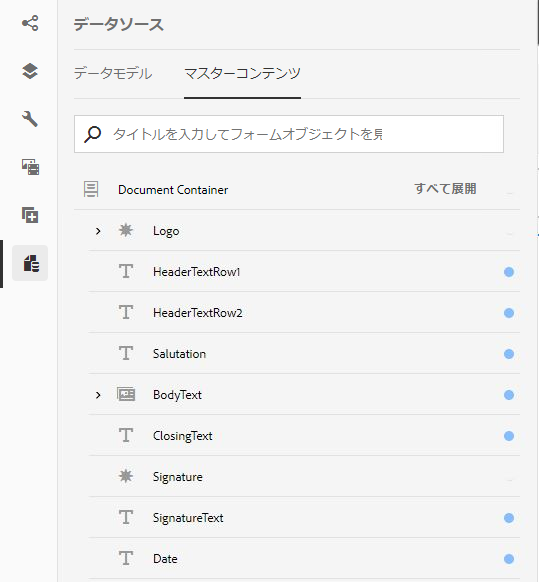

### 継承のキャンセル {#cancelinheritance}

Web チャネルでは、ターゲット領域内にコンポーネントが組み込まれます。

Hover over the relevant target area or variable in the web channel and select  (Cancel Inheritance) and then in the Cancel Inheritance dialog, tap **[!UICONTROL Yes]**.

ターゲット領域内でコンポーネントの継承がキャンセルされ、必要に応じてコンポーネントを編集できるようになります。

### 継承を再度有効にする {#re-enable-inheritance}

Web チャネルでコンポーネントの継承をキャンセルした場合は、その継承を再度有効にすることができます。To re-enable inheritance, hover over the boundary of the relevant target area, which includes the component, and tap .

継承を元に戻すためのダイアログが表示されます。

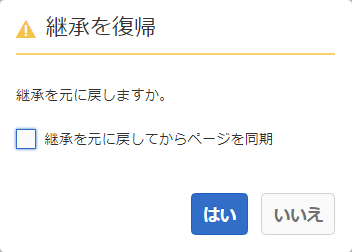

必要に応じて、「**[!UICONTROL 継承を元に戻してからページを同期]**」を選択します。インタラクティブ通信を全体的に同期する場合に、このオプションを選択してください。このオプションを選択しない場合、継承を元に戻すと、関連するターゲット領域のみが同期されます。

Tap **[!UICONTROL Yes]**.

### 同期 {#synchronize-1}

[Webチャネル用のマスタとして印刷]を使用し、印刷チャネルを変更する場合は、コンテンツを同期して新しく変更した内容をWebチャネルに反映させることができます。

1. Webチャネルをプリントチャネルと同期するには、Webチャネルに切り替えて、その他のオプションアイコンをタップします。

   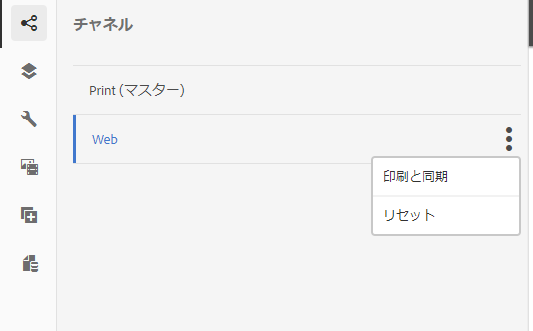

1. 以下に示すいずれかのオプションをタップします。

   * **[!UICONTROL 印刷と同期]**:継承がキャンセルされないターゲット領域のコンテンツのみを同期します。
   * **[!UICONTROL リセット]**:Webチャネルのコンテンツを印刷チャネルと同期し、Webチャネルに対して行われた変更をすべて破棄します。

### コンポーネントツールバーを使用して、継承されたコンポーネントに対してアクションを実行する {#componenttoolbar}

「同期」オプションを使用してWebチャネル内のコンテンツを自動生成した後は、継承をキャンセルせずに、コンポーネントに対してさらに多くのアクションを実行できます。

コンポーネントをタップして、次のオプションを表示します。

* **** コピー：コンポーネントをコピーして、Interactive Communicationの他の場所に貼り付けます。
* **** カット：インタラクティブ通信内でコンポーネントを別の場所に移動します。
* **** コンポーネントの挿入：選択したコンポーネントの上にコンポーネントを挿入します。
* **** 貼り付け：上記のオプションを使用して、切り取りまたはコピーしたコンポーネントを貼り付けます。
* **** グループ：複数のコンポーネントを一緒に切り取り、コピー、または貼り付ける場合は、複数のコンポーネントを選択します。
* **** 親：コンポーネントの親を選択します。
* **** SOM式の表示：コンポーネ [ントの](../../forms/using/using-som-expressions-adaptive-forms.md) SOM式を表示します。

* **** パネル内のオブジェクトをグループ化：コンポーネントをパネルにグループ化して、それらのコンポーネントに対する操作を同時に実行できるようにします。 詳しくは、パネルでのオブジェクト **[のグループ化を参照してください](../../forms/using/create-interactive-communication.md#main-pars-header-1815149576)**。

* **** 継承のキャンセル：ターゲ [ット領域内のコンポーネントの継承をキャンセルして](../../forms/using/create-interactive-communication.md#main-pars-header-103384010) 、コンポーネントを編集します。

### Group objects in Panel {#groupobjectspanel}

ウェブチャネルオーサリングインターフェイスは、コンポーネントをパネル内にグループ化し、これらのコンポーネントに対する操作を同時に実行できるようにする。 「コンテ **ンツ** 」タブには、グループ化されたコンポーネントがコンテンツツリー内のパネルの子要素として表示されます。

1. コンポーネントをタップし、「Group ( )」操作を選択します。
1. 複数のコンポーネントを選択し、パネルで「オ **ブジェクトをグループ化」をタップしま**&#x200B;す。

   

1. [パネル内 **のオブジェクトをグループ化** ]ダイアログボックスで、パネルの名前を入力します。
1. パネルのタイトルと説明（オプション）を入力します。
1. bullet_ 。

   グループ化されたコンポーネントは、パネルの子要素としてコンテンツツリーに表示されます。

   

