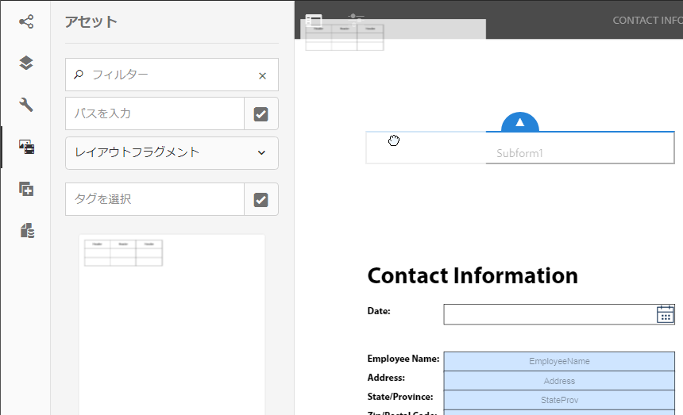

# インタラクティブ通信の作成{#create-an-interactive-communication}

## 概要 {#overview}

インタラクティブ通信を使用すると、各種のインタラクティブな通信記録の作成と配信を、カスタマイズされた安全な方法で一元的に管理することができます。印刷出力を Web 用のマスターチャネルとして使用することにより、インタラクティブ通信の Web 出力を作成する手間を大幅に省くことができます。

### 前提条件 {#prerequisites}

インタラクティブ通信を作成するための前提条件を以下に示します。

* テストデータまたは実際のデータソース（Microsoft® Dynamics インスタンスなど）を含んだ[フォームデータモデル](/help/forms/using/data-integration.md)が設定されていること。
* [ドキュメントフラグメント](/help/forms/using/document-fragments.md)が用意されていること。
* [印刷チャネルと web チャネルのテンプレート](/help/forms/using/web-channel-print-channel.md)が用意されていること。
* Web チャネルで必要な[テーマ](/help/forms/using/themes.md)が設定されていること。

## インタラクティブ通信の作成 {#createic}

1. AEM オーサーインスタンスにログインし、**[!UICONTROL Adobe Experience Manager]**／**[!UICONTROL フォーム]**／**[!UICONTROL フォームとドキュメント]**&#x200B;に移動します。
1. 「**[!UICONTROL 作成]**」をタップし、「**[!UICONTROL インタラクティブ通信]**」を選択します。インタラクティブ通信を作成ページが表示されます。

   

1. 以下の情報を入力します。：

   * **[!UICONTROL タイトル]**：インタラクティブ通信のタイトルを入力します。
   * **[!UICONTROL 名前]**：入力するタイトルが、インタラクティブ通信の名前として設定されます。必要な場合は、名前を編集します。
   * **[!UICONTROL 説明]**：インタラクティブ通信の説明を入力します。
   * **[!UICONTROL フォームデータモデル]**：フォームデータモデルを参照して選択します。フォームデータモデルについて詳しくは、[AEM Forms のデータ統合機能](/help/forms/using/data-integration.md)を参照してください。

   * **[!UICONTROL 事前入力サービス]**：データを取得してインタラクティブ通信に事前に入力するためのサービスを選択します。
   * **[!UICONTROL 後処理のタイプ]**：インタラクティブ通信の送信時にトリガーされる AEM ワークフローまたは Forms ワークフローを選択することができます。トリガーするワークフローのタイプを選択します。

   * **[!UICONTROL 後処理]**：トリガーするワークフローの名前を選択します。AEM ワークフローを選択した場合は、添付ファイルのパス、レイアウトのパス、PDF のパス、印刷データのパス、web データのパスを指定する必要があります。
   * **[!UICONTROL タグ]**：インタラクティブ通信に適用するタグを選択します。新しいタグ名またはカスタムのタグ名を入力して Enter キーを押すと、タグを作成できます。
   * **[!UICONTROL 作成者]**：ログインしたユーザーのユーザー名が、作成者の名前として自動的に設定されます。
   * **[!UICONTROL 公開日]**：インタラクティブ通信を公開する日付を入力します。
   * **[!UICONTROL 非公開日]**：インタラクティブ通信を非公開にする日付を入力します。

1. 「**[!UICONTROL 次へ]**」をタップします。印刷チャネルと web チャネルの詳細を指定するための画面が表示されます。
1. 以下を入力します。

   * **[!UICONTROL 印刷]**：インタラクティブ通信の印刷チャネルを生成する場合は、このオプションを選択します。
   * **[!UICONTROL 印刷テンプレート]**：印刷テンプレートとして使用する XDP を参照して選択します。
   * **[!UICONTROL Web]**：インタラクティブ通信の web チャネルまたはレスポンシブ出力を生成する場合は、このオプションを選択します。
   * **[!UICONTROL インタラクティブ通信の web テンプレート]**：web テンプレートを参照して選択します。
   * **[!UICONTROL テーマ]**&#x200B;と&#x200B;**[!UICONTROL テーマを選択]**：インタラクティブ通信の web チャネルのスタイルを設定するためのテーマを参照して選択します。詳しくは、「[AEM Forms のテーマ](/help/forms/using/themes.md)」を参照してください。

   * **[!UICONTROL Web チャネルのマスターとして印刷を使用]**：印刷チャネルに同期される web チャネルを作成する場合は、このオプションを選択します。印刷チャネルを Web チャネルのマスターとして使用すると、Web チャネルに連結されたコンテンツとデータが印刷チャネルから取得され、「同期」をタップしたときに、印刷チャネルに対する変更内容が Web チャネルに反映されます。ただし、作成者は、Web チャネル内の特定のコンポーネントについて、必要に応じて継承設定を解除することができます。詳しくは、[Web チャネルと印刷チャネルの同期](../../forms/using/create-interactive-communication.md#synchronize)を参照してください。
「**[!UICONTROL Web チャネルのマスターとして印刷を使用]**」を選択すると、次のモードのいずれかを選択して web チャネルを生成できます。

      * **[!UICONTROL 自動レイアウト]**：このモードを選択すると、印刷チャネルから web チャネル用のプレースホルダー、コンテンツおよびデータバインディングが自動的に生成されます。
      * **[!UICONTROL 手動で整理]**：このモードを選択すると、「**[!UICONTROL データソース]**」タブで使用できるプライマリコンテンツを使用して、印刷チャネル要素を手動で選択して web チャネルに追加できます。詳しくは、[印刷チャネル要素を選択して web チャネルコンテンツを作成する](#selectprintchannelelements)を参照してください。

   印刷チャネルと web チャネルについて詳しくは、[印刷チャネルと web チャネル](/help/forms/using/web-channel-print-channel.md)を参照してください。

1. 「**[!UICONTROL 作成]**」をタップします。インタラクティブ通信が作成され、警告ボックスが表示されます。インタラクティブ通信のコンテンツの作成を開始する場合は、「**[!UICONTROL 編集]**」をタップします。作成方法については、[インタラクティブ通信へのコンテンツの追加](#step2)を参照してください。または、インタラクティブ通信を後で編集する場合は、「**[!UICONTROL 完了]**」をタップします。

## インタラクティブ通信にコンテンツを追加する {#step2}

インタラクティブ通信を作成したら、インタラクティブ通信のオーサーリングインターフェイスを使用してコンテンツを作成できます。

インタラクティブ通信のオーサリングインターフェイスについて詳しくは、[インタラクティブ通信オーサリング UI の概要](/help/forms/using/introduction-interactive-communication-authoring.md)を参照してください。

1. 「編集」をタップすると、インタラクティブ通信のオーサリングインターフェイスが起動します（[インタラクティブ通信の作成](#createic)を参照）。または、AEM 上の既存のインタラクティブ通信に移動して選択し、「**[!UICONTROL 編集]**」をタップしてもかまいません。この場合も、インタラクティブ通信のオーサリングインターフェイスが起動します。

   インタラクティブ通信が web チャネル専用でない限り、インタラクティブ通信の印刷チャネルがデフォルトで表示されます。インタラクティブ通信の印刷チャネルには、選択した XDP テンプレートまたは印刷チャネルテンプレートで使用可能なターゲット領域が表示されます。これらのターゲット領域とフィールドで、コンポーネントやアセットを追加することができます。

1. 印刷チャネルを選択した状態で、「**[!UICONTROL コンポーネント]**」タブを選択します。印刷チャネルでは、以下のコンポーネントを使用することができます。

   | **コンポーネント** | **機能** |
   |---|---|
   | グラフ | インタラクティブ通信で使用できるグラフを追加して、フォームデータモデルのコレクションから取得された 2 次元のデータを視覚的に表現できます。詳しくは、[インタラクティブ通信内でグラフを使用する](/help/forms/using/chart-component-interactive-communications.md)を参照してください。 |
   | ドキュメントフラグメント | 再利用可能なコンポーネント（テキスト、リスト、条件など）をインタラクティブ通信に追加できます。インタラクティブ通信に追加する再利用可能なコンポーネントは、フォームデータモデルベースのコンポーネントでも、フォームデータモデルを持たないコンポーネントでもかまいません。 |
   | 画像 | 画像を挿入できるようにします. |

   コンポーネントをインタラクティブ通信にドラッグ＆ドロップし、それらのコンポーネントを必要に応じて設定します。

   また、印刷チャネルと web チャネルの両方について、インタラクティブ通信のオーサリング中に取り消し操作とやり直し操作を使用することもできます。

   最後に実行した操作を破棄するには取り消し操作を、破棄した操作を再度組み込むにはやり直し操作を使用します。例えば、インタラクティブ通信に画像を挿入したり、データバインディングを作成した後、それを破棄する必要がある場合は、取り消し操作を使用します。

   

   取り消しオプションとやり直しオプションは、オーサリング UI ページのツールバーに表示されます。取り消しオプションは、アクションを実行した後にのみ表示されます。やり直しオプションは、取り消し操作を行った後にのみページツールバーに表示されます。これらのアクションは、ページを更新するとリセットされます。

1. 印刷チャネルを選択した場合は、「**[!UICONTROL アセット]**」タブに移動して、必要なアセットだけを表示するためのフィルターを適用します。

   アセットブラウザーを使用して、インタラクティブ通信のターゲット領域にアセットを直接ドラッグ＆ドロップすることもできます。

   

1. ドキュメントフラグメントをインタラクティブ通信にドラッグアンドドロップします。以下の表に、インタラクティブ通信の印刷チャネルで使用できるドキュメントフラグメントのタイプを示します。

<table>
 <tbody>
  <tr>
   <td><strong>ドキュメントフラグメントタイプ</strong></td>
   <td><strong>用途の例</strong></td>
  </tr>
  <tr>
   <td><a href="/help/forms/using/texts-interactive-communications.md" target="_blank">テキスト</a></td>
   <td>住所、受信者のメールアドレス、レターの本文を追加するためのテキスト </td>
  </tr>
  <tr>
   <td><a href="/help/forms/using/conditions-interactive-communications.md" target="_blank">条件</a></td>
   <td>ポリシーのタイプ（標準またはプレミアム）に基づいて、適切なヘッダー画像を通信に追加するための条件。<br /> </td>
  </tr>
  <tr>
   <td>リスト</td>
   <td>ドキュメントフラグメント（テキスト、条件、その他のリスト、画像など）のグループです。<br /> </td>
  </tr>
 </tbody>
</table>

「**[!UICONTROL アセット]**」タブを使用して新しいフラグメントをターゲット領域にドロップすることで、ターゲット領域とドキュメントフラグメントの連結を置き換えることもできます。フラグメントをドラッグしているときのターゲット領域の青色の網掛けは、ドキュメントフラグメントをそのターゲット領域にドロップできることを示します。

ドキュメントフラグメントについて詳しくは、[ドキュメントフラグメント](/help/forms/using/document-fragments.md)を参照してください。

オーサリングインターフェイスを使用すると、インタラクティブ通信内で連結されたフィールドや変数と連結されていないフィールドや変数を区別できます。インターフェイスでは、オレンジ色の境界線を使用して、連結されていないフィールドや変数が強調表示されます。


さらに、これらの要素の上にマウスを置くと、連結されていないフィールドや変数のメッセージがツールヒントに表示されます。

ドキュメントフラグメントで使用される非連結の変数は、オーサリングインターフェイスに表示されない場合があります。これは、ドキュメントフラグメント内のインラインテキストルールが原因であるか、または条件フラグメントの場合に発生する可能性があります。このような場合、青色で強調表示されたツールヒントがドキュメントフラグメントの一部として表示されます。ドキュメントフラグメント内で使用されている、非連結変数の数がツールヒントに表示されます。


ドキュメントフラグメントをタップして （設定）をタップし、インタラクティブ通信のサイドキックから「**[!UICONTROL プロパティ]**」をタップします。「**[!UICONTROL 変数とデータモデルオブジェクト]**」セクションには、非表示の変数を含む変数と、ドキュメントフラグメントで使用されるデータモデルオブジェクトが一覧表示されます。各データモデルオブジェクトまたは変数の横にある「」（編集）アイコンを使用して、プロパティを編集します。

1. 変数の連結を設定するには、変数をタップして （設定）アイコンを選択し、サイドバーのプロパティパネルで連結プロパティを設定します。

   * **なし**：このプロパティを選択すると、エージェントによって変数の値が設定されます。
   * **テキストフラグメント**：このプロパティを選択すると、フィールド内でコンテンツがレンダリングされるテキストドキュメントフラグメントを参照して選択できるようになります。変数に連結できるのは、内部に変数を持たないテキストドキュメントフラグメントのみです。
   * **データモデルオブジェクト**：フィールド内に値を取り込むフォームデータモデルのプロパティを選択します。
   * **デフォルト値：**&#x200B;このフィールドを使用して、変数のデフォルト値を定義できます。この値は、インタラクティブ通信のプレビュー時、またはエージェント UI に表示されます。
   * **表示パターン：**&#x200B;変数の表示形式を定義することもできます。変数に表示形式を適用するには、**タイプ**&#x200B;ドロップダウンリストから事前定義されたオプションのいずれかを選択します。「**カスタム**」を選択すると、リストにない表示パターンを定義できます。詳しくは、[データの表示パターン](../../forms/using/create-interactive-communication.md#datadisplaypatterns)を参照してください。

   「[変数とデータモデルオブジェクト](../../forms/using/create-interactive-communication.md#hiddenvariables)」に移動して、ドキュメントフラグメント内の非表示変数の連結を設定します。

   データソース要素またはテキストドキュメントフラグメントをドラッグ＆ドロップして、変数の連結を設定することもできます。いずれかのデータソース要素との連結を作成するには、「**データソース**」タブを選択して、要素を変数名にドラッグ＆ドロップします。連結を正しく設定するには、データソース要素と変数が同じタイプである必要があります。連結済みの変数にデータソース要素をドラッグ＆ドロップすると、新しい要素で前の要素が置き換わり、変数を使用した新しい連結を作成されます。同様に、「**アセット**」タブを選択し、テキストドキュメントフラグメントを変数名にドラッグ＆ドロップして、それらの間に連結を設定します。テキストドキュメントフラグメントには変数を含めないようにする必要があります。

1. テーブルを追加するには、印刷チャネルを選択した状態で、レイアウトフラグメントだけを表示するためのフィルターを「**[!UICONTROL アセット]**」タブで適用します。次に、必要なレイアウトフラグメントをインタラクティブ通信にドラッグアンドドロップします。レイアウトフラグメントは、XDP をベースとしています。レイアウトフラグメントを使用して、動的データが入力されるインタラクティブ通信で、グラフィカルレイアウト、静的なテーブル、動的なテーブルを作成することができます。

   例えば、新しいポリシーと古いポリシーで、保険料の総額、特別割引率（%）、緊急ロードサイドサービスを表示するためのレイアウトテーブルを作成することができます。

   レイアウトフラグメントについて詳しくは、[ドキュメントフラグメント](/help/forms/using/document-fragments.md)を参照してください。

1. 印刷チャネルを選択した状態で、画像を表示するためのフィルターを「**[!UICONTROL アセット]**」タブで適用します。必要な画像（会社のロゴなど）をインタラクティブ通信にドラッグ＆ドロップします。

   また、インタラクティブ通信で以下の操作を行います。

   * [グラフの追加と設定](/help/forms/using/chart-component-interactive-communications.md)
   * [Web チャネルと印刷チャネルの同期](../../forms/using/create-interactive-communication.md#synchronize)

      * 自動同期
      * 継承のキャンセル
      * 継承を再度有効にする
      * 同期
   * [添付ファイルとライブラリへのアクセス](../../forms/using/create-interactive-communication.md#attachmentslibrary)
   * [XDP またはレイアウトフィールドのプロパティの設定](../../forms/using/create-interactive-communication.md#xdplayoutfieldproperties)
   * [コンポーネントへのルールの追加](../../forms/using/create-interactive-communication.md#rules)


1. **[!UICONTROL Web チャネル]**&#x200B;に切り替えます。インタラクティブ通信エディターに web チャネルが表示されます。初めて印刷チャネルから web チャネルに切り替えた場合、自動同期処理が実行されます。詳しくは、[印刷チャネルから web チャネルを同期する](../../forms/using/create-interactive-communication.md#synchronize)を参照してください。

   この例では、Web チャネルのマスターとして印刷チャネルを使用しているため、印刷チャネルのプレースホルダー、コンテンツ、データ連結が Web チャネルに同期されます。一方、web チャネルの特定のコンテンツを必要に応じてカスタマイズすることもできます。コンテンツをカスタマイズできるようにするには、印刷チャネルを使用して生成されたターゲット領域および変数の[継承をキャンセル](#cancelinheritance)します。

   

   ドキュメントフラグメントをタップして （設定）をタップし、インタラクティブ通信のサイドキックから「**[!UICONTROL プロパティ]**」をタップします。「**[!UICONTROL 変数とデータモデルオブジェクト]**」セクションには、ドキュメントフラグメントで使用される変数（非表示の変数を含む）とデータモデルオブジェクトの一覧が表示されます。プロパティを編集するには、各データモデルオブジェクトまたは変数の横にある （編集）アイコンを使用します。さらに、印刷チャネルを使用して web チャネルで[自動生成](#synchronize)されたドキュメントフラグメントの場合、各データモデルオブジェクトおよび変数の横にある （継承のキャンセル）アイコンを使用すると、[継承をキャンセル](#cancelinheritance)して編集することができます。

1. Web チャネルにコンポーネントを追加するには、Web チャネルを選択した状態で「**[!UICONTROL コンポーネント]**」をタップします。必要に応じて、インタラクティブ通信の web チャネルにコンポーネントをドラッグアンドドロップし、そのコンポーネントの設定を行います。

   | コンポーネント | 機能 |
   |---|---|
   | グラフ | インタラクティブ通信で使用できるグラフを追加すると、フォームデータモデルのコレクションから取得した 2 次元データを視覚的に表現することができます。詳しくは、[グラフコンポーネントの使用](../../forms/using/chart-component-interactive-communications.md)を参照してください。 |
   | ドキュメントフラグメント | 再利用可能なコンポーネント、テキスト、リスト、条件をインタラクティブ通信に追加することができます。インタラクティブ通信に追加する再利用可能なコンポーネントは、フォームデータモデルベースのコンポーネントでも、フォームデータモデルを持たないコンポーネントでもかまいません。 |
   | 画像 | 画像を挿入できるようにします. |
   | パネル | [パネル](../../forms/using/create-interactive-communication.md#add-panel-component-to-the-web-channel)をインタラクティブ通信に追加することができます。 |
   | テーブル | 行と列にデータを整理できるテーブルを追加します。 |
   | ターゲット領域 | Web チャネル固有のコンポーネントを整理するためのターゲット領域を、その Web チャネルに挿入することができます。ターゲット領域は、Web チャネル固有のコンポーネントをグループ化するためのプレーンコンテナです。 |
   | テキスト | インタラクティブ通信の Web チャネルにリッチテキストを追加することができます。追加したテキストでフォームデータオブジェクトを使用して、動的なコンテンツを作成することもできます。 |
   | ボタン | [ボタン](../../forms/using/create-interactive-communication.md#add-button-component-to-the-web-channel)をインタラクティブ通信に追加することができます。ボタンコンポーネントを使用すると、別のインタラクティブ通信、アダプティブフォーム、その他のアセット（画像やドキュメントフラグメントなど）、または外部 URL に移動することができます。 |
   | 区切り文字 | インタラクティブ通信内に水平線を挿入できます。このコンポーネントは、通信内のセクションを区切るために使用します。例えば、セパレーターコンポーネントを使用して、クレジットカード明細書の顧客情報セクションとクレジットカード詳細情報セクションを区切ることができます。 |

1. 必要に応じて、Web チャネルにアセットを挿入します。

   [インタラクティブ通信のプレビューを表示](#previewic)してインタラクティブ通信の印刷出力と Web 出力の外観を確認し、必要に応じてさらに編集を行うことができます。

## インタラクティブ通信のプレビュー表示 {#previewic}

**「プレビュー」オプション**&#x200B;を使用して、インタラクティブ通信の外観を確認することができます。インタラクティブ通信の web チャネルには、各種のデバイスでインタラクティブ通信の操作性をエミュレートするためのオプションも用意されています。例えば、iPhone、iPad、デスクトップパソコンなどのデバイスについて、エミュレーションを行うことができます。「**プレビュー**」オプションと「**エミュレーター**」  オプションを組み合わせて使用することにより、画面サイズの異なるデバイスの web 出力をプレビュー表示することができます。プレビュー画面に表示されるサンプルデータは、指定したフォームデータモデルから取得されます。

1. プレビュー表示する印刷チャネルまたは Web チャネルを選択して「プレビュー」をタップします。インタラクティブ通信が表示されます。

   >[!NOTE]
   >
   >プレビュー画面には、指定したフォームデータモデルのサンプルデータが表示されます。サンプルデータ以外のデータまたは事前入力サービスを使用してインタラクティブ通信のプレビューを表示する方法については、[フォームデータモデルの使用](/help/forms/using/using-form-data-model.md)と[フォームデータモデルの操作](/help/forms/using/work-with-form-data-model.md)を参照してください。

1. Web チャネルの場合、を使用して、各種デバイスにおけるインタラクティブ通信の外観を確認します。

   

さらに、[エージェント UI を使用してインタラクティブ通信の準備と送信を行う](/help/forms/using/prepare-send-interactive-communication.md)こともできます。

## インタラクティブ通信でのプロパティの設定  {#configure-properties-in-interactive-communication}

### 添付ファイルとライブラリへのアクセス {#attachmentslibrary}

印刷チャネルでは、添付ファイルとライブラリへのアクセスを設定して、インタラクティブ通信の添付ファイルをエージェント UI で管理することができます。

1. 印刷チャネルでドキュメントコンテナをハイライト表示して、「**プロパティ**」をタップします。

   

   サイドバーにプロパティパネルが表示されます。

   

1. 「**添付ファイル**」を展開し、以下のプロパティを指定します。

   * **[!UICONTROL ライブラリのアクセスを許可]**：エージェント UI でエージェントによるライブラリへのアクセスを許可する場合は、このプロパティを選択します。このプロパティを選択すると、インタラクティブ通信の準備を行う際に、エージェントを使用してライブラリ内のファイルを追加できるようになります。
   * **[!UICONTROL 添付ファイルの順番の変更を許可]**：インタラクティブ通信の添付ファイルの順序を変更できるようにするには、このプロパティを選択します。
   * **[!UICONTROL 許可される添付ファイルの最大数]**：インタラクティブ通信で許可される添付ファイルの最大数を指定します。
   * **[!UICONTROL 添付するファイル]**：「**[!UICONTROL 追加]**」をタップして、添付するファイルを参照して選択します。次に、以下のオプションを指定します。

      * **[!UICONTROL デフォルトでドキュメントにこのファイルを添付する]**：ファイルの添付が必須でない場合のみ、このオプションを変更することができます。
      * **[!UICONTROL 必須]**：このオプションを選択すると、エージェント UI で添付ファイルを削除できなくなります。

   

1. 「**[!UICONTROL 完了]**」をタップします。

### XDP またはレイアウトフィールドのプロパティの設定 {#xdplayoutfieldproperties}

1. インタラクティブ通信の印刷チャネルを編集する際、印刷チャネルテンプレート内のフィールドにカーソルを置いて （設定）を選択します。

   サイドバーにプロパティダイアログが表示されます。

   

1. 以下のプロパティを指定します。

   * **[!UICONTROL 名前]**：JCR ノードの名前。
   * **[!UICONTROL タイトル]**：タイトルを入力します。ここで入力したタイトルは、エージェント UI とドキュメントコンテナツリーに表示されます。
   * **[!UICONTROL 連結タイプ]**：フィールドの連結タイプとして、以下のいずれかを選択します。

      * なし：このプロパティを選択すると、エージェントによってプロパティの値が設定されます。
      * テキストフラグメント：このプロパティを選択すると、フィールド内でコンテンツがレンダリングされるテキストドキュメントフラグメントを参照して選択できるようになります。または、テキストドキュメントフラグメントをフィールド名にドラッグ＆ドロップして、両者の間の連結を設定します。テキストドキュメントフラグメントには変数を含めないようにする必要があります。
      * データモデルオブジェクト：フィールド内に値を取り込むデータモデルプロパティを選択します。また、「**データソース**」タブを選択して、プロパティをフィールドにドラッグ＆ドロップします。
   * **[!UICONTROL デフォルト値]**：指定したデータモデルオブジェクトまたはテキストフラグメントでフィールドの値を設定しなかった場合、そのフィールドにデフォルト値が設定されます。データ連結のタイプを「なし」に設定すると、フィールドにデフォルト値が設定されます。
   * **[!UICONTROL 表示パターン]**：フィールドの表示形式を定義できます。**タイプ**&#x200B;のドロップダウンリストから事前定義されたオプションを選択し、表示形式をフィールドに適用します。リストにない表示パターンを定義する場合は、「**カスタム**」を選択します。詳しくは、[データ表示パターン](../../forms/using/create-interactive-communication.md#datadisplaypatterns)を参照してください。

   * **[!UICONTROL エージェントによる編集が可能]**：エージェント UI のフィールド値をエージェントを使用して編集できるようにするには、このオプションを選択します。「連結タイプ」として「テキストフラグメント」を選択した場合、この設定は適用されません。
   * **[!UICONTROL ラベル]**：フィールドと共にエージェント UI に表示されるテキスト文字列を指定します。「連結タイプ」として「テキストフラグメント」を選択した場合、この設定は適用されません。
   * **[!UICONTROL ツールヒント]**：エージェント UI でエージェントにマウスを置いたときに表示されるテキスト文字列を入力します。「連結タイプ」として「テキストフラグメント」を選択した場合、この設定は適用されません。
   * **[!UICONTROL 必須]**：フィールドを入力必須にするには、このオプションを選択します。「連結タイプ」として「テキストフラグメント」を選択した場合、この設定は適用されません。
   * **[!UICONTROL 複数行]**：フィールドに複数行のテキストを入力できるようにするには、このオプションを選択します。「連結タイプ」として「テキストフラグメント」を選択した場合、この設定は適用されません。


1.  をタップします。

### データ表示パターン {#datadisplaypatterns}

オーサリングインターフェイスを使用すると、印刷チャネルと web チャネル向けのインタラクティブ通信を作成時に使用できる、フィールド、変数、フォームデータモデル要素のデータ表示パターンを定義できます。

データ表示パターンを設定するには、要素をタップして （設定）を選択し、サイドバーの&#x200B;**[!UICONTROL プロパティ]**&#x200B;パネルで表示パターンを設定します。**[!UICONTROL タイプ]**&#x200B;のドロップダウンリストから事前定義されたオプションを選択して、選択したタイプに関連付けられたパターンを表示します。リストにないパターンを定義するには、**[!UICONTROL タイプ]**&#x200B;のドロップダウンリストから「**[!UICONTROL カスタム]**」を選択します。「**[!UICONTROL パターン]**」フィールドの値を編集すると、タイプは自動的に「**[!UICONTROL カスタム]**」に変更されます。

表示パターンを適用するためには、「パターン」フィールドで定義された文字数または桁数は、フィールド、変数、フォームデータモデル要素の値で定義された文字数または桁数以上でなければなりません。詳しくは、[例](../../forms/using/create-interactive-communication.md#greaternumberofdigits)を参照してください。


印刷チャネルから web コンテンツを生成した後に、フィールド、変数、またはフォームデータモデル要素の表示パターンを再定義できます。その結果、要素の表示パターンは印刷チャネルと web チャネルで別に定義できます。印刷チャネルの要素と、印刷チャネルを利用して自動生成された web コンテンツに表示パターンが定義されていない場合、印刷チャネルの要素に定義されたデータ連結により、「**[!UICONTROL タイプ]**」ドロップダウンリストに使用できる表示パターンが定義されます。要素に対して連結が定義されていない場合、要素のデータタイプにより使用可能な表示パターンオプションが定義されます。例えば、印刷チャネルの要素に数値型のデータ連結を作成した場合、「**[!UICONTROL タイプ]**」ドロップダウンリストで使用できる表示パターンオプションは各種の数値型のオプションとなります。

**プレビュー**&#x200B;モードに切り替えるか、エージェント UI を開くと、これらの要素に適用された表示パターンを表示できます。

次の表には、変数のデータ表示パターンを設定した結果として表示される値の例が記載されています。

| タイプ | デフォルト値 | 表示パターン | 表示値 | 説明 |
|---|---|---|---|---|
| 社会保障番号 | 123456789 | text{999-99-9999} | 123-45-6789 | デフォルト値のフィールドの桁数が「パターン」フィールドの桁数と一致しています。パターンに基づく値は正常に表示されます。 |
| 社会保障番号 | 1234567 | text{999-99-9999} | 1-23-4567 | デフォルト値のフィールドの桁数が「パターン」フィールドの桁数より少なくなっています。パターンは使用可能な 7 桁に適用されます。 |
| 社会保障番号 | 1234567890 | text{999-99-9999} | 1234567890 | デフォルト値のフィールドの桁数が「パターン」フィールドの桁数より多くなっています。その結果、表示値は変わりません。 |

変数やフォームデータモデル要素に表示パターンが指定されていない場合、[グローバルドキュメントフラグメント設定](https://helpx.adobe.com/jp/experience-manager/6-5/forms/using/interactive-communication-configuration-properties.html)がデフォルトで使用されます。

数値データ型の変数に表示パターンを適用しない場合、印刷プレビューではグローバルドキュメントフラグメント設定に従ったパターンが表示されます。デフォルトのグローバルドキュメントフラグメント設定に変更を適用すると、エージェント UI にはロケールで定義されたデフォルトのセパレーターに従ったパターンが引き続き表示されます。

同様に、フィールドについても、表示パターンが指定されていない場合、印刷テンプレート（XDP）の作成時に定義されたパターンがフィールドに適用されます。印刷テンプレートの作成時にパターンが定義されていない場合、XFA 仕様に基づくデフォルトのパターンがフィールドに適用されます。

さらに、指定された表示パターンが誤っているか、適用できない場合、XFA 使用に基づくデフォルトのパターンがフィールド、変数、フォームデータモデル要素に適用されます。

## インタラクティブ通信のコンポーネントにルールを適用する {#rules}

インタラクティブ通信のコンポーネントやコンテンツに条件を設定するには、目的のコンポーネントまたはコンテンツをタップし、（ルール作成）を選択してルールエディターを起動します。

詳しくは、次を参照してください。

* [ルールエディター](/help/forms/using/rule-editor.md)
* [インタラクティブ通信オーサリング の概要](/help/forms/using/introduction-interactive-communication-authoring.md)

## テーブルの使用 {#tables}

### インタラクティブ通信の動的テーブル {#dynamic-tables-in-interactive-communication}

レイアウトフラグメントを使用して、インタラクティブ通信に動的なテーブルを追加することができます。以下の手順では、クレジットカードの取引明細を例として、レイアウトフラグメントを使用して、インタラクティブ通信内に動的なテーブルを作成する方法について説明します。

1. テーブルを作成するために必要なレイアウトフラグメントが AEM で使用可能な状態になっていることを確認します。
1. インタラクティブ通信の印刷チャネルで、複数列のテーブルが含まれているレイアウトフラグメントを、アセットブラウザーからターゲット領域にドラッグ＆ドロップします。

   

   インタラクティブ通信のレイアウト領域にテーブルが表示されます。

   

1. テーブル内のセルごとに、データ連結を指定します。繰り返し可能な行を作成するには、フォームデータモデルのプロパティを、共通コレクションプロパティに属する行に挿入します。

   1. テーブル内のセルをタップして （設定）を選択します。

      サイドバーにプロパティダイアログが表示されます。

      

   1. 以下のプロパティを設定します。

      * **[!UICONTROL 名前]**：JCR ノードの名前。
      * **[!UICONTROL タイトル]**：タイトルを入力します。ここで入力したタイトルは、インタラクティブ通信エディターに表示されます。
      * **[!UICONTROL 連結タイプ]**：フィールドの連結タイプとして、以下のいずれかを選択します。

         * **[!UICONTROL なし]**
         * **[!UICONTROL データモデルオブジェクト]**：フォームデータモデルのプロパティ値がフィールド内に取り込まれます。または、「**データソース**」タブを選択し、プロパティをフィールドにドラッグ＆ドロップします。
      * **[!UICONTROL データモデルオブジェクト]**：フィールド内に値を取り込むフォームデータモデルプロパティを選択します。
      * **[!UICONTROL デフォルト値]**：指定したデータモデルオブジェクトでフィールドの値を設定しなかった場合、そのフィールドが空にならないようにデフォルト値が設定されます。デフォルト値は、フィールド内に取り込まれます。 

      * **[!UICONTROL エージェントによる編集が可能]**：エージェント UI のフィールド値をエージェントを使用して編集できるようにするには、このオプションを選択します。
   1.  をタップします。


1. インタラクティブ通信のプレビューを表示して、データを使用してレンダリングされたテーブルを確認します。

   

### Web チャネル専用テーブル {#webchanneltables}

Web テンプレートのルートパネルをタップして「**+**」をタップし、インタラクティブ通信に&#x200B;**テーブル**&#x200B;コンポーネントを追加します。インタラクティブ通信に、2 行のテーブルが挿入されます。テーブルの最初の行は、テーブルヘッダーを表します。

#### テーブルへの行と列の追加 {#addrowscolumnstable}

**列の追加または削除：**

1. テーブルヘッダー行のデフォルトのテキストボックスをタップして、コンポーネントツールバーを表示します。
1. テーブルの列を追加または削除するには、「**列の追加**」または「**列の削除**」をそれぞれ選択します。


**行の追加または削除：**

1. テーブルの行のいずれかをタップして、コンポーネントツールバーを表示します。インタラクティブ通信のサイドキックにあるコンテンツブラウザーを使用して、テーブルの行を選択することもできます。
1. テーブルの行を追加または削除するには、「**行の追加**」または「**行の削除**」をそれぞれ選択します。ツールバーで使用可能な「**上へ移動**」および「**下へ移動**」オプションを使用して、テーブルの行を再配置します。


**A.** 行を追加 **B.** 行を削除 **C.** 上へ移動 **D.** 下へ移動

#### テーブルのセルでテキストを追加または編集 {#addedittexttable}

1. テーブルのセルでデフォルトのテキストボックスを選択し、「」（編集）をタップします。
1. テーブルのセルにテキストを入力し、 をタップして保存します。

#### テーブルセルとデータモデルオブジェクト要素の間に連結を作成 {#createbindingtablecells}

1. テーブルの行にあるデフォルトのテキストボックスを選択して、（編集）をタップします。
1. データモデルオブジェクトのドロップダウンリストをタップして、プロパティを選択します。
1. 「保存」をタップして、テーブルセルとデータモデルオブジェクトプロパティ間の連結を作成します。


#### テーブルセルのテキストにハイパーリンクを作成 {#createhyperlinktable}

1. テーブルのセルにあるデフォルトのテキストボックスを選択して、（編集）をタップします。
1. テーブルセルのテキストを選択して、ハイパーリンクアイコンをタップします。
1. **パス**&#x200B;フィールドで URL を指定します。
1.  をタップして、ハイパーリンクのプロパティを保存します。


#### 動的テーブルを作成 {#createdynamictables}

コレクションタイプのデータモデルプロパティを使用して、インタラクティブ通信内に web チャネル専用の動的なテーブルを作成できます。こうしたテーブルにより、コレクションプロパティの子プロパティを表示することができます。編集できるのは、テーブル内のセルの書式設定プロパティだけです。

1. Web チャネルに切り替えて、データソースブラウザーを表示します。
1. コレクションプロパティをサブフォームにドラッグアンドドロップします。サブフォーム内にテーブルが作成されます。
1. インタラクティブ通信の Web チャネル内のテーブルをプレビュー表示します。

#### テーブルの列の並べ替え {#sortcolumns}

インタラクティブ通信では、テーブル中の任意の列を基準にデータを並べ替えることができます。列の値は、昇順または降順で並べ替えることができます。

並べ替えは、以下の項目を含むテーブルの列に適用できます。

* 静的テキスト
* データモデルオブジェクトプロパティ
* 静的テキストとデータモデルオブジェクトプロパティの組み合わせ

並べ替えを有効にするには、以下の手順を実行します。

1. テーブルを選択し、（設定）をタップします。インタラクティブ通信のサイドキックにある&#x200B;**コンテンツ**&#x200B;ブラウザーを使用して、テーブルを選択することもできます。
1. 「**並べ替えを有効にする**」を選択します。
1.  をタップして、テーブルのプロパティを保存します。列ヘッダー内の並べ替えアイコンの上向き矢印と下向き矢印は、並べ替えが有効になっていることを表します。

   

1. **プレビュー**&#x200B;モードに切り替えて、出力を表示します。テーブルは、テーブルの最初の列に基づいて自動的に並べ替えられます。
1. 列ヘッダーをクリックして、列に基づいて値を並べ替えます。

   上向き矢印の付いた列見出しには、次の意味があります。

   * テーブルは、その列を基準に並べ替えられます。
   * 列の値が昇順で表示されています。

   

   同様に、下向き矢印の付いた列見出しは、列内の値が降順で表示されていることを表します。

## インタラクティブ通信のプロパティを編集 {#edit-interactive-communication-properties}

インタラクティブ通信を作成すると、後でそのプロパティを編集できます。

**プロパティ**&#x200B;ページを使用して、次の操作を行うことができます。

* インタラクティブ通信の作成中に指定したフィールドの値（タイトル、説明など）を編集します。
* 既存のインタラクティブ通信の web チャネルを追加または削除します。
* インタラクティブ通信をプレビュー、ダウンロード、または削除
* [エージェント UI](/help/forms/using/prepare-send-interactive-communication.md) を開きます。

**プロパティ**&#x200B;ページにアクセスするには：

1. AEM オーサーインスタンスにログインし、**Adobe Experience Manager**／**フォーム**／**フォームとドキュメント**&#x200B;に移動します。
1. 「インタラクティブ通信」を選択して、「**プロパティ**」をタップします。
1. 「**一般**」タブを選択して、「**タイトル**」と「 **説明**」フィールドを編集します。

### Web チャネルを追加または削除 {#add-or-delete-the-web-channel}

次の手順を実行して、既存のインタラクティブ通信用の web チャネルを追加します。

1. **プロパティ**&#x200B;ページで、「**チャネル**」タブを選択します。
1. 「 **Web**」チェックボックスをオンにして、web チャネルのテンプレートを選択します。
1. 「 **Web チャネルのマスターとして印刷を使用**」を選択して、web チャネルと印刷チャネル間の同期を有効にします。 
1. 「**保存して閉じる**」をタップして、変更内容を保存します。

   同様に、「**チャネル**」タブの「**Web**」チェックボックスをタップすると、インタラクティブ通信から web チャネルを削除できます。

## Web チャネルにボタンコンポーネントを追加 {#add-button-component-to-the-web-channel}

インタラクティブ通信の web チャネルに、ボタンをコンポーネントとして追加できます。[ルールエディター](../../forms/using/rule-editor.md)を使用してルールを定義すると、ボタンをタップするだけで、他のインタラクティブ通信、アダプティブフォーム、画像やドキュメントフラグメントなどのその他のアセット、または外部 URL に移動できます。

ボタンを追加してルールを定義するには：

1. Web テンプレートのルートパネルをタップし、「**+**」をタップして&#x200B;**ボタン**&#x200B;コンポーネントをインタラクティブ通信に追加します。
1. ボタンコンポーネントをタップし、「」をタップしてボタンをタップしたときのルールを定義します。
1. 「**条件**」セクションで、ボタンの状態のドロップダウンリストから「**クリック済み**」を選択します。
1. 「**次に**」セクションで以下を実行します。

   1. ドロップダウンリストからアクションを選択します。例えば、アクションタイプとして「**次に移動**」を選択します。

   1. インタラクティブ通信、アダプティブフォーム、アセット、または web ページの URL を指定します。例えば、別のインタラクティブ通信に移動するには、次の形式で URL を指定します。https://&lt;server-name>:&lt;port>/editor.html/content/forms/af/&lt;Interactive Communication name>/channels/&lt;channel name - print or web>.html
   1. アセットを同じタブ、新しいタブ、または新しいウィンドウで開くオプションを指定します。
   1. **完了**／**閉じる**&#x200B;をタップして、ルールを保存します。

   同様に、 「サービスの呼び出し 」 や 「フォームの送信 」 など、アクションタイプのドロップダウンリストから他の使用可能なオプションを選択できます。詳しくは、[ルールエディター](../../forms/using/rule-editor.md)を参照してください。

1. インタラクティブ通信をプレビューしてボタンをタップし、手順 4（b）で指定したインタラクティブ通信、アダプティブフォーム、アセット、または web ページを表示します。

## Web チャネルへのパネルコンポーネントの追加 {#add-panel-component-to-the-web-channel}

パネルコンポーネントは、他のコンポーネントをグループ化するためのプレースホルダーです。パネルコンポーネントにより、インタラクティブ通信内でのコンポーネントグループ（アコーディオンやタブなど）の配置方法が制御されます。パネルコンポーネントを使用して、エンドユーザーが繰り返し使用できるコンポーネントグループ（学歴を入力するための複数のエントリなど）を作成することもできます。

次の手順を実行して、パネルコンポーネントを web チャネルに追加します。

1. 次のいずれかのオプションを使用して、web チャネルに&#x200B;**パネル**&#x200B;コンポーネントを挿入します。

   * コンポーネントをタップしてから「**+**」をタップし、**パネル**&#x200B;コンポーネントを選択します。

   * **コンポーネント**&#x200B;ブラウザーパネルから、インタラクティブ通信の&#x200B;**パネル**&#x200B;コンポーネントをドラッグ＆ドロップします。

   * **コンテンツ**&#x200B;ブラウザーパネルの「**パネル**」をタップしてから、「**子パネルを追加l**」をタップします。「**子パネルを追加**」オプションを選択すると、「**子パネルを追加l**」ダイアログボックスが表示されます。パネルコンポーネントのタイトルと、オプションで説明と名前を入力します。

1. コンポーネントの設定、ルール編集、コピー、削除、挿入などの追加アクションをパネルで実行するには、**コンテンツ**&#x200B;ブラウザーからパネルをタップします。

   また、 **コンテンツ**&#x200B;ブラウザー内でパネルをドラッグ＆ドロップして、右側のペインにあるインタラクティブ通信の構造の変更を反映させることもできます。

## Web チャネルと印刷チャネルの同期 {#synchronize}

インタラクティブ通信の作成時に、「Web チャネルのマスターとして印刷」を選択すると、web チャネルは印刷チャネルと同期して作成され、web チャネルのコンテンツとデータバインディングは印刷チャネルから取得されます。印刷チャネルに対する変更内容は「同期」をタップすると web チャネルに反映されます。

ただし、作成者は、Web チャネル内のコンポーネントについて、必要に応じて継承設定を解除することができます。

 

### 自動同期 {#autosync}

「**[!UICONTROL Web チャネルのマスターとして印刷を使用]**」オプションを選択した場合は、次のいずれかのモードを選択して web チャネルを生成できます。

* **[!UICONTROL 自動レイアウト]**：このモードを選択すると、印刷チャネルから web チャネルのプレースホルダー、コンテンツ、およびデータバインディングが自動的に生成されます。
* **[!UICONTROL 手動で整理]**：このモードを選択すると、「データソース 」タブで使用可能なマスターコンテンツを使用して、印刷チャネル要素を手動で選択して web チャネルに追加できます。詳細については、[印刷チャネル要素を選択して web チャネルコンテンツを作成する](#selectprintchannelelements)を参照してください。


>[!NOTE]
>
>チャネルを同期すると、ドキュメントフラグメント、画像、条件、リスト、およびレイアウトフラグメントのみが印刷チャネルから Web チャネルに同期されます。このような要素を含むサブフォームまたはその親ノードは同期されません。

### Web チャネルコンテンツを作成する印刷チャネルの要素を選択する {#selectprintchannelelements}

インタラクティブ通信の作成時に印刷をマスターとして選択し、自動同期オプションを選択しなかった場合、印刷チャネル要素を web チャネルオーサリングインターフェイスにドラッグ＆ドロップすることもできます。

**データソース**／**マスターコンテンツ**&#x200B;に移動し、印刷チャネル要素を表示します。ターゲットの領域、フィールド、もしくはテーブルを web チャネルオーサリングインターフェイスにドラッグ＆ドロップします。要素名の横の青い丸のアイコンは、印刷チャネル要素が既に web チャネルに含まれていることを示します。


### 継承のキャンセル {#cancelinheritance}

Web チャネルでは、ターゲット領域内にコンポーネントが組み込まれます。

Web チャネル内の関連するターゲット領域もしくは変数にポインタを合わせて、（継承をキャンセル）を選択し、継承キャンセルダイアログで「**[!UICONTROL はい]**」をタップします。

ターゲット領域内でコンポーネントの継承がキャンセルされ、必要に応じてコンポーネントを編集できるようになります。

### 継承を再度有効にする {#re-enable-inheritance}

Web チャネルでコンポーネントの継承をキャンセルした場合は、その継承を再度有効にすることができます。継承をもう一度有効にするには、目的のコンポーネントが含まれているターゲット領域の境界線にポインタを合わせて  をタップします。

継承を元に戻すためのダイアログが表示されます。


必要に応じて、「**[!UICONTROL 継承を元に戻してからページを同期]**」を選択します。インタラクティブ通信を全体的に同期する場合に、このオプションを選択してください。このオプションを選択しなかった場合は、継承を元に戻したときに、関連するターゲット領域だけが同期されます。

「**[!UICONTROL はい]**」をタップします。

### 同期 {#synchronize-1}

Web チャネルのマスターとして印刷チャネルを使用している場合は、印刷チャネルを変更すると、その内容が同期され、新規の変更を web チャネルに反映させることができます。

1. Web チャネルを印刷チャネルと同期するには、web チャネルを切り替えて「詳細オプション」アイコンをタップします。

   

1. 以下に示すいずれかのオプションをタップします。

   * **[!UICONTROL 印刷と同期]**：継承がキャンセルされていないターゲット領域のコンテンツだけが同期されます。
   * **[!UICONTROL リセット]**：web チャネルの内容を印刷チャネルと同期し、web チャネルに対して行われたすべての変更を破棄します。

### コンポーネントツールバーを使用して、継承されたコンポーネント上でアクションを実行します。 {#componenttoolbar}

「同期」オプションを使用して web チャネルのコンテンツを自動生成すると、継承をキャンセルすることなくコンポーネント上でその他のアクションを実行することができます。


コンポーネントをタップして次のオプションを表示します。

* **コピー：**&#x200B;コンポーネントをインタラクティブ通信の別の場所にコピー＆ペーストします。
* **カット：**&#x200B;コンポーネントをインタラクティブ通信の別の場所へ移動させます。
* **コンポーネントを挿入**：選択したコンポーネントの上に別のコンポーネントを挿入します。
* **貼り付け：**&#x200B;前述のオプションを使用して、カットまたはコピーしたコンポーネントを貼り付けます。
* **グループ**：複数のコンポーネントに対してカット、コピー、貼り付けを同時に実行したい場合に、複数のコンポーネントを選択できます。
* **親：**&#x200B;コンポーネントの親を選択します。
* **SOM 式の表示：**&#x200B;コンポーネントの [SOM 式](../../forms/using/using-som-expressions-adaptive-forms.md)を表示します。

* **パネルのグループオブジェクト：**&#x200B;パネル内のコンポーネントをグループ化し、それらのコンポーネントの操作を同時に実行します。詳しくは、[パネルのオブジェクトをグループ化](#groupobjectspanel)を参照してください。

* **継承をキャンセル：**&#x200B;ターゲット領域内のコンポーネントの[継承をキャンセル](#cancelinheritance)して編集します。

### パネルのオブジェクトをグループ化 {#groupobjectspanel}

Web チャネルのオーサリングインターフェイスを使用すると、パネル内のコンポーネントをグループ化して、それらのコンポーネントの操作を同時に実行できるようになります。「**コンテンツ**」タブには、グループ化されたコンポーネントがコンテンツツリーのパネルの子要素として一覧表示されます。

1. コンポーネントをタップして、グループ（）操作を選択します。
1. 複数のコンポーネントを選択し、「**パネル内のオブジェクトをグループ化**」をタップします。

   

1. **パネル内のオブジェクトをグループ化**&#x200B;ダイアログボックスで、パネルの名前を入力します。
1. オプションでパネルのタイトルと説明を入力します。
1.  をクリックします。

   グループ化されたコンポーネントは、コンテンツツリーのパネルの子要素として表示されます。

   

## 印刷チャネルの出力形式 {#output-format-print-channel}

PrintChannel API を使用して、インタラクティブ通信の印刷チャネルの出力形式を定義します。出力形式を定義しない場合、AEM Forms は PDF 形式で出力を生成します。

```javascript
//options for rendering print channel of a multi-channel document
PrintChannelRenderOptions renderOptions = new PrintChannelRenderOptions();
PrintDocument printDocument = printChannel.render(renderOptions);
```

他の形式で出力を生成するには、出力形式のタイプを指定します。サポートされている出力形式タイプのリストについては、[PrintChannel API](https://helpx.adobe.com/experience-manager/6-5/forms/javadocs/com/adobe/fd/output/api/PrintConfig.html) を参照してください。

例えば、次のサンプルを使用して、インタラクティブ通信の出力形式として PCL を定義できます。

```javascript
//options for rendering print channel of a multi-channel document
PrintChannelRenderOptions renderOptions = new PrintChannelRenderOptions();
renderOptions.setRenderFormat(PrintConfig.HP_PCL_5e);
PrintDocument printDocument = printChannel.render(renderOptions);
```
