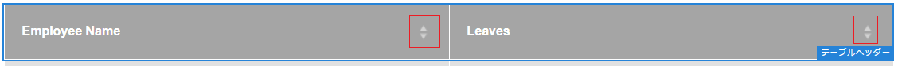

# インタラクティブ通信の作成{#create-an-interactive-communication}

## 概要 {#overview}

インタラクティブ通信を使用すると、各種のインタラクティブな通信記録の作成と配信を、カスタマイズされた安全な方法で一元的に管理することができます。印刷出力を Web 用のマスターチャネルとして使用することにより、インタラクティブ通信の Web 出力を作成する手間を大幅に省くことができます。

### 前提条件 {#prerequisites}

インタラクティブ通信を作成するための前提条件を以下に示します。

* テストデータを含む[フォームデータモデル](/help/forms/using/data-integration.md)、またはMicrosoft® Dynamicsのインスタンスなどの実際のデータソースを設定します。
* [ドキュメントフラグメント](/help/forms/using/document-fragments.md)があることを確認します。
* 印刷チャネルとWebチャネル用の[テンプレート](/help/forms/using/web-channel-print-channel.md)があることを確認します。
* Web チャネルで必要な[テーマ](/help/forms/using/themes.md)が設定されていること。

## インタラクティブ通信の作成 {#createic}

1. AEM オーサーインスタンスにログインし、**[!UICONTROL Adobe Experience Manager]**／**[!UICONTROL フォーム]**／**[!UICONTROL フォームとドキュメント]**&#x200B;に移動します。
1. 「**[!UICONTROL 作成]**」をタップし、「**[!UICONTROL インタラクティブ通信]**」を選択します。 インタラクティブ通信の作成ページが表示されます。

   

1. 以下の情報を入力します。：

   * **[!UICONTROL タイトル]**：インタラクティブ通信のタイトルを入力します。
   * **[!UICONTROL 名前]**:インタラクティブ通信の名前は、入力したタイトルに基づいて生成されます。必要に応じて、編集します。
   * **[!UICONTROL 説明]**:インタラクティブ通信の説明を入力します。
   * **[!UICONTROL フォームデータモデル]**:フォームデータモデルを参照して選択します。フォームデータモデルの詳細については、「[AEM Formsデータ統合](/help/forms/using/data-integration.md)」を参照してください。

   * **[!UICONTROL 事前入力サービス]**:事前入力サービスを選択してデータを取得し、インタラクティブ通信を事前入力します。
   * **[!UICONTROL 後処理のタイプ]**:インタラクティブ通信が送信されたときにトリガーされるAEMまたはFormsのワークフローを選択できます。トリガーするワークフローのタイプを選択します。

   * **[!UICONTROL 後処理]**：トリガーするワークフローの名前を選択します。AEMワークフローを選択する場合は、「添付ファイルのパス」、「レイアウトのパス」、「PDFのパス」、「印刷データのパス」および「Webデータのパス」を指定します。
   * **[!UICONTROL タグ]**:インタラクティブ通信に適用するタグを選択します。新しいタグ名またはカスタムタグ名を入力し、 Enterキーを押して作成することもできます。
   * **[!UICONTROL 作成者]**：作成者名は、ログインしたユーザーのユーザー名から自動的に取得されます。
   * **[!UICONTROL 発行日：]** インタラクティブ通信を発行する日付を入力します。
   * **[!UICONTROL 非公開日]**:インタラクティブ通信を非公開にする日付を入力します。

1. 「**[!UICONTROL 次へ]**」をタップします。印刷チャネルとWebチャネルの詳細を指定する画面が表示されます。
1. 以下を入力します。

   * **[!UICONTROL 印刷]**:インタラクティブ通信の印刷チャネルを生成する場合は、このオプションを選択します。
   * **[!UICONTROL 印刷テンプレート]**:XDPを参照し、印刷テンプレートとして選択します。
   * **[!UICONTROL Web]**:インタラクティブ通信のWebチャネルまたはレスポンシブ出力を生成する場合は、このオプションを選択します。
   * **[!UICONTROL インタラクティブ通信Webテンプレート]**:Webテンプレートを参照して選択します。
   * **** テーマ **[!UICONTROL を選択]**:インタラクティブ通信のWebチャネルのスタイルを設定するテーマを参照して選択します。詳しくは、「[AEM Forms のテーマ](/help/forms/using/themes.md)」を参照してください。

   * **[!UICONTROL Webチャネル用に印刷マスターを使用する]**:印刷チャネルと同期するWebチャネルを作成する場合は、このオプションを選択します。印刷チャネルを Web チャネルのマスターとして使用すると、Web チャネルに連結されたコンテンツとデータが印刷チャネルから取得され、「同期」をタップしたときに、印刷チャネルに対する変更内容が Web チャネルに反映されます。ただし、作成者は、Web チャネル内の特定のコンポーネントについて、必要に応じて継承設定を解除することができます。詳しくは、「[Webチャネルと印刷チャネルの同期](../../forms/using/create-interactive-communication.md#synchronize)」を参照してください。
「**[!UICONTROL Webチャネル用に印刷マスターを使用]**」オプションを選択した場合は、次のいずれかのモードを選択してWebチャネルを生成できます。

      * **[!UICONTROL 自動レイアウト]**:印刷チャネルからWebチャネルのプレースホルダ、コンテンツ、およびデータ連結を自動的に生成する場合は、このモードを選択します。
      * **[!UICONTROL 手動で整理する]**:このモードを選択し、「データソース」タブで使用可能なマスターコンテンツを使用して、印刷チャネル要素を手動で選択し、Webチャネルに追 **[!UICONTROL 加]** します。詳しくは、[「印刷チャネル要素の選択」を参照して、Webチャネルコンテンツを作成します。](#selectprintchannelelements)

   印刷チャネルとWebチャネルの詳細については、「[印刷チャネルとWebチャネル](/help/forms/using/web-channel-print-channel.md)」を参照してください。

1. 「**[!UICONTROL 作成]**」をタップします。インタラクティブ通信が作成され、警告ボックスが表示されます。 「**[!UICONTROL 編集]**」をタップして、「[インタラクティブ通信のオーサリングユーザーインターフェイスを使用したコンテンツの追加](#step2)」の説明に従って、インタラクティブ通信のコンテンツの作成を開始します。 または、「**[!UICONTROL 完了]**」をタップし、後でインタラクティブ通信を編集することもできます。

## インタラクティブ通信にコンテンツを追加する {#step2}

インタラクティブ通信を作成した後、インタラクティブ通信のオーサリングインターフェイスを使用して、そのコンテンツを作成できます。

インタラクティブ通信オーサリングインターフェイスについて詳しくは、「[インタラクティブ通信オーサリングの概要](/help/forms/using/introduction-interactive-communication-authoring.md)」を参照してください。

1. 「[インタラクティブ通信の作成](#createic)」の説明に従って「編集」をタップすると、インタラクティブ通信のオーサリングインターフェイスが起動します。 または、AEM上の既存のインタラクティブ通信アセットに移動して選択し、**[!UICONTROL 編集]**&#x200B;をタップして、インタラクティブ通信のオーサリングインターフェイスを起動することもできます。

   既定では、インタラクティブ通信がWebチャネルのみの場合を除き、インタラクティブ通信の印刷チャネルが表示されます。 インタラクティブ通信の印刷チャネルには、選択したXDP/印刷チャネルテンプレートで使用可能なターゲット領域が表示されます。 これらのターゲット領域とフィールドで、コンポーネントやアセットを追加することができます。

1. 印刷チャネルを選択した状態で、「**[!UICONTROL コンポーネント]**」タブを選択します。 印刷チャネルでは、以下のコンポーネントを使用することができます。

   | **コンポーネント** | **機能** |
   |---|---|
   | グラフ | インタラクティブ通信で使用できるグラフを追加して、フォームデータモデルコレクションから取得した2次元データを視覚的に表現します。 詳しくは、[Using charts in Interactive Communications](/help/forms/using/chart-component-interactive-communications.md)を参照してください。 |
   | ドキュメントフラグメント | テキスト、リスト、条件などの再利用可能なコンポーネントをインタラクティブ通信に追加できます。 インタラクティブ通信に追加する再利用可能なコンポーネントは、フォームデータモデルベースのコンポーネントでも、フォームデータモデルを持たないコンポーネントでもかまいません。 |
   | 画像 | 画像を挿入できるようにします。 |

   コンポーネントをインタラクティブ通信にドラッグ&amp;ドロップし、必要に応じて設定します。

   印刷チャネルとWebチャネルの両方でインタラクティブ通信を作成する際に、取り消し操作とやり直し操作を使用することもできます。

   最後に実行されたアクションを破棄する場合は取り消し操作、破棄されたアクションを再度組み込む場合はやり直し操作を使用します。 例えば、インタラクティブ通信に画像を挿入した場合や、インタラクティブ通信にデータ連結を作成した場合に、その画像を破棄する必要がある場合は、取り消し操作を使用します。

   

   「元に戻す」および「やり直し」オプションは、オーサリングUIページのツールバーに表示されます。 「元に戻す」オプションは、アクションの実行後にのみ表示されます。 やり直しオプションは、取り消し操作を実行した後にのみ、ページツールバーに表示されます。 これらのアクションは、ページの更新時にリセットされます。

1. 印刷チャネルを選択した場合は、「**[!UICONTROL アセット]**」タブに移動して、必要なアセットだけを表示するためのフィルターを適用します。

   アセットブラウザーを使用して、インタラクティブ通信のターゲット領域にアセットを直接ドラッグ&amp;ドロップすることもできます。

   

1. ドキュメントフラグメントをインタラクティブ通信にドラッグアンドドロップします。以下の表に、インタラクティブ通信の印刷チャネルで使用できるドキュメントフラグメントのタイプを示します。

<table>
 <tbody>
  <tr>
   <td><strong>ドキュメントフラグメントタイプ</strong></td>
   <td><strong>用途の例</strong></td>
  </tr>
  <tr>
   <td><a href="/help/forms/using/texts-interactive-communications.md" target="_blank">テキスト</a></td>
   <td>アドレス、受信者のEメールおよびレターの本文を追加するためのテキスト </td>
  </tr>
  <tr>
   <td><a href="/help/forms/using/conditions-interactive-communications.md" target="_blank">条件</a></td>
   <td>ポリシーのタイプに基づいて適切なヘッダー画像を通信に追加する条件：StandardまたはPremium。<br /> </td>
  </tr>
  <tr>
   <td>リスト</td>
   <td>テキスト、条件、その他のリスト、画像を含む、ドキュメントフラグメントのグループ。<br /> </td>
  </tr>
 </tbody>
</table>

**[!UICONTROL 「アセット]**」タブを使用して新しいフラグメントをターゲット領域にドロップすることで、ターゲット領域とドキュメントフラグメントの連結を置き換えることもできます。 フラグメントをドラッグしたときのターゲット領域の青い色の網掛けは、ドキュメントフラグメントをターゲット領域にドロップできることを示します。

ドキュメントフラグメントについて詳しくは、「[ドキュメントフラグメント](/help/forms/using/document-fragments.md)」を参照してください。

オーサリングインターフェイスを使用すると、インタラクティブ通信内の連結されていないフィールドと連結されているフィールドと変数を区別できます。 インターフェイスでは、オレンジ色の境界線を使用して、連結されていないフィールドと変数がハイライト表示されます。


また、これらの要素の上にマウスを置くと、フィールド（連結なし）または変数（連結なし）メッセージと共にツールチップが表示されます。

ドキュメントフラグメントで使用される連結されていない変数は、オーサリングインターフェイスに表示されないことがあります。 これは、ドキュメントフラグメント内のインラインテキストルールや、条件フラグメントの場合に発生する可能性があります。 その場合、青色でハイライト表示されたツールチップがドキュメントフラグメントの一部として表示されます。 ツールチップには、ドキュメントフラグメント内で使用される連結されていない変数の数が表示されます。


ドキュメントフラグメントをタップし、（設定）をタップしてから、インタラクティブ通信のサイドキックから「**[!UICONTROL プロパティ]**」をタップします。 「**[!UICONTROL 変数とデータモデルオブジェクト]**」セクションには、ドキュメントフラグメントで使用される、非表示の変数やデータモデルオブジェクトなどの変数が一覧表示されます。 各データモデルオブジェクトまたは変数の横にある （編集）アイコンを使用して、プロパティを編集します。

1. 変数の連結を設定するには、変数をタップして（設定）を選択し、サイドバーのプロパティパネルで連結プロパティを設定します。

   * **なし**：このプロパティを選択すると、エージェントによって変数の値が設定されます。
   * **テキストフラグメント**：このプロパティを選択すると、フィールド内でコンテンツがレンダリングされるテキストドキュメントフラグメントを参照して選択できるようになります。変数を含まない変数に連結できるのは、テキストドキュメントフラグメントだけです。
   * **データモデルオブジェクト**:フィールドに値が入力されるフォームデータモデルのプロパティを選択します。
   * **デフォルト値：** このフィールドを使用して、変数のデフォルト値を定義できます。この値は、インタラクティブ通信またはエージェントUIをプレビューすると表示されます。
   * **表示パターン：** 変数の表示形式を定義することもできます。**タイプ**&#x200B;ドロップダウンリストから事前定義済みのオプションを選択して、変数に表示形式を適用します。 「**カスタム**」を選択して、リストに表示されない表示パターンを定義します。 詳しくは、[データの表示パターン](../../forms/using/create-interactive-communication.md#datadisplaypatterns)を参照してください。

   「[変数とデータモデルオブジェクト](../../forms/using/create-interactive-communication.md#hiddenvariables)」に移動して、ドキュメントフラグメント内の非表示の変数の連結を設定します。

   また、データソース要素やテキストドキュメントフラグメントをドラッグ&amp;ドロップして、変数の連結を設定することもできます。  データソース要素との連結を作成するには、「**データソース**」タブを選択し、要素を変数名にドラッグ&amp;ドロップします。 連結を正しく設定するには、データソース要素と変数の型が同じである必要があります。 データソース要素を既に連結されている変数にドラッグ&amp;ドロップすると、新しい要素が前の要素に置き換えられ、変数を使用した新しい連結が作成されます。 同様に、「**アセット**」タブを選択し、テキストドキュメントフラグメントを変数名にドラッグ&amp;ドロップして、それらの間の連結を設定します。 テキストドキュメントフラグメントに変数を含めないでください。

1. テーブルを追加するには、印刷チャネルを選択した状態で、レイアウトフラグメントだけを表示するためのフィルターを「**[!UICONTROL アセット]**」タブで適用します。次に、必要なレイアウトフラグメントをインタラクティブ通信にドラッグアンドドロップします。レイアウトフラグメントはXDPに基づいており、動的データが入力されるインタラクティブ通信内でグラフィカルなレイアウトや静的および動的テーブルを作成するために使用できます。

   例えば、新しいポリシーと古いポリシーで、保険料の総額、特別割引率（%）、緊急ロードサイドサービスを表示するためのレイアウトテーブルを作成することができます。

   レイアウトフラグメントについて詳しくは、「[ドキュメントフラグメント](/help/forms/using/document-fragments.md)」を参照してください。

1. 印刷チャネルを選択した状態で、画像を表示するためのフィルターを「**[!UICONTROL アセット]**」タブで適用します。必要な画像（会社のロゴなど）をインタラクティブ通信にドラッグ&amp;ドロップします。

   また、インタラクティブ通信で以下の操作を行います。

   * [グラフの追加と設定](/help/forms/using/chart-component-interactive-communications.md)
   * [Web チャネルと印刷チャネルの同期](../../forms/using/create-interactive-communication.md#synchronize)

      * 自動同期
      * 継承のキャンセル
      * 継承を再度有効にする
      * 同期
   * [添付ファイルとライブラリへのアクセス](../../forms/using/create-interactive-communication.md#attachmentslibrary)
   * [XDP またはレイアウトフィールドのプロパティの設定](../../forms/using/create-interactive-communication.md#xdplayoutfieldproperties)
   * [コンポーネントへのルールの追加](../../forms/using/create-interactive-communication.md#rules)


1. **[!UICONTROL Webチャネル]**&#x200B;に切り替えます。 Webチャネルがインタラクティブ通信エディタに表示されます。 印刷チャネルからWebチャネルに初めて切り替えると、自動同期が行われます。 詳しくは、[印刷チャネルからのWebチャネルの同期](../../forms/using/create-interactive-communication.md#synchronize)を参照してください。

   この例では、Web チャネルのマスターとして印刷チャネルを使用しているため、印刷チャネルのプレースホルダー、コンテンツ、データ連結が Web チャネルに同期されます。ただし、Webチャネル内の特定のコンテンツを変更およびカスタマイズすることはできます。 [印刷チ](#cancelinheritance) ャネルを使用して生成されたターゲット領域と変数の継承をキャンセルして、コンテンツをカスタマイズできます。

   

   ドキュメントフラグメントをタップし、（設定）をタップしてから、インタラクティブ通信のサイドキックから「**[!UICONTROL プロパティ]**」をタップします。 「**[!UICONTROL 変数とデータモデルオブジェクト]**」セクションには、ドキュメントフラグメントで使用される、非表示の変数やデータモデルオブジェクトなどの変数が一覧表示されます。 各データモデルオブジェクトまたは変数の横にある （編集）アイコンを使用して、プロパティを編集します。 また、印刷チャネルを使用してWebチャネルで自動生成](#synchronize)されたドキュメントフラグメントの場合は、各データモデルオブジェクトの横にある （継承をキャンセル）アイコンを使用し、 [継承をキャンセル](#cancelinheritance)して編集できます。[

1. Web チャネルにコンポーネントを追加するには、Web チャネルを選択した状態で「**[!UICONTROL コンポーネント]**」をタップします。必要に応じて、インタラクティブ通信のWebチャネルにコンポーネントをドラッグ&amp;ドロップし、設定に進みます。

   | コンポーネント | 機能 |
   |---|---|
   | グラフ | インタラクティブ通信で使用できるグラフを追加して、フォームデータモデルコレクションから取得した2次元データを視覚的に表現します。 詳しくは、[グラフコンポーネント](../../forms/using/chart-component-interactive-communications.md)の使用を参照してください。 |
   | ドキュメントフラグメント | 再利用可能なコンポーネント、テキスト、リスト、または条件を、インタラクティブ通信に追加できます。 インタラクティブ通信に追加する再利用可能なコンポーネントは、フォームデータモデルベースのコンポーネントでも、フォームデータモデルがないコンポーネントでもかまいません。 |
   | 画像 | 画像を挿入できるようにします。 |
   | パネル | [パネル](../../forms/using/create-interactive-communication.md#add-panel-component-to-the-web-channel)をインタラクティブ通信に追加できます。 |
   | テーブル | 行と列にデータを整理できるテーブルを追加します。 |
   | ターゲット領域 | Web チャネル固有のコンポーネントを整理するためのターゲット領域を、その Web チャネルに挿入することができます。ターゲット領域は、Web チャネル固有のコンポーネントをグループ化するためのプレーンコンテナです。 |
   | テキスト | インタラクティブ通信の Web チャネルにリッチテキストを追加することができます。追加したテキストでフォームデータオブジェクトを使用して、動的なコンテンツを作成することもできます。 |
   | ボタン | [ボタン](../../forms/using/create-interactive-communication.md#add-button-component-to-the-web-channel)をインタラクティブ通信に追加できます。 ボタンコンポーネントを使用して、他のインタラクティブ通信、アダプティブフォーム、画像やドキュメントフラグメントなどの他のアセット、外部URLに移動できます。 |
   | セパレーター | インタラクティブ通信内に横線を挿入できます。 このコンポーネントを使用して、通信内のセクションを区別します。 例えば、区切り文字コンポーネントを使用して、クレジットカード明細の「Customer Details」セクションと「Credit Card Details」セクションを区別できます。 |

1. 必要に応じて、Web チャネルにアセットを挿入します。

   [インタラクティブ通信](#previewic)をプレビューして、インタラクティブ通信の印刷出力とWeb出力を確認し、必要に応じて変更を続けることができます。

## インタラクティブ通信のプレビュー表示 {#previewic}

**プレビューオプション**&#x200B;を使用して、インタラクティブ通信の外観を評価できます。 インタラクティブ通信のWebチャネルには、様々なデバイス向けにインタラクティブ通信のエクスペリエンスをエミュレートするオプションも用意されています。 例えば、iPhone、iPad、デスクトップパソコンなどのデバイスについて、エミュレーションを行うことができます。**プレビュー**&#x200B;と&#x200B;**エミュレーター** の両方のオプションを組み合わせて使用し、画面サイズの異なるデバイスのWeb出力をプレビューできます。 プレビューのサンプルデータは、指定したフォームデータモデルから取り込まれます。

1. プレビュー表示する印刷チャネルまたは Web チャネルを選択して「プレビュー」をタップします。インタラクティブ通信が表示されます。

   >[!NOTE]
   >
   >プレビュー画面には、指定したフォームデータモデルのサンプルデータが表示されます。他のデータとのインタラクティブ通信のプレビューや事前入力サービスの使用について詳しくは、「[フォームデータモデル](/help/forms/using/using-form-data-model.md)を使用する」と「[フォームデータモデル](/help/forms/using/work-with-form-data-model.md)を使用する」を参照してください。

1. Webチャネルの場合は、 を使用して、様々なデバイスでのインタラクティブ通信の外観を確認します。

   

さらに、[エージェントUI](/help/forms/using/prepare-send-interactive-communication.md)を使用して、インタラクティブ通信の準備と送信を行うことができます。

## インタラクティブ通信のプロパティ{#configure-properties-in-interactive-communication}の設定

### 添付ファイルとライブラリへのアクセス {#attachmentslibrary}

印刷チャネルでは、添付ファイルとライブラリへのアクセスを設定して、インタラクティブ通信の添付ファイルをエージェント UI で管理することができます。

1. 印刷チャネルでドキュメントコンテナをハイライト表示して、「**プロパティ**」をタップします。

   

   サイドバーにプロパティパネルが表示されます。

   

1. 「**添付ファイル**」を展開し、以下のプロパティを指定します。

   * **[!UICONTROL ライブラリのアクセスを許可]**：エージェント UI でエージェントによるライブラリへのアクセスを許可する場合は、このプロパティを選択します。このプロパティを選択すると、インタラクティブ通信の準備を行う際に、エージェントを使用してライブラリ内のファイルを追加できるようになります。
   * **[!UICONTROL 添付ファイルの順番の変更を許可]**：インタラクティブ通信の添付ファイルの順序を変更できるようにするには、このプロパティを選択します。
   * **[!UICONTROL 許可される添付ファイルの最大数]**：インタラクティブ通信で許可される添付ファイルの最大数を指定します。
   * **[!UICONTROL 添付ファイル]**:「追 **** 加」をタップし、添付するファイルを参照して選択し、次の項目を指定します。

      * **[!UICONTROL デフォルトでドキュメントにこのファイルを添付する]**：ファイルの添付が必須でない場合のみ、このオプションを変更することができます。
      * **[!UICONTROL 必須]**：このオプションを選択すると、エージェント UI で添付ファイルを削除できなくなります。

   

1. 「**[!UICONTROL 完了]**」をタップします。

### XDP またはレイアウトフィールドのプロパティの設定 {#xdplayoutfieldproperties}

1. インタラクティブ通信の印刷チャネルを編集する際に、印刷チャネルテンプレートに組み込まれているフィールドの上にマウスポインターを置き、  （設定）を選択します。

   サイドバーにプロパティダイアログが表示されます。

   

1. 以下のプロパティを指定します。

   * **[!UICONTROL 名前]**:JCRノード名。
   * **[!UICONTROL タイトル]**：タイトルを入力します。ここで入力したタイトルは、エージェント UI とドキュメントコンテナツリーに表示されます。
   * **[!UICONTROL バインディングの種類]**:フィールドの連結タイプを次の中から1つ選択します。

      * なし：このプロパティを選択すると、エージェントによってプロパティの値が設定されます。
      * テキストフラグメント：このプロパティを選択すると、フィールド内でコンテンツがレンダリングされるテキストドキュメントフラグメントを参照して選択できるようになります。または、テキストドキュメントフラグメントをフィールド名にドラッグ&amp;ドロップして、フィールド間の連結を設定します。 テキストドキュメントフラグメントに変数を含めないでください。
      * データモデルオブジェクト：フィールド内に値を取り込むデータモデルプロパティを選択します。または、「**データソース**」タブを選択し、プロパティをフィールドにドラッグ&amp;ドロップします。
   * **[!UICONTROL デフォルト値]**：指定したデータモデルオブジェクトまたはテキストフラグメントでフィールドの値を設定しなかった場合、そのフィールドにデフォルト値が設定されます。データ連結のタイプが「なし」の場合、デフォルト値はフィールドに事前入力されます。
   * **[!UICONTROL 表示パターン]**:フィールドの表示形式を定義することもできます。**タイプ**&#x200B;ドロップダウンリストから事前定義済みのオプションを選択し、フィールドに表示形式を適用します。 「**カスタム**」を選択して、リストに表示されない表示パターンを定義します。 詳しくは、「[データの表示パターン](../../forms/using/create-interactive-communication.md#datadisplaypatterns)」を参照してください。

   * **[!UICONTROL エージェントによる編集が可能]**：エージェント UI のフィールド値をエージェントを使用して編集できるようにするには、このオプションを選択します。「連結の種類」が「テキストフラグメント」の場合、この設定は適用されません。
   * **[!UICONTROL ラベル]**：フィールドと共にエージェント UI に表示されるテキスト文字列を指定します。「連結の種類」が「テキストフラグメント」の場合、この設定は適用されません。
   * **[!UICONTROL ツールチップ]**:エージェントUIのエージェントにマウスを置くと表示されるテキスト文字列を入力します。「連結の種類」が「テキストフラグメント」の場合、この設定は適用されません。
   * **[!UICONTROL 必須]**：フィールドを入力必須にするには、このオプションを選択します。「連結の種類」が「テキストフラグメント」の場合、この設定は適用されません。
   * **[!UICONTROL 複数行]**：フィールドに複数行のテキストを入力できるようにするには、このオプションを選択します。「連結の種類」が「テキストフラグメント」の場合、この設定は適用されません。


1. をタップします。

### データの表示パターン {#datadisplaypatterns}

オーサリングインターフェイスを使用すると、印刷チャネルとWebチャネル用のインタラクティブ通信を作成する際に使用できるフィールド、変数、フォームデータモデル要素のデータ表示パターンを定義できます。

データの表示パターンを設定するには、要素をタップし、（設定）を選択して、サイドバーの&#x200B;**[!UICONTROL プロパティ]**&#x200B;パネルで表示パターンを設定します。 **[!UICONTROL タイプ]**&#x200B;ドロップダウンリストから事前定義済みオプションを選択し、選択したタイプに関連付けられているパターンを表示します。 「**[!UICONTROL タイプ]**」ドロップダウンリストから「**[!UICONTROL カスタム]**」を選択して、リストで使用できないパターンを定義します。 「**[!UICONTROL パターン]**」フィールドで値を編集すると、タイプが自動的に「**[!UICONTROL カスタム]**」に変更されます。

表示パターンを適用するには、「パターン」フィールドで定義された文字または桁数が、フィールド、変数、フォームデータモデル要素の値で定義された文字または桁数と一致するか、それを超える必要があります。 詳しくは、[例](../../forms/using/create-interactive-communication.md#greaternumberofdigits)を参照してください。


印刷チャネルからWebコンテンツを生成した後で、フィールド、変数、またはフォームデータモデル要素の表示パターンを再定義できます。 その結果、印刷チャネルとWebチャネルに対して異なる表示パターンを要素に定義できます。 印刷チャネル内の要素の表示パターンを定義せず、印刷チャネルを使用してWebコンテンツを自動生成する場合、印刷チャネル内の要素に対して定義されたデータ連結によって、**[!UICONTROL 種類]**&#x200B;ドロップダウンリストで使用できる表示パターンオプションが定義されます。 要素に対して連結が定義されていない場合は、使用可能な表示パターンのオプションが要素のデータ型によって定義されます。 例えば、印刷チャネルの要素に対して「数値」タイプのデータ連結を作成する場合、**[!UICONTROL タイプ]**&#x200B;ドロップダウンリストで使用できる表示パターンオプションは、様々な形式の「数値」タイプになります。

**プレビュー**&#x200B;モードに切り替えるか、エージェントUIを開いて、これらの要素に適用された表示パターンを表示します。

次の表に、変数のデータ表示パターンを設定した結果として表示される値の例を示します。

| タイプ | デフォルト値 | 表示パターン | 表示値 | 説明 |
|---|---|---|---|---|
| 社会保障番号 | 123456789 | text{999-99-9999} | 123-45-6789 | デフォルト値フィールドの桁数は、「パターン」フィールドの桁数と一致します。 パターンに基づく値が正常に表示されます。 |
| 社会保障番号 | 1234567 | text{999-99-9999} | 1-23-4567 | デフォルト値フィールドの桁数が、パターンフィールドの桁数より小さい。 パターンは7桁の数字に適用されます。 |
| 社会保障番号 | 1234567890 | text{999-99-9999} | 1234567890 | デフォルト値フィールドの桁数が、パターンフィールドの桁数より大きい。 その結果、表示値に変化は生じません。 |

表示パターンが変数またはフォームデータモデル要素に対して指定されていない場合は、デフォルトで[グローバルドキュメントフラグメント設定](https://helpx.adobe.com//experience-manager/6-5/forms/using/interactive-communication-configuration-properties.html)が使用されます。

数値データ型の変数に表示パターンを適用しない場合、印刷プレビューにグローバルドキュメントフラグメント設定に従ってパターンが表示されます。 デフォルトのグローバルドキュメントフラグメント設定に変更を適用した場合でも、エージェントUIには、ロケールに定義されたデフォルトの区切り文字に従ってパターンが表示されます。

同様に、フィールドの場合、表示パターンが指定されていない場合、印刷テンプレート(XDP)の作成時に定義されたパターンがフィールドに適用されます。 印刷テンプレートの作成時にパターンがない場合は、XFA仕様に基づくデフォルトのパターンがフィールドに適用されます。

また、指定された表示パターンが正しくない場合や適用できない場合は、XFA仕様に基づくデフォルトのパターンがフィールド、変数、またはフォームデータモデル要素に適用されます。

## インタラクティブ通信のコンポーネントにルールを適用する {#rules}

インタラクティブ通信のコンポーネントやコンテンツに条件を設定するには、コンテンツのコンポーネントや部分をタップし、（ルールを作成）を選択してルールエディターを起動します。

詳しくは、次を参照してください。

* [ルールエディター](/help/forms/using/rule-editor.md)
* [インタラクティブ通信オーサリング の概要](/help/forms/using/introduction-interactive-communication-authoring.md)

## テーブルの使用 {#tables}

### インタラクティブ通信の動的テーブル  {#dynamic-tables-in-interactive-communication}

レイアウトフラグメントを使用して、インタラクティブ通信に動的テーブルを追加できます。 以下の手順では、クレジットカードの取引明細を例として、レイアウトフラグメントを使用して、インタラクティブ通信内に動的なテーブルを作成する方法について説明します。

1. テーブルを作成するために必要なレイアウトフラグメントが AEM で使用可能な状態になっていることを確認します。
1. インタラクティブ通信の印刷チャネルで、（複数列のテーブルを含む）レイアウトフラグメントをアセットブラウザーのターゲット領域にドラッグ&amp;ドロップします。

   

   インタラクティブ通信のレイアウト領域にテーブルが表示されます。

   

1. テーブル内のセルごとに、データ連結を指定します。繰り返し可能な行を作成するには、共通のコレクションプロパティに属する行にフォームデータモデルのプロパティを挿入します。

   1. テーブル内のセルをタップし、（設定）を選択します。

      サイドバーにプロパティダイアログが表示されます。

      

   1. 以下のプロパティを設定します。

      * **[!UICONTROL 名前]**:JCRノード名。
      * **[!UICONTROL タイトル]**:インタラクティブ通信エディターに表示されるタイトルを入力します。
      * **[!UICONTROL バインディングの種類]**:フィールドの連結タイプを次の中から1つ選択します。

         * **[!UICONTROL なし]**
         * **[!UICONTROL データモデルオブジェクト]**:フォームデータモデルのプロパティの値がフィールドに入力されます。または、「**データソース**」タブを選択し、プロパティをフィールドにドラッグ&amp;ドロップします。
      * **[!UICONTROL データモデルオブジェクト]**:フィールドに値が入力されるフォームデータモデルのプロパティ。
      * **[!UICONTROL デフォルト値]**:指定したデータモデルオブジェクトで値が指定されていない場合、デフォルト値によって、フィールドが空になりません。デフォルト値は、フィールドに事前入力されます。

      * **[!UICONTROL エージェントによる編集が可能]**：エージェント UI のフィールド値をエージェントを使用して編集できるようにするには、このオプションを選択します。
   1. をタップします。


1. インタラクティブ通信をプレビューして、データと共にレンダリングされた表を確認します。

   

### Web チャネル専用テーブル {#webchanneltables}

Webテンプレートのルートパネルをタップし、**+**&#x200B;をタップして、**テーブル**&#x200B;コンポーネントをインタラクティブ通信に追加します。 2行のテーブルがインタラクティブ通信に挿入されます。 テーブルの最初の行は、テーブルのヘッダーを表します。

#### テーブルへの行と列の追加 {#addrowscolumnstable}

**列を追加または削除するには：**

1. テーブルヘッダー行のデフォルトのテキストボックスをタップして、コンポーネントツールバーを表示します。
1. 「**列を追加**」または「**列を削除**」を選択して、テーブルの列を追加または削除します。


**行を追加または削除するには：**

1. 表の行のいずれかをタップして、コンポーネントツールバーを表示します。 インタラクティブ通信のサイドキックにあるコンテンツブラウザを使用して、テーブル行を選択することもできます。
1. 「**行を追加**」または「**行を削除**」を選択して、テーブルの行を追加または削除します。 ツールバーの「**上に移動**」および「**下に移動**」オプションを使用して、テーブルの行を並べ替えます。


**A.** 行を追加 **B.** 行を削除 **C.** 上に移 **動D.** 下に移動

#### テーブルのセルにテキストを追加または編集する {#addedittexttable}

1. テーブルセル内のデフォルトのテキストボックスを選択して、（編集）をタップします。
1. テーブルのセルにテキストを入力し、をタップして保存します。

#### テーブルセルとデータモデルオブジェクト要素の間に連結を作成する {#createbindingtablecells}

1. テーブル行のデフォルトのテキストボックスを選択して、（編集）をタップします。
1. 「データモデルオブジェクト」ドロップダウンリストをタップし、プロパティを選択します。
1. をタップして、テーブルセルとデータモデルオブジェクトプロパティの間の連結を保存し、作成します。


#### テーブルセル内にテキストのハイパーリンクを作成する {#createhyperlinktable}

1. テーブルセル内のデフォルトのテキストボックスを選択して、（編集）をタップします。
1. テーブルセル内のテキストを選択し、ハイパーリンクアイコンをタップします。
1. 「**パス**」フィールドにURLを指定します。
1. をタップして、ハイパーリンクのプロパティを保存します。


#### 動的テーブルの作成 {#createdynamictables}

コレクション型のデータモデルプロパティを使用して、インタラクティブ通信内にWebチャネル専用の動的テーブルを作成できます。 このようなテーブルは、コレクションプロパティの子プロパティを表します。 編集できるのは、テーブル内のセルの書式設定プロパティだけです。

1. Webチャネルに切り替え、データソースブラウザーの表示を選択します。
1. コレクションプロパティをサブフォームにドラッグアンドドロップします。サブフォーム内にテーブルが作成されます。
1. インタラクティブ通信の Web チャネル内のテーブルをプレビュー表示します。

#### テーブルの列の並べ替え {#sortcolumns}

インタラクティブ通信内のテーブル内の任意の列に基づいてデータを並べ替えることができます。 列の値は、昇順または降順で並べ替えることができます。

並べ替えは、次を含むテーブル列に適用できます。

* 静的テキスト
* データモデルオブジェクトプロパティ
* 静的テキストとデータモデルオブジェクトプロパティの組み合わせ

並べ替えを有効にするには、以下の手順を実行します。

1. テーブルを選択し、（設定）をタップします。インタラクティブ通信のサイドキックにある&#x200B;**コンテンツ**&#x200B;ブラウザーを使用して、テーブルを選択することもできます。
1. **並べ替えを有効にするを選択します。**
1.  をタップして、テーブルのプロパティを保存します。列ヘッダー内の並べ替えアイコンの上向き矢印と下向き矢印は、並べ替えが有効になっていることを表します。

   

1. **プレビュー**&#x200B;モードに切り替えて、出力を表示します。テーブルは、テーブルの最初の列に基づいて自動的に並べ替えられます。
1. 列ヘッダーをクリックして、列に基づいて値を並べ替えます。

   上向き矢印の付いた列ヘッダーは、次のことを表します。

   * テーブルは、その列に基づいて並べ替えられます。
   * 列の値は昇順で表示されます。

   

   同様に、下向き矢印の付いた列見出しは、列内の値が降順で表示されていることを表します。

## インタラクティブ通信のプロパティの編集{#edit-interactive-communication-properties}

インタラクティブ通信を作成した後は、後でそのプロパティを編集できます。

**プロパティ**&#x200B;ページを使用して、次の操作を行います。

* タイトルや説明など、インタラクティブ通信の作成時に指定したフィールドの値を編集します。
* 既存のインタラクティブ通信のWebチャネルを追加または削除します。
* インタラクティブ通信のプレビュー、ダウンロード、削除
* [エージェントUI](/help/forms/using/prepare-send-interactive-communication.md)を開きます。

**プロパティ**&#x200B;ページにアクセスするには：

1. AEM オーサーインスタンスにログインし、**Adobe Experience Manager**／**フォーム**／**フォームとドキュメント**&#x200B;に移動します。
1. インタラクティブ通信を選択し、「**プロパティ**」をタップします。
1. 「**一般**」タブを選択して、「**タイトル**」および「**説明**」フィールドを編集します。

### Webチャネル{#add-or-delete-the-web-channel}の追加または削除

既存のインタラクティブ通信用のWebチャネルを追加するには、次の手順を実行します。

1. **プロパティ**&#x200B;ページで、「**チャネル**」タブを選択します。
1. 「**Web**」チェックボックスを選択し、Webチャネルのテンプレートを選択します。
1. 「 **印刷をWebチャネルのマスターとして使用** 」を選択して、Webチャネルと印刷チャネルの同期を有効にします。
1. **「保存して閉じる」**&#x200B;をタップして変更を保存します。

   同様に、「**チャネル**」タブの「**Web**」チェックボックスをタップすると、インタラクティブ通信からWebチャネルを削除できます。

## Webチャネル{#add-button-component-to-the-web-channel}にボタンコンポーネントを追加します。

インタラクティブ通信のWebチャネルに、ボタンをコンポーネントとして追加できます。 [ルールエディター](../../forms/using/rule-editor.md)を使用してルールを定義し、インタラクティブ通信、アダプティブフォーム、画像やドキュメントフラグメントなどの他のアセット、またはボタンをタップしたときの外部URLに移動できます。

ボタンを追加し、それに対してルールを定義するには：

1. Webテンプレートのルートパネルをタップし、**+**&#x200B;をタップして、**ボタン**&#x200B;コンポーネントをインタラクティブ通信に追加します。
1. ボタンコンポーネントをタップし、をタップして、ボタンのタップに関するルールを定義します。
1. 「**When**」セクションで、「**clicked**」をボタンのドロップダウンリストの状態から選択します。
1. **Then**&#x200B;セクションで、次の操作を実行します。

   1. ドロップダウンリストからアクションを選択します。 例えば、アクションタイプとして「****&#x200B;に移動」を選択します。

   1. インタラクティブ通信、アダプティブフォーム、アセット、またはWebページのURLを指定します。 例えば、別のインタラクティブ通信に移動するURLを次の形式で指定します。https://&lt;server-name>:&lt;port>/editor.html/content/forms/af/&lt;Interactive Communication name>/channels/&lt;channel name - print or web>.html
   1. アセットを同じタブ、新しいタブまたは新しいウィンドウで開くオプションを指定します。
   1. 「**完了**」をタップし、「**閉じる**」をタップしてルールを保存します。

   同様に、「サービスを起動」や「フォームを送信」など、アクションタイプのドロップダウンリストから、他の使用可能なオプションを選択できます。 詳しくは、[ルールエディター](../../forms/using/rule-editor.md)を参照してください。

1. インタラクティブ通信をプレビューし、ボタンをタップしてインタラクティブ通信、アダプティブフォーム、アセット、または手順4(b)で指定したWebページを表示します。

## Webチャネル{#add-panel-component-to-the-web-channel}にパネルコンポーネントを追加します。

パネルコンポーネントは、他のコンポーネントをグループ化するためのプレースホルダーです。パネルコンポーネントにより、インタラクティブ通信内でのコンポーネントグループ（アコーディオンやタブなど）の配置方法が制御されます。パネルコンポーネントを使用して、エンドユーザーが繰り返し使用できるコンポーネントグループ（学歴を入力するための複数のエントリなど）を作成することもできます。

パネルコンポーネントをWebチャネルに追加するには、次の手順を実行します。

1. 次のいずれかのオプションを使用して、Webチャネルに&#x200B;**パネル**&#x200B;コンポーネントを挿入します。

   * コンポーネントをタップし、**+**&#x200B;をタップして、**パネル**&#x200B;コンポーネントを選択します。

   * **コンポーネント**&#x200B;ブラウザーパネルから、**パネル**&#x200B;コンポーネントをインタラクティブ通信にドラッグ&amp;ドロップします。

   * **コンテンツ**&#x200B;ブラウザーパネルの&#x200B;**パネル**&#x200B;をタップし、「**子パネルを追加**」をタップします。 「**子パネルを追加**」オプションを選択すると、**子パネルを追加**&#x200B;ダイアログボックスが表示されます。 パネルコンポーネントのタイトルと説明（オプション）、名前を入力します。

1. **コンテンツ**&#x200B;ブラウザーからパネルをタップして、パネルに対して追加のアクション（設定、ルールの編集、コピー、削除、コンポーネントの挿入など）を実行します。

   また、**コンテンツ**&#x200B;ブラウザー内にパネルをドラッグ&amp;ドロップして、右側のウィンドウでのインタラクティブ通信の構造の変更を反映することもできます。

## Web チャネルと印刷チャネルの同期 {#synchronize}

インタラクティブ通信の作成中に[Webチャネルのマスターとして印刷]を選択すると、Webチャネルが印刷チャネルと同期して作成され、Webチャネルの内容とデータの連結が印刷チャネルから派生し、[同期]をタップすると、印刷チャネルに加えた変更がWebチャネルに反映されます。

ただし、作成者は、Web チャネル内のコンポーネントについて、必要に応じて継承設定を解除することができます。

 

### 自動同期 {#autosync}

「**[!UICONTROL Webチャネル用に印刷マスターを使用]**」オプションを選択した場合は、次のいずれかのモードを選択してWebチャネルを生成できます。

* **[!UICONTROL 自動レイアウト]**:印刷チャネルからWebチャネルのプレースホルダ、コンテンツ、およびデータ連結を自動的に生成する場合は、このモードを選択します。
* **[!UICONTROL 手動で整理する]**:「データソース」タブにあるマスターコンテンツを使用して印刷チャネル要素を手動で選択し、Webチャネルに追加するには、このモードを選択します。詳しくは、[「印刷チャネル要素の選択」を参照して、Webチャネルコンテンツを作成します。](#selectprintchannelelements)


>[!NOTE]
>
>チャネルを同期すると、ドキュメントフラグメント、画像、条件、リスト、およびレイアウトフラグメントのみが印刷チャネルから Web チャネルに同期されます。このような要素を含むサブフォームまたは親ノードは同期されません。

### 「印刷チャネル要素」を選択してWebチャネルコンテンツを作成します {#selectprintchannelelements}

インタラクティブ通信の作成時に「印刷」をマスターとして選択し、自動同期オプションを選択しない場合は、印刷チャネル要素をWebチャネルオーサリングインターフェイスにドラッグ&amp;ドロップすることもできます。

**データソース** / **マスターコンテンツ**&#x200B;に移動して、印刷チャネル要素を表示します。 ターゲット領域、フィールドまたはテーブルをWebチャネルオーサリングインターフェイスにドラッグ&amp;ドロップします。 要素名の横にある青い円のアイコンは、印刷チャネル要素が既にWebチャネルに含まれていることを示します。


### 継承のキャンセル {#cancelinheritance}

Web チャネルでは、ターゲット領域内にコンポーネントが組み込まれます。

Webチャネルの関連するターゲット領域または変数の上にマウスポインターを置いて、「」（継承をキャンセル）を選択し、継承をキャンセルダイアログで「**[!UICONTROL はい]**」をタップします。

ターゲット領域内でコンポーネントの継承がキャンセルされ、必要に応じてコンポーネントを編集できるようになります。

### 継承を再度有効にする {#re-enable-inheritance}

Web チャネルでコンポーネントの継承をキャンセルした場合は、その継承を再度有効にすることができます。継承を再度有効にするには、コンポーネントを含む関連するターゲット領域の境界上にマウスポインターを置いて、をタップします。

継承を元に戻すためのダイアログが表示されます。


必要に応じて、「**[!UICONTROL 継承を元に戻してからページを同期]**」を選択します。インタラクティブ通信を全体的に同期する場合に、このオプションを選択してください。このオプションを選択しない場合、継承を元に戻すと、関連するターゲット領域のみが同期されます。

**[!UICONTROL はい]**&#x200B;をタップします。

### 同期 {#synchronize-1}

Webチャネルのマスターとして印刷を使用し、印刷チャネルを変更する場合は、コンテンツを同期して新しく変更した内容をWebチャネルに取り込むことができます。

1. Webチャネルと印刷チャネルを同期するには、Webチャネルに切り替えて、その他のオプションアイコンをタップします。

   

1. 以下に示すいずれかのオプションをタップします。

   * **[!UICONTROL 印刷と同期]**:継承がキャンセルされていないターゲット領域のコンテンツのみを同期します。
   * **[!UICONTROL リセット]**:Webチャネルのコンテンツを印刷チャネルと同期し、Webチャネルに加えられたすべての変更を破棄します。

### コンポーネントツールバーを使用した継承されたコンポーネントに対するアクションの実行 {#componenttoolbar}

「同期」オプションを使用してWebチャネル内に自動生成コンテンツを作成したら、継承をキャンセルせずに、コンポーネントに対してさらに多くのアクションを実行できます。


コンポーネントをタップして、次のオプションを表示します。

* **コピー：** コンポーネントをコピーして、インタラクティブ通信の他の場所に貼り付けます。
* **切り取り：** インタラクティブ通信内のコンポーネントを別の場所に移動します。
* **コンポーネントを挿入：** 選択したコンポーネントの上にコンポーネントを挿入します。
* **貼り付け：** 上記のオプションを使用して、切り取ったまたはコピーしたコンポーネントを貼り付けます。
* **グループ：** 複数のコンポーネントを同時に切り取り、コピー、貼り付ける場合は、複数のコンポーネントを選択します。
* **親：** コンポーネントの親を選択します。
* **SOM式を表示：** コンポーネ [ント](../../forms/using/using-som-expressions-adaptive-forms.md) のSOM式を表示します。

* **パネル内のオブジェクトをグループ化：** コンポーネントをパネル内にグループ化して、それらのコンポーネントに対する操作を同時に実行できるようにします。詳しくは、[パネル内のオブジェクトのグループ化](#groupobjectspanel)を参照してください。

* **継承をキャンセル：** [ターゲット領域内](#cancelinheritance) のコンポーネントの継承をキャンセルして、編集します。

### パネル内のオブジェクトのグループ化 {#groupobjectspanel}

Webチャネルオーサリングインターフェイスは、パネル内のコンポーネントをグループ化し、それらのコンポーネントに対して同時に操作を実行できるようにします。 「**コンテンツ**」タブには、グループ化されたコンポーネントがコンテンツツリー内のパネルの子要素として表示されます。

1. コンポーネントをタップし、グループ()操作を選択します。
1. 複数のコンポーネントを選択し、「**パネル内のオブジェクトをグループ化**」をタップします。

   

1. [**パネル内のオブジェクトをグループ化**]ダイアログボックスで、パネルの名前を入力します。
1. オプションで、パネルのタイトルと説明を入力します。
1. をクリックします。

   グループ化されたコンポーネントは、コンテンツツリーのパネルの子要素として表示されます。

   

## 印刷チャネルの出力形式{#output-format-print-channel}

PrintChannel APIを使用して、インタラクティブ通信の印刷チャネルの出力形式を定義します。 出力形式を定義しない場合、AEM FormsはPDF形式で出力を生成します。

```javascript
//options for rendering print channel of a multi-channel document
PrintChannelRenderOptions renderOptions = new PrintChannelRenderOptions();
PrintDocument printDocument = printChannel.render(renderOptions);
```

その他の形式で出力を生成するには、出力形式のタイプを指定します。 サポートされる出力形式のリストについては、[PrintChannel API](https://helpx.adobe.com/experience-manager/6-5/forms/javadocs/com/adobe/fd/output/api/PrintConfig.html)を参照してください。

例えば、次のサンプルを使用して、PCLをインタラクティブ通信の出力形式として定義できます。

```javascript
//options for rendering print channel of a multi-channel document
PrintChannelRenderOptions renderOptions = new PrintChannelRenderOptions();
renderOptions.setRenderFormat(PrintConfig.HP_PCL_5e);
PrintDocument printDocument = printChannel.render(renderOptions);
```
