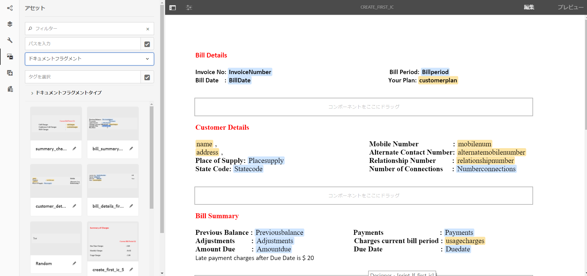
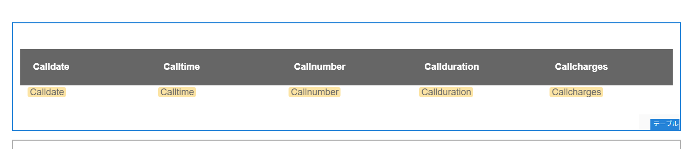
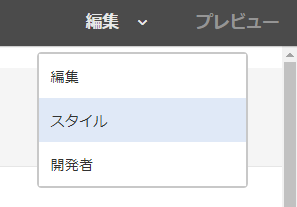
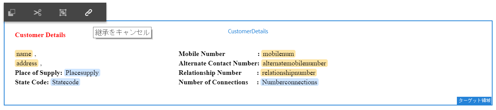
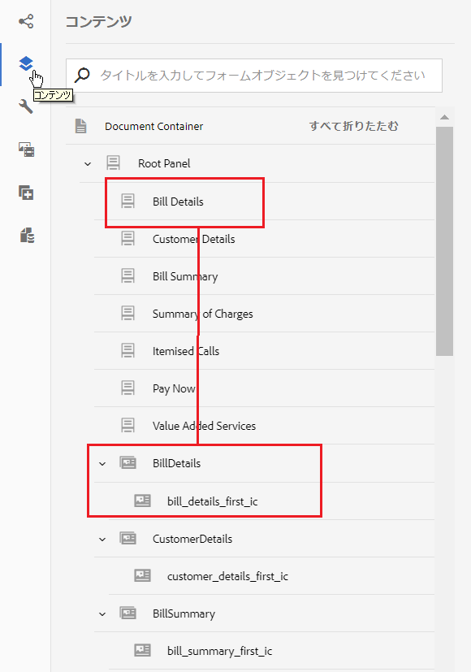

# チュートリアル：インタラクティブ通信の作成 {#tutorial-create-interactive-communication}

This tutorial is a step in the [Create your first Interactive Communication](/help/forms/using/create-your-first-interactive-communication.md) series. チュートリアル内のユースケースを理解して実際に操作できるように、このシリーズのチュートリアルを最初から順に学習することをお勧めします。

フォームデータモデル、ドキュメントフラグメント、テンプレート、Web 版用のテーマなどのすべての構築ブロックの作成が終わったら、インタラクティブ通信の作成を開始できます。

インタラクティブ通信は、印刷チャネルと Web チャネルという 2 つのチャネルを使用して配信することができます。また、印刷チャネルをマスターとしてインタラクティブ通信を作成することも可能です。印刷チャネルを Web チャネルのマスターとして使用すると、Web チャネルに連結されたコンテンツ、継承設定、データが印刷チャネルから取得されます。また、印刷チャネルで加えられた変更が Web チャネルでも同期されるようにします。ただし、インタラクティブ通信の作成者は、Web チャネル内の特定のコンポーネントの継承設定を解除することができます。

本チュートリアルは、印刷版および Web 版のインタラクティブ通信の作成方法を順を追って説明します。このチュートリアルを完了すると、次の操作を実行できるようになります。

* 印刷チャネル用のインタラクティブ通信の作成
* Web チャネル用のインタラクティブ通信の作成
* 印刷をマスターとする印刷版および Web 版インタラクティブ通信の作成

## 同期なしでの印刷版および Web 版のインタラクティブ通信の作成 {#create-interactive-communications-for-print-and-web-with-no-synchronization}

### 印刷チャネル用のインタラクティブ通信の作成 {#create-interactive-communication-for-print-channel}

以下は、本チュートリアル内で既に作成済みで、印刷チャネル用のインタラクティブ通信を作成する際に必要になるリソース一覧です。

**印刷テンプレート：** [create_first_ic_print_template](../../forms/using/create-templates-print-web.md)

**Form Data Model:** [FDM_Create_First_IC](../../forms/using/create-form-data-model0.md)

**ドキュメントフラグメント：** [bill_details_first_ic、customer_details_first_ic、bill_summary_first_ic、summary_charges_first_ic](../../forms/using/create-document-fragments.md)

**レイアウトフラグメント：** [table_lf](../../forms/using/create-templates-print-web.md)

**画像：** PayNow および ValueAddedServices

1. AEM オーサーインスタンスにログインし、**[!UICONTROL Adobe Experience Manager]**／**[!UICONTROL フォーム]**／**[!UICONTROL フォームとドキュメント]**&#x200B;に移動します。
1. Tap **Create** and select **Interactive Communication**. The **Create Interactive Communication** wizard is displayed.
1. 「**タイトル**」と「**名前**」フィールドに **create_first_ic** と入力します。Select **FDM_Create_First_IC** as the Form Data Model and tap **Next**.
1. In the **Channels** wizard:

   1. Specify **create_first_ic_print_template** as the Print template and tap **Select**. Ensure that the **Use Print as Master for Web Channel** checkbox is not selected.

   1. Specify **Create_First_IC_templates** folder > **Create_First_IC_Web_Template** as the Web template and tap **Select**.

   1. 「**作成**」をタップします。

   インタラクティブ通信が正常に作成されたことを通知する確認メッセージが表示されます。

1. 「**編集**」をタップし、右側のペインでインタラクティブ通信を開きます。
1. Go to the **Assets** tab and apply the filter to display only the document fragments in the left pane.
1. 以下のドキュメントフラグメントをインタラクティブ通信のターゲット領域にドラッグアンドドロップします。

   | ドキュメントフラグメント | ターゲット領域 |
   |---|---|
   | bill_details_first_ic | BillDetails |
   | customer_details_first_ic | CustomerDetails |
   | bill_summary_first_ic | BillSummary |
   | summary_charges_first_interactive_communication | 料金 |

   

1. Tap **Charts** target area, and tap **+** to add a **Chart** component.
1. Tap the Chart component and select  (Configure). グラフのプロパティが左側のペインに表示されます：

   1. グラフ名を指定します。
   1. 「**グラフのタイプ**」ドロップダウンリストから「**円グラフ**」を選択します。
   1. **X 軸**&#x200B;セクションの&#x200B;**通話**&#x200B;データモデルオブジェクトタイプから **Calltype** プロパティを選択します。「 」をタップします。
   1. 「**関数**」ドロップダウンリストから&#x200B;**頻度**&#x200B;を選択します。
   1. Select the **calltype** property from the **calls** data model object type in the **Y-axis** section. 「 」をタップします。
   1. Tap  to save the chart properties.

1. Go to the **Assets** tab and apply the filter to display only the layout fragments in the left pane. **table_lf** レイアウトフラグメントを&#x200B;**通話明細**&#x200B;のターゲット領域にドラッグアンドドロップします。
1. Select the Text Field in the **Date** column and tap  (Configure).
1. 「**連結タイプ**」ドロップダウンリストから「**データモデルオブジェクト**」を選択し、**calls**／**calldate** の順に選択します。Tap  twice to save the properties.

   同様に、**時刻**、**番号**、**時間**、および&#x200B;**料金**&#x200B;のテキストフィールドについて、それぞれ&#x200B;**calltime**、**callnumber**、**callduration**、および **callcharges** との連結を作成します。

1. Tap **PayNow** target area, and tap **+** to add an **Image** component.
1. Tap the Image component and select  (Configure). 画像のプロパティが左側のペインに表示されます：

   1. 「**名前**」フィールドで、**PayNow** を画像の名前として指定します。
   1. 「**アップロード**」をタップし、ローカルのファイルシステムに保存された画像を選択して「**開く**」をタップします。
   1. Tap  to save the image properties.

1. Repeat steps 13 and 14 to add **ValueAddedServices** image to the **ValueAddedServices** target area.

### Web チャネル用インタラクティブ通信の作成 {#create-interactive-communication-for-web-channel}

以下は、本チュートリアル内で既に作成済みで、Web チャネル用のインタラクティブ通信を作成する際に必要になるリソース一覧です。

**Webテンプレート：** [Create_First_IC_Web_Template](../../forms/using/create-templates-print-web.md)

**Form Data Model:** [FDM_Create_First_IC](../../forms/using/create-form-data-model0.md)

**ドキュメントフラグメント：** [bill_details_first_ic、customer_details_first_ic、bill_summary_first_ic、summary_charges_first_ic](../../forms/using/create-document-fragments.md)

**画像：** PayNowWebおよびValueAddedServicesWeb

1. AEM オーサーインスタンスにログインし、**[!UICONTROL Adobe Experience Manager]**／**[!UICONTROL フォーム]**／**[!UICONTROL フォームとドキュメント]**&#x200B;に移動します。
1. Tap **Create** and select **Interactive Communication**. The **Create Interactive Communication** wizard is displayed.
1. 「**タイトル**」と「**名前**」フィールドに **create_first_ic** と入力します。Select **FDM_Create_First_IC** as the Form Data Model and tap **Next**.
1. In the **Channels** wizard:

   1. Specify **create_first_ic_print_template** as the Print template and tap **Select**. Ensure that the **Use Print as Master for Web Channel** checkbox is not selected.

   1. Specify **Create_First_IC_templates** folder > **Create_First_IC_Web_Template** as the Web template and tap **Select**.

   1. 「**作成**」をタップします。

   インタラクティブ通信が正常に作成されたことを通知する確認メッセージが表示されます。

1. 「**編集**」をタップし、右側のペインでインタラクティブ通信を開きます。
1. Tap the **Channels** tab from the left pane and tap **Web**.
1. Go to the **Assets** tab and apply the filter to display only the document fragments in the left pane.
1. 以下のドキュメントフラグメントをインタラクティブ通信のターゲット領域にドラッグアンドドロップします。

   | ドキュメントフラグメント | ターゲット領域 |
   |---|---|
   | bill_details_first_ic | BillDetails |
   | customer_details_first_ic | CustomerDetails |
   | bill_summary_first_ic | BillSummary |
   | summary_charges_first_interactive_communication | 料金 |

1. Tap **Summary of Charges** target area, and tap **+** to add a **Chart** component.
1. Tap the Chart component and select  (Configure). グラフのプロパティが左側のペインに表示されます：

   1. グラフ名を指定します。
   1. 「**グラフのタイプ**」ドロップダウンリストから「**円グラフ**」を選択します。

   1. **X 軸**&#x200B;セクションの&#x200B;**通話**&#x200B;データモデルオブジェクトタイプから **Calltype** プロパティを選択します。「 」をタップします。

   1. 「**関数**」ドロップダウンリストから&#x200B;**頻度**&#x200B;を選択します。

   1. Select the **calltype** property from the **calls** data model object type in the **Y-axis** section. 「 」をタップします。

   1. Tap  to save the chart properties.

1. 左側のペインから「**データソース**」タブを選択し、**通話** データモデルオブジェクトを&#x200B;**通話明細**&#x200B;のターゲット領域にドラッグアンドドロップします。**calls** データモデルオブジェクトのすべてのプロパティは、右側のペインの「 **Itemized Calls** （項目別）」ターゲット領域に、テーブル列として表示されます。

   ユースケースに基づいて、テーブルには、通話日、通話時刻、通話番号、通話時間、そして通話料金の列が必要です。

   

1. Select **Mobilenum** table column heading and select **More options** > **Delete column**. 同様に、**Calltype** の列を削除します。
1. Select the **Calldate** table column heading and tap  (Edit) to rename the text to **Call Date**. 同様に、テーブル内の他の列見出しの名前を変更します。
1. ユースケースに基づき、「**Pay Now**」（今すぐ支払う）ボタンをインタラクティブ通信に挿入し、ユーザーがボタンをクリックして支払いを行えるようにします。ボタンを挿入するには、次の手順を実行します。

   1. Tap **Pay Now** target area, and tap **+** to add a **Text** component.

   1. Tap the text component and tap  (Edit).
   1. テキストの名前を **Pay Now** に変更します。
   1. テキストを選択し、ハイパーリンクアイコンをタップします。
   1. **パス**&#x200B;フィールドで支払い URL を指定します。
   1. 「**ターゲット**」ドロップダウンリストから「**新規タブ**」を選択します。

   1. Tap  to save the hyperlink properties.

1. 「**プレビュー**」オプションの隣にあるドロップダウンリストから「**スタイル**」を選択します。

   

1. ハイパーリンクテキストのスタイルを設定し、インタラクティブ通信でボタンとして表示するには次の手順を実行します。

   1. Tap the text component and select  (Edit).
   1. 「**境界線**」セクションで、**境界線の幅**&#x200B;を **1.5px** に指定します。**境界線のスタイル**&#x200B;として&#x200B;**実線**&#x200B;を選択し、**境界線の半径**&#x200B;を **46px** に指定します。

   1. 「**背景**」セクションから、ボタンの背景色に赤を選択します。
   1. 「**寸法と位置**」セクションの「**余白**」フィールドで、「**同時に編集**」アイコンをタップして、**右**&#x200B;の余白を **450px** に設定します。「上」、「下」、「左」の各フィールドは空白に設定されます。

   

1. Tap **Pay Now** target area, and tap **+** to add an **Image** component.
1. Tap the Image component and select  (Configure). 画像のプロパティが左側のペインに表示されます：

   1. 「**名前**」フィールドで、**PayNow** を画像の名前として指定します。

   1. Tap **Upload**, select the **PayNowWeb** image saved on the local file system, and tap **Open**.

   1. Tap  to save the image properties.

1. Based on the use case, insert a **Subscribe** button in the Interactive Communication that provides the user an option to subscribe to the value added services by clicking the button.

   Repeat steps 13 - 17 to add a **Subscribe** button to the **Value Added Services** target area and add the **ValueAddedServicesWeb** image.

## 自動同期での印刷版および Web 版のインタラクティブ通信の作成 {#create-interactive-communications-for-print-and-web-with-auto-synchronization}

インタラクティブ通信は、印刷チャネルと Web チャネル間の自動同期を有効化することでも作成できます。自動同期を有効化するには、インタラクティブ通信を作成する際に印刷をマスターオプションとして選択します。印刷チャネルをマスターとして選択すると、Web チャネルに連結されたコンテンツ、継承設定、データが印刷チャネルから取得されます。また、印刷チャネルで加えられた変更が Web チャネルにも反映されるようにします。

印刷チャネルを使って Web チャネルのコンテンツを派生するには、次の手順を実行します。

1. AEM オーサーインスタンスにログインし、**[!UICONTROL Adobe Experience Manager]**／**[!UICONTROL フォーム]**／**[!UICONTROL フォームとドキュメント]**&#x200B;に移動します。
1. Tap **Create** and select **Interactive Communication**. The **Create Interactive Communication** wizard is displayed.
1. 「**タイトル**」と「**名前**」フィールドに **create_first_ic** と入力します。Select **FDM_Create_First_IC** as the Form Data Model and tap **Next**.
1. In the **Channels** wizard:

   1. Specify **create_first_ic_print_template** as the Print template and tap **Select**.

   1. Select the **Use Print as Master for Web Channel** checkbox.
   1. Specify **Create_First_IC_templates** folder > **Create_First_IC_Web_Template** as the Web template and tap **Select**.

   1. 「**作成**」をタップします。

   インタラクティブ通信が正常に作成されたことを通知する確認メッセージが表示されます。

1. 「**編集**」をタップし、右側のペインでインタラクティブ通信を開きます。
1. Execute steps 6 - 15 of [Create Interactive Communication for Print channel](../../forms/using/create-interactive-communication0.md#create-interactive-communication-for-print-channel) section.
1. Tap the **Channels** tab from the left pane and tap **Web** to auto-generate content for the Web channel from the Print channel.
1. As the **Use Print as Master for Web Channel** checkbox is selected in step 4, the content and bindings are auto-generated for Web channel from the Print channel.

   印刷チャネルのコンテンツは Web チャネルのテンプレートコンテンツの下に挿入されます。印刷チャネルから自動生成された Web チャネルのコンテンツを変更するには、どのターゲット領域の継承もキャンセルできます。

   Hover over the relevant target area in the web channel and select  (Cancel Inheritance) and then in the **Cancel Inheritance** dialog, tap **Yes**.

   

   コンポーネントの継承をキャンセルした場合は、その継承を再度有効にすることができます。To re-enable inheritance, hover over the boundary of the relevant target area, which includes the component, and tap .

1. 左側のペインで、「**コンテンツ**」タブを選択します。
1. 自動生成された Web チャネルコンテンツを、コンテンツツリーを使用して Web テンプレートの既存のパネルにドラッグアンドドロップします。以下は配置を調節する必要があるコンポーネントの一覧です。

   * 請求明細コンポーネントを請求明細パネルに
   * 顧客情報コンポーネントを顧客情報パネルに
   * 請求内容コンポーネントを請求内容パネルに
   * 請求概要コンポーネントを請求概要パネルに
   * レイアウトフラグメント（テーブル）を通話明細パネルに

   

1. 「[Web チャネル用インタラクティブ通信の作成](../../forms/using/create-interactive-communication0.md#create-interactive-communication-for-web-channel)」の手順 13～18 を繰り返し、「**Pay Now**」（今すぐ支払う）および「**登録**」ハイパーリンクをインタラクティブ通信の Web チャネルに挿入します。

