# レターの作成 {#create-letter}

## Correspondence Management のワークフロー {#correspondence-management-workflow}

Correspondence Management ワークフローは、次の 4 つのフェーズから構成されます。

1. テンプレートの作成
1. ドキュメントフラグメントの作成
1. レターの作成
1. 後処理

### テンプレートの作成 {#template-creation}

次の図に、通信テンプレートを作成する際の一般的なワークフローを示します。

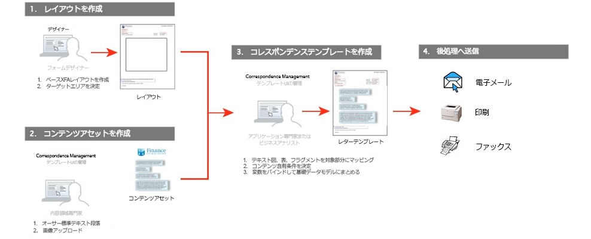

このワークフローについて説明します。

1. フォーム開発者は、Adobe Forms Designer を使用してレイアウトやフラグメントレイアウトを作成し、CRX リポジトリにアップロードします。レイアウトには、一般的なフォームフィールド、ヘッダーやフッターなどのレイアウト機能、およびコンテンツを配置するための空の「ターゲット領域」が含まれます。アプリケーションスペシャリストは、後でこれらのターゲット領域に必要なコンテンツをマッピングします。詳しくは、「[レイアウトの設計](/help/forms/using/layout-design-details.md)」を参照してください。
1. 法務部門、経理部門、またはマーケティング部門のサブジェクトマターエキスパート（SME）は、免責事項や契約条件などのテキストの条項や、ロゴなどの画像を作成およびアップロードすることで、様々な通信テンプレートで再利用できるようになります。
1. アプリケーションスペシャリストは、通信テンプレートを作成します。アプリケーションスペシャリストには次の役割があります。

   * テキストの条項と画像をレイアウトテンプレートのターゲット領域にマッピングします。
   * コンテンツを含める際の条件とルールを定義します。
   * レイアウトのフィールドと変数を基礎となるデータモデルに結び付けます。

1. 作成者がレターをプレビューし、後処理用に送信します。詳しくは、「[後処理](/help/forms/using/submit-letter-topostprocess.md)」を参照してください。

#### Correspondence Management に付属しているレターテンプレートの使用 {#using-letter-templates-provided-with-correspondence-management}

レイアウトテンプレートを最初から作成する代わりに、Correspondence Management に付属しているテンプレートを変更して再利用することができます。Designer を使用すると、組織のニーズに合わせて、テンプレートのブランディングフィールド、データフィールド、コンテンツフィールドをすばやく変更することができます。Correspondence Management のテンプレートについて詳しくは、「[参照レターテンプレート](/help/forms/using/reference-cm-layout-templates.md)」を参照してください。

### ドキュメントフラグメントの作成 {#document-fragment-creation}

ドキュメントフラグメントは、レターや通信を構成するための再利用可能な通信のパーツやコンポーネントです。

ドキュメントフラグメントは、次のいずれかの種類になります。

#### テキスト {#text}

テキストアセットは、1 つまたは複数の段落で構成される 1 つのコンテンツです。段落は静的または動的に調整させることができます。動的段落にはデータ要素への参照が含まれます。データ要素の値は実行時に設定されます。

#### リスト {#list}

リストとは、テキスト、リスト(同じリストをその中に追加することはできません)、条件、ドキュメントを含む一連の画像フラグメントです。 リスト要素の順番は固定または編集可能にできます。レターを作成する際は、リスト要素の一部またはすべてを使用して、再利用可能な要素のパターンを複製することができます。

#### 条件 {#condition}

条件を使用すると、提示されたデータに基づいて通信の作成時に含めるコンテンツを定義できます。制御変数を使用して条件を記述します。変数にはデータディクショナリ要素またはプレースホルダーがあります。条件を追加するときに、制御変数の値に基づいてアセットを含めることもできます。条件は、1つの条件に基づいて単一の出力を持ちます。式。 現在の条件変数に基づいて、最初の式が true であると判断されると、その値が条件の出力になります。

#### レイアウトフラグメント {#layout-fragment}

レイアウトフラグメントは、1 つ以上のレター内で使用できるレイアウトです。繰り返し可能なパターン（特に動的テーブル）を作成するには、レイアウトフラグメントを使用します。レイアウトには、「アドレス」や「参照番号」などの一般的なフォームフィールドを含めることができます。また、ターゲット領域を示す空のサブフォームを含めることもできます。The layouts (XDPs) are created in Designer and then are [uploaded to Forms and Documents](/help/forms/using/get-xdp-pdf-documents-aem.md).

### レターの作成 {#letter-creation}

顧客に送信する通信を生成するには、ユーザー主導型とシステム主導型という 2 つの方法があります。

#### ユーザー主導型 {#user-driven}

要求処理担当者やケースワーカーなど、顧客と直接やり取りする従業員は、カスタマイズされた通信を作成できます。シンプルで直感的な文字入力インターフェイスを使用することで、ビジネスユーザーはオプションのテキストを通信に追加し、編集可能なコンテンツをパーソナライズし、さらにリアルタイムで通信をプレビューできます。また、カスタマイズした通信をバックエンドプロセスに送信できます。

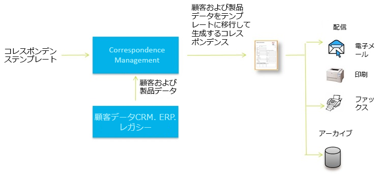

#### システム主導型 {#system-driven}

イベントトリガーによって通信が自動生成されます。例えば、事前の納税申告を促すリマインダー通知を市民に送信する場合、事前に定義されたテンプレートと市民データを結合することで生成されます。 完成したレターは、電子メールの送信、印刷、Fax 送信またはアーカイブで利用できます。

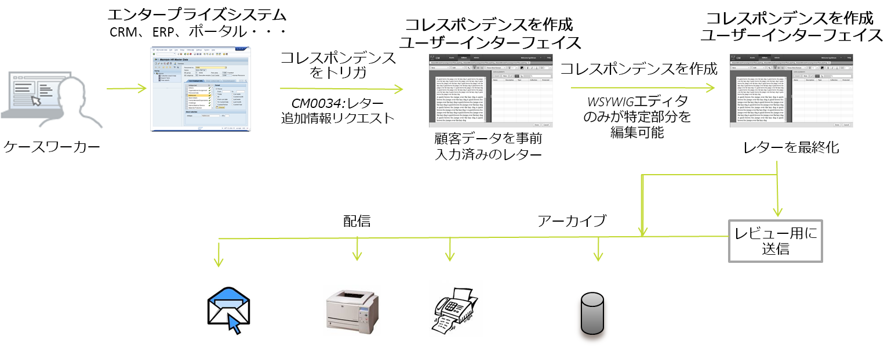

### 後処理 {#post-processing}

最終的な通信は、後処理のためにバックエンドプロセスに送信できます。通信は次のように処理できます。

1. 電子メール、Fax またはバッチ印刷用に処理したり、印刷または電子メールのためにフォルダーに配置したりできます。。
1. レビューおよび承認のために送信できます。
1. 電子署名、証明書、暗号化、または権限管理を適用することで保護できます。
1. アーカイブや監査のために必要なメタデータをすべて含む検索可能な PDF ドキュメントに変換できます。
1. マーケティング資料など、追加のドキュメントを含む PDF ポートフォリオに含めることができます。この PDF ポートフォリオは、最終的な通信として送信できます。

### Correspondence Management ソリューションのアーキテクチャ {#correspondence-management-solution-architecture}

次の図は、レターソリューションのアーキテクチャの例の概要です。

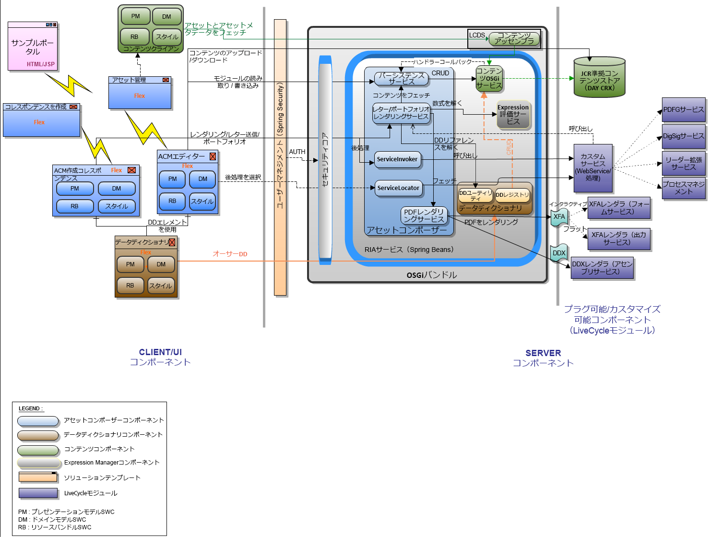

## レターの分解 {#deconstructing-a-letter}

次のキャンセル通知ドキュメントは、一般的な通信の例です。

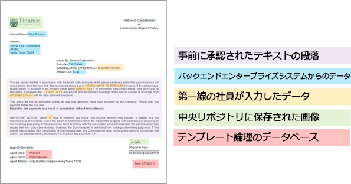

<table> 
 <tbody> 
  <tr> 
   <td><strong>レターの要素</strong></td> 
   <td><strong>説明</strong></td> 
   <td><strong>次を使って作成：</strong></td> 
  </tr> 
  <tr> 
   <td>バックエンドエンタープライズシステムからのデータ</td> 
   <td>バックエンドエンタープライズシステムが作成元のデータ。このデータは通信テンプレートと動的にマージされます。</td> 
   <td> データディクショナリに基づいて作成したデータファイル</td> 
  </tr> 
  <tr> 
   <td> 第一線の社員が入力したデータ</td> 
   <td>レターを送信する前にカスタマイズする第一線の社員が提供するデータ。  </td> 
   <td>
保護されていない DD 要素 編集可能なテキストの段落  変数/プレースホルダー  
 </td> 
  </tr> 
  <tr> 
   <td>事前に承認された テキストの段落</td> 
   <td>事前に承認されたテキストコンテンツ。レターの業務上の背景を理解している法務、財務、基幹業務のエキスパート。一般的に、テキストコンテンツの作成者。ヘッダー、フッター、免責事項、あいさつ文などのコンテンツはほとんどのレターに共通していますが、「終了の理由」などのコンテンツは特定のレターに固有です。</td> 
   <td>
テキスト\リスト\ 条件\レイアウト
 
 
 </td> 
  </tr> 
  <tr> 
   <td>データ カスタムロジックを基準としているか</td> 
   <td>要求に関する詳細情報を要求するレターなど、一部のレターでは、要求処理担当者などのユーザーがカスタムテキストコンテンツを追加できます。</td> 
   <td>Document  Fragment of type Condition </td> 
  </tr> 
  <tr> 
   <td>中央リポジトリに保存された 画像</td> 
   <td>ロゴや署名画像などの画像。会社ロゴなどの画像は、ほとんど、またはすべての通信に表示されますが、署名画像はレターに固有であり、レターを送信する担当者に固有です。</td> 
   <td>
AEM アセット（DAM）に保存されている画像   
 
 
 </td> 
  </tr> 
 </tbody> 
</table>

## 構成前にレターを分析 {#analyze-a-letter-before-you-construct-it}

すべてのレターを分析し、レターの様々な構成要素を明らかにします。アプリケーションスペシャリストは、生成された通信を分析します。

* 通信の静的な部分と動的な部分。バックエンドデータソースから、またはエンドユーザーによって入力される変数。
* 様々な段落を通信に配置する順序（通信の作成時にビジネスユーザーが段落を変更できるかどうかなど）。
* 通信はシステム生成か、それともエンドユーザーが通信を編集する必要があるか。システム生成される通信の数と、必要なユーザー操作の回数。
* 通信テンプレートの変更の頻度。毎年、毎四半期、または特定の法律が変更された場合など。予想される変更の種類。誤植、レイアウトの変更、フィールドの追加、段落の追加などを修正する変更か。
* 通信の要件を計画する場合、新しい通信テンプレートのリストをアセンブルします。通信テンプレートごとに、次のデータが必要です。

   * テキストの条項、画像およびテーブル
   * バックエンドシステムのデータ値
   * 通信のレイアウトおよびフラグメントレイアウト
   * レターにコンテンツを配置する順序と、コンテンツの包含および除外のルール

* 要求処理担当者やケースワーカーなどのビジネスユーザーがレターのコンテンツや一部を変更する条件。
* シナリオとは、レターソリューションを使用するユーザーの体験、要件、および利点の説明を指します。
* 次の事項も説明します。プロジェクトで必要とする必須スキルセットとツール。
* 実装方法を計画するためのベストプラクティス「実装の概要。

## 分析を行う利点 {#benefits-of-performing-the-analysis}

**コンテンツの再利用** ：通信の生成に必要な新しいコンテンツの統合リストを利用できます。 ヘッダー、フッター、免責事項、あいさつ文など、多数のコンテンツは多くのレターに共通しているので、様々なレターで再利用できます。このようなすべての共通コンテンツは、専門の担当者が一度作成して承認した後、多くの通信で再利用できます。

**データディクショナリの構築** 「顧客ID」や「顧客名」など、多くのレターに共通のデータ値が存在します。 このようなすべてのデータ値の統合的なリストを準備できます。一般的に、構造を計画する場合は企業のミドルウェアチームに相談します。これは Data Dictionary の構築の基礎になります。

**バックエンドエンタープライズシステムからのデータ** ：必要なすべてのデータ値と、エンタープライズシステムデータの取得元も把握できます。 その結果、エンタープライズシステムからデータを抽出し、Letters Solution にフィードする実装を設計できます。

**レターの複雑さの予測** ：特定の通信を作成する際の複雑さを判断することが重要です。 この分析は、レターテンプレートの作成に必要な合計時間とスキルセットを判断する際に役立ちます。結果として、この情報は Letters Solution の実装に必要なリソースとコストを見積もる際にも役立ちます。

## 通信の複雑さ {#correspondence-complexity}

通信の複雑さは、次のパラメーターを分析して判断できます。

**レイアウトの複雑さ** レイアウトの複雑さはどの程度か。 キャンセル通知などのレターは、簡単なレイアウトを持ちます。 一方、要求保証範囲などのレターのレイアウトは複雑で、いくつかのテーブルと 60 以上のフォームフィールドがあります。複雑なレイアウトを作成するには時間がかかり、レイアウトデザインの高度なスキルセットが必要です。

**段落と条件の数ローン契約は** 、長さ10ページで、40を超える条項を含むことができます。 これらの条項の多くは、「ローンのパラメーター」に依存しています。 正確な契約条件に基づいて、契約書に条項を含めるか除外します。このようなレターを作成するには、複雑な条件の綿密な計画と慎重な定義が必要です。

次の表に、レターを分類するために使用できるガイドラインの一部を示します。

<table> 
 <tbody> 
  <tr> 
   <td>
<strong>複雑さのレベル</strong>
 </td> 
   <td>
<strong>レイアウトの複雑さ（主観）</strong>
 </td> 
   <td>
<strong>段落の数</strong>
 </td> 
   <td>
<strong>条件テキストまたは画像の数</strong>
 </td> 
   <td>
<strong>必要なスキルセット</strong>
 </td> 
  </tr> 
  <tr> 
   <td>
低度の複雑さ
 </td> 
   <td>
低い。レイアウトのフィールドは少数です（15 未満）。
 
通常の長さは 1 ページです。
 </td> 
   <td>
8
 </td> 
   <td>
1
 </td> 
   <td>
中程度の Designer スキル。
 </td> 
  </tr> 
  <tr> 
   <td>
中度の複雑さ
 </td> 
   <td>
中度の複雑さのレイアウト。テーブルなどの構造が含まれます。通常の長さは 2 ページ以上です。
 </td> 
   <td>
16
 </td> 
   <td>
2
 </td> 
   <td>
中程度の Designer スキル。
 
 
 
ユーザーインターフェイスを使用して複雑な式を作成する能力。
 </td> 
  </tr> 
  <tr> 
   <td>
高い複雑さ
 </td> 
   <td>
複雑なレイアウト。3 ページを超える可能性があります。複数のテーブルと 60 を超えるフォームフィールドが含まれます。
 </td> 
   <td>
40
 </td> 
   <td>
8
 </td> 
   <td>
Designer のエキスパートスキル。
 
 
 
ユーザーインターフェイスを使用して複雑な式を作成する能力。
 </td> 
  </tr> 
 </tbody> 
</table>

## レターの作成の概要 {#overview-of-creating-a-letter}

1. レターの基礎として使用する適切なレイアウトを選択し、レターを作成します。
1. データモジュールまたはレイアウトフラグメントをレターに追加して、レターを構成します。
1. 選択して、通信をプレビューします。
1. フィールド、変数、コンテンツおよび添付ファイルを編集し、設定します。

### 前提条件 {#prerequisites}

通信を作成するには、最初に、次のものを用意する必要があります。

* [互換性パッケージ](compatibility-package.md). Install the Compatibility Package to view the **Letters** option on the **Forms** page.
* レター XDP（[レイアウト](/help/forms/using/document-fragments.md)）。
* レターのパーツを形成するその他の XDP （[レイアウトフラグメント](document-fragments.md#document-fragments)）。The XDPs\Layouts are created in [Designer](https://help.adobe.com/en-US/AEMForms/6.1/DesignerHelp/).
* The relevant [data dictionary](/help/forms/using/data-dictionary.md) (Optional).
* 通信に使用する[データモジュール](/help/forms/using/document-fragments.md)。
* [Test Dataは](/help/forms/using/data-dictionary.md#p-working-with-test-data-p) 、テストデータが格納されたXMLファイルです。 データディクショナリを使用する場合は、テストデータが必要です。

## レターテンプレートの作成 {#create-a-letter-template}

### レイアウトを選択してレターのプロパティを入力する {#select-a-layout-and-enter-the-letter-properties}

1. 「**フォーム**」／「**レター**」を選択します。

1. Select **Create > Letter**. Correspondence Managementに使用可能なレイアウト(XDP)が表示されます。 これらのレイアウトは Designer にあるものです。これらのレイアウトには、Correspondence Management に付属している初期状態のレターテンプレートも含まれています。Correspondence Management のテンプレートについて詳しくは、「[参照レターテンプレート](/help/forms/using/reference-cm-layout-templates.md)」を参照してください。To add your own layouts, create XDP (layout) files in Designer and then [upload them to AEM Forms](/help/forms/using/get-xdp-pdf-documents-aem.md).

   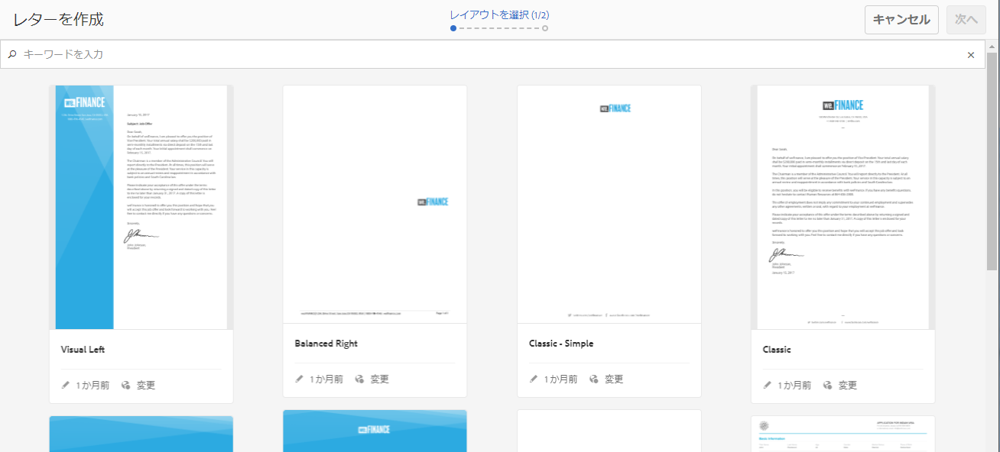

1. Select a layout by tapping it and tap **Next**.

   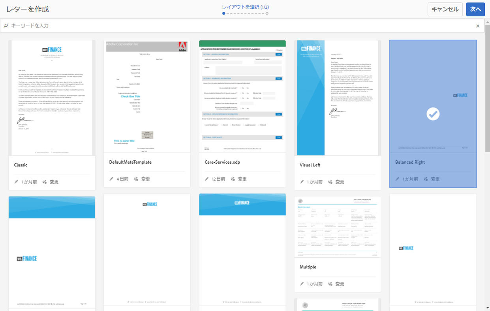

1. Enter the properties for the Correspondence and tap **Save:**

   * **タイトル（オプション）:** レターのタイトルを入力します。 タイトルは一意である必要はなく、特殊文字や英語以外の文字を含めることもできます。
   * **名前：** レターの一意の名前。 どのような状態であっても、2 つのレターに同じ名前を付けることはできません。「名前」フィールドでは、英数字およびハイフンのみ使用できます。「名前」フィールドは、タイトルフィールドに基づいて自動的に入力されます。「タイトル」フィールドに入力した特殊文字、スペース、数字および英数字以外の文字は、ハイフンに置き換えられます。 「タイトル」フィールドの値は「名前」フィールドに自動的にコピーされますが、値を編集することもできます。
   * **説明（オプション）：**&#x200B;参考用となる、レターの説明。
   * **データディクショナリ（オプション）**:データディクショナリは通信に関連付けることができます。 後でこの通信に挿入するアセットは、ここで通信用に選択したものと同じデータディクショナリを持つか、データディクショナリを持たない必要があります。
   * **タグ（オプション）:** 通信に適用するタグを選択します。 また、新しいタグやカスタムタグの名前を入力し、Enterキーを押して作成することもできます。
   * **後処理（オプション）:** レターテンプレートに適用する後処理を選択します。 既製の後処理と、電子メールや印刷などの AEM を使用して作成する後処理があります。
   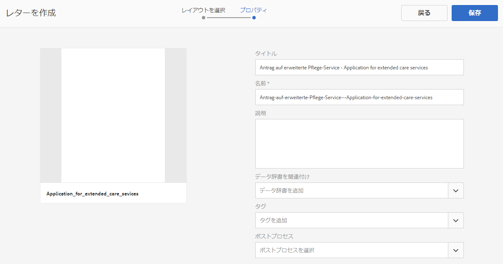

1. システムに「レターが正しく作成されました」というメッセージが表示されます。(in the alert message) Tap **Open** to configure the data modules and layout fragments in it. Or tap **Done** to go back to the previous page.

   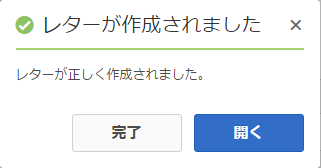

   **次へ**:「開く」をタッ **プすると**、Correspondence Managementにレイアウトが表示され、レイアウト(XDP)内のすべてのコンポーネントが一覧表示されます。 [データモジュールとレイアウトフラグメントの挿入と構成](/help/forms/using/create-letter.md#p-insert-data-modules-and-layout-fragments-in-a-letter-and-configure-them-p)の手順に進みます。

### データモジュールとレイアウトフラグメントをレターに挿入し、構成します。 {#insert-data-modules-and-layout-fragments-in-a-letter-and-configure-them}

通信を作成した後、「開く」をタップすると、レイアウトが表示され、レイアウト(XDP)内のすべてのサブフォーム/ターゲット領域が一覧表示されます。 各ターゲット領域では、データモジュールかレイアウトフラグメントのいずれかを挿入できます（さらに、レイアウトフラグメントにはデータモジュールを挿入できます）。

>[!NOTE]
>
>「レター」ページでレターの「編集」アイコンをタップして選択し、データモジュールとレイアウトフラグメントをレターに挿入して構成することもできます。

1. Tap **Insert** for each of the subforms and select Data Modules or a Layout Fragment to insert in each of the subforms.

   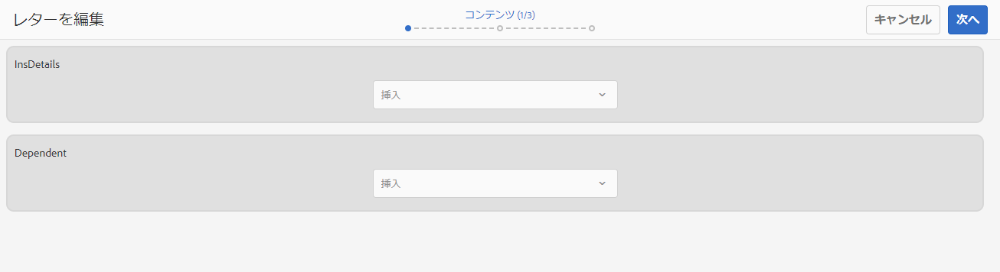

1. 各サブフォームのオプションに「データモジュール」または「レイアウトフラグメント」を選択し、挿入するデータモジュールまたはレイアウトフラグメントを選択します。さらに、レイアウトフラグメントには、そのデザインに応じて、データモジュールまたはレイアウトフラグメントを挿入できます（最大 4 レベル）。

   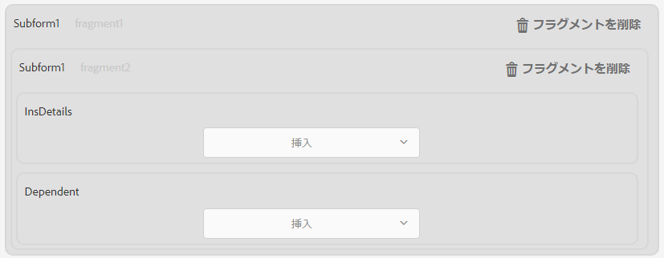

1. レイアウトフラグメントを挿入する場合、レイアウトフラグメントの名前がサブフォームに表示されます。また、選択したフラグメントに応じて、ネストされたサブフォームがサブフォームに表示されます。
1. 選択したデータモジュールをレイアウトに挿入したら、各モジュールの「編集」アイコンをタップすることで、設定モードをタップして次の設定を行うことができます。

   1. **編集可**：このオプションを選択すると、通信を作成ユーザーインターフェイスでこのコンテンツを編集できます。ビジネスユーザー（要求処理担当者など）が変更する必要がある場合にのみ、コンテンツに編集可能とマークを付けます。
   1. **必須**：このオプションを選択すると、通信作成用ユーザーインターフェイスでコンテンツが必須となります。
   1. **選択**：このオプションを選択すると、通信作成用ユーザーインターフェイスでこのコンテンツがデフォルトで選択されます。
   1. **インデント**：レター内のモジュール/コンテンツのインデントを増減します。インデントはレベル単位で指定します（ゼロから始まります）。それぞれのレベルのインデントは 36 ポイントです。フォームのカスタマイズ方法について詳しくは、「**[!UICONTROL フォームワークフロー]**」の「[Correspondence Management の設定](submit-letter-topostprocess.md#formsworkflow)」を参照してください。
   1. **直前に改ページ**：「直前に改ページ」をオンに設定した場合、このモジュールのコンテンツは常に新しいページに表示されます。
   1. **直後に改ページ**：特定のモジュールに対して「直後に改ページ」をオンに設定した場合、次のモジュールのコンテンツは常に新しいページに表示されます。
   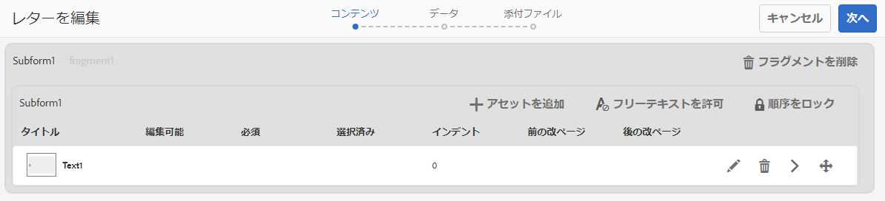

1. モジュールを編集するには、横にある「編集」アイコンをタップします。After editing the modules, tap **Save**.

   このページでは、サブフォームに対して次の操作も実行できます。

   1. **Allow Free Text**:「フリーテキストを許可」が有効な場合、ユーザーはCCRユーザーでレターにインラインテキストを追加できます。表示 CCR ビューでは、「フリーテキストを許可」を有効にしたターゲット領域では「T」アクションが有効になり、ユーザーがそれをタップすると、テキストの名前と説明を尋ねられます。その後、「OK」をタップすると、そのテキストが編集モードで開きますので、ユーザーはテキストを追加できます。この操作は、他のテキストモジュールの操作に似ています。
   1. **順序をロック**：レター内のサブフォームの順序をロックします。レターの作成中にサブフォーム/コンポーネントの順番を変更することはできません。
   このページでは、サブフォームの各アセットに対して次の操作も実行できます。

   1. **アセットの順序の変更**:アセットの並べ替えアイコン(dragndrop )を使用して、アセットをドラッグ&amp;ドロップします。
   1. **アセットの削除**：アセットを削除するには、横にある「削除」アイコンをタップします。
   1. **プレビュー**:アセットの横にあるプレビューを表示 (showpreview)をタップします。

1. 「**次へ**」をタップします。
1. 「データ」ページには、データフィールドと変数がテンプレートで使用されている詳細な状況が表示されます。データは、データディクショナリやユーザー入力などのデータソースにリンクできます。各フィールドでは、データをマッピングするデータディクショナリや、ユーザー入力フィールドに表示するキャプションなどのプロパティを定義します。

   リンケージ：

   * **フィールド**&#x200B;要素は、リテラル、データディクショナリ要素またはユーザー指定の値にリンクできます。「無視する」オプションに連結させると、フィールド要素を無視することもできます。
   * **変数**&#x200B;要素は、リテラル、データディクショナリ要素、フィールド、変数、アセット、ユーザー指定の値にリンクできます。
   リンケージには主に次のフィールドがあります。

   * **複数行**:フィールドまたは変数のデータ入力が複数行かどうかを指定できます。 このオプションを選択した場合、データ編集表示でフィールドまたは変数のための入力ボックスが複数行入力ボックスとして表示されます。フィールドまたは変数も通信を作成インターフェイスのデータとコンテンツのビューで複数行として表示されます。複数行入力フィールドは TextModule でコメントを入力するフィールドに類似しています。複数行オプションは、ユーザーまたは未保護データディクショナリ要素のリンケージタイプを持つフィールドおよび変数に対してのみ使用できます。
   * **オプション**:フィールドまたは変数の値をオプションにするかどうかを指定できます。 オプションのフィールドオプションは、ユーザーまたは未保護データディクショナリ要素のリンケージタイプを持つフィールドおよび変数で使用できます。

   * **フィールド/変数の検証**:フィールドまたは変数の値の検証を強化するために、フィールドまたは変数にバリデーターを割り当てることができます。 このオプションは、ユーザーまたは未保護データディクショナリ要素のリンケージタイプを持つフィールドおよび変数に対してのみ使用できます。
   * **キャプション**&#x200B;と&#x200B;**ツールチップ**：「キャプション」は、CCR ユーザーインターフェイスのフィールドの前に表示されるフィールドのラベルです。このオプションは、ユーザーまたは未保護データディクショナリ要素のリンケージタイプを持つフィールドおよび変数で使用できます。
   フィールドには次のタイプの検証を使用できます。

   * **文字列バリデーター**：文字列バリデーターを使用して、フィールドまたは変数に入力された文字列の最小と最大の長さを指定します。文字列バリデーターを作成する場合、有効な検証パラメーターを必ず指定してください。最小値と最大値の両方に有効な長さを入力します。文字列バリデーターには、入力する値の長さの最小値と最大値を指定できます。入力した値が指定した範囲の外にある場合は、CCR ユーザーインターフェイスの関連するフィールドが赤色でマークされます。  

   * **数値バリデーター**：数値バリデーターを使用して、フィールドまたは変数に入力される数値の最小値と最大値を指定します。数値バリデーターを作成する場合、有効な検証パラメーターを必ず指定してください。最小値と最大値の両方に数値を入力します。

   * **正規表現バリデーター**：正規表現バリデーターを使用して、フィールドまたは変数の値を検証するために使用される正規表現を定義します。さらに、エラーメッセージをカスタマイズできます。正規表現バリデーターを作成する場合、有効な正規表現を必ず指定してください。
   >[!NOTE]
   >
   >フィールドと変数のバリデーターはユーザーまたは未保護データディクショナリ要素のリンケージタイプを持つフィールドまたは変数のみで使用可能です。

   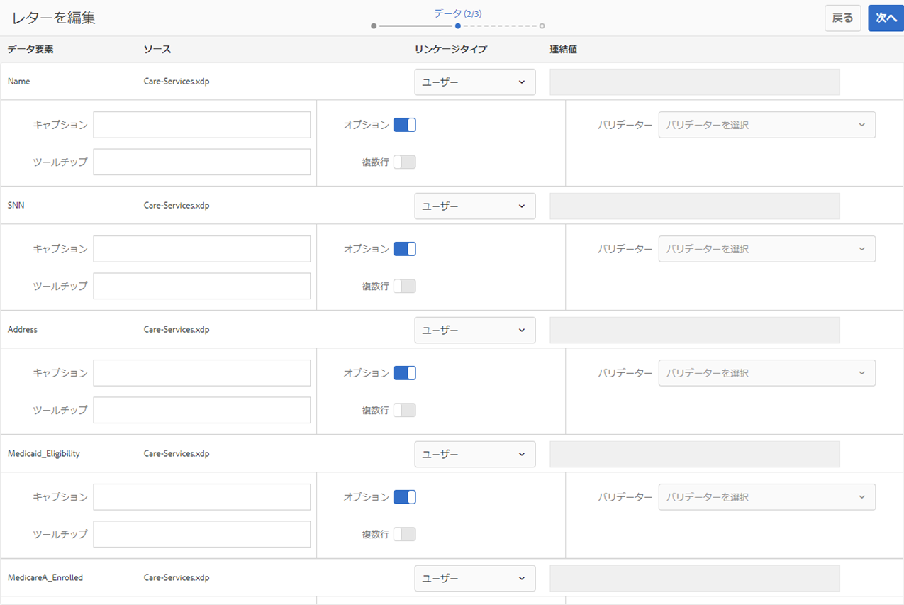

1. After specifying linkage, tap **Next**. Correspondence Managementに添付ファイル画面が表示されます。

### 添付ファイルのセットアップ {#set-up-the-attachments}

1. Select **Add Asset**.
1. In the Select Asset screen, tap the assets to attach with the letter and tap **Done**. 最初にアセットを「アセット」にアップロードしておく必要があります。PDFおよびMicrosoft Office画像のみを添付することをお勧めしますが、ドキュメントを添付することもできます。 For more information on uploading assets in DAM, see [Uploading Assets](/help/assets/managing-assets-touch-ui.md).
1. To lock the order of the assets in the list so that the Claims Adjustor cannot change the order, tap **Lock Order**. このオプションを選択しない場合、要求処理担当者はリスト項目の順序を変更できます。
1. To change the order of the assets, drag-and-drop an asset holding the reorder icon for an asset ( ).
1. Tap **Edit** in front of an attachment and specify an attachment as Mandatory if you do not want the author to be able to delete it. CCRインターフェイスで事前に選択する場合は、添付ファイルを「選択済み」に指定します。
1. ライブラリへのアクセス権を設定するには、「**ライブラリアクセス**」を選択します。「ライブラリアクセス」が有効であれば、要求処理担当者がレターを作成する際に、ライブラリにアクセスして添付ファイルを挿入することができます。
1. Select **Attachments Configuration** and specify the maximum number of attachments.

1. 「**保存**」をタップします。通信が作成され、レターページに表示されます。

Correspondence Management でレターテンプレートを作成したら、エンドユーザー/エージェント/要求処理担当者は CCR ユーザーインターフェイスでレターを開き、データを入力して、コンテンツを設定し、添付ファイルを管理することで、通信を作成できます。For more information, see [Create Correspondence](/help/forms/using/create-correspondence.md).

## 各フィールドごとに使用できるリンケージのタイプ {#types-of-linkage-available-for-each-of-the-fields}

次の表で、各種フィールドで使用できるリンケージのタイプについて説明します。

表の次の値

* **はい**： 一番左の列に記載されているフィールドタイプが、そのマッピングタイプをサポートすることを意味します。
* **いいえ**:一番左の列のフィールドタイプは、そのタイプのマッピングをサポートしていません
* **該当なし**:一番左の列のフィールドタイプは適用できません

<table> 
 <tbody> 
  <tr> 
   <td> </td> 
   <td><strong>リテラル</strong></td> 
   <td><strong>アセットの</strong></td> 
   <td><strong>データディクショナリ</strong></td> 
   <td><strong>大文字と小文字を</strong></td> 
   <td><strong>ユーザー</strong></td> 
   <td><strong>フィールド</strong></td> 
   <td><strong>変数</strong></td> 
  </tr> 
  <tr> 
   <td><strong>date</strong></td> 
   <td>はい</td> 
   <td>不可</td> 
   <td>可</td> 
   <td>可</td> 
   <td>はい</td> 
   <td>該当なし</td> 
   <td>該当なし</td> 
  </tr> 
  <tr> 
   <td><strong>時刻</strong></td> 
   <td>はい</td> 
   <td>不可</td> 
   <td>可</td> 
   <td>可</td> 
   <td>はい</td> 
   <td>該当なし</td> 
   <td>該当なし</td> 
  </tr> 
  <tr> 
   <td><strong>datetime</strong></td> 
   <td>はい</td> 
   <td>不可</td> 
   <td>可</td> 
   <td>可</td> 
   <td>はい</td> 
   <td>該当なし</td> 
   <td>該当なし</td> 
  </tr> 
  <tr> 
   <td><strong>integer</strong></td> 
   <td>はい</td> 
   <td>不可</td> 
   <td>可</td> 
   <td>可</td> 
   <td>はい  </td> 
   <td>該当なし</td> 
   <td>該当なし</td> 
  </tr> 
  <tr> 
   <td><strong>float</strong></td> 
   <td>はい</td> 
   <td>不可</td> 
   <td>可</td> 
   <td>可</td> 
   <td>はい  </td> 
   <td>該当なし</td> 
   <td>該当なし  </td> 
  </tr> 
  <tr> 
   <td><strong>richtext</strong></td> 
   <td>可</td> 
   <td>テキストのみ</td> 
   <td>はい</td> 
   <td>可</td> 
   <td>はい</td> 
   <td>該当なし</td> 
   <td>該当なし</td> 
  </tr> 
  <tr> 
   <td><strong>プレーンテキ</strong><strong>スト</strong></td> 
   <td>可</td> 
   <td>テキストのみ</td> 
   <td>はい</td> 
   <td>可</td> 
   <td>はい</td> 
   <td>該当なし</td> 
   <td>該当なし</td> 
  </tr> 
  <tr> 
   <td><strong>画像</strong></td> 
   <td>不可</td> 
   <td>画像のみ</td> 
   <td>不可</td> 
   <td>可</td> 
   <td>不可</td> 
   <td>該当なし</td> 
   <td>該当なし</td> 
  </tr> 
  <tr> 
   <td><strong>signature</strong></td> 
   <td>不可</td> 
   <td>不可</td> 
   <td>不可  </td> 
   <td>はい</td> 
   <td>不可</td> 
   <td>該当なし</td> 
   <td>該当なし  </td> 
  </tr> 
 </tbody> 
</table>

## レターテンプレートのコピーを作成する {#createcopylettertemplate}

既存のレターテンプレートを使用することで、ドキュメントフラグメントやデータ辞書などのプロパティ、コンテンツ、および継承されたアセットを持つレターテンプレートをすばやく作成できます。既存のレターテンプレートを使用するには、レターをコピーして貼り付けます。

1. 「レター」ページで、1 つ以上のレターを選択します。UI に「コピー」アイコンが表示されます。
1. 「コピー」をタップします。UI に「貼り付け」アイコンが表示されます。レターを貼り付ける前に、フォルダー内に移動することもできます。複数のフォルダーに同じ名前のアセットを保管することができます。For more information on folders, see [Folders and organizing assets](/help/forms/using/import-export-forms-templates.md#folders-and-organizing-assets).
1. 「貼り付け」をタップします。貼り付けダイアログが表示されます。複数のレターをコピーして同じ場所に貼り付けると、それらのレターの新しいコピーに対して名前とタイトルが自動的に割り当てられますが、その名前とタイトルは編集することができます。
1. 必要に応じて、保存するレターのタイトルと名前を編集します。
1. 「貼り付け」をタップします。レターのコピーが作成されます。これで、新しく作成されたレターで必要な変更を行うことができます。

