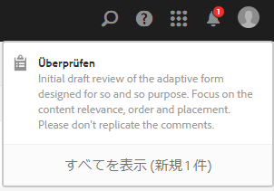
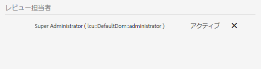
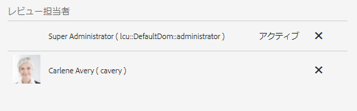

# フォームのアセットに対するレビューの作成と管理{#creating-and-managing-reviews-for-assets-in-forms}

## レビュー {#review}

レビューとは、フォーム内のアセットに対し、1 人または複数のレビュー担当者にコメントを許可するメカニズムです。

## レビューの設定 {#setting-up-a-review}

1. 「Forms」タブに移動し、フォームを選択します。
1. アセットに進行中のレビューがない場合には、レビューを開始  アイコンがアクションバーに表示されます。レビューを開始  アイコンをクリックします。
1. 以下の情報を入力します。

   * レビュー名：必須。には、英数字、ハイフン、アンダースコアを含めることができます。
   * レビューの説明：（オプション）レビューの目的/コンテンツの説明。
   * レビュー期限：（オプション）レビューが終了する日付です。 期限を過ぎている場合、タスクが「期限切れ」と表示されます。
   * レビュー担当者：最低でも 1 人は必須です。コンボボックスを使用して、レビュー担当者を追加します。 名前を入力すると、一致する名前がすべて表示されます。名前を選択し、「追加」をクリックします。

1. 残りの詳細を入力し、[ 開始 ] をクリックします。

### レビューが設定されたときに発生するアクション {#actions-that-occur-when-a-review-is-set-up}

本セクションでは、レビューが作成・設定された場合に起こるアクションを説明します。

1. 新しいレビュータスクが作成され、レビューの開始者に割り当てられます。
1. すべてのレビュー担当者にレビュータスクが割り当てられます。 タスクが通知セクションに表示されます。 レビュー担当者は、通知をクリックするか、インボックスに移動してタスクを表示することができます。 レビュー担当者は、レビュータスクを開いてフォームを表示し、コメントの入力を開始することができます。

   

   レビュー担当者通知アラート

1. コメントボックスは、アセットのイニシエーターとレビュー担当者が使用できます。 その他のユーザーは、コメントを表示することはできますが、コメントを書き込むことはできません。

## レビューの管理 {#managing-a-review}

>[!NOTE]
>
>変更できるのは、進行中のレビューのみです。 完了しているレビューは変更できません。

1. 「フォーム」タブに移動し、フォームを選択します。

1. アセットに進行中のレビューがあり、自分がレビューの開始者の場合、アクションバーにレビューを管理  アイコンが表示されます。レビューの開始者のみがレビューを管理（更新／終了）することができます。

   レビューを管理  アイコンをクリックします。

   開始者以外のユーザーに対しては、レビューを管理アイコンは表示されません。

1. 次の情報を含む画面が表示されます。

   * **レビュー名**：編集できません。

   * **レビューの説明**：編集可能です。

   * **レビューの期限**：編集可能です。期限は、現在の日付と時刻よりも後の日付に変更することができます。

   * **レビュー担当者**:編集可能です。 レビュー担当者を追加または削除できます。 タスクが期限切れの場合、期限を現在の日付より後に延長した後でなければ、レビュー担当者を追加できません。

1. レビューを終了するには、「終了」をクリックします。

### レビューが修正されると発生するアクション {#actions-that-occur-when-a-review-is-modified}

ここでは、レビューの終了/変更時に起こることについて説明します。

1. レビューの説明が修正された場合、レビュー担当者および開始者の対応するタスクが更新されます。
1. レビューの期限が修正された場合、レビュー担当者の対応するタスクの期限が更新されます。

1. レビュー担当者が削除された場合：

   

   レビュー担当者の削除

   1. 未完了の場合は、割り当てられたタスクが終了します。
   1. レビュー担当者は、アセットにコメントを付けることができなくなりました。

1. レビュー担当者が追加された場合：

   

   レビュー担当者の追加

   1. レビュータスクが作成され、新しく追加されたレビュー担当者に割り当てられます。
   1. 新しく追加されたレビュー担当者は、アセットにコメントを追加できます。

1. レビューが終了した場合：

   1. **レビュー担当者**:レビュー担当者ごとに、レビューに関連する未完了のタスクが終了します。 レビュー担当者の「通知」セクションに、タスクが「保留中」と表示されなくなりました。
   1. **イニシエーター**:レビュー開始者に割り当てられたタスクが完了とマークされます。 レビュー開始者の「通知」セクションからタスクが削除されます。
   1. **すべて**:レビューが「以前のレビュー」セクションに表示されます。 これ以上コメントを追加することはできません。
