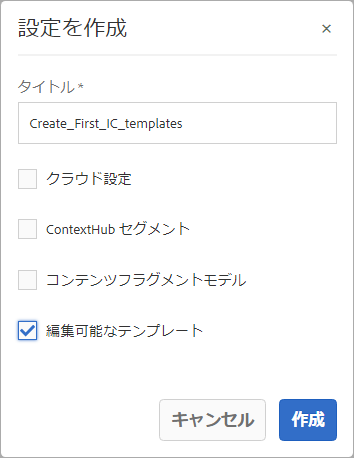

# チュートリアル：テンプレートの作成{#tutorial-create-templates}

これは、「[最初のインタラクティブ通信の作成](/help/forms/using/create-your-first-interactive-communication.md)」シリーズを構成するチュートリアルです。チュートリアルの使用例全体を理解、実行、デモするために、シリーズを時系列に沿って実施することをお勧めします。

インタラクティブ通信を作成するには、AEMサーバー上で印刷チャネルと Web チャネル用のテンプレートを使用できる必要があります。

印刷チャネルのテンプレートは、AdobeForms Designer で作成され、AEMサーバーにアップロードされます。 その後、これらのテンプレートは、インタラクティブ通信の作成時に使用できます。

Web チャネルのテンプレートは、AEMで作成されます。 テンプレートの作成者と管理者は、Web テンプレートの作成、編集、有効化をおこなうことができます。 作成して有効にすると、インタラクティブ通信の作成時にこれらのテンプレートを使用できるようになります。

このチュートリアルでは、印刷チャネルと Web チャネル用のテンプレートを作成し、インタラクティブ通信の作成時に使用できるようにする手順を説明します。 このチュートリアルを完了すると、次の操作を実行できるようになります。

* AdobeForms Designer を使用した印刷チャネル用の XDP テンプレートの作成
* XDP テンプレートのAEM Forms Server へのアップロード
* Web チャネル用のテンプレートの作成と有効化

## 印刷チャネル用のテンプレートを作成する {#create-template-for-print-channel}

次のタスクを使用して、インタラクティブ通信の印刷チャネル用のテンプレートを作成および管理します。

* [Forms Designer を使用して XDP テンプレートを作成する](../../forms/using/create-templates-print-web.md#create-xdp-template-using-forms-designer)
* [AEM Forms サーバーに XDP テンプレートをアップロードする](../../forms/using/create-templates-print-web.md#upload-xdp-template-to-the-aem-forms-server)
* [レイアウトフラグメント用に XDP テンプレートを作成する](../../forms/using/create-templates-print-web.md#create-xdp-template-for-layout-fragments)

### Forms Designer を使用して XDP テンプレートを作成する {#create-xdp-template-using-forms-designer}

[ユースケース](/help/forms/using/create-your-first-interactive-communication.md)および[分析](/help/forms/using/planning-interactive-communications.md)に基づき、XDP テンプレート内に、次のサブフォームを作成します。

* 請求明細：ドキュメントフラグメントが含まれます
* 顧客情報：ドキュメントフラグメントが含まれます
* 請求内容：ドキュメントフラグメントが含まれます
* 概要：ドキュメントフラグメント（料金のサブフォーム）およびグラフ（グラフのサブフォーム）が含まれます
* 通話明細：テーブル（レイアウトフラグメント）が含まれます
* Pay Now：画像が含まれます
* 付加価値サービス：画像が含まれます

XDP ファイルをFormsサーバーにアップロードした後、これらのサブフォームは印刷テンプレートのターゲット領域として表示されます。 インタラクティブ通信の作成時に、ドキュメントフラグメント、グラフ、レイアウトフラグメント、画像などのすべてのエンティティがターゲット領域に追加されます。

次の手順を実行して、印刷チャネル用の XDP テンプレートを作成します。

1. テンプレート作成用のフォームを表示するには、Forms Designer を開き、**ファイル**／**新規**／**空白のフォームを使用を選択し、**「**次へ**」、「**完了**」の順にタップします。

   「**オブジェクトライブラリ**」および「**オブジェクト**」オプションが **Window** メニューから選択されていることを確認します。

1. **サブフォーム**&#x200B;コンポーネントを&#x200B;**オブジェクトライブラリ**&#x200B;からフォームにドラッグアンドドロップします。
1. 右側のペインの「**オブジェクト**」ウィンドウのサブフォームを表示するには、「サブフォーム」を選択します。
1. 「**サブフォーム**」タブを選択し、「**コンテンツ**」ドロップダウンリストから「**フローレイアウト**」を選択します。長さを調整するには、サブフォームの左のエンドポイントをドラッグします。
1. 「**連結**」タブで、次の手順を実行します。

   1. 「**名前**」フィールドに、**BillDetails** と入力します。

   1. 「**データ連結**」ドロップダウンリストから「**データ連結なし**」を選択します。

   

1. 同様に、ルートサブフォームを選択し、「**サブフォーム**」タブを選択し、「**コンテンツ**」ドロップダウンリストから「**フローレイアウト**」を選択します。「**連結**」タブで、次の手順を実行します。

   1. 「**名前**」フィールドに **TelecaBill** と入力します。

   1. 「**データ連結**」ドロップダウンリストから「**データ連結なし**」を選択します。

   

1. 手順 2 ～ 5 を繰り返して、次のサブフォームを作成します。

   * BillDetails
   * CustomerDetails
   * BillSummary
   * 概要 - このサブフォームの「**サブフォーム**」タブを選択し、「**コンテンツ**」ドロップダウンリストから「**配置済み**」を選択します。次のサブフォームを **概要** サブフォーム。

      * 料金
      * グラフ

   * ItemisedCalls
   * PayNow
   * ValueAddedServices

   時間を節約するために、既存のサブフォームをコピーして貼り付け、新しいサブフォームを作成することもできます。

   **グラフ**&#x200B;サブフォームを料金サブフォームの右側にシフトするには、左側のペインから&#x200B;**グラフ**&#x200B;サブフォームを選択し、「**レイアウト**」タブを選択し、「**AnchorX**」フィールドの値を指定します。指定する値は、**料金**&#x200B;サブフォームの「**幅**」フィールドの値よりも大きい値である必要があります。**料金**&#x200B;サブフォームを選択し、「**レイアウト**」タブを選択し、「**幅**」フィールドの値を表示します。

1. **テキスト**&#x200B;オブジェクトを、**オブジェクトライブラリ**&#x200B;からフォームにドラッグアンドドロップし、ボックスに **Dial XXXX to subscribe** とテキストを入力します。
1. 左側のペインのテキストオブジェクトを右クリックし、「**オブジェクト名の変更**」を選択し、「**登録**」として、テキストオブジェクト名を入力します。

   

1. ローカルのファイルシステムにファイルを保存するには、**ファイル**／**名前を付けて保存**&#x200B;を選択して、次の手順を実行します。

   1. ファイルを保存する場所に移動し、名前を指定します。 **create_first_ic_print_template**.
   1. 選択 **.xdp** から **名前を付けて保存** 」ドロップダウンリストから選択できます。

   1. 「**保存**」をタップします。

### AEM Forms サーバーに XDP テンプレートをアップロードする {#upload-xdp-template-to-the-aem-forms-server}

Forms Designer を使用して XDP テンプレートを作成したら、そのテンプレートをAEM Formsサーバーにアップロードして、インタラクティブ通信の作成時に使用できるようにする必要があります。

1. **[!UICONTROL フォーム]**／**[!UICONTROL フォームとドキュメント]**&#x200B;を選択します。
1. **作成**／**ファイルのアップロード**&#x200B;をタップします。

   **create_first_ic_print_template** テンプレート（XDP）に移動して選択し、「**開く**」をタップして、XDP テンプレートを AEM Forms サーバーに読み込みます。

### レイアウトフラグメント用に XDP テンプレートを作成する {#create-xdp-template-for-layout-fragments}

インタラクティブ通信の印刷チャネル用のレイアウトフラグメントを作成するには、Forms Designer を使用して XDP を作成し、AEM Formsサーバーにアップロードします。

1. テンプレート作成用のフォームを表示するには、Forms Designer を開き、「**ファイル**／**新規**／**空白のフォームを使用**」を選択し、「**次へ**」、「**完了**」の順にタップします。

   「**オブジェクトライブラリ**」および「**オブジェクト**」オプションが **Window** メニューから選択されていることを確認します。

1. **テーブル**&#x200B;コンポーネントを&#x200B;**オブジェクトライブラリ**&#x200B;からフォームにドラッグ＆ドロップします。
1. テーブルの挿入ダイアログで、次の手順を実行します。

   1. 列数を次のように指定します。 **5**.
   1. ボディ行の数を **1**.
   1. を選択します。 **テーブルにヘッダー行を含める** チェックボックス。
   1. タブ **OK**.

1. タップ **+** の隣の左側のウィンドウ **テーブル** 1.右クリック **セル 1** を選択し、 **オブジェクト名を変更** から **日付**.

   同様に、名前を変更します。 **セル 2**, **セル 3**, **セル 4**、および **セル 5** から **時間**, **数値**, **期間**、および **料金** それぞれ

1. 「**Designer View**」のヘッダーテキストフィールドをクリックして、それらの名前を&#x200B;**時刻**、**番号**、**時間**&#x200B;および&#x200B;**料金**&#x200B;に変更します。

   

1. 左側のペインから&#x200B;**Row 1** を選択し、「**オブジェクト**／**連結**／**各データアイテムについて行を繰り返す**」を選択します。

   

1. **テキストフィールド**&#x200B;コンポーネントを&#x200B;**オブジェクトライブラリ**&#x200B;から **Designer View** にドラッグ＆ドロップします。

   

   同様に、**テキストフィールド**&#x200B;コンポーネントを&#x200B;**時刻**、**番号**、**時間**&#x200B;および&#x200B;**料金**&#x200B;行にドラッグアンドドロップします。

1. ローカルのファイルシステムにファイルを保存するには、「**ファイル**／**名前を付けて保存**」を選択して、次の手順を実行します。

   1. ファイルを保存する場所に移動し、**table_lf** と名前を指定します。
   1. 選択 **.xdp** から **名前を付けて保存** 」ドロップダウンリストから選択できます。

   1. 「**保存**」をタップします。

   Forms Designer を使用してレイアウトフラグメントの XDP テンプレートを作成したら、次の手順を実行します。 [アップロード](../../forms/using/create-templates-print-web.md#upload-xdp-template-to-the-aem-forms-server) AEM Formsサーバーに送信され、レイアウトフラグメントの作成時にテンプレートを使用できるようになります。

## Web チャネルのテンプレートを作成 {#create-template-for-web-channel}

次のタスクを使用して、インタラクティブ通信の Web チャネル用のテンプレートを作成および管理します。

* [テンプレート用フォルダーの作成](../../forms/using/create-templates-print-web.md#create-folder-for-templates)
* [テンプレートの作成](../../forms/using/create-templates-print-web.md#create-the-template)
* [テンプレートの有効化](../../forms/using/create-templates-print-web.md#enable-the-template)
* [インタラクティブ通信でボタンの有効化](../../forms/using/create-templates-print-web.md#enabling-buttons-in-interactive-communications)

### テンプレート用フォルダーの作成 {#create-folder-for-templates}

Web チャネルテンプレートを作成するには、作成したテンプレートを保存できるフォルダーを定義します。 そのフォルダー内にテンプレートを作成したら、テンプレートを有効にして、フォームユーザーがテンプレートに基づいてインタラクティブ通信の Web チャネルを作成できるようにします。

次の手順を実行して、編集可能テンプレート用のフォルダーを作成します。

1. 「**ツール**」  ／**設定ブラウザー**&#x200B;をタップします。
   * 詳しくは、[設定ブラウザー](/help/sites-administering/configurations.md)のドキュメントを参照してください。
1. 設定ブラウザーページで、「**作成**」をタップします。
1. **設定を作成**&#x200B;ダイアログで、フォルダー用タイトルとして **Create_First_IC_templates** を指定し、「**編集可能テンプレート**」を指定し、「**作成**」をタップします。

   

   **Create_First_IC_templates** フォルダーが作成され、**設定ブラウザー**&#x200B;ページに表示されます。

### テンプレートの作成 {#create-the-template}

[ユースケース](/help/forms/using/create-your-first-interactive-communication.md)および[分析](/help/forms/using/planning-interactive-communications.md)に基づき、web テンプレート内に、次のパネルを作成します。

* 請求明細：ドキュメントフラグメントが含まれます
* 顧客情報：ドキュメントフラグメントが含まれます
* 請求内容：ドキュメントフラグメントが含まれます
* 請求概要：ドキュメントフラグメントとグラフ（2 列のレイアウト）が含まれます
* 通話明細：テーブルが含まれます
* Pay Now：「**Pay Now**」ボタンと画像が含まれます
* 付加価値サービス：画像と「**登録**」ボタンが含まれます。

インタラクティブ通信の作成時に、ドキュメントフラグメント、グラフ、テーブル、画像、ボタンなどのすべてのエンティティが追加されます。

次の手順を実行して、 **Create_First_IC_templates** フォルダー：

1. **ツール**／**テンプレート**／**Create_First_IC_templates** フォルダーを選択して、適切なテンプレートフォルダーに移動します。
1. 「**作成**」をタップします。
1. 「**テンプレートタイプを選択**」設定ウィザードで、「**インタラクティブ通信 - web チャネル**」を選択し、「**次へ**」をタップします。
1. 「**テンプレート詳細**」設定ウィザードで、テンプレートタイトルとして **Create_First_IC_Web_Template** を指定します。オプション内容を指定し、「**作成**」をタップします。

   **Create_First_IC_Web_Template** という確認メッセージが表示されます。

1. タップ **開く** をクリックして、テンプレートエディターでテンプレートを開きます。
1. 選択 **初期コンテンツ** を選択します。 **プレビュー** オプション。

   

1. テンプレートに追加できるコンポーネントの一覧を表示するには、「**ルートパネル**」／**+** をタップします。
1. 選択 **パネル** リストからパネルを **ルートパネル**.
1. を選択します。 **コンテンツ** 」タブをクリックします。 手順 8 で追加された新しいパネルが、 **ルートパネル** コンテンツツリー内。

   

1. パネルを選択し、（設定）をタップします。
1. [ プロパティ ] ペインで、次の操作を行います。

   1. 指定 **billdetails** をクリックします。
   1. 指定 **請求の詳細** 」と入力します。
   1. 選択 **1** から **列数** 」ドロップダウンリストから選択できます。

   1. 「」をタップして、プロパティを保存します。

   パネルの名前がに更新されます。 **請求の詳細** コンテンツツリー内。

1. 手順 7 ～ 11 を繰り返して、次のプロパティを持つパネルをテンプレートに追加します。

   | 名前 | タイトル | 列数 |
   |---|---|---|
   | customerdetails | 顧客の詳細 | 1 |
   | billsummary | 請求の要約 | 1 |
   | 要約手数料 | 請求概要 | 2 |
   | itemisedcalls | 通話項目別 | 1 |
   | paynow | 今すぐ支払う | 2 |
   | 輸管 | 付加価値サービス | 1 |

   以下の画像では、すべてのパネルをテンプレートに追加した後のコンテンツツリーを示しています。

   

### テンプレートの有効化 {#enable-the-template}

Web テンプレートを作成したら、インタラクティブ通信の作成時にテンプレートを使用できるようにする必要があります。

Web テンプレートを有効にするには、次の手順を実行します。

1. **ツール** ／**テンプレート**&#x200B;をタップします。
1. **Create_First_IC_Web_Template** テンプレートに移動して選択し、「**有効**」をタップします。
1. タブ **有効にする** 再び確認します。

   テンプレートが有効になり、そのステータスが「有効」と表示されます。 Web チャネル用のインタラクティブ通信を作成する際に、このテンプレートを使用できます。

### インタラクティブ通信でボタンの有効化 {#enabling-buttons-in-interactive-communications}

ユースケースに基づいて、 **今すぐ支払う** および **購読** ボタン（アダプティブフォームコンポーネント）をインタラクティブ通信で使用する場合。 インタラクティブ通信でこれらのボタンを使用できるようにするには、次の手順を実行します。

1. 「**プレビュー**」オプションの隣にあるドロップダウンリストから、「**構造**」を選択します。
1. コンテンツツリーを使用して、**ドキュメントコンテナ**&#x200B;ルートパネルを選択し、「**ポリシー**」をタップして、インタラクティブ通信で使用が許可されているコンポーネントを選択します。

   

1. 「**プロパティ**」セクションの「**許可されているコンポーネント**」タブで、**アダプティブフォーム**&#x200B;コンポーネントから「**ボタン**」を選択します。

   

1. タップ  をクリックしてプロパティを保存します。
