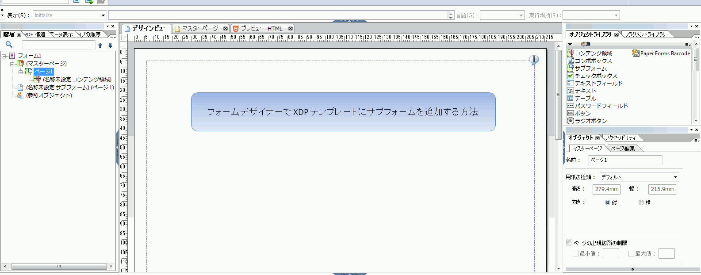
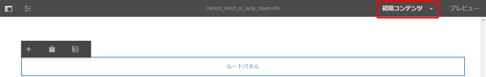
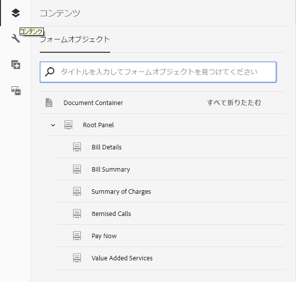
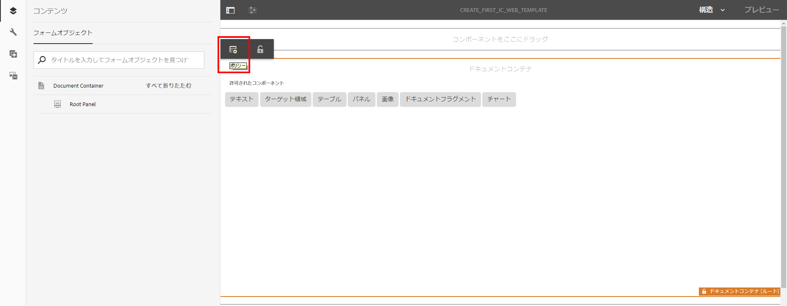

# チュートリアル：テンプレートの作成{#tutorial-create-templates}

このチュートリアルは、[最初の対話型通信を作成する](/help/forms/using/create-your-first-interactive-communication.md)シリーズのステップです。 チュートリアル内のユースケースを理解して実際に操作できるように、このシリーズのチュートリアルを最初から順に学習することをお勧めします。

インタラクティブ通信を作成するには、AEM サーバーに用意されている印刷チャネルと Web チャネル用のテンプレートを入手する必要があります。

印刷チャネルのテンプレートは Adobe Forms Designer で作成されて、AEM サーバーにアップロードされます。これらのテンプレートはインタラクティブ通信を作成する際に使用できるようになります。

Web チャネル用のテンプレートは AEM で作成されます。テンプレートの作成者と管理者は、Web テンプレートの作成、編集、有効化を行うことができます。作成して有効化されたテンプレートは、インタラクティブ通信を作成する際に使用できるようになります。

本チュートリアルは、印刷チャネル用および Web チャネル用のテンプレートの作成方法を順を追って説明します。これにより、作成されたテンプレートは、インタラクティブ通信を作成する際に使用できるようになります。このチュートリアルを完了すると、次の操作を実行できるようになります。

* Adobe Forms Designer を使用して印刷チャネル用の XDP テンプレートを作成する
* XDP テンプレートを AEM Forms サーバーにアップロードする
* Web チャネル用のテンプレートを作成し有効化する

## 印刷チャネル用のテンプレートの作成  {#create-template-for-print-channel}

次のタスクを使用して、インタラクティブ通信の印刷チャネル用のテンプレートの作成と管理を行います。

* [Forms Designer を使用して XDP テンプレートを作成する](../../forms/using/create-templates-print-web.md#create-xdp-template-using-forms-designer)
* [AEM Forms サーバーに XDP テンプレートをアップロードする](../../forms/using/create-templates-print-web.md#upload-xdp-template-to-the-aem-forms-server)
* [レイアウトフラグメント用に XDP テンプレートを作成する](../../forms/using/create-templates-print-web.md#create-xdp-template-for-layout-fragments)

### Forms Designer を使用して XDP テンプレートを作成する  {#create-xdp-template-using-forms-designer}

[使用例](/help/forms/using/create-your-first-interactive-communication.md)と[解剖学](/help/forms/using/planning-interactive-communications.md)に基づいて、XDPテンプレートに次のサブフォームを作成します。

* 請求明細：ドキュメントフラグメントが含まれます
* 顧客の詳細：ドキュメントフラグメントを含む
* 請求書要約：ドキュメントフラグメントを含む
* サマリ：ドキュメントフラグメント（Chargesサブフォーム）とグラフ（Chartsサブフォーム）を含みます
* 呼び出しの項目別：テーブルを含む（レイアウトフラグメント）
* 今すぐ支払う：画像を含む
* 付加価値サービス：画像を含む

XDP ファイルを Forms サーバーにアップロード後、これらのサブフォームは印刷テンプレートのターゲット領域として表示されます。インタラクティブ通信を作成する際に、ドキュメントフラグメント、グラフ、レイアウトフラグメント、画像などのすべてのエンティティがターゲット領域に追加されます。

印刷チャネル用に XDP テンプレートを作成するには、次の手順を実行します。

1. Formsデザイナーを開き、**ファイル**/**新規**/**空のフォームを使用し、**「**次へ**」をタップしてから、**「**&#x200B;完了」をタップしてテンプレート作成用にフォームを開きます。

   「**オブジェクトライブラリ**」および「**オブジェクト**」オプションが **Window** メニューから選択されていることを確認します。

1. **サブフォーム**&#x200B;コンポーネントを&#x200B;**オブジェクトライブラリ**&#x200B;からフォームにドラッグアンドドロップします。
1. 右側のペインの「**オブジェクト**」ウィンドウのサブフォームを表示するには、「サブフォーム」を選択します。
1. 「**サブフォーム**」タブを選択し、**コンテンツ**&#x200B;ドロップダウンリストから「**フローレイアウト**」を選択します。 長さを調整するには、サブフォームの左のエンドポイントをドラッグします。
1. 「**連結**」タブで、次の手順を実行します。

   1. 「**名前**」フィールドに&#x200B;**BillDetails**&#x200B;を指定します。

   1. 「**データ連結**」ドロップダウンリストから「**データ連結なし**」を選択します。

   

1. 同様に、ルートサブフォームを選択し、「**サブフォーム**」タブを選択し、**コンテンツ**&#x200B;ドロップダウンリストから「**フローレイアウト**」を選択します。 「**連結**」タブで、次の手順を実行します。

   1. 「**名前**」フィールドに「**TelecaBill**」と指定します。

   1. 「**データ連結**」ドロップダウンリストから「**データ連結なし**」を選択します。

   

1. 手順 2～5 を繰り返し、次のサブフォームを作成します。

   * BillDetails
   * CustomerDetails
   * BillSummary
   * 概要 — 「**サブフォーム**」タブを選択し、このサブフォームの&#x200B;**コンテンツ**&#x200B;ドロップダウンリストから「**位置固定**」を選択します。 次のサブフォームを&#x200B;**概要**&#x200B;サブフォームに挿入します。

      * 料金
      * グラフ
   * ItemisedCalls
   * PayNow
   * ValueAddedServices

   時間を節約するには、既存のサブフォームをコピー＆ペーストして新しいサブフォームを作成することもできます。

   **Charges**&#x200B;サブフォームをChargesサブフォームの右に移動するには、左ペインから「**Charts**」サブフォームを選択し、「**Layout**」タブを選択して、**AnchorX**&#x200B;フィールドの値を指定します。 指定する値は、**料金**&#x200B;サブフォームの「**幅**」フィールドの値よりも大きい値である必要があります。「**課金**」サブフォームを選択し、「**レイアウト**」タブを選択して、**幅**&#x200B;フィールドの値を表示します。

1. **テキスト**&#x200B;オブジェクトを、**オブジェクトライブラリ**&#x200B;からフォームにドラッグアンドドロップし、ボックスに **Dial XXXX to subscribe** とテキストを入力します。
1. 左側のペインでテキストオブジェクトを右クリックし、「**オブジェクト名を変更**」を選択して、テキストオブジェクトの名前を&#x200B;**購読**&#x200B;に入力します。

   

1. ローカルのファイルシステムにファイルを保存するには、「**ファイル**／**名前を付けて保存**」を選択して、次の手順を実行します。

   1. ファイルを保存する場所に移動し、**create_first_ic_print_template** と名前を指定します。
   1. 「**ファイルの種類**」ドロップダウンリストから&#x200B;**.xdp** を選択します。

   1. 「**保存**」をタップします。

### AEM Forms サーバーに XDP テンプレートをアップロードする  {#upload-xdp-template-to-the-aem-forms-server}

Forms Designer を使用して XDP テンプレートの作成が終わったら、AEM Forms サーバーにアップロードする必要があります。これにより、作成されたテンプレートは、インタラクティブ通信を作成する際に使用できるようになります。

1. **[!UICONTROL フォーム]**／**[!UICONTROL フォームとドキュメント]**&#x200B;を選択します。
1. **作成**／**ファイルのアップロード**&#x200B;の順にタップします。

   **create_first_ic_print_template**&#x200B;テンプレート(XDP)に移動して選択し、**「開く**」をタップして、XDPテンプレートをAEM Formsサーバーに読み込みます。

### レイアウトフラグメント用に XDP テンプレートを作成する {#create-xdp-template-for-layout-fragments}

インタラクティブ通信の印刷チャネル用のレイアウトフラグメントを作成するには、Forms Designer を使用して XDP を作成し、AEM Forms サーバーにアップロードします。

1. Formsデザイナーを開き、**ファイル**/**新規**/**空のフォームを使用し、**「**次へ**」をタップしてから、**「**&#x200B;完了」をタップしてテンプレート作成用にフォームを開きます。

   「**オブジェクトライブラリ**」および「**オブジェクト**」オプションが **Window** メニューから選択されていることを確認します。

1. **テーブル**&#x200B;コンポーネントを&#x200B;**オブジェクトライブラリ**&#x200B;からフォームにドラッグ&amp;ドロップします。
1. テーブルの挿入ダイアログで、次の手順を実行します。

   1. 列数を **5** と指定します。
   1. ボディ行数を **1** と指定します。
   1. 「**テーブルにヘッダー行を含む**」チェックボックスを選択します。
   1. 「**OK**」をタップします。

1. **テーブル** 1 の隣の左側のペインで「**+**」をタップし、**Cell1** を右クリックし、「**オブジェクト名の変更**」を「**日付**」に選択します。

   同様に、**Cell2**、**Cell3**、**Cell4**&#x200B;および&#x200B;**Cell5** の名前をそれぞれ&#x200B;**時刻**、**番号**、**時間**&#x200B;および&#x200B;**料金**&#x200B;に変更します。

1. **Designer表示**&#x200B;内のヘッダーテキストフィールドをクリックし、**時間**、**数値**、**期間**&#x200B;および&#x200B;**課金**&#x200B;に名前を変更します。

   

1. 左側のペインから&#x200B;**Row 1** を選択し、「**オブジェクト**／**連結**／**各データアイテムについて行を繰り返す**」を選択します。

   

1. **テキストフィールド**&#x200B;コンポーネントを&#x200B;**オブジェクトライブラリ**&#x200B;から&#x200B;**Designer表示**&#x200B;にドラッグ&amp;ドロップします。

   

   同様に、**テキストフィールド**&#x200B;コンポーネントを&#x200B;**時刻**、**番号**、**時間**&#x200B;および&#x200B;**料金**&#x200B;行にドラッグアンドドロップします。

1. ローカルのファイルシステムにファイルを保存するには、「**ファイル**／**名前を付けて保存**」を選択して、次の手順を実行します。

   1. ファイルを保存する場所に移動し、**table_lf**&#x200B;の名前を指定します。
   1. 「**ファイルの種類**」ドロップダウンリストから&#x200B;**.xdp** を選択します。

   1. 「**保存**」をタップします。
   Forms Designer を使用してレイアウトフラグメント用 XDP テンプレートの作成が終わったら、AEM Forms サーバーに[アップロード](../../forms/using/create-templates-print-web.md#upload-xdp-template-to-the-aem-forms-server)する必要があります。これにより、作成されたテンプレートは、レイアウトフラグメントを作成する際に使用できるようになります。

## Web チャネル用テンプレートの作成  {#create-template-for-web-channel}

次のタスクを使用して、インタラクティブ通信の Web チャネル用のテンプレートの作成と管理を行います。

* [テンプレート用フォルダーの作成](../../forms/using/create-templates-print-web.md#create-folder-for-templates)
* [テンプレートの作成](../../forms/using/create-templates-print-web.md#create-the-template)
* [テンプレートの有効化](../../forms/using/create-templates-print-web.md#enable-the-template)
* [インタラクティブ通信でボタンの有効化](../../forms/using/create-templates-print-web.md#enabling-buttons-in-interactive-communications)

### テンプレート用フォルダーの作成 {#create-folder-for-templates}

Web チャネルテンプレートを作成するには、作成したテンプレートを保存できるフォルダーを定義します。フォルダー内にテンプレートを作成したら、そのテンプレートを有効にする必要があります。これにより、フォームユーザーがそのテンプレートを使用して、インタラクティブ通信の Web チャネルを作成できるようになります。

編集可能なテンプレート用のフォルダーを作成するには、次の手順を実行します。

1. **ツール**  > **設定ブラウザー**&#x200B;をタップします。
   * 詳しくは、[設定ブラウザー](/help/sites-administering/configurations.md)のドキュメントを参照してください。
1. 設定ブラウザーページで、「**作成**」をタップします。
1. **設定を作成**&#x200B;ダイアログで、フォルダーのタイトルとして&#x200B;**Create_First_IC_templates**&#x200B;を指定し、「**編集可能なテンプレート**」をオンにして、「**作成**」をタップします。

   

   **Create_First_IC_templates**&#x200B;フォルダーが作成され、**設定ブラウザー**&#x200B;ページに一覧表示されます。

### テンプレートの作成 {#create-the-template}

[使用例](/help/forms/using/create-your-first-interactive-communication.md)と[解剖学](/help/forms/using/planning-interactive-communications.md)に基づいて、Webテンプレートで次のパネルを作成します。

* 請求明細：ドキュメントフラグメントが含まれます
* 顧客の詳細：ドキュメントフラグメントを含む
* 請求書要約：ドキュメントフラグメントを含む
* 料金の概要：ドキュメントフラグメントとグラフを含みます（2列レイアウト）
* 呼び出しの項目別：テーブルを含む
* 今すぐ支払う：**今すぐ支払う**&#x200B;ボタンと画像が含まれます
* 付加価値サービス：画像と&#x200B;**購読**&#x200B;ボタンが含まれます。

ドキュメントフラグメント、グラフ、テーブル、画像、ボタンなどのすべてのエンティティが、インタラクティブ通信を作成する際に追加されます。

**Create_First_IC_templates** フォルダーでWeb チャネル用のテンプレートを作成するには、次の手順を実行します。

1. **ツール**/**テンプレート**/**作成_最初の_IC_templates**&#x200B;フォルダーを選択して、適切なテンプレートフォルダーに移動します。
1. 「**作成**」をタップします。
1. **テンプレートタイプ**&#x200B;の構成を選択ウィザードで、**対話型チャネル- Web通信**&#x200B;を選択し、**次へ**&#x200B;をタップします。
1. **テンプレートの詳細**&#x200B;構成ウィザードで、**Create_First_IC_Web_Template**&#x200B;をテンプレートのタイトルとして指定します。 オプション内容を指定し、「**作成**」をタップします。

   **Create_First_IC_Web_Template**&#x200B;が表示されることを示す確認メッセージが表示されます。

1. 「**開く**」をタップして、テンプレートエディターでテンプレートを開きます。
1. 「**プレビュー**」オプションの隣にあるドロップダウンリストから「**初期コンテンツ**」を選択します。

   

1. 「**ルートパネル**」をタップし、**+**&#x200B;をタップして、テンプレートに追加できるコンポーネントのリストを表示します。
1. コンポーネントの一覧から、**ルートパネル**&#x200B;の上に追加する「**パネル**」を選択します。
1. 左側のペインで「**コンテンツ**」タブを選択します。手順 8 で追加された新しいパネルは、コンテンツツリーの&#x200B;**ルートパネル**&#x200B;の下に表示されます。

   

1. パネルを選択し、（設定）をタップします。
1. プロパティペインで、次の手順を実行します。

   1. 「名前」フィールドに&#x200B;**billdetails** と入力します。
   1. 「タイトル」フィールドに、**請求明細**&#x200B;と入力します。
   1. 「**列数**」ドロップダウンリストから、**1** を選択します。

   1. をタップしてプロパティを保存します。

   コンテンツツリーの&#x200B;**請求明細**&#x200B;に更新パネル名が更新されます。

1. 手順 7～11 を繰り返し、次のプロパティを含むパネルをテンプレートに追加します。

   | 名前 | タイトル | 列数 |
   |---|---|---|
   | customerdetails | 顧客情報 | 1 |
   | billsummary | 請求内容 | 1 |
   | summarycharges | 請求概要 | 2 |
   | itemisedcalls | 通話明細 | 3 |
   | paynow | Pay Now | 2 |
   | vas | 付加価値サービス | 1 |

   次の画像は、すべてのパネルがテンプレートに追加された後のコンテンツツリーを示しています。

   

### テンプレートの有効化 {#enable-the-template}

Web テンプレートの作成が終わったら、インタラクティブ通信を作成する際に、そのテンプレートを有効にする必要があります。

Web テンプレートを有効にするには、次の手順を実行します。

1. **ツール**  > **テンプレート**&#x200B;をタップします。
1. **Create_First_IC_Web_Template**&#x200B;テンプレートに移動し、テンプレートを選択して、**「有効にする**」をタップします。
1. 再度「**有効**」をタップして確認します。

   これでテンプレートが有効になり、テンプレートのステータスとして「有効」が表示されます。このテンプレートは、Web チャネル用のインタラクティブ通信を作成する際に使用できます。

### インタラクティブ通信でボタンの有効化  {#enabling-buttons-in-interactive-communications}

ユースケースに基づき、「**Pay Now**」および「**登録**」ボタン（アダプティブフォームコンポーネント）をインタラクティブ通信に含める必要があります。インタラクティブ通信でこれらのボタンの仕様を有効にするには、次の手順を実行します。

1. 「**プレビュー**」リストの横のドロップダウンオプションから「**構造**」を選択します。
1. コンテンツツリーを使用して、**ドキュメントコンテナ**&#x200B;ルートパネルを選択し、「**ポリシー**」をタップして、インタラクティブ通信で使用が許可されているコンポーネントを選択します。

   

1. 「**プロパティ**」セクションの「**許可されているコンポーネント**」タブで、**アダプティブフォーム**&#x200B;コンポーネントから「**ボタン**」を選択します。

   

1. をタップして、プロパティを保存します。