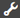
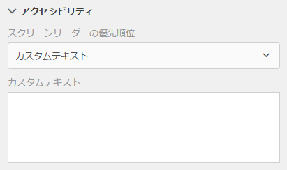
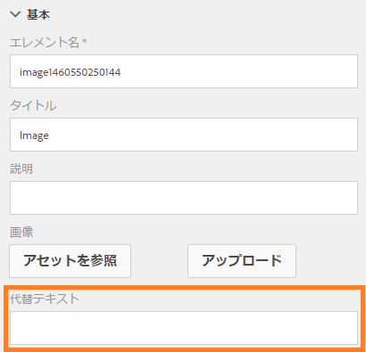

# アクセシブルなアダプティブフォームの作成{#creating-accessible-adaptive-forms}

## 概要 {#introduction}

アクセシブルなフォームとは、特別な手助けを必要とするユーザーを含むすべてのユーザーが使用できるフォームを意味します。アダプティブフォームには、様々な能力を持つユーザーの操作性を高める機能が多数含まれています。 アクセシビリティをアダプティブフォームに組み入れることは、可能な限り多くの人がコンテンツにアクセスできるようになるだけでなく、アクセシビリティ標準への準拠が法律で義務付けられている地域にドキュメントを供給するときの必要条件でもあります。AEM Forms では、フォーム開発者がアクセシビリティ標準に準拠できるよう支援します。

アダプティブフォームの作成時に、作成者は次の事項を考慮してアクセシブルなアダプティブフォームを作成する必要があります。

* アクセシブルな名前と説明インスペクタ(ANDI)のアクセシビリティテストツールを使用してフォームを確認する
* フォームのコントロールに対する正しいラベルの提供
* 画像の代替テキストの提供
* 十分なカラーコントラストの提供
* フォームのコントロールがキーボードでアクセスできることの確認

## 前提条件

アクセシビリティ関連の問題を修正するために、 **アクセシブルな名前と説明の検査(ANDI)** 、アダプティブフォームテーマなどのアクセシビリティツールが開発されている必要があります **** 。

### アクセシビリティテストツールのダウンロードとインストール

アクセシブルな名前および説明インスペクタ(ANDI)ツールを使用すると、Webコンテンツ内のアクセシビリティコンプライアンスに関連する問題を特定し、修正できます。 これは、国土安全保障省のTrusted Tester v5ガイドラインの推奨ツールです。 WebコンテンツのSection 508への準拠を確認するため、米国社会保障&#x200B;局が開発しました。 ツール：

* Webページのアクセシビリティ&#x200B;の問題の検出に役立ちます。
* アクセシビリティ向上のための提案を&#x200B;提供
* キーボードのアクセシビリティと色のコントラストの問題を検出します。
* スクリーンリーダーのコンテンツが規格に従って明確に識別されます。

ANDIは主要なインターネットブラウザーを全て使っています ツールの設定と使用の詳細な手順については、 [ANDIのドキュメント](https://www.ssa.gov/accessibility/andi/help/install.html) を参照してください。

### Ultramarineにアクセス可能なテーマをダウンロードしてインストールする

ウルタマリンアクセス可能なテーマは、リファレンステーマです。 これは、アダプティブフォームで色のコントラストやその他のアクセシビリティ関連の問題を修正する方法を示すのに役立ちます。 組織で承認されたスタイルに基づいて、実稼働環境用のカスタムテーマを作成することをお勧めします。 次の手順を実行して、AEMインスタンスにテーマをアップロードします。

1. テーマパッケージをダウンロードします。
1. **[!UICONTROL Experience Manager]** / **[!UICONTROL ナビゲーション]** /  /AEMインスタンス **[!UICONTROL 上の]** Formsに移動します。
1. **[!UICONTROL 作成]**／**[!UICONTROL ファイルのアップロード]**&#x200B;の順にタップします。x Ultramarine-Accessible-Theme.zipファイルを選択し、アップロードします。 テーマをAEMインスタンスにアップロードします。

## アダプティブフォームのアクセシビリティ対応

次の4つの重要な側面に焦点を当てる必要があります。 キーボードナビゲーション、色のコントラスト、画像の意味のある代替テキスト、アダプティブフォームをアクセシブルにするためのフォームコントロールの適切なラベル。 既存のアダプティブフォームをアクセシブルにするには、次の手順を実行します。

### 1.アクセシブルなテーマを適用し、追加の修正を行う

ウルトラマリンアクセス可能なテーマを既存のアダプティブフォームに適用します。 テーマを適用するには：

1. アダプティブフォームを編集用に開きます。
1. コンポーネントを選択し、親アイコンをタップします。 コンテキストメニューで、「 **[!UICONTROL アダプティブフォームコンテナ]** 」をタップし、設定アイコンをタップします。
1. プロパティブラウザーでUltramarine-Accessibleテーマを選択し、「 **[!UICONTROL 保存]** 」アイコンをタップします。
1. ブラウザーウィンドウを更新します。 テーマがアダプティブフォームに適用されます。

アクセシブルなテーマを適用した後、次に示す追加修正を実行します。 これらの修正は、アクセシブルなテーマで扱われているアクセシビリティの修正に加えて、もう一つ行われました。

1. アダプティブフォーム追加のロゴ画像に関する意味のある代替テキスト。

   アダプティブフォームテンプレートのヘッダーコンポーネントとフッターコンポーネント内の画像に対して、意味のある代替テキストを指定します。 テンプレートを修正し、それを使用してアダプティブフォームを作成する場合、アダプティブフォームは、テンプレートのヘッダーとフッターに適用されたすべてのアクセシビリティ関連の修正を継承します。  既存のアダプティブフォームの場合、アダプティブフォームレベルで変更を行います。 アダプティブフォームテンプレートに加えた変更は、既存のアダプティブフォームに自動的に反映されません。

1. アダプティブフォーム追加へのフォーム名を含む見出しコンポーネント。 フォームデザインで会社名を指定する場合は、会社名にも別の見出しコンポーネントを追加します。

   ほとんどのアクセシビリティツールは、ユーザーがWebページの構造を理解できるように、コンテンツの階層に関する情報を提供します。 アダプティブフォームで組織名とフォーム名のテキストに異なる見出しレベルを設定し、これらのテキストに階層構造を提供します。 さらに、各パネルとセクションの前に、適切な見出しレベルを持つテキストコンポーネントを使用して階層を作成します。

   

1. フッターの背景色を、アクセシビリティ標準に従って適切なコントラストを使用するように変更し、テキストの視認性と読みやすさを向上させます。 ANDIを使用すると、フォームの色のコントラストの問題を見つけることができます。 また、小さなフォントは使用しないでください。 小さなフォントは読みにくい。

1. 既存のアダプティブフォーム内の切り替えコンポーネントと画像選択コンポーネントを、選択（ラジオ）コンポーネントに置き換えます。

1. 既存のアダプティブフォーム内の数値ステッパーコンポーネントを数値ボックスコンポーネントに置き換えます。

1. 日付入力フィールドを日付選択フィールドに置き換えます。

1. 日付選択コンポーネントの表示、検証、編集パターンを設定します。 また、カスタム検証エラーメッセージを設定します。 例えば、無効な日付が指定されているとします。 日付の正しい形式はYYYY-MM-DDです。

1. 日付選択コンポーネントのカスタムのアクセシビリティテキストを設定します。 例えば、生年月日を入力します。 スクリーンリーダーは、これらのカスタムアクセシビリティテキストを読み上げます。

1. アダプティブフォームコンポーネントには、詳細な説明の代わりに短い説明を使用します。 詳細な説明を入力すると、ヘルプボタンが追加されます。 アダプティブフォームにヘルプボタンがないことを確認します。

1. 表のす追加べての読み取り専用セルに対するカスタムのアクセシビリティテキスト。 また、テーブルの読み取り専用セルをすべて無効にします。

1. アダプティブフォームに手書き署名フィールドがある場合は、それを削除します。 Adobe Signを使用してシームレスなデジタル署名を行えるようにアダプティブフォームを設定します。

### 2. Provide proper labels for form controls {#provide-proper-labels-for-form-controls}

コンポーネントのラベルまたはタイトルにより、フォームコンポーネントの内容が分かります。例えば、「名」というテキストを付ければ、テキストフィールドに名前を入力するようにユーザーに指示することができます。スクリーンリーダーによってアクセシブルにするために、ラベルはフォームコンポーネントにプログラム的に関連付けられます。あるいは、フォームのコントロールは追加のアクセシブル情報で設定されます。

スクリーンリーダーによって認識されるラベルは、表示キャプションと必ずしも同じである必要はありません。場合によっては、コントロールの目的をさらに具体的に説明するものにすることもできます。フォームの各フィールドオブジェクトごとに、アクセシビリティオプションを使用して、スクリーンリーダーがその特定のフォームフィールドを識別するためのものを指定することができます。

アクセシビリティオプションを使用するには、次の手順に従います。

1. Select a component and tap .
1. サイドバーの&#x200B;**[!UICONTROL アクセシビリティ]**&#x200B;をクリックして、必要なアクセシビリティオプションを選択します。

### フォームコンポーネントのアクセシビリティオプション {#accessibility-options-in-form-components}

**カスタムテキスト** フォーム作成者は、アクセシビリティオプションのカスタムテキストフィールドにコンテンツを入力します。 スクリーンリーダーなどの支援テクノロジーは、このカスタムテキストを使用します。 ほとんどの事例の場合、タイトル設定を使用することが最も適切です。カスタムのスクリーンリーダーテキストを作成するのは、タイトルや簡単な説明を使用できない場合のみにすることに留意してください。

**短い説明** ：大部分のコンポーネントでは、ユーザーがコンポーネントにポインターを置くと、短い説明が実行時に表示されます。 このオプションは、ヘルプコンテンツオプションの簡単な説明フィールドで設定できます。

**タイトル** AEM Formsがフォームフィールドに関連付けられた表示ラベルをスクリーンリーダーテキストとして使用できるようにするには、このオプションを使用します。

**名前** 「連結」タブの「名前」フィールドに値を指定できます。 名前には空白を含めることはできません。

**なし** (None)「なし」を選択すると、フォームオブジェクトは発行されたフォームに名前を持ちません。 フォームのコントロールに対しては、「なし」を設定することはお勧めしません。

>[!NOTE]
>
>* ラジオボタンとチェックボックスは、アクセシビリティのために 2 つだけのオプション（カスタムテキストとタイトル）を持つことができます。
>* FXA ベースのアダプティブフォームの場合、アクセシビリティオプションは、XDP に設定されているアクセシビリティオプションから継承されます。XDP のツールヒントは簡単な説明にマッピングされ、キャプションはタイトルにマッピングされます。その他のオプションはそのまま機能します。

### 3. Provide text equivalents for images {#provide-text-equivalents-for-images}

画像を使用すると、一部のユーザーに対して理解度を向上することに役立ちます。ただし、スクリーンリーダーを使用するユーザーに対しては、画像の使用はフォームのアクセシビリティを低下させます。画像を使用する場合は、すべての画像に対して代替テキストを提供してください。

このテキストは、フォーム内のオブジェクトとその目的を説明する内容である必要があります。スクリーンリーダーが画像を検出すると、この代替テキストを読み上げます。画像は常に代替テキストが指定される必要があります。

Select an image component and tap . サイドバーのプロパティで、画像の代替テキストを指定します。

### 4. Provide sufficient color contrast {#provide-sufficient-color-contrast}

アクセシビリティデザインでは、カラーの使用に対する特別なガイドラインを考慮する必要があります。フォーム作成者は、カラーを使用しさまざまなフォームのコンポーネントを強調表示することで、フォームの外観を向上できます。ただし、カラーの使い方が不適切だと、障害を持つ人たちがフォームを読むことを困難あるいは不可能にしてしまうことがあります。

視覚障害を持つユーザーは、デジタルコンテンツを読むときに、テキストと背景の間に高いコントラストを必要とします。十分なコントラストがないと、一部のユーザーがフォームを読むことが不可能ではないにしても困難になる場合があります。

デフォルトのフォントと背景（白の背景に黒のコンテンツ）を使用することが推奨されます。デフォルトカラーを変更する場合は、明るい背景に暗い前景またはその逆を選択してください。

アダプティブフォームのカラーコントラストとテーマを変更することについて詳しくは、[アダプティブフォームのカスタムテーマの作成](/help/forms/using/creating-custom-adaptive-form-themes.md)を参照してください。

### 5. Ensure that form controls are keyboard accessible {#ensure-that-form-controls-are-keyboard-accessible}

アクセシブルフォームは、キーボードまたは相当の入力デバイスのみを使用してすべて記入できます。四肢や視覚に障害を持つユーザーはキーボードのみで入力を行わなければならない場合があります。また、マウスを使用できるユーザーでもキーボード入力を好むひとが多くいます。入力の方法を複数用意することで、アクセシブルなフォームが作成できるだけではなく、すべてのユーザーの要望に応えられるフォームが作成できます。

AEM Forms では次のキーボードショートカットが使用できます。

| アクション | キーボードショートカット |
|---|---|
| 次のフォームへカーソルを移動させます。 | タブ |
| 前のフォームへカーソルを移動させます。 | Shift + Tab |
| 次のパネルに移動します。 | Alt + 右向き矢印 |
| 前のパネルに移動します。 | Alt + 左向き矢印 |
| フォーム内の記入済みデータをリセットします。 | Alt + R |
| フォームを送信します。 | Alt + S |

## アクセシビリティツールを使用して、アクセシビリティに関するその他の問題を見つけます。

アクセシブルな名前と説明の検査(ANDI)は、アダプティブフォーム内のアクセシビリティ準拠に関連する問題を特定し、修正するのに役立ちます。 ANDIツールを使用してアダプティブフォーム内のアクセシビリティの問題を見つけるには：

1. アダプティブフォームをプレビューモードで開きます。
1. ブックマーク付きANDIツールアイコンをクリックします。 ANDIツールはアダプティブフォームを分析し、アクセシビリティの問題を表示します。 このツールの使用方法について詳しくは、 [ANDIのドキュメントを参照してください](https://www.ssa.gov/accessibility/andi/help/howtouse.html)。
1. ANDIが報告する問題を確認し、修正します。