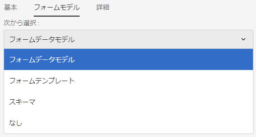
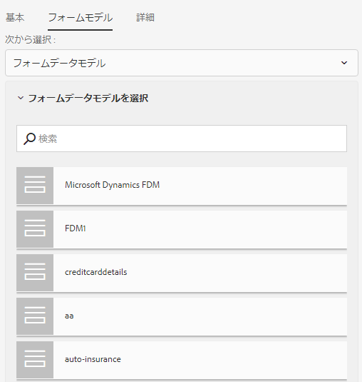
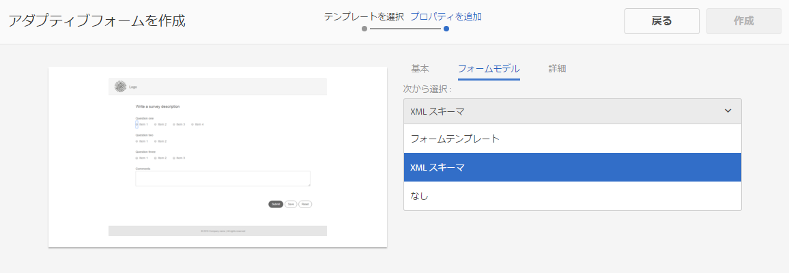
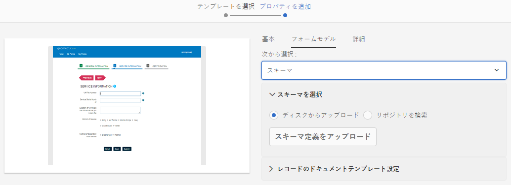
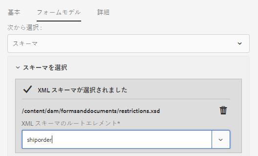

# アダプティブフォームの作成 {#creating-an-adaptive-form}

## <strong>アダプティブフォームの作成</strong> {#strong-create-an-adaptive-form-strong}

次の手順を実行して、アダプティブフォームを作成します。

1. Access AEM Forms Author instance at `https://'[server]:[port]'/<custom-context-if-any>.`

1. AEM ログインページに資格情報を入力します。

   After you are logged in, in the top-left corner, tap **[!UICONTROL Adobe Experience Manager]** > **[!UICONTROL Forms]** > **[!UICONTROL Forms &amp; Documents]**.

   >[!NOTE]
   >
   >デフォルトのインストールでは、ログインは `admin`、パスワードは `admin` に設定されています。

1. 「**[!UICONTROL 作成]**」をタップして、「**[!UICONTROL アダプティブフォーム]**」を選択します。
1. テンプレートを選択するためのオプションが表示されます。For more information about templates, see [Adaptive form templates](/help/forms/using/creating-adaptive-form.md#p-adaptive-form-templates-p). テンプレートをタップして選択し、「次へ」をタップします。
1. 「プロパティの追加」オプションが表示されます。次のプロパティフィールドの値を指定します。 「表題」と「ドキュメント名」の各フィールドは入力が必須です。

   * **[!UICONTROL タイトル：]** フォームの表示名を指定します。タイトルを指定すると、AEM Forms ユーザーインターフェイス内のフォームを特定しやすくなります。
   * **[!UICONTROL 名前：]** フォームの名前を指定します。 指定された名前のノードがリポジトリに作成されます。タイトルを入力し始めると、名前フィールドの値が自動的に生成されます。候補として入力された値は変更可能です。「ドキュメント名」フィールドには、英数字、ハイフン、アンダースコアのみを使用することができます。無効な入力はすべてハイフンに置き換えられます。
   * **[!UICONTROL 説明：]** フォームに関する詳細情報を指定します。
   * **[!UICONTROL タグ：]**&#x200B;アダプティブフォームを識別するための固有タグを指定します。タグを指定するとフォームを検索しやすくなります。タグを作成するには、「**タグ**」ボックスに新しいタグ名を入力します。 

1. 次のフォームモデルの 1 つを基にアダプティブフォームを作成することができます。

   * [フォームデータモデル](#fdm)
   * [XFA フォームテンプレート](/help/forms/using/creating-adaptive-form.md#p-create-an-adaptive-form-based-on-an-xfa-form-template-p)
   * [XML または JSON スキーマ](/help/forms/using/creating-adaptive-form.md#p-create-an-adaptive-form-based-on-xml-or-json-schema-p)
   * なし、またはフォームモデルを使用しない

   これらは、「**[!UICONTROL プロパティの追加]**」ページにある「**[!UICONTROL フォームモデル]**」タブから設定することができます。デフォルトで選択されているフォームモデルは「**[!UICONTROL なし]**」になっています。

1. 「**作成**」をタップします。アダプティブフォームが作成され、フォームを編集用に開くためのダイアログが表示されます。

   Once you have finished specifying all the properties, click **[!UICONTROL Create]**. アダプティブフォームが作成され、フォームを編集用に開くためのダイアログが表示されます。

   Once you have finished specifying all the properties, click **[!UICONTROL Create]**. アダプティブフォームが作成され、フォームを編集用に開くためのダイアログが表示されます。

1. Tap **[!UICONTROL Open]** to open the newly created form in a new tab. フォームが編集用に開かれ、テンプレート内の利用可能なコンテンツが表示されます。新しく作成されたフォームを必要に応じてカスタマイズするためのサイドバーも表示されます。

   アダプティブフォームのタイプにより、関連付けられた XFA フォームテンプレート、XML スキーマまたは JSON スキーマに存在するフォーム要素が、サイドバーにある&#x200B;**[!UICONTROL コンテンツブラウザー]**&#x200B;の「**[!UICONTROL データモデルオブジェクト]**」タブに表示されます。これらの要素もアダプティブフォームにドラッグアンドドロップすることができます。

   アダプティブフォームのオーサリングインターフェースと使用可能なコンポーネントについて詳しくは、「[アダプティブフォームの作成について](/help/forms/using/introduction-forms-authoring.md)」を参照してください。

   >[!NOTE]
   >
   >新しく作成されたフォームを新しいタブで開くには、ブラウザでポップアップを許可してください。

## フォームデータモデルに基づくアダプティブフォームの作成 {#fdm}

[AEM Forms のデータ統合機能](/help/forms/using/data-integration.md)では、複数のデータソースを統合し、エンティティとサービスをまとめてフォームデータモデルを作成します。これは、JSON スキーマの拡張機能です。フォームデータモデルを使用してアダプティブフォームを作成することができます。フォームデータモデル内で設定されたエンティティまたはデータモデルオブジェクトは、フォームのオーサリングのデータモデルオブジェクトとして使用できます。これらは各データソースに結合され、フォームの事前入力や送信済みデータの各データソースへの書き戻しに使用されます。また、アダプティブフォームルールを使用して、フォームデータモデル内で定義されているサービスを呼び出すこともできます。

フォームデータモデルを使用してアダプティブフォームを作成するには：

1. プロパティを追加画面の「フォームモデル」タブで、「**[!UICONTROL 次から選択]**」ドロップダウンリストから「**[!UICONTROL フォームデータモデル]**」を選択します。

   

1. 「**[!UICONTROL フォームデータモデルを選択]**」をタップして展開します。すべての有効なフォームデータモデルが一覧表示されます。

   任意のフォームデータモデルを選択します。

   

>[!NOTE]
>
>アダプティブフォームのフォームデータモデルを変更することもできます。For detailed steps, see [Edit Form Model properties of an adaptive form](#edit-form-model).

## XFA フォームテンプレートに基づくアダプティブフォームの作成 {#create-an-adaptive-form-based-on-an-xfa-form-template}

アダプティブフォームを作成する際に、XFA フォームテンプレートを再利用することができます。再利用するには、XFA フォームテンプレートをアップロードし、アダプティブフォームに関連付けます。フォームテンプレート（XFA フォーム）の要素が、アダプティブフォームの作成時にコンテンツファインダーで利用できるようになります。フォームテンプレート要素は、コンテンツファインダーからフォームへとドラッグ＆ドロップすることができます。

>[!NOTE]
>
>フォームテンプレートに基づいてアダプティブフォームの作成を開始する前に、AEM Forms に [XFA フォーム テンプレートをアップロード](/help/forms/using/get-xdp-pdf-documents-aem.md)します。

XFA フォームテンプレートをアダプティブフォームのフォームモデルとして使用するには：

1. 「**[!UICONTROL プロパティの追加]**」ページで、「**[!UICONTROL フォームモデル]**」タブを開きます。
1. In the Form Model tab, from the drop-down list, select **[!UICONTROL Form Templates]**. AEM Forms UI を通じてリポジトリにアップロードされたすべてのフォームテンプレートがリストされ、選択できるようになります。リストからテンプレートを選択します。

   
   **図：***フォームテンプレートの選択*

   >[!NOTE]
   >
   >アダプティブフォームのフォームテンプレートを変更することもできます。For detailed steps, see [Edit Form Model properties of an adaptive form](#edit-form-model).

## XML スキーマまたは JSON スキーマに基づくアダプティブフォームの作成 {#create-an-adaptive-form-based-on-xml-or-json-schema}

XML スキーマと JSON スキーマは、組織内のバックエンドシステムによって生成されて使用されるデータの構造を表します。アダプティブフォームにスキーマを関連付け、その要素を使用して、アダプティブフォームに動的なコンテンツを追加することができます。 スキーマの要素は、アダプティブフォームを作成する際に、コンテンツブラウザーの「データモデルオブジェクト」タブから利用できます。 スキーマ要素をドラッグ &amp; ドロップしてフォームを作成できます。

アダプティブフォームのオーサリングのための XML または JSON スキーマの設計方法について理解するには、次のドキュメントを参照してください。

* [XMLスキーマを使ったアダプティブフォームの作成](/help/forms/using/adaptive-form-xml-schema-form-model.md)
* [JSON スキーマを使用したアダプティブフォームの作成](/help/forms/using/adaptive-form-json-schema-form-model.md)

アダプティブフォームのフォームモデルとして XML または JSON スキーマを使用するには、次のことを行ってください。

1. On the **[!UICONTROL Add Properties]** step of adaptive form creation page, tap on the **[!UICONTROL Form Model]** tab.
1. In the Form Model tab, select **[!UICONTROL Schema]** from the **[!UICONTROL Select From]** drop-down field.

1. Tap **[!UICONTROL Select Schema]** and do one of the following:

   * **[!UICONTROL ディスクからアップロード]** - このオプションを選択して「スキーマの定義をアップロード」をタップし、ファイルシステムから XML スキーマまたは JSON スキーマをアップロードします。アップロードされたスキーマファイルはフォームとともに保存されますが、他のアダプティブフォームからアクセスすることはできません。
   * **[!UICONTROL リポジトリ内を検索]** - このオプションを選択して、リポジトリで使用できるスキーマ定義ファイルのリストからスキーマを選択します。XML または JSON スキーマファイルをフォームモデルとして選択します。選択したスキーマが参照されてフォームに関連付けられ、他のアダプティブフォームからアクセスして使用できるようになります。

   >[!CAUTION]
   >
   >JSON スキーマファイル名が **.schema.json** で終わることを確認してください。例：mySchema.schema.json

   
   **図：***XMLまたはJSONスキーマの選択*

1. （XML スキーマのみ）XML スキーマを選択またはアップロードした後、選択した XSD ファイルのルートエレメントを指定してアダプティブフォームにマッピングします。

   
   **図：***XSDルート要素の選択*

>[!NOTE]
>
>アダプティブフォームのスキーマを変更することもできます。For detailed steps, see [Edit Form Model properties of an adaptive form](#edit-form-model).

## アダプティブフォームテンプレート {#adaptive-form-templates}

テンプレートでは基本的がい造を提供しており、アダプティブフォームの外観（レイアウトやスタイル）を定義します。これには、特定のプロパティやコンテンツ構造を有するフォーマット済みのコンポーネントが含まれます。AEM Forms には、デフォルトでいくつかのアダプティブフォームテンプレートが用意されています。高度なテンプレートを含む完全なテンプレートパッケージを取得するには、AEM Formsアドオンパッケージをインストールする必要があります。 For more information, see [Installing AEM Forms add-on package](/help/forms/using/installing-configuring-aem-forms-osgi.md).

さらに、テンプレートエディターを使用して独自のテンプレートを作成できます。テンプレートの操作について詳しくは、「[アダプティブフォームテンプレート](/help/forms/using/template-editor.md)」を参照してください。

>[!NOTE]
>
>拡張テンプレートを使用してアダプティブフォームを作成し、そのフォームを編集用として開くと、エラーメッセージが表示されます。拡張テンプレートには署名ステップコンポーネントがあり、デフォルトで Adobe Sign が有効になっています。このエラーを修正するには、[Adobe Sign のクラウド設定](/help/forms/using/adobe-sign-integration-adaptive-forms.md)を作成して選択し、[署名者を設定](working-with-adobe-sign.md#addsignerstoanadaptiveform)してください。

## アダプティブフォームのフォームモデルプロパティの編集 {#edit-form-model}

アダプティブフォームはフォームモデルを使用せずに（フォームモデルの「なし」オプションを使用して）作成することも、フォームモデル（フォームテンプレート、XML スキーマ、JSON スキーマなど）を使用して作成することもできます。アダプティブフォームのフォームデータモデルを「なし」から別のフォームモデルに変更することもできます。フォームモデルをベースとするアダプティブフォームでは、同じフォームモデルに別のフォームテンプレート、XML スキーマ、JSON スキーマ、フォームデータモデルを選択することもできます。ただし、フォームモデルを別のフォームモデルに変更することはできません。

1. Select the adaptive form and tap the **Properties** icon.
1. Open the **[!UICONTROL Form Model]** tab and do one the following.

   * アダプティブフォームにフォームモデルが無い場合、別のフォームモデルを選択し、それに従いフォームテンプレート、XML スキーマ、JSON スキーマ、フォームデータモデルを選択することもできます。
   * アダプティブフォームがフォームモデルをベースとしている場合は、同じフォームモデルに別のフォームテンプレート、XML スキーマ、JSON スキーマ、フォームデータモデルを選択することもできます。

1. 「**[!UICONTROL 保存]**」をタップして、プロパティを保存します。

## アダプティブフォームの自動保存 {#auto-save-an-adaptive-form}

デフォルトでは、アダプティブフォームのコンテンツは、保存ボタンを押したときなど、ユーザーアクション時に保存されます。アダプティブフォームを設定して、イベントまたは時間間隔に基づいてコンテンツの自動保存を開始することができます。自動保存オプションは次のようなときに便利です。

* 匿名ユーザーおよびログインユーザーに対してコンテンツを自動保存する
* ユーザーの介在をほとんどあるいはまったく必要としないでフォームのコンテンツを保存する
* ユーザーのイベントに基づいてフォームのコンテンツの保存を開始する
* 特定の時間間隔が経過したらフォームのコンテンツを繰り返し保存する

### アダプティブフォームの自動保存の有効化 {#enable-auto-save-for-an-adaptive-form}

デフォルトでは、この自動保存オプションは無効になっています。自動保存オプションの有効化は、アダプティブフォームの「自動保存」タブで行うことができます。「自動保存」タブには、その他の設定オプションがいくつか用意されています。次の手順を実行して、アダプティブフォームの自動実行オプションを有効にし設定します。

1. To access the auto-save section in the properties, select a component, then tap  > **[!UICONTROL Adaptive Form Container]**, and then tap .
1. 「**[!UICONTROL 自動保存]**」セクションで、自動保存オプションを&#x200B;**[!UICONTROL 有効]**&#x200B;にします。
1. 「**[!UICONTROL アダプティブフォームイベント]**」ボックスで、1 または TRUE を指定して、フォームがブラウザーに読み込まれたときに自動保存を開始します。トリガーされると true を返してフォームのコンテンツの保存を開始する条件式をイベントに指定することもできます。
1. トリガーを指定します。設定に従い、自動保存がトリガーされます。次のオプションがあります。

   * **[!UICONTROL 時刻に基づいた自動保存]**：特定の時間間隔に基づいてコンテンツの保存を開始するには、このオプションを選択します。
   * **[!UICONTROL イベントに基づいた自動保存]**：イベントがトリガーされたときにコンテンツの保存を開始するには、このオプションを選択します。

   トリガーを選択すると、方法の設定ボックスが有効になります。方法の設定ボックスでは、次のことができます。

   * **[!UICONTROL 時刻に基づいた自動保存]**&#x200B;トリガーを選択した場合は、時間間隔を指定します。
   * Specify an event name if you select **[!UICONTROL Event based]** trigger.

   独自の方法を作成してリストに追加することもできます。詳細については、[フォームを自動保存するためのカスタム方法の実装](/help/forms/using/auto-save-an-adaptive-form.md#p-implement-a-custom-strategy-to-enable-autosave-for-adaptive-forms-p)を参照してください。

1. （時間ベースの自動保存のみ）次の手順を実行して、時間ベースの自動保存のオプションを設定します。

   1. 「**[!UICONTROL この間隔で自動保存]**」ボックスで、時間間隔を秒数で指定します。「間隔」ボックスに指定されている秒数が経過するたびに、フォームは繰り返し保存されます。

1. （イベントベースの自動保存のみ）次の手順を実行して、イベントベースの自動保存のためのオプションを設定します。

   1. 「**このイベントで自動保存**」ボックスで、[GuideBridge](https://helpx.adobe.com/jp/aem-forms/6/javascript-api/GuideBridge.html) イベントを指定します。式が TRUE に評価されるたびに、フォームが保存されます。

1. （オプション）匿名ユーザーに対するコンテンツを自動保存するには、「**匿名のユーザーの自動保存を有効にする**」オプションを選択し、「**[!UICONTROL OK]**」をクリックします。

   >[!NOTE]
   >
   >自動保存オプションが匿名ユーザーに対して機能するには、すべてのユーザーにフォームのプレビュー、確認および署名を許可するように Forms Common Configuration Service が設定されていることを確認します。
   >
   >To configure the service, go to AEM Web Console configuration at `https://'[server]:[port]'system/console/configMgr` and edit the **[!UICONTROL Forms Common Configuration Service]** to choose the **[!UICONTROL All Users]** option in the **[!UICONTROL Allow]** field, and save the configuration.