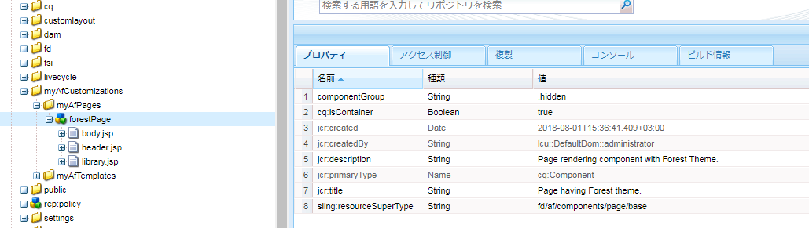

# カスタムアダプティブフォームテーマの作成 {#creating-custom-adaptive-form-themes}

>[!CAUTION]
>
>Adobe Experience Manager（AEM）Forms には、[テーマエディター](/help/forms/using/themes.md)機能があり、アダプティブフォームの[テーマ](/help/forms/using/themes.md)を作成および変更できます。この記事に示す手順は、[テーマエディター](/help/forms/using/themes.md)が存在しないバージョンからアップデートし、LESS/CSS ファイルを使用して作成されたテーマに対する投資を既に行っている場合（テーマ前のエディター方式）のみ実行します。

## 前提条件 {#prerequisites}

* LESS（Leaner CSS）の知識
* Adobe Experience Manager でクライアントライブラリを作成する方法
* 作成したテーマを使用する場合の[アダプティブフォームテンプレートの作成](/help/forms/using/custom-adaptive-forms-templates.md)

## アダプティブフォームのテーマ {#adaptive-form-theme}

**アダプティブフォームのテーマ**&#x200B;は、アダプティブフォームのスタイル（ルックアンドフィール）の定義に使用する AEM クライアントライブラリです。

**アダプティブテンプレート**&#x200B;を作成し、テーマをテンプレートに適用します。そして、このカスタムテンプレートを使い、**アダプティブフォーム**&#x200B;を作成します。


## アダプティブフォームテーマを作成するには {#to-create-an-adaptive-form-theme}

>[!NOTE]
>
>次の手順では、ノード、プロパティ、フォルダーなどの AEM オブジェクトのサンプル名を使用して説明します。
>
>この手順にしたがって同じ名前を使用すると、結果として次のスナップショットと同じようなテンプレートが出来上がるはずです：


**図：** *フォレストテーマのサンプル*

1. `/apps`ノードの下に `cq:ClientLibraryFolder` タイプのノードを作成します。

   例として、以下のノードを作成します：

   `/apps/myAfThemes/forestTheme`

1. 複数の値を持つ文字列プロパティ `categories`をノードに追加し、適切な値に設定します。

   例えば、プロパティを `af.theme.forest` に設定します。

   

1. 手順 1 で作成したノードに、 `less` と `css` の 2 つのフォルダーと `css.txt` のファイルを追加します：

   * `less` フォルダー：`less` 変数と CSS スタイルの管理に使用される `less mixins` を定義する `less` 変数ファイルが含まれています。

     このフォルダーは、`less` 変数ファイル、`less` ミックスインファイル、ミックスインを使ったスタイルを定義する `less` ファイル、変数で構成されています。そしてこれら全て `less` その後、ファイルは styles.less にインポートされます。

   * `css` フォルダー：テーマで使用される静的スタイルを定義する CSS ファイルが含まれています。

   **LESS 変数ファイル**：CSS スタイルの定義で使用される変数を定義またはオーバーライドするファイルです。

   アダプティブフォームは、以下で定義された OOTB 変数を提供します `.less` ファイル：

   * `/apps/clientlibs/fd/af/guidetheme/common/less/globalvariables.less`
   * `/apps/clientlibs/fd/af/guidetheme/common/less/layoutvariables.less`

   アダプティブフォームは、次のファイルで定義されているサードパーティ変数も提供しています：

   `/apps/clientlibs/fd/af/third-party/less/variables.less`

   以下を使用すると、 `less` アダプティブフォームで提供される変数は、これらの変数を上書きするか、新しい変数を作成することができます。 `less` 変数。

   >[!NOTE]
   >
   >LESS プリプロセッサーのファイルを読み込む際に、import 文でファイルの相対パスを指定します。

   上書き変数の例：

   ```css
   @button-background-color: rgb(19, 102, 44);
   @button-border-color: rgb(19, 102, 44);
   @button-border-size: 0px;
   @button-padding: 10px 15px;
   @button-font-color: #ffffff;
   ```

   `less` 変数を上書きするには：

   1. デフォルトのアダプティブフォーム変数を読み込む：

      `/apps/clientlibs/fd/af/guidetheme/common/less/globalvariables.less/apps/clientlibs/fd/af/guidetheme/common/less/layoutvariables.less`

   1. 次に、オーバーライドされた変数を含む LESS ファイルを読み込みます。

   新しい変数定義の例：

   ```css
   @button-focus-bg-color: rgb(40, 208, 90);
   @button-hover-bg-color: rgb(30, 156, 67);
   ```

   **LESS ミックスインファイル：**&#x200B;変数を引数として受け入れる関数を定義することができます。これらの関数の出力が、結果のスタイルになります。CSS スタイルの繰り返しを避けるために、これらのミックスインを異なるスタイルで使用します。

   アダプティブフォームは、次のファイルで定義されている OOTB ミックスインを提供します。

   * `/apps/clientlibs/fd/af/guidetheme/common/less/adaptiveforms-mixins.less`

   アダプティブフォームは、次のファイルで定義されているサードパーティミックスインも提供しています：

   * `/apps/clientlibs/fd/af/third-party/less/mixins.less`

   ミックスインの定義の例： 

   ```css
   .rounded-corners (@radius) {
     -webkit-border-radius: @radius;
     -moz-border-radius: @radius;
     -ms-border-radius: @radius;
     -o-border-radius: @radius;
     border-radius: @radius;
   }
   
   .border(@color, @type, @size) {
      border: @color @size @type;
   }
   ```

   **Styles.less ファイル：** このファイルを使用して、 `less` クライアントライブラリで使用する必要があるファイル（変数、mixin、スタイル）。

   次の `styles.less` ファイルのサンプルでは、インポートステートメントは任意の順序で配置することができます。

   次をインポートするステートメント `.less` ファイルは必須です。

   * `globalvariables.less`
   * `layoutvariables.less`
   * `components.less`
   * `layouts.less`

   ```css
   @import "../../../clientlibs/fd/af/guidetheme/common/less/globalvariables.less";
   @import "../../../clientlibs/fd/af/guidetheme/common/less/layoutvariables.less";
   @import "forestTheme-variables";
   @import "../../../clientlibs/fd/af/guidetheme/common/less/components.less";
   @import "../../../clientlibs/fd/af/guidetheme/common/less/layouts.less";
   
   /* custom styles */
   
   .guidetoolbar {
     input[type="button"], button, .button {
       .rounded-corners (@button-radius);
       &:hover {
         background-color: @button-hover-bg-color;
       }
       &:focus {
         background-color: @button-focus-bg-color;
       }
     }
   }
   
   form {
       background-image: url(../images/forest.png);
    background-repeat: no-repeat;
    background-size: 100%;
   }
   ```

   `css.txt` には、ライブラリにダウンロードする CSS ファイルのパスが含まれています。

   例：

   ```javascript
   #base=/apps/clientlibs/fd/af/third-party/css
   bootstrap.css
   
   #base=less
   styles.less
   
   #base=/apps/clientlibs/fd/xfaforms/xfalib/css
   datepicker.css
   listboxwidget.css
   scribble.css
   dialog.css
   ```

   >[!NOTE]
   >
   >styles.less ファイルは必須ではありません。つまり、カスタムスタイル、変数、ミックスインを定義していない場合には、このファイルを作成する必要はありません。
   >
   >しかし、styles.less ファイルを作成しない場合には、css.txt ファイル内で次の行をコメント解除する必要があります。
   >
   >**`#base=less`**
   >
   >さらに、次の行をコメントアウトします：
   >
   >**`styles.less`**

## アダプティブフォームでテーマを使用するには {#to-use-a-theme-in-an-adaptive-form}

アダプティブフォームテーマを作成した後、このテーマをアダプティブフォームで使用するには、次の手順を行ないます：

1. 「[アダプティブフォームテーマを作成するには](/help/forms/using/creating-custom-adaptive-form-themes.md#p-to-create-an-adaptive-form-theme-p)」のセクションで作成したテーマを含めるには、`cq:Component` タイプのカスタムページを作成します。

   例：`/apps/myAfCustomizations/myAfPages/forestPage`

   1. `sling:resourceSuperType` プロパティを追加し、その値を `fd/af/components/page/base` に設定します。

      

   1. テーマをページで使用するには、ノードに上書きファイル library.jsp を追加する必要があります。

      その後、この記事の「アダプティブフォームテーマを作成するには」の節で作成したテーマを読み込むことができます。

      以下のサンプルコードでは、`af.theme.forest` のテーマをインポートしています。

      ```jsp
      <%@include file="/libs/fd/af/components/guidesglobal.jsp"%>
      <cq:includeClientLib categories="af.theme.forest"/>
      ```

   1. **オプション**：カスタムページでは、header.jsp、footer.jsp、the body.jsp を必要に応じて上書きしてください。

1. jcr:content が、前の手順で作成されたカスタムページ（例：`/apps/myAfCustomizations/myAfTemplates/forestTemplate`）を指すカスタムテンプレート（例：`myAfCustomizations/myAfPages/forestPage)`）を作成します。

   

1. 前の手順で作成したテンプレートを使用して、アダプティブフォームを作成します。アダプティブフォームのルックアンドフィールは、この記事の「アダプティブフォームテーマを作成するには」の節で作成したテーマによって定義されます。
