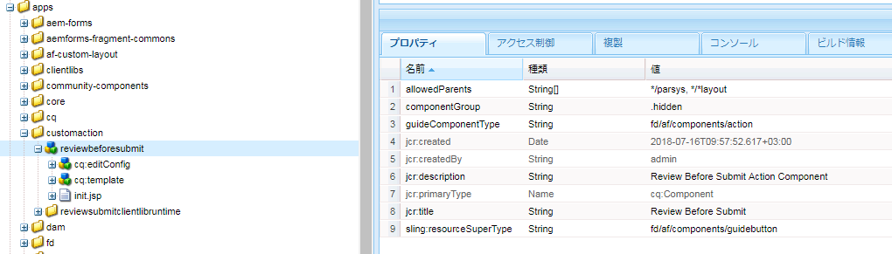

# カスタムツールバーアクションの作成{#creating-a-custom-toolbar-action}

## 前提条件 {#prerequisite}

カスタムツールバーアクションを作成する前に、「[クライアント側のライブラリを使用する方法](/help/sites-developing/clientlibs.md)」と「[CRXDE Lite を使用した開発](/help/sites-developing/developing-with-crxde-lite.md)」を参照して理解を深めてください。

## アクションとは {#what-is-an-action-br}

アダプティブフォームは、フォーム作成者がオプションの組み合わせを設定できるツールバーを提供します。これらのオプションは、アダプティブフォームのアクションとして定義されます。ツールバーの編集ボタンをクリックして、アダプティブフォームでサポートするアクションを設定するパネルを開きます。


デフォルトで提供される一連のアクションに加え、カスタムアクションをツールバーに作成することができます。例えば、アクションを追加することで、フォームを送信する前にアダプティブフォームのすべてのフィールドを、ユーザーがレビューできるようにすることが可能です。

## アダプティブフォーム{#steps}でのカスタムアクションの作成手順

カスタムツールバーアクションを作成するには、次の手順を実行して、記入の済んだフォームを送信する前にアダプティブフォームのすべてのフィールドをエンドユーザーがレビューするためのボタンを作成します。

1. アダプティブフォームでサポートされているすべてのデフォルトアクションは`/libs/fd/af/components/actions`フォルダーに存在します。 CRXDEで、`fileattachmentlisting`ノードを`/libs/fd/af/components/actions/fileattachmentlisting`から`/apps/customaction`にコピーします。

1. ノードを`apps/customaction`フォルダーにコピーした後、ノード名を`reviewbeforesubmit`に変更します。 また、ノードの`jcr:title`プロパティと`jcr:description`プロパティを変更します。

   `jcr:title` のプロパティには、ツールバーダイアログに表示されるアクションの名前が含まれます。`jcr:description` のプロパティには、アクションにマウスオーバーしたときに表示される詳細情報が含まれます。

   

1. `reviewbeforesubmit`ノードで`cq:template`ノードを選択します。 `guideNodeClass`プロパティの値が`guideButton`であることを確認し、それに応じて`jcr:title`プロパティを変更します。
1. `cq:Template`ノードのtypeプロパティを変更します。 この例では、タイプのプロパティをボタンに変更します。

   このコンポーネントで、生成された HTML に type の値が CSS クラスとして追加されます。ユーザーはこの CSS クラスを使用して、アクションのスタイルを設定できますボタン、送信、リセット、およびタイプの値を保存する際のスタイルが、モバイルとデスクトップデバイスの両方にデフォルトで用意されています。

1. アダプティブフォームの編集のツールバーダイアログからカスタムアクションを選択します。パネルのツールバーにレビューボタンが表示されます。

    

1. レビューボタンに機能を持たせるには、`reviewbeforesubmit` ノードにある init.jsp ファイルに JavaScript コード、CSS コード、およびサーバー側コードを追加します。

   `init.jsp` に次のコードを追加します。

   ```jsp
   <%@include file="/libs/fd/af/components/guidesglobal.jsp" %>
   <guide:initializeBean name="guideField" className="com.adobe.aemds.guide.common.GuideButton"/>
   
   <c:if test="${not isEditMode}">
           <cq:includeClientLib categories="reviewsubmitclientlibruntime" />
   </c:if>
   
   <%--- BootStrap Modal Dialog  --------------%>
   <div class="modal fade" id="reviewSubmit" tabindex="-1">
       <div class="modal-dialog">
           <div class="modal-content">
               <div class="modal-header">
                   <h3>Review the Form Fields</h3>
               </div>
               <div class="modal-body">
                   <div class="modal-list">
                       <table class="table table-bordered">
                           <tr class="name">
                               <td class="reviewlabel col-md-3 active">
                                   <label>Your Name is: </label>
                               </td>
                           </tr>
                           <tr class="pan">
                               <td class="reviewlabel col-md-3 active">
                                   <label>Your Pan Number is: </label>
                               </td>
                           </tr>
                           <tr class="dob">
                               <td class="reviewlabel col-md-3 active">
                                   <label>Your Date Of Birth is: </label>
                               </td>
                           </tr>
                           <tr class="80cdeclaration">
                               <td class="reviewlabel col-md-3 active">
                                   <label>Your Total 80C Declaration Amount is: </label>
                               </td>
                           </tr>
                           <tr class="rentpaid">
                               <td class="reviewlabel col-md-3 active">
                                   <label>Your Total HRA Amount is: </label>
                               </td>
                           </tr>
                       </table>
                   </div>
               </div><!-- /.modal-body -->
               <div class="modal-footer">
                   <div class="fileAttachmentListingCloseButton col-md-2 col-xs-2 col-sm-2">
                       <button data-dismiss="modal">Close</button>
                   </div>
               </div>
           </div><!-- /.modal-content -->
       </div><!-- /.modal-dialog -->
   </div><!-- /.modal -->
   ```

   `ReviewBeforeSubmit.js` ファイルに次のコードを追加します。

   ```javascript
   /*anonymous function to handle show of review before submit view */
   $(function () {
       if($("div.reviewbeforesubmit button[id*=reviewbeforesubmit]").length > 0) {
           $("div.reviewbeforesubmit button[id*=reviewbeforesubmit]").click(function(){
               // Create the options object to be passed to the getElementProperty API
               var options = {},
                   result = [];
               options.somExpressions = [];
               options.propertyName = "value";
               guideBridge.visit(function(model){
                   if(model.name === "name" || model.name === "pan" || model.name === "dateofbirth" || model.name === "total" || model.name === "totalmonthlyrent"){
                           options.somExpressions.push(model.somExpression);
                   }
               }, this);
               result = guideBridge.getElementProperty(options);
   
               $('#reviewSubmit .reviewlabel').each(function(index, item){
                   var data = ((result.data[index] == null) ? "No Data Filled" : result.data[index]);
                   if($(this).next().hasClass("reviewlabelvalue")){
                       $(this).next().html(data);
                   } else {
                       $(this).after($("<td></td>").addClass("reviewlabelvalue col-md-6 active").html(data));
                   }
               });
               // added because in mobile devices it was causing problem of backdrop
               $("#reviewSubmit").appendTo('body');
               $("#reviewSubmit").modal("show");
           });
       }
   });
   ```

   `ReviewBeforeSubmit.css` ファイルに次のコードを追加します。

   ```css
   .modal-list .reviewlabel {
       white-space: normal;
       text-align: right;
       padding:2px;
   }
   
   .modal-list .reviewlabelvalue {
       border: #cde0ec 1px solid;
       padding:2px;
   }
   
   /* Adding icon for this action in mobile devices */
   /* This is the glyphicon provided by bootstrap eye-open */
   /* .<type> .iconButton-icon */
   .reviewbeforesubmit .iconButton-icon {
       position: relative;
       top: -8px;
       font-family: 'Glyphicons Halflings';
       font-style: normal;
   }
   
   .reviewbeforesubmit .iconButton-icon:before {
       content: "\e105"
   }
   ```

1. カスタムアクションの機能を検証するには、プレビューモードでアダプティブフォームを開いて、ツールバーのレビューボタンをクリックします。

   >[!NOTE]
   >
   >オーサリングモードでは `GuideBridge` ライブラリは読み込まれません。そのため、オーサリングモードではこのカスタムアクションは動作しません。

   

## サンプル {#samples}

コンテンツパッケージは次のアーカイブにあります。このパッケージには、上記のカスタムツールバーアクションのデモに関連するアダプティブフォームが含まれています。

[ファイルを入手](assets/customtoolbaractiondemo.zip)
