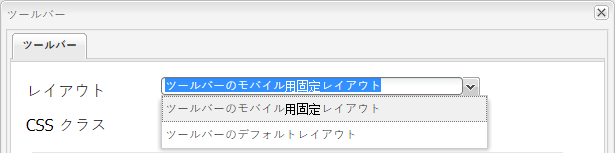
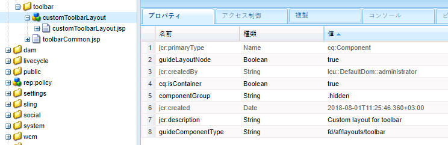
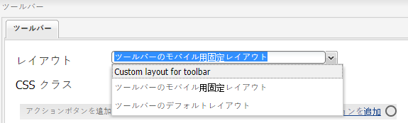

# カスタムツールバーレイアウトの作成{#creating-custom-toolbar-layout}

## ツールバーレイアウト {#layout}

アダプティブフォームの作成時に、フォームのツールバーレイアウトを指定できます。ツールバーレイアウトは、フォーム上のツールバーのコマンドとレイアウトを定義します。

ツールバーレイアウトは、複雑な JavaScript と CSS コードによるクライアントサイドのプロセッシングに大きく依存しています。このコードの提供を編成および最適化することが厄介な問題となることがあります。この問題への対処に役立つように、AEM では、クライアント側ライブラリフォルダーが提供されています。これにより、クライアント側コードをリポジトリに格納し、カテゴリ別に整理して、それぞれのコードカテゴリをクライアントに保存するタイミングと方法を定義することができます。その後、クライアント側ライブラリシステムにより、最終的な Web ページで、正しいコードを読み込むための正しいリンクが作成されます。詳細については、「[AEM におけるクライアントサイドライブラリの機能](/help/sites-developing/clientlibs.md)」を参照してください。


ツールバーのサンプルレイアウト

アダプティブフォームには、購入してすぐに使える一連のレイアウトが含まれています。



直ぐに使用できるツールバーレイアウト

カスタムのツールバーレイアウトを作成することもできます。

次の手順では、カスタムツールバーを作成する手順を示します。ここでは、3 つのアクションがツールバーに表示され、その他のアクションはツールバーのドロップダウンリストに表示されます。

付属のコンテンツパッケージには、以下に示すコード全体が含まれています。After installing the content package, open `/content/forms/af/CustomLayoutDemo.html` to view the custom toolbar layout demo.

CustomToolbarLayoutDemo.zip

[Get File](assets/customtoolbarlayoutdemo.zip)Demoカスタムツールバーレイアウト

## カスタムツールバーレイアウトを作成するには {#layout-1}

1. カスタムツールバーレイアウトを入れておくフォルダーを作成します。次に例を示します。

   `/apps/customlayout/toolbar`。

   カスタムレイアウトを作成するには、次のフォルダーに用意されている既成のツールバーレイアウトの 1 つを使用（およびカスタマイズ）できます。

   `/libs/fd/af/layouts/toolbar`

   For example, copy the `mobileFixedToolbarLayout` node from the `/libs/fd/af/layouts/toolbar` folder to the `/apps/customlayout/toolbar` folder.

   Also, copy the toolbarCommon.jsp to the `/apps/customlayout/toolbar` folder.

   >[!NOTE]
   >
   >The folder that you create to maintain the custom layouts much be created with the `apps` folder.

1. Rename the copied node, `mobileFixedToolbarLayout`, to `customToolbarLayout.`

   また、ノードのための適切な説明も与えます。例えば、ノードの jcr:description を&#x200B;**ツールバーのカスタムレイアウト** に変更します。

   ノードの `guideComponentType` プロパティによりレイアウトタイプが決まります。この場合、レイアウトタイプはツールバーなので、ツールバーレイアウト選択ドロップダウンに表示されます。

   

   適切な説明を付けたノード

   新しいカスタムツールバーレイアウトは、**アダプティブフォームツールバー**&#x200B;ダイアログ設定に表示されます。

   

   使用可能なツールバーレイアウトのリスト

   >[!NOTE]
   >
   >前のステップで更新された説明は、レイアウトドロップダウンリストに表示されます。

1. このカスタムツールバーレイアウトを選択し、「OK」をクリックします。

   Add clientlib (javascript and css) in the `/etc/customlayout` node and include the reference of the clientlib in the `customToolbarLayout.jsp`.

   

   customToolbarLayout.css ファイルのパス

   サンプル `customToolbarLayout.jsp`:

   ```jsp
   <%@include file="/libs/fd/af/components/guidesglobal.jsp" %>
   <cq:includeClientLib categories="customtoolbarlayout" />
   <c:if test="${isEditMode}">
           <cq:includeClientLib categories="customtoolbarlayoutauthor" />
   </c:if>
   <div class="guidetoolbar mobileToolbar mobilecustomToolbar" data-guide-position-class="guide-element-hide">
       <div data-guide-scroll-indicator="true"></div>
       <%@include file="../toolbarCommon.jsp" %>
   </div>
   ```

   >[!NOTE]
   >
   >レイアウトの guidetoolbar クラスを追加します。ツールバー用の直ちに使用可能なスタイリングは、guidetoolbar クラスに関して定義されます。

   サンプル `toolBarCommon.jsp`:

   ```jsp
   <%@taglib prefix="fn" uri="https://java.sun.com/jsp/jstl/functions"%>
   <%--------------------
   This code iterates over all the tool bar items using the guideToolbar bean.
   If the number of toolbar items are more than 3, then we create a dropdown menu using bootstrap for other actions present in the toolbar.
   In both desktop and mobile devices, the layout is different.
   ---------------------------------%>
   
   <c:forEach items="${guideToolbar.items}" var="toolbarItem" varStatus="loop">
       <c:choose>
         <c:when test="${loop.index gt 2}">
      <c:choose>
       <c:when test="${loop.index eq 3}">
                     <div class="btn-group dropdown">
                       <button type="button" class="btn btn-primary dropdown-toggle label" data-toggle="dropdown">Actions <span class="caret"></code></button>
                       <button type="button" class="btn btn-primary dropdown-toggle icon" data-toggle="dropdown"><span class="glyphicon glyphicon-th-list"></code></button>
             <ul class="dropdown-menu" role="menu">
                           <li>
                               <div id="${toolbarItem.id}_guide-item">
                                 <sling:include path="${toolbarItem.path}" resourceType="${toolbarItem.resourceType}"/>
                              </div>
                           </li>
                           <c:if test="${loop.index eq (fn:length(guideToolbar.items)-1)}">
                                </ul>
                                </div>
                           </c:if>
       </c:when>
       <c:when test="${loop.index eq (fn:length(guideToolbar.items)-1)}">
                          <li>
                                     <div id="${toolbarItem.id}_guide-item">
                                         <sling:include path="${toolbarItem.path}" resourceType="${toolbarItem.resourceType}"/>
                                     </div>
                           </li>
                       </ul>
                     </div>
   
       </c:when>
       <c:otherwise>
         <li>
          <div id="${toolbarItem.id}_guide-item">
           <sling:include path="${toolbarItem.path}" resourceType="${toolbarItem.resourceType}"/>
          </div>
         </li>
       </c:otherwise>
      </c:choose>
         </c:when>
         <c:otherwise>
     <div id="${toolbarItem.id}_guide-item">
           <sling:include path="${toolbarItem.path}" resourceType="${toolbarItem.resourceType}"/>
        </div>
         </c:otherwise>
    </c:choose>
   </c:forEach>
   ```

   CSS は clientlib ノード内に存在します:

   ```css
   .mobilecustomToolbar .dropdown {
       display: inline-block;
   }
   
   .mobilecustomToolbar .dropdown {
       float: right;
   }
   
   .mobilecustomToolbar .dropdown > button {
      padding: 6px 12px;
   }
   
   .mobilecustomToolbar .dropdown .guideFieldWidget, .mobilecustomToolbar .dropdown .guideFieldWidget button {
       width: 100%;
   }
   
   .mobilecustomToolbar .dropdown .caret{
       border-bottom: 6px solid;
       border-right: 6px solid transparent;
       border-left: 6px solid transparent;
    border-top: transparent;
   }
   
   .mobilecustomToolbar .dropdown-menu{
    top: auto;
    bottom: 100%;
   }
   
   .mobilecustomToolbar .btn-group {
    vertical-align: super;
   }
   
   .mobilecustomToolbar .glyphicon {
    font-size: 24px;
   }
   
   @media (max-width: 767px){
   
    .mobilecustomToolbar .dropdown .guideButton .iconButton-icon {
      display: none;
       }
   
       .mobilecustomToolbar .dropdown .guideButton .iconButton-label {
      display: inline-block;
       }
   
       .mobilecustomToolbar .dropdown .guideButton button {
      background-color: #013853;
       }
   
    .mobilecustomToolbar .btn-group {
     vertical-align: top;
    }
   
   }
   ```

>[!NOTE]
>
>前のステップで更新された説明は、レイアウトドロップダウンリストに表示されます。


カスタムレイアウトツールバーのデスクトップビュー

