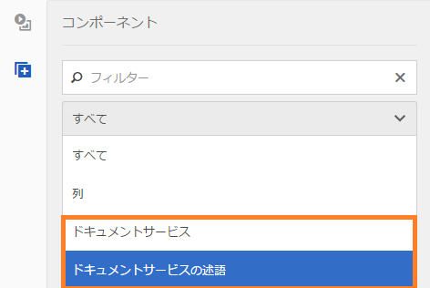
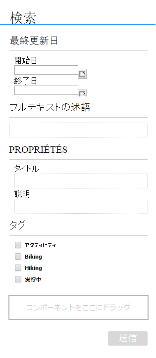

# フォームポータルページの作成{#creating-a-forms-portal-page}

フォームポータルのコンポーネントでは、Web開発者にAdobe Experience Manager (AEM)を使用してフォームポータル用Webサイトを作成し、カスタマイズするためのコンポーネントが用意されています。フォームポータルの概要については、「[ポータル上でフォームを発行する](../../forms/using/introduction-publishing-forms.md)」を参照してください。

## 前提条件 {#prerequisites}

デフォルトでは、フォームポータルコンポーネントは使用できません。「[フォームポータルのコンポーネントを有効にする](/help/forms/using/enabling-forms-portal-components.md)」の説明に従い、フォームポータルコンポーネントにおける次のカテゴリが有効になっていることを確認してください。

**ドキュメント** サービス：Search &amp; Lister、Link、Drafts and Submissionsコンポーネントが含まれます。

**Document Services Predicates**：「Date Predicate」、「Full Text Predicate」、「Properties Predicate」、および「Tags Predicate」のコンポーネントが含まれています。これらのコンポーネントは、「Search &amp; Lister」コンポーネントで検索を設定する際に使用します。

これらをAEMサイトのページで有効にすると、コンポーネントの各カテゴリはコンポーネントブラウザで使用でるようになります。

Formsポータルコンポーネントのカテゴリ

## Search &amp; Lister コンポーネント {#search-amp-lister-component}

「Document Services」のコンポーネントカテゴリにある「Search &amp; Lister」コンポーネントは、ページ上にフォームを一覧表示し、その中から検索を実行するのに使用されます。コンポーネントには、次の2つのペインが含まれます。

* フォームが一覧表示される「リスト」ペイン。
* 検索機能を追加する「検索」ペイン。

「Search &amp; Lister」コンポーネントは、コンポーネントブラウザーの「ドキュメントサービス」コンポーネントカテゴリからページにドラッグ&amp;ドロップできます。 コンポーネントを追加すると、下記の画像のようになります。

ページ中のグリッドレイアウトのSearch &amp; Lister コンポーネント

### リストペイン {#list-pane}

リストペインはフォームが一覧表示される領域です。Search &amp; Listerコンポーネントには、リストペインでのフォームの表示を制御するために使用できる様々な設定オプションが用意されています。

リストペインを設定するには、「Search &amp; Lister」コンポーネントをタップし、をタップします。 「**[!UICONTROL コンポーネントを編集]**」ダイアログが開きます。

編集モードのリストペイン

「**編集**」ダイアログには複数のタブが含まれており、以下の表で説明される設定オプションを提供します。終了したら、「**OK**」をタップして設定を保存します。

<table>
 <tbody>
  <tr>
   <th>タブ</th>
   <th>設定</th>
   <th>説明</th>
  </tr>
  <tr>
   <td><strong>アセットフォルダー</strong></code></td>
   <td>項目を追加</td>
   <td>アセットのアップロード先フォルダーを、AEM FormsのUIから設定します。デフォルトでは、アップロードされたすべてのアセットが一覧表示されます。AEM Forms の UI に関する詳細は、「<a href="../../forms/using/introduction-managing-forms.md" target="_blank">フォーム管理の概要</a>」を参照してください。</td>
  </tr>
  <tr>
   <td>
<strong>ディスプレイ</strong></code>
 </td>
   <td>タイトルテキスト</td>
   <td>Search &amp; Listerコンポーネントのタイトルデフォルトのタイトルは<strong>フォームポータルです。</strong></td>
  </tr>
  <tr>
   <td> </td>
   <td>テンプレートのレイアウト</td>
   <td>アセットのレイアウト </td>
  </tr>
  <tr>
   <td> </td>
   <td>詳細検索の無効化</td>
   <td>このオプションを有効にすると、詳細検索アイコンが非表示になります。</td>
  </tr>
  <tr>
   <td> </td>
   <td>テキスト検索の無効化</td>
   <td>このオプションを有効にすると、全文検索バーが非表示になります。</td>
  </tr>
  <tr>
   <td><strong>結果</strong></code></td>
   <td>ページごとの結果の数</td>
   <td>ページに表示するフォームの最大数を設定します。</td>
  </tr>
  <tr>
   <td> </td>
   <td>結果のテキスト</td>
   <td>
結果のテキストを設定します（例えば、1-12/601の</strong>「結果」<strong>）。デフォルト値は<strong>「Results」</strong>です。</strong>
 
例えば、このフィールドに<strong>Forms</strong>を指定し、合計601のフォームがある場合、結果のテキストは1 ～ 12/ 601 <strong>Formsに変わります。</strong>
 </td>
  </tr>
  <tr>
   <td> </td>
   <td>ページテキスト</td>
   <td>
ページテキストを設定します（例：<strong>ページ</strong>1/51）。 デフォルト値は<strong>「ページ」</strong>です。
 
例えば、このフィールドに<strong>申込みフォーム</strong>を指定し、51ページある場合、ページのテキストは<strong>申込みフォーム</strong>1/51に変更されます。
 </td>
  </tr>
  <tr>
   <td> </td>
   <td>/ テキスト</td>
   <td>
</strong>の<strong>を指定したテキスト（</strong>51のページ1 <strong>）に置き換えます。 デフォルト値は <strong>/</strong> です。</strong></strong>
 
例えば、このフィールドで</strong>のうち<strong>を指定すると、テキストは</strong>51の<strong>ページ1に変わります。</strong></strong>
 </td>
  </tr>
  <tr>
   <td><strong>フォームリンク</strong></code></td>
   <td>レンダリングタイプ</td>
   <td>指定したレンダリングタイプに基づいて、フォームのリストをコントロールします。使用可能なオプションは「PDF」と「HTML」です。例えば、レンダリングタイプとして HTML のみを指定した場合は、PDF フォームが除外されます。</td>
  </tr>
  <tr>
   <td> </td>
   <td>HTML プロファイル</td>
   <td>レンダリングに使用されるHTMLプロファイルを設定します。使用可能なすべてのプロファイルがドロップダウンリストに一覧表示されます。</td>
  </tr>
  <tr>
   <td> </td>
   <td>送信 URL</td>
   <td>
フォームデータが送信されるサーブレットを設定します。
 
<strong>注意：</strong><em>フォームの送信 URL は、複数の場所で指定できます。また、その優先順位は以下の通りです。</em>

    <ol>
     <li><em>優先順位が最も高いのは、フォームに埋め込まれている送信URL（送信ボタン）です。</em></li>
     <li><em>2番目に優先順位が高いのは、AEMフォームUIで説明している送信URLです。</em></li>
     <li><em>一番優先順位が引くのが、フォームポータルで説明している送信URLです。</em></li>
    </ol> </td>
  </tr>
  <tr>
   <td> </td>
   <td>HTMLレンダリングアクションのツールチップ</td>
   <td>（HTML5のアイコン）の上にマウスを置くと表示されるツールチップのテキストを設定します。</td>
  </tr>
  <tr>
   <td> </td>
   <td>PDFレンダリングアクションのツールチップ</td>
   <td> （PDF のアイコン）の上にマウスのポインターを置くと表示されるツールチップのテキストを設定します。</td>
  </tr>
  <tr>
   <td><strong>スタイル</strong></code></td>
   <td>スタイルタイプ</td>
   <td>フォームのリスト表示に<strong>「スタイルなし」、「デフォルトのスタイル」</strong>、または<strong>カスタムスタイル</strong>を指定できます。</td>
  </tr>
  <tr>
   <td> </td>
   <td>カスタムスタイルパス</td>
   <td>スタイルタイプとして「カスタム」を選択した場合、カスタム CSS へのパスを参照して指定します。そうでない場合、「デフォルト」を選択します。</td>
  </tr>
 </tbody>
</table>

### 検索ペイン {#search-pane}

検索ペインでは、サイドキックの「Document Services Predicates」カテゴリから、「Date Predicate」、「Full Text Predicate」、「Properties Predicate」、および「Tags Predicate」コンポーネントを追加することができます。これらのコンポーネントは、リストに表示されるフォームに対してユーザーが検索を実行するための検索機能を実装します。

**チップ：***フォームポータルに表示されるフォームのリストを既定の条件に基づいて制御し、エンドユーザーに対して検索機能を非表示にできます。フォームのリストを制御するには、検索フィルターを適用するためにPredicateコンポーネントを使用します。また、デフォルトのフィルタ値を指定し、[コンポーネントを編集]ダイアログの[表示]タブで検索を無効にすることもできます。*

日付、フルテキスト、プロパティ、およびTags Predicate付きの検索パネル

#### 日付の述語 {#date-predicate}

「Date Predicate」コンポーネントが追加されている場合は、指定された期間に変更されたフォームについて、一覧表示されたフォームの中から検索できます。

「Date Predicate」コンポーネントを構成するには、次の手順を実行します。

1. コンポーネントをタップし、をタップします。 編集ダイアログが開きます。
1. 以下のプロパティを指定します。

   * **タイプ：**&#x200B;選択できるオプションは「**最終変更日**」のみです。

   * **テキスト：** Date Predicateコンポーネントのラベルまたはキャプションです。デフォルト値は「**最終変更日**」です。

   * **開始日のラベル：**&#x200B;開始日フィールドのラベルまたはキャプションです。
   * **終了日のラベル：**&#x200B;終了日フィールドのラベルまたはキャプションです。
   * **非表示：**&#x200B;デフォルトの日付フィルターを適用してフォームを一覧表示します。

1. 「**OK**」をタップします。

#### フルテキストの述語 {#full-text-predicate}

「Full Text Predicate」コンポーネントは、フォームデータに対して名前や説明などを検索する、フルテキスト検索を実装します。名前や説明にテキストを含む戻りフォームで、テキスト文字列を検索できます。

Full Text Predicate コンポーネントを構成するには、次の手順を実行します。

1. コンポーネントをタップし、をタップします。 編集ダイアログが開きます。
1. 「**メインタイトル**」フィールドにタイトルを指定します。
1. 「**OK**」をタップします。

#### プロパティの述語 {#properties-predicate}

Properties Predicateコンポーネントは、フォームプロパティ（タイトル、作成者および説明など）に基づいたフォームの検索機能を実装します。

Properties Predicate コンポーネントを構成するには、次の手順を実行します。

1. コンポーネントをタップし、をタップします。 編集ダイアログが開きます。
1. 「全般」タブで、検索ラベルを指定します。デフォルト値は、**プロパティ**&#x200B;です。

1. 「オプション」タブで、「**アイテムの追加**」をタップします。
1. ドロップダウンリストからプロパティを選択し、ドロップダウンリストの下のフィールドでプロパティの検索ラベルを指定します。
1. 手順 4 を繰り返してさらにプロパティを追加します。また、指定した条件に基づいてリストフォームにデフォルトのフィルター値を指定し、エンドユーザーによる検索でプロパティを非表示にすることもできます。 プロパティの「非表示」チェックボックスを選択し、デフォルトフィルター値を指定します。例えば、タイトルに「Travel」という文字を含むフォームを表示するには、「タイトル」プロパティ横の「非表示」を選択します。さらに、デフォルトのフィルター値のテキストボックスで「Travel」を指定します。

1. 「**OK**」をタップします。

#### タグの述語 {#tags-predicate}

Tags Predicate コンポーネントは、Forms Manager で定義されているタグに基づいて、フォームの検索機能を実装します。

Tags Predicate コンポーネントを構成するには、次の手順を実行します。

1. コンポーネントをタップし、をタップします。 編集ダイアログが開きます。
1. 「タグ」フィールド横の下向き矢印ボタンをタップします。
1. 適切なタグを選択します。
1. 「**OK**」をタップします。

選択したタグが、選択のためのチェックボックスと一緒に検索ペインに表示されます。ユーザーはこのタグに基づいて検索を絞り込めるようになります。

## ページ上でフォームを一覧表示 {#list-forms-on-a-page-br}

ページ上でフォームを一覧表示するには、そのページに&#x200B;**[!UICONTROL Search &amp; Listerコンポーネントを追加し、]**&#x200B;リストペインを設定します&#x200B;****。エンドユーザーが、日付、テキスト、およびタグでフォームを検索できるようにするには、**[!UICONTROL 検索ペイン]**&#x200B;コンポーネントを追加します。

ページ上の任意の場所からフォームにリンクするには、リンクコンポーネントを使用します。リンクコンポーネントについて詳しくは、[ページ](../../forms/using/embedding-link-component-page.md)へのリンクコンポーネントの埋め込みを参照してください。

ドラフト状態で、既に送信済みのフォームをリストするには、「**[!UICONTROL ドラフト&amp;送信]**」コンポーネントを使用します。詳しくは、「[ドラフト・送信コンポーネントのカスタマイズ](../../forms/using/draft-submission-component.md)」を参照してください。

## モバイルデバイスへの適合性  {#mobile-device-friendliness}

フォームポータルのSearch &amp; Listerコンポーネントは、モバイルデバイスフレンドリーで、デバイスに適応します。3つのデフォルト表示すべて：Webページの幅が調整される場合、グリッド、カード、パネルは、サイトが開かれたデバイスに応じて再レイアウトされます。 簡単に言えば、Search &amp; Listerは単なるコンポーネントであり、ページレベルのスタイリングは管理しません。

次の画像は、モバイルデバイス上で開いた場合の Search &amp; Lister コンポーネントを示します。

Search &amp; Listerコンポーネント

## フォームポータルページのカスタマイズ {#customizing-a-forms-portal-page-br}

フォームポータルページをカスタマイズすることで、特徴のある外観にすることができます。また、メタデータを追加することで、検索機能の改善、ページのレイアウト変更、およびカスタムCCSスタイルの追加を行うこともできます。詳しくは、[Formsポータルコンポーネントのテンプレートのカスタマイズ](../../forms/using/customizing-templates-forms-portal-components.md)を参照してください。

AEMフォームUIでは、カスタムメタデータをフォームに追加することができます。カスタムメタデータは、エンドユーザーに対してフォームの展開・検索機能を提供するのに役に立ちます。カスタムメタデータについて詳しくは、[Formsポータルコンポーネントのテンプレートのカスタマイズ](../../forms/using/customizing-templates-forms-portal-components.md)を参照してください。

フォームポータルは、デフォルトでレンダリングアクションを提供します。フォームポータルをカスタマイズして、他のオプションを追加することもできます。詳しくは、「[フォームリスター項目にカスタムアクションボタンを追加する](../../forms/using/add-custom-action-form-lister.md)」を参照してください。

## 関連記事

* [フォームポータルコンポーネントの有効化](/help/forms/using/enabling-forms-portal-components.md)
* [フォームポータルページの作成](/help/forms/using/creating-form-portal-page.md)
* [API を使用した Web ページ上のフォームの一覧表示](/help/forms/using/listing-forms-webpage-using-apis.md)
* [ドラフトと送信コンポーネントの使用](/help/forms/using/draft-submission-component.md)
* [ドラフトと送信済みフォームのストレージのカスタマイズ](/help/forms/using/draft-submission-component.md)
* [ドラフトと送信コンポーネントとデータベースの統合のサンプル](/help/forms/using/integrate-draft-submission-database.md)
* [フォームポータルコンポーネントのテンプレートをカスタマイズする](/help/forms/using/customizing-templates-forms-portal-components.md)
* [ポータル上のフォーム発行の概要](/help/forms/using/introduction-publishing-forms.md)
