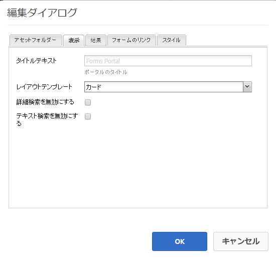

# フォームポータルページの作成 {#creating-a-forms-portal-page}

| バージョン | 記事リンク |
| -------- | ---------------------------- |
| AEM as a Cloud Service | [ここをクリックしてください](https://experienceleague.adobe.com/docs/experience-manager-cloud-service/content/forms/adaptive-forms-authoring/authoring-adaptive-forms-foundation-components/configure-forms-portal.html?lang=ja) |
| AEM 6.5 | この記事 |

フォームポータルのコンポーネントにより、web 開発者は Adobe Experience Manager（AEM）を使用して作成された web サイト上にフォームポータルを作成してカスタマイズできます。フォームポータルの概要については、[ポータル上のフォーム公開の概要](../../forms/using/introduction-publishing-forms.md)を参照してください。

## 前提条件 {#prerequisites}

デフォルトでは、フォームポータルコンポーネントは使用できません。[フォームポータルのコンポーネントを有効にする](/help/forms/using/enabling-forms-portal-components.md)の説明に従い、フォームポータルコンポーネントにおける次のカテゴリが有効になっていることを確認してください。

**Document Services**：検索とリスター、リンクおよびドラフトと送信のコンポーネントが含まれています。

**Document Services Predicates**：日付の述語、フルテキストの述語、プロパティの述語、およびタグの述語のコンポーネントが含まれています。これらのコンポーネントは、検索とリスターコンポーネントで検索を設定する際に使用します。

これらを AEM Sites のページで有効にすると、コンポーネントの各カテゴリはコンポーネントブラウザーで使用できるようになります。

フォームポータルコンポーネントのカテゴリ

## 検索とリスターコンポーネント {#search-amp-lister-component}

Document Services のコンポーネントカテゴリにある検索とリスターコンポーネントは、ページ上にフォームをリストし、その中から検索を実行するのに使用されます。このコンポーネントには、次の 2 つのペインが含まれます。

* フォームがリストされるリストペイン。
* 検索機能を追加する検索ペイン。

検索とリスターコンポーネントは、コンポーネントブラウザの Document Services コンポーネントカテゴリからページまでドラッグ＆ドロップすることができます。コンポーネントを追加すると、下記の画像のようになります。

ページ中のグリッドレイアウトの検索とリスターコンポーネント

### リストペイン {#list-pane}

リストペインはフォームが一覧表示される領域です。検索とリスターコンポーネントでは各種の設定オプションが提供されており、リストウィンドウでフォームの表示を制御するのに使用します。

リストウィンドウを設定するには、検索とリスターコンポーネントを選択し、 を選択します。**[!UICONTROL 編集コンポーネント]**&#x200B;ダイアログが開きます。

編集モードのリストペイン

「**編集**」ダイアログには複数のタブが含まれており、以下の表で説明される設定オプションを提供します。終わったら「**OK**」を選択して、設定を保存します。

<table>
 <tbody>
  <tr>
   <th>タブ</th>
   <th>設定</th>
   <th>説明</th>
  </tr>
  <tr>
   <td><strong>アセットフォルダー</strong></code></td>
   <td>項目を追加</td>
   <td>アセットのアップロード先フォルダーを、AEM Forms の UI から設定します。デフォルトでは、アップロードされたすべてのアセットがリストされます。AEM Forms の UI について詳しくは、<a href="../../forms/using/introduction-managing-forms.md" target="_blank">フォーム管理の概要</a>を参照してください。</td>
  </tr>
  <tr>
   <td>
<strong>ディスプレイ</strong></code>
 </td>
   <td>タイトルテキスト</td>
   <td>検索とリスターコンポーネントのタイトル。デフォルトのタイトルは<strong>フォームポータル</strong>です。</td>
  </tr>
  <tr>
   <td> </td>
   <td>テンプレートのレイアウト</td>
   <td>アセットのレイアウト </td>
  </tr>
  <tr>
   <td> </td>
   <td>詳細検索を無効にする</td>
   <td>このオプションを有効にすると、詳細検索アイコンが非表示になります。</td>
  </tr>
  <tr>
   <td> </td>
   <td>テキスト検索を無効にする</td>
   <td>このオプションを有効にすると、全文検索バーが非表示になります。</td>
  </tr>
  <tr>
   <td><strong>結果</strong></code></td>
   <td>ページごとの結果の数</td>
   <td>ページに表示するフォームの最大数を設定します。</td>
  </tr>
  <tr>
   <td> </td>
   <td>結果のテキスト</td>
   <td>
結果のテキストを設定します（例えば、1-12/601 の<strong>結果</strong>）。デフォルト値は「<strong>結果</strong>」です。
 
例えば、このフィールドで<strong>フォーム</strong>を指定し、合計 601 のフォームがある場合、結果のテキストは 1-12/601 の「<strong>Forms</strong>」に変わります。
 </td>
  </tr>
  <tr>
   <td> </td>
   <td>ページテキスト</td>
   <td>
ページテキストを設定します（例：1/51 <strong>ページ</strong>）。デフォルト値は<strong>「ページ」</strong>です。
 
例えば、このフィールドに<strong>アプリケーションフォーム</strong>を指定し、ページが 51 ページある場合、ページテキストは 1/51 <strong>アプリケーションフォーム</strong>に変わります。
 </td>
  </tr>
  <tr>
   <td> </td>
   <td>/ テキスト</td>
   <td>
指定されたテキストの <strong>of</strong> という文字を指定したテキストに置き換えます（Page 1 <strong>of </strong>51）。デフォルト値は <strong>/</strong> です。
 
例えば、このフィールドに <strong>out of </strong> を指定した場合、テキストは Page 1 <strong>out of </strong>51 に変わります。
 </td>
  </tr>
  <tr>
   <td><strong>フォームリンク</strong></code></td>
   <td>レンダリングタイプ</td>
   <td>指定したレンダリングタイプに基づいてフォームのリストを制御します。使用可能なオプションは、PDF と HTML です。例えば、レンダリングタイプとして HTML のみを選択した場合、PDF フォームは除外されます。</td>
  </tr>
  <tr>
   <td> </td>
   <td>HTML プロファイル</td>
   <td>レンダリングに使用する HTML プロファイルを設定します。使用可能なすべてのプロファイルがドロップダウンリストに一覧表示されます。</td>
  </tr>
  <tr>
   <td> </td>
   <td>送信 URL</td>
   <td>
フォームデータが送信されるサーブレットを設定します。
 
<strong>メモ：</strong><em>フォームの送信 URL は複数の場所で指定でき、優先順位は次の通りです。</em>

    <ol>
     <li><em>優先順位が最も高いのは、フォームに埋め込まれている送信URL（送信ボタン）です。</em></li>
     <li><em>2番目に優先順位が高いのは、AEM Forms UIで説明している送信URLです。</em></li>
     <li><em>一番優先順位が引くのが、フォームポータルで説明している送信URLです。</em></li>
    </ol> </td>
  </tr>
  <tr>
   <td> </td>
   <td>HTML レンダリングアクションのツールチップ</td>
   <td>（HTML5 アイコン）にポインタを合わせたときに表示されるツールチップのテキストを設定します。</td>
  </tr>
  <tr>
   <td> </td>
   <td>PDF レンダリングアクションのツールチップ</td>
   <td>（PDF アイコン）にポインタを合わせたときに表示されるツールチップのテキストを設定します。</td>
  </tr>
  <tr>
   <td><strong>スタイル</strong></code></td>
   <td>スタイルタイプ</td>
   <td>フォームのリスト表示には、<strong>書式なし、デフォルトスタイル</strong>または<strong>カスタムスタイル</strong>を指定できます。</td>
  </tr>
  <tr>
   <td> </td>
   <td>カスタムスタイルパス</td>
   <td>スタイルタイプとして「カスタム」を選択した場合は、カスタム CSS へのパスを参照して指定します。それ以外の場合は「デフォルト」を選択します。</td>
  </tr>
 </tbody>
</table>

### 検索ペイン {#search-pane}

検索ペインでは、サイドキックの「Document Services Predicates」カテゴリから、「Date Predicate」、「Full Text Predicate」、「Properties Predicate」、および「Tags Predicate」コンポーネントを追加することができます。これらのコンポーネントにより、一覧表示されるフォームに対してユーザーが検索を実行するための検索機能が実装されます。

**チップ：** *フォームポータルに表示されるフォームのリストを既定の条件に基づいて制御し、エンドユーザーに対して検索機能を非表示にできます。フォームのリストを制御するには、検索フィルターを適用するためにPredicateコンポーネントを使用します。デフォルトフィルター値を指定して、コンポーネントの編集ダイアログの「表示」タブで検索を無効にすることもできます。*

日付、フルテキスト、プロパティ、およびTags Predicate付きの検索パネル

#### 日付の述語 {#date-predicate}

日付の述語コンポーネントが追加されている場合は、指定された期間に変更されたフォームを、一覧表示されたフォームの中から検索できます。

日付の述語コンポーネントを設定するには、次の手順を実行します。

1. コンポーネントを選択し、 を選択します。編集ダイアログが開きます。
1. 以下のプロパティを指定します。

   * **タイプ：**&#x200B;選択できるオプションは「**最終変更日**」のみです。

   * **テキスト：** Date Predicateコンポーネントのラベルまたはキャプションです。デフォルト値は「**最終変更日**」です。

   * **開始日のラベル：**&#x200B;開始日フィールドのラベルまたはキャプションです。
   * **終了日のラベル：**&#x200B;終了日フィールドのラベルまたはキャプションです。
   * **非表示：**&#x200B;デフォルトの日付フィルターを適用してフォームを一覧表示します。

1. 「**OK**」を選択します。

#### フルテキストの述語 {#full-text-predicate}

フルテキストの述語コンポーネントは、フォームデータに対する名前や説明などのフルテキスト検索を実装します。ユーザーは、任意のテキスト文字列を検索して、名前または説明にそのテキストを含むフォームを返すことができます。

フルテキストの述語コンポーネントを設定するには、次の手順を実行します。

1. コンポーネントを選択し、 を選択します。編集ダイアログが開きます。
1. 「**メインタイトル**」フィールドにタイトルを指定します。
1. 「**OK**」を選択します。

#### プロパティの述語 {#properties-predicate}

プロパティの述語コンポーネントは、フォームプロパティ（タイトル、作成者および説明など）に基づいたフォームの検索機能を実装します。

プロパティの述語コンポーネントを設定するには、次の手順を実行します。

1. コンポーネントを選択し、 を選択します。編集ダイアログが開きます。
1. 「一般」タブで、検索ラベルを指定します。デフォルト値は、**プロパティ**&#x200B;です。

1. 「オプション」タブで「**アイテムの追加**」を選択します。
1. ドロップダウンリストからプロパティを選択し、ドロップダウンリストの下のフィールドでプロパティの検索ラベルを指定します。
1. 手順 4 を繰り返してさらにプロパティを追加します。デフォルトのフィルター値を指定して、指定の条件に基づいてフォームをリスト表示したり、エンドユーザーごとに検索のプロパティを非表示にしたりできます。プロパティの「非表示」チェックボックスを選択し、デフォルトフィルター値を指定します。例えば、タイトルに「Travel」という文字を含むフォームを表示するには、「タイトル」プロパティ横の「非表示」を選択します。さらに、デフォルトフィルター値のテキストボックスで Travel と指定します。

1. 「**OK**」を選択します。

#### タグの述語 {#tags-predicate}

タグの述語コンポーネントは、Forms Manager で定義されているタグに基づいて、フォームの検索機能を実装します。

タグの述語コンポーネントを設定するには、次の手順を実行します。

1. コンポーネントを選択し、 を選択します。編集ダイアログが開きます。
1. 「タグ」フィールド横の下向き矢印ボタンを選択します。
1. 適切なタグを選択します。
1. 「**OK**」を選択します。

選択したタグが、選択用のチェックボックスと一緒に検索パネルに表示されます。ユーザーはこのタグに基づいて検索を絞り込めるようになります。

## ページ上でフォームを一覧表示 {#list-forms-on-a-page-br}

ページ上でフォームを一覧表示するには、そのページに **[!UICONTROL Search &amp; Lister]** コンポーネントを追加し、**[!UICONTROL リストペイン]**&#x200B;を設定します。エンドユーザーが、日付、テキストおよびタグでフォームを検索できるようにするには、**[!UICONTROL 検索パネル]**&#x200B;コンポーネントを追加します。

ページ上の任意の場所からフォームにリンクするには、リンクコンポーネントを使用します。リンクコンポーネントについての詳細は、「[ページ内のリンクコンポーネントの埋め込み](../../forms/using/embedding-link-component-page.md)」を参照してください。

ドラフト状態で、既に送信済みのフォームをリストするには、**[!UICONTROL ドラフトと送信]**&#x200B;コンポーネントを使用します。詳しくは、[ドラフトと送信コンポーネントのカスタマイズ](../../forms/using/draft-submission-component.md)を参照してください。

## モバイルデバイスへの適合性 {#mobile-device-friendliness}

フォームポータルの検索とリスターコンポーネントは、モバイルデバイスフレンドリーで、デバイスに応じて表示幅を調整します。3 つすべてのデフォルトビュー：グリッド、カード、パネルは、web ページにも適応するという事実を踏まえて、デバイスに応じて再レイアウトされます。簡単に言えば、検索とリスターコンポーネントは単なるコンポーネントであり、ページレベルのスタイリングは管理しません。

次の画像は、モバイルデバイス上で開いた場合の検索とリスターコンポーネントを示します。

Search &amp; Listerコンポーネント

## フォームポータルページのカスタマイズ {#customizing-a-forms-portal-page-br}

フォームポータルページをカスタマイズすることで、特徴のある外観にすることができます。また、メタデータを追加することで、検索機能の改善、ページのレイアウト変更、およびカスタム CSS スタイルの追加を行うこともできます。詳しくは、「[フォームポータルコンポーネント用テンプレートのカスタマイズ](../../forms/using/customizing-templates-forms-portal-components.md)」を参照してください。

AEM Forms UI を使用すると、カスタムメタデータをフォームに追加することができます。カスタムメタデータは、エンドユーザーにリストおよび検索フォームのエクスペリエンスを提供するのに役立ちます。カスタムメタデータについて詳しくは、「[フォームポータルコンポーネント用テンプレートのカスタマイズ](../../forms/using/customizing-templates-forms-portal-components.md)」を参照してください。

フォームポータルは、標準のレンダリングアクションを提供します。フォームポータルをカスタマイズして、他のアクションを追加することもできます。詳しくは、[フォームリスター項目へのカスタムアクションボタンの追加](../../forms/using/add-custom-action-form-lister.md)を参照してください。

## 関連記事

* [フォームポータルコンポーネントの有効化](/help/forms/using/enabling-forms-portal-components.md)
* [フォームポータルページの作成 ](/help/forms/using/creating-form-portal-page.md)
* [API を使用した Web ページ上のフォームの一覧表示](/help/forms/using/listing-forms-webpage-using-apis.md)
* [ドラフトと送信コンポーネントの使用](/help/forms/using/draft-submission-component.md)
* [ドラフトと送信済みフォームのストレージのカスタマイズ](/help/forms/using/draft-submission-component.md)
* [ドラフトと送信コンポーネントとデータベースの統合のサンプル](/help/forms/using/integrate-draft-submission-database.md)
* [フォームポータルコンポーネントのテンプレートをカスタマイズする](/help/forms/using/customizing-templates-forms-portal-components.md)
* [ポータル上のフォーム公開の概要](/help/forms/using/introduction-publishing-forms.md)
