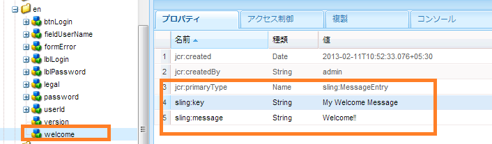

# ログイン画面の作成{#creating-a-new-login-screen}

AEM Forms ログイン画面を使用するすべての AEM Forms モジュールのログイン画面を変更できます。例えば、変更は、Forms Manager および AEM Forms Workspace の両方のログイン画面に影響します。

## 前提条件 {#prerequisite}

1. 管理者権限で `/lc/crx/de` にログインします。
1. 次のアクションを実行します。

   1. `/apps/livecycle/core/content` にある `/libs/livecycle/core/content` の階層構造をレプリケートします。

      同じ（ノード/フォルダー）プロパティおよびアクセス制御を保持します。

   1. 次のコンテンツフォルダーをコピーします。

      追加の: `/libs/livecycle/core`

      を: `/apps/livecycle/core`.

   1. `/apps/livecycle/core` フォルダーのコンテンツを削除します。

1. 次の操作を実行します。

   1. `/apps/livecycle/core/components/login` にある `/libs/livecycle/core/components/login` の階層構造をレプリケートします。同じ（ノード/フォルダー）プロパティおよびアクセス制御を保持します。

   1. コンポーネントフォルダーを `/libs/livecycle/core` から `/apps/livecycle/core` にコピーします。

   1. フォルダー `/apps/livecycle/core/components/login` のコンテンツを削除します。

### 新しいロケールの追加 {#adding-a-new-locale}

1. `i18n` フォルダーをコピーします。

   * コピー元：`/libs/livecycle/core/components/login`
   * コピー先：`/apps/livecycle/core/components/login`

1. `i18n` にあるフォルダーの 1 つを除いて（例えば、`en`）すべて削除します。

1. フォルダー `en` で、以下のアクションを実行します。

   1. フォルダーの名前をサポートするロケール名に変更します。（例：`ar`）。

   1. プロパティ `jcr:language` の値を `ar` に変更します（`ar` フォルダーの場合）。

   >[!NOTE]
   >
   >`ar-DZ` のようにロケールが言語と国コードの組み合わせである場合は、フォルダー名とプロパティ値を `ar-DZ` に変更します。

1. コピー `login.jsp`:

   * コピー元：`/libs/livecycle/core/components/login`
   * コピー先：`/apps/livecycle/core/components/login`

1. 次のコードのスニペットを `/apps/livecycle/core/components/login/login.jsp` に変更します。

***ロケールが言語コードである場合***

```jsp
String browserLocale = "en";

    for(int i=0; i<locales.length; i++)
    {
        String prioperty = locales[i];
        if(prioperty.trim().startsWith("en")) {
            browserLocale = "en";
            break;
        }
        if(prioperty.trim().startsWith("de")){
            browserLocale = "de";
            break;
        }
        if(prioperty.trim().startsWith("ja")){
            browserLocale = "ja";
            break;
        }
        if(prioperty.trim().startsWith("fr")){
            browserLocale = "fr";
            break;
        }
    }
```

To

```jsp
String browserLocale = "en";
    for(int i=0; i<locales.length; i++)
    {
        String prioperty = locales[i];
        if(prioperty.trim().startsWith("ar")) {
            browserLocale = "ar";
            break;
        }
        if(prioperty.trim().startsWith("en")) {
            browserLocale = "en";
            break;
        }
        if(prioperty.trim().startsWith("de")){
            browserLocale = "de";
            break;
        }
        if(prioperty.trim().startsWith("ja")){
            browserLocale = "ja";
            break;
        }
        if(prioperty.trim().startsWith("fr")){
            browserLocale = "fr";
            break;
        }
    }
```

```jsp
String browserLocale = "en";

    for(int i=0; i<locales.length; i++)
    {
        String prioperty = locales[i];
        if(prioperty.trim().startsWith("en")) {
            browserLocale = "en";
            break;
        }
        if(prioperty.trim().startsWith("de")){
            browserLocale = "de";
            break;
        }
        if(prioperty.trim().startsWith("ja")){
            browserLocale = "ja";
            break;
        }
        if(prioperty.trim().startsWith("fr")){
            browserLocale = "fr";
            break;
        }
    }
```

To

```jsp
String browserLocale = "en";
    for(int i=0; i<locales.length; i++)
    {
        String prioperty = locales[i];
        if(prioperty.trim().equalsIgnoreCase("ar-DZ")) {
            browserLocale = "ar-DZ";
            break;
        }
        if(prioperty.trim().startsWith("en")) {
            browserLocale = "en";
            break;
        }
        if(prioperty.trim().startsWith("de")){
            browserLocale = "de";
            break;
        }
        if(prioperty.trim().startsWith("ja")){
            browserLocale = "ja";
            break;
        }
        if(prioperty.trim().startsWith("fr")){
            browserLocale = "fr";
            break;
        }
    }
```

***デフォルトのロケールの変更***

```jsp
   String browserLocale = "en";
   for(int i=0; i<locales.length; i++)

   To

   String browserLocale = "ar";
   for(int i=0; i<locales.length; i++)
```

### 新しいテキストの追加または既存のテキストの変更 {#adding-new-text-or-modifying-existing-text}

1. `i18n` フォルダーをコピーします。

   * コピー元：`/libs/livecycle/core/components/login`
   * コピー先：`/apps/livecycle/core/components/login`

1. ここで、テキストを変更するノード（該当するロケールコードフォルダの下）のプロパティ `sling:message` の値を変更します。翻訳は、ノードのプロパティ `sling:key` の値に示されているキーを介して行われます。

1. 新しいキーと値のペアを追加する場合は、次の操作を実行します。次のスクリーンショットの例を確認します。

   1. `sling:MessageEntry` タイプのノードを作成するか、またはすべてのロケールフォルダーの下で既存のノードをコピーして名前を変更します。
   1. コピー `login.jsp` :

      * コピー元：`/libs/livecycle/core/components/login`

      * コピー先：`/apps/livecycle/core/components/login`

   1. `/apps/livecycle/core/components/login/login.jsp` を変更して、新しく追加したテキストを取り込みます。

   

   ```jsp
   div class="loginContent">
   
                       <span class="loginFlow"></code>
                       <span class="loginVersion"><%= i18n.get("Version: 11.0.0") %></code>
                       <span class="loginTitle"><%= i18n.get("Login") %></code>
                       <% if (loginFailed) {%>
   ```

   To

   ```jsp
   div class="loginContent">
   
                       <span class="loginFlow"></code>
                       <span class="loginVersion"><%= i18n.get("My Welcome Message") %></code>
                       <span class="loginVersion"><%= i18n.get("Version: 11.0.0") %></code>
                       <span class="loginTitle"><%= i18n.get("Login") %></code>
                       <% if (loginFailed) {%>
   ```

### 新しいスタイルの追加、または既存のスタイルの変更 {#adding-new-style-or-modifying-existing-style}

1. `login` ノードをコピーします。

   * コピー元：`/libs/livecycle/core/content`
   * コピー先：`/apps/livecycle/core/content`

1. ファイル `login.js` および `jquery-1.8.0.min.js` を、ノード `/apps/livecycle/core/content/login.` から削除します。
1. CSS ファイルのスタイルを変更します。
1. 新しいスタイルを追加するには、次の手順に従います。

   1. 新しいスタイルを `/apps/livecycle/core/content/login/login.css` に追加します。
   1. コピー `login.jsp`

      * コピー元：`/libs/livecycle/core/components/login`

      * コピー先：`/apps/livecycle/core/components/login`

   1. `/apps/livecycle/core/components/login/login.jsp` を変更して、新しく追加したスタイルを取り込みます。


次に例を示します。

* `/apps/livecycle/core/content/login/login.css` に以下の内容を追加します。

```
css.newLoginContentArea {
    width: 700px;
    padding: 100px 0px 0px 100px;
   }
```

* `/apps/livecycle/core/components/login.jsp` で以下を変更します。


  ```jsp
  <div class="loginContentArea">
  ```

  To

  ```jsp
  <div class="newLoginContentArea">
  ```

>[!NOTE]
>
>`/apps/livecycle/core/content/login` の既存の画像（`/libs/livecycle/core/content/login` からコピーした）が削除されている場合は、CSS で対応する参照を削除します。

### 新しい画像の追加 {#add-new-images}

1. 上記の「新しいスタイルの追加、または既存のスタイルの変更」の手順に従います。
1. `/apps/livecycle/core/content/login` に新しい画像を追加します。画像を追加するには、次の手順に従います。

   1. WebDAV クライアントをインストールします。
   1. webDAV クライアントを使用して、`/apps/livecycle/core/content/login` フォルダーに移動します。詳しくは、[WebDAV アクセス](https://experienceleague.adobe.com/docs/experience-manager-65/administering/contentmanagement/webdav-access.html?lang=ja)を参照してください。

   1. 新しい画像を追加します。

1. `/apps/livecycle/core/content/login` に追加された新しい画像に対応して、`/apps/livecycle/core/content/login/login.css,` に新しいスタイルを追加します。
1. `/apps/livecycle/core/components` にある `login.jsp` の新しいスタイルを使用します。

以下に例を示します。


```css
.newLoginContainerBkg {

 background-image: url(my_Bg.gif);
 background-repeat: no-repeat;
 background-position: left top;
 width: 727px;
}
```


    * /apps/livecycle/core/components/login.jsp で以下を変更します。

```jsp
<div class="loginContainerBkg">
```

To

```jsp
<div class="newLginContainerBkg">
```
