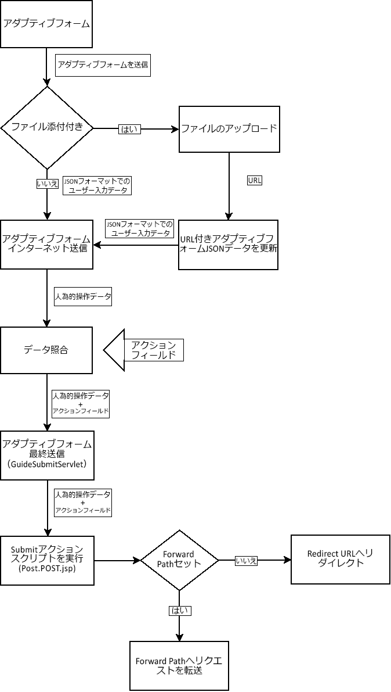
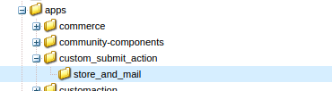
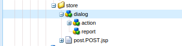
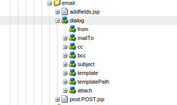
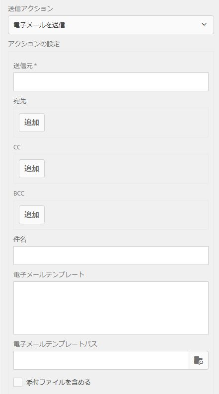

# アダプティブフォーム向けのカスタム送信アクションの作成{#writing-custom-submit-action-for-adaptive-forms}

アダプティブフォームでは、ユーザー指定のデータを処理するために送信アクションが必要です。 送信アクションは、アダプティブフォームを使用して送信するデータに対して実行されるタスクを決定します。 Adobe Experience Manager (AEM) includes [OOTB Submit actions](../../forms/using/configuring-submit-actions.md) that demonstrate custom tasks you can perform using the user-submitted data. 例えば、電子メールの送信やデータの保存などのタスクを実行できます。

## 送信アクションのワークフロー {#workflow-for-a-submit-action}

The flowchart depicts the workflow for a Submit action that is triggered when you click the **[!UICONTROL Submit]** button in an adaptive form. File Attachment コンポーネントのファイルはサーバーにアップロードされ、フォームデータはアップロードされたファイルの URL で更新されます。クライアント内で、データは JSON 形式で格納されます。クライアントは、指定したデータをメッセージして XML 形式で返信する内部サーブレットに Ajax リクエストを送信します。クライアントは、このデータをアクションフィールドと照合します。データは、Form Submitアクションを通じて、最終サーブレット（Guide Submitサーブレット）に送信されます。 次に、サーブレットが送信アクションにコントロールを転送します。送信アクションは、リクエストを別のスリングリソースに転送したり、ブラウザーを別のURLにリダイレクトしたりできます。



### XML データ形式 {#xml-data-format}

The XML data is sent to the servlet using the **`jcr:data`** request parameter. 送信アクションは、データを処理するためにパラメーターにアクセスすることができます。次のコードは、XML データの形式を説明しています。The fields that are bound to the Form model appear in the **`afBoundData`** section. バインドされていないフィールドは、`afUnoundData` セクションに表示されます。For more information about the format of the `data.xml` file, see [Introduction to prepopulating adaptive form fields](../../forms/using/prepopulate-adaptive-form-fields.md).

```xml
<?xml ?>
<afData>
<afUnboundData>
<data>
<field1>value</field2>
<repeatablePanel>
    <field2>value</field2>
</repeatablePanel>
<repeatablePanel>
    <field2>value</field2>
</repeatablePanel>
</data>
</afUnboundData>
<afBoundData>
<!-- xml corresponding to the Form Model /XML Schema -->
</afBoundData>
</afData>
```

### アクションフィールド {#action-fields}

A Submit action can add hidden input fields (using the HTML [input](https://developer.mozilla.org/en/docs/Web/HTML/Element/Input) tag) to the rendered form HTML. これらの非表示フィールドには、フォーム送信の処理中に必要な値を含めることができます。 フォームの送信時に、これらのフィールド値は、送信アクションが送信処理時に使用できるリクエストパラメーターとしてポストバックされます。 この入力フィールドは、アクションフィールドと呼ばれます。

For example, a Submit action that also captures the time taken to fill a form can add the hidden input fields `startTime` and `endTime`.

スクリプトを使って、フォームがレンダリングされた時間ならびにフォーム送信前の時間を、それぞれ `startTime` および `endTime` フィールドの値として指定することができます。その後、送信アクションのスクリプト `post.jsp` が、リクエストパラメーターを使ってこれらのフィールドにアクセスし、フォームの記入にかかった合計時間を計算することができます。

### 添付ファイル {#file-attachments}

送信アクションは、File Attachmentコンポーネントを使用してアップロードする添付ファイルを使用することもできます。 送信アクションスクリプトは、スリング [RequestParameter API](https://sling.apache.org/apidocs/sling5/org/apache/sling/api/request/RequestParameter.html) を使ってこれらのファイルにアクセスすることができます。The [isFormField](https://sling.apache.org/apidocs/sling5/org/apache/sling/api/request/RequestParameter.html#isFormField()) method of the API helps identify whether the request parameter is a file or a form field. 送信アクション内のリクエストパラメーターを反復することで、File Attachment パラメーターを特定することができます。

次のサンプルコードは、まず、リクエスト内の添付ファイルを特定します。Next, it reads the data into the file using the [Get API](https://sling.apache.org/apidocs/sling5/org/apache/sling/api/request/RequestParameter.html#get()). 最後に、データを使用してドキュメントオブジェクトを作成し、リストに追加します。

```java
RequestParameterMap requestParameterMap = slingRequest.getRequestParameterMap();
for (Map.Entry<String, RequestParameter[]> param : requestParameterMap.entrySet()) {
    RequestParameter rpm = param.getValue()[0];
    if(!rpm.isFormField()) {
        fileAttachments.add(new Document(rpm.get()));
    }
}
```

### 転送パスおよびリダイレクト URL {#forward-path-and-redirect-url}

要求されたアクションを実行した後、送信サーバーレットは、リクエストを転送パスに転送します。アクションは、setForwardPath APIを使用して、Guide Submitサーブレットに転送パスを設定します。

アクションによって転送パスが指定されない場合、送信サーバーレットは、リダイレクト URL を使ってブラウザをリダイレクトします。作成者は、アダプティブフォーム編集ダイアログのありがとうございますページ設定を使って、リダイレクト URL を設定します。リダイレクトURLは、送信アクションまたはGuide Submit内のsetRedirectUrl APIを使用して設定することもできます。 また、Guide Submit 内の setRedirectUrl API を使って、リダイレクト URL に送られるリクエストパラメーターを設定することもできます。

>[!NOTE]
>
>リダイレクト URL は、ありがとうございますページ設定を使って作成者が指定します[OOTB送信アクション](../../forms/using/configuring-submit-actions.md) ：リダイレクトURLを使用して、転送パスが参照するリソースからブラウザをリダイレクトします。
>
>リクエストをリソースまたはサーブレットに転送するカスタム送信アクションを作成できます。 転送パスのリソース処理を実行するスクリプトで、処理が完了したときにリダイレクトURLにリクエストをリダイレクトすることをお勧めします。

## 送信アクション {#submit-action}

送信アクションは、次を含むsling:Folderです。

* **addfields.jsp**:このスクリプトは、レンダリング中に HTML ファイルに追加されるアクションフィールドを指定します。post.POST.jsp スクリプトでの送信中に必要な非表示の入力パラメーターの追加には、このスクリプトを使用します。
* **dialog.xml**：このスクリプトは、CQ Component ダイアログに似ています。作成者がカスタマイズする設定情報を提供します。 これらのフィールドは、送信アクションを選択した場合に、アダプティブフォーム編集ダイアログの送信アクションタブに表示されます。
* **post.POST.jsp**: 送信サーブレットは、送信したデータと前の節の追加データを使用して、このスクリプトを呼び出します。 このページで言及されるアクションの実行は、post.POST.jsp スクリプトの実行を意味します。送信アクションをアダプティブフォームに登録し、アダプティブフォーム編集ダイアログに表示するには、次のプロパティをsling:Folderに追加します。

   * ストリング型の **guideComponentType** および値 **fd/af/components/guidesubmittype**
   * **送信アクションが適用されるアダプティブフォームのタイプを指定する文字列型のguideDataModel** 。 **xfa** はXFAベースのアダプティブフォームでサポートされ、 **** xsdはXSDベースのアダプティブフォームでサポートされています。 **basic** は、XDPまたはXSDを使用しないアダプティブフォームでサポートされています。 複数のタイプのアダプティブフォームでのアクションを表示するには、対応する文字列を追加します。各文字列はコンマで区切ります。 For example, to make an action visible on XFA- and XSD-based adaptive forms, specify the values **xfa** and **xsd** respectively.

   * **文字列型のjcr:description** 。 このプロパティの値は、アダプティブフォーム編集ダイアログの送信アクションタブにある送信アクションリストに表示されます。 The OOTB actions are present in the CRX repository at the location **/libs/fd/af/components/guidesubmittype**.

## カスタム送信アクションの作成 {#creating-a-custom-submit-action}

次の手順を実行し、CRX リポジトリにデータを保存した後、メール送信を行うカスタム送信アクションを作成します。アダプティブフォームには、CRXリポジトリにデータを保存するOOTB送信アクションStore Content（非推奨）が含まれています。 In addition, CQ provides a [Mail](https://docs.adobe.com/docs/en/cq/current/javadoc/com/day/cq/mailer/package-summary.html) API that can be used to send emails. Before using the Mail API, [configure](https://docs.adobe.com/docs/en/cq/current/administering/notification.html?wcmmode=disabled#Configuring the Mail Service) the Day CQ Mail service through the system console. Store Content（非推奨）アクションを再利用して、リポジトリにデータを保存できます。 Store Content（廃止）アクションは、CRX リポジトリの /libs/fd/af/components/guidesubmittype/store にあります。

1. URL https://&lt;server>:&lt;port>/crx/de/index.jspでCRXDE Liteにログインします。 /apps/custom_submit_action フォルダー内に sling:Folder プロを持つノードを作成し、名前を store_and_mail に設定します。custom_submit_action フォルダーがすでに存在しない場合は作成します。

   

1. **必須の設定フィールドを指定します。**

   Store追加アクションに必要な設定。 /libs/fd/af/components/guidesubmittype/store から、Store アクションの **cq:dialog** ノードを、/apps/custom_submit_action/store_and_email のアクションフォルダーにコピーします。

   

1. **作成者に電子メール設定を促す設定フィールドを指定します。**

   アダプティブフォームには、ユーザーに電子メールを送信する Email アクションもあります。要件に応じて、このアクションをカスタマイズします。/libs/fd/af/components/guidesubmittype/email/dialog に移動します。cq:dialogノード内のノードを、送信アクションのcq:dialogノード(/apps/custom_submit_action/store_and_email/dialog)にコピーします。

   

1. **アクションを Adaptive Form Edit ダイアログで使用できるようにします。**

   次のプロパティを store_and_email ノードに追加します。

   * ストリング型の **guideComponentType****** および値 **fd/af/components/guidesubmittype**

   * **タイプ** String **、** 値xfa **、xsd、basicのguideDataModel**

   * **ストリング**&#x200B;型の&#x200B;**jcr:description**&#x200B;および値 **Store and Email Action**

1. 任意のアダプティブフォームを開きます&#x200B;**Start** の隣にある「**Edit**」ボタンをクリックし、アダプティブフォームコンテナの **Edit** ダイアログを開きます。新しいアクションが、**Submit Actions** タブに表示されます。Selecting the **Store and Email Action** displays the configuration added in the dialog node.

   

1. **アクションを使用してタスクを完了します。**

   post.POST.jsp スクリプトをアクションに追加します。(/apps/custom_submit_action/store_and_mail/)。

   OOTB の Store アクション（post.POST.jsp スクリプト）を実行します。Use the [FormsHelper.runAction](https://docs.adobe.com/docs/en/cq/current/javadoc/com/day/cq/wcm/foundation/forms/FormsHelper.html#runAction(java.lang.String, java.lang.String, org.apache.sling.api.resource.Resource, org.apache.sling.api.SlingHttpServletRequest, org.apache.sling.api.SlingHttpServletResponse)) API that CQ provides in your code to run the Store action. 次のコードを JSP ファイルに追加します。

   `FormsHelper.runAction("/libs/fd/af/components/guidesubmittype/store", "post", resource, slingRequest, slingResponse);`

   電子メールを送信するために、コードは受信者の電子メールアドレスを設定から読み取ります。 アクションのスクリプトに設定値を取り込むには、次のコードを使って現在のリソースのプロパティを読み込みます。同じく、その他の設定ファイルを読み込むこともできます。

   `ValueMap properties = ResourceUtil.getValueMap(resource);`

   `String mailTo = properties.get("mailTo");`

   最後に、CQ Mail API を使用してメールを送信します。Use the [SimpleEmail](https://commons.apache.org/proper/commons-email/apidocs/org/apache/commons/mail/SimpleEmail.html) class to create the Email Object as depicted below:

   >[!NOTE]
   >
   >JSP ファイルの名前が post.POST.jsp になっていることを確認してください。

   ```java
   <%@include file="/libs/fd/af/components/guidesglobal.jsp" %>
   <%@page import="com.day.cq.wcm.foundation.forms.FormsHelper,
          org.apache.sling.api.resource.ResourceUtil,
          org.apache.sling.api.resource.ValueMap,
                   com.day.cq.mailer.MessageGatewayService,
     com.day.cq.mailer.MessageGateway,
     org.apache.commons.mail.Email,
                   org.apache.commons.mail.SimpleEmail" %>
   <%@taglib prefix="sling"
                   uri="https://sling.apache.org/taglibs/sling/1.0" %>
   <%@taglib prefix="cq"
                   uri="https://www.day.com/taglibs/cq/1.0"
   %>
   <cq:defineObjects/>
   <sling:defineObjects/>
   <%
           String storeContent =
                       "/libs/fd/af/components/guidesubmittype/store";
           FormsHelper.runAction(storeContent, "post", resource,
                                   slingRequest, slingResponse);
    ValueMap props = ResourceUtil.getValueMap(resource);
    Email email = new SimpleEmail();
    String[] mailTo = props.get("mailto", new String[0]);
    email.setFrom((String)props.get("from"));
           for (String toAddr : mailTo) {
               email.addTo(toAddr);
      }
    email.setMsg((String)props.get("template"));
    email.setSubject((String)props.get("subject"));
    MessageGatewayService messageGatewayService =
                       sling.getService(MessageGatewayService.class);
    MessageGateway messageGateway =
                   messageGatewayService.getGateway(SimpleEmail.class);
    messageGateway.send(email);
   %>
   ```

   アダプティブフォームでアクションを選択します。アクションがメールを送信し、データを保存します。

