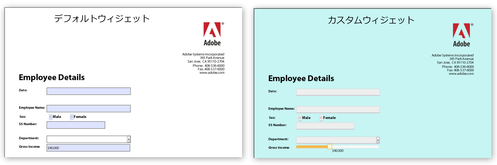

# HTML5 フォームのカスタム外観の作成{#create-custom-appearances-in-html-forms}

Mobile Forms でカスタムウィジェットをプラグインできます。外観フレームワークを使用することで、既存の jQuery ウィジェットの拡張や、独自のカスタムウィジェットの開発を行うことができます。XFA engine uses various widgets, see [Appearance framework for adaptive and HTML5 forms](/help/forms/using/introduction-widgets.md) for detailed information.



デフォルトおよびカスタムウェジェットの例

## HTML5 Forms でのカスタムウィジェットの統合 {#integrating-custom-widgets-with-html-forms}

### Create a profile  {#create-a-profile-nbsp}

プロファイルを作成するか、または既存のプロファイルを選択してカスタムウィジェットを追加できます。プロファイル作成について詳しくは、「[カスタムプロファイルの作成](/help/forms/using/custom-profile.md)」を参照してください。

### ウィジェットを作成します {#create-a-widget}

HTML5フォームは、新しいウィジェットを作成するために拡張できるウィジェットフレームワークの実装を提供します。 この実装は jQuery ウィジェット *abstractWidget* です。これを拡張して新しいウィジェットを作成することができます。新しいウィジェットは、以下に記述する関数を拡張 / 上書きすることによって機能させることができます。

<table>
 <tbody>
  <tr>
   <td>関数 / クラス</td>
   <td>説明</td>
  </tr>
  <tr>
   <td>render</td>
   <td>レンダリング関数は、ウィジェットのデフォルト HTML 要素のための jQuery オブジェクトを返します。デフォルトの HTML 要素は、フォーカス可能タイプとします。例えば、&lt;a&gt;、&lt;input&gt;、&lt;li&gt; などです。返された要素は $userControl として使用されます。$userControlで上記の制約を指定した場合、AbstractWidgetクラスの関数は期待どおりに動作します。そうでない場合、一部の一般的なAPI（フォーカス、クリック）は変更を必要とします。 </td>
  </tr>
  <tr>
   <td>getEventMap</td>
   <td>HTML イベントを XFA イベントに変換するマップを返します。<br /> {<br /> blur:XFA_EXIT_イベント,<br /> }<br /> この例は、blurがHTMLイベントであり、XFA_EXIT_イベントが対応するXFAイベントであることを示しています。 </td>
  </tr>
  <tr>
   <td>getOptionsMap</td>
   <td>オプションの変更時に実行すべきアクションの詳細を提供するマップを返します。キーはウィジェットに提供されるオプションです。値はそのオプションの変更が検出されたときに毎回呼び出される関数です。 ウィジェットは、すべての一般的なオプション（value と displayValue を除く）のハンドラーを提供します</td>
  </tr>
  <tr>
   <td>getCommitValue</td>
   <td>ウィジェットフレームワークは、ウィジェットの値が XFAModel に保存されたときに（例えば textField の exit イベント時に）毎回この関数を読み込みます。実装は、ウィジェットに保存された値を返す必要があります。 ハンドラーには、オプションの新しい値が指定されます。</td>
  </tr>
  <tr>
   <td>showValue</td>
   <td>デフォルトでは、XFA での enter イベント時に、フィールドの rawValue が表示されます。この関数が呼び出されて、rawValue がユーザーに表示されます。 </td>
  </tr>
  <tr>
   <td>showDisplayValue</td>
   <td>デフォルトでは、XFA での exit イベント時に、フィールドの formattedValue が表示されます。この関数が呼び出されて、formattedValue がユーザーに表示されます。 </td>
  </tr>
 </tbody>
</table>

独自のウィジェットを作成するには、上記で作成されたプロファイルに、上書きされた関数と新しく追加された関数を含む JavaScript ファイルの参照を含めます。For example, the *sliderNumericFieldWidget* is a widget for numeric Fields. ヘッダーセクション内のプロファイルでウィジェットを使用するには、次の行を含めます。

```javascript
window.formBridge.registerConfig("widgetConfig" , widgetConfigObject);
```

### XFA スクリプティングエンジンでのカスタムウィジェットの登録 {#register-custom-widget-with-xfa-scripting-engine-nbsp}

When the custom widget code is ready, register the widget with the scripting engine by using `registerConfig`API for [Form Bridge](/help/forms/using/form-bridge-apis.md). それは widgetConfigObject を入力として受け取ります。

```javascript
window.formBridge.registerConfig("widgetConfig",
        {
        ".<field-identifier>":"<name-of-the-widget>"
        }
    );
```

#### widgetConfigObject {#widgetconfigobject}

ウィジェット設定は JSON オブジェクトとして提供（キーと値のペアのコレクション）されます。キーはフィールドを識別し、値はそれらのフィールドとともに使用するフィールドを示します。サンプル設定には次のようなものがあります。

```
*{*

*“identifier1” : “customwidgetname”,
“identifier2” : “customwidgetname2”,
..
}*
```

「identifier」は、特定のフィールド、特定のタイプの一連のフィールド、またはすべてのフィールドを表すjQuery CSSセレクターです。 次のリストは、様々なケースでの識別子の値です。

| 識別子のタイプ | 識別子 | 説明 |
|---|---|---|
| fieldname の名前を持つ特定のフィールド | 識別子:&quot;div.fieldname&quot; | 「fieldname」の名前を持つすべてのフィールドはウィジェットの使用によりレンダリングされます。 |
| 「type」タイプのすべてのフィールド（typeはNumericField、DateFieldなど）： | 識別子:&quot;div.type&quot; | TimefieldとDateTimeFieldの場合、これらのフィールドはサポートされないので、タイプはtextfieldです。 |
| すべてのフィールド | 識別子：&quot;div.field&quot; |  |
