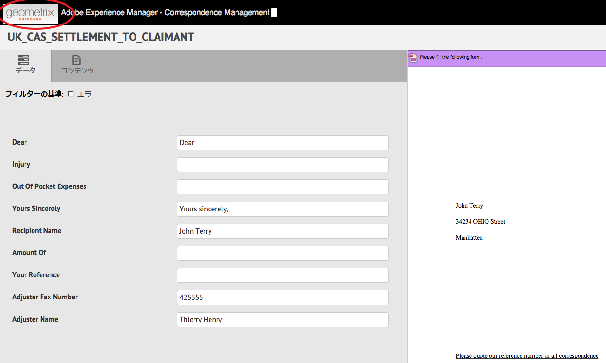
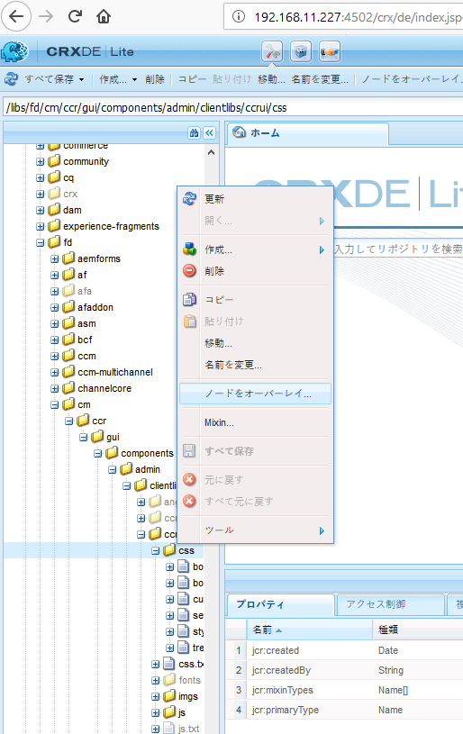
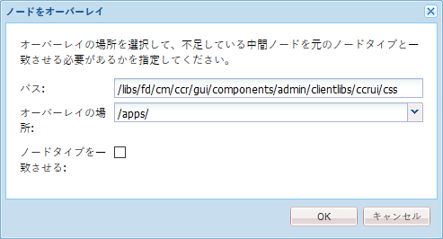
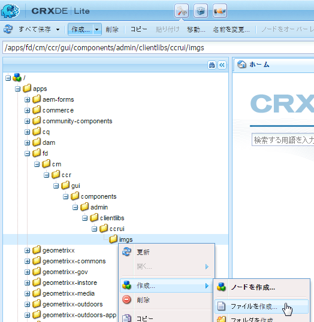
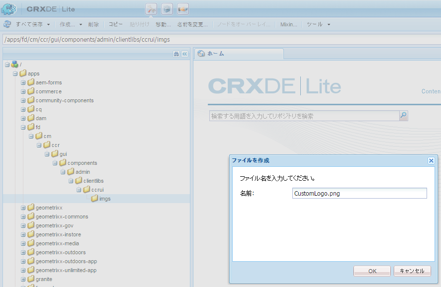
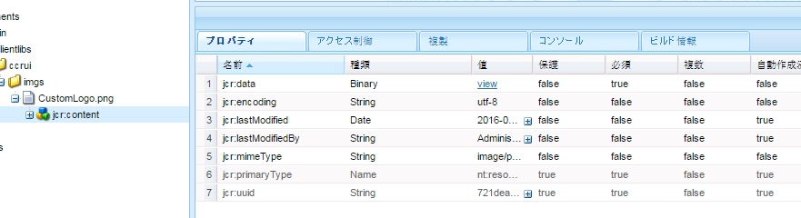

# 通信作成用 UI のカスタマイズ{#customize-create-correspondence-ui}

## 概要 {#overview}

Correspondence Management を使用すると、ソリューションテンプレートをリブランディングしてブランド価値を保持したり、組織のブランディング基準を統一したりするのに役立ちます。ユーザーインターフェイスのリブランドには、組織ロゴの変更も含まれます。ロゴは、通信作成用 UI の左上隅に表示されます。

通信作成用 UI に表示されるロゴは、組織のロゴと入れ替えることもできます。



通信作成用 UI に表示されたカスタムアイコン

### 通信作成用 UI に表示されるカスタムアイコンを変更する {#changing-the-logo-in-the-create-correspondence-ui}

カスタムロゴ画像を使用するには、次の手順を実行します。

1. Create the appropriate [folder structure in CRX](#creatingfolderstructure).
1. [CRXで作成したフォルダーに](#uploadlogo) 、新しいロゴファイルをアップロードします。

1. [CRXでCSSを設定し](#createcss) 、新しいロゴを参照します。
1. Clear the browser history and [refresh the Create Correspondence UI](#refreshccrui).

## 必要なフォルダ構造を作成する {#creatingfolderstructure}

カスタムロゴ用の画像やスタイルシートをホストするため、以下に説明するフォルダ構造を作成します。/apps ルートフォルダを持つ新しいフォルダ構造は、/libs フォルダ構造に類似しています。

何らかのカスタマイズを加える場合は、以下に説明するように、/apps ブランチに並列フォルダ構造を作成します。

/appsブランチ（フォルダー構造）:

* システムの更新時にそれらのファイルが消えても問題がないことを確認します。アップグレード、機能パック、またはホットフィックスの場合、/libsブランチが更新され、変更を/libsブランチでホストすると、変更が上書きされます。
* これは、現在の system/branch を保護するための機能です。このフォルダは、カスタムファイルのデフォルトの保存場所をそのまま使用した場合に、誤ってかき乱すおそれもあります。
* AEM がリソースを必要としている場合は、優先度が高くなるようリソースを調整してください。AEMは、最初に/appsブランチを検索し、次に/libsブランチを検索してリソースを検索するように設定されています。 このメカニズムにより、システムではユーザーのオーバーレイ（および、そこに定義されたカスタマイズ内容）を使用します。

次の手順を実行して、必要なフォルダ構造を /apps ブランチに作成します。

1. Go to `https://'[server]:[port]'/[ContextPath]/crx/de` and login as Administrator.
1. apps フォルダーにある defaultApp フォルダーを開き、名前「`css`」のフォルダを作成します。ここでのパスや構造は、ccrui フォルダ内の css フォルダーと類似しています。

   CSSフォルダーの作成手順：

   1. Right-click the **css** folder at the following path and select **Overlay Node**: `/libs/fd/cm/ccr/gui/components/admin/clientlibs/ccrui/css`

      

   1. ノードをオーバーレイダイアログに次の値が表示されていることを確認します。

      **パス：** /libs/fd/cm/ccr/gui/components/admin/clientlibs/ccrui/css

      **オーバーレイの場所：** /apps/

      **ノードタイプを一致：** チェック済み

      

      >[!NOTE]
      >
      >/libsブランチは変更しないでください。 次の操作を行った場合はこのブランチが変更されるため、各自で加えた変更はすべて失われます。
      >
      >    
      >    
      >    * インスタンス上でのアップグレード
      >    * ホットフィックスの適用
      >    * 機能パックのインストール


   1. 「**OK**」をクリックします。指定されたパスに、css フォルダが作成されます。


1. In the apps folder, create a folder named `imgs` with path/structure similar to the imgs folder (located in ccrui folder).

   1. Right-click the **imgs** folder at the following path and select **Overlay Node**: `/libs/fd/cm/ccr/gui/components/admin/clientlibs/ccrui/imgs`
   1. ノードをオーバーレイダイアログに次の値が表示されていることを確認します。

      **パス：** /libs/fd/cm/ccr/gui/components/admin/clientlibs/ccrui/imgs

      **オーバーレイの場所：** /apps/

      **ノードタイプを一致：** チェック済み

   1. 「**OK**」をクリックします。

      >[!NOTE]
      >
      >フォルダ構造は、/apps フォルダーに手動で作成することもできます。

1. 「**すべて保存**」をクリックして、サーバーに変更を保存します。

## CRX に新しいロゴをアップロードする {#uploadlogo}

CRX にカスタムロゴファイルをアップロードします。ロゴの描画には、標準的なHTML規則が適用されます。サポートされる画像ファイル形式は、AEM Formsへのアクセスに使用しているブラウザーに応じて異なります。 ただし、JPEG、GIF、および PNG は、すべてのブラウザでサポートされています。ブラウザでサポートされている画像形式の詳細は、ブラウザ固有のドキュメントを参照してください。

* ロゴ画像のデフォルトの大きさは 48×48 ピクセルです。画像はこのサイズに近いか、または 48×48 ピクセルよりも大きいことを確認してください。
* ロゴ画像の高さよりが 50 ピクセルを超えている場合、「通信作成用」のユーザーインターフェイスでは、ヘッダの高さである 50 ピクセルに合わせて画像を縮小表示します。画像を縮小表示する際も、「通信作成用」のユーザーインターフェイスでは画像の縦横比が維持されます。
* 画像が小さい場合、通信作成用ユーザーインターフェイスでは拡大表示されません。そのため、ロゴ画像をきれいに表示するには、高さが少なくとも 48 ピクセルあり、幅も十分にあるファイルを使用することが大切です。

以下の手順を実行して、CRX にカスタムロゴファイルをアップロードします。

1. `https://'[server]:[port]'/[contextpath]/crx/de` にアクセスします。必要に応じて、管理者としてログインします。
1. CRXDE から、次のパスにある **imgs** フォルダーを右クリックし、「**作成」／「ファイルを作成**」を選択します。

   `/apps/fd/cm/ccr/gui/components/admin/clientlibs/ccrui/imgs/`

   

1. 「ファイルを作成」ダイアログで、ファイルの名前「CustomLogo.png」（またはロゴファイルの名前）を入力します。

   

1. 「**すべて保存**」をクリックします。

   新しく作成したファイル（ここでは「CustomLogo.png」）の下にjcr:content のプロパティが表示されます。、

1. フォルダー構造内で、jcr:content をクリックします。

   jcr:content のプロパティが表示されます。

   

1. Double-click the **jcr:data** property.

   「Edit jcr:data」のダイアログが表示されます。

   次に、newlogo.pngフォルダーをクリックし、重複がjcr:content(dim option)をクリックして、タイプnt:resourceを設定します。 プロパティが表示されていない場合は、まず、名前が「jcr:content」のプロパティを作成します。

1. 「jcr:data の編集」ダイアログで「**参照**」をクリックし、ロゴとして使用する画像ファイルを選択します（ここでは、「CustomLogo.png」）。

   サポートされる画像ファイル形式は、AEM Formsへのアクセスに使用しているブラウザーに応じて異なります。 ただし、JPEG、GIF、および PNG は、すべてのブラウザでサポートされています。ブラウザでサポートされている画像形式の詳細は、ブラウザ固有のドキュメントを参照してください。

   

   例：CustomLogo.png をカスタムロゴとして使用する

1. 「**すべて保存**」をクリックします。

## CSS を作成し、UI にロゴを統合する {#createcss}

カスタムロゴ画像では、コンテンツコンテキストで追加のスタイルシートを読み込む必要があります。

ロゴの描画用スタイルシートを設定する手順は、以下のとおりです。

1. `https://'[server]:[port]'/[contextpath]/crx/de` にアクセスします。必要に応じて、管理者としてログインします。
1. 次の場所に、customcss.cssという名前のファイルを作成します（別のファイル名を使用することはできません）。

   `/apps/fd/cm/ccr/gui/components/admin/clientlibs/ccrui/css/`

   customcss.css ファイルの作成手順：

   1. 「**css**」フォルダーを右クリックし、「**作成」／「フォルダの作成**」を選択します。
   1. In the New File dialog, specify the name of the CSS as `customcss.css`(you cannot use a different filename), and click **OK**.
   1. 次のコードを、新しく作成した css ファイルに追加します。コード内の content:url にて、CRXDE の imgs フォルダにアップロードした画像の名前を指定します。

      ```css
      .logo, .logo:after {
      content:url("../imgs/CustomLogo.png");
      }
      ```

   1. 「**すべて保存**」をクリックします。

## 通信作成用 UI を更新し、にカスタムロゴを表示する {#refreshccrui}

ブラウザのキャッシュをクリアし、続けてブラウザから通信作成用 UI インスタンスを開きます。カスタムロゴが表示されます。


通信作成用 UI に表示されたカスタムアイコン

