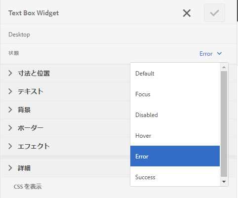

# アダプティブフォームのエラーメッセージのレイアウトと位置のカスタマイズ{#customize-layout-and-positioning-of-error-messages-of-an-adaptive-form}

アダプティブフォームのエラーメッセージのレイアウトと位置をカスタマイズできます。次をカスタマイズできます。

* 対応の CSS プロパティに変更を加えないでフィールドのキャプションの位置とレイアウトをカスタマイズ
* インラインエラーメッセージの位置をカスタマイズ
* 動的ヘルプインジケーターのコンテンツをカスタマイズ
* 対応の CSS プロパティに変更を加えないでフィールドコンポーネント（キャプション、ウィジェット簡単な説明、詳細な説明、ヘルプインジケーターのコンポーネント）の位置をカスタマイズ

## フィールドのレイアウトをカスタマイズ {#customize-layout-of-fields}

単位のフィールドまたはすべてのフィールドのレイアウトをカスタマイズして、キャプションやエラーメッセージの位置を変更できます。カスタムレイアウトをフィールドに適用するには、次の手順を実行します。

### 単一フィールドのレイアウトをカスタマイズ {#customize-layout-of-a-single-field}

カスタムレイアウトを単一フィールドに適用するには、次の手順を実行します。

1. **スタイル**&#x200B;モードでフォームを開きます。スタイルモードでフォームを開くには、ページツールバーで ／**スタイル**&#x200B;をタップしてください。
1. **フォームオブジェクト**&#x200B;の下のサイドバーで、フィールドを選択し、編集ボタン  をタップしてください。
1. カスタマイズするフィールドの状態を選択し、その状態のスタイル設定を指定します。

   

### フォームのすべてのフィールドのレイアウトをカスタマイズ {#customize-layout-of-all-the-fields-of-a-form}

AEM Forms では、テーマを作成してフォームに適用できるようになりました。テーマエディターにより、フォームコンポーネントのスタイル設定を 1 箇所で行うことができます。テーマを作成すると、コンポーネントレベルでスタイルを設定します。テーマの詳細については、「[AEM Forms におけるテーマ](../../forms/using/themes.md)」を参照してください。

テーマエディターを使用してテーマを作成し、フォームにおけるすべてのフィールドのレイアウトをカスタマイズします。テーマを作成するには、次の手順を実行します。

1. フォームを編集モードで開きます。

1. 編集モードで、コンポーネントを選択し、／**アダプティブフォームコンテナ**&#x200B;をタップしてから、  をタップします。
1. アダプティブフォームテーマのサイドバーで、テーマエディタで作成したテーマを選択します。

## カスタムフィールドレイアウトを作成 {#create-a-custom-field-layout}

1. CRXDE Lite を開きます。デフォルトの URL は https://&#39;[server]:[port]&#39;/crx/de です。
1. /libs/fd/af/layouts/field node からフィールドレイアウト（例えば、defaultFieldLayout）を /apps node（例えば、/apps/af-field-layout）にコピーします。
1. コピーしたノードの名前と defaultFieldLayout.jsp ファイルの名前を変更します。例えば、errorOnRight.jsp。 

1. コピーしたノードの qtip および jcr:description プロパティの値を変更します。例えば、プロパティの値を「Error On Right」に変更します。

1. 新しいスタイルおよび動作を追加するには、/etc ノードでクライアントライブラリを作成します。

   例えば、/etc/af-field-layout-clientlib で、ノード client-library を作成します。値 af.field.errorOnRight を持つカテゴリプロパティと次のコードを持つ style.less ファイルを追加します。 

   ```css
   .widgetErrorWrapper {
   
    height: 38px;
    margin: 5px;
   
    .guideFieldWidget{
    width: 60%;
    float: left; 
    }
   
    .guideFieldError{
    overflow:hidden;
    width:40%; 
    }
   
   }
   ```

1. 外観と動作を向上するには、レイアウトファイル内で作成したクライアントライブラリを含めます（errorOnRight.jsp）。
1. フィールドの編集ダイアログを開き、「**スタイル**」タブを選択します。「**フィールドレイアウトを設定**」ドロップダウンボックスで、新しく作成したレイアウトを選択し、「**OK**」をクリックします。

ErrorOnRight.zip パッケージには、フィールドの右側にエラーメッセージを表示するコードが含まれます。

[ファイルを入手](assets/erroronright.zip)
