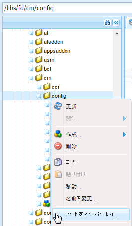
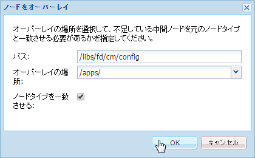
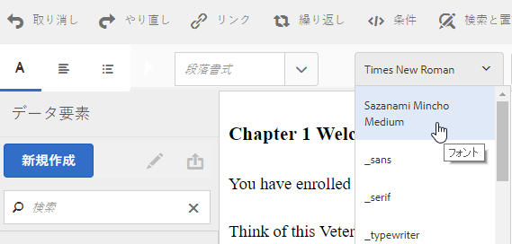

# テキストエディターのカスタマイズ{#customize-text-editor}

## 概要 {#overview}

アセットを管理 UI と通信を作成 UI でテキストエディターをカスタマイズし、フォントおよびフォントサイズを追加することができます。日本語フォントなど英語以外のフォントも使用できます。

フォント設定のカスタマイズで以下の変更を行うことができます。

* フォントファミリーとサイズ
* 高さ、文字間隔などのプロパティ
* フォントファミリーとサイズ、高さ、文字間隔、日付形式のデフォルト値
* 箇条書きのインデント

これを行うには、以下の手順を実行します。

1. [CRX の tbxeditor-config.xml ファイルを編集しフォントをカスタマイズ](#customizefonts)
1. [クライアントコンピューターへのカスタムフォントの追加](#addcustomfonts)

## CRX の tbxeditor-config.xml ファイルを編集しフォントをカスタマイズ {#customizefonts}

tbxeditor-config.xmlファイルを編集してフォントをカスタマイズするには、次の手順を実行します。

1. Go to `https://'[server]:[port]'/[ContextPath]/crx/de` and login as Administrator.
1. 次の手順を使用して、appsフォルダーに、configフォルダー(libs/fd/cm/config)に類似したパス/構造でconfigという名前のフォルダーを作成します。

   1. Right-click the items folder at the following path and select **Overlay Node**:

      `/libs/fd/cm/config`

      

   1. ノードをオーバーレイダイアログに次の値が表示されていることを確認します。

      **パス：** /libs/fd/cm/config

      **場所：** /apps/

      **ノードタイプを一致：** 選択

      

   1. 「**OK**」をクリックします。apps フォルダーにフォルダー構造が作成されます。

   1. 「**すべて保存**」をクリックします。

1. 次の手順を使って、新しく作成された config フォルダーに tbxeditor-config.xml ファイルのコピーを作成します。

   1. libs/fd/cm/config にある tbxeditor-config.xml ファイルを右クリックし、「**コピー**」を選択します。
   1. 以下のフォルダーを右クリックし「**貼り付け**」を選択します。

      `apps/fd/cm/config`

   1. 貼り付けたファイルの名前は、デフォルトでは、「ファイル名を」に `copy of tbxeditor-config.xml.` 変更し、「すべて保存」 `tbxeditor-config.xml` をクリ **ックします**。

1. apps/fd/cm/configにあるtbxeditor-config.xmlファイルを開き、必要な変更を行います。

   1. apps/fd/cm/configにあるtbxeditor-config.xmlファイルを重複してクリックします。 ファイルが開きます。

      ```xml
      <editorConfig>
         <bulletIndent>0.25in</bulletIndent>
      
         <defaultDateFormat>DD-MM-YYYY</defaultDateFormat>
      
         <fonts>
            <default>Times New Roman</default>
            <font>_sans</font>
            <font>_serif</font>
            <font>_typewriter</font>
            <font>Arial</font>
            <font>Courier</font>
            <font>Courier New</font>
            <font>Geneva</font>
            <font>Georgia</font>
            <font>Helvetica</font>
            <font>Tahoma</font>
            <font>Times New Roman</font>
            <font>Times</font>
            <font>Verdana</font>
         </fonts>
      
         <fontSizes>
            <default>12</default>
            <fontSize>8</fontSize>
            <fontSize>9</fontSize>
            <fontSize>10</fontSize>
            <fontSize>11</fontSize>
            <fontSize>12</fontSize>
            <fontSize>14</fontSize>
            <fontSize>16</fontSize>
            <fontSize>18</fontSize>
            <fontSize>20</fontSize>
            <fontSize>22</fontSize>
            <fontSize>24</fontSize>
            <fontSize>26</fontSize>
            <fontSize>28</fontSize>
            <fontSize>36</fontSize>
            <fontSize>48</fontSize>
            <fontSize>72</fontSize>
         </fontSizes>
      
         <lineHeights>
            <default>2</default>     
            <lineHeight>2</lineHeight>
            <lineHeight>3</lineHeight>
            <lineHeight>4</lineHeight>
            <lineHeight>5</lineHeight>
            <lineHeight>6</lineHeight>
            <lineHeight>7</lineHeight>
            <lineHeight>8</lineHeight>
            <lineHeight>9</lineHeight>
            <lineHeight>10</lineHeight>
            <lineHeight>11</lineHeight>
            <lineHeight>12</lineHeight>
            <lineHeight>13</lineHeight>
            <lineHeight>14</lineHeight>
            <lineHeight>15</lineHeight>
            <lineHeight>16</lineHeight>
         </lineHeights>
      
         <letterSpacings>
            <default>0</default>
            <letterSpacing>0</letterSpacing>
            <letterSpacing>1</letterSpacing>
            <letterSpacing>2</letterSpacing>
            <letterSpacing>3</letterSpacing>
            <letterSpacing>4</letterSpacing>
            <letterSpacing>5</letterSpacing>
            <letterSpacing>6</letterSpacing>
            <letterSpacing>7</letterSpacing>
            <letterSpacing>8</letterSpacing>
            <letterSpacing>9</letterSpacing>
            <letterSpacing>10</letterSpacing>
            <letterSpacing>11</letterSpacing>
            <letterSpacing>12</letterSpacing>
            <letterSpacing>13</letterSpacing>
            <letterSpacing>14</letterSpacing>
            <letterSpacing>15</letterSpacing>
            <letterSpacing>16</letterSpacing>
         </letterSpacings>
      </editorConfig>
      ```

   1. ファイルに必要な変更を加え、フォント設定で次の設定を変更します。

      * フォントファミリーとサイズの追加または削除
      * 高さ、文字間隔などのプロパティ
      * フォントファミリーとサイズ、高さ、文字間隔、日付形式のデフォルト値
      * 箇条書きのインデント
      例えば、Sazanami Mincho Medium という名前の日本語フォントを追加するには  XMLファイル： `<font>Sazanami Mincho Medium</font>`. また、このフォントを、フォントのカスタマイズにアクセスして使用するクライアントコンピューターにインストールする必要があります。 詳しくは、「[クライアントコンピューターへのカスタムフォントの追加](#addcustomfonts)」を参照してください。

      また、テキストの様々な要素のデフォルトを変更したり、エントリを削除して、テキストエディターからフォントを削除したりすることもできます。

   1. 「**すべて保存**」をクリックします。


## クライアントコンピューターへのカスタムフォントの追加 {#addcustomfonts}

Correspondence Management テキストエディターに格納されたフォントにアクセスする際、Correspondence Management へアクセスするクライアントマシンにそのフォントがある必要があります。テキストエディターでカスタムフォントを使用するには、まずクライアントマシンに同じフォントをインストールする必要があります。

フォントのインストールについて詳しくは、次を参照してください。

* [フォントをインストールまたはアンインストールする](https://windows.microsoft.com/en-us/windows-vista/install-or-uninstall-fonts)
* [Mac ハンドブック：Font Book](https://support.apple.com/en-us/HT201749)

## カスタマイズしたフォントへのアクセス {#access-font-customizations}

CRXのtbxeditor-config.xmlファイルのフォントに変更を加え、AEM Formsへのアクセスに使用するクライアントマシンに必要なフォントをインストールすると、テキストエディターに変更が反映されます。

For example, the Sazanami Mincho Medium font added in the [Customize fonts by editing the tbxeditor-config.xml file in CRX](#customizefonts) procedure appears in the text editor UI as following:



>[!NOTE]
>
>テキストを日本語で表示するには、まず日本語の文字でテキストを入力する必要があります。カスタムの日本語フォントを適用すると、テキストは特定の形式のみで表示されます。カスタムの日本語フォントを適用しても英語やその他の言語の文字が日本語の文字に変更されることはありません。

