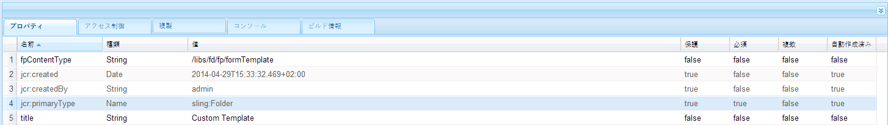

# フォームポータルコンポーネントのテンプレートをカスタマイズする{#customizing-templates-for-forms-portal-components}

## 前提条件 {#prerequisites}

[フォームメタデータの管理](../../forms/using/manage-form-metadata.md)

HTML および CSS の実用的な知識

## 概要 {#overview}

AEM Forms ユーザーインターフェイスでは、すべてのフォームにメタデータを追加することができます。カスタムメタデータは、組織のフォームを展開・検索する際のユーザーの利便性を高めます。

フォームポータルを使用すると、フォームリストにカスタムメタデータを使用することができます。アセットのカスタムテンプレートの作成中に、レイアウトを変更して、カスタムメタデータを CSS スタイルセットと使うことができます。

次のステップを実行して、様々なフォームポータルコンポーネントのカスタムテンプレートを作成します。

## カスタムテンプレートの作成 {#creating-a-nbsp-custom-template}

1. /appsの下にsling:Folderノードを作成します

   &quot;fpContentType&quot; プロパティを追加カスタムテンプレートを設定しようとしているコンポーネントに応じてプロパティの適切な値を指定します。

   * Search &amp; Lister コンポーネント：&quot;/libs/fd/fp/formTemplate&quot;
   * ドラフト&amp;送信コンポーネント：

      * ドラフトセクション：/libs/fd/fp/draftsTemplate
      * 送信セクション：/libs/fd/fp/submissionsTemplate
   * Link コンポーネント：&quot;/libs/fd/fp/formTemplate&quot;

   レイアウトテンプレートを選択する際に表示したいタイトルを追加します。

   >[!NOTE]
   >
   >タイトルは、作成したsling:Folderのノード名とは異なる場合があります。

   次の画像は、Search &amp; Listerコンポーネントの構成を示します。
   

1. このフォルダー内に template.html ファイルを作成して、カスタムテンプレートとして使用します。
1. 以下のようにカスタムテンプレートを作成して、カスタムメタデータを使用します。

## 作業の例 {#working-example}

以下は、フォームポータルが、Search &amp; Lister コンポーネントの Geometrixx Gov カードのレイアウトを取得したカスタムテンプレートの実装例です。

```html
<div class="__FP_boxes-container __FP_single-color">
    <div class="boxes __FP_boxes __FP_single-color" data-repeatable="true">
 <div class="__FP_boxes-thumbnail">
     
        </div>
        <h3 class="__FP_single-color" title="${name}" tabindex="0">${name}</h3>
        <p>${description}</p>
        <div class="boxes-icon-cont __FP_boxes-icon-cont">
            <div class="op-dow">
                <a href="${formUrl}" target="_blank" class="__FP_button ${htmlStyle}" title="${config-htmlLinkText}">${localize-Apply}</a>
                <a href="${pdfUrl}" class="__FP_button ${pdfStyle}" title="${config-pdfLinkText}">${localize-Download}</a>
            </div>
        </div>
    </div>
</div>
```

## カスタムテンプレートの技術仕様 {#technical-specifications-for-custom-templates}

すべてのFormsポータルコンポーネントのカスタムテンプレートには、繰り返し可能なエントリと繰り返し不可能なエントリが含まれています。 繰り返し可能なエントリは、リスト表示の基本エンティティです。Search &amp; Lister、ドラフト&amp;提出および Link コンポーネントなどが繰り返し可能なエントリの例です。

フォームポータルは、プレースホルダに構文を提供してカスタム /OOTB メタデータを表示します。プレースホルダは、フォーム、ドラフトまたは提出の結果を表示した後に追加されます。

To include a repeatable entry, configure the value of the attribute **data-repeatable** to **true**.

説明した例では、２つのDiv要素はカスタムテンプレートの一番上に存在します。*最初に、&quot;__FP_boxes-container&quot; CSSクラスで、リストされているフォームのコンテナエレメントとして機能します。2番目に、&quot;__FP_boxes&quot; CSSクラスで基本エンティティのテンプレート、この場合フォームになります。The **data-repeatable**attribute present in the Div element has the value **true**.*

それぞれのプレースホルダーには 1 つずつ OOTB メタデータセットがあります.To display custom metadata at a particular place on the form, add the **${metadata_prop} property** at the place.

*この例では、メタデータプロパティは複数のインスタンスで使用されています。For example, it is used in **description**,**name**,**formUrl**,**htmlStyle**,**pdfUrl**,**pdfStyle**, and **path**in the prescribed manner.*

## デフォルトのボックスメタデータ {#out-of-the-box-metadata}

様々なフォームポータルコンポーネントは、リスト表示に使える排他的な OOTB メタデータのセットを提供します。

### Search &amp; Lister コンポーネント {#search-amp-lister-component}

* **タイトル：**&#x200B;フォームのタイトル
* **名前**：フォーム名（多くの場合、タイトルと同じです）
* **説明**：フォームの説明
* **formUrl**: フォームをHTMLとしてレンダリングするURL
* **pdfUrl**: フォームをPDFとしてレンダリングするURL
* **アセットタイプ**：アセットの種類Valid values include **Form**,**PDF Form**, **Print Form**, and **Adaptive Form**

* **htmlStyle**&amp; **pdfStyle**：HTML の表示スタイルと PDF アイコンはそれぞれレンダリングに使用されています。有効な値は、「**__FP_display_none**」または空白です。

>[!NOTE]
>
>カスタムスタイルシートでは、__FP_display_noneクラスを必ず使用してください。

* **downloadUrl**: アセットをダウンロードするURL。

ローカリゼーション、ソート、ユーザーインターフェイス上での設定プロパティ使用のサポート（Search &amp; Lister のみ）:

1. **ローカライゼーションサポート**: スタティックテキストをローカライズするには、属性を使用し `${localize-YOUR_TEXT}` 、ローカライズされた値が存在しない場合は、値を使用可能にします。
   *説明した例では、属性`${localize-Apply}``${localize-Download}`と属性は、「Apply」と「Download」のテキストをローカライズするために使用されます。*

1. **ソートのサポート**：HTML要素をクリックして検索結果をソートします。テーブルレイアウトでのソートを実行するには、特定のテーブルヘッダーに&quot;data-sortKey&quot; 属性を追加します。さらに、ソートしたいメタデータとしてその値を加えます。例えば、グリッド表示の「タイトル」ヘッダーでは、「data-sortKey」ヘッダーの値が「タイトル」 です。見出しをクリックして、特定の列の値を並べ替えます。

1. **設定プロパティの使用**：Search &amp; Listerコンポーネントには、ユーザーインターフェイスに使える設定がいくつかあります。For example, to display HTML ToolTip text saved through the edit dialog, use the `${config-htmlLinkText}` attribute. **同様に、PDFツールヒントテキストにも**`${config-pdfLinkText}` 、属性を使用します。

### リンクコンポーネント {#link-component}

* **タイトル：**&#x200B;フォームのタイトル
* **formUrl**: フォームをHTMLとしてレンダリングするURL
* **ターゲット**：リンクのターゲット属性有効な値は、“_blank” および “_self”。
* **linkText**：リンクキャプション

### ドラフト&amp;送信コンポーネント:{#drafts-amp-submissions-component}

* **パス**：ドラフト / 送信メタデータノードのパスドラフトまたは送信を開くためのURLとして、このファイルを.HTML拡張子と共に使用します。
* **contextPath**：AEM インスタンスのコンテキストパス
* **firstLetter**：ドラフトとして保存または送信されたアダプティブフォームのタイトルの最初の文字（大文字）
* **formName**：ドラフトとして保存または送信されたアダプティブフォームのタイトル
* **draftID**：リストされたドラフトの ID（ドラフトセクションのテンプレートにおいてのみ使用）
* **submitID**：リストされた送信の ID（送信セクションのテンプレートにおいてのみ使用）
* **ステータス**：送信されたフォームのステータス（送信セクションのテンプレートにおいてのみ使用）
* **説明**：ドラフトまたは送信に関するアダプティブフォームの説明
* **diffTime**：現在の時刻と最後にドラフトが保存された時刻との差。または、現在の時刻と送信するために最後の送信操作が行われた時刻との差。
* **iconClass**：ドラフト/送信の最初の文字を表示するのに使用される CSS クラス。フォームポータルには、様々な色の背景を提供する以下のクラスがあります。
* **所有者**：ドラフト / 送信を作成したユーザー。
* **今日**：DD:MM:YYYY 形式のドラフト作成日または送信日。
* **TimeNow**：HH:MM:SS24 時間形式のドラフト作成日または送信日。

*注意：*

1. ドラフト&amp;送信コンポーネントの下のドラフトセクションにある削除のオプションについては、CCS クラスを &quot;__FP_deleteDraft&quot; と名付けます。In addition, include the attribute &quot;draftID&quot; with the value **${draftID}**, which is the draft id of corresponding draft.

1. While creating links to open drafts and submissions, you can specify **${path}.html** as the value of the **href** attribute for the anchor tag.


**A**. コンテナ素子

**B.** 固定階層を持つ「パス」メタデータ。各フォームに保存されたサムネールを取得します。

**C.** Data-repeatable属性を各フォームのテンプレートセクションに使用

**D.** &quot;Apply&quot;文字列をローカライズするには

**E.** pdfLinkText設定プロパティの使用

**F.** &quot;pdfUrl&quot;メタデータの使用

## ヒント、テクニックおよび既知の問題 {#tips-tricks-and-known-issues}

1. カスタムテンプレートでは一重引用符（‘）を使用しないでください。
1. For custom metadata, store this property on the **jcr:content/metadata** node only. 他の場所に保存すると、Formsポータルはメタデータを表示できません。
1. すべてのカスタムメタデータまたは既存のメタデータの名前にコロン（:）が含まれていないことを確認してください。含まれている場合、ユーザーインターフェイスに表示することができません。
1. **data-repeatable** は、 **Link** コンポーネントに対して何の意味も持ちません。 アドビシステムズ社は、お客様がこのプロパティのリンクコンポーネントのテンプレートにおける使用を避けることを推奨します。

## 関連記事

* [フォームポータルコンポーネントの有効化](/help/forms/using/enabling-forms-portal-components.md)
* [フォームポータルページの作成](/help/forms/using/creating-form-portal-page.md)
* [API を使用した Web ページ上のフォームの一覧表示](/help/forms/using/listing-forms-webpage-using-apis.md)
* [ドラフトと送信コンポーネントの使用](/help/forms/using/draft-submission-component.md)
* [ドラフトと送信済みフォームのストレージのカスタマイズ](/help/forms/using/draft-submission-component.md)
* [ドラフトと送信コンポーネントとデータベースの統合のサンプル](/help/forms/using/integrate-draft-submission-database.md)
* [フォームポータルコンポーネントのテンプレートをカスタマイズする](/help/forms/using/customizing-templates-forms-portal-components.md)
* [ポータル上のフォーム発行の概要](/help/forms/using/introduction-publishing-forms.md)