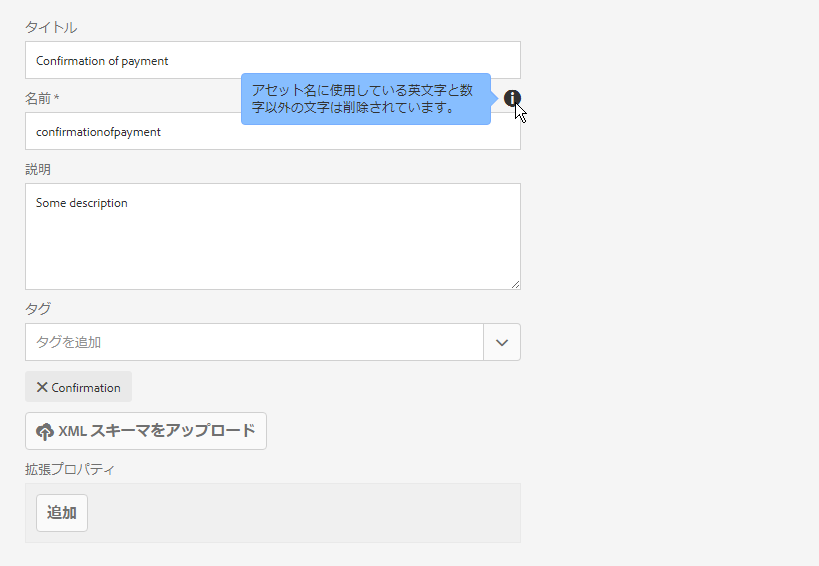
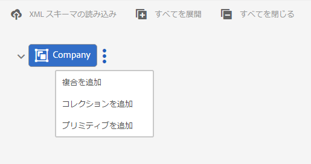
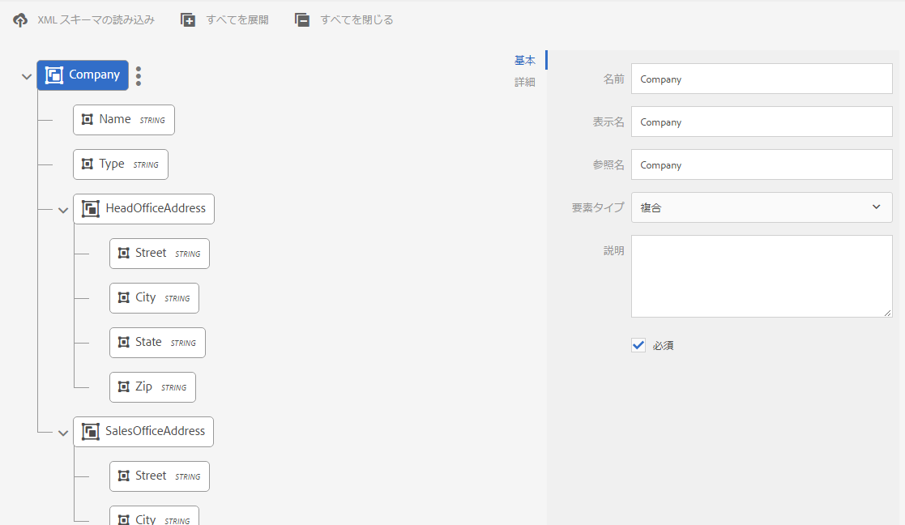
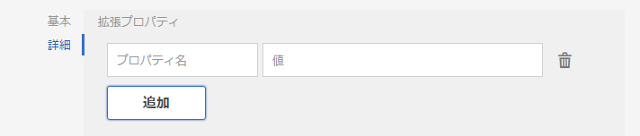
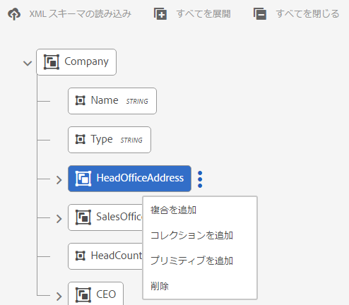
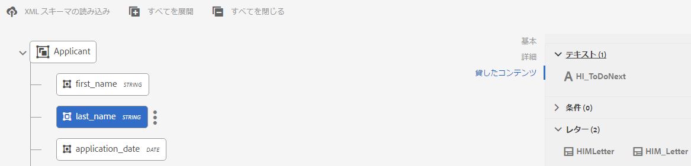

# データディクショナリ{#data-dictionary}

## 概要 {#introduction}

ビジネスユーザーはデータディクショナリを介すことで、バックエンドデータソースの情報を使用できます。基礎となるデータモデルの技術的な詳細情報を把握する必要はありません。データディクショナリは複数のデータディクショナリ要素（DDE）で構成されています。これらのデータ要素を使用して、バックエンドデータを（顧客対応に使用する入力として）レターに統合します。

データディクショナリは、基礎となるデータ構造とその関連する属性を説明するメタデータの独立した表現です。データディクショナリはビジネス用語を使用して作成されます。また、基礎となるデータモデルの 1 つまたは複数にマッピングできます。。

データディクショナリは、単純要素、複合要素、コレクション要素という 3 種類の要素から構成されます。単純 DDE は、都市名などの情報を保持する文字列、数値、日付、Boolean 値などのプリミティブ要素です。複合 DDE は他の DDE を含むものであり、そのタイプはプリミティブ、複合、コレクションのいずれでもかまいません。例として、郵便番号、国、都道府県、市町村、番地で構成される住所が挙げられます。コレクションは、同類の単純 DDE または複合 DDE のリストです。例として、複数の住所や、請求先と出荷先の住所が異なる顧客が挙げられます。

Correspondence Managementは、バックエンド、顧客、または受信者固有のデータを、データディクショナリの構造に従って保存し、様々な顧客向けの通信を作成します。 例えば、ドキュメントの作成時には「{First Name} さん」や「{姓}&quot;.

一般のビジネスユーザーにとって、XSD（xml スキーマ）や Java クラスといった、メタデータ表現に関する知識は必要ありません。しかし、通常はソリューションを構築するために、これらのデータ構造や属性の利用が必要となります。

### データディクショナリワークフロー {#data-dictionary-workflow}

1. 作成者が[データディクショナリを作成](#createdatadictionary)します。作成には、スキーマを読み込むか、または新規に作成します。
1. 作成者はデータディクショナリに基づいてレターとインタラクティブコミュニケーションを作成し、レターとインタラクティブコミュニケーションのデータディクショナリ要素を必要な箇所に関連付けます。
1. 作成者はダウンロードデータの XML ファイルを書き出すことができます。これはデータディクショナリのスキーマに基づいたものです。作成者はサンプルデータのXMLファイルを変更できます。このファイルはテストデータとしてデータディクショナリに関連付けることができます。 レターのプレビューでも同様の操作が可能です。
1. [レターのプレビュー](../../forms/using/create-letter.md#p-types-of-linkage-available-for-each-of-the-fields-p)時に、作成者はレターをデータと共にプレビューすることができます（「カスタムプレビュー」）。レターが開き、作成者が提供したデータが事前入力されます。 通信を作成インターフェイスで開きます。このレターをプレビューしているエージェントは、このレターの内容、データ、および添付ファイルを変更し、最終的なレターを送信できます。 レターの作成に関する詳細は、「[通信の作成](../../forms/using/create-letter.md)」を参照してください。

## 前提条件 {#prerequisite}

Install the [Compatibility Package](compatibility-package.md) to view the **Data Dictionaries** option on the **Forms** page.

## データディクショナリの作成 {#createdatadictionary}

データディクショナリの作成にはデータディクショナリエディターを使用します。または、XSD スキーマファイルをアップロードしてデータディクショナリを作成することができます。後からフィールドなどの必須の情報をさらに追加して、このデータディクショナリを拡張できます。データディクショナリの作成方法を問わず、ビジネスプロセスの所有者にはバックエンドシステムに関する知識は必要がありません。ビジネスプロセスの所有者に必要とされるのは、プロセスのドメインオブジェクトとその宛先に関する知識だけです。

>[!NOTE]
>
>類似した要素を必要とするレターが複数存在する場合は、共通データディクショナリを作成することができます。ただし、多数の要素が含まれているサイズの大きなデータディクショナリを作成すると、そのデータディクショナリを使用する場合や、レターやドキュメントフラグメントなどの要素を読み込む場合に、パフォーマンスが低下する可能性があります。パフォーマンスに関する問題が発生した場合は、レターごとに個別のデータディクショナリを作成してください。

1. **フォーム**／**データディクショナリ**&#x200B;を選択します。
1. Tap **Create Data Dictionary**.
1. プロパティ画面で以下を追加します。

   * **タイトル：** （オプション）データディクショナリのタイトルを入力します。 タイトルは一意である必要はなく、特殊文字や英語以外の文字を含めることもできます。レターなどのドキュメントフラグメントは、タイトル（利用可能な場合）を用いて参照されます。タイトルは、サムネイルやアセットプロパティなどで使用されます。データディクショナリは、名前ではなく、タイトルで参照されます。
   * **名前**：データディクショナリの一意の名前。「名前」フィールドでは、英数字およびハイフンのみ使用できます。「名前」フィールドは、タイトルフィールドに基づいて自動的に入力されます。「タイトル」フィールドに入力された特殊文字、スペース、および英数字以外の文字はハイフンに置き換えられます。「タイトル」フィールドの値は「名前」フィールドに自動的にコピーされますが、値を編集することもできます。

   * **説明**: （オプション）データディクショナリの説明。
   * **タグ：** （オプション）カスタムタグを作成するには、テキストフィールドに値を入力し、Enterキーを押します。 タグのテキストフィールドの下にカスタムタグが表示されます。このテキストを保存すると、新しく追加したタグも作成されます。
   * **拡張プロパティ**: （オプション）「 **追加フィールド** 」をタップして、データディクショナリのメタデータ属性を指定します。 「プロパティ名」列に、固有のプロパティ名を入力します。「値」列に、プロパティに関連付ける値を入力します。

   

1. (Optional) To upload an XSD schema definition for your data dictionary, under the Data Dictionary Structure pane, tap **Upload XML Schema**. Browse to XSD file, select it, and tap **Open**. データディクショナリは、アップロードされた XML スキーマに基づいて作成されます。データディクショナリで要素の表示名や説明を調整する必要があります。これを行うには、要素の名前をタップして選択し、右側のペインのフィールドで説明、表示名、およびその他の詳細を編集します。

   For more information on Computed DD Elements, see [Computed Data Dictionary Elements](#computedddelements).

   >[!NOTE]
   >
   >ユーザーインターフェイスを使用することで、スキーマファイルのアップロアー度をスキップして、新規でデータディクショナリを構築することもできます。新規で構築するには、この手順をスキップし次の手順に進みます。

1. 「**次へ**」をタップします。
1. 「プロパティの追加」画面でデータディクショナリに要素を追加します。また、データディクショナリの基本構造を取得するためにスキーマをアップロードするとことで、要素の追加・削除や、詳細を編集することができます。

   要素の右側の 3 つのドットをタップし、データディクショナリの構造に要素を追加することができます。

   

   「複合要素」、「コレクション要素」または「プリミティブ要素」を選択します。

   * 複合 DDE は他の DDE を含むものであり、そのタイプはプリミティブ、複合、コレクションのいずれでも構いません。例として、郵便番号、国、都道府県、市町村、番地で構成される住所が挙げられます。
   * プリミティブ DDE は、文字列、数値、日付などの要素のほか、都市名などの情報を保持する Boolean 値です。
   * コレクションは、同類の単純 DDE または複合 DDE のリストです。例として、複数の住所や、請求先と出荷先の住所が異なる顧客が挙げられます。

   次に、データディクショナリ作成の例を示します。

   * データディクショナリ内のトップレベル DDE として使用できるのは、複合タイプのみです。
   * 名前、参照名および要素タイプは、データディクショナリおよびDDEに対して必須のフィールドです。
   * 参照名は一意にする必要があります。
   * 親 DDE（複合）には、同じ名前の 2 つの子を指定できません。
   * 列挙型には、プリミティブな String 型のみが含まれます。

   For more information on Composite, Collection, and Primitive elements and working with data dictionary elements, see [Mapping Data Dictionary Elements to XML Schema](#mappingddetoschema).

   For information on validations in Data Dictionary, see [Data Dictionary Editor validations](#ddvalidations).

   

1. （オプション）要素を選択後に、「詳細設定」タブでプロパティ（属性）を追加できます。You can also tap **Add Field** and extend the properties of a DD element.

   

1. (Optional) You can remove any element by tapping the three dots on the right side of an element and selecting **Delete**.

   

   >[!NOTE]
   >
   >子ノードを持つ複合要素またはコレクション要素を削除すると、その子ノードも削除されます。

1. （オプション）データディクショナリの構造ペインの要素を選択し、フィールドと変数リストパネルで、要素に関連する必要な属性を変更または追加します。
1. 「**保存**」をタップします。

### 1 つ以上のデータディクショナリのコピー作成 {#create-copies-of-one-or-more-data-dictionary}

既存のデータディクショナリをコピーして貼り付けることにより、そのデータディクショナリに類似するプロパティやコンテンツを持つ 1 つ以上のデータディクショナリを、すばやく作成することができます。

1. データディクショナリのリストで、目的のデータディクショナリを選択します。UI に「コピー」アイコンが表示されます。
1. 「コピー」をタップします。UI に「貼り付け」アイコンが表示されます。
1. 「貼り付け」をタップします。貼り付けダイアログが表示されます。システムにより、新しいデータディクショナリに名前とタイトルが自動的に割り当てられます。
1. 必要に応じて、保存するデータディクショナリのタイトルと名前を編集します。
1. 「貼り付け」をタップします。データディクショナリのコピーが作成されます。これで、新しく作成したデータディクショナリに必要な変更を加えることができます。

## データディクショナリ要素を参照するドキュメントフラグメントまたは文書を確認する {#see-the-document-fragments-or-documents-that-refer-to-a-data-dictionary-element}

データディクショナリの編集中または表示中は、データディクショナリ内のどの要素が、どのテキスト、条件、レター、インタラクティブ通信に参照されているか確認できます。

1. データディクショナリを編集するには、次のいずれかの操作を行います。

   * データディクショナリの上にカーソルを置き、「編集」をタップします。
   * データディクショナリを選択し、ヘッダーにある「編集」をタップします。
   * データディクショナリの上にカーソルを置き、「選択」をタップします。その後、ヘッダーにある「編集」をタップします。

   または、データディクショナリをタップして表示します。

1. データディクショナリ内では、単純型要素をタップして選択します。複合要素とコレクション要素には参照元がありません。

   要素の基本プロパティ、詳細プロパティと共に「貸したコンテンツ」が表示されます。

1. 「貸したコンテンツ」をタップします。

   「貸したコンテンツ」タブでは、テキスト、条件、レター、インタラクティブ通信が表示されます。それぞれの見出しには、選択した要素の参照数も表示されます。

1. 要素を参照するアセットについて、見出しをタップして名前を確認します。

   

1. 貸したコンテンツや他の要素を表示するには、要素をタップします。
1. 要素を参照するアセットを表示するには、独自の名前をタップします。アセット、レターまたはインタラクティブ通信がブラウザーに表示されます。

## テストデータの操作 {#working-with-test-data}

1. On the Data Dictionaries page, tap **Select**.
1. Tap a data dictionary for which you want to download test data and then tap **Download Sample XML Data**.
1. Tap **OK** in the alert message. XMLファイルがダウンロードされます。
1. XML ファイルを Notepad その他の XML エディタで開きます。XML ファイルは、データディクショナリおよび要素内のプレースホルダー文字列と同じ構造を持っています。レターのテストに使うデータでプレースホルダー文字列を置き換えます。

   ```xml
   <?xml version="1.0" encoding="UTF-8" standalone="no"?>
   <Company>
   <Name>string</Name>
   <Type>string</Type>
   <HeadOfficeAddress>
   <Street>string</Street>
   <City>string</City>
   <State>string</State>
   <Zip>string</Zip>
   </HeadOfficeAddress>
   <SalesOfficeAddress>
   <Street>string</Street>
   <City>string</City>
   <State>string</State>
   <Zip>string</Zip>
   </SalesOfficeAddress>
   <HeadCount>1.0</HeadCount>
   <CEO>
   <PersonName>
   <FirstName>string</FirstName>
   <MiddleName>string</MiddleName>
   <LastName>string</LastName>
   </PersonName>
   <DOB>string</DOB>
   <CurrAddress>
   <Street>string</Street>
   <City>string</City>
   <State>string</State>
   <Zip>string</Zip>
   </CurrAddress>
   <DOJ>14-04-1973</DOJ>
   <Phone>1.0</Phone>
   </CEO>
   </Company>
   ```

   >[!NOTE]
   >
   >この例では、XMLはコレクション要素の3つの値にスペースを作成しますが、値の数は必要に応じて増減できます。

1. データエントリの作成後は、テストデータを含むレターをプレビューする際に、この XML ファイルを使用することができます。

   このテストデータはDD（「DD」を選択し、「テストデータをアップロード」をタップして、このxmlファイルをアップロードします）で追加できます。その後、レターが通常（カスタムではない）プレビューされ、このXMLデータがレターで使用されます。 「カスタム」をタップして、この XML をアップロードすることもできます。

## サンプル {#samples}

データディクショナリ実装の詳細コードサンプルを以下に示します。

### データディクショナリにアップロード可能なサンプルスキーマ {#sample-schema-that-can-be-uploaded-to-the-data-dictionary}

```xml
<?xml version="1.0" encoding="utf-8"?>
<xs:schema xmlns="DCT" targetNamespace="DCT" xmlns:xs="https://www.w3.org/2001/XMLSchema"
  elementFormDefault="qualified" attributeFormDefault="unqualified">
  <xs:element name="Company">
    <xs:complexType>
      <xs:sequence>
        <xs:element name="Name" type="xs:string"/>
        <xs:element name="Type" type="xs:anySimpleType"/>
        <xs:element name="HeadOfficeAddress" type="Address"/>
        <xs:element name="SalesOfficeAddress" type="Address" minOccurs="0"/>
        <xs:element name="HeadCount" type="xs:integer"/>
        <xs:element name="CEO" type="Employee"/>
        <xs:element name="Workers" type="Employee" maxOccurs="unbounded"/>
      </xs:sequence>
    </xs:complexType>
  </xs:element>
  <xs:complexType name="Employee">
    <xs:complexContent>
      <xs:extension  base="Person">
        <xs:sequence>
          <xs:element name="CurrAddress" type="Address"/>
          <xs:element name="DOJ" type="xs:date"/>
          <xs:element name="Phone" type="xs:integer"/>
        </xs:sequence>
      </xs:extension>
    </xs:complexContent>
  </xs:complexType>
  <xs:complexType name="Person">
    <xs:sequence>
      <xs:element name="PersonName" type="Name"/>
      <xs:element name="DOB" type="xs:dateTime"/>
    </xs:sequence>
  </xs:complexType>
  <xs:complexType name="Name">
    <xs:sequence>
      <xs:element name="FirstName" type="xs:string"/>
      <xs:element name="MiddleName" type="xs:string"/>
      <xs:element name="LastName" type="xs:string"/>
    </xs:sequence>
  </xs:complexType>
  <xs:complexType name="Address">
    <xs:sequence>
      <xs:element name="Street" type="xs:string"/>
      <xs:element name="City" type="xs:string"/>
      <xs:element name="State" type="xs:string"/>
      <xs:element name="Zip" type="xs:string"/>
    </xs:sequence>
  </xs:complexType>
</xs:schema>
```

## DDE に関連付けられる共通属性 {#common-attributes-associated-with-a-dde}

DDE に関連付けられる共通属性について、以下の表に示します。

<table>
 <tbody>
  <tr>
   <td><strong>属性</strong></td>
   <td><strong>型</strong></td>
   <td><strong>説明</strong></td>
  </tr>
  <tr>
   <td>名前</td>
   <td>String</td>
   <td>必須.<br />DDE の名前。一意にする必要があります。</td>
  </tr>
  <tr>
   <td>参照<br />名</td>
   <td>String</td>
   <td>必須. データディクショナリの階層や構造の変更に左右されない、DDE への参照を可能にする DDE の一意の参照名です。テキストモジュールは、この名前を使用してマップされます。</td>
  </tr>
  <tr>
   <td>displayname</td>
   <td>String</td>
   <td>ユーザーにわかりやすい DDE の名前（オプション）。</td>
  </tr>
  <tr>
   <td>description</td>
   <td>String</td>
   <td>DDE の説明。</td>
  </tr>
  <tr>
   <td>elementType</td>
   <td>String</td>
   <td>必須. DDEのタイプ：STRING、NUMBER、DATE、Boolean、COMPOSITE、COLLECTION のいずれかです。</td>
  </tr>
  <tr>
   <td>elementSubType</td>
   <td>String</td>
   <td>DDE のサブタイプ: ENUM。elementType が STRING および NUMBER の場合のみ使用できます。</td>
  </tr>
  <tr>
   <td>キー</td>
   <td>Boolean</td>
   <td>DDE がキー要素であるかどうかを示す Boolean フィールド。</td>
  </tr>
  <tr>
   <td>計算済み</td>
   <td>Boolean</td>
   <td>DDE が計算済みかどうかを示す Boolean フィールド。計算済み DDE の値は、他の DDE 値の関数です。デフォルトでは、JSP 式がサポートされます。</td>
  </tr>
  <tr>
   <td>式</td>
   <td>String</td>
   <td>「computed」DDEの式。デフォルトで提供される式評価サービスは、JSP EL 式をサポートしています。式サービスをカスタム実装に置き換えることができます。</td>
  </tr>
  <tr>
   <td>valueSet</td>
   <td>リスト</td>
   <td>列挙型 DDE に使用できる値のセット。例えば、アカウントタイプには（Saving, Current）値のみを設定できます。</td>
  </tr>
  <tr>
   <td>extendedProperties</td>
   <td>Object</td>
   <td>DDE に追加されたカスタムプロパティ（ユーザーインターフェイス固有情報やその他の情報）のマップ。</td>
  </tr>
  <tr>
   <td>必須</td>
   <td>Boolean</td>
   <td>このフラグは、データディクショナリに対応するインスタンスデータのソースに、この特定の DDE の値が含まれていなくてはならないことを示します。</td>
  </tr>
  <tr>
   <td>綴じ方</td>
   <td>BindingElement</td>
   <td>要素の XML バインディングまたは Java バインディング。</td>
  </tr>
 </tbody>
</table>

### 計算済みデータディクショナリ要素 {#computedddelements}

データディクショナリには、計算済み要素を含めることもできます。計算済みデータディクショナリ要素は、常に式と関連付けられます。実行時にこの式が評価され、データディクショナリ要素の値が取得されます。計算済み DDE 値は、他の DDE 値またはリテラルによる関数です。デフォルトでは、JSP 式言語（EL）の式がサポートされます。EL 式は ${ } の文字を使用します。有効な式にはリテラル、演算子、変数（データディクショナリ要素の参照）および関数呼び出しを含めることができます。式においてデータディクショナリ要素を参照する際は、DDE の参照名を使用します。あるデータディクショナリに含まれるすべてのデータディクショナリ要素は、それぞれ一意の参照名によって特定されます。

計算済み DDE PersonFullName は、${PersonFirstName} ${PersonLastName} などの EL 連結式に関連付けることができます。

## XSD とデータディクショナリの間のデータタイプマッピング {#data-type-mapping-between-xsd-and-data-dictionary-br}

XSD を書き出すには、固有のデータマッピングが必要になります。これについては、次の表に示します。DDI 列は、DDI で利用できる DDE 値のタイプを示します。

<table>
 <tbody>
  <tr>
   <td>XSD <br /> </td>
   <td><p>データディクショナリ <br /> </p> </td>
   <td>DDI（インスタンス値のデータタイプ）<br />  </p> </td>
  </tr>
  <tr>
   <td><p>xs:element（タイプ - 複合タイプ）<br /> </p> </td>
   <td>DDE（タイプ - 複合）<br /> </p> </td>
   <td>java.util.Map<br /> </td>
  </tr>
  <tr>
   <td><p>xs:element（maxOccurs &gt; 1）<br /> </p> </td>
   <td>DDE（タイプ - COLLECTION）<br />DDE ノードは、親コレクションノードから情報を取り込むコレクション DDE の次に作成されます。単純データタイプと複合データタイプの両方のコレクション向けに、同じものが作成されます。複合タイプのコレクションがある場合は常に、Data Dictionary ツリーは、タイプ情報を取り込むために作成された DDE の子に、以下の構成要素フィールドを取り込みます。<br /> - DDE（COLLECTION）<br /> - DDE（情報タイプのCOMPOSITE）<br /> - DDE（STRING）field1<br /> - DDE（STRING）field2<br /> <br /> </p> </td>
   <td>java.util.List<br /> </td>
  </tr>
  <tr>
   <td>属性（タイプ - xs:id） <br /> </p> </td>
   <td>DDE（タイプ - STRING） <br /> </td>
   <td>java.lang.String<br /> </td>
  </tr>
  <tr>
   <td>xs:attribute /xs:element（タイプ - xs:string）</p> </td>
   <td>DDE（タイプ - STRING）<br /> </td>
   <td>java.lang.String<br /> </td>
  </tr>
  <tr>
   <td>xs:attribute /xs:element（タイプ - xs:boolean） <br /> </td>
   <td>DDE（タイプ - BOOLEAN） <br /> </td>
   <td>java.lang.Boolean<br /> </td>
  </tr>
  <tr>
   <td>xs:attribute /xs:element（タイプ - xs:date） </td>
   <td>DDE（タイプ - DATE） </td>
   <td>java.lang.String</td>
  </tr>
  <tr>
   <td>xs:attribute /xs:element（タイプ - xs:integer） </td>
   <td>DDE（タイプ - NUMBER） </td>
   <td>java.lang.Double</td>
  </tr>
  <tr>
   <td>xs:attribute /xs:element（タイプ - xs:long）</td>
   <td>DDE（タイプ - NUMBER） </td>
   <td>java.lang.Double</td>
  </tr>
  <tr>
   <td>xs:attribute /xs:element（タイプ - xs:double）</td>
   <td>DDE（タイプ - NUMBER） </td>
   <td>java.lang.Double</td>
  </tr>
  <tr>
   <td>列挙型と baseType の要素 - xs:string</td>
   <td>以下の DDE<br /> type - STRING<br /> subtype - ENUM<br /> valueSet - ENUMに使用できる値<br /> </td>
   <td>java.lang.String</td>
  </tr>
 </tbody>
</table>

## データディクショナリからサンプルデータファイルの書き出しをダウンロードする {#download-a-sample-data-file-from-a-data-dictionary}

データディクショナリの作成後は、XMLサンプルデータファイルをダウンロードして、テキストエントリを作成できます。

1. In the Data Dictionaries page, tap **Select** and then tap a data dictionary to select it.
1. Select **Download Sample XML Data**.
1. Tap **OK** in the alert message.

   Correspondence Management は、選択されたデータディクショナリの構造に基づいて XML ファイルを作成し、&lt;data-dictionary-name>-SampleData の名称でコンピューターにダウンロードします。Now you can edit this file in an XML or text editor to make data entries while [creating a letter](../../forms/using/create-letter.md).

## メタデータの国際化対応 {#internationalization-of-meta-data}

同じレターを異なる言語で顧客へ送信する場合、データディクショナリとデータディクショナリ要素の表示名、説明、および列挙値のセットをローカライズすることができます。

### データディクショナリのローカライズ {#localize-data-dictionary}

1. On the Data Dictionaries page, tap **Select** and then tap a data dictionary to select it.
1. Tap **Download Localization Data**.
1. Tap **OK** in the alert. Correspondence ManagementによってDataDictionary-&lt;DDname>.zipという名前のzipファイルがコンピューターにダウンロードされます。
1. Zip ファイルには、.properties ファイルが含まれています。このファイルでは、ダウンロードされたデータディクショナリを定義します。プロパティファイルのコンテンツは次のようになります。

   ```ini
   #Wed May 20 16:06:23 BST 2015
   DataDictionary.EmployeeDD.description=
   DataDictionary.EmployeeDD.displayName=EmployeeDataDictionary
   DataDictionaryElement.name.description=
   DataDictionaryElement.name.displayName=name
   DataDictionaryElement.person.description=
   DataDictionaryElement.person.displayName=person
   ```

   プロパティファイルは、データディクショナリの内容と表示名およびデータディクショナリ内の各データディクショナリ要素を各行で定義する構造になっています。さらに、プロパティファイルは各データディクショナリ要素の列挙値セットを 1 行で定義します。データディクショナリと同様に、対応するプロパティファイルは複数のデータディクショナリ要素の定義を持つことができます。さらに、ファイルには 1 つ以上の列挙値セットの定義を含めることができます。

1. 別のロケールの .properties ファイルを更新するには、ファイルの表示名と説明の値を更新します。ローカライズする各言語でさらにファイルのインスタンスを作成します。サポートされる言語はフランス語、ドイツ語、日本語、英語のみです。

1. 更新したプロパティファイルを、次の名前で保存します。

   _fr_FR.properties French

   _de_DE.properties German

   _ja_JA.properties Japanese

   _en_EN.properties English

1. .properties ファイル（または複数のロケール用のファイル）を 1 つの .zip ファイルにアーカイブします。 

1. In the Data Dictionaries page, select **More** > **Upload Localization Data** and select the zip file with localized properties files.
1. ローカリゼーションの変更を表示するには、ブラウザーのロケールを変更します。

## データディクショナリの検証 {#ddvalidations}

データディクショナリの作成時または更新時に、データディクショナリエディターは強制的に以下の検証を行います。

* 複合タイプのみが、データディクショナリのトップレベル要素として使用できます。
* 複合要素とコレクション要素はリーフレベルでは使用できません。プリミティブ（String、Date、Number、Boolean）要素のみがリーフレベルで使用できます。この検証では、子 DDE なしの複合要素やコレクション要素が存在しないことが確認されます。
* データディクショナリエディター上でデータディクショナリを作成する際に XSD をアップロードする場合、複数のトップレベル要素が検出されると、データディクショナリを作成するために 1 つのトップレベル要素を指定するよう要求されます。
* データディクショナリに必要なパラメーターは、名前のみです。
* 親 DDE（複合）には、同じ名前の 2 つの子を指定できません。
* DDE が必須のパラメーターではない場合のみ、計算済みとしてマークされていることを確認します。必須の要素は計算済みとして指定できず、計算済み要素は必須として指定できません。また、コレクション要素と複合要素は計算済み要素として指定できません。
* DDE が（計算済みでない場合のみ）必須になっていることを確認します。また、（コレクション要素の唯一の子である）コレクションタイプを表す「collectionElement」ではないことを確認します。
* 空のキーまたは重複するキーは、データディクショナリまたは DDE の extendedProperties では使用できません。
* 拡張プロパティのキーまたは値の内部でコロン（:）や縦棒（|）の文字を使用しないでください。これらの禁止文字の使用について検証は行われません。

データディクショナリレベルでの検証

* データディクショナリ名は null にできません。
* データディクショナリ名には、英数字のみを使用する必要があります。
* データディクショナリの子要素のリストは、null や空にできません。
* データディクショナリに複数のトップレベルデータディクショナリ要素を含めることはできません。
* 複合タイプのみが、データディクショナリのトップレベル要素として使用できます。

データディクショナリ要素レベルでの検証

* どの DDE 名も null にできません。またスペースを含めることはできません。
* すべての DDE の要素タイプを「not null／non null」にする必要があります。
* どの DDE 参照名もヌルにできません。
* すべての DDE 参照名は、一意である必要があります。
* いずれの DDE 参照でも、英数字およびアンダースコア「_」のみ使用できます。
* すべての DDE 表示名には、英数字およびアンダースコア「_」しか使用できません。
* 複合要素とコレクション要素はリーフレベルでは使用できません。プリミティブ（String、Date、Number、Boolean）要素のみがリーフレベルで使用できます。この検証では、子 DDE なしの複合要素やコレクション要素が存在しないことが確認されます。
* 親 DDE（複合）には、同じ名前の 2 つの子要素を指定できません。
* ENUM サブタイプは、String および Number 要素にのみ使用します。
* コレクション要素および複合要素は、計算済み要素として指定することはできません。
* DDE は、計算済みかつ必須の要素として指定できません。
* 計算済み DDE には有効な式を含める必要があります。
* 計算済み DDE に XML バインディングは指定できません。
* コレクション DDE のタイプを示す DDE は、計算済みまたは必須の要素として指定できません。
* サブタイプが ENUM の DDE は、値セットを null または空にすることはできません。
* コレクション DDE の XML バインディングで、属性へのマッピングはできません。
* XML バインディング構文は、有効なものである必要があります（@ を 1 つだけ使用する、@ は属性名の前にのみ使用するなど）。 

## データディクショナリ要素の XML スキーマへのマッピング {#mappingddetoschema}

データディクショナリは XML スキーマから作成することも、データディクショナリユーザーインターフェイスを使用して作成することもできます。データディクショナリ内のすべてのデータディクショナリ要素（DDE）には XML バインディングフィールドがあり、DDE のバインディングを XML スキーマの要素に格納できます。各 DDE のバインディングは、親 DDE に対する相対パスにします。

Data Dictionary の実装の詳細を示すサンプルモデルおよびコードサンプルについては、以下に示します。 

## 単純な（プリミティブ）要素のマッピング {#mapping-simple-primitive-elements}

プリミティブ DDE とは、本来アトミックなフィールドまたは属性を表します。複合タイプ（複合 DDE）または繰り返し要素（コレクション DDE）以外で定義されたプリミティブ DDE は、XML スキーマ内のどの場所にも格納できます。プリミティブ DDE に対応するデータの場所は、その親 DDE のマッピングには依存しません。プリミティブ DDE は、XML バインディングフィールドのマッピング情報を使用して値を特定します。マッピングは次のいずれかに解釈されます。

* 属性
* 要素
* テキストコンテキスト
* なし（無視された DDE） 

単純なスキーマの例を以下に示します。

```xml
<?xml version="1.0" encoding="UTF-8"?>
<xs:schema xmlns:xs="https://www.w3.org/2001/XMLSchema">
  <xs:element name='age' type='integer'/>
  <xs:element name='price' type='decimal'/>
</xs:schema>
```

| **データディクショナリ要素** | **デフォルトの XML バインディング** |
|---|---|
| age | /age |
| price | /price |

### 複合要素のマッピング {#mapping-composite-elements}

複合要素ではバインディングがサポートされていません。バインディングが提供されても無視されます。プリミティブ型の構成要素であるすべての子 DDE のバインディングは、絶対パスである必要があります。複合 DDE の子要素に対して絶対マッピングが使用できるので、XPath バインディングの観点で柔軟性が高くなります。複合 DDE を XML スキーマの複合タイプ要素にマッピングすると、その子要素のバインディングの範囲が制限されます。

以下の例は、メモ（note）のスキーマを示しています。

```xml
<xs:element name="note">
    <xs:complexType>
        <xs:sequence>
            <xs:element name="to" type="xs:string"/>
            <xs:element name="from" type="xs:string"/>
            <xs:element name="heading" type="xs:string"/>
            <xs:element name="body" type="xs:string"/>
        </xs:sequence>
    </xs:complexType>
</xs:element>
```

<table>
 <tbody>
  <tr>
   <td><strong>データディクショナリ要素</strong></td>
   <td><strong>デフォルトの XML バインディング</strong></td>
  </tr>
  <tr>
   <td>note</td>
   <td>空（ヌル）<br /> </td>
  </tr>
  <tr>
   <td>を</td>
   <td>/note/to</td>
  </tr>
  <tr>
   <td> から</td>
   <td>/note/from</td>
  </tr>
  <tr>
   <td>heading</td>
   <td>/note/heading</td>
  </tr>
  <tr>
   <td>body</td>
   <td>/note/body</td>
  </tr>
 </tbody>
</table>

### コレクション要素のマッピング {#mapping-collection-elements}

コレクション要素が別のコレクション要素にマッピングできるのは、別のコレクション要素のカーディナリティが 1 より大きい場合のみです。コレクション DDE の子 DDE には、その親の XML バインディングに対する相対（ローカル）XML バインディングが含まれます。コレクション要素の子 DDE は親と同じカーディナリティを持つ必要があるので、カーディナリティの制約を守るために相対バインディングを必須とし、子 DDE に繰り返さない XML スキーマ要素が指定されないようにします。以下の例では、「TokenID」のカーディナリティが、その親コレクション DDE. の「Tokens」と同じである必要があります。

コレクション DDE を XML スキーマ要素にマッピングする場合：

* コレクション要素に対応する DDE のバインディングは、絶対 XPath である必要があります。

* コレクション要素のタイプを表す DDE には、バインディングを指定しません。バインディングを指定しても無視されます。

* コレクション要素のすべての子 DDE のバインディングは、親コレクション要素の相対パスである必要があります。 

以下の XML スキーマは、名前が Tokens で maxOccurs 属性が「unbounded」の要素を宣言しています。つまり、Tokens はコレクション要素です。

```xml
<?xml version="1.0" encoding="utf-8"?>
<Root>
  <Tokens>
    <TokenID>string</TokenID>
    <TokenText>
      <TextHeading>string</TextHeading>
      <TextBody>string</TextBody>
    </TokenText>
  </Tokens>
  <Tokens>
    <TokenID>string</TokenID>
    <TokenText>
      <TextHeading>string</TextHeading>
      <TextBody>string</TextBody>
    </TokenText>
  </Tokens>
  <Tokens>
    <TokenID>string</TokenID>
    <TokenText>
      <TextHeading>string</TextHeading>
      <TextBody>string</TextBody>
    </TokenText>
  </Tokens>
</Root>
```

このサンプルに関連付けられる Token.xsd は次のようになります。

```xml
<xs:element name="Root">
  <xs:complexType>
    <xs:sequence>
      <xs:element name="Tokens" type="TokenType" maxOccurs="unbounded"/>
    </xs:sequence>
  </xs:complexType>
</xs:element>

<xs:complexType name="TokenType">
  <xs:sequence>
    <xs:element name="TokenID" type="xs:string"/>
    <xs:element name="TokenText">
      <xs:complexType>
        <xs:sequence>
          <xs:element name="TextHeading" type="xs:string"/>
          <xs:element name="TextBody" type="xs:string"/>
        </xs:sequence>
      </xs:complexType>
    </xs:element>
  </xs:sequence>
</xs:complexType>
```

| **データディクショナリ要素** | **デフォルトの XML バインディング** |
|---|---|
| Root | 空（ヌル） |
| Tokens | /Root/Tokens |
| 複合 | 空（ヌル） |
| TokenID | TokenID |
| TokenText | 空（ヌル） |
| TokenHeading | TokenText/TextHeading |
| TokenBody | TokenText/TextBody |

